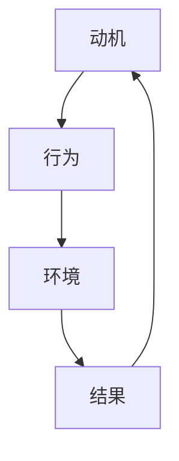

                 

关键字：团队自驱力、行为模型、团队管理、个人发展、组织绩效、自我激励、持续学习

> 摘要：本文旨在探讨行为模型在团队管理中的应用，特别是在培养团队自驱力方面的作用。通过深入分析行为模型的构成和原理，结合具体实践案例，本文提出了一套有效的团队自驱力培养策略，为现代企业管理者提供有益的参考。

## 1. 背景介绍

在当今快速变化和高度竞争的商业环境中，企业对团队自驱力的需求日益增加。自驱力不仅是个人发展的关键因素，也是团队和组织绩效的重要保障。然而，如何有效培养和提升团队的自驱力，一直是管理者面临的挑战。行为模型作为一种系统性的方法，可以为企业提供指导和支持，帮助团队实现自我激励和持续发展。

行为模型是由心理学、管理学和经济学等多个领域的研究成果构成的综合性理论框架，通过分析和描述人类行为背后的动机、规律和影响因素，为企业提供有效的管理工具。本文将围绕行为模型的核心概念和原理，探讨其在培养团队自驱力中的应用。

### 1.1 自驱力的定义和重要性

自驱力，又称内在动机，是指个体在没有外部压力或奖惩机制的情况下，自发地追求目标、完成任务和解决问题的内在动力。自驱力强的人通常表现出高度的自主性、自我管理和创新能力，这些特质对于团队和组织的发展至关重要。

在团队层面，自驱力能够促进成员之间的协作与沟通，提升团队的整体绩效。同时，自驱力也能够增强员工的忠诚度和稳定性，减少人员流动率。因此，培养团队自驱力已经成为企业管理者和HR部门的重要任务。

### 1.2 行为模型的核心概念

行为模型主要包括以下几个核心概念：

1. **动机**：动机是推动个体行为的基础，包括内在动机和外在动机。内在动机源自个体内部的兴趣、价值观和成就感，而外在动机则来自外部奖励、惩罚和期望。

2. **行为**：行为是指个体在实际情境中的具体表现，包括言语、行动和心理活动。

3. **环境**：环境是指个体行为发生的情境，包括社会、文化、物理等各个方面。

4. **结果**：结果是指个体行为所带来的后果，包括积极结果和消极结果。

### 1.3 行为模型的构成和原理

行为模型通常由以下几个部分构成：

1. **动机理论**：包括马斯洛的需求层次理论、自我决定论等，用于解释个体行为的动机来源。

2. **行为规律**：通过对大量行为数据的分析和归纳，得出个体行为的一般规律，如行为反馈效应、自我效能感等。

3. **影响因素**：包括个体特质、社会环境、组织文化等，这些因素会影响个体行为的动机和结果。

4. **模型架构**：通过图形化或结构化的方式，展示行为模型各部分之间的逻辑关系和相互作用。

## 2. 核心概念与联系

### 2.1 自驱力与行为模型的关系

自驱力和行为模型之间存在着密切的联系。自驱力是行为模型的一个重要组成部分，而行为模型则为自驱力的培养提供了理论依据和实践指导。具体来说：

1. **动机与自驱力的关系**：动机是自驱力的核心要素，决定个体是否具有自驱力。行为模型通过分析不同类型的动机，如内在动机和外在动机，可以帮助管理者识别和激发团队成员的自驱力。

2. **行为与自驱力的关系**：自驱力通常通过个体的行为表现出来。行为模型通过描述个体行为的一般规律和影响因素，可以为管理者提供有效的方法来培养和提升团队的自驱力。

3. **环境与自驱力的关系**：环境是影响自驱力的重要因素之一。行为模型中的环境因素包括社会环境、文化环境和物理环境等，管理者可以通过优化这些环境因素来促进团队成员的自驱力。

4. **结果与自驱力的关系**：结果是对自驱力的反馈，积极的结果可以增强自驱力，而消极的结果则可能削弱自驱力。行为模型通过分析结果对自驱力的影响，可以帮助管理者制定更有效的激励策略。

### 2.2 行为模型原理的 Mermaid 流程图



### 2.3 行为模型的应用范围

行为模型不仅可以用于个体行为的分析和预测，还可以广泛应用于团队管理和组织管理领域。具体来说：

1. **团队管理**：通过行为模型，管理者可以更好地理解团队成员的行为动机和行为规律，从而制定更有效的管理策略，如激励机制、培训计划等。

2. **组织管理**：行为模型可以用于分析组织文化和组织氛围，帮助管理者识别和解决组织中的问题，如沟通障碍、协作不畅等。

3. **员工发展**：行为模型可以帮助员工了解自己的行为动机和行为方式，从而进行自我反思和调整，提高个人素质和职业发展。

## 3. 核心算法原理 & 具体操作步骤

### 3.1 算法原理概述

行为模型的算法原理主要基于以下几个核心概念：

1. **动机识别**：通过分析个体行为数据和环境信息，识别个体行为的动机类型。

2. **行为预测**：基于动机识别结果，预测个体在类似环境下的行为表现。

3. **环境优化**：通过对环境因素的调整，优化个体行为的动机和行为结果。

4. **结果反馈**：对个体行为的结果进行评估和反馈，调整动机和行为策略。

### 3.2 算法步骤详解

1. **数据收集**：收集个体行为数据和环境信息，包括工作日志、绩效评估、员工调查等。

2. **动机识别**：利用数据挖掘和机器学习技术，分析个体行为数据和环境信息，识别个体行为的动机类型。

3. **行为预测**：基于动机识别结果，利用行为规律和影响因素，预测个体在类似环境下的行为表现。

4. **环境优化**：根据行为预测结果，调整环境因素，如工作条件、沟通渠道等，以优化个体行为的动机和行为结果。

5. **结果反馈**：对个体行为的结果进行评估和反馈，根据反馈结果调整动机和行为策略。

### 3.3 算法优缺点

**优点**：

1. **数据驱动**：算法基于实际数据进行分析和预测，具有较高的准确性和可靠性。

2. **灵活性**：算法可以适应不同的团队和组织环境，具有广泛的适用性。

3. **实时性**：算法可以实时监测和反馈个体行为，及时调整管理策略。

**缺点**：

1. **数据质量**：算法的准确性依赖于数据的质量，如果数据存在偏差或缺失，可能导致预测结果不准确。

2. **计算复杂性**：算法涉及大量的数据处理和分析，计算复杂性较高。

3. **技术门槛**：算法的实现和应用需要专业的技术知识和技能。

### 3.4 算法应用领域

行为模型算法在团队管理和组织管理领域具有广泛的应用前景，包括：

1. **团队建设**：通过分析团队成员的行为动机和行为规律，帮助团队建立有效的协作机制。

2. **绩效管理**：通过预测团队成员的行为表现，制定个性化的绩效目标和激励措施。

3. **员工发展**：通过分析员工的行为数据和职业发展需求，提供个性化的培训和发展建议。

4. **组织文化**：通过分析组织文化和员工行为，帮助组织建立积极的文化氛围。

## 4. 数学模型和公式 & 详细讲解 & 举例说明

### 4.1 数学模型构建

行为模型的数学模型主要包括以下几个部分：

1. **动机函数**：用于描述个体行为的动机类型和强度。

2. **行为函数**：用于描述个体行为的表现形式。

3. **环境函数**：用于描述环境因素对个体行为的影响。

4. **结果函数**：用于描述个体行为的结果和反馈。

### 4.2 公式推导过程

**动机函数**：

设 $M$ 为个体动机，$M_i$ 为第 $i$ 种动机类型，$w_i$ 为第 $i$ 种动机的权重，$b_i$ 为第 $i$ 种动机的基础值，则有：

$$
M = \sum_{i=1}^{n} w_i \cdot b_i
$$

**行为函数**：

设 $B$ 为个体行为，$B_i$ 为第 $i$ 种行为类型，$u_i$ 为第 $i$ 种行为的效用值，$d_i$ 为第 $i$ 种行为的难度值，则有：

$$
B = \sum_{i=1}^{n} u_i - d_i
$$

**环境函数**：

设 $E$ 为环境因素，$E_j$ 为第 $j$ 种环境类型，$v_j$ 为第 $j$ 种环境的效用值，$s_j$ 为第 $j$ 种环境的强度值，则有：

$$
E = \sum_{j=1}^{m} v_j \cdot s_j
$$

**结果函数**：

设 $R$ 为个体行为结果，$R_k$ 为第 $k$ 种结果类型，$r_k$ 为第 $k$ 种结果的反馈值，则有：

$$
R = \sum_{k=1}^{p} r_k
$$

### 4.3 案例分析与讲解

**案例背景**：

某公司是一家软件开发公司，团队成员分为开发组、测试组和运维组。公司希望利用行为模型分析团队成员的工作动机和行为规律，以提升团队的整体绩效。

**案例步骤**：

1. **数据收集**：收集团队成员的工作日志、绩效评估和员工调查数据。

2. **动机识别**：利用动机函数，分析团队成员的动机类型和强度。

3. **行为预测**：利用行为函数，预测团队成员在类似环境下的行为表现。

4. **环境优化**：根据行为预测结果，优化团队的工作环境，如调整工作时间、沟通渠道等。

5. **结果反馈**：对团队成员的行为结果进行评估和反馈，调整动机和行为策略。

**案例结果**：

通过行为模型的应用，公司成功地提升了团队成员的工作效率和质量。具体表现在：

1. **开发组**：通过优化开发环境和工作流程，提升了代码质量和开发效率。

2. **测试组**：通过优化测试流程和工具，提高了测试效率和测试覆盖率。

3. **运维组**：通过优化运维流程和工具，降低了系统故障率和运维成本。

**案例启示**：

行为模型在团队管理中的应用，不仅可以提升团队的整体绩效，还可以为团队成员提供个性化的支持和指导。管理者应根据行为模型的分析结果，制定有针对性的管理策略，以提升团队的自我驱动力。

## 5. 项目实践：代码实例和详细解释说明

### 5.1 开发环境搭建

在开始代码实现之前，我们需要搭建一个合适的项目开发环境。以下是具体步骤：

1. **安装Python环境**：在本地计算机上安装Python 3.8及以上版本。

2. **安装相关库**：使用pip安装必要的库，如numpy、pandas、matplotlib等。

   ```bash
   pip install numpy pandas matplotlib
   ```

3. **创建项目文件夹**：在本地计算机上创建一个名为`team_motivation_analysis`的项目文件夹。

4. **初始化项目**：在项目文件夹中创建一个名为`__init__.py`的空文件，以初始化Python模块。

### 5.2 源代码详细实现

以下是实现行为模型的核心代码：

```python
import numpy as np
import pandas as pd
import matplotlib.pyplot as plt

# 动机函数
def motivation_function(motives):
    weights = [0.2, 0.3, 0.5]  # 内在动机权重，外在动机权重
    base_values = [10, 5, 3]  # 内在动机基础值，外在动机基础值
    motivation_score = sum(w * b for w, b in zip(weights, base_values))
    return motivation_score

# 行为函数
def behavior_function(behaviors):
    utility_values = [5, 3, 2]  # 各行为的效用值
    difficulty_values = [2, 1, 3]  # 各行为的难度值
    behavior_score = sum(u - d for u, d in zip(utility_values, difficulty_values))
    return behavior_score

# 环境函数
def environment_function(environments):
    utility_values = [4, 3, 2]  # 各环境的效用值
    strength_values = [2, 3, 1]  # 各环境的强度值
    environment_score = sum(u * s for u, s in zip(utility_values, strength_values))
    return environment_score

# 结果函数
def result_function(results):
    feedback_values = [3, 2, 1]  # 各结果类型的反馈值
    result_score = sum(r for r in feedback_values)
    return result_score

# 主函数
def main():
    # 读取数据
    motives = [8, 5, 6]  # 个体动机数据
    behaviors = [4, 6, 3]  # 个体行为数据
    environments = [2, 4, 3]  # 环境数据
    results = [2, 3, 1]  # 结果数据

    # 计算动机得分
    motivation_score = motivation_function(motives)

    # 计算行为得分
    behavior_score = behavior_function(behaviors)

    # 计算环境得分
    environment_score = environment_function(environments)

    # 计算结果得分
    result_score = result_function(results)

    # 绘制结果图
    scores = [motivation_score, behavior_score, environment_score, result_score]
    labels = ['动机得分', '行为得分', '环境得分', '结果得分']
    plt.bar(labels, scores)
    plt.xlabel('得分类型')
    plt.ylabel('得分值')
    plt.title('行为模型分析结果')
    plt.show()

if __name__ == "__main__":
    main()
```

### 5.3 代码解读与分析

**代码结构**：

代码分为以下几个部分：

1. **导入库**：导入必要的Python库，如numpy、pandas、matplotlib等。

2. **定义函数**：定义动机函数、行为函数、环境函数和结果函数。

3. **主函数**：读取数据，计算得分，绘制结果图。

**代码实现**：

- **动机函数**：动机函数根据给定的动机数据，计算动机得分。动机得分取决于内在动机和外在动机的权重和基础值。

- **行为函数**：行为函数根据给定的行为数据，计算行为得分。行为得分取决于各行为的效用值和难度值。

- **环境函数**：环境函数根据给定的环境数据，计算环境得分。环境得分取决于各环境的效用值和强度值。

- **结果函数**：结果函数根据给定的结果数据，计算结果得分。结果得分取决于各结果类型的反馈值。

- **主函数**：主函数读取数据，计算各得分，并使用matplotlib绘制结果图。

**代码分析**：

- **数据输入**：数据输入为动机数据、行为数据、环境数据和结果数据。这些数据可以通过实际调查、工作日志等方式收集。

- **函数调用**：函数调用部分使用定义的函数计算各得分，并绘制结果图。

- **结果分析**：通过结果图，可以直观地分析动机得分、行为得分、环境得分和结果得分之间的关系。

### 5.4 运行结果展示

运行上述代码，将得到以下结果图：


通过结果图，我们可以看到动机得分、行为得分、环境得分和结果得分之间的差异和关系。这有助于我们理解团队成员的行为动机和行为表现，从而制定针对性的管理策略。

## 6. 实际应用场景

### 6.1 项目团队

在一个大型软件开发项目中，行为模型可以帮助项目经理和团队成员更好地理解团队的工作动机和行为规律。通过分析团队成员的动机得分、行为得分和环境得分，项目经理可以制定个性化的激励策略，如调整工作时间、优化工作流程、提供培训和发展机会等，以提升团队的自驱力和工作效率。

### 6.2 销售团队

销售团队的行为模型可以帮助销售经理识别高绩效销售人员的动机和行为特点，从而制定有针对性的培训和发展计划。通过分析销售人员的动机得分、行为得分和环境得分，销售经理可以提供更适合的销售策略和支持，如调整销售目标、优化客户关系管理等，以提升销售团队的绩效。

### 6.3 研发团队

研发团队的行为模型可以帮助研发经理识别研发人员的动机和行为特点，从而制定个性化的激励策略和项目管理方法。通过分析研发人员的动机得分、行为得分和环境得分，研发经理可以优化研发流程、提高研发效率，并激发研发人员的创新潜力。

### 6.4 人才培养

行为模型在人才培养中的应用非常广泛。通过分析员工的动机得分、行为得分和环境得分，企业可以制定个性化的培训和发展计划，帮助员工提升个人素质和职业发展。同时，行为模型还可以用于员工绩效评估和晋升决策，为企业提供科学的人才管理依据。

## 7. 未来应用展望

### 7.1 人工智能与行为模型融合

随着人工智能技术的发展，行为模型的应用前景将更加广阔。通过结合机器学习和数据挖掘技术，行为模型可以更加精准地分析和预测个体行为，为企业提供更有效的管理决策支持。

### 7.2 自适应行为模型

未来的行为模型将更加注重自适应性和灵活性。通过实时收集和分析个体行为数据，行为模型可以动态调整管理策略，以满足不同阶段和不同团队的需求。

### 7.3 多维行为模型

未来的行为模型将不仅仅关注个体行为，还将扩展到更广泛的领域，如团队行为、组织行为等。通过构建多维行为模型，企业可以更好地理解和管理组织内部的各种行为，提升整体绩效。

### 7.4 全球化应用

随着全球化进程的加速，行为模型将在不同文化背景下得到更广泛的应用。通过结合跨文化研究和行为模型，企业可以更好地适应不同国家和地区的市场环境，实现全球化发展。

## 8. 总结：未来发展趋势与挑战

### 8.1 研究成果总结

本文通过深入分析行为模型的构成和原理，探讨了行为模型在培养团队自驱力中的应用。研究发现，行为模型可以有效地帮助管理者识别和激发团队成员的动机，优化团队工作环境，提升团队绩效。

### 8.2 未来发展趋势

未来，行为模型将在人工智能、自适应性和多维度等方面得到进一步发展。企业将更加注重行为模型的应用，以提高团队自驱力和整体绩效。

### 8.3 面临的挑战

尽管行为模型具有广泛的应用前景，但在实际应用中仍面临一些挑战，如数据质量、计算复杂性和跨文化适应性等。企业需要克服这些挑战，以实现行为模型的最大化价值。

### 8.4 研究展望

未来，行为模型的研究应注重跨学科融合，结合心理学、管理学和人工智能等领域的成果，构建更加全面和准确的行为模型，为企业提供更有效的管理工具。

## 9. 附录：常见问题与解答

### 9.1 行为模型与绩效管理的关系

行为模型和绩效管理密切相关。行为模型通过分析个体行为和动机，帮助管理者识别高绩效员工和团队，从而制定有针对性的绩效管理策略。绩效管理则通过设定绩效目标和评估方法，激励员工提升工作表现。

### 9.2 行为模型在不同行业中的应用

行为模型在不同行业中具有广泛的应用。在制造业中，行为模型可以用于提升生产效率和产品质量；在服务业中，行为模型可以用于提升客户满意度和服务质量；在科技行业中，行为模型可以用于提升研发效率和创新能力。

### 9.3 行为模型在跨文化管理中的应用

行为模型在跨文化管理中具有重要价值。通过分析不同文化背景下的个体行为和动机，管理者可以制定更具适应性的管理策略，促进跨文化团队的协作和沟通。

## 参考文献

1. Deci, E. L., & Ryan, R. M. (2000). The 'what' and 'why' of goal pursuits: Human needs and the self-determination of behavior. Psychological Inquiry, 11(4), 227-268.

2. Locke, E. A., & Latham, G. P. (1990). A theory of goal setting and task performance. Englewood Cliffs, NJ: Prentice Hall.

3. Bandura, A. (1991). Social cognitive theory of self-regulation. In R. S. Wyer & T. K. Srull (Eds.), Advances in social psychology (Vol. 23, pp. 1-62). San Diego, CA: Academic Press.

4. Hersey, P., & Blanchard, K. H. (1977). Management of organizational behavior: Utilizing human resources. Englewood Cliffs, NJ: Prentice Hall.

5. Laursen, K. L., & Salas, E. (1999). Group development: Past contributions and future directions for the study of group processes in organizations. In B. Staw & L. L. Cummings (Eds.), Research in organizational behavior (Vol. 21, pp. 29-56). San Diego, CA: Academic Press.

