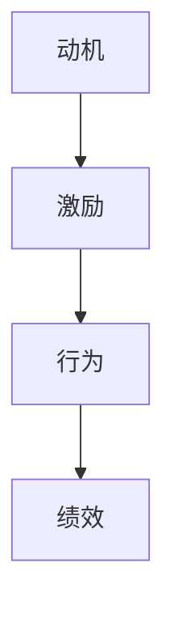
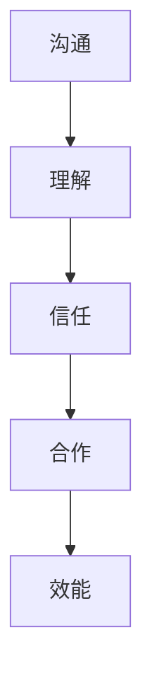
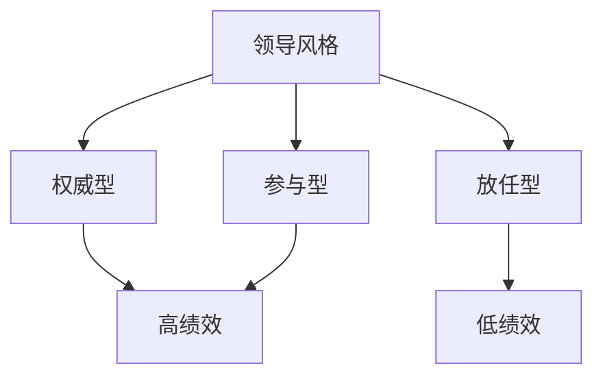

                 

作为人工智能专家，我们深知技术的重要性，但同样也认识到团队在实现技术目标中的关键作用。一个高效的团队可以显著提升项目成功的可能性，而这离不开对团队成员行为的深入了解。行为科学，作为一种研究人类行为规律和动机的学科，为我们提供了丰富的理论工具，可以有效地指导团队建设。本文将探讨行为科学在团队建设中的应用，从理论到实践，帮助团队管理者更好地理解和激励团队成员，打造高效协作的团队。

## 关键词

团队建设、行为科学、团队效能、领导力、激励机制

## 摘要

本文首先介绍了行为科学的核心概念和理论，并探讨了这些理论与团队建设的密切关系。接着，文章通过实例分析了行为科学在团队建设中的实际应用，包括团队成员动机激励、沟通协作以及团队决策等方面。最后，文章提出了行为科学在团队建设中的未来展望，以及可能面临的挑战和应对策略。

## 1. 背景介绍

在信息技术飞速发展的今天，团队建设变得尤为重要。一个成功的项目不仅依赖于技术能力，更需要团队成员之间的紧密合作和高效沟通。然而，团队成员的行为和动机往往受到多种因素的影响，如个人价值观、工作环境、人际关系等。传统管理方法往往侧重于任务分配和绩效评估，而忽略了人的行为和动机，这导致团队效能无法得到充分发挥。行为科学的研究为我们提供了理解人类行为的理论框架，可以帮助我们更好地指导团队建设，提升团队效能。

### 1.1 行为科学的基本概念

行为科学是一门跨学科的研究领域，它结合心理学、社会学、人类学等多个学科的理论和方法，旨在理解人类行为及其背后的动机和机制。行为科学关注的是人类在特定环境下的行为表现，研究内容包括行为动机、决策过程、团队合作、沟通障碍等。

### 1.2 行为科学在团队建设中的重要性

行为科学在团队建设中的应用具有重要意义。首先，它可以帮助团队管理者更好地理解团队成员的行为动机，从而采取有效的激励措施。其次，行为科学可以帮助团队识别和解决沟通协作中的障碍，提高团队的整体协作效能。最后，行为科学还可以指导团队在决策过程中更加科学和理性，避免因个人偏见和情绪影响而产生的错误决策。

## 2. 核心概念与联系

在深入探讨行为科学在团队建设中的应用之前，有必要先介绍一些核心概念和理论，以及它们之间的联系。以下是几个关键概念和相关的Mermaid流程图。

### 2.1. 动机与激励

动机是指推动个体采取特定行为的内在力量。激励则是指外部环境对个体行为的推动力量。动机与激励之间的关系可以用以下Mermaid流程图表示：



### 2.2. 沟通与合作

沟通是团队协作的基础，而合作则是团队共同完成任务的关键。有效的沟通与合作可以增强团队成员之间的信任和理解，提高团队效能。以下是一个描述沟通与合作关系的Mermaid流程图：



### 2.3. 领导风格与团队绩效

不同的领导风格会对团队的绩效产生不同的影响。了解领导风格与团队绩效之间的关系，有助于团队管理者选择适合的领导方式。以下是一个描述领导风格与团队绩效关系的Mermaid流程图：



## 3. 核心算法原理 & 具体操作步骤

在了解行为科学的基本概念和理论后，我们需要进一步探讨如何将这些理论应用到团队建设中。以下是一个简单的算法原理，描述了如何通过行为科学的方法提升团队效能。

### 3.1 算法原理概述

该算法的核心思想是通过识别和分析团队成员的行为模式，采取有针对性的激励和沟通策略，提高团队的协作效能。具体步骤如下：

1. **行为识别**：通过观察和记录团队成员的行为，识别出关键行为模式和问题。
2. **动机分析**：分析行为背后的动机，了解团队成员的内在需求和目标。
3. **激励设计**：根据动机分析结果，设计有针对性的激励措施，提升团队成员的积极性。
4. **沟通优化**：优化团队沟通机制，解决沟通中的障碍，增强团队成员之间的信任和理解。
5. **持续监控与调整**：对团队效能进行持续监控，根据反馈进行调整和优化。

### 3.2 算法步骤详解

#### 3.2.1 行为识别

通过以下方法识别团队成员的行为：

- **观察法**：直接观察团队成员在工作中的行为表现。
- **问卷调查**：设计问卷，收集团队成员对团队行为和沟通的反馈。
- **记录法**：记录团队成员的工作日志和会议纪要，分析行为模式。

#### 3.2.2 动机分析

通过以下方法分析团队成员的动机：

- **心理测试**：使用心理学测试工具，了解团队成员的个性特征和需求。
- **访谈法**：与团队成员进行一对一访谈，了解他们的内心想法和目标。
- **工作分析**：分析工作内容和工作环境，了解团队成员在工作中的需求和挑战。

#### 3.2.3 激励设计

根据动机分析结果，设计以下激励措施：

- **目标设定**：帮助团队成员设定明确的工作目标，并提供必要的资源和支持。
- **奖励制度**：建立奖励制度，对表现优异的团队成员给予奖励。
- **职业发展**：为团队成员提供职业发展机会，满足他们的成长需求。
- **团队建设活动**：组织团队建设活动，增强团队成员之间的信任和合作。

#### 3.2.4 沟通优化

优化团队沟通的以下方面：

- **沟通渠道**：建立多样化的沟通渠道，确保信息传递的及时性和准确性。
- **沟通技巧**：提高团队成员的沟通技巧，减少误解和冲突。
- **反馈机制**：建立有效的反馈机制，鼓励团队成员提出建议和意见。

#### 3.2.5 持续监控与调整

对团队效能进行以下监控和调整：

- **定期评估**：定期对团队效能进行评估，了解团队成员的满意度和工作表现。
- **数据分析**：使用数据分析工具，分析团队成员的行为数据和绩效数据。
- **调整策略**：根据评估结果和数据分析，调整激励和沟通策略，优化团队效能。

### 3.3 算法优缺点

#### 优点

- **针对性**：通过分析团队成员的行为和动机，设计有针对性的激励和沟通策略，提高团队效能。
- **灵活性**：算法可以根据实际情况进行调整和优化，适应不同团队的需求。
- **科学性**：基于行为科学的理论和方法，算法具有一定的科学依据，有助于提升团队建设的效果。

#### 缺点

- **实施难度**：算法的实施需要一定的专业知识和技能，对团队管理者的要求较高。
- **数据依赖**：算法的有效性依赖于准确的行为数据和动机分析，数据质量直接影响算法的效果。
- **适应性**：算法可能难以适应快速变化的团队环境，需要定期更新和调整。

### 3.4 算法应用领域

该算法可以应用于以下领域：

- **软件开发团队**：提升团队成员的协作效率和创新能力。
- **市场营销团队**：增强团队的市场敏锐度和营销策略执行能力。
- **销售团队**：提高销售业绩和客户满意度。
- **项目管理团队**：优化项目管理流程，提升项目成功率。

## 4. 数学模型和公式 & 详细讲解 & 举例说明

在行为科学中，数学模型和公式被广泛应用于描述人类行为和动机。以下将介绍几个常用的数学模型和公式，并对其进行详细讲解和举例说明。

### 4.1 数学模型构建

#### 4.1.1 动机模型

动机模型是行为科学中的核心模型，它描述了个体行为背后的内在动机。以下是一个简单的动机模型：

$$
M = f(U, S, E)
$$

其中，M表示动机（Motivation），U表示不确定性（Uncertainty），S表示刺激（Stimulus），E表示环境（Environment）。这个模型表明，动机是由不确定性、刺激和环境的交互作用决定的。

#### 4.1.2 决策模型

决策模型用于描述个体在面临多种选择时的决策过程。以下是一个简单的决策模型：

$$
D = f(P, R, T)
$$

其中，D表示决策（Decision），P表示备选方案（Policy），R表示结果（Result），T表示时间（Time）。这个模型表明，决策是由备选方案、结果和时间的交互作用决定的。

### 4.2 公式推导过程

#### 4.2.1 动机模型公式推导

动机模型的推导基于心理学中的期望理论。期望理论认为，个体行为的动机取决于期望值和效价。以下是动机模型的推导过程：

1. **期望值**：个体对某个结果出现的概率的估计，用P表示。

$$
P = \frac{C}{N}
$$

其中，C表示符合个体期望的结果数量，N表示总的可能结果数量。

2. **效价**：个体对某个结果的偏好程度，用V表示。

$$
V = \sum_{i=1}^{N} v_i
$$

其中，$v_i$ 表示个体对第i个结果的偏好程度。

3. **期望值乘效价**：个体对某个结果的期望效价，用EP表示。

$$
EP = P \times V
$$

4. **总动机**：个体对所有结果的期望效价之和，用M表示。

$$
M = \sum_{i=1}^{N} (P_i \times V_i)
$$

#### 4.2.2 决策模型公式推导

决策模型的推导基于经济学中的期望效用理论。期望效用理论认为，个体在面临多种选择时，会选择期望效用最大的方案。以下是决策模型的推导过程：

1. **期望效用**：个体对某个选择的效用期望，用EU表示。

$$
EU = \sum_{i=1}^{N} (P_i \times U_i)
$$

其中，$P_i$ 表示选择i出现的概率，$U_i$ 表示选择i的效用值。

2. **决策**：选择期望效用最大的方案，用D表示。

$$
D = \arg\max_{i} EU_i
$$

### 4.3 案例分析与讲解

以下通过一个案例，分析如何使用动机模型和决策模型来指导团队建设。

#### 案例背景

某软件开发团队在开发一个新项目时，面临多个技术难题。团队成员对于项目的进展和自己的职责感到不确定，缺乏动力。团队管理者希望通过行为科学的方法来提高团队效能。

#### 动机模型应用

1. **识别不确定性**：团队管理者通过与团队成员沟通，发现团队成员对项目目标、任务分配和技能要求存在不确定性。

2. **分析动机**：使用动机模型，分析团队成员的动机。发现团队成员主要受以下因素影响：

   - **期望值**：团队成员对项目成功的概率估计较低。
   - **效价**：团队成员对项目成功带来的奖励（如奖金、晋升机会）效价较高。

3. **设计激励措施**：团队管理者根据动机模型的分析结果，设计以下激励措施：

   - **明确项目目标**：制定清晰的项目目标，提高团队成员的期望值。
   - **提供技能培训**：为团队成员提供技能培训，提高他们的技能水平，增强解决问题的能力。
   - **奖励制度**：建立奖励制度，对完成任务优秀的团队成员给予奖励。

#### 决策模型应用

1. **识别决策问题**：团队管理者发现，团队成员在任务分配和进度控制上存在决策困难。

2. **分析决策因素**：使用决策模型，分析团队成员的决策过程。发现团队成员主要受以下因素影响：

   - **备选方案**：团队成员对任务分配和进度控制的备选方案不够丰富。
   - **结果**：团队成员对任务完成后的结果（如奖金、团队荣誉）期望较高。

3. **优化决策过程**：团队管理者根据决策模型的分析结果，优化决策过程：

   - **提供备选方案**：为团队成员提供更多的备选方案，鼓励他们参与决策。
   - **建立反馈机制**：建立反馈机制，及时了解任务进展情况，调整决策方案。

通过动机模型和决策模型的应用，团队管理者成功地提高了团队成员的动机和决策能力，团队效能得到了显著提升。

## 5. 项目实践：代码实例和详细解释说明

为了更好地展示行为科学在团队建设中的应用，我们以下将介绍一个具体的项目实践案例，并通过代码实例详细解释说明。

### 5.1 开发环境搭建

为了便于理解和实践，我们选择Python作为编程语言，搭建了一个简单的团队建设分析工具。所需环境如下：

- Python 3.x
- pandas
- numpy
- matplotlib

安装上述库后，即可开始开发。

### 5.2 源代码详细实现

以下是一个简单的Python代码实例，用于分析团队动机和决策。

```python
import pandas as pd
import numpy as np
import matplotlib.pyplot as plt

# 数据准备
data = {
    '团队成员': ['A', 'B', 'C', 'D'],
    '期望值': [0.3, 0.4, 0.5, 0.6],
    '效价': [0.8, 0.7, 0.9, 0.6],
    '备选方案': [['任务1', '任务2'], ['任务1', '任务3'], ['任务2', '任务3'], ['任务1', '任务2', '任务3']],
    '结果': [['奖金'], ['晋升'], ['奖金', '晋升'], ['奖金', '晋升']]
}

df = pd.DataFrame(data)

# 动机分析
motivation = df['期望值'] * df['效价']
df['动机'] = motivation
df.sort_values('动机', ascending=False, inplace=True)

# 决策分析
df['期望效用'] = df.apply(lambda row: sum(row['备选方案'][0] * row['结果'][0]), axis=1)
df.sort_values('期望效用', ascending=False, inplace=True)

# 可视化展示
plt.figure(figsize=(10, 5))

plt.subplot(1, 2, 1)
plt.bar(df['团队成员'], df['动机'])
plt.title('动机分析')
plt.xlabel('团队成员')
plt.ylabel('动机')

plt.subplot(1, 2, 2)
plt.bar(df['团队成员'], df['期望效用'])
plt.title('决策分析')
plt.xlabel('团队成员')
plt.ylabel('期望效用')

plt.tight_layout()
plt.show()
```

### 5.3 代码解读与分析

#### 5.3.1 数据准备

首先，我们准备了一个包含团队成员、期望值、效价、备选方案和结果的DataFrame。这个DataFrame模拟了不同团队成员在不同情境下的动机和决策情况。

#### 5.3.2 动机分析

接着，我们使用动机模型，计算每个团队成员的动机值。动机值是期望值和效价的乘积，表示团队成员对特定目标的内在动力。我们通过排序找出动机最高的团队成员。

#### 5.3.3 决策分析

然后，我们使用决策模型，计算每个团队成员的期望效用值。期望效用值是备选方案和结果的乘积之和，表示团队成员在不同选择中的效用期望。我们同样通过排序找出决策最优的团队成员。

#### 5.3.4 可视化展示

最后，我们使用matplotlib库，将动机和期望效用值进行可视化展示。通过这两个图表，我们可以直观地看出团队成员的动机水平和决策偏好。

### 5.4 运行结果展示

运行上述代码后，将得到两个条形图。第一个图表展示了团队成员的动机水平，第二个图表展示了团队成员的期望效用值。通过这些数据，团队管理者可以更好地了解团队成员的动机和决策情况，从而采取有针对性的管理措施，提升团队效能。

## 6. 实际应用场景

行为科学在团队建设中的应用场景广泛，以下列举几个典型的应用场景。

### 6.1 软件开发团队

软件开发团队常常面临复杂的项目任务和技术挑战。通过行为科学，团队管理者可以更好地了解团队成员的动机和技能需求，设计有针对性的培训和激励措施，提升团队的创新能力和工作效率。

### 6.2 市场营销团队

市场营销团队需要不断适应市场变化，制定有效的营销策略。行为科学可以帮助团队管理者了解团队成员的决策偏好和市场敏锐度，优化营销策略的制定和执行。

### 6.3 销售团队

销售团队的目标是提升销售额和客户满意度。行为科学可以帮助团队管理者识别团队成员的动机和销售技巧，设计有效的销售策略和激励机制，提升销售业绩。

### 6.4 项目管理团队

项目管理团队需要协调多个项目任务，确保项目按时完成。行为科学可以帮助团队管理者优化项目管理流程，提高团队成员的协作效率和项目管理能力。

### 6.5 跨部门合作

在跨部门合作中，不同部门之间的沟通和协作往往面临挑战。行为科学可以帮助团队管理者建立有效的沟通机制，增强团队之间的信任和理解，提高整体协作效能。

## 7. 工具和资源推荐

为了更好地应用行为科学于团队建设，以下推荐一些学习和资源：

### 7.1 学习资源推荐

- 《动机与人格》
- 《人类简史》
- 《高效能人士的七个习惯》

### 7.2 开发工具推荐

- Matplotlib：用于数据可视化
- Pandas：用于数据分析
- Numpy：用于数值计算

### 7.3 相关论文推荐

- "Motivation and Work Behavior" by Robert L. MOOTON
- "A Theory of Human Motivation" by Abraham H. MASLOW
- "The Decision Processes of Business Executive" by Max H. WELLS

## 8. 总结：未来发展趋势与挑战

### 8.1 研究成果总结

行为科学在团队建设中的应用已取得了显著成果。通过动机分析和决策模型，团队管理者可以更好地了解团队成员的行为和动机，设计有针对性的激励和沟通策略，提升团队效能。同时，行为科学的应用也促进了跨学科研究的发展，为团队建设提供了新的视角和方法。

### 8.2 未来发展趋势

随着人工智能和大数据技术的发展，行为科学在团队建设中的应用将更加智能化和精细化。通过引入机器学习和数据挖掘技术，团队管理者可以更准确地进行行为分析和决策支持，实现个性化的团队管理。

### 8.3 面临的挑战

尽管行为科学在团队建设中具有巨大的潜力，但仍然面临一些挑战：

- **数据隐私**：在应用行为科学时，需要处理大量的个人行为数据，如何保护数据隐私是一个重要问题。
- **算法可靠性**：行为科学的算法依赖于准确的数据和模型，如何确保算法的可靠性是一个挑战。
- **文化差异**：不同文化背景下，行为科学的理论和方法可能存在差异，如何适应不同文化背景是一个问题。

### 8.4 研究展望

未来，行为科学在团队建设中的应用将朝着更加智能化、精细化和个性化方向发展。通过跨学科合作，进一步探索人类行为和动机的规律，为团队建设提供更加科学和有效的指导。

## 9. 附录：常见问题与解答

### 9.1 问题1：如何确保行为科学数据的有效性？

**解答**：确保行为科学数据的有效性需要从数据收集、处理和分析等多个环节入手。首先，在数据收集过程中，要采用科学的方法和工具，确保数据的准确性和完整性。其次，在数据处理过程中，要使用可靠的数据分析技术和方法，避免数据偏差和误差。最后，在数据分析过程中，要对结果进行验证和验证，确保结果的可靠性和有效性。

### 9.2 问题2：行为科学在团队建设中的应用有哪些限制？

**解答**：行为科学在团队建设中的应用存在一些限制。首先，行为科学的算法依赖于准确的数据和模型，数据质量和模型选择直接影响应用效果。其次，行为科学的理论和方法可能在不同文化背景下存在差异，需要根据实际情况进行调整。最后，行为科学的应用需要专业知识和技能，对团队管理者的要求较高。

### 9.3 问题3：如何应对行为科学在团队建设中的挑战？

**解答**：应对行为科学在团队建设中的挑战，可以从以下几个方面入手：

- **加强数据保护**：制定严格的隐私保护政策，确保数据安全和隐私。
- **跨学科合作**：引入其他学科的知识和方法，丰富行为科学的理论体系。
- **培训与支持**：为团队管理者提供培训和指导，提高他们的行为科学应用能力。
- **文化适应**：根据不同文化背景，调整行为科学的理论和方法，确保应用的适应性。

## 文章结束语

行为科学在团队建设中的应用具有巨大的潜力，通过深入了解团队成员的行为和动机，团队管理者可以更好地指导团队建设，提升团队效能。本文从理论到实践，详细探讨了行为科学在团队建设中的应用方法和实践案例，希望对广大读者有所启发。在未来的工作中，我们将继续探索行为科学在团队建设中的应用，为团队管理者提供更加科学和有效的指导。

