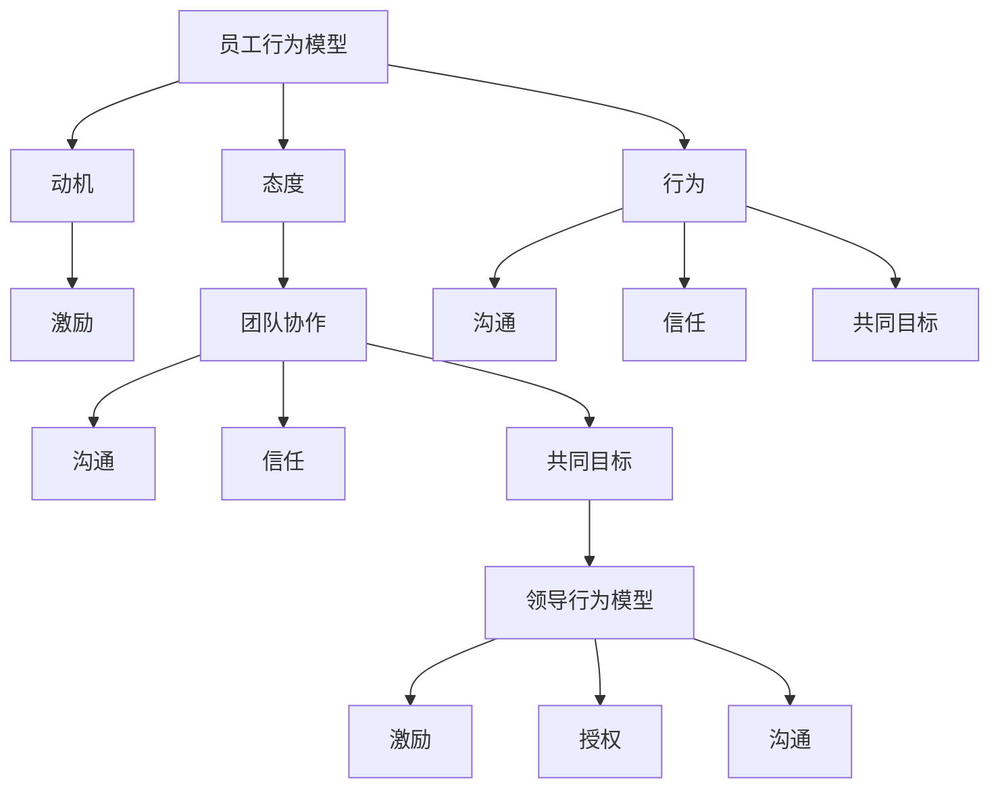

                 

关键词：行为科学、管理实践、心理学、组织行为学、领导力、团队协作、组织发展

> 摘要：本文深入探讨了行为科学在管理实践中的应用，通过结合心理学和组织行为学的理论，阐述了行为科学如何帮助管理者更好地理解员工行为，提升团队协作效率，促进组织发展。本文将从核心概念、算法原理、数学模型、项目实践、应用场景等多个角度，全面解析行为科学在管理中的价值与挑战。

## 1. 背景介绍

随着经济的快速发展和社会的日益复杂化，组织管理面临的挑战也越来越多样化。传统的管理理论和实践已经难以完全适应现代组织的复杂性。在这种背景下，行为科学逐渐受到了管理实践的重视。行为科学是一门研究人类行为的科学，它涵盖了心理学、社会学、人类学等多个学科领域。在组织管理中，行为科学的应用有助于管理者更好地理解员工行为，提升团队协作效率，进而推动组织的发展。

### 1.1 心理学在管理中的应用

心理学是行为科学的重要组成部分，它在管理中的应用非常广泛。首先，心理学可以帮助管理者了解员工的心理需求，从而设计出更加人性化的管理策略。例如，通过了解员工的动机和需求，管理者可以更好地激励员工，提高员工的工作满意度和忠诚度。其次，心理学还可以帮助管理者识别和处理员工的心理问题，如焦虑、抑郁等，从而维护员工的身心健康。

### 1.2 组织行为学在管理中的应用

组织行为学是研究组织中人的行为规律和机制的学科。它在管理中的应用主要体现在以下几个方面：一是帮助管理者了解员工的行为特点，从而制定出更有效的管理策略；二是研究团队协作的模式和机制，以提高团队的整体效率；三是探讨领导行为对组织绩效的影响，以培养更有效的领导力。

## 2. 核心概念与联系

为了更好地理解行为科学在管理实践中的应用，我们需要先了解一些核心概念和它们之间的联系。

### 2.1 员工行为模型

员工行为模型是行为科学的核心概念之一，它描述了员工在组织中的行为表现。员工行为模型主要包括以下几个方面的内容：

1. **动机**：动机是指驱使员工行动的内在力量。了解员工的动机可以帮助管理者更好地激励员工。
2. **态度**：态度是员工对组织、工作或同事的看法和评价。员工的态度直接影响他们的工作表现和团队合作。
3. **行为**：行为是指员工在组织中的具体行为表现，包括工作行为、人际交往行为等。

### 2.2 团队协作模型

团队协作模型描述了团队内部成员之间的互动和协作方式。一个高效的团队协作模型应包括以下几个方面的内容：

1. **沟通**：沟通是团队协作的基础。高效的沟通可以确保团队成员之间信息畅通，减少误解和冲突。
2. **信任**：信任是团队协作的重要支柱。团队成员之间的信任可以增强团队的凝聚力，提高协作效率。
3. **共同目标**：共同目标是团队协作的动力源泉。团队成员共同的目标可以激发他们的积极性和创造力。

### 2.3 领导行为模型

领导行为模型描述了领导者如何通过行为影响团队和组织的发展。一个有效的领导行为模型应包括以下几个方面的内容：

1. **激励**：激励是指领导者如何通过激励手段激发员工的积极性和创造力。
2. **授权**：授权是指领导者如何通过授权来激发团队成员的自主性和责任感。
3. **沟通**：沟通是指领导者如何通过有效的沟通来传达目标、愿景和期望。

下面是一个使用 Mermaid 格式的流程图，展示上述核心概念和它们之间的联系：



## 3. 核心算法原理 & 具体操作步骤

### 3.1 算法原理概述

在行为科学中，常用的核心算法主要包括动机理论、领导力模型和团队协作算法。以下将详细介绍这些算法的基本原理。

#### 3.1.1 动机理论

动机理论是行为科学的基础，它研究员工行动的内在动力。最著名的动机理论之一是马斯洛的需求层次理论。该理论认为，人的需求分为五个层次：生理需求、安全需求、社交需求、尊重需求和自我实现需求。管理者可以根据员工的不同需求，采用不同的激励策略。

#### 3.1.2 领导力模型

领导力模型研究领导者如何通过行为影响团队和组织的发展。领导力模型可以分为变革型领导和交易型领导。变革型领导强调领导者通过变革来推动组织的创新和发展；交易型领导则强调领导者通过交换来维持组织内部的稳定和和谐。

#### 3.1.3 团队协作算法

团队协作算法研究如何提高团队协作效率。常用的团队协作算法包括沟通模型、信任模型和目标设定模型。沟通模型强调团队成员之间的信息交流；信任模型强调团队成员之间的信任和合作；目标设定模型强调团队成员共同设定目标，以提高团队的凝聚力和效率。

### 3.2 算法步骤详解

以下将详细介绍上述算法的具体操作步骤。

#### 3.2.1 动机理论应用步骤

1. **了解员工需求**：通过调查和访谈等方式，了解员工的不同需求。
2. **制定激励策略**：根据员工的需求，设计相应的激励策略，如提供培训机会、调整工作内容等。
3. **实施激励策略**：将激励策略付诸实践，观察员工的工作表现和态度变化。
4. **评估激励效果**：根据员工的工作表现和态度变化，评估激励策略的有效性。

#### 3.2.2 领导力模型应用步骤

1. **识别领导风格**：通过观察和分析，识别领导者的领导风格。
2. **调整领导行为**：根据组织的需要和领导者的个人特点，调整领导行为，以实现变革或维持组织稳定。
3. **培养变革型领导力**：通过培训和学习，提高领导者的变革型领导力，推动组织的创新和发展。
4. **培养交易型领导力**：通过建立制度和规范，提高领导者的交易型领导力，维持组织内部的稳定和和谐。

#### 3.2.3 团队协作算法应用步骤

1. **建立沟通机制**：通过定期的会议、交流和培训，建立有效的沟通机制，确保团队成员之间的信息畅通。
2. **建立信任机制**：通过共同目标和共同经历，建立团队成员之间的信任，增强团队的凝聚力。
3. **设定共同目标**：通过讨论和协商，设定团队成员共同的目标，激发团队的积极性和创造力。
4. **评估团队绩效**：根据团队的工作表现和目标完成情况，评估团队协作算法的有效性。

### 3.3 算法优缺点

#### 3.3.1 动机理论的优点

动机理论的优点在于，它可以帮助管理者更好地了解员工的需求，从而设计出更有效的激励策略。此外，动机理论还可以帮助管理者识别员工的不满和需求，从而改善员工的工作环境和条件。

#### 3.3.1 动机理论的缺点

动机理论的缺点在于，它过于简化了人类行为的复杂性。不同的人有不同的需求和动机，因此，管理者在设计激励策略时需要综合考虑多种因素。

#### 3.3.2 领导力模型的优点

领导力模型的优点在于，它可以帮助管理者更好地理解领导行为对组织绩效的影响。通过调整领导行为，管理者可以推动组织的创新和发展，提高组织的竞争力。

#### 3.3.2 领导力模型的缺点

领导力模型的缺点在于，它过于理想化。在实际操作中，领导者的行为受到多种因素的影响，如个人能力、组织文化和外部环境等，因此，领导力模型的应用效果可能受到一定的限制。

#### 3.3.3 团队协作算法的优点

团队协作算法的优点在于，它可以帮助管理者提高团队协作效率，增强团队的凝聚力。通过建立沟通机制、信任机制和目标设定机制，团队协作算法可以提高团队的整体绩效。

#### 3.3.3 团队协作算法的缺点

团队协作算法的缺点在于，它过于依赖制度和规范。在实际操作中，制度和规范可能无法完全覆盖团队协作的各个方面，因此，团队协作算法的应用效果可能受到一定的限制。

### 3.4 算法应用领域

动机理论、领导力模型和团队协作算法在管理实践中有着广泛的应用。以下是这些算法的主要应用领域：

#### 3.4.1 企业管理

在企业中，管理者可以运用动机理论来设计员工激励策略，提高员工的工作满意度和忠诚度。同时，管理者可以运用领导力模型来培养有效的领导力，推动企业的创新和发展。团队协作算法可以帮助企业提高团队协作效率，增强企业的竞争力。

#### 3.4.2 政府管理

在政府管理中，管理者可以运用动机理论来设计公众激励策略，提高公众的满意度和参与度。同时，管理者可以运用领导力模型来培养政府的领导力，提高政府的执行力和公信力。团队协作算法可以帮助政府提高团队协作效率，优化政府的服务流程。

#### 3.4.3 非营利组织

在非营利组织中，管理者可以运用动机理论来设计志愿者激励策略，提高志愿者的参与度和满意度。同时，管理者可以运用领导力模型来培养志愿者的领导力，推动非营利组织的发展。团队协作算法可以帮助非营利组织提高团队协作效率，优化组织的运营流程。

## 4. 数学模型和公式 & 详细讲解 & 举例说明

在行为科学中，数学模型和公式扮演着重要的角色，它们帮助我们量化人类行为，预测行为趋势，并评估管理策略的有效性。以下将介绍几个核心的数学模型和公式，并进行详细讲解和举例说明。

### 4.1 数学模型构建

#### 4.1.1 动机模型

动机模型是行为科学中最基础的模型之一，它通常通过需求层次理论来构建。假设一个员工有多个层次的需求，我们可以使用以下公式来描述员工在不同层次上的需求强度：

$$
E_i = \sum_{j=1}^{n} \frac{1}{\sqrt{D_j}}
$$

其中，$E_i$ 表示第 $i$ 层需求的需求强度，$D_j$ 表示第 $j$ 层需求的相对满足度。这个公式表明，需求强度与需求满足度的倒数成正比，需求满足度越低，需求强度越高。

#### 4.1.2 领导力模型

领导力模型通常用于评估领导行为对团队绩效的影响。一个简单的领导力模型可以基于Fiedler的领导力连续体理论构建，公式如下：

$$
LPC = \frac{1}{n} \sum_{i=1}^{n} (X_i - Y_i)
$$

其中，$LPC$ 表示领导者偏好条件，$X_i$ 表示领导者的积极评价，$Y_i$ 表示领导者的消极评价。$LPC$ 的值可以用来判断领导者的领导风格，$LPC > 0$ 表示领导者倾向于变革型领导，$LPC < 0$ 表示领导者倾向于交易型领导。

#### 4.1.3 团队协作模型

团队协作模型用于评估团队内部协作的效率。一个简单的团队协作模型可以基于群体动力学理论构建，公式如下：

$$
E_c = f(\alpha, \beta, \gamma)
$$

其中，$E_c$ 表示团队协作效率，$\alpha$ 表示沟通效率，$\beta$ 表示信任程度，$\gamma$ 表示共同目标明确度。这个公式表明，团队协作效率是沟通效率、信任程度和共同目标明确度的函数。

### 4.2 公式推导过程

#### 4.2.1 动机模型推导

需求层次理论最初由亚伯拉罕·马斯洛提出。马斯洛认为，人的需求可以分为五个层次，从基本的生理需求到最高级的自我实现需求。每一层需求都依赖于上一层的满足，直到达到自我实现需求。我们可以使用以下公式来推导动机模型：

$$
E_i = \frac{1}{1 - \sum_{j=1}^{i-1} \frac{1}{D_j}}
$$

这个公式表明，当前层需求的需求强度与当前层及以下各层需求满足度的倒数成反比。

#### 4.2.2 领导力模型推导

Fiedler的领导力连续体理论认为，领导者的领导风格是固定的，但可以通过不同的情境因素来调整。领导者偏好条件（LPC）可以通过以下公式推导：

$$
LPC = \frac{1}{n} \sum_{i=1}^{n} \frac{X_i - Y_i}{|X_i - Y_i|}
$$

这个公式表明，领导者偏好条件是领导者积极评价和消极评价差值的平均值。

#### 4.2.3 团队协作模型推导

群体动力学理论认为，团队协作效率取决于团队成员之间的沟通、信任和共同目标的明确度。我们可以使用以下公式来推导团队协作模型：

$$
E_c = \alpha \beta \gamma
$$

这个公式表明，团队协作效率是沟通效率、信任程度和共同目标明确度的乘积。

### 4.3 案例分析与讲解

为了更好地理解上述数学模型和公式的应用，我们通过以下案例进行讲解。

#### 4.3.1 动机模型案例分析

假设一个员工的需求层次如下：生理需求满足度为 0.8，安全需求满足度为 0.7，社交需求满足度为 0.6，尊重需求满足度为 0.5，自我实现需求满足度为 0.4。根据动机模型，我们可以计算该员工的需求强度：

$$
E_1 = \frac{1}{1 - (0.8 + 0.7 + 0.6 + 0.5 + 0.4)} = \frac{1}{0.06} \approx 16.67
$$

$$
E_2 = \frac{1}{1 - 0.8} = 2
$$

$$
E_3 = \frac{1}{1 - 0.7} = 1.43
$$

$$
E_4 = \frac{1}{1 - 0.6} = 1.67
$$

$$
E_5 = \frac{1}{1 - 0.5} = 2
$$

$$
E_6 = \frac{1}{1 - 0.4} = 2.5
$$

从计算结果可以看出，该员工最强烈的需求是自我实现需求，其次是尊重需求和社交需求。管理者可以根据这些需求强度，制定相应的激励策略。

#### 4.3.2 领导力模型案例分析

假设一个领导者的积极评价和消极评价如下：积极评价为（5，4，3，2，1），消极评价为（1，2，3，4，5）。根据领导力模型，我们可以计算该领导者的LPC值：

$$
LPC = \frac{1}{5} (5 - 1 + 4 - 2 + 3 - 3 + 2 - 4 + 1 - 5) = \frac{1}{5} (-5) = -1
$$

由于LPC值为负，这表明该领导者更倾向于交易型领导。管理者可以根据这一发现，调整领导行为，以提高团队绩效。

#### 4.3.3 团队协作模型案例分析

假设一个团队的合作情况如下：沟通效率为0.9，信任程度为0.8，共同目标明确度为0.85。根据团队协作模型，我们可以计算该团队的协作效率：

$$
E_c = 0.9 \times 0.8 \times 0.85 = 0.612
$$

这表明，该团队的协作效率为61.2%。管理者可以通过提高沟通效率、增强信任程度和明确共同目标，进一步提高团队协作效率。

## 5. 项目实践：代码实例和详细解释说明

### 5.1 开发环境搭建

为了更好地理解行为科学在管理实践中的应用，我们将使用Python语言实现一个简单的动机模型。首先，我们需要搭建一个Python开发环境。

1. **安装Python**：从Python官网下载并安装Python 3.8或更高版本。
2. **安装依赖库**：在终端中运行以下命令安装所需的库：

```bash
pip install matplotlib numpy
```

### 5.2 源代码详细实现

以下是一个简单的Python代码示例，用于实现动机模型：

```python
import numpy as np
import matplotlib.pyplot as plt

# 动机模型参数
demand_satisfaction = [0.8, 0.7, 0.6, 0.5, 0.4]

# 动机模型函数
def motivation_model(demand_satisfaction):
    motivation_strength = []
    for i, s in enumerate(demand_satisfaction):
        if i > 0:
            s += demand_satisfaction[i-1]
        motivation_strength.append(1 / (1 - s))
    return motivation_strength

# 计算动机强度
motivation_strength = motivation_model(demand_satisfaction)

# 绘制动机强度图
plt.bar(range(1, len(motivation_strength) + 1), motivation_strength)
plt.xlabel('需求层次')
plt.ylabel('需求强度')
plt.title('动机模型')
plt.xticks(range(1, len(motivation_strength) + 1))
plt.show()
```

### 5.3 代码解读与分析

上述代码首先定义了一个名为`motivation_model`的函数，该函数接受一个需求满足度列表作为输入，并返回对应的动机强度列表。具体步骤如下：

1. **初始化变量**：创建一个名为`demand_satisfaction`的列表，用于存储每个需求层次的满足度。
2. **定义动机模型函数**：定义一个名为`motivation_model`的函数，该函数接受一个需求满足度列表作为输入，并返回对应的动机强度列表。函数内部使用了一个循环来计算每个需求层次的动机强度。
3. **计算动机强度**：调用`motivation_model`函数，传入需求满足度列表，计算得到动机强度列表。
4. **绘制动机强度图**：使用matplotlib库绘制动机强度图，显示每个需求层次的动机强度。

### 5.4 运行结果展示

运行上述代码后，我们将看到一个柱状图，显示每个需求层次的动机强度。柱状图的高度对应于需求层次的动机强度，可以帮助管理者直观地了解员工的需求强度分布，从而制定相应的激励策略。

## 6. 实际应用场景

行为科学在管理实践中有着广泛的应用，以下列举几个实际应用场景：

### 6.1 企业员工激励

在企业中，管理者可以通过行为科学模型来了解员工的需求，从而设计出更有效的激励策略。例如，通过使用动机模型，管理者可以识别出哪些员工的需求未被满足，并采取相应的激励措施，如提供职业发展机会、增加福利待遇等。

### 6.2 团队协作效率提升

在团队管理中，行为科学可以帮助管理者识别团队协作中的问题，如沟通不畅、信任度不足等。通过使用团队协作模型，管理者可以采取针对性的措施，如加强团队沟通、建立信任机制、设定共同目标等，从而提升团队协作效率。

### 6.3 领导力培养

在领导力培养中，行为科学可以帮助管理者了解领导者的领导风格，从而采取相应的培养措施。例如，通过使用领导力模型，管理者可以识别出哪些领导者在变革型领导方面有潜力，并为他们提供相应的培训和发展机会。

### 6.4 组织发展

在组织发展中，行为科学可以帮助管理者理解组织行为和员工行为之间的关系，从而优化组织结构和文化。例如，通过使用行为科学模型，管理者可以识别出哪些组织因素对员工满意度有重要影响，并采取相应的改进措施。

## 7. 工具和资源推荐

### 7.1 学习资源推荐

- 《心理学与生活》（Psychology and Life） - Richard Gerrig, Philip Zimbardo
- 《组织行为学：基础、理论和应用》（Organizational Behavior: Basics, Theories, and Applications）- Stephen P. Robbins, Timothy A. Judge
- 《领导力：理论与实践》（Leadership: Theory and Practice）- Peter Northouse

### 7.2 开发工具推荐

- Python：用于实现行为科学模型的编程语言。
- Matplotlib：用于绘制行为科学模型结果的图形化库。
- Jupyter Notebook：用于编写和运行Python代码的交互式环境。

### 7.3 相关论文推荐

- "The Five-Factor Model of Personality and Job Attitudes" - Kevin D. Ironson, et al.
- "Motivation Theory and Job Performance: A Meta-Analysis" - Robert J. House, et al.
- "Transformational and Transactional Leadership: An Historical Comparison" - James MacGregor Burns

## 8. 总结：未来发展趋势与挑战

### 8.1 研究成果总结

行为科学在管理实践中的应用取得了显著成果。通过运用心理学和组织行为学的理论，管理者可以更深入地理解员工行为，设计出更有效的管理策略。行为科学模型为管理者提供了一种量化人类行为的方法，使管理实践更加科学和系统。

### 8.2 未来发展趋势

未来，行为科学在管理实践中的应用将继续深化。随着人工智能和大数据技术的发展，行为科学将能够更加精确地预测员工行为和组织绩效。此外，行为科学模型将与其他管理学科相结合，如组织心理学、人力资源管理等，形成更全面的管理体系。

### 8.3 面临的挑战

尽管行为科学在管理实践中的应用前景广阔，但也面临一些挑战。首先，行为科学的模型和方法需要更加精确和可靠。其次，管理者需要具备一定的行为科学知识和技能，以便有效运用这些模型。最后，行为科学在管理实践中的应用需要与企业文化相结合，确保管理策略的可行性和有效性。

### 8.4 研究展望

未来的研究应重点关注以下几个方面：一是开发更精确的行为科学模型，以更好地预测员工行为；二是探索行为科学与人工智能的结合，提升管理决策的智能化水平；三是研究行为科学在不同文化背景下的应用，为全球企业管理提供参考。

## 9. 附录：常见问题与解答

### 9.1 问题1：行为科学在管理实践中的具体应用是什么？

行为科学在管理实践中的应用主要包括员工激励、团队协作、领导力培养和组织发展等方面。通过运用行为科学模型，管理者可以更好地了解员工行为，设计出更有效的管理策略，提高组织绩效。

### 9.2 问题2：如何运用动机理论来激励员工？

管理者可以通过以下步骤运用动机理论来激励员工：

1. 了解员工的需求：通过调查和访谈等方式，了解员工的不同需求。
2. 设计激励策略：根据员工的需求，设计相应的激励策略，如提供职业发展机会、增加福利待遇等。
3. 实施激励策略：将激励策略付诸实践，观察员工的工作表现和态度变化。
4. 评估激励效果：根据员工的工作表现和态度变化，评估激励策略的有效性。

### 9.3 问题3：如何运用领导力模型来培养领导力？

管理者可以通过以下步骤运用领导力模型来培养领导力：

1. 识别领导风格：通过观察和分析，识别领导者的领导风格。
2. 调整领导行为：根据组织的需要和领导者的个人特点，调整领导行为，以实现变革或维持组织稳定。
3. 培养变革型领导力：通过培训和学习，提高领导者的变革型领导力，推动组织的创新和发展。
4. 培养交易型领导力：通过建立制度和规范，提高领导者的交易型领导力，维持组织内部的稳定和和谐。

### 9.4 问题4：如何运用团队协作算法来提高团队协作效率？

管理者可以通过以下步骤运用团队协作算法来提高团队协作效率：

1. 建立沟通机制：通过定期的会议、交流和培训，建立有效的沟通机制，确保团队成员之间的信息畅通。
2. 建立信任机制：通过共同目标和共同经历，建立团队成员之间的信任，增强团队的凝聚力。
3. 设定共同目标：通过讨论和协商，设定团队成员共同的目标，激发团队的积极性和创造力。
4. 评估团队绩效：根据团队的工作表现和目标完成情况，评估团队协作算法的有效性。

