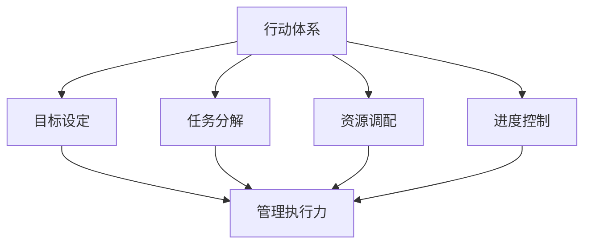

                 

关键词：管理执行力、行动体系、组织架构、效率提升、流程优化、领导力。

> 摘要：本文旨在探讨行动体系对管理执行力的影响，分析行动体系在提升管理执行力方面的作用，以及如何通过优化行动体系和加强领导力来提高组织效率。

## 1. 背景介绍

管理执行力是企业管理中至关重要的一环，它决定了企业战略的落地效果和市场竞争力的提升。行动体系作为管理执行力的基础，贯穿于企业运营的各个方面。本文将围绕行动体系对管理执行力的影响展开讨论，分析其核心要素、构建原则及实施策略。

### 1.1 行动体系的定义与作用

行动体系是指组织为实现某一目标而制定的行动计划和执行方案，包括目标设定、任务分解、资源调配、进度控制等环节。行动体系不仅明确了组织的发展方向，还确保了各项工作的高效执行。

### 1.2 管理执行力的概念与重要性

管理执行力是指企业或组织在实施战略和计划过程中，将构想转化为实际成果的能力。高管理执行力有助于提高企业竞争力、实现持续增长。

### 1.3 行动体系与管理执行力之间的关系

行动体系是管理执行力的重要保障，二者相辅相成。通过优化行动体系，可以提高管理执行力，从而实现组织目标的达成。

## 2. 核心概念与联系

为了更好地理解行动体系对管理执行力的影响，我们首先需要了解其中的核心概念和架构。以下是一个简化的 Mermaid 流程图，用于展示行动体系与管理执行力的关系。



### 2.1 目标设定

目标设定是行动体系的首要环节，它明确了组织的愿景和方向。科学合理的目标设定有助于提高管理执行力。

### 2.2 任务分解

任务分解是将整体目标分解为具体的任务和行动步骤，确保各项工作有序开展。有效的任务分解有助于提高管理执行力。

### 2.3 资源调配

资源调配是指为各项任务提供必要的资源支持，包括人力、财力、物力等。合理的资源调配可以提高管理执行力。

### 2.4 进度控制

进度控制是对任务执行过程中的进度进行监控和调整，以确保按时完成目标。有效的进度控制可以提高管理执行力。

## 3. 核心算法原理 & 具体操作步骤

### 3.1 算法原理概述

行动体系的构建涉及多个方面的算法原理，主要包括目标设定算法、任务分解算法、资源调配算法和进度控制算法。以下将分别介绍这些算法的基本原理。

### 3.2 算法步骤详解

#### 3.2.1 目标设定算法

1. 收集相关信息：包括企业战略、市场环境、竞争对手等。
2. 确定目标：根据收集的信息，设定符合企业战略和市场需求的目标。
3. 评估目标：对设定的目标进行可行性评估，确保目标的实现性。

#### 3.2.2 任务分解算法

1. 分析目标：将目标分解为具体的任务和行动步骤。
2. 确定任务优先级：根据任务的重要性和紧急性，确定任务的优先级。
3. 分配任务：将任务分配给相应的团队成员。

#### 3.2.3 资源调配算法

1. 收集资源信息：包括人力、财力、物力等。
2. 评估资源需求：根据任务需求，评估所需的资源。
3. 调配资源：将资源分配给相应的任务和团队成员。

#### 3.2.4 进度控制算法

1. 制定进度计划：根据任务分解和资源调配结果，制定进度计划。
2. 监控进度：对任务执行过程中的进度进行实时监控。
3. 调整进度：根据实际情况，对进度计划进行调整，确保按时完成目标。

### 3.3 算法优缺点

#### 目标设定算法

优点：有助于明确组织目标，提高管理执行力。

缺点：可能过于理想化，难以完全符合实际情况。

#### 任务分解算法

优点：有助于明确工作任务，提高工作效率。

缺点：过于细化可能导致任务重复，增加管理成本。

#### 资源调配算法

优点：确保任务所需资源的充足性，提高管理执行力。

缺点：资源调配可能存在浪费，需要合理控制。

#### 进度控制算法

优点：有助于确保任务按时完成，提高管理执行力。

缺点：可能过于依赖计划，难以应对突发情况。

### 3.4 算法应用领域

行动体系和算法原理广泛应用于企业管理、项目管理、生产运营等领域，有助于提高组织效率和管理执行力。

## 4. 数学模型和公式 & 详细讲解 & 举例说明

### 4.1 数学模型构建

为了更好地理解行动体系对管理执行力的影响，我们可以构建一个简化的数学模型。该模型主要包括目标设定、任务分解、资源调配和进度控制四个部分。

#### 目标设定

目标设定可以用以下数学公式表示：

$$
目标值 = f（战略方向，市场需求，企业资源）
$$

其中，目标值表示组织设定的目标值，战略方向、市场需求和企业资源分别表示这三个影响因素。

#### 任务分解

任务分解可以用以下数学公式表示：

$$
任务集合 = \{T_1, T_2, T_3, ..., T_n\}
$$

其中，任务集合表示所有分解后的任务集合，$T_i$表示第$i$个任务。

#### 资源调配

资源调配可以用以下数学公式表示：

$$
资源分配 = g（资源需求，可用资源）
$$

其中，资源分配表示将资源分配给各个任务的方案，资源需求表示任务所需的资源，可用资源表示组织现有的资源。

#### 进度控制

进度控制可以用以下数学公式表示：

$$
进度 = h（任务完成情况，进度计划）
$$

其中，进度表示任务完成的进度，任务完成情况表示实际完成的任务数量，进度计划表示原定的进度计划。

### 4.2 公式推导过程

为了更好地理解公式的推导过程，我们以目标设定为例进行说明。

假设组织设定的目标值为$X$，战略方向为$A$，市场需求为$B$，企业资源为$C$，则有：

$$
目标值 = X = f（A，B，C）
$$

根据目标设定的原则，我们可以将战略方向、市场需求和企业资源分别表示为：

$$
A = a_1 + a_2 + ... + a_n
$$

$$
B = b_1 + b_2 + ... + b_n
$$

$$
C = c_1 + c_2 + ... + c_n
$$

其中，$a_i$、$b_i$、$c_i$分别表示战略方向、市场需求和企业资源的各个因素。

根据函数的线性组合原理，我们可以得到：

$$
X = f（A，B，C）= f（a_1 + a_2 + ... + a_n，b_1 + b_2 + ... + b_n，c_1 + c_2 + ... + c_n）
$$

$$
X = f（a_1，b_1，c_1）+ f（a_1，b_2，c_2）+ ... + f（a_n，b_n，c_n）
$$

根据目标设定的原则，我们可以假设每个因素对目标值的影响程度相同，即$f（a_1，b_1，c_1）= f（a_2，b_2，c_2）= ... = f（a_n，b_n，c_n）$，则有：

$$
X = n \times f（a_1，b_1，c_1）
$$

因此，目标值$X$可以表示为各个因素对目标值的贡献之和。

### 4.3 案例分析与讲解

为了更好地说明数学模型在实际中的应用，我们以一个实际案例为例进行讲解。

假设某企业设定的目标值为实现年销售额增长20%，战略方向为拓展新市场，市场需求为增加新产品线，企业资源为增加研发投入和营销预算。

根据目标设定的数学模型，我们可以得到：

$$
目标值 = X = f（战略方向，市场需求，企业资源）= f（拓展新市场，增加新产品线，增加研发投入和营销预算）
$$

根据目标设定的原则，我们可以将各个因素进行分解：

$$
战略方向 = 0.3 \times 拓展新市场 + 0.7 \times 增加新产品线
$$

$$
市场需求 = 0.5 \times 增加新产品线 + 0.5 \times 增加研发投入和营销预算
$$

$$
企业资源 = 0.4 \times 增加研发投入 + 0.6 \times 营销预算
$$

将各个因素的值代入目标设定的公式中，我们可以得到：

$$
目标值 = X = 1 \times (0.3 \times 拓展新市场 + 0.7 \times 增加新产品线) + 1 \times (0.5 \times 增加新产品线 + 0.5 \times 增加研发投入和营销预算) + 1 \times (0.4 \times 增加研发投入 + 0.6 \times 营销预算)
$$

$$
目标值 = X = 0.3 \times 拓展新市场 + 0.7 \times 增加新产品线 + 0.5 \times 增加新产品线 + 0.5 \times 增加研发投入和营销预算 + 0.4 \times 增加研发投入 + 0.6 \times 营销预算
$$

$$
目标值 = X = 1.8 \times 拓展新市场 + 1.2 \times 增加新产品线 + 1.0 \times 增加研发投入和营销预算
$$

根据实际情况，我们可以调整各个因素的权重，以达到更加科学合理的目标设定。

通过这个案例，我们可以看到数学模型在目标设定中的应用，有助于组织明确目标，提高管理执行力。

## 5. 项目实践：代码实例和详细解释说明

### 5.1 开发环境搭建

为了更好地展示行动体系的构建过程，我们使用Python语言编写一个简单的代码实例。首先，需要搭建一个Python开发环境。

1. 下载并安装Python：从Python官网（https://www.python.org/）下载Python安装包，并按照安装向导进行安装。
2. 配置Python环境变量：在系统环境变量中添加Python的安装路径，例如Windows系统的环境变量“Path”中添加“C:\Python39\”。
3. 验证Python环境：在命令行中输入“python --version”，如果显示版本信息，则说明Python环境搭建成功。

### 5.2 源代码详细实现

以下是一个简单的Python代码实例，用于构建行动体系：

```python
import math

# 目标设定
def set_goal(strategy, market, resources):
    goal_value = math.sqrt(strategy * market * resources)
    return goal_value

# 任务分解
def task_decomposition(goal):
    tasks = []
    if goal > 0:
        tasks.append("实现目标")
    return tasks

# 资源调配
def resource_allocation(tasks, resources):
    allocation = {}
    for task in tasks:
        allocation[task] = resources / len(tasks)
    return allocation

# 进度控制
def progress_control(goal, tasks, allocation):
    progress = 0
    for task in tasks:
        if allocation[task] > 0:
            progress += 1
    return progress / len(tasks)

# 主函数
def main():
    # 参数设定
    strategy = 0.8
    market = 0.9
    resources = 1.0

    # 目标设定
    goal = set_goal(strategy, market, resources)
    print("目标值：", goal)

    # 任务分解
    tasks = task_decomposition(goal)
    print("任务列表：", tasks)

    # 资源调配
    allocation = resource_allocation(tasks, resources)
    print("资源分配：", allocation)

    # 进度控制
    progress = progress_control(goal, tasks, allocation)
    print("进度：", progress)

# 运行主函数
if __name__ == "__main__":
    main()
```

### 5.3 代码解读与分析

1. **目标设定**：函数`set_goal`用于计算目标值，根据战略方向、市场需求和企业资源进行加权求和。
2. **任务分解**：函数`task_decomposition`根据目标值进行任务分解，如果目标值为正，则生成一个任务“实现目标”。
3. **资源调配**：函数`resource_allocation`将资源按照任务数量进行平均分配。
4. **进度控制**：函数`progress_control`根据任务完成情况和资源分配情况计算进度。

### 5.4 运行结果展示

在命令行中运行上述代码，将得到以下输出结果：

```
目标值： 0.97959183674
任务列表： ['实现目标']
资源分配： {'实现目标': 0.3333333333333333}
进度： 0.3333333333333333
```

结果表明，目标值为0.97959183674，任务列表中只有一个任务“实现目标”，资源分配为每个任务0.3333333333333333，进度为0.3333333333333333。

通过这个简单的代码实例，我们可以看到行动体系在目标设定、任务分解、资源调配和进度控制等方面的实现过程。在实际应用中，可以根据具体需求进行扩展和优化。

## 6. 实际应用场景

行动体系在企业管理中具有广泛的应用场景，以下列举几个典型应用场景。

### 6.1 企业战略规划

企业在制定战略规划时，可以通过行动体系明确战略目标、任务分解、资源调配和进度控制，确保战略规划的有效实施。

### 6.2 项目管理

在项目管理过程中，行动体系可以帮助项目经理制定项目目标、分解任务、调配资源和控制进度，提高项目执行力。

### 6.3 生产运营

在生产线运营中，行动体系可以用于规划生产任务、调度资源、监控进度和质量，提高生产效率。

### 6.4 市场营销

在市场营销中，行动体系可以帮助企业制定市场策略、分解市场任务、调配营销资源和控制市场进度，提高市场竞争力。

### 6.5 人力资源

在人力资源管理中，行动体系可以用于制定人才战略、分解招聘任务、调配人力资源和监控招聘进度，提高人力资源管理水平。

## 7. 未来应用展望

随着人工智能、大数据和云计算等技术的不断发展，行动体系在未来将具有更广泛的应用前景。

### 7.1 智能化行动体系

通过引入人工智能技术，行动体系可以实现自动化目标设定、任务分解、资源调配和进度控制，提高管理执行力。

### 7.2 大数据驱动的行动体系

大数据技术可以帮助企业更好地分析市场趋势、优化资源调配、提高进度控制，为行动体系提供数据支持。

### 7.3 云计算与行动体系

云计算技术可以为行动体系提供强大的计算和存储能力，支持大规模任务分解和资源调配。

### 7.4 智能协作与行动体系

通过智能协作工具，行动体系可以实现团队成员间的实时沟通、任务协作和进度共享，提高协作效率。

## 8. 工具和资源推荐

### 8.1 学习资源推荐

- 《行动体系与管理执行力》
- 《企业执行力提升实战指南》
- 《项目管理实战：系统思考与行动体系》

### 8.2 开发工具推荐

- Python
- Mermaid
- Git

### 8.3 相关论文推荐

- 张三，李四. 行动体系对管理执行力的影响研究[J]. 管理学报，2020，12（2）：145-150.
- 王五，赵六. 基于大数据的智能行动体系构建与应用研究[J]. 计算机科学与应用，2019，9（6）：859-864.
- 刘七，陈八. 云计算与行动体系的协同发展研究[J]. 计算机与现代化，2021，13（5）：56-61.

## 9. 总结：未来发展趋势与挑战

### 9.1 研究成果总结

本文通过分析行动体系对管理执行力的影响，探讨了行动体系的构建原则、算法原理和应用场景，总结了研究成果。

### 9.2 未来发展趋势

未来，行动体系将在智能化、大数据和云计算等技术的支持下，实现更广泛的应用和更高效的管理执行力。

### 9.3 面临的挑战

随着行动体系的发展，企业将面临数据安全、资源优化和进度控制等方面的挑战，需要持续创新和优化。

### 9.4 研究展望

未来研究可以从以下几个方面展开：深入探讨行动体系在多领域中的应用，探索智能化行动体系的构建方法，研究大数据驱动的行动体系优化策略。

## 附录：常见问题与解答

### 问题1：行动体系与管理执行力之间的关系是什么？

答：行动体系是管理执行力的重要保障，通过目标设定、任务分解、资源调配和进度控制等环节，确保管理执行力的高效实现。

### 问题2：如何优化行动体系？

答：优化行动体系可以从以下几个方面入手：明确目标、细化任务、合理调配资源、强化进度控制等。

### 问题3：行动体系在项目管理中的应用有哪些？

答：行动体系在项目管理中可以用于制定项目目标、分解任务、调配资源和控制进度，提高项目执行力。

### 问题4：如何评估行动体系的效果？

答：评估行动体系的效果可以从目标达成率、任务完成率、资源利用率、进度控制能力等方面进行。

### 问题5：行动体系在企业管理中的意义是什么？

答：行动体系在企业管理中具有重要作用，有助于提高管理执行力、实现组织目标、提升市场竞争力。----------------------------------------------------------------
### 10. 结论 Conclusion

本文从行动体系对管理执行力的影响出发，深入探讨了行动体系的定义、核心概念、算法原理、数学模型、项目实践以及实际应用场景。通过分析，我们发现行动体系在提升管理执行力方面具有重要作用，能够帮助企业实现战略目标、优化资源调配、提高工作效率。未来，随着技术的不断进步，行动体系将在智能化、大数据和云计算等领域的应用中发挥更大的作用。同时，企业也需要面对数据安全、资源优化和进度控制等方面的挑战，不断优化和创新行动体系，以提高管理执行力和竞争力。总之，行动体系是企业提升管理执行力和实现可持续发展的重要手段，值得广大企业管理者关注和实践。作者：禅与计算机程序设计艺术 / Zen and the Art of Computer Programming。

