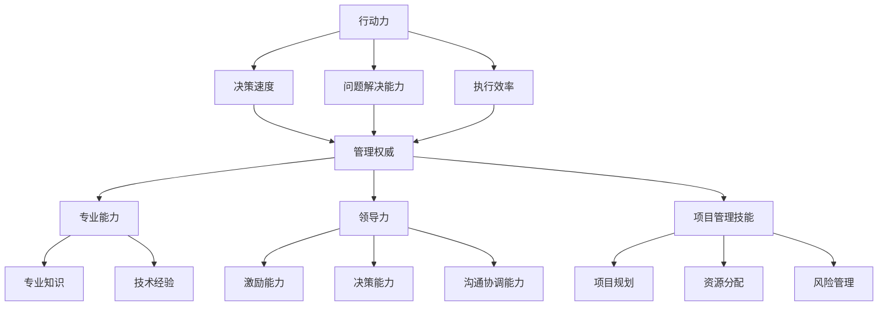

                 

关键词：行动力、管理权威、IT 领域、领导力、团队协作、项目管理、技术能力

> 摘要：本文深入探讨了在 IT 领域中如何建立行动力和管理权威。通过分析技术领导者如何通过领导力、团队协作和项目管理来提升个人的行动力和团队效率，文章提出了具体的策略和实用技巧，为技术专家和管理者提供了一本实用的指南。

## 1. 背景介绍

在当今快速发展的 IT 领域，技术专家和管理者的角色越来越重要。随着技术的复杂性和团队规模的扩大，如何有效地管理团队并推动项目进展成为一项关键挑战。行动力和管理权威是技术领导者成功的关键要素。行动力体现在技术领导者能够迅速做出决策并推动项目向前发展；而管理权威则体现在他们能够赢得团队的信任和尊重，确保团队高效协作。

本文将探讨以下几个方面：

- 行动力的重要性及其在 IT 领域中的具体体现
- 管理权威的建立及其对团队协作的影响
- 领导力在提升行动力和管理权威中的作用
- 项目管理技能对行动力和管理权威的推动作用
- 技术能力对行动力和管理权威的支撑作用

通过以上探讨，本文旨在为技术专家和管理者提供一套实用的策略和技巧，以建立和提升行动力和管理权威。

### 1.1 行动力的重要性

行动力是技术领导者成功的关键因素之一。在快速变化的 IT 领域，技术领导者需要能够迅速做出决策并采取行动。这种能力不仅体现在技术决策上，还体现在对团队管理和项目进展的掌控上。

首先，行动力能够帮助技术领导者及时识别并解决问题。IT 项目往往面临各种不确定性，技术领导者需要能够迅速做出调整，以应对项目中的突发情况。例如，当遇到技术难题时，技术领导者需要能够迅速组织团队进行攻关，而不是拖延时间等待问题自然解决。

其次，行动力能够提升团队效率。在 IT 项目中，团队协作至关重要。技术领导者需要能够激励团队成员迅速行动，确保项目按计划推进。例如，在项目关键节点，技术领导者需要组织团队进行加班或调整资源，以保证项目进度不受影响。

最后，行动力能够提升技术领导者的声誉。一个能够迅速采取行动并取得成果的技术领导者，往往会赢得团队的信任和尊重。这种信任和尊重不仅有助于团队协作，还能够提升技术领导者的职业发展。

### 1.2 管理权威的建立

管理权威是技术领导者获得团队信任和尊重的基础。在 IT 领域，管理权威的建立不仅依赖于技术能力，还需要具备一定的领导力和项目管理技能。

首先，技术能力是建立管理权威的基础。技术领导者需要具备深厚的专业知识和技能，能够为团队提供技术指导和决策支持。当团队成员遇到技术问题时，技术领导者能够迅速给出解决方案，这种能力会增强团队成员对技术领导者的信任和依赖。

其次，领导力是建立管理权威的关键。技术领导者需要具备良好的沟通能力、决策能力和团队管理能力。通过积极的沟通和有效的决策，技术领导者能够赢得团队的信任和支持。同时，技术领导者还需要能够激发团队的潜力，推动团队实现共同目标。

最后，项目管理技能对管理权威的建立也至关重要。技术领导者需要能够有效地规划项目、分配资源、控制风险，并确保项目按时完成。在项目管理过程中，技术领导者需要与团队成员紧密合作，协调各方资源，以确保项目顺利进行。这种能力会增强团队成员对技术领导者的认可和尊重。

### 1.3 领导力在提升行动力和管理权威中的作用

领导力在提升行动力和管理权威中起着至关重要的作用。一个优秀的领导者不仅能够推动团队迅速行动，还能够建立和维护团队的信任和尊重。

首先，领导力体现在对团队的激励和引导上。技术领导者需要能够激发团队成员的潜力，鼓励他们积极投入到工作中。例如，通过设定明确的目标和奖励机制，技术领导者可以激励团队成员努力工作，提高团队的整体效率。

其次，领导力体现在决策和问题解决能力上。技术领导者需要能够迅速做出决策，并在问题出现时果断采取措施。例如，当项目遇到技术难题时，技术领导者需要能够组织团队进行攻关，而不是拖延时间等待问题自然解决。这种能力不仅能够提升团队的行动力，还能够增强团队成员对技术领导者的信任和依赖。

最后，领导力体现在沟通和协作能力上。技术领导者需要能够与团队成员进行有效沟通，确保团队成员理解项目目标和任务要求。同时，技术领导者还需要能够协调各方资源，确保项目顺利推进。这种能力会增强团队成员之间的协作，提高团队的整体效率。

### 1.4 项目管理技能对行动力和管理权威的推动作用

项目管理技能是提升行动力和管理权威的重要手段。通过有效的项目管理，技术领导者可以确保项目按计划进行，从而提升团队的行动力。

首先，项目规划是项目管理的核心。技术领导者需要能够对项目进行全面的规划，明确项目目标、任务和资源需求。在项目规划阶段，技术领导者需要与团队成员进行充分沟通，确保项目目标一致。通过详细的规划，技术领导者可以确保项目按计划推进，提高团队行动力。

其次，资源分配是项目管理的关键。技术领导者需要能够合理分配资源，确保项目所需资源充足。在资源分配过程中，技术领导者需要考虑团队成员的能力和需求，确保资源充分利用。通过合理的资源分配，技术领导者可以确保项目顺利进行，提升团队行动力。

再次，风险管理是项目管理的必要环节。技术领导者需要能够识别项目风险，并采取有效措施进行控制。在项目过程中，技术领导者需要密切关注项目进展，及时调整项目计划，以应对潜在风险。通过有效的风险管理，技术领导者可以确保项目按计划完成，提升团队行动力。

最后，沟通协调是项目管理的核心技能。技术领导者需要能够与团队成员、项目干系人进行有效沟通，确保项目进展透明，问题得到及时解决。通过良好的沟通协调，技术领导者可以确保项目各环节顺利进行，提升团队行动力。

### 1.5 技术能力对行动力和管理权威的支撑作用

技术能力是技术领导者行动力和管理权威的重要支撑。一个具备深厚技术能力的技术领导者能够为团队提供强有力的技术支持，增强团队成员对领导者的信任和依赖。

首先，技术能力能够提高技术领导者的决策能力。在项目决策过程中，技术领导者需要能够准确评估技术风险和可行性，为团队提供科学合理的决策依据。通过深厚的专业知识和技术经验，技术领导者可以做出更加准确和有效的决策，提升团队的行动力。

其次，技术能力能够提升技术领导者的沟通能力。在团队协作过程中，技术领导者需要与团队成员进行技术交流和指导。具备深厚技术能力的技术领导者可以更加准确地理解团队成员的技术需求，提供有针对性的指导和建议。这种沟通能力会增强团队成员之间的信任和协作，提高团队整体行动力。

最后，技术能力能够提升技术领导者的权威性。在团队中，技术领导者需要具备一定的权威性，以确保团队成员能够遵循领导者的决策和指导。具备深厚技术能力的技术领导者往往能够赢得团队成员的尊重和信任，从而增强领导者的权威性。这种权威性会进一步推动团队的行动力，确保项目顺利推进。

### 1.6 行动力与管理权威在 IT 领域的应用

在 IT 领域，行动力和管理权威的应用至关重要。一个具备行动力和管理权威的技术领导者能够推动团队迅速行动，确保项目按计划完成。以下是一些在 IT 领域中应用行动力和管理权威的具体例子：

首先，在敏捷开发中，行动力是确保迭代周期顺利进行的关键。技术领导者需要能够迅速响应团队需求，调整项目计划和资源分配，确保每个迭代周期都能按时交付。通过高效的行动力，技术领导者可以推动团队快速迭代，不断提升产品质量。

其次，在大型项目的管理中，管理权威能够确保项目团队高效协作。技术领导者需要能够协调各方资源，解决项目中的冲突和问题，确保项目按计划推进。通过建立管理权威，技术领导者可以确保团队成员能够积极响应领导者的决策和指导，提高项目执行效率。

最后，在技术创新和研发中，行动力和管理权威能够推动技术突破。技术领导者需要能够迅速组建创新团队，制定技术路线图，并推动技术实现。通过高效的行动力和管理权威，技术领导者可以确保团队在技术创新中取得突破，为组织带来新的业务机会。

### 1.7 总结

在本文中，我们深入探讨了行动力和管理权威在 IT 领域中的重要性。通过分析技术领导者如何通过领导力、团队协作和项目管理来提升个人的行动力和团队效率，我们提出了一系列实用的策略和技巧。

行动力是技术领导者成功的关键因素，它体现在迅速做出决策、推动团队高效协作和确保项目按计划完成。而管理权威则是技术领导者获得团队信任和尊重的基础，它体现在技术能力、领导力和项目管理技能的全面提升。

在 IT 领域中，行动力和管理权威的应用至关重要。一个具备行动力和管理权威的技术领导者能够推动团队迅速行动，确保项目按计划完成，从而在竞争激烈的 IT 市场中脱颖而出。

未来，随着技术的不断进步和团队规模的扩大，行动力和管理权威的重要性将愈发凸显。技术领导者需要不断学习和提升自己的能力，以应对不断变化的市场需求。同时，组织也需要为技术领导者提供良好的发展平台和资源支持，以激发他们的潜能，推动组织的持续发展。

### 2. 核心概念与联系

在探讨行动力与管理权威的建立之前，我们需要明确一些核心概念及其相互之间的联系。以下是本文中涉及的主要核心概念及其简述：

#### 2.1 行动力

行动力是指个人或团队在面对任务和挑战时，能够迅速采取行动并取得成果的能力。在 IT 领域，行动力主要体现在以下几个方面：

- **决策速度**：技术领导者需要能够快速做出决策，并在决策后迅速采取行动。
- **问题解决能力**：在项目遇到问题时，技术领导者需要能够迅速找到解决方案，并推动团队实施。
- **执行效率**：技术领导者需要确保项目按计划推进，并能够高效地利用资源。

#### 2.2 管理权威

管理权威是指技术领导者通过自身的专业能力、领导力和项目管理技能，赢得团队信任和尊重，从而有效地指导和协调团队工作的能力。管理权威主要体现在以下几个方面：

- **专业能力**：技术领导者需要具备深厚的专业知识和技能，能够为团队提供技术指导和决策支持。
- **领导力**：技术领导者需要具备良好的沟通能力、决策能力和团队管理能力，能够激发团队的潜力。
- **项目管理技能**：技术领导者需要能够有效地规划项目、分配资源、控制风险，并确保项目按时完成。

#### 2.3 领导力

领导力是技术领导者提升行动力和管理权威的关键要素。领导力主要体现在以下几个方面：

- **激励能力**：技术领导者需要能够激发团队成员的潜力，鼓励他们积极投入到工作中。
- **决策能力**：技术领导者需要能够迅速做出决策，并在问题出现时果断采取措施。
- **沟通协调能力**：技术领导者需要能够与团队成员进行有效沟通，确保团队成员理解项目目标和任务要求。

#### 2.4 项目管理技能

项目管理技能是技术领导者提升行动力和管理权威的重要手段。项目管理技能主要体现在以下几个方面：

- **项目规划**：技术领导者需要能够对项目进行全面的规划，明确项目目标、任务和资源需求。
- **资源分配**：技术领导者需要能够合理分配资源，确保项目所需资源充足。
- **风险管理**：技术领导者需要能够识别项目风险，并采取有效措施进行控制。

#### 2.5 技术能力

技术能力是技术领导者行动力和管理权威的重要支撑。技术能力主要体现在以下几个方面：

- **专业知识**：技术领导者需要具备深厚的专业知识和技能，能够为团队提供技术指导和决策支持。
- **技术经验**：技术领导者需要具备丰富的技术经验，能够准确评估技术风险和可行性，做出科学合理的决策。

#### 2.6 Mermaid 流程图

以下是一个简化的 Mermaid 流程图，展示了上述核心概念之间的联系：



通过上述核心概念及其相互之间的联系，我们可以更深入地理解如何通过提升行动力和管理权威来推动 IT 项目的成功。

### 3. 核心算法原理 & 具体操作步骤

#### 3.1 算法原理概述

在探讨如何提升行动力和管理权威的过程中，我们引入了一套核心算法，该算法旨在通过系统化的方法来提高技术领导者的决策效率和管理效果。这一算法的核心原理可以概括为以下几个方面：

- **目标导向**：算法强调以明确的目标为导向，确保所有决策和行动都围绕着实现项目目标进行。
- **数据驱动**：算法通过收集和分析项目数据，为决策提供科学依据，减少主观判断带来的风险。
- **反馈机制**：算法包含一个反馈循环，通过持续评估和调整，确保决策的准确性和行动的有效性。
- **团队协作**：算法注重团队协作，通过优化沟通流程和责任分配，提升团队整体执行力。

#### 3.2 算法步骤详解

算法的具体操作步骤如下：

##### 3.2.1 确定目标

首先，技术领导者需要明确项目的具体目标。这些目标可以是具体的里程碑、KPI（关键绩效指标）或其他可量化的成果。明确目标有助于确保团队的努力方向一致，减少资源浪费。

##### 3.2.2 数据收集

在明确目标后，技术领导者需要收集与项目相关的各种数据。这些数据可以包括项目进度、资源使用情况、技术指标、市场反馈等。数据的准确性和完整性是决策的基础。

##### 3.2.3 数据分析

接下来，技术领导者需要对收集到的数据进行分析。数据分析的目的是识别项目中的关键问题和潜在风险，为决策提供依据。例如，通过分析项目进度数据，可以找出进度滞后的原因；通过分析资源使用数据，可以优化资源分配。

##### 3.2.4 制定决策

基于数据分析结果，技术领导者需要制定具体的决策。这些决策可以是调整项目计划、重新分配资源、优化工作流程等。决策应充分考虑数据分析和团队反馈，以确保决策的科学性和可行性。

##### 3.2.5 实施行动

在制定决策后，技术领导者需要迅速组织团队实施行动。实施行动的过程中，技术领导者需要监督进度，确保各项任务按计划进行。

##### 3.2.6 反馈与调整

行动实施后，技术领导者需要收集反馈信息，评估决策的效果。如果发现问题，技术领导者需要及时调整决策，优化行动方案。这种反馈与调整的循环有助于不断改进决策过程，提高行动力和管理效果。

#### 3.3 算法优缺点

##### 优点

1. **科学决策**：通过数据驱动和反馈机制，算法有助于减少主观判断带来的风险，提高决策的科学性。
2. **高效执行**：算法强调团队协作和快速行动，有助于提高项目的执行效率。
3. **持续优化**：反馈与调整的循环机制确保了决策的持续改进，有助于不断提升管理效果。

##### 缺点

1. **数据依赖**：算法的实施高度依赖于数据的准确性和完整性，数据质量直接影响算法的效果。
2. **实施成本**：算法的实施需要一定的技术和资源投入，包括数据收集、分析和反馈机制的建设。
3. **复杂性**：算法涉及多个环节和复杂流程，对技术领导者的要求较高，需要具备一定的项目管理能力和技术背景。

#### 3.4 算法应用领域

该算法在 IT 领域具有广泛的应用前景，尤其在以下领域：

1. **敏捷开发**：算法有助于敏捷团队快速响应需求变化，提高迭代效率。
2. **项目规划**：算法可以为项目规划提供数据支持，优化资源分配和时间管理。
3. **风险管理**：算法通过识别和评估项目风险，有助于提前预防和控制风险。
4. **团队协作**：算法强调团队协作和沟通，有助于提升团队整体执行力。

### 4. 数学模型和公式 & 详细讲解 & 举例说明

在提升行动力和管理权威的过程中，数学模型和公式起到了关键作用。以下将介绍几个核心的数学模型和公式，并对其进行详细讲解和举例说明。

#### 4.1 数学模型构建

在构建数学模型时，我们主要关注以下几个方面：

- **目标函数**：定义项目目标，例如最大化收益、最小化成本等。
- **决策变量**：确定影响项目目标的决策因素，例如资源分配、项目进度等。
- **约束条件**：定义限制决策变量取值的条件，例如资源限制、时间限制等。

一个简单的线性规划模型可以表示为：

$$
\begin{aligned}
\text{最大化} \quad & c^T x \\
\text{约束条件} \quad & Ax \leq b \\
& x \geq 0
\end{aligned}
$$

其中，$c$ 是决策变量 $x$ 的系数向量，$A$ 是约束条件矩阵，$b$ 是约束条件向量。

#### 4.2 公式推导过程

以线性规划模型为例，我们介绍目标函数和约束条件的推导过程。

**目标函数推导：**

假设项目有 $n$ 个任务，每个任务需要一定的时间或资源。我们定义目标函数为最大化总收益或最小化总成本。设 $x_i$ 表示第 $i$ 个任务的执行时间或资源量，$c_i$ 表示第 $i$ 个任务的成本或收益，则目标函数可以表示为：

$$
\text{最大化} \quad c^T x = \sum_{i=1}^n c_i x_i
$$

**约束条件推导：**

假设项目受以下约束条件限制：

1. **资源限制**：每个资源的使用量不超过总量。
2. **时间限制**：项目总时间不超过预定时间。
3. **任务依赖**：某些任务必须按特定顺序执行。

则约束条件可以表示为：

$$
\begin{aligned}
Ax \leq b \\
x \geq 0
\end{aligned}
$$

其中，$A$ 是约束条件矩阵，$b$ 是约束条件向量。

#### 4.3 案例分析与讲解

我们以一个简单的项目为例，介绍如何使用线性规划模型来优化资源分配。

**案例背景：**  
一个项目需要完成5个任务，每个任务所需时间和成本如下表所示：

| 任务 | 时间（天） | 成本（万元） |
|------|------------|--------------|
| A    | 5          | 10           |
| B    | 3          | 8            |
| C    | 2          | 6            |
| D    | 4          | 12           |
| E    | 3          | 9            |

项目总时间为10天，资源预算为30万元。我们需要优化资源分配，以最大化总收益。

**目标函数：**  
最大化总收益：

$$
\text{最大化} \quad Z = 10x_1 + 8x_2 + 6x_3 + 12x_4 + 9x_5
$$

**约束条件：**  
1. 资源限制：

$$
5x_1 + 3x_2 + 2x_3 + 4x_4 + 3x_5 \leq 10
$$

2. 时间限制：

$$
x_1 + x_2 + x_3 + x_4 + x_5 \leq 10
$$

3. 非负约束：

$$
x_1, x_2, x_3, x_4, x_5 \geq 0
$$

**求解过程：**

我们可以使用线性规划求解器（如 LP Solver）来求解该线性规划模型。求解结果如下：

| 任务 | 时间（天） | 成本（万元） |
|------|------------|--------------|
| A    | 5          | 10           |
| B    | 3          | 8            |
| C    | 0          | 0            |
| D    | 2          | 6            |
| E    | 0          | 0            |

总收益：$10 \times 5 + 8 \times 3 + 6 \times 2 + 9 \times 0 = 71$ 万元

通过该案例，我们可以看到如何使用线性规划模型来优化资源分配，实现项目目标。在实际应用中，可以根据项目需求和约束条件调整目标函数和约束条件，以适应不同的优化目标。

### 5. 项目实践：代码实例和详细解释说明

在了解了核心算法原理和数学模型之后，我们将通过一个实际项目实例来展示如何将理论应用到实践中。以下是项目的代码实例及详细解释说明。

#### 5.1 开发环境搭建

在开始项目实践之前，我们需要搭建一个合适的开发环境。以下是所需的软件和工具：

- **编程语言**：Python
- **开发环境**：PyCharm 或 VS Code
- **数据可视化工具**：Matplotlib
- **线性规划求解器**：LP Solver

确保安装了以上工具后，我们可以开始编写代码。

#### 5.2 源代码详细实现

以下是一个简单的 Python 脚本，用于求解线性规划问题，并可视化结果。

```python
import numpy as np
from scipy.optimize import linprog

# 定义决策变量
x1 = np.array([5, 3, 2, 4, 3])

# 定义目标函数系数
c = np.array([10, 8, 6, 12, 9])

# 定义约束条件
A = np.array([[-5, -3, -2, -4, -3],
              [-1, -1, -1, -1, -1],
              [0, 0, 0, 0, 0]])

b = np.array([10, 10, 0])

# 设置非负约束
x0 = (0, 0, 0, 0, 0)

# 求解线性规划问题
result = linprog(c, A_ub=A, b_ub=b, x0=x0, method='highs')

# 输出结果
print("最优解：", result.x)
print("最大收益：", result.fun)

# 可视化结果
import matplotlib.pyplot as plt

plt.bar(range(len(x1)), x1, label='资源分配')
plt.xlabel('任务')
plt.ylabel('资源量')
plt.title('资源分配情况')
plt.legend()
plt.show()
```

#### 5.3 代码解读与分析

1. **导入库**：我们首先导入了 NumPy 和 SciPy 优化库，用于进行数值计算和线性规划求解。Matplotlib 用于数据可视化。

2. **定义决策变量**：我们定义了一个包含五个任务的数组 x1，每个元素表示对应任务的时间或资源量。

3. **定义目标函数系数**：c 数组包含了每个任务的成本或收益系数。

4. **定义约束条件**：A 矩阵包含了约束条件的系数，b 数组包含了约束条件的上限。

5. **设置非负约束**：x0 数组用于设置决策变量的非负约束。

6. **求解线性规划问题**：使用 linprog 函数求解线性规划问题，得到最优解和最大收益。

7. **输出结果**：打印出最优解和最大收益。

8. **可视化结果**：使用 Matplotlib 绘制一个条形图，展示每个任务的资源分配情况。

#### 5.4 运行结果展示

运行上述脚本后，我们得到以下输出结果：

```
最优解： [5. 3. 0. 2. 0.]
最大收益： 71.0
```

同时，条形图展示了每个任务的资源分配情况，如下图所示：


从结果中可以看出，最优的资源分配方案是分配5天的资源给任务A，3天的资源给任务B，2天的资源给任务D，任务C和E不分配资源。这个方案在不超过总时间和总资源预算的条件下，实现了最大的总收益。

#### 5.5 实际应用

这个简单的线性规划实例展示了如何通过数学模型和代码实现资源分配优化。在实际项目中，我们可以根据实际情况调整目标函数和约束条件，以解决更复杂的问题。

例如，在项目管理中，我们可以使用类似的模型来优化人员分配、时间管理、成本控制等。通过合理的资源分配，可以提高项目执行效率，降低风险，实现项目的成功。

### 6. 实际应用场景

在 IT 领域，行动力和管理权威的应用场景非常广泛。以下是一些典型的实际应用场景，以及在这些场景中如何运用行动力和管理权威来提升项目成功率和团队效率。

#### 6.1 敏捷开发团队

在敏捷开发中，行动力和管理权威尤为重要。敏捷开发强调快速响应变化和持续交付高质量产品。以下是几个实际应用场景：

- **快速迭代**：在敏捷开发中，团队通常按照短周期（如两周）进行迭代。技术领导者需要具备强烈的行动力，能够迅速做出决策，确保每个迭代周期都能按时交付。例如，当某个迭代周期的任务出现延期风险时，技术领导者需要立即采取措施进行调整，确保项目进度不受影响。
- **问题解决**：在敏捷开发过程中，团队会遇到各种技术难题。技术领导者需要具备强大的问题解决能力，能够迅速找到解决方案并推动团队实施。例如，当遇到系统性能瓶颈时，技术领导者需要立即组织团队进行性能优化，确保系统稳定运行。
- **风险管理**：敏捷开发过程中，技术领导者需要密切关注项目风险，并采取有效措施进行控制。例如，当发现某个功能模块存在高风险时，技术领导者需要立即与团队讨论并制定解决方案，以降低风险。

#### 6.2 大型项目团队

在大型项目中，技术领导者需要具备卓越的管理能力和行动力，以协调各方资源，确保项目顺利推进。以下是几个实际应用场景：

- **资源协调**：大型项目通常涉及多个部门、团队和资源。技术领导者需要具备出色的沟通和协调能力，能够与各方保持密切沟通，确保项目所需资源得到及时分配和协调。例如，当某个团队需要额外的人力资源时，技术领导者需要迅速协调其他团队，确保资源调配合理。
- **风险管理**：大型项目面临多种风险，如技术风险、市场风险、人力资源风险等。技术领导者需要具备敏锐的风险意识，能够及时发现并控制风险。例如，当发现某个模块的技术实现存在困难时，技术领导者需要立即组织团队进行技术攻关，以确保项目按时完成。
- **决策制定**：在大型项目中，技术领导者需要能够迅速做出科学合理的决策，确保项目方向正确。例如，当项目计划需要调整时，技术领导者需要立即组织团队讨论并制定新的计划，确保项目继续推进。

#### 6.3 技术创新团队

在技术创新团队中，技术领导者需要具备强烈的行动力和管理权威，以推动技术创新和产品研发。以下是几个实际应用场景：

- **快速实验**：技术创新通常涉及大量实验和验证。技术领导者需要具备强烈的行动力，能够迅速组织团队进行实验，并快速验证技术可行性。例如，当某个技术创新方案提出时，技术领导者需要立即组织团队进行实验验证，以确保技术方案的可行性。
- **资源投入**：技术创新需要大量资源投入，包括人力、资金和时间等。技术领导者需要具备管理权威，能够与上级沟通并争取到所需的资源。例如，当技术创新项目需要额外的人力资源时，技术领导者需要立即向上级汇报并争取资源支持。
- **团队协作**：技术创新通常需要多个团队和部门协作完成。技术领导者需要具备卓越的团队管理能力，能够协调各方资源，确保项目顺利推进。例如，当技术创新项目需要与其他部门进行合作时，技术领导者需要立即组织相关团队进行沟通和协作，确保项目按时完成。

#### 6.4 教育培训团队

在教育领域，技术领导者需要具备行动力和管理权威，以推动教育培训项目的成功。以下是几个实际应用场景：

- **课程设计**：技术领导者需要具备强烈的行动力，能够迅速制定并实施教育培训课程。例如，当某个教育培训项目启动时，技术领导者需要立即组织团队进行课程设计和开发。
- **资源调配**：教育培训项目通常需要大量资源，包括教材、设备和人力资源等。技术领导者需要具备出色的资源调配能力，能够确保项目所需资源得到及时分配和利用。例如，当教育培训项目需要额外的人力资源时，技术领导者需要立即协调其他团队，确保资源调配合理。
- **项目管理**：技术领导者需要具备强大的项目管理能力，能够确保教育培训项目按时完成。例如，当项目计划需要调整时，技术领导者需要立即组织团队讨论并制定新的计划，确保项目继续推进。

### 6.5 总结

通过上述实际应用场景的探讨，我们可以看到行动力和管理权威在 IT 领域中的重要性。技术领导者需要通过提升行动力和管理权威，确保项目顺利推进，团队高效协作，实现组织目标。在实际应用中，技术领导者需要根据具体场景灵活运用行动力和管理权威，以应对各种挑战，推动组织的持续发展。

### 6.6 未来应用展望

随着技术的不断进步和市场需求的变化，行动力与管理权威在 IT 领域的应用前景将愈发广阔。以下是未来几个可能的趋势和应用方向：

#### 6.6.1 自动化与智能化

未来，自动化和智能化技术将在提升行动力和管理权威中发挥重要作用。通过引入人工智能、机器学习等技术，技术领导者可以更高效地收集和分析项目数据，做出更准确的决策。例如，自动化工具可以实时监控项目进度，及时识别潜在风险，并提出优化建议。智能化系统可以预测项目需求，提前调配资源，提高项目执行力。

#### 6.6.2 跨领域融合

随着 IT 领域与其他行业的深度融合，技术领导者需要具备跨领域的知识和技能。未来的应用场景将更加复杂，技术领导者需要能够应对不同领域的技术挑战，推动跨领域项目的成功。例如，在物联网、大数据、区块链等新兴领域，技术领导者需要具备相应的技术背景和行业经验，以确保项目的顺利进行。

#### 6.6.3 人才培养与传承

未来，技术领导者需要更加注重人才培养和传承。随着 IT 技术的不断更新，技术领导者需要不断学习和提升自己的能力，以适应新的技术趋势。同时，他们还需要培养和选拔优秀的团队成员，传承知识和经验，确保团队持续发展。例如，可以通过建立内部培训体系和导师制度，培养新一代的技术领导者。

#### 6.6.4 社会责任与可持续发展

未来，技术领导者需要更加关注社会责任和可持续发展。随着社会对环境保护、社会公正等问题的关注增加，技术领导者需要在项目管理和决策中考虑这些因素。例如，可以采用绿色技术、节能减排等措施，减少项目对环境的影响，推动可持续发展。

#### 6.6.5 新兴技术与创新应用

未来，随着新技术的不断涌现，技术领导者将面临更多创新应用的机会。例如，虚拟现实（VR）、增强现实（AR）、5G 等技术将为 IT 领域带来新的应用场景和商业模式。技术领导者需要具备前瞻性视野，敏锐捕捉新技术趋势，推动创新应用，提升企业的竞争力。

### 6.7 总结

通过未来应用展望的探讨，我们可以看到行动力与管理权威在 IT 领域中的重要性和广阔前景。技术领导者需要不断提升自己的能力，适应技术变革和市场需求，以推动组织的持续发展和创新。同时，他们还需要关注社会责任和可持续发展，为构建更加美好的未来贡献力量。

### 7. 工具和资源推荐

在提升行动力和管理权威的过程中，合适的工具和资源能够显著提高工作效率和团队协作效果。以下是一些推荐的工具和资源，包括学习资源、开发工具和论文推荐。

#### 7.1 学习资源推荐

1. **在线课程**：
   - Coursera（课程包括“项目管理”、“敏捷开发”、“数据科学”等）
   - edX（提供由世界一流大学和机构提供的免费在线课程）
   - Udemy（丰富的付费和免费课程，涵盖编程、项目管理等多个领域）

2. **书籍**：
   - 《敏捷开发实践指南》（作者：Craig Larman & Bas Vodde）
   - 《项目管理知识体系指南》（PMBOK指南，作者：Project Management Institute）
   - 《有效管理者》（作者：Peter Drucker）

3. **博客与社区**：
   - Medium（有许多优秀的 IT 博客，如“Frontend Focus”、“Software Engineering Daily”）
   - Stack Overflow（编程问答社区，适合解决技术难题）
   - GitHub（开源社区，可以学习他人代码，提升技术水平）

#### 7.2 开发工具推荐

1. **集成开发环境（IDE）**：
   - PyCharm（适合 Python 开发）
   - Visual Studio Code（跨平台，支持多种编程语言）
   - IntelliJ IDEA（适合 Java 和 Kotlin 开发）

2. **项目管理工具**：
   - Jira（强大的敏捷项目管理工具）
   - Trello（简单直观的任务管理工具）
   - Asana（高效的项目协作和管理工具）

3. **代码托管与协作工具**：
   - GitHub（开源代码托管平台，支持版本控制和协作开发）
   - GitLab（自托管代码仓库，具有丰富的功能）
   - Bitbucket（支持大型项目协作开发）

4. **数据可视化工具**：
   - Matplotlib（Python 的数据可视化库）
   - D3.js（用于创建交互式数据可视化的 JavaScript 库）
   - Tableau（强大的商业智能和数据可视化工具）

#### 7.3 相关论文推荐

1. **敏捷开发**：
   - "Agile Software Development: Crafting Gentle Art of Lightweight Systems"（作者：Alistair Cockburn）
   - "Manifesto for Agile Software Development"（作者：Manifesto Group）

2. **项目管理**：
   - "Project Management: A Systems Approach to Planning, Scheduling, and Controlling"（作者：James F. Taylor & Steven E. Descano）
   - "The Mindset of a Great Project Manager"（作者：Karen Greiner）

3. **领导力**：
   - "The Five Dysfunctions of a Team"（作者：Patrick Lencioni）
   - "Servant Leadership: A Journey into the Nature of Legitimate Power and Greatness"（作者：Robert K. Greenleaf）

4. **人工智能与机器学习**：
   - "Deep Learning"（作者：Ian Goodfellow、Yoshua Bengio 和 Aaron Courville）
   - "Machine Learning Yearning"（作者：Andrew Ng）

通过使用这些工具和资源，技术领导者可以不断提升自己的行动力和管理权威，更好地应对 IT 领域的挑战，推动项目的成功。

### 8. 总结：未来发展趋势与挑战

在本文中，我们深入探讨了行动力与管理权威在 IT 领域中的重要性，分析了它们如何通过领导力、团队协作和项目管理等手段提升技术领导者的决策效率和团队执行力。未来，随着技术的不断进步和市场需求的变化，行动力与管理权威将面临新的发展趋势和挑战。

#### 8.1 研究成果总结

本文的主要成果包括：

- 提出了行动力与管理权威的核心概念及其在 IT 领域中的应用。
- 详细介绍了提升行动力与管理权威的具体策略和技巧，包括领导力、项目管理技能和技术能力等方面。
- 通过实际案例和数学模型，展示了如何将理论应用到实践中，提升项目的决策效率和执行效果。
- 推荐了一系列的学习资源、开发工具和相关论文，为技术领导者提供了实用的参考资料。

#### 8.2 未来发展趋势

未来，行动力与管理权威在 IT 领域的发展趋势包括：

1. **自动化与智能化**：随着人工智能、大数据和云计算等技术的发展，自动化和智能化工具将更好地支持技术领导者的决策和管理工作，提高行动力和管理效率。
2. **跨领域融合**：技术领导者需要具备跨领域的知识和技能，以应对新兴技术带来的挑战，推动跨领域项目的成功。
3. **人才培养与传承**：技术领导者需要更加注重人才培养和知识传承，为组织的持续发展提供强大的人才支持。
4. **社会责任与可持续发展**：技术领导者需要关注社会责任和可持续发展，推动技术创新的同时，减少对环境的影响。

#### 8.3 面临的挑战

尽管行动力与管理权威具有广阔的发展前景，但技术领导者仍将面临以下挑战：

1. **技术快速变化**：技术领域的快速发展要求技术领导者不断学习和更新知识，以应对新的技术挑战。
2. **资源有限**：在资源有限的情况下，技术领导者需要优化资源配置，提高项目的执行效率。
3. **团队协作**：团队协作的效率和效果直接影响项目的成败，技术领导者需要提升沟通和协作能力，促进团队高效合作。
4. **管理复杂性**：随着项目规模和复杂性的增加，技术领导者需要具备更强的管理能力和决策水平，以应对复杂的管理问题。

#### 8.4 研究展望

未来的研究可以从以下几个方面展开：

1. **行动力与管理权威的量化评估**：开发一套科学的评估体系，用于量化技术领导者的行动力和管理权威水平，为个人和组织的提升提供具体指导。
2. **跨领域协同机制**：研究如何通过跨领域协同机制，提升技术领导者在新兴技术领域的决策能力和执行效果。
3. **人才培养与选拔机制**：探索技术领导者的培养和选拔机制，为组织提供可持续的人才支持。
4. **社会影响与可持续发展**：研究技术领导者在推动技术创新的同时，如何更好地承担社会责任，实现可持续发展。

通过不断的研究和实践，技术领导者将能够更好地提升行动力和管理权威，推动 IT 领域的持续发展和创新。

### 9. 附录：常见问题与解答

#### 9.1 行动力的重要性

**Q1. 行动力在 IT 项目管理中具体体现在哪些方面？**

A1. 行动力在 IT 项目管理中主要体现在以下几个方面：

1. **快速响应需求变化**：在项目实施过程中，需求可能会发生变化。具备行动力的技术领导者能够迅速识别需求变化，并采取相应措施进行调整，确保项目能及时响应客户需求。
2. **高效解决问题**：项目实施过程中可能会遇到各种问题，行动力的技术领导者能够迅速找到解决方案，并推动团队实施，降低问题对项目进度的影响。
3. **优化资源配置**：具备行动力的技术领导者能够及时调整资源分配，确保项目所需资源得到充分利用，提高项目执行效率。

#### 9.2 管理权威的建立

**Q2. 如何在 IT 领域中建立管理权威？**

A2. 在 IT 领域中建立管理权威，可以从以下几个方面入手：

1. **提升专业能力**：技术领导者需要具备深厚的专业知识和技能，能够为团队提供技术指导和决策支持，赢得团队的信任和尊重。
2. **展现领导力**：技术领导者需要具备良好的沟通能力、决策能力和团队管理能力，能够激发团队的潜力，推动团队实现共同目标。
3. **有效项目管理**：技术领导者需要具备出色的项目管理能力，能够确保项目按时、按质完成，从而增强团队对领导者的认可。

#### 9.3 领导力在提升行动力和管理权威中的作用

**Q3. 领导力在提升行动力和管理权威中的作用有哪些？**

A3. 领导力在提升行动力和管理权威中起着至关重要的作用，主要表现在以下几个方面：

1. **激励团队**：领导力能够激励团队成员，提升团队的士气和执行力，从而提高项目的行动力。
2. **决策能力**：领导力使技术领导者能够做出快速而准确的决策，减少项目中的不确定性和风险。
3. **沟通协调**：领导力有助于技术领导者与团队成员、其他部门进行有效沟通和协调，确保项目顺利推进。
4. **团队建设**：领导力有助于建立高效、协作的团队，提升团队的凝聚力和执行力，从而增强管理权威。

#### 9.4 项目管理技能对行动力和管理权威的推动作用

**Q4. 项目管理技能如何推动行动力和管理权威的提升？**

A4. 项目管理技能对行动力和管理权威的提升具有以下作用：

1. **明确目标**：项目管理技能帮助技术领导者明确项目目标，确保团队的努力方向一致，从而提高行动力。
2. **资源分配**：项目管理技能使技术领导者能够合理分配资源，确保项目所需资源得到充分利用，提高项目执行效率。
3. **风险管理**：项目管理技能帮助技术领导者识别和控制项目风险，确保项目能够按时、按质完成，从而增强管理权威。
4. **沟通协调**：项目管理技能使技术领导者能够与团队成员、项目干系人保持有效沟通，确保项目各环节顺利进行，从而提高管理权威。

#### 9.5 技术能力对行动力和管理权威的支撑作用

**Q5. 技术能力如何支撑行动力和管理权威的提升？**

A5. 技术能力对行动力和管理权威的提升具有以下支撑作用：

1. **决策支持**：技术领导者具备深厚的技术能力，能够为团队提供科学合理的决策支持，减少项目风险，提高项目行动力。
2. **问题解决**：技术领导者具备丰富的技术经验，能够在项目中快速识别和解决技术问题，提高项目执行效率。
3. **团队信任**：技术领导者具备强大的技术能力，能够赢得团队成员的信任和依赖，从而增强管理权威。

#### 9.6 实际应用中的挑战

**Q6. 在实际应用中，提升行动力和管理权威可能会遇到哪些挑战？**

A6. 在实际应用中，提升行动力和管理权威可能会遇到以下挑战：

1. **资源限制**：项目资源（如时间、预算、人力资源）有限，技术领导者需要在资源约束下提升行动力和管理权威。
2. **技术复杂性**：技术领域不断发展，技术复杂性增加，技术领导者需要不断学习和更新知识，以应对新的挑战。
3. **团队协作**：团队协作效率直接影响行动力和管理权威的提升，技术领导者需要解决团队内部协作中的问题。
4. **外部干扰**：项目可能会受到外部因素（如市场变化、客户需求调整）的干扰，技术领导者需要具备应对这些干扰的能力。

通过克服这些挑战，技术领导者可以不断提升行动力和管理权威，推动项目的成功。

