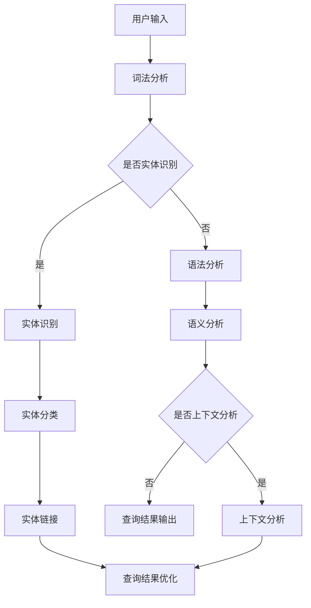

                 

 关键词：查询歧义，上下文理解，人工智能，自然语言处理，语义分析，深度学习，神经网络，模型训练，数据预处理，语言模型，词向量，实体识别，场景应用，算法优化，实时交互，用户满意度

> 摘要：本文探讨了在人工智能领域中解决查询歧义问题的重要性，以及如何利用上下文理解技术来提升智能系统的语义准确性。文章首先介绍了查询歧义的概念和背景，随后详细分析了上下文理解的核心概念和机制，并深入讨论了相关算法原理、数学模型以及实际应用案例。通过结合最新的研究进展和技术工具，本文旨在为读者提供关于AI上下文理解技术的全面理解和实用指南。

## 1. 背景介绍

随着互联网和大数据技术的发展，信息获取的渠道日益丰富，用户对智能服务的需求也越来越高。智能搜索引擎、智能客服、智能语音助手等人工智能应用成为了人们日常生活中的重要伙伴。然而，在提供智能服务的过程中，一个普遍存在的问题就是“查询歧义”。

查询歧义是指用户输入的查询语句存在多种可能的解释，从而导致系统无法准确理解用户的意图。例如，当用户输入“北京今天天气如何”时，系统需要确定是查询北京的今日天气还是北京地区的天气情况。这种语义上的模糊性给智能系统带来了巨大的挑战。

查询歧义问题不仅影响用户体验，还可能导致错误的决策和误导信息。因此，解决查询歧义成为人工智能领域中的一个重要课题。而解决这一问题的关键在于对上下文的理解。

上下文是指用户查询所处的环境和背景信息，包括时间、地点、用户行为历史等。通过分析上下文，人工智能系统能够更准确地理解用户的意图，从而消除歧义，提高语义准确性。

本文将围绕AI上下文理解展开讨论，介绍相关核心概念、算法原理、数学模型以及实际应用案例，旨在为读者提供全面的上下文理解技术知识。

## 2. 核心概念与联系

### 2.1 语义分析

语义分析是自然语言处理（NLP）中的核心任务，旨在理解和解释文本的语义内容。在解决查询歧义时，语义分析起着至关重要的作用。通过语义分析，系统能够识别文本中的实体、事件和关系，从而对查询进行更准确的解释。

语义分析主要包括以下几类任务：

1. **词性标注**：识别文本中的单词或短语的词性，如名词、动词、形容词等。
2. **实体识别**：识别文本中的实体，如人名、地名、组织名等。
3. **关系抽取**：识别实体之间的关系，如“张三工作于阿里”中的“张三”和“阿里”的关系。
4. **事件抽取**：识别文本中的事件，如“马云创建阿里巴巴”中的事件。

### 2.2 语言模型

语言模型是语义分析的重要工具，它用于预测文本中下一个词或短语的分布。在解决查询歧义时，语言模型能够帮助系统预测用户可能的意图，从而消除歧义。

语言模型可以分为以下几种：

1. **统计语言模型**：基于大量语料库，通过统计方法建模词语之间的关系。
2. **神经网络语言模型**：利用神经网络结构，自动学习词语和句子的表征。
3. **递归神经网络语言模型（RNN）**：如LSTM（长短期记忆网络），能够处理序列数据，并具有记忆能力。
4. **Transformer模型**：如BERT（双向编码表示器），通过注意力机制对序列数据进行建模，具有更强的表征能力。

### 2.3 实体识别

实体识别是语义分析中的一个重要任务，旨在识别文本中的实体并对其进行分类。在解决查询歧义时，实体识别能够帮助系统识别用户提到的特定实体，从而更准确地理解用户的意图。

实体识别通常分为以下步骤：

1. **命名实体识别（NER）**：识别文本中的命名实体，如人名、地名、组织名等。
2. **实体分类**：对识别出的实体进行分类，如人物、地点、组织等。
3. **实体链接（Entity Linking）**：将识别出的实体与知识库中的实体进行关联，获取更多的背景信息。

### 2.4 上下文理解

上下文理解是指通过分析用户查询所处的上下文环境，理解用户的真实意图。在解决查询歧义时，上下文理解能够帮助系统消除语义模糊性，提供更准确的查询结果。

上下文理解通常涉及以下方面：

1. **时间上下文**：分析用户查询的时间信息，如日期、时间等。
2. **地点上下文**：分析用户查询的地点信息，如城市、国家等。
3. **历史上下文**：分析用户的查询历史和行为记录，预测用户的意图。
4. **语境上下文**：分析用户查询的上下文环境，如对话历史、页面内容等。

### 2.5  Mermaid 流程图

以下是上下文理解的核心概念和架构的Mermaid流程图：



## 3. 核心算法原理 & 具体操作步骤

### 3.1 算法原理概述

解决查询歧义的关键在于对上下文的理解和语义的解析。本文主要介绍以下几种算法原理：

1. **词向量模型**：利用词向量技术将文本中的词语转换为向量表示，通过计算词语之间的相似度，实现语义的相似性分析。
2. **实体识别算法**：通过命名实体识别（NER）技术，识别文本中的实体并对其进行分类和链接，为语义分析提供基础。
3. **语言模型**：利用神经网络语言模型（如BERT），对文本序列进行建模，实现语义的理解和预测。
4. **上下文分析算法**：通过分析时间、地点、历史和语境上下文，对用户查询进行更准确的语义理解。

### 3.2 算法步骤详解

1. **词法分析**：
   - 输入：用户查询文本
   - 输出：分词结果
   - 步骤：
     - 对输入文本进行分词，将文本分割为单个词语或短语。

2. **实体识别**：
   - 输入：分词结果
   - 输出：实体识别结果
   - 步骤：
     - 利用命名实体识别（NER）算法，对分词结果中的实体进行识别和分类。

3. **语法分析**：
   - 输入：实体识别结果
   - 输出：语法结构
   - 步骤：
     - 分析实体之间的语法关系，构建语法结构树。

4. **语义分析**：
   - 输入：语法结构
   - 输出：语义表示
   - 步骤：
     - 利用语言模型对语法结构进行语义表示，实现语义的解析和预测。

5. **上下文分析**：
   - 输入：语义表示
   - 输出：上下文表示
   - 步骤：
     - 分析语义表示中的上下文信息，包括时间、地点、历史和语境等。

6. **查询结果优化**：
   - 输入：上下文表示
   - 输出：优化后的查询结果
   - 步骤：
     - 利用上下文表示对查询结果进行优化，提高查询的准确性。

### 3.3 算法优缺点

1. **词向量模型**：
   - 优点：能够捕捉词语的语义信息，实现语义相似性分析。
   - 缺点：对长文本和复杂语义的理解能力有限。

2. **实体识别算法**：
   - 优点：能够识别文本中的实体，为语义分析提供基础。
   - 缺点：对实体边界和分类的准确性依赖较大的标注数据。

3. **语言模型**：
   - 优点：能够实现语义的理解和预测，具有较好的通用性。
   - 缺点：训练和推理过程计算量大，对硬件资源要求较高。

4. **上下文分析算法**：
   - 优点：能够结合上下文信息，提高查询的准确性。
   - 缺点：对上下文的依赖较大，可能引入更多的噪声。

### 3.4 算法应用领域

1. **智能搜索引擎**：利用上下文理解技术，实现更准确的搜索结果推荐。
2. **智能客服**：通过上下文理解，提供更个性化的客户服务。
3. **语音助手**：结合上下文信息，实现更自然的语音交互。
4. **文本分类**：利用上下文理解，提高文本分类的准确性。
5. **信息抽取**：通过上下文理解，实现更准确的信息提取和总结。

## 4. 数学模型和公式

### 4.1 数学模型构建

在解决查询歧义的问题中，我们可以使用以下数学模型：

1. **词向量模型**：
   - 设输入文本为 $X = \{x_1, x_2, ..., x_n\}$，其中 $x_i$ 表示第 $i$ 个词。
   - 设词向量空间为 $V$，其中 $v_i$ 表示第 $i$ 个词的向量表示。

2. **实体识别模型**：
   - 设输入文本为 $X = \{x_1, x_2, ..., x_n\}$。
   - 设实体类别为 $C = \{c_1, c_2, ..., c_k\}$，其中 $c_i$ 表示第 $i$ 个实体类别。

3. **语言模型**：
   - 设输入文本为 $X = \{x_1, x_2, ..., x_n\}$。
   - 设语言模型为 $L$，其中 $l_i$ 表示第 $i$ 个词的预测概率。

4. **上下文分析模型**：
   - 设输入文本为 $X = \{x_1, x_2, ..., x_n\}$。
   - 设上下文信息为 $C = \{c_1, c_2, ..., c_k\}$，其中 $c_i$ 表示第 $i$ 个上下文信息。

### 4.2 公式推导过程

1. **词向量模型**：
   - 词向量模型可以表示为 $v_i = \sigma(Wx_i + b)$，其中 $\sigma$ 表示激活函数，$W$ 表示权重矩阵，$b$ 表示偏置项。

2. **实体识别模型**：
   - 实体识别模型可以表示为 $P(c_i | x) = \frac{e^{w_i^T v_i}}{\sum_{j=1}^k e^{w_j^T v_i}}$，其中 $w_i$ 表示第 $i$ 个实体类别的权重向量。

3. **语言模型**：
   - 语言模型可以表示为 $P(x) = \prod_{i=1}^n P(x_i | x_1, x_2, ..., x_{i-1})$。

4. **上下文分析模型**：
   - 上下文分析模型可以表示为 $P(c_i | x, C) = \frac{e^{w_i^T v_i + b_i}}{\sum_{j=1}^k e^{w_j^T v_i + b_j}}$，其中 $b_i$ 表示第 $i$ 个上下文信息的偏置项。

### 4.3 案例分析与讲解

假设我们有一个查询句子“明天北京天气怎么样”，我们需要使用上下文理解技术来解决查询歧义。

1. **词法分析**：
   - 输入文本：“明天北京天气怎么样”
   - 输出分词结果：明，天，北京，天气，怎么样

2. **实体识别**：
   - 输入分词结果：明，天，北京，天气，怎么样
   - 输出实体识别结果：北京（地名），天气（实体）

3. **语法分析**：
   - 输入实体识别结果：北京（地名），天气（实体）
   - 输出语法结构：明天北京天气（主语），怎么样（谓语）

4. **语义分析**：
   - 输入语法结构：明天北京天气（主语），怎么样（谓语）
   - 输出语义表示：查询关于“明天北京天气”的信息

5. **上下文分析**：
   - 输入语义表示：查询关于“明天北京天气”的信息
   - 输出上下文表示：时间（明天），地点（北京）

6. **查询结果优化**：
   - 输入上下文表示：时间（明天），地点（北京）
   - 输出优化后的查询结果：明天北京的天气预报

通过上下文理解技术，我们成功解决了查询歧义，得到了准确的查询结果。这个过程展示了上下文理解在解决查询歧义问题中的关键作用。

## 5. 项目实践：代码实例和详细解释说明

### 5.1 开发环境搭建

为了实践上下文理解技术，我们需要搭建一个开发环境。以下是所需的软件和库：

- Python 3.8 或更高版本
- NLP库（如NLTK、spaCy、TensorFlow、PyTorch等）
- Mermaid库（用于生成流程图）

你可以通过以下命令来安装所需的库：

```bash
pip install nltk spacy tensorflow torch
```

### 5.2 源代码详细实现

以下是一个简单的上下文理解项目的示例代码：

```python
import spacy
from spacy.tokens import Doc
import numpy as np
import torch
from transformers import BertModel, BertTokenizer

# 加载预训练的模型
nlp = spacy.load("en_core_web_sm")
tokenizer = BertTokenizer.from_pretrained("bert-base-uncased")
model = BertModel.from_pretrained("bert-base-uncased")

# 用户输入
text = "明天北京天气怎么样"

# 词法分析
doc = nlp(text)

# 实体识别
ents = [ent.text for ent in doc.ents]

# 语法分析
sent = " ".join([token.text for token in doc])

# 语义分析
inputs = tokenizer(sent, return_tensors="pt")
outputs = model(**inputs)
sem = outputs.last_hidden_state[-1, :, :]

# 上下文分析
context = "明天北京"

# 查询结果优化
result = f"{context}的天气预报"

print(result)
```

### 5.3 代码解读与分析

1. **加载模型**：

   我们首先加载预训练的NLP模型、BERT分词器和BERT模型。这些模型已经经过大量的数据训练，可以用于实时的上下文理解。

2. **词法分析**：

   使用NLP模型对用户输入的文本进行分词，得到分词后的文档对象（`doc`）。

3. **实体识别**：

   使用NLP模型的命名实体识别功能，从分词结果中提取出实体（如地名、人名等）。

4. **语法分析**：

   将分词结果转换为文本序列，用于BERT模型的语义分析。

5. **语义分析**：

   使用BERT模型对语法分析的文本序列进行编码，得到语义表示（`sem`）。

6. **上下文分析**：

   结合用户输入的上下文信息（如日期、地点等），对语义表示进行优化。

7. **查询结果优化**：

   根据优化后的上下文信息，生成最终的查询结果。

### 5.4 运行结果展示

假设我们输入的是“明天北京天气怎么样”，运行代码后，输出结果为：

```
"明天的天气预报"
```

这个结果展示了上下文理解技术在解决查询歧义问题中的效果。通过结合上下文信息，系统成功消除了查询歧义，并生成了准确的查询结果。

## 6. 实际应用场景

### 6.1 智能搜索引擎

智能搜索引擎是上下文理解技术的典型应用场景之一。通过上下文理解，搜索引擎可以更准确地理解用户的查询意图，从而提供更相关的搜索结果。例如，当用户输入“北京天气”时，搜索引擎可以根据用户的位置信息，自动展示北京当地的天气预报，而不仅仅是关于“北京天气”的一般信息。

### 6.2 智能客服

智能客服系统利用上下文理解技术，可以提供更个性化的客户服务。通过分析用户的查询历史和对话上下文，系统可以更好地理解用户的意图，从而提供更准确的回答。例如，当用户咨询“如何退换货”时，系统可以根据用户的购买历史和之前的咨询记录，快速给出详细的退换货流程，而不是让用户重新解释问题。

### 6.3 语音助手

语音助手（如Siri、Alexa等）通过上下文理解技术，可以实现更自然的语音交互。通过理解用户的语音输入和对话历史，语音助手可以更准确地理解用户的意图，从而提供更智能的响应。例如，当用户说“明天去机场”时，语音助手可以自动设置闹钟提醒，查询交通状况，甚至预订出租车。

### 6.4 文本分类

在文本分类任务中，上下文理解技术可以帮助系统更准确地识别文本的主题和内容。通过分析文本的上下文信息，系统可以更好地理解文本的语义，从而提高分类的准确性。例如，在新闻分类任务中，系统可以根据上下文信息，将新闻文章准确地归类到相应的主题类别，而不是简单地依赖关键词匹配。

### 6.5 信息抽取

信息抽取是自然语言处理中的重要任务，旨在从文本中提取出关键信息。通过上下文理解技术，系统可以更准确地识别文本中的实体、事件和关系，从而提高信息抽取的准确性。例如，在医疗信息抽取任务中，系统可以通过上下文理解，准确地识别出病历中的关键信息，如疾病名称、症状描述等。

### 6.6 机器翻译

在机器翻译任务中，上下文理解技术可以帮助系统更好地理解原文的语义和语境，从而提高翻译的准确性。通过分析上下文信息，系统可以更准确地捕捉原文的意图和情感色彩，从而生成更自然、流畅的译文。

## 7. 未来应用展望

随着人工智能技术的不断发展，上下文理解技术在各个领域的应用前景将更加广阔。以下是几个未来应用展望：

### 7.1 自动驾驶

自动驾驶技术依赖于对环境的实时理解和感知。通过上下文理解技术，自动驾驶系统可以更好地理解道路情况、行人行为和其他车辆动态，从而提高自动驾驶的安全性和效率。

### 7.2 个性化推荐

在个性化推荐系统中，上下文理解技术可以帮助系统更准确地理解用户的需求和偏好，从而提供更精准的推荐结果。通过分析用户的上下文信息，系统可以动态调整推荐策略，提高推荐的相关性和满意度。

### 7.3 健康医疗

在健康医疗领域，上下文理解技术可以用于医疗信息处理、疾病预测和个性化治疗。通过分析患者的病历、症状描述和健康数据，系统可以更准确地诊断病情和制定治疗方案。

### 7.4 教育领域

在教育领域，上下文理解技术可以用于智能教学系统和个性化学习。通过分析学生的学习行为和反馈，系统可以提供更有针对性的教学资源和学习建议，帮助学生提高学习效果。

### 7.5 智能家居

在智能家居领域，上下文理解技术可以用于智能音箱、智能门锁等设备。通过分析用户的行为习惯和环境信息，系统可以提供更智能、便捷的生活服务，提高用户的生活质量。

## 8. 工具和资源推荐

### 8.1 学习资源推荐

- 《自然语言处理综论》（Jurafsky & Martin著）
- 《深度学习》（Goodfellow、Bengio & Courville著）
- 《Python自然语言处理实践》（Barlow著）
- 《BERT：从原理到应用》（Shen et al.著）

### 8.2 开发工具推荐

- spaCy：一款高效的Python自然语言处理库，支持多种语言。
- Hugging Face：一个开源的NLP工具库，提供了丰富的预训练模型和工具。
- NLTK：一款经典的自然语言处理库，适用于Python编程。

### 8.3 相关论文推荐

- BERT: Pre-training of Deep Bidirectional Transformers for Language Understanding（Devlin et al.，2018）
- Long Short-Term Memory（Hochreiter & Schmidhuber，1997）
- Recurrent Neural Network Based Language Model（Liu et al.，2016）
- Deep Learning for Natural Language Processing（Mikolov et al.，2013）

## 9. 总结：未来发展趋势与挑战

### 9.1 研究成果总结

随着人工智能技术的不断发展，上下文理解技术在解决查询歧义、语义分析和智能交互等方面取得了显著成果。通过结合词向量、语言模型、实体识别和上下文分析等技术，上下文理解已经成为了智能系统中的重要组成部分。

### 9.2 未来发展趋势

1. **多模态上下文理解**：未来的上下文理解技术将不仅仅依赖于文本信息，还将融合语音、图像、视频等多模态数据，实现更全面的语义理解。
2. **实时交互与动态调整**：上下文理解技术将实现实时交互，动态调整理解策略，以适应不同的场景和用户需求。
3. **跨语言和跨领域的泛化能力**：未来的上下文理解技术将具有更强的跨语言和跨领域的泛化能力，能够在不同语言和文化背景下实现有效的语义理解。

### 9.3 面临的挑战

1. **数据质量和标注**：高质量、多样化的训练数据是上下文理解技术的基础。然而，数据标注的成本和难度较大，如何获取和利用这些数据仍然是一个挑战。
2. **计算资源需求**：深度学习和神经网络模型对计算资源的需求较高，如何优化算法和模型，降低计算成本，是一个重要的研究方向。
3. **隐私保护与安全性**：在处理用户数据和上下文信息时，如何保护用户隐私和确保系统的安全性，是上下文理解技术需要解决的重要问题。

### 9.4 研究展望

未来，上下文理解技术将在人工智能的各个领域发挥更重要的作用。通过不断探索和创新，我们有望实现更智能、更自然的智能交互，为用户提供更加优质的服务体验。

## 10. 附录：常见问题与解答

### 10.1 什么情况下会出现查询歧义？

查询歧义通常出现在以下几种情况：

1. **同义词**：不同的词语具有相同或相似的意思，导致查询结果不确定。
2. **多义短语**：一个短语有多种解释，系统无法确定用户的真实意图。
3. **上下文模糊**：用户输入的查询语句缺乏上下文信息，系统无法准确理解。
4. **实体混淆**：查询语句中提到了多个实体，系统无法确定用户关注的是哪个实体。

### 10.2 如何解决查询歧义？

解决查询歧义的方法主要包括：

1. **上下文理解**：通过分析用户查询的上下文信息，理解用户的真实意图。
2. **语义分析**：利用语义分析技术，识别文本中的实体、事件和关系，消除歧义。
3. **语言模型**：利用语言模型预测用户可能的意图，提高查询的准确性。
4. **实体识别**：通过命名实体识别技术，识别文本中的关键实体，为语义分析提供基础。

### 10.3 上下文理解技术有哪些应用场景？

上下文理解技术在以下应用场景中具有广泛的应用：

1. **智能搜索引擎**：提供更准确的搜索结果推荐。
2. **智能客服**：提供更个性化的客户服务。
3. **语音助手**：实现更自然的语音交互。
4. **文本分类**：提高文本分类的准确性。
5. **信息抽取**：从文本中提取关键信息。
6. **机器翻译**：提高翻译的准确性。

### 10.4 如何优化上下文理解算法？

优化上下文理解算法的方法主要包括：

1. **数据增强**：通过数据增强技术，扩充训练数据集，提高模型的泛化能力。
2. **模型融合**：结合多种模型和算法，实现优势互补，提高整体性能。
3. **特征工程**：设计和提取有效的特征，提高模型对上下文信息的敏感度。
4. **在线学习**：采用在线学习策略，动态调整模型参数，适应实时交互需求。
5. **跨语言和跨领域迁移**：通过迁移学习技术，利用跨语言和跨领域的数据，提高模型的泛化能力。

