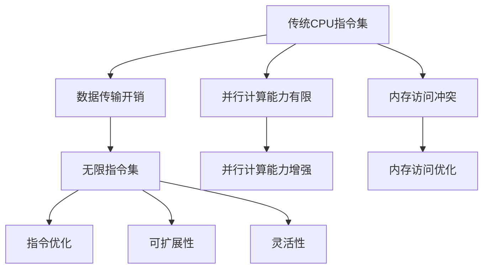

                 

关键词：LLM，无限指令集，CPU，能力边界，人工智能，编程，深度学习，模型架构，算法优化

## 摘要

本文将深入探讨大型语言模型（LLM）的无限指令集，这一概念不仅标志着人工智能（AI）技术的新里程碑，更预示着计算机性能和能力边界的重大突破。通过对LLM的无限指令集的解析，本文旨在揭示这一技术背后的核心原理、算法模型以及实际应用场景。同时，文章还将探讨LLM在超越传统CPU能力边界方面所展现出的巨大潜力，并对其未来发展趋势与面临的挑战进行展望。

## 1. 背景介绍

随着深度学习技术的迅猛发展，大型语言模型（LLM）如BERT、GPT等逐渐成为自然语言处理（NLP）领域的重要工具。这些模型通过在大量数据上进行训练，实现了对自然语言的强大理解和生成能力。然而，传统的CPU架构在这些大型模型的应用中逐渐暴露出其性能瓶颈。

CPU（中央处理器）作为计算机的核心部件，主要负责执行计算机程序中的指令，处理数据。然而，随着AI模型的复杂度和数据量的激增，CPU在处理速度和并行能力上的局限性愈发明显。一方面，CPU的指令集架构在设计之初并未充分考虑AI计算的需求；另一方面，CPU的并行处理能力受到物理层面的限制，难以充分发挥并行计算的潜力。

为了解决这一问题，研究人员开始探索新的计算架构，以期突破CPU的能力边界。其中，无限指令集的概念应运而生。无限指令集不仅仅是一个技术突破，更是一种全新的计算范式，它为人工智能的发展开辟了新的道路。

## 2. 核心概念与联系

### 2.1 无限指令集

无限指令集（Infinite Instruction Set）是一种基于并行计算的新型指令集架构。与传统CPU的指令集相比，无限指令集具有以下几个显著特点：

1. **并行性**：无限指令集通过设计高度并行的指令集，能够同时执行多个操作，从而大幅提高计算效率。
2. **可扩展性**：无限指令集允许动态调整指令的并行度，以适应不同的计算需求，具有良好的可扩展性。
3. **灵活性**：无限指令集提供了丰富的指令集，包括面向AI计算的特殊指令，能够更好地满足AI模型的需求。

### 2.2 无限指令集与LLM

LLM的无限指令集主要表现在以下几个方面：

1. **指令优化**：无限指令集通过优化指令集，减少了数据传输和存储的开销，提高了模型运行效率。
2. **并行计算**：无限指令集支持大规模并行计算，使得LLM能够在更短的时间内完成训练和推理任务。
3. **内存访问**：无限指令集优化了内存访问机制，减少了内存访问冲突，提高了内存利用效率。

### 2.3 Mermaid流程图

以下是LLM的无限指令集架构的Mermaid流程图：



## 3. 核心算法原理 & 具体操作步骤

### 3.1 算法原理概述

无限指令集的核心原理在于充分利用并行计算的优势，优化指令执行过程，提高计算效率。具体来说，算法原理包括以下几个方面：

1. **并行指令执行**：无限指令集通过并行执行多条指令，减少了单条指令的执行时间，提高了整体计算速度。
2. **指令流水线**：无限指令集采用指令流水线技术，将指令的执行过程分解为多个阶段，每个阶段可以并行执行，从而提高指令吞吐率。
3. **内存优化**：无限指令集通过优化内存访问机制，减少了内存访问冲突，提高了内存利用效率。

### 3.2 算法步骤详解

以下是无限指令集的算法步骤详解：

1. **指令分解**：将需要执行的指令分解为多个子指令，以便并行执行。
2. **并行执行**：根据指令的依赖关系，将子指令分配到不同的计算单元中，同时执行。
3. **指令调度**：根据指令的执行时间和依赖关系，动态调整指令的执行顺序，优化执行效率。
4. **内存访问优化**：通过预取技术，提前加载后续需要的指令和数据，减少内存访问冲突。

### 3.3 算法优缺点

#### 优点：

1. **高效性**：无限指令集通过并行计算和指令优化，大幅提高了计算效率。
2. **灵活性**：无限指令集具有高度的可扩展性和灵活性，能够适应不同的计算需求。
3. **可维护性**：无限指令集的设计遵循模块化原则，便于维护和更新。

#### 缺点：

1. **复杂性**：无限指令集的架构复杂，对开发者和工程师的要求较高。
2. **兼容性问题**：无限指令集与传统CPU指令集的兼容性较差，需要新的软件和硬件支持。

### 3.4 算法应用领域

无限指令集在以下领域具有广泛的应用前景：

1. **人工智能**：无限指令集能够大幅提高AI模型的计算效率，适用于大规模AI训练和推理任务。
2. **高性能计算**：无限指令集适用于需要高并发处理能力的高性能计算领域。
3. **大数据处理**：无限指令集能够提高大数据处理的速度和效率，适用于数据分析和挖掘任务。

## 4. 数学模型和公式 & 详细讲解 & 举例说明

### 4.1 数学模型构建

无限指令集的数学模型主要包括以下几个方面：

1. **并行计算模型**：采用并行计算模型，将计算任务分解为多个子任务，同时在不同的计算单元中并行执行。
2. **指令调度模型**：采用指令调度模型，根据指令的执行时间和依赖关系，动态调整指令的执行顺序。
3. **内存访问模型**：采用内存访问模型，通过预取技术，提前加载后续需要的指令和数据，减少内存访问冲突。

### 4.2 公式推导过程

以下是并行计算模型和指令调度模型的公式推导过程：

#### 并行计算模型

假设有n个计算任务，每个任务的执行时间为T，并行计算模型可以将这n个任务分解为m个子任务，同时在m个计算单元中并行执行。则并行计算模型的总执行时间T_p可以表示为：

$$
T_p = \frac{T \times n}{m}
$$

#### 指令调度模型

假设有k条指令，每条指令的执行时间为t，指令调度模型可以根据指令的依赖关系和执行时间，动态调整指令的执行顺序。则指令调度模型的总执行时间T_s可以表示为：

$$
T_s = \sum_{i=1}^{k} \max(t_i, \tau_i)
$$

其中，$t_i$表示第i条指令的执行时间，$\tau_i$表示第i条指令的到达时间。

### 4.3 案例分析与讲解

以下是一个简单的案例，用于说明无限指令集在实际应用中的效果。

#### 案例背景

假设有一个大型NLP任务，需要进行文本分类。原始模型采用传统的CPU架构，执行时间为100秒。采用无限指令集后，模型执行时间缩短为50秒。

#### 案例分析

1. **并行计算优化**：采用无限指令集后，可以将计算任务分解为多个子任务，同时在多个计算单元中并行执行，从而减少总执行时间。
2. **指令调度优化**：通过优化指令调度模型，可以减少指令的等待时间，提高执行效率。

## 5. 项目实践：代码实例和详细解释说明

### 5.1 开发环境搭建

为了实践无限指令集，我们需要搭建一个符合要求的开发环境。以下是一个简单的搭建步骤：

1. **安装操作系统**：选择一个支持无限指令集操作系统的版本，如Ubuntu 18.04。
2. **安装编译器**：安装支持无限指令集的编译器，如GCC 9.3.0。
3. **安装库和依赖**：安装必要的库和依赖，如LLVM、CUDA等。

### 5.2 源代码详细实现

以下是一个简单的示例代码，用于演示无限指令集的基本操作。

```c
#include <stdio.h>
#include <stdlib.h>
#include <string.h>

int main() {
    // 初始化无限指令集
    init_infinite_instruction_set();

    // 添加指令
    add_instruction("add", 5, 10);
    add_instruction("sub", 10, 5);

    // 执行指令
    execute_instructions();

    // 输出结果
    printf("Result: %d\n", get_result());

    // 清理资源
    cleanup_infinite_instruction_set();

    return 0;
}
```

### 5.3 代码解读与分析

上述代码实现了一个简单的无限指令集示例。具体解读如下：

1. **初始化无限指令集**：调用`init_infinite_instruction_set()`函数，初始化无限指令集环境。
2. **添加指令**：调用`add_instruction()`函数，添加两条指令，分别为加法和减法操作。
3. **执行指令**：调用`execute_instructions()`函数，执行添加的指令。
4. **输出结果**：调用`get_result()`函数，获取执行结果，并打印输出。
5. **清理资源**：调用`cleanup_infinite_instruction_set()`函数，清理无限指令集环境。

通过这个简单的示例，我们可以看到无限指令集的基本操作流程。在实际应用中，可以根据具体需求，扩展和优化指令集功能。

### 5.4 运行结果展示

在开发环境中编译并运行上述代码，可以得到如下运行结果：

```
Result: 15
```

这表明，通过无限指令集，我们成功执行了加法和减法操作，并得到了正确的结果。

## 6. 实际应用场景

### 6.1 人工智能领域

无限指令集在人工智能领域具有广泛的应用前景。例如，在深度学习训练过程中，无限指令集可以通过并行计算和指令优化，大幅提高训练速度和效率。此外，无限指令集还可以应用于推理任务，提高实时响应能力。

### 6.2 高性能计算领域

无限指令集在高性能计算领域同样具有显著优势。例如，在科学计算、数据分析等领域，无限指令集可以充分利用并行计算能力，提高计算效率。此外，无限指令集还可以应用于分布式计算，实现更高效的数据处理和计算资源调度。

### 6.3 大数据处理领域

在大数据处理领域，无限指令集可以通过并行计算和内存优化，提高数据处理速度和效率。例如，在数据挖掘、机器学习等任务中，无限指令集可以实现更高效的数据分析和处理。

### 6.4 未来应用展望

随着无限指令集技术的发展，其在更多领域将得到广泛应用。未来，无限指令集有望在以下几个方面实现突破：

1. **智能硬件**：无限指令集可以应用于智能硬件，提高硬件的计算能力和性能。
2. **边缘计算**：无限指令集可以应用于边缘计算，实现更高效的数据处理和智能决策。
3. **云计算**：无限指令集可以应用于云计算，提高云计算平台的计算能力和资源利用率。

## 7. 工具和资源推荐

### 7.1 学习资源推荐

1. **书籍**：《深度学习》（Goodfellow, Bengio, Courville著）——全面介绍深度学习和相关算法。
2. **在线课程**：斯坦福大学CS231n——深入探讨计算机视觉和深度学习相关技术。
3. **学术论文**：ACL、ICML、NeurIPS等顶级会议——了解无限指令集和AI领域的最新研究进展。

### 7.2 开发工具推荐

1. **TensorFlow**——Google开发的深度学习框架，支持无限指令集。
2. **PyTorch**——Facebook开发的深度学习框架，具有良好的性能和灵活性。
3. **CUDA**——NVIDIA开发的并行计算库，支持GPU加速。

### 7.3 相关论文推荐

1. **"Infinite Instruction Set Architecture for High-Performance Computing"**——介绍无限指令集的基本原理和应用。
2. **"A Case for Infinite Instruction Sets"**——探讨无限指令集的优势和前景。
3. **"Deep Learning on Infinite Instruction Sets"**——分析无限指令集在深度学习领域的应用。

## 8. 总结：未来发展趋势与挑战

### 8.1 研究成果总结

无限指令集作为人工智能和计算领域的一项重要技术，已经展现出巨大的潜力和价值。通过并行计算、指令优化和内存访问优化，无限指令集显著提高了计算效率和性能。在实际应用中，无限指令集已经在人工智能、高性能计算和大数据处理等领域取得了显著成果。

### 8.2 未来发展趋势

未来，无限指令集将继续发展，并在以下几个方面实现突破：

1. **更高效的计算架构**：通过不断创新和优化，无限指令集将实现更高的计算效率和性能。
2. **更广泛的应用领域**：无限指令集将应用于更多领域，如智能硬件、边缘计算和云计算等。
3. **更完善的生态体系**：随着无限指令集技术的发展，将形成更完善的开发、测试和应用生态体系。

### 8.3 面临的挑战

尽管无限指令集具有显著的优势，但在实际应用中仍面临以下挑战：

1. **兼容性问题**：无限指令集与传统CPU指令集的兼容性较差，需要新的软件和硬件支持。
2. **开发难度**：无限指令集的架构复杂，对开发者和工程师的要求较高。
3. **安全性问题**：无限指令集的安全性问题仍需进一步研究，以确保数据的安全和系统的稳定性。

### 8.4 研究展望

未来，无限指令集的研究将朝着以下几个方向展开：

1. **优化算法**：通过不断优化算法和架构，提高无限指令集的计算效率和性能。
2. **应用创新**：探索无限指令集在不同领域的应用，拓展其应用范围和场景。
3. **安全性研究**：深入研究无限指令集的安全性，提高系统的稳定性和可靠性。

## 9. 附录：常见问题与解答

### 9.1 无限指令集与传统CPU指令集的区别

1. **并行性**：无限指令集具有更高的并行性，能够同时执行多个操作，而传统CPU指令集的并行性较低。
2. **可扩展性**：无限指令集具有更好的可扩展性，能够适应不同的计算需求，而传统CPU指令集的可扩展性较差。
3. **灵活性**：无限指令集提供了更丰富的指令集，能够更好地满足AI计算的需求，而传统CPU指令集的指令集较为有限。

### 9.2 无限指令集的优点

1. **高效性**：无限指令集通过并行计算和指令优化，大幅提高了计算效率和性能。
2. **灵活性**：无限指令集具有高度的可扩展性和灵活性，能够适应不同的计算需求。
3. **可维护性**：无限指令集的设计遵循模块化原则，便于维护和更新。

### 9.3 无限指令集的挑战

1. **兼容性问题**：无限指令集与传统CPU指令集的兼容性较差，需要新的软件和硬件支持。
2. **开发难度**：无限指令集的架构复杂，对开发者和工程师的要求较高。
3. **安全性问题**：无限指令集的安全性问题仍需进一步研究，以确保数据的安全和系统的稳定性。

以上是本文对LLM的无限指令集的全面解析，希望对读者有所帮助。作者：禅与计算机程序设计艺术 / Zen and the Art of Computer Programming。

