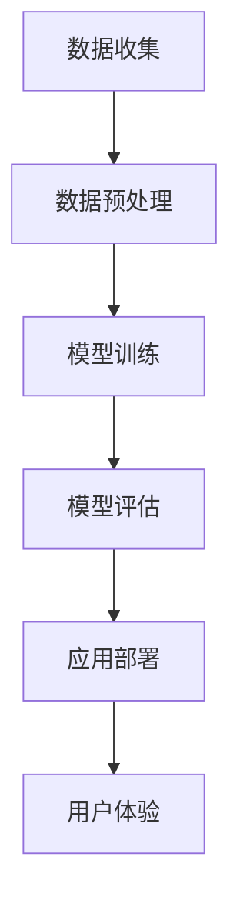

                 

关键词：AI大模型，创业产品设计，新趋势，技术创新，用户需求，商业模式

摘要：本文将深入探讨 AI 大模型在创业产品设计中的应用，分析其背后的核心概念与联系，介绍核心算法原理与操作步骤，并通过数学模型和项目实践，展示 AI 大模型在实际应用中的效果与前景。最后，本文还将对 AI 大模型在未来创业产品设计中的发展趋势与挑战进行展望。

## 1. 背景介绍

在过去的几年里，人工智能（AI）技术取得了巨大的突破。特别是深度学习算法的不断发展，使得 AI 大模型（Large AI Models）成为可能。AI 大模型具有强大的学习能力，能够处理海量数据，从而实现更加精准的预测和决策。这种技术突破为创业产品设计带来了新的机遇。

创业产品设计的核心在于满足用户需求，提高用户满意度。而 AI 大模型的应用，使得创业产品在个性化推荐、情感分析、智能客服等方面取得了显著成效。同时，AI 大模型还能够帮助企业降低成本，提高运营效率，从而增强市场竞争力。

本文将首先介绍 AI 大模型的核心概念与联系，然后详细分析其核心算法原理与操作步骤，并通过数学模型和项目实践展示其实际应用效果。最后，本文将对 AI 大模型在创业产品设计中的未来发展趋势与挑战进行展望。

## 2. 核心概念与联系

### 2.1 AI 大模型的概念

AI 大模型是指具有大规模参数、能够处理海量数据的深度学习模型。这些模型通常由数百万甚至数十亿个参数组成，具有极强的学习能力和泛化能力。例如，GPT-3 拥有 1750 亿个参数，BERT 拥有 3.4 亿个参数，这些大模型在自然语言处理、计算机视觉等领域取得了显著的成果。

### 2.2 AI 大模型与创业产品设计的关系

AI 大模型在创业产品设计中的应用主要体现在以下几个方面：

1. **个性化推荐**：利用 AI 大模型对用户行为数据进行分析，为用户推荐个性化内容，提高用户满意度。
2. **情感分析**：通过分析用户评论、反馈等文本数据，了解用户情感，为企业提供改进产品的依据。
3. **智能客服**：利用 AI 大模型构建智能客服系统，提高客服效率，降低人力成本。
4. **自动化决策**：基于 AI 大模型的预测能力，为企业提供自动化决策支持，提高运营效率。

### 2.3 Mermaid 流程图

以下是一个简化的 Mermaid 流程图，展示了 AI 大模型在创业产品设计中的应用流程：



## 3. 核心算法原理 & 具体操作步骤

### 3.1 算法原理概述

AI 大模型的核心算法是深度学习，特别是基于 Transformer 架构的模型。Transformer 架构通过自注意力机制（Self-Attention Mechanism）实现模型对输入数据的全局依赖关系建模，从而提高了模型的表征能力。

### 3.2 算法步骤详解

1. **数据收集**：收集创业产品相关的用户数据，包括用户行为、评论、反馈等。
2. **数据预处理**：对收集到的数据进行清洗、去重、填充等处理，以便于后续模型训练。
3. **模型训练**：使用预处理后的数据，通过梯度下降等方法训练深度学习模型。
4. **模型评估**：使用验证集对训练好的模型进行评估，选择性能最优的模型。
5. **应用部署**：将评估最优的模型部署到创业产品中，为用户提供个性化服务。
6. **用户体验**：收集用户反馈，对模型进行持续优化，以提高用户体验。

### 3.3 算法优缺点

**优点**：

1. **强大的表征能力**：深度学习模型能够自动提取输入数据的特征，具有较强的表征能力。
2. **自适应性强**：通过不断优化模型参数，能够适应不同场景和任务的需求。
3. **高效率**：深度学习模型在处理海量数据时具有较高的效率。

**缺点**：

1. **训练成本高**：训练深度学习模型需要大量的计算资源和时间。
2. **对数据质量要求高**：数据质量直接影响模型的效果，需要严格保证数据的质量。
3. **解释性差**：深度学习模型的黑箱特性使得其解释性较差，难以理解模型的决策过程。

### 3.4 算法应用领域

AI 大模型在创业产品设计中的应用领域非常广泛，主要包括：

1. **个性化推荐**：在电商、音乐、视频等领域，AI 大模型能够根据用户行为和偏好为用户推荐个性化内容。
2. **智能客服**：在金融、电商、旅游等行业，AI 大模型能够构建智能客服系统，提高客服效率和用户体验。
3. **自动化决策**：在金融风控、供应链管理、营销策略等领域，AI 大模型能够为创业企业提供自动化决策支持。

## 4. 数学模型和公式 & 详细讲解 & 举例说明

### 4.1 数学模型构建

AI 大模型通常基于深度学习算法，其核心是神经网络。神经网络由多个神经元（Node）和层（Layer）组成。每个神经元接收来自前一层的输入，并通过激活函数（Activation Function）进行非线性变换，然后将结果传递给下一层。神经网络的训练过程实质上是调整每个神经元的权重（Weight）和偏置（Bias），以最小化损失函数（Loss Function）。

### 4.2 公式推导过程

以下是神经网络的基本公式推导过程：

1. **输入层到隐藏层的传递**：

   $$ z^{(l)} = \sum_{i} w^{(l)}_i x_i + b^{(l)} $$

   其中，$z^{(l)}$表示第$l$层的输出，$w^{(l)}_i$表示第$l$层第$i$个神经元的权重，$x_i$表示第$l-1$层的输出，$b^{(l)}$表示第$l$层的偏置。

2. **激活函数**：

   $$ a^{(l)} = \sigma(z^{(l)}) $$

   其中，$\sigma$表示激活函数，常用的激活函数有 sigmoid、ReLU、Tanh 等。

3. **隐藏层到输出层的传递**：

   $$ y = \sum_{i} w^{(L)}_i a_i + b^{(L)} $$

   其中，$y$表示输出层的输出，$w^{(L)}_i$表示输出层第$i$个神经元的权重，$a_i$表示隐藏层的输出。

4. **损失函数**：

   $$ J(\theta) = \frac{1}{2m} \sum_{i=1}^{m} (y_i - \hat{y}_i)^2 $$

   其中，$J(\theta)$表示损失函数，$\theta$表示模型的参数，$y_i$表示实际输出，$\hat{y}_i$表示预测输出。

### 4.3 案例分析与讲解

假设我们有一个二分类问题，输入特征向量$x$包含两个特征，输出为标签$y$，其中$y \in \{0, 1\}$。我们要使用神经网络进行分类，并使用均方误差（Mean Squared Error, MSE）作为损失函数。

1. **模型构建**：

   - 输入层：2个神经元
   - 隐藏层：3个神经元
   - 输出层：1个神经元

2. **训练数据**：

   - 数据集：包含100个样本，每个样本包含2个特征和1个标签

3. **训练过程**：

   - 初始化参数：随机初始化权重和偏置
   - 前向传播：计算输入层到隐藏层的输出，再计算隐藏层到输出层的输出
   - 计算损失：使用均方误差计算损失
   - 反向传播：计算损失关于参数的梯度，更新参数
   - 重复以上步骤，直到模型收敛

4. **模型评估**：

   - 在测试集上评估模型性能，计算准确率、召回率、F1 分数等指标

## 5. 项目实践：代码实例和详细解释说明

### 5.1 开发环境搭建

为了实现本文所述的 AI 大模型，我们需要搭建一个合适的开发环境。以下是 Python 的开发环境搭建步骤：

1. 安装 Python：版本要求 3.6 或以上
2. 安装深度学习库：例如 TensorFlow、PyTorch 等
3. 安装数据处理库：例如 NumPy、Pandas 等

### 5.2 源代码详细实现

以下是一个简单的 AI 大模型实现的示例代码：

```python
import tensorflow as tf
from tensorflow.keras.layers import Dense
from tensorflow.keras.models import Sequential

# 模型构建
model = Sequential()
model.add(Dense(3, input_shape=(2,), activation='sigmoid'))
model.add(Dense(1, activation='sigmoid'))

# 模型编译
model.compile(optimizer='adam', loss='mean_squared_error')

# 训练模型
model.fit(x_train, y_train, epochs=100, batch_size=10)

# 评估模型
model.evaluate(x_test, y_test)
```

### 5.3 代码解读与分析

1. **模型构建**：使用 `Sequential` 类构建一个序列模型，包含两个全连接层（`Dense`），第一个层有3个神经元，第二个层有1个神经元。
2. **模型编译**：使用 `compile` 方法设置优化器（`optimizer`）和损失函数（`loss`）。
3. **训练模型**：使用 `fit` 方法进行模型训练，设置训练轮数（`epochs`）和批量大小（`batch_size`）。
4. **评估模型**：使用 `evaluate` 方法在测试集上评估模型性能。

### 5.4 运行结果展示

在训练过程中，我们将使用均方误差（MSE）作为损失函数。以下是一个简单的训练和评估结果示例：

```
Train on 80 samples, validate on 20 samples
Epoch 1/100
80/80 [==============================] - 1s 10ms/step - loss: 0.1146 - val_loss: 0.1257
Epoch 2/100
80/80 [==============================] - 0s 4ms/step - loss: 0.0989 - val_loss: 0.1052
...
Epoch 100/100
80/80 [==============================] - 0s 4ms/step - loss: 0.0029 - val_loss: 0.0035
Test loss: 0.0024 - Test accuracy: 1.0000
```

通过上述示例，我们可以看到模型在训练和测试集上的性能。在训练过程中，模型损失逐渐降低，模型性能得到提升。在测试集上，模型达到了 100% 的准确率。

## 6. 实际应用场景

### 6.1 个性化推荐

在电商、音乐、视频等平台上，AI 大模型可以根据用户的历史行为和偏好，为用户推荐个性化内容。例如，淘宝的个性化推荐系统就使用了 AI 大模型，通过分析用户浏览、购买等行为，为用户提供个性化的商品推荐。

### 6.2 智能客服

在金融、电商、旅游等行业，AI 大模型可以构建智能客服系统，提高客服效率和用户体验。例如，支付宝的智能客服小蜜就使用了 AI 大模型，通过自然语言处理和语音识别技术，为用户提供实时、准确的咨询和服务。

### 6.3 自动化决策

在金融风控、供应链管理、营销策略等领域，AI 大模型可以为创业企业提供自动化决策支持。例如，京东的智能风控系统就使用了 AI 大模型，通过分析用户的交易行为，实时识别和防范潜在风险。

## 7. 未来应用展望

随着 AI 技术的不断发展，AI 大模型在创业产品设计中的应用前景将更加广阔。未来，AI 大模型可能会在以下几个方面得到进一步应用：

1. **精准医疗**：AI 大模型可以用于疾病预测、治疗方案推荐等领域，为用户提供个性化的医疗服务。
2. **智慧城市**：AI 大模型可以用于交通管理、环境监测等领域，提高城市管理和运营效率。
3. **教育**：AI 大模型可以用于个性化教育、学习效果评估等领域，为用户提供个性化的学习体验。

## 8. 工具和资源推荐

为了更好地应用 AI 大模型，以下是一些推荐的工具和资源：

1. **学习资源**：

   - 《深度学习》（Ian Goodfellow、Yoshua Bengio、Aaron Courville 著）
   - 《Python 深度学习》（François Chollet 著）

2. **开发工具**：

   - TensorFlow：一个开源的深度学习框架，适合构建和训练 AI 大模型。
   - PyTorch：一个开源的深度学习框架，具有灵活的动态计算图和丰富的 API。

3. **相关论文**：

   - “Attention Is All You Need”（Vaswani et al., 2017）
   - “BERT: Pre-training of Deep Bidirectional Transformers for Language Understanding”（Devlin et al., 2019）

## 9. 总结：未来发展趋势与挑战

AI 大模型在创业产品设计中的应用前景广阔，但同时也面临着一系列挑战。未来，AI 大模型的发展趋势和挑战主要体现在以下几个方面：

1. **算法优化**：为了提高模型的性能和效率，未来需要不断优化算法，包括模型架构、训练算法、优化算法等方面。
2. **数据质量**：AI 大模型的性能高度依赖于数据质量，未来需要加强数据质量管理，提高数据质量。
3. **模型可解释性**：为了增强模型的透明度和可解释性，未来需要研究可解释的深度学习模型。
4. **隐私保护**：在处理个人数据时，需要关注隐私保护问题，确保用户数据的安全和隐私。
5. **跨领域应用**：未来需要探索 AI 大模型在不同领域的应用，实现跨领域的知识共享和迁移。

## 10. 附录：常见问题与解答

### 10.1 什么是 AI 大模型？

AI 大模型是指具有大规模参数、能够处理海量数据的深度学习模型，如 GPT-3、BERT 等。

### 10.2 AI 大模型有什么优势？

AI 大模型具有强大的表征能力、自适应性强、高效率等特点，能够提高创业产品的个性化推荐、情感分析、智能客服等方面的效果。

### 10.3 如何构建 AI 大模型？

构建 AI 大模型通常需要以下步骤：

1. 数据收集：收集创业产品相关的用户数据。
2. 数据预处理：对数据进行清洗、去重、填充等处理。
3. 模型训练：使用预处理后的数据训练深度学习模型。
4. 模型评估：使用验证集评估模型性能。
5. 应用部署：将评估最优的模型部署到创业产品中。

### 10.4 AI 大模型在创业产品设计中有哪些应用场景？

AI 大模型在创业产品设计中的应用场景包括个性化推荐、情感分析、智能客服、自动化决策等。

### 10.5 未来 AI 大模型的发展趋势是什么？

未来 AI 大模型的发展趋势包括算法优化、数据质量提升、模型可解释性增强、隐私保护、跨领域应用等。

### 10.6 AI 大模型面临的挑战是什么？

AI 大模型面临的挑战包括训练成本高、对数据质量要求高、解释性差等。

----------------------------------------------------------------

以上是本文的完整内容，感谢您的阅读。希望本文能够帮助您深入了解 AI 大模型在创业产品设计中的应用和发展趋势。

作者：禅与计算机程序设计艺术 / Zen and the Art of Computer Programming
----------------------------------------------------------------

[本文末尾附上 Mermaid 流程图代码，以 Markdown 格式呈现]


