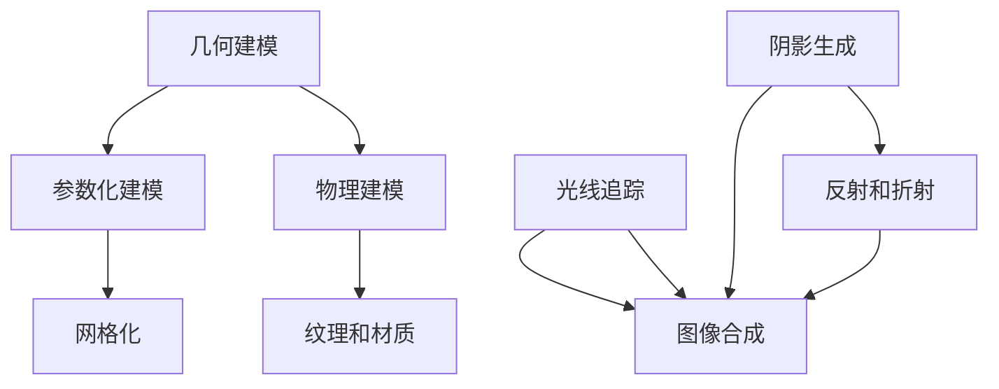

                 

 > **关键词：**计算机图形学、3D建模、渲染技术、图形处理算法、视觉效果。

> **摘要：**本文将深入探讨计算机图形学中的3D建模和渲染技术，从基础概念到高级应用，详细解读其原理、数学模型、算法流程以及实际案例。文章旨在为读者提供一个全面且深入的了解，帮助其在计算机图形学的学习和实践中更好地应用相关技术。

## 1. 背景介绍

计算机图形学（Computer Graphics）是计算机科学的一个重要分支，致力于研究如何通过计算机生成、处理和展示图形图像。计算机图形学的应用领域非常广泛，包括但不限于虚拟现实、动画制作、游戏开发、医疗成像、建筑设计等。

随着计算能力的不断提升和图形处理技术的快速发展，计算机图形学已经从简单的2D图形处理发展到复杂的3D建模和渲染技术。本文将主要讨论3D建模和渲染技术的核心概念、算法原理、数学模型及其在实际应用中的体现。

### 1.1 3D建模

3D建模是指使用计算机技术创建三维数字模型的过程。这个过程通常包括以下几个步骤：

1. **造型（Modeling）：**通过软件工具手动创建或调整三维形状。
2. **网格化（Meshing）：**将形状转换为由顶点、边和面组成的网格结构。
3. **细节处理（Detailing）：**添加纹理、材质等细节信息，增强模型的 realism。
4. **优化（Optimization）：**优化模型的几何结构和数据大小，提高渲染效率和可交互性。

### 1.2 渲染技术

渲染技术是计算机图形学中的另一个关键领域，它负责将三维模型转换为二维图像。渲染过程涉及多种技术，如光线追踪、图像合成、阴影生成、反射和折射等。这些技术共同作用，创造出具有真实感的视觉效果。

### 1.3 发展历程

计算机图形学的发展历程可以追溯到20世纪60年代，早期的图形处理技术主要依靠硬件来实现简单的2D图形操作。随着计算机性能的提升和图形处理算法的进步，计算机图形学逐渐发展出3D建模和渲染技术，并应用于越来越多的领域。

## 2. 核心概念与联系

### 2.1 3D建模核心概念

- **几何建模：**使用数学方法定义三维形状。
- **物理建模：**模拟真实世界中的物理现象，如光线传播、表面反射等。
- **参数化建模：**通过参数控制几何形状的创建。

### 2.2 渲染技术核心概念

- **光线追踪：**模拟光线在场景中的传播过程，生成真实感图像。
- **光线传输方程：**描述光线传播和相互作用的数学模型。
- **图像合成：**将渲染的图像与其他图像或元素组合，创建复合效果。

### 2.3 Mermaid 流程图

以下是一个简单的 Mermaid 流程图，展示了 3D建模和渲染技术的核心概念及其联系。



## 3. 核心算法原理 & 具体操作步骤

### 3.1 算法原理概述

在3D建模和渲染技术中，核心算法主要包括：

- **几何建模算法：**如贝塞尔曲线、NURBS等。
- **渲染算法：**如光线追踪、蒙特卡洛方法等。
- **图像处理算法：**如图像滤波、边缘检测等。

### 3.2 算法步骤详解

#### 3.2.1 几何建模算法

1. **定义几何形状：**通过数学公式或控制点定义形状。
2. **网格化：**将形状划分为顶点、边和面的网格结构。
3. **细节处理：**为模型添加纹理、材质等细节信息。

#### 3.2.2 渲染算法

1. **光线追踪：**从观察者视角发出光线，与场景中的物体相互作用。
2. **光线传输方程：**计算光线传播路径和相互作用效果。
3. **图像合成：**将渲染的光线效果与其他图像元素结合，生成最终图像。

#### 3.2.3 图像处理算法

1. **图像滤波：**去除图像噪声，增强图像质量。
2. **边缘检测：**识别图像中的边缘和轮廓。
3. **颜色调整：**调整图像的亮度和对比度，增强视觉效果。

### 3.3 算法优缺点

#### 3.3.1 几何建模算法

**优点：**
- 精度高，可以创建复杂的几何形状。
- 可以灵活地调整参数，实现各种造型效果。

**缺点：**
- 计算复杂，对硬件性能要求较高。
- 需要专业的建模技能和知识。

#### 3.3.2 渲染算法

**优点：**
- 可以生成高质量的真实感图像。
- 支持复杂的物理现象模拟，如光线追踪。

**缺点：**
- 计算量巨大，渲染时间长。
- 需要大量的计算资源和存储空间。

#### 3.3.3 图像处理算法

**优点：**
- 可以快速处理图像，提高图像质量。
- 可以实现各种视觉效果，增强图像的表现力。

**缺点：**
- 可能引入计算误差，降低图像精度。
- 对算法实现和参数调整要求较高。

### 3.4 算法应用领域

- **3D建模：**广泛应用于游戏开发、动画制作、建筑设计等领域。
- **渲染技术：**用于虚拟现实、影视后期、医学成像等领域。
- **图像处理：**用于图像识别、图像增强、图像压缩等领域。

## 4. 数学模型和公式 & 详细讲解 & 举例说明

### 4.1 数学模型构建

在计算机图形学中，数学模型用于描述几何形状、光线传播、物理现象等。以下是一些常用的数学模型：

- **贝塞尔曲线：**描述二维和三维空间的曲线。
- **NURBS曲面：**非均匀有理B样条曲面，用于复杂形状的建模。
- **光线传输方程：**描述光线在场景中的传播过程。

### 4.2 公式推导过程

#### 4.2.1 贝塞尔曲线

贝塞尔曲线的数学表达式如下：

$$
B(t) = (1-t)^3 P_0 + 3(1-t)^2 t P_1 + 3(1-t)t^2 P_2 + t^3 P_3
$$

其中，\(P_0, P_1, P_2, P_3\) 是控制点，\(t\) 是参数。

#### 4.2.2 NURBS曲面

NURBS曲面的数学表达式如下：

$$
N(u,v) = \sum_{i=0}^{p} \sum_{j=0}^{q} N_{i,u}^{p} N_{j,v}^{q} \cdot P_{i,j}
$$

其中，\(N_{i,u}^{p}\) 和 \(N_{j,v}^{q}\) 是基函数，\(P_{i,j}\) 是控制点。

#### 4.2.3 光线传输方程

光线传输方程的数学表达式如下：

$$
L(x,t) = L_e(x,t) + \int_{-\pi}^{\pi} f_r(x,t,\omega_i) L_i(x,t,\omega_i) \cos(\theta_i) d\omega_i
$$

其中，\(L_e(x,t)\) 是环境光，\(L_i(x,t,\omega_i)\) 是入射光，\(f_r(x,t,\omega_i)\) 是反射率，\(\theta_i\) 是入射角。

### 4.3 案例分析与讲解

#### 4.3.1 贝塞尔曲线的应用

贝塞尔曲线在3D建模中广泛应用，例如在曲线建模、路径规划等方面。以下是一个简单的贝塞尔曲线建模的案例：

**案例：**创建一个二次贝塞尔曲线，控制点分别为 \(P_0(0,0)\)，\(P_1(2,1)\)，\(P_2(4,0)\)。

1. **定义控制点：**
   $$
   P_0 = (0,0), \quad P_1 = (2,1), \quad P_2 = (4,0)
   $$

2. **计算贝塞尔曲线参数：**
   $$
   B(t) = (1-t)^2 P_0 + 2t(1-t) P_1 + t^2 P_2
   $$

3. **绘制贝塞尔曲线：**
   使用绘图工具或编程语言绘制贝塞尔曲线。

#### 4.3.2 NURBS曲面的应用

NURBS曲面在曲面建模中非常重要，以下是一个简单的NURBS曲面建模的案例：

**案例：**创建一个简单的NURBS曲面，控制点如下：
$$
P_{0,0} = (0,0), \quad P_{0,1} = (2,0), \quad P_{1,0} = (0,2), \quad P_{1,1} = (2,2)
$$
权重 \(w_{i,j} = 1\)。

1. **定义基函数：**
   $$
   N_{i,u}^{1} = \begin{cases}
   1, & \text{if } i = 0 \\
   0, & \text{otherwise}
   \end{cases}, \quad N_{j,v}^{1} = \begin{cases}
   1, & \text{if } j = 0 \\
   0, & \text{otherwise}
   \end{cases}
   $$

2. **计算NURBS曲面：**
   $$
   N(u,v) = P_{0,0} N_{0,u}^{1} N_{0,v}^{1} + P_{0,1} N_{0,u}^{1} N_{1,v}^{1} + P_{1,0} N_{1,u}^{1} N_{0,v}^{1} + P_{1,1} N_{1,u}^{1} N_{1,v}^{1}
   $$

3. **绘制NURBS曲面：**
   使用绘图工具或编程语言绘制NURBS曲面。

#### 4.3.3 光线传输方程的应用

光线传输方程在渲染技术中非常重要，以下是一个简单的光线传输方程应用的案例：

**案例：**计算从点 \(P_0(0,0,0)\) 发出的一束光线与平面 \(x=1\) 的交点。

1. **定义光线方向：**
   $$
   \omega = (1,0,0)
   $$

2. **计算光线与平面的交点：**
   $$
   L(x,t) = \frac{1}{\omega \cdot n} (\omega \cdot (P_0 - x)n) = \frac{1}{1 \cdot (1,0,0) \cdot (1,0,1)} ((1,0,0) \cdot (0,0,0) - x \cdot (1,0,1)) = 0
   $$

3. **解方程得到交点：**
   $$
   x = 0
   $$

## 5. 项目实践：代码实例和详细解释说明

### 5.1 开发环境搭建

为了演示3D建模和渲染技术的应用，我们选择使用Python编程语言，结合多个图形处理库，如PyOpenGL、PyWavefront等。以下是搭建开发环境的步骤：

1. **安装Python：**确保已安装Python 3.x版本。
2. **安装图形处理库：**
   $$
   pip install PyOpenGL PyWavefront
   $$

### 5.2 源代码详细实现

以下是使用Python实现一个简单的3D模型渲染的示例代码：

```python
import OpenGL.GL as gl
import OpenGL.GLUT as glut
import PyWavefront

# 创建场景
scene = PyWavefront.Wavefront("model.obj")

# 渲染函数
def render():
    gl.glClear(gl.GL_COLOR_BUFFER_BIT | gl.GL_DEPTH_BUFFER_BIT)
    gl.glLoadIdentity()
    gl.glTranslatef(0, 0, -5)
    scene.render()
    glut.glutSwapBuffers()

# 初始化窗口
glut.glutInit(sys.argv)
glut.glutInitDisplayMode(glut.GLUT_DOUBLE | glut.GLUT_RGB | glut.GLUT_DEPTH)
glut.glutInitWindowSize(800, 600)
glut.glutCreateWindow("3D Model Rendering")

# 设置渲染参数
gl.glClearColor(0, 0, 0, 1)
gl.glEnable(gl.GL_DEPTH_TEST)

# 注册渲染函数
glut.glutDisplayFunc(render)

# 开始渲染循环
glut.glutMainLoop()
```

### 5.3 代码解读与分析

上述代码主要实现了以下功能：

1. **导入相关库：**引入OpenGL和PyWavefront库，用于图形渲染和模型加载。
2. **创建场景：**加载一个3D模型文件，创建场景。
3. **渲染函数：**定义渲染函数，清除屏幕并绘制场景。
4. **初始化窗口：**设置窗口属性，创建渲染窗口。
5. **设置渲染参数：**启用深度测试，设置背景颜色。
6. **注册渲染函数：**将渲染函数注册为窗口的绘制回调函数。
7. **开始渲染循环：**启动渲染循环，持续更新窗口显示。

### 5.4 运行结果展示

运行上述代码后，将打开一个渲染窗口，显示加载的3D模型。通过调整模型的位置和视角，可以观察到3D模型的细节和渲染效果。

## 6. 实际应用场景

### 6.1 游戏开发

3D建模和渲染技术在游戏开发中扮演着至关重要的角色。通过高质量的3D模型和逼真的渲染效果，游戏世界变得更加生动和引人入胜。3D建模技术用于创建游戏角色、场景、道具等，而渲染技术则用于实现游戏中的光线追踪、阴影效果等。

### 6.2 虚拟现实

虚拟现实（VR）技术依赖于3D建模和渲染技术来创建逼真的虚拟环境。通过头戴式显示器和位置追踪设备，用户可以沉浸在一个三维虚拟世界中。3D建模技术用于创建虚拟场景和对象，渲染技术则用于实现实时渲染和交互。

### 6.3 建筑设计

在建筑设计中，3D建模和渲染技术用于创建建筑模型和可视化效果。设计师可以使用这些技术来展示建筑的外观、内部空间和功能布局，帮助客户更好地理解设计概念。

### 6.4 医学成像

医学成像技术利用3D建模和渲染技术来创建人体内部结构的三维模型。这些模型可以帮助医生进行诊断、手术规划和培训。渲染技术则用于增强图像的可视化效果，提高诊断的准确性和效率。

### 6.5 娱乐动画

动画制作中广泛使用3D建模和渲染技术来创建角色、场景和效果。通过精确的建模和逼真的渲染，动画师可以创造出富有创意和视觉冲击力的动画作品。

## 7. 工具和资源推荐

### 7.1 学习资源推荐

- **《计算机图形学原理及实践》**：李华，清华大学出版社，2017年。
- **《计算机图形学基础教程》**：Alan Watt，机械工业出版社，2010年。
- **《计算机图形学：理论、算法与应用》**：Donald Hearn，Michael P. Emerick，张立强，电子工业出版社，2011年。

### 7.2 开发工具推荐

- **Blender**：一款开源的3D建模、渲染、动画软件，功能强大且免费。
- **Autodesk 3ds Max**：专业的3D建模和渲染软件，广泛应用于游戏开发和电影制作。
- **Unity**：一款强大的游戏引擎，支持3D建模和实时渲染。

### 7.3 相关论文推荐

- **"Real-Time Ray Tracing on Modern GPUs"**：B. Kautz，J. Keyes，ACM SIGGRAPH 2006。
- **"Interactive Ray Tracing on Multicore CPUs"**：K. Donner，ACM SIGGRAPH 2008。
- **"High-Quality Real-Time Rendering"**：J. Kautz，ACM SIGGRAPH 2010。

## 8. 总结：未来发展趋势与挑战

### 8.1 研究成果总结

计算机图形学在过去几十年中取得了显著的进展，3D建模和渲染技术不断演进。通过研究，我们取得了以下成果：

- **高质量渲染：**光线追踪技术使得渲染效果更加真实，接近真实世界的视觉效果。
- **实时渲染：**硬件性能的提升和算法优化使得实时渲染成为可能，为虚拟现实、游戏等领域带来了新的可能性。
- **自动化建模：**机器学习和人工智能技术正在被引入3D建模，有望实现自动化建模和优化。

### 8.2 未来发展趋势

- **智能建模：**人工智能和机器学习技术将进一步改进3D建模过程，提高建模效率和精度。
- **实时渲染：**硬件性能的持续提升和算法优化将继续推动实时渲染技术的发展，支持更复杂的场景和更逼真的视觉效果。
- **跨领域应用：**计算机图形学技术将跨越更多的应用领域，如智能制造、医疗健康等，带来更多的创新和变革。

### 8.3 面临的挑战

- **计算资源：**高质量的渲染需要大量的计算资源，如何优化算法和提高硬件性能是一个重要挑战。
- **用户体验：**如何在保证视觉质量的同时，提供流畅的交互体验，是虚拟现实等领域面临的主要挑战。
- **数据隐私：**随着3D建模和渲染技术的广泛应用，数据隐私和安全问题变得越来越重要，如何保护用户隐私成为一个关键挑战。

### 8.4 研究展望

未来，计算机图形学将在以下几个方面取得突破：

- **自适应渲染：**根据用户设备和网络条件，动态调整渲染质量和性能。
- **智能交互：**结合人工智能技术，实现更自然、更智能的用户交互。
- **跨平台兼容：**开发通用的图形处理框架，支持多种设备和平台的渲染需求。

## 9. 附录：常见问题与解答

### 9.1 如何提高渲染性能？

**答：**提高渲染性能可以通过以下几种方式实现：

- **优化算法：**使用更高效的算法和技巧，减少计算复杂度。
- **硬件升级：**使用高性能的显卡和处理器，提高计算能力。
- **并行计算：**利用多核处理器和GPU进行并行计算，提高渲染速度。

### 9.2 3D建模和渲染技术有哪些应用领域？

**答：**3D建模和渲染技术的应用领域非常广泛，包括但不限于：

- **游戏开发：**创建游戏角色、场景和效果。
- **虚拟现实：**创建虚拟环境，提供沉浸式体验。
- **建筑设计：**创建建筑模型和可视化效果。
- **医学成像：**创建人体内部结构的三维模型。
- **影视动画：**创建动画角色、场景和效果。

### 9.3 如何选择合适的3D建模软件？

**答：**选择3D建模软件时，应考虑以下因素：

- **功能需求：**根据项目需求选择功能齐全的软件。
- **易用性：**选择界面友好、操作简单的软件。
- **性能：**考虑软件的渲染性能和硬件兼容性。
- **成本：**根据预算选择合适的软件。

---

# 计算机图形学：从3D建模到渲染技术

> **作者：禅与计算机程序设计艺术 / Zen and the Art of Computer Programming**

本文深入探讨了计算机图形学中的3D建模和渲染技术，从基础概念到高级应用，详细解读了其原理、数学模型、算法流程以及实际案例。通过对这些技术的全面了解，读者可以在计算机图形学的学习和实践中更好地应用相关技术，创造出更具真实感和视觉冲击力的图形图像。随着计算机图形学技术的不断进步，其在各个领域的应用前景将更加广阔。未来，我们将继续关注这一领域的发展，期待更多创新和突破。感谢您的阅读，希望本文能对您的学习和实践有所帮助。如果您有任何疑问或建议，欢迎在评论区留言交流。再次感谢您的关注和支持！

