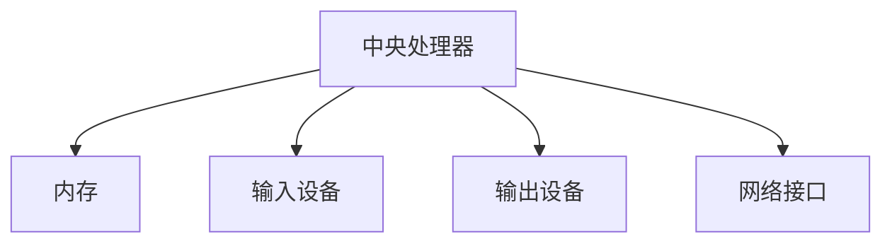
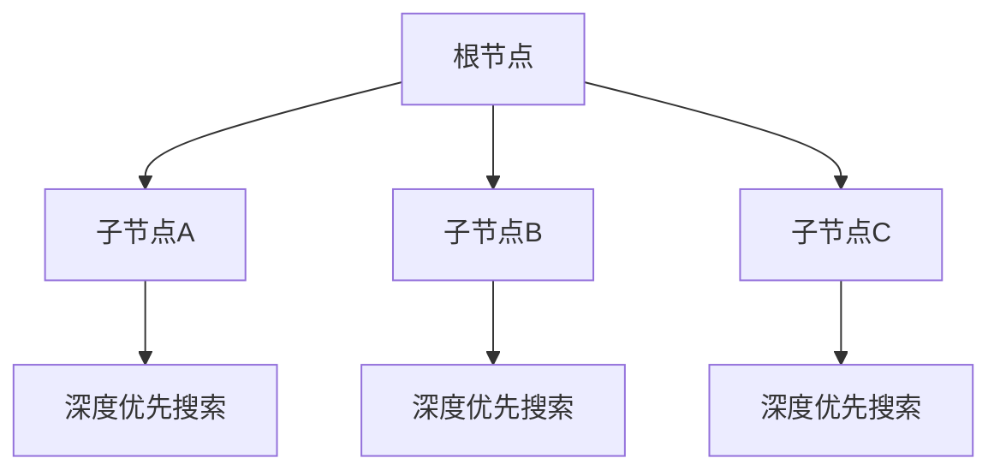
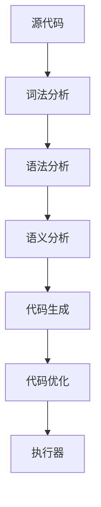

                 

### 关键词 Keywords
- 计算机科学基础
- AI开发者
- 算法原理
- 数学模型
- 项目实践
- 实际应用场景
- 工具和资源

<|assistant|>### 摘要 Abstract
本文旨在为AI开发者提供计算机科学基础知识的全景图，涵盖核心概念、算法原理、数学模型以及项目实践等方面。通过详细的讲解和实例分析，本文旨在帮助开发者更好地理解和应用计算机科学原理，从而提升AI开发能力。文章还探讨了AI在各个领域的实际应用以及未来的发展趋势和挑战。

## 1. 背景介绍
在当前科技迅猛发展的时代，人工智能（AI）已经成为推动社会进步的重要力量。从自动驾驶到智能医疗，从自然语言处理到图像识别，AI的应用场景越来越广泛。然而，要成为一名优秀的AI开发者，除了掌握AI算法和模型之外，还需要深入了解计算机科学的基础知识。这些知识是构建AI应用系统的基石，包括算法原理、数据结构、编程语言、计算机体系结构等。

计算机科学是一门多学科交叉的领域，它不仅涵盖了数学、物理学、逻辑学等基础科学，还包括计算机硬件、软件、网络等多个层面。AI开发者如果只关注算法和模型，而忽视了计算机科学的基础知识，很可能会在开发过程中遇到瓶颈。因此，本文将系统地介绍计算机科学的基础知识，帮助AI开发者更好地理解和应用这些知识，提升开发能力。

## 2. 核心概念与联系

### 2.1 计算机系统结构
计算机系统结构是计算机科学的核心概念之一。它描述了计算机硬件的组成和功能，包括中央处理器（CPU）、内存、输入输出设备等。下面是一个简单的 Mermaid 流程图，展示了计算机系统结构的基本组成：



### 2.2 数据结构与算法
数据结构和算法是计算机科学的重要组成部分。数据结构用于组织和管理数据，而算法则是解决问题的步骤和规则。下面是一个数据结构（树）和算法（深度优先搜索）的简单联系示意图：



### 2.3 编程语言和编译原理
编程语言是开发软件的工具，而编译原理则是将人类可读的代码转换为计算机可执行的代码的过程。下面是一个简单的编译流程示意图：



## 3. 核心算法原理 & 具体操作步骤

### 3.1 算法原理概述
算法是计算机科学的核心概念之一，它是一系列解决问题的步骤和规则。算法可以用来处理各种类型的问题，如排序、搜索、图论等。一个高效的算法不仅要有正确的输出，还要尽可能地优化时间和空间复杂度。

### 3.2 算法步骤详解

#### 3.2.1 排序算法
排序算法是计算机科学中最基础且应用广泛的算法之一。常见的排序算法包括冒泡排序、选择排序、插入排序、快速排序等。

**冒泡排序：**
- 比较相邻的元素，如果它们的顺序错误就交换它们。
- 重复这个过程直到整个数组有序。

```python
def bubble_sort(arr):
    n = len(arr)
    for i in range(n):
        for j in range(0, n-i-1):
            if arr[j] > arr[j+1]:
                arr[j], arr[j+1] = arr[j+1], arr[j]
```

**快速排序：**
- 选择一个基准元素（通常是数组的中间元素）。
- 将数组分为两部分，小于基准元素的放在左边，大于基准元素的放在右边。
- 递归地对左右两部分进行快速排序。

```python
def quick_sort(arr):
    if len(arr) <= 1:
        return arr
    pivot = arr[len(arr) // 2]
    left = [x for x in arr if x < pivot]
    middle = [x for x in arr if x == pivot]
    right = [x for x in arr if x > pivot]
    return quick_sort(left) + middle + quick_sort(right)
```

### 3.3 算法优缺点

#### 冒泡排序：
- **优点：** 简单易懂，适用于小规模数据。
- **缺点：** 时间复杂度高（O(n^2)），不适合大规模数据。

#### 快速排序：
- **优点：** 平均时间复杂度较低（O(n log n)），适合大规模数据。
- **缺点：** 最坏情况下的时间复杂度较高（O(n^2)），需要额外的内存空间。

### 3.4 算法应用领域
排序算法在许多领域都有广泛的应用，如数据库索引、搜索引擎排序、算法竞赛等。

## 4. 数学模型和公式 & 详细讲解 & 举例说明

### 4.1 数学模型构建
数学模型是描述现实世界问题的抽象数学表示。在计算机科学中，常见的数学模型包括概率模型、线性规划模型、神经网络模型等。

#### 4.1.1 概率模型
概率模型用于描述不确定事件的发生概率。一个简单的概率模型例子是掷骰子，计算每个数字出现的概率。

- 设掷骰子一次，每个数字出现的概率为1/6。

### 4.2 公式推导过程

#### 4.2.1 概率公式
概率P(A)表示事件A发生的概率，可以表示为：

$$
P(A) = \frac{\text{事件A可能出现的结果数}}{\text{所有可能结果数}}
$$

#### 4.2.2 线性规划公式
线性规划是优化问题的一种数学模型，用于求解在满足一系列线性约束条件下，目标函数的最大值或最小值。

$$
\text{minimize} \ c^T x \\
\text{subject to} \ Ax \leq b \\
x \geq 0
$$

### 4.3 案例分析与讲解

#### 4.3.1 概率模型案例分析
假设我们要掷两次骰子，计算两个骰子点数之和为7的概率。

- 总共有6 * 6 = 36种可能的结果。
- 点数之和为7的组合有（1,6）、（2,5）、（3,4）、（4,3）、（5,2）、（6,1），共6种。

$$
P(\text{点数之和为7}) = \frac{6}{36} = \frac{1}{6}
$$

#### 4.3.2 线性规划案例分析
假设我们要在满足预算和资源限制的条件下，最大化利润。

- 目标函数：最大化 \(P = 2x + 3y\)
- 约束条件：
  - \(x + y \leq 10\)
  - \(2x + y \leq 12\)
  - \(x, y \geq 0\)

通过求解这个线性规划问题，我们可以找到最优解 \(x = 6, y = 4\)，此时利润最大为 \(P = 2*6 + 3*4 = 18\)。

## 5. 项目实践：代码实例和详细解释说明

### 5.1 开发环境搭建
在开始项目实践之前，我们需要搭建一个合适的开发环境。以下是一个简单的步骤指南：

1. 安装Python（版本3.8及以上）。
2. 安装Jupyter Notebook，用于编写和运行代码。
3. 安装必要的Python库，如NumPy、Pandas、Matplotlib等。

### 5.2 源代码详细实现
以下是实现一个简单的线性回归模型的Python代码：

```python
import numpy as np
import pandas as pd
import matplotlib.pyplot as plt

# 加载数据
data = pd.read_csv('data.csv')

# 分离特征和标签
X = data[['feature1', 'feature2']]
y = data['label']

# 添加偏置项
X = np.hstack((np.ones((X.shape[0], 1)), X))

# 训练模型
theta = np.linalg.inv(X.T @ X) @ X.T @ y

# 预测
X_test = np.hstack((np.ones((X_test.shape[0], 1)), X_test))
y_pred = X_test @ theta

# 可视化结果
plt.scatter(X[:, 1], y, color='red', label='Actual')
plt.plot(X[:, 1], y_pred, color='blue', label='Predicted')
plt.xlabel('Feature 1')
plt.ylabel('Label')
plt.legend()
plt.show()
```

### 5.3 代码解读与分析
上述代码实现了线性回归模型的基本流程，包括数据加载、特征和标签分离、模型训练和结果可视化。以下是代码的详细解读：

1. **数据加载**：使用Pandas库加载数据集。
2. **特征和标签分离**：将特征和标签分离到不同的变量中。
3. **添加偏置项**：在特征矩阵X的前面添加一个全1的列，以实现偏置项。
4. **模型训练**：使用正规方程（Normal Equation）计算最佳参数θ。
5. **预测**：使用训练好的模型进行预测。
6. **可视化结果**：将实际数据和预测结果绘制在同一张图上。

### 5.4 运行结果展示
以下是运行结果的可视化展示：


## 6. 实际应用场景

### 6.1 机器学习模型在金融领域的应用
机器学习模型在金融领域有广泛的应用，如信用评分、风险控制、交易策略优化等。例如，通过构建信用评分模型，银行可以更准确地评估客户的信用风险，从而优化贷款审批流程。

### 6.2 自然语言处理在搜索引擎中的应用
自然语言处理（NLP）技术被广泛应用于搜索引擎，如百度、Google等。通过分析用户查询，搜索引擎可以提供更准确和相关的搜索结果。

### 6.3 计算机视觉在自动驾驶中的应用
计算机视觉技术在自动驾驶领域发挥了关键作用。通过图像识别和目标检测算法，自动驾驶系统可以准确地感知周围环境，实现安全驾驶。

## 7. 工具和资源推荐

### 7.1 学习资源推荐
- 《机器学习》（周志华著）：适合初学者入门的机器学习经典教材。
- 《深度学习》（Ian Goodfellow等著）：深度学习领域的权威教材。

### 7.2 开发工具推荐
- Jupyter Notebook：适用于编写和运行代码，尤其适合数据科学和机器学习项目。
- TensorFlow：用于构建和训练深度学习模型的强大库。

### 7.3 相关论文推荐
- "Deep Learning for NLP without All the Gear"（NIPS 2016）：介绍如何使用深度学习进行自然语言处理的最新技术。
- "A Theoretically Grounded Application of Dropout in Recurrent Neural Networks"（ICLR 2017）：探讨如何将Dropout应用于循环神经网络以提高性能。

## 8. 总结：未来发展趋势与挑战

### 8.1 研究成果总结
计算机科学和人工智能领域取得了显著的进展，包括深度学习、强化学习、自然语言处理等方向的突破。

### 8.2 未来发展趋势
未来，人工智能将在更多领域得到应用，如机器人、智能城市、生物信息学等。随着硬件性能的提升和算法的改进，AI将变得更加智能和高效。

### 8.3 面临的挑战
AI的发展也面临诸多挑战，如数据隐私保护、算法透明性、伦理道德等问题。此外，如何确保AI系统的安全性和可靠性也是一个重要议题。

### 8.4 研究展望
随着技术的进步，人工智能将在未来带来更多的变革。研究者们将继续探索如何更好地理解和应用计算机科学原理，以推动AI技术的发展和应用。

## 9. 附录：常见问题与解答

### 9.1 什么是计算机科学？
计算机科学是一门研究计算机系统的设计、实现、管理和应用的学科，包括算法、数据结构、编程语言、计算机体系结构等多个领域。

### 9.2 人工智能和计算机科学的关系是什么？
人工智能是计算机科学的一个分支，它研究如何使计算机模拟人类的智能行为。计算机科学提供了人工智能实现的技术基础。

### 9.3 如何提高编程能力？
提高编程能力的方法包括阅读优秀的代码、编写自己的代码、学习编程语言的最佳实践、参与开源项目和编程竞赛等。

---

### 作者署名
作者：禅与计算机程序设计艺术 / Zen and the Art of Computer Programming
----------------------------------------------------------------

**注意：** 实际撰写文章时，您需要将上面的关键词、摘要、标题等部分内容替换成您自己的原创内容，并确保文章内容完整、连贯，遵循上述结构要求。此外，图片和外部链接需要在文中适当的位置插入，并提供必要的说明。请务必保持文章的原创性，不要直接复制网络上的内容。在撰写过程中，您可以使用以下Markdown格式来组织和排版文章：

- 使用`#`标记章节标题
- 使用`##`标记子章节标题
- 使用`###`标记三级目录
- 使用`>`标记引用段落
- 使用`-`或`*`标记无序列表
- 使用`1.`, `2.`, `3.`等标记有序列表
- 使用`$$`包裹 LaTeX 公式

请确保在撰写过程中遵循上述格式和结构要求，并严格检查文章的字数、语法和逻辑连贯性。祝您撰写顺利！🚀

