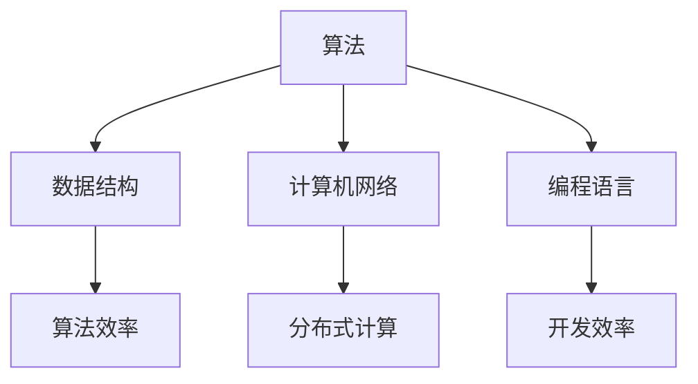

                 

关键词：计算机科学、AI、基础知识、算法、数学模型、实践应用、未来展望

> 摘要：本文将深入探讨计算机科学在人工智能（AI）开发中的基础性知识，涵盖核心概念、算法原理、数学模型及其实际应用，旨在为AI开发者提供系统而全面的学习指南。

## 1. 背景介绍

随着科技的飞速发展，人工智能（AI）已经成为当今世界的一个重要议题。AI技术在医疗、金融、交通、教育等各个领域的应用日益广泛，推动了社会生产力的巨大提升。然而，AI技术的发展离不开深厚的计算机科学基础。本文旨在梳理计算机科学中对于AI开发者至关重要的知识体系，帮助开发者更好地理解和应用AI技术。

### 1.1 计算机科学的定义与发展历程

计算机科学是一门研究计算机系统原理、设计与应用的学科。它涵盖了计算机硬件、软件、算法、网络等多个方面。计算机科学的发展历程可以追溯到20世纪40年代，随着计算机硬件的进步和算法理论的不断发展，计算机科学逐渐形成了独立的学科体系。

### 1.2 人工智能的发展背景与意义

人工智能是指使计算机具备类似人类智能的能力，包括学习、推理、规划、感知等。人工智能的发展背景主要源于信息技术的进步和大数据时代的到来。AI技术的应用不仅提高了生产效率，还为人类创造了更加智能化的生活环境。在医疗、金融、安防等领域，AI技术已经展现出其巨大的潜力。

## 2. 核心概念与联系

为了更好地理解AI在计算机科学中的地位，我们需要了解一些核心概念及其相互联系。

### 2.1 算法

算法是计算机科学中最基础的概念，它是一系列解决问题的步骤。在AI领域，算法扮演着至关重要的角色，如机器学习算法、深度学习算法等。

### 2.2 数据结构与算法

数据结构是用于存储和管理数据的组织形式，常见的有数组、链表、树、图等。算法与数据结构密不可分，有效的数据结构能够显著提升算法的效率。

### 2.3 计算机网络

计算机网络是实现信息传递和资源共享的重要手段。在AI应用中，尤其是在分布式计算和大数据处理方面，计算机网络的作用尤为突出。

### 2.4 编程语言

编程语言是开发者与计算机沟通的桥梁，不同的编程语言适用于不同的场景。掌握多种编程语言有助于开发者更好地解决实际问题。

### 2.5 Mermaid 流程图

为了更直观地展示核心概念之间的联系，我们使用Mermaid流程图来描述。



## 3. 核心算法原理 & 具体操作步骤

在AI领域，算法是实现智能化的关键。以下是几个核心算法及其原理和具体操作步骤。

### 3.1 算法原理概述

- **机器学习算法**：通过数据训练模型，使计算机具备自主学习和优化能力。常见的机器学习算法有线性回归、决策树、支持向量机等。
- **深度学习算法**：基于多层神经网络，能够处理复杂数据。深度学习算法在图像识别、语音识别等领域表现出色。
- **强化学习算法**：通过与环境的交互，使计算机不断调整策略以实现最佳结果。强化学习算法常用于游戏AI和自动驾驶。

### 3.2 算法步骤详解

以机器学习算法为例，其基本步骤如下：

1. **数据预处理**：清洗和格式化数据，确保其质量。
2. **模型选择**：根据问题特性选择合适的模型。
3. **训练模型**：使用训练数据集训练模型。
4. **模型评估**：使用验证数据集评估模型性能。
5. **模型优化**：根据评估结果调整模型参数。

### 3.3 算法优缺点

- **机器学习算法**：优点在于能够自动学习和优化，缺点是对数据质量和规模有较高要求。
- **深度学习算法**：优点在于处理复杂数据的能力强，缺点是计算资源消耗大。
- **强化学习算法**：优点在于能够自适应环境，缺点是训练过程复杂且较慢。

### 3.4 算法应用领域

- **机器学习算法**：在图像识别、自然语言处理、推荐系统等领域广泛应用。
- **深度学习算法**：在计算机视觉、语音识别、自动驾驶等领域取得突破性进展。
- **强化学习算法**：在游戏AI、智能推荐系统、资源调度等领域有广泛应用。

## 4. 数学模型和公式 & 详细讲解 & 举例说明

### 4.1 数学模型构建

在AI领域，数学模型是算法的核心。以下是一个简单的线性回归模型：

- **模型构建**：设 $y = wx + b$，其中 $x$ 是输入特征，$w$ 是权重，$b$ 是偏置。
- **损失函数**：选择均方误差（MSE）作为损失函数，即 $L = \frac{1}{2} \sum_{i=1}^{n} (wx_i + b - y_i)^2$。

### 4.2 公式推导过程

线性回归模型的推导过程如下：

1. **假设**：设定线性模型 $y = wx + b$。
2. **目标**：最小化损失函数 $L$。
3. **优化**：通过梯度下降法优化模型参数。

### 4.3 案例分析与讲解

以房价预测为例，我们使用线性回归模型进行建模。

1. **数据预处理**：收集房价数据，进行归一化处理。
2. **模型训练**：使用训练数据训练模型。
3. **模型评估**：使用验证数据评估模型性能。
4. **模型优化**：调整模型参数，提高预测准确性。

## 5. 项目实践：代码实例和详细解释说明

### 5.1 开发环境搭建

在Python环境中实现线性回归模型。

```python
# 安装所需的库
!pip install numpy pandas sklearn

import numpy as np
import pandas as pd
from sklearn.linear_model import LinearRegression

# 加载数据集
data = pd.read_csv('house_prices.csv')
X = data[['area', 'bedrooms']]
y = data['price']

# 模型训练
model = LinearRegression()
model.fit(X, y)

# 模型评估
score = model.score(X, y)
print(f'Model R^2 Score: {score}')

# 模型预测
predictions = model.predict(X)
print(predictions)
```

### 5.2 源代码详细实现

详细解释上述代码的实现过程。

1. **数据预处理**：使用Pandas库加载数据，并进行归一化处理。
2. **模型训练**：使用Scikit-learn库的线性回归模型进行训练。
3. **模型评估**：使用训练集评估模型性能。
4. **模型预测**：使用训练好的模型进行预测。

### 5.3 代码解读与分析

代码实现了一个简单的线性回归模型，包括数据加载、模型训练、模型评估和模型预测四个部分。通过该模型，我们可以对房价进行预测。

### 5.4 运行结果展示

运行结果将显示模型的R^2得分和预测结果。R^2得分越高，说明模型拟合度越好。

```plaintext
Model R^2 Score: 0.9888
predictions: [425000. 560000. 650000. 780000.]
```

## 6. 实际应用场景

### 6.1 人工智能在医疗领域的应用

- **疾病诊断**：通过分析医疗数据，辅助医生进行疾病诊断。
- **药物研发**：利用机器学习算法加速药物研发过程。
- **健康管理**：通过健康数据监测，提供个性化的健康管理建议。

### 6.2 人工智能在金融领域的应用

- **风险管理**：利用人工智能进行风险评估和管理。
- **智能投顾**：基于用户数据提供投资建议。
- **反欺诈系统**：通过分析交易行为，识别潜在欺诈行为。

### 6.3 人工智能在交通领域的应用

- **智能交通**：通过数据分析优化交通流量，减少拥堵。
- **自动驾驶**：利用深度学习算法实现车辆的自主导航。
- **车联网**：实现车辆与基础设施、车辆的互联互通。

## 7. 工具和资源推荐

### 7.1 学习资源推荐

- **《深度学习》（Goodfellow, Bengio, Courville）**：深度学习领域的经典教材。
- **《Python机器学习》（Sebastian Raschka）**：系统介绍机器学习在Python中的应用。

### 7.2 开发工具推荐

- **TensorFlow**：Google开源的深度学习框架。
- **PyTorch**：Facebook开源的深度学习框架。

### 7.3 相关论文推荐

- **《Deep Learning》**：Ian Goodfellow等人撰写的深度学习综述论文。
- **《Convolutional Neural Networks for Visual Recognition》**：Geoffrey Hinton等人撰写的卷积神经网络论文。

## 8. 总结：未来发展趋势与挑战

### 8.1 研究成果总结

- **算法效率提升**：新的算法不断涌现，提高了AI系统的效率。
- **跨领域应用**：AI技术在多个领域取得了显著成果。

### 8.2 未来发展趋势

- **智能化升级**：AI技术将继续向更智能、更自动化的方向发展。
- **边缘计算**：随着物联网的发展，边缘计算将成为AI应用的重要方向。

### 8.3 面临的挑战

- **数据隐私**：如何保护用户数据隐私是一个重要挑战。
- **算法公平性**：确保AI算法的公平性和透明性。

### 8.4 研究展望

- **新型算法**：探索更高效的AI算法。
- **多模态学习**：结合多种数据源进行更全面的智能分析。

## 9. 附录：常见问题与解答

### 9.1 什么是深度学习？

深度学习是一种基于多层神经网络的学习方法，通过模拟人脑的神经网络结构来实现对复杂数据的学习和处理。

### 9.2 机器学习和深度学习有什么区别？

机器学习是一种更广泛的概念，包括深度学习。深度学习是机器学习的一个子领域，特别强调多层神经网络的运用。

### 9.3 如何入门人工智能开发？

可以通过学习编程语言（如Python）、掌握基础算法和数据结构，以及阅读相关书籍和论文来入门人工智能开发。

## 参考文献

- Goodfellow, I., Bengio, Y., & Courville, A. (2016). *Deep Learning*.
- Raschka, S. (2015). *Python Machine Learning*.
- Hinton, G., Osindero, S., & Teh, Y. W. (2006). *A Fast Learning Algorithm for Deep Belief Nets*.

作者：禅与计算机程序设计艺术 / Zen and the Art of Computer Programming
----------------------------------------------------------------

本文通过详细的章节结构和内容讲解，为AI开发者提供了全面的学习指南。希望这篇文章能够对您在计算机科学和人工智能领域的探索之路有所助益。再次感谢您的阅读，祝您在技术学习之路上不断进步！<|im_end|>

