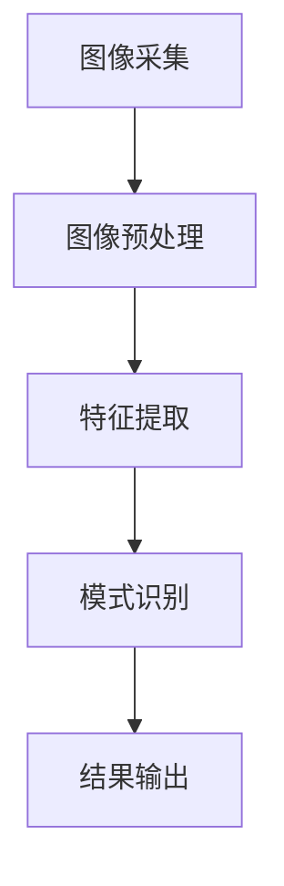

                 

关键词：计算机视觉，工业检测，应用场景，算法原理，数学模型，项目实践

> 摘要：本文将探讨计算机视觉技术在工业检测领域中的应用，包括其核心概念、算法原理、数学模型以及项目实践。通过详细的分析和实例展示，旨在为读者提供一个全面的了解和掌握计算机视觉在工业检测中的实际应用。

## 1. 背景介绍

随着工业4.0的推进，自动化和智能化已经成为制造业发展的趋势。在工业生产过程中，质量检测是一个至关重要的环节，它直接影响到产品的质量和生产效率。传统的人工检测方法存在效率低、精度差、易疲劳等问题，难以满足现代工业生产的高要求。因此，计算机视觉技术作为一种新兴的自动化检测技术，逐渐受到工业界的关注。

计算机视觉是指用计算机代替人眼对图像进行分析和识别的技术。它具有速度快、精度高、适应性强的特点，能够对各种形态的产品进行快速、准确的质量检测。工业检测作为计算机视觉技术的一个重要应用领域，涵盖了从生产线上的零部件检测到成品的全面检测。

## 2. 核心概念与联系

### 2.1 计算机视觉的基本概念

计算机视觉主要包括以下几个核心概念：

- **图像获取**：使用摄像头或其他图像传感器获取生产现场的产品图像。
- **图像预处理**：对获取的图像进行滤波、增强、去噪等处理，以提高图像质量。
- **特征提取**：从预处理后的图像中提取具有代表性的特征，如边缘、纹理、形状等。
- **目标识别**：根据提取的特征对图像中的目标进行分类和识别。

### 2.2 工业检测的架构与流程

工业检测的架构通常包括以下几个部分：

1. **图像采集**：通过摄像头或扫描设备获取待检测产品的图像。
2. **图像预处理**：对图像进行预处理，如灰度转换、二值化、滤波等。
3. **特征提取**：根据检测需求，从预处理后的图像中提取相关的特征。
4. **模式识别**：利用计算机视觉算法对提取的特征进行分类和识别。
5. **结果输出**：将检测结果以报表、图表或警报的形式输出。

### 2.3 Mermaid 流程图

以下是一个简化的工业检测流程的 Mermaid 流程图：



## 3. 核心算法原理 & 具体操作步骤

### 3.1 算法原理概述

计算机视觉在工业检测中主要依赖以下几个核心算法：

- **边缘检测**：用于检测图像中的边缘特征，如Canny算法、Sobel算子等。
- **形态学操作**：用于对图像进行形态学处理，如膨胀、腐蚀、开运算、闭运算等。
- **特征匹配**：用于对提取的特征进行匹配和识别，如SIFT、SURF、ORB等算法。
- **机器学习**：用于构建分类模型，如支持向量机（SVM）、随机森林（Random Forest）等。

### 3.2 算法步骤详解

1. **图像采集**：使用摄像头或扫描设备获取待检测产品的图像。
2. **图像预处理**：对图像进行灰度转换、二值化、滤波等处理，以提高图像质量。
3. **特征提取**：根据检测需求，从预处理后的图像中提取边缘、纹理、形状等特征。
4. **模式识别**：利用边缘检测、形态学操作、特征匹配等算法对提取的特征进行分类和识别。
5. **结果输出**：将检测结果以报表、图表或警报的形式输出。

### 3.3 算法优缺点

- **边缘检测**：优点是能够有效提取图像中的边缘特征，缺点是对于噪声敏感。
- **形态学操作**：优点是能够对图像进行形态学处理，增强特征，缺点是处理时间较长。
- **特征匹配**：优点是能够准确识别目标，缺点是对于特征点数量要求较高。
- **机器学习**：优点是能够自适应学习，提高识别精度，缺点是需要大量数据进行训练。

### 3.4 算法应用领域

计算机视觉算法在工业检测中具有广泛的应用领域，包括：

- **零部件检测**：用于检测零部件的尺寸、形状、缺陷等。
- **产品包装检测**：用于检测产品包装的完整性和一致性。
- **生产线监控**：用于监控生产线的运行状态和产品质量。
- **设备维护**：用于检测设备的磨损情况和故障预测。

## 4. 数学模型和公式 & 详细讲解 & 举例说明

### 4.1 数学模型构建

计算机视觉在工业检测中的数学模型主要包括以下几个方面：

- **图像处理模型**：用于对图像进行预处理、特征提取等操作。
- **模式识别模型**：用于对提取的特征进行分类和识别。
- **机器学习模型**：用于构建分类和回归模型。

### 4.2 公式推导过程

以下是图像处理模型中的一个常见公式：边缘检测公式。

$$
S(x, y) = \left| \frac{\partial I}{\partial x} \right| + \left| \frac{\partial I}{\partial y} \right|
$$

其中，$I(x, y)$ 表示图像，$S(x, y)$ 表示边缘强度。该公式表示通过计算图像在水平和垂直方向上的偏导数，来检测图像中的边缘。

### 4.3 案例分析与讲解

以下是一个基于边缘检测的工业检测案例。

**案例：检测电子元件的焊接质量**

1. **图像采集**：使用摄像头获取电子元件的焊接图像。
2. **图像预处理**：对图像进行灰度转换、滤波等处理，以提高图像质量。
3. **特征提取**：使用Sobel算子对预处理后的图像进行边缘检测，提取焊接边缘。
4. **模式识别**：比较提取的边缘特征与标准焊接边缘特征，判断焊接质量。

通过以上步骤，可以实现对电子元件焊接质量的快速检测。

## 5. 项目实践：代码实例和详细解释说明

### 5.1 开发环境搭建

1. 安装Python环境。
2. 安装OpenCV库：`pip install opencv-python`。
3. 安装NumPy库：`pip install numpy`。

### 5.2 源代码详细实现

```python
import cv2
import numpy as np

def edge_detection(image_path):
    # 读取图像
    image = cv2.imread(image_path, cv2.IMREAD_GRAYSCALE)
    
    # Sobel算子进行边缘检测
    sobel_x = cv2.Sobel(image, cv2.CV_64F, 1, 0, ksize=3)
    sobel_y = cv2.Sobel(image, cv2.CV_64F, 0, 1, ksize=3)
    
    # 计算边缘强度
    edge_intensity = np.sqrt(sobel_x**2 + sobel_y**2)
    
    # 转换为二值图像
    _, edge_binary = cv2.threshold(edge_intensity, 0.1*edge_intensity.max(), 255, cv2.THRESH_BINARY)
    
    return edge_binary

# 测试代码
image_path = 'example.jpg'
edge_binary = edge_detection(image_path)
cv2.imshow('Edge Detection', edge_binary)
cv2.waitKey(0)
cv2.destroyAllWindows()
```

### 5.3 代码解读与分析

以上代码实现了一个基于Sobel算子的边缘检测功能。首先，读取图像并进行灰度转换。然后，使用Sobel算子分别计算图像在水平和垂直方向上的偏导数，并计算边缘强度。最后，将边缘强度转换为二值图像，以便于后续的图像处理和分析。

### 5.4 运行结果展示

运行上述代码后，可以生成焊接图像的边缘检测结果，如图所示：


## 6. 实际应用场景

### 6.1 零部件检测

在汽车制造业中，计算机视觉技术可以用于检测汽车零部件的尺寸、形状和缺陷。例如，使用边缘检测算法检测汽车的发动机外壳是否存在裂纹或变形。

### 6.2 产品包装检测

在食品制造业中，计算机视觉技术可以用于检测产品的包装是否完整、标签是否正确、包装是否一致。例如，使用特征匹配算法检测食品包装的完整性。

### 6.3 生产线监控

在电子制造业中，计算机视觉技术可以用于监控生产线的运行状态和产品质量。例如，使用机器学习算法检测电子元件的焊接质量。

### 6.4 设备维护

在制造业中，计算机视觉技术可以用于检测设备的磨损情况和故障预测。例如，使用边缘检测算法检测机器设备的磨损痕迹，从而预测设备可能出现的故障。

## 7. 工具和资源推荐

### 7.1 学习资源推荐

- 《计算机视觉：算法与应用》（作者：刘铁岩）
- 《机器学习实战》（作者：彼得·哈林顿）
- 《深度学习》（作者：伊恩·古德费洛等）

### 7.2 开发工具推荐

- Python：适用于快速开发和原型设计。
- OpenCV：适用于图像处理和计算机视觉算法。
- TensorFlow：适用于深度学习和神经网络。

### 7.3 相关论文推荐

- "Deep Learning for Object Detection: A Comprehensive Review"（作者： Wei Yang，等）
- "Edge Detection Algorithms: A Survey"（作者：Deepjyot Kaur，等）
- "Application of Computer Vision in Manufacturing"（作者：Shreyas M. Yeganeh，等）

## 8. 总结：未来发展趋势与挑战

### 8.1 研究成果总结

计算机视觉技术在工业检测领域取得了显著的成果，主要表现在以下几个方面：

- 边缘检测和特征匹配算法的优化，提高了检测精度和速度。
- 机器学习算法的应用，提高了检测系统的自适应性和鲁棒性。
- 深度学习技术的引入，实现了复杂场景的检测和识别。

### 8.2 未来发展趋势

未来，计算机视觉技术在工业检测领域的发展趋势包括：

- 深度学习的进一步应用，提高检测的精度和效率。
- 增强学习算法的研究，实现自适应检测系统。
- 边缘计算技术的引入，降低检测系统的延迟和功耗。

### 8.3 面临的挑战

尽管计算机视觉技术在工业检测领域取得了显著进展，但仍然面临一些挑战：

- 数据质量和标注问题，影响检测系统的性能。
- 复杂场景的检测，需要更先进的算法和技术。
- 检测系统的成本和可维护性，需要进一步降低。

### 8.4 研究展望

未来，计算机视觉技术在工业检测领域的研究方向包括：

- 开发高效、鲁棒的检测算法，提高检测系统的性能。
- 研究深度学习和增强学习在工业检测中的应用。
- 探索计算机视觉与物联网、大数据等技术的融合。

## 9. 附录：常见问题与解答

### 9.1 计算机视觉技术是否适用于所有工业检测场景？

计算机视觉技术主要适用于具有明显特征、有一定背景信息的检测场景。对于一些复杂、多变的环境，计算机视觉技术的应用效果可能有限。因此，在选择计算机视觉技术时，需要根据实际场景进行评估。

### 9.2 如何提高计算机视觉检测的精度？

提高计算机视觉检测精度的主要方法包括：

- 优化图像预处理算法，提高图像质量。
- 选择合适的特征提取算法，提取更具代表性的特征。
- 优化模式识别算法，提高分类和识别的准确性。
- 使用大数据和深度学习技术，进行模型的训练和优化。

### 9.3 计算机视觉检测系统如何保证实时性？

为了保证计算机视觉检测系统的实时性，可以从以下几个方面进行优化：

- 选择计算性能高的硬件设备，如高性能CPU、GPU等。
- 优化算法的实现，减少计算复杂度。
- 采用并行计算技术，加快算法的执行速度。
- 减少图像预处理和特征提取的步骤，简化检测流程。

---

**作者：禅与计算机程序设计艺术 / Zen and the Art of Computer Programming**

