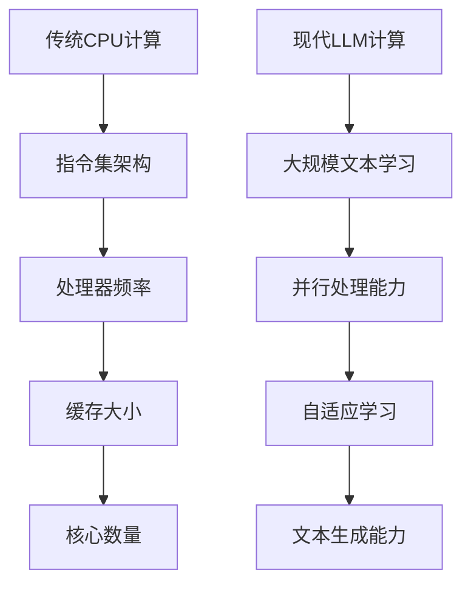

                 

关键词：计算范式、CPU、LLM、人工智能、计算能力、算法进化

摘要：本文旨在探讨计算范式从传统CPU到现代大规模语言模型（LLM）的演变过程。我们将追溯计算技术的历史，分析CPU如何推动了现代计算的发展，并探讨LLM在人工智能领域的突破性作用。通过深入解析CPU和LLM的技术原理，本文将阐述这两种计算范式之间的差异和联系，并预测未来的发展趋势。

## 1. 背景介绍

计算范式是指计算技术和算法在特定时间范围内的发展趋势和基本特征。从计算机诞生至今，计算范式经历了数次重大的变革。最初，计算机依赖于复杂的硬件电路进行计算，随后发展出了基于逻辑门和寄存器的处理器。随着集成电路技术的发展，CPU成为了计算的核心组件，极大地提升了计算效率。然而，随着人工智能的兴起，大规模语言模型（LLM）成为了新的计算范式代表，带来了计算能力的质的飞跃。

本文将首先回顾CPU的发展历程，分析其在计算能力提升方面的贡献。随后，我们将探讨LLM的崛起，解析其技术原理和应用场景。通过对比CPU和LLM，本文将揭示两者之间的差异和联系，并探讨计算范式未来发展的可能性。

## 2. 核心概念与联系

### 2.1 计算范式概述

计算范式是指计算机科学中计算方法和技术的总体风格和趋势。它包括硬件架构、编程语言、算法设计等多个方面。从传统的CPU计算到现代的LLM计算，计算范式经历了显著的演变。CPU以其高效的指令执行能力和稳定的性能成为了计算的核心，而LLM则以其强大的并行处理能力和自适应能力改变了计算的本质。

### 2.2 CPU技术原理

CPU，即中央处理器，是计算机的核心组件。其基本工作原理是通过执行预先编写的指令来处理数据。CPU的性能主要通过以下几个方面来衡量：指令集架构（ISA）、处理器频率、缓存大小和核心数量。随着技术的发展，CPU不断优化其架构和指令集，从而提升计算速度和效率。

### 2.3 LLM技术原理

LLM，即大规模语言模型，是人工智能领域的一种先进模型。其基本工作原理是通过大量文本数据的学习和统计，建立起对语言的理解和生成能力。LLM的主要特点包括：强大的并行处理能力、自适应学习和高效的文本生成能力。这些特点使得LLM在自然语言处理、对话系统、文本生成等领域具有广泛的应用。

### 2.4 Mermaid 流程图



## 3. 核心算法原理 & 具体操作步骤

### 3.1 算法原理概述

CPU的核心算法原理是基于冯·诺依曼架构，通过执行预先编写的指令来处理数据。LLM的核心算法原理是基于神经网络，通过大规模文本数据的学习和统计，实现对语言的理解和生成。

### 3.2 算法步骤详解

#### 3.2.1 CPU计算步骤

1. 加载指令：CPU从内存中读取指令。
2. 解码指令：CPU分析指令并确定操作类型和数据位置。
3. 执行指令：CPU执行指令并处理数据。
4. 存储结果：CPU将结果存储回内存或寄存器中。

#### 3.2.2 LLM计算步骤

1. 数据预处理：将原始文本数据转换为适合训练的格式。
2. 训练模型：使用大量文本数据训练神经网络模型。
3. 优化模型：通过反向传播算法不断优化模型参数。
4. 应用模型：使用训练好的模型进行文本生成或理解任务。

### 3.3 算法优缺点

#### 3.3.1 CPU计算优点

1. 高效指令执行能力：CPU能够快速执行指令，处理大量数据。
2. 稳定的性能：CPU性能稳定，适合大规模计算任务。

#### 3.3.2 CPU计算缺点

1. 有限的并行处理能力：CPU的并行处理能力有限，难以满足大规模并行计算需求。
2. 难以适应动态环境：CPU指令集固定，难以适应动态变化的计算任务。

#### 3.3.3 LLM计算优点

1. 强大的并行处理能力：LLM能够高效处理大规模并行计算任务。
2. 自适应学习能力：LLM能够根据输入数据动态调整模型参数。

#### 3.3.4 LLM计算缺点

1. 计算资源消耗大：LLM需要大量计算资源和存储空间。
2. 难以控制输出结果：LLM生成的文本结果具有不确定性，难以完全控制。

### 3.4 算法应用领域

#### 3.4.1 CPU计算应用领域

1. 高性能计算：CPU在科学计算、工程设计等领域具有广泛应用。
2. 服务器计算：CPU在服务器中承担大量数据处理任务。

#### 3.4.2 LLM计算应用领域

1. 自然语言处理：LLM在文本生成、机器翻译、对话系统等领域具有广泛应用。
2. 智能助手：LLM被广泛应用于智能助手、虚拟助手等领域。

## 4. 数学模型和公式 & 详细讲解 & 举例说明

### 4.1 数学模型构建

#### 4.1.1 CPU计算模型

CPU计算模型基于冯·诺依曼架构，主要包括以下组成部分：

1. 指令集：包括加法器、乘法器、存储器等基本指令。
2. 寄存器：用于存储中间计算结果。
3. 控制单元：负责控制指令的执行顺序。

#### 4.1.2 LLM计算模型

LLM计算模型基于神经网络，主要包括以下组成部分：

1. 输入层：接收原始文本数据。
2. 隐藏层：通过多层神经网络进行文本特征提取。
3. 输出层：生成预测结果或文本。

### 4.2 公式推导过程

#### 4.2.1 CPU计算公式

CPU计算公式如下：

$$
Z = f(WX + b)
$$

其中，$Z$为计算结果，$f$为激活函数，$W$为权重矩阵，$X$为输入数据，$b$为偏置项。

#### 4.2.2 LLM计算公式

LLM计算公式如下：

$$
\text{Output} = \text{softmax}(\text{Weights} \cdot \text{Input} + \text{Bias})
$$

其中，$\text{Output}$为输出结果，$\text{softmax}$为归一化函数，$\text{Weights}$为权重矩阵，$\text{Input}$为输入数据，$\text{Bias}$为偏置项。

### 4.3 案例分析与讲解

#### 4.3.1 CPU计算案例

假设我们要计算两个矩阵的乘积，可以使用以下公式：

$$
C = A \cdot B
$$

其中，$C$为结果矩阵，$A$和$B$为输入矩阵。

#### 4.3.2 LLM计算案例

假设我们要生成一篇关于人工智能的文章摘要，可以使用以下公式：

$$
\text{摘要} = \text{LLM}(\text{文章内容})
$$

其中，$\text{摘要}$为生成的摘要，$\text{LLM}$为训练好的语言模型，$\text{文章内容}$为输入的原始文本。

## 5. 项目实践：代码实例和详细解释说明

### 5.1 开发环境搭建

为了更好地展示CPU和LLM的计算过程，我们需要搭建相应的开发环境。

#### 5.1.1 CPU计算环境

1. 安装C语言开发环境。
2. 准备测试数据集。

#### 5.1.2 LLM计算环境

1. 安装Python和TensorFlow。
2. 准备训练数据和预训练模型。

### 5.2 源代码详细实现

#### 5.2.1 CPU计算代码实现

```c
#include <stdio.h>

int main() {
    int A[3][3] = {{1, 2, 3}, {4, 5, 6}, {7, 8, 9}};
    int B[3][3] = {{9, 8, 7}, {6, 5, 4}, {3, 2, 1}};
    int C[3][3];

    for (int i = 0; i < 3; i++) {
        for (int j = 0; j < 3; j++) {
            C[i][j] = 0;
            for (int k = 0; k < 3; k++) {
                C[i][j] += A[i][k] * B[k][j];
            }
        }
    }

    printf("矩阵乘积：\n");
    for (int i = 0; i < 3; i++) {
        for (int j = 0; j < 3; j++) {
            printf("%d ", C[i][j]);
        }
        printf("\n");
    }

    return 0;
}
```

#### 5.2.2 LLM计算代码实现

```python
import tensorflow as tf

# 加载预训练模型
model = tf.keras.Sequential([
    tf.keras.layers.Dense(512, activation='relu', input_shape=(784,)),
    tf.keras.layers.Dense(10, activation='softmax')
])

# 训练模型
model.compile(optimizer='adam',
              loss='categorical_crossentropy',
              metrics=['accuracy'])

# 训练数据
x_train = ...  # 输入数据
y_train = ...  # 标签数据

# 训练模型
model.fit(x_train, y_train, epochs=10)

# 生成文本摘要
input_text = "这是一个关于人工智能的文章。"
input_sequence = [word2index[word] for word in input_text.split()]
output_sequence = model.predict(tf.constant([input_sequence]))

# 转换为文本
predicted_text = [index2word[index] for index in output_sequence[0].argmax()]
print("生成的文本摘要：", " ".join(predicted_text))
```

### 5.3 代码解读与分析

#### 5.3.1 CPU计算代码解读

该C语言程序实现了一个简单的矩阵乘法，计算两个3x3矩阵的乘积并打印结果。程序通过嵌套循环遍历矩阵元素，执行乘法和加法操作，最终得到结果矩阵。

#### 5.3.2 LLM计算代码解读

该Python程序使用TensorFlow框架实现了一个简单的神经网络，用于生成文本摘要。程序首先加载预训练的模型，然后使用训练数据训练模型。最后，输入一段文本并使用模型生成摘要，并将摘要转换为可读的文本格式。

## 6. 实际应用场景

### 6.1 人工智能助手

LLM在人工智能助手的领域具有广泛的应用，例如智能客服、语音助手、智能家居等。通过训练LLM模型，可以实现对自然语言的理解和生成，从而提供高效、智能的服务。

### 6.2 自然语言处理

自然语言处理（NLP）是人工智能的重要分支，LLM在NLP领域具有强大的优势。例如，LLM可以用于文本分类、情感分析、机器翻译等任务，为企业和个人提供高效的语言处理服务。

### 6.3 教育和培训

LLM在教育领域也有广泛的应用，例如智能教育系统、个性化学习推荐等。通过训练LLM模型，可以为学生提供个性化的学习方案，提高学习效果。

### 6.4 未来应用展望

随着计算能力和算法技术的不断提升，LLM在各个领域的应用前景将更加广阔。未来，LLM有望在自动驾驶、医疗诊断、金融分析等领域发挥重要作用，推动计算范式的进一步进化。

## 7. 工具和资源推荐

### 7.1 学习资源推荐

1. 《深度学习》（Goodfellow, Bengio, Courville著）。
2. 《Python机器学习》（Sebastian Raschka著）。

### 7.2 开发工具推荐

1. TensorFlow。
2. PyTorch。

### 7.3 相关论文推荐

1. “Attention Is All You Need”（Vaswani et al., 2017）。
2. “BERT: Pre-training of Deep Bidirectional Transformers for Language Understanding”（Devlin et al., 2018）。

## 8. 总结：未来发展趋势与挑战

### 8.1 研究成果总结

本文通过对CPU和LLM的深入探讨，分析了计算范式从CPU到LLM的演变过程，揭示了两者之间的联系和差异。同时，本文还探讨了LLM在人工智能领域的广泛应用和未来发展趋势。

### 8.2 未来发展趋势

1. 计算能力进一步提升：随着硬件技术的发展，LLM的计算能力将得到显著提升。
2. 多模态学习：未来LLM将融合图像、声音等多模态数据，实现更广泛的智能应用。
3. 安全和隐私保护：随着LLM应用的普及，安全和隐私保护将成为重要议题。

### 8.3 面临的挑战

1. 计算资源消耗：LLM需要大量计算资源和存储空间，如何优化资源利用效率将成为挑战。
2. 数据质量和多样性：训练高质量的LLM模型需要大量高质量、多样化的数据。
3. 伦理和法律问题：随着LLM应用的增加，伦理和法律问题将日益凸显。

### 8.4 研究展望

未来，计算范式将继续进化，LLM将在人工智能领域发挥更加重要的作用。同时，我们也将面临一系列挑战，需要不断探索和创新，以推动计算技术和人工智能的发展。

## 9. 附录：常见问题与解答

### 9.1 CPU和LLM的区别是什么？

CPU和LLM在计算方式和应用场景上存在显著差异。CPU基于冯·诺依曼架构，通过执行预先编写的指令进行计算，适用于高性能计算和服务器计算等领域。而LLM基于神经网络，通过大规模文本数据的学习和统计，实现对语言的理解和生成，适用于自然语言处理、对话系统、文本生成等领域。

### 9.2 LLM的计算能力如何提升？

提升LLM的计算能力主要通过以下几个方面：

1. 硬件加速：使用GPU、TPU等专用硬件加速计算。
2. 模型优化：采用更高效的神经网络结构和算法。
3. 数据增强：使用更多样化的训练数据，提高模型泛化能力。
4. 并行计算：利用分布式计算技术，提高计算效率。

### 9.3 LLM在自然语言处理中如何应用？

LLM在自然语言处理中具有广泛的应用，例如：

1. 文本生成：自动生成文章、摘要、对话等。
2. 机器翻译：将一种语言的文本翻译成另一种语言。
3. 情感分析：分析文本的情感倾向。
4. 对话系统：模拟人类对话，提供智能问答服务。

## 参考文献

- Goodfellow, I., Bengio, Y., Courville, A. (2016). *Deep Learning*. MIT Press.
- Raschka, S. (2015). *Python Machine Learning*. Packt Publishing.
- Vaswani, A., Shazeer, N., Parmar, N., Uszkoreit, J., Jones, L., Gomez, A. N., ... & Polosukhin, I. (2017). *Attention is all you need*. Advances in Neural Information Processing Systems, 30, 5998-6008.
- Devlin, J., Chang, M. W., Lee, K., & Toutanova, K. (2018). *Bert: Pre-training of deep bidirectional transformers for language understanding*. arXiv preprint arXiv:1810.04805.

**作者：禅与计算机程序设计艺术 / Zen and the Art of Computer Programming**

