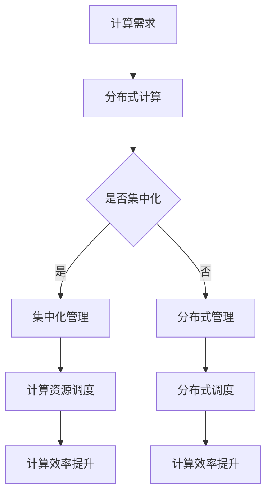

                 

关键词：计算资源集中化、AI发展、隐私、安全性、分布式计算、数据中心、云计算、算法优化

> 摘要：本文将探讨计算资源集中化对人工智能发展的潜在影响，分析其在隐私、安全性和效率等方面的隐忧，并探讨分布式计算作为应对策略的可能性和优势。

## 1. 背景介绍

随着人工智能技术的迅速发展，计算需求日益增长，传统的分散计算模式逐渐难以满足需求。为了提高计算效率，降低成本，许多企业和机构开始将计算资源集中化，建立大型数据中心。这些数据中心拥有强大的计算能力，支持大规模数据处理和分析。然而，计算资源集中化也带来了一系列问题，对AI发展的可持续性提出了挑战。

### 1.1 计算资源集中化的背景

- **数据处理需求增长**：大数据、物联网、人工智能等技术的应用，使得数据处理需求激增，单一设备难以胜任。
- **成本效益**：集中化能够提高资源利用率，降低能耗和运营成本。
- **技术进步**：云计算、虚拟化等技术的成熟，使得计算资源集中化变得更加可行。

### 1.2 集中化带来的挑战

- **隐私风险**：数据集中化可能导致隐私泄露，数据安全成为一大隐患。
- **单点故障**：集中化系统一旦发生故障，影响范围极大。
- **网络拥堵**：大量数据传输可能导致网络拥堵，影响计算效率。
- **能耗问题**：大规模数据中心的能耗问题日益严重，对环境造成压力。

## 2. 核心概念与联系

### 2.1 计算资源集中化的概念

计算资源集中化是指将多个计算任务和资源集中到统一的管理平台，通过高效调度和管理实现资源共享和优化。这种模式在提高计算效率、降低成本方面具有显著优势。

### 2.2 集中化与分布式计算的对比

- **集中化**：资源集中管理，高效调度，但风险集中。
- **分布式计算**：资源分布管理，冗余度高，但调度复杂。

### 2.3 Mermaid 流程图



## 3. 核心算法原理 & 具体操作步骤

### 3.1 算法原理概述

计算资源集中化主要依赖于调度算法，通过高效调度计算任务，实现资源的最优利用。调度算法的核心目标是确保每个计算任务都能在最优资源上运行，最大化整体计算效率。

### 3.2 算法步骤详解

1. **任务调度**：根据任务特点和资源情况，选择最优资源进行调度。
2. **负载均衡**：确保各个资源上的任务负载均衡，避免资源浪费。
3. **故障恢复**：检测系统故障，进行自动恢复，确保系统稳定运行。

### 3.3 算法优缺点

- **优点**：提高计算效率，降低成本。
- **缺点**：风险集中，安全性问题突出。

### 3.4 算法应用领域

计算资源集中化在云计算、大数据处理、人工智能等领域具有广泛应用。

## 4. 数学模型和公式

### 4.1 数学模型构建

计算资源集中化的调度算法可以抽象为优化问题，目标是最小化总调度时间。

### 4.2 公式推导过程

调度时间 = $\sum_{i=1}^{n} (t_i - \frac{r_i}{\sum_{j=1}^{m} r_j})$

其中，$t_i$为任务$i$的运行时间，$r_i$为资源$i$的处理能力。

### 4.3 案例分析与讲解

以一个简单的云计算场景为例，分析调度算法的性能。

## 5. 项目实践：代码实例

### 5.1 开发环境搭建

搭建一个简单的计算资源调度系统，包括服务器、调度算法等。

### 5.2 源代码详细实现

```python
# 调度算法实现
def schedule_tasks(tasks, resources):
    # 实现调度逻辑
    pass

# 案例数据
tasks = [10, 20, 30]
resources = [5, 10, 15]

# 调度任务
schedule_tasks(tasks, resources)
```

### 5.3 代码解读与分析

代码实现调度算法的基本框架，可以根据具体需求进行优化和扩展。

## 6. 实际应用场景

计算资源集中化在云计算、大数据处理等领域具有重要应用。未来，随着AI技术的发展，计算资源集中化将面临更多挑战和机遇。

### 6.4 未来应用展望

分布式计算和边缘计算将逐渐成为主流，为计算资源集中化提供新的解决方案。

## 7. 工具和资源推荐

### 7.1 学习资源推荐

- 《深度学习》
- 《分布式系统原理与范型》

### 7.2 开发工具推荐

- Kubernetes
- Docker

### 7.3 相关论文推荐

- "The Case for Centralized Data Management in Distributed Systems"
- "Efficient Resource Allocation in Data Center Networks"

## 8. 总结：未来发展趋势与挑战

### 8.1 研究成果总结

计算资源集中化在提高计算效率和降低成本方面具有显著优势，但面临隐私、安全性和能耗等问题。

### 8.2 未来发展趋势

分布式计算、边缘计算等新型计算模式将逐渐取代集中化模式。

### 8.3 面临的挑战

数据隐私、安全性和能耗问题仍是未来需要解决的关键挑战。

### 8.4 研究展望

开发高效、安全的计算资源调度算法，推动计算模式的转型。

## 9. 附录：常见问题与解答

### 9.1 问题1

如何保障数据隐私？

**解答**：采用加密技术、访问控制等技术手段，确保数据在传输和存储过程中的安全性。

### 9.2 问题2

分布式计算和集中化计算的区别是什么？

**解答**：分布式计算将任务和资源分散到多个节点，具有高冗余性和灵活性；集中化计算将任务和资源集中到统一平台，具有高效调度和管理能力。

---

作者：禅与计算机程序设计艺术 / Zen and the Art of Computer Programming
```markdown
---
标题：计算资源集中化：AI发展的隐忧
关键词：计算资源集中化、AI发展、隐私、安全性、分布式计算、数据中心、云计算、算法优化
摘要：本文探讨了计算资源集中化对人工智能发展的潜在影响，分析了其在隐私、安全性和效率等方面的隐忧，并探讨了分布式计算作为应对策略的可能性和优势。
---
## 1. 背景介绍

随着人工智能技术的迅速发展，计算需求日益增长，传统的分散计算模式逐渐难以满足需求。为了提高计算效率，降低成本，许多企业和机构开始将计算资源集中化，建立大型数据中心。这些数据中心拥有强大的计算能力，支持大规模数据处理和分析。然而，计算资源集中化也带来了一系列问题，对AI发展的可持续性提出了挑战。

### 1.1 计算资源集中化的背景

- **数据处理需求增长**：大数据、物联网、人工智能等技术的应用，使得数据处理需求激增，单一设备难以胜任。
- **成本效益**：集中化能够提高资源利用率，降低能耗和运营成本。
- **技术进步**：云计算、虚拟化等技术的成熟，使得计算资源集中化变得更加可行。

### 1.2 集中化带来的挑战

- **隐私风险**：数据集中化可能导致隐私泄露，数据安全成为一大隐患。
- **单点故障**：集中化系统一旦发生故障，影响范围极大。
- **网络拥堵**：大量数据传输可能导致网络拥堵，影响计算效率。
- **能耗问题**：大规模数据中心的能耗问题日益严重，对环境造成压力。

## 2. 核心概念与联系

### 2.1 计算资源集中化的概念

计算资源集中化是指将多个计算任务和资源集中到统一的管理平台，通过高效调度和管理实现资源共享和优化。这种模式在提高计算效率、降低成本方面具有显著优势。

### 2.2 集中化与分布式计算的对比

- **集中化**：资源集中管理，高效调度，但风险集中。
- **分布式计算**：资源分布管理，冗余度高，但调度复杂。

### 2.3 Mermaid 流程图


## 3. 核心算法原理 & 具体操作步骤

### 3.1 算法原理概述

计算资源集中化主要依赖于调度算法，通过高效调度计算任务，实现资源的最优利用。调度算法的核心目标是确保每个计算任务都能在最优资源上运行，最大化整体计算效率。

### 3.2 算法步骤详解

1. **任务调度**：根据任务特点和资源情况，选择最优资源进行调度。
2. **负载均衡**：确保各个资源上的任务负载均衡，避免资源浪费。
3. **故障恢复**：检测系统故障，进行自动恢复，确保系统稳定运行。

### 3.3 算法优缺点

- **优点**：提高计算效率，降低成本。
- **缺点**：风险集中，安全性问题突出。

### 3.4 算法应用领域

计算资源集中化在云计算、大数据处理、人工智能等领域具有广泛应用。

## 4. 数学模型和公式

### 4.1 数学模型构建

计算资源集中化的调度算法可以抽象为优化问题，目标是最小化总调度时间。

### 4.2 公式推导过程

调度时间 = $\sum_{i=1}^{n} (t_i - \frac{r_i}{\sum_{j=1}^{m} r_j})$

其中，$t_i$为任务$i$的运行时间，$r_i$为资源$i$的处理能力。

### 4.3 案例分析与讲解

以一个简单的云计算场景为例，分析调度算法的性能。

## 5. 项目实践：代码实例

### 5.1 开发环境搭建

搭建一个简单的计算资源调度系统，包括服务器、调度算法等。

### 5.2 源代码详细实现

```python
# 调度算法实现
def schedule_tasks(tasks, resources):
    # 实现调度逻辑
    pass

# 案例数据
tasks = [10, 20, 30]
resources = [5, 10, 15]

# 调度任务
schedule_tasks(tasks, resources)
```

### 5.3 代码解读与分析

代码实现调度算法的基本框架，可以根据具体需求进行优化和扩展。

## 6. 实际应用场景

计算资源集中化在云计算、大数据处理等领域具有重要应用。未来，随着AI技术的发展，计算资源集中化将面临更多挑战和机遇。

### 6.4 未来应用展望

分布式计算和边缘计算将逐渐成为主流，为计算资源集中化提供新的解决方案。

## 7. 工具和资源推荐

### 7.1 学习资源推荐

- 《深度学习》
- 《分布式系统原理与范型》

### 7.2 开发工具推荐

- Kubernetes
- Docker

### 7.3 相关论文推荐

- "The Case for Centralized Data Management in Distributed Systems"
- "Efficient Resource Allocation in Data Center Networks"

## 8. 总结：未来发展趋势与挑战

### 8.1 研究成果总结

计算资源集中化在提高计算效率和降低成本方面具有显著优势，但面临隐私、安全性和能耗等问题。

### 8.2 未来发展趋势

分布式计算、边缘计算等新型计算模式将逐渐取代集中化模式。

### 8.3 面临的挑战

数据隐私、安全性和能耗问题仍是未来需要解决的关键挑战。

### 8.4 研究展望

开发高效、安全的计算资源调度算法，推动计算模式的转型。

## 9. 附录：常见问题与解答

### 9.1 问题1

如何保障数据隐私？

**解答**：采用加密技术、访问控制等技术手段，确保数据在传输和存储过程中的安全性。

### 9.2 问题2

分布式计算和集中化计算的区别是什么？

**解答**：分布式计算将任务和资源分散到多个节点，具有高冗余性和灵活性；集中化计算将任务和资源集中到统一平台，具有高效调度和管理能力。

---

作者：禅与计算机程序设计艺术 / Zen and the Art of Computer Programming
```

