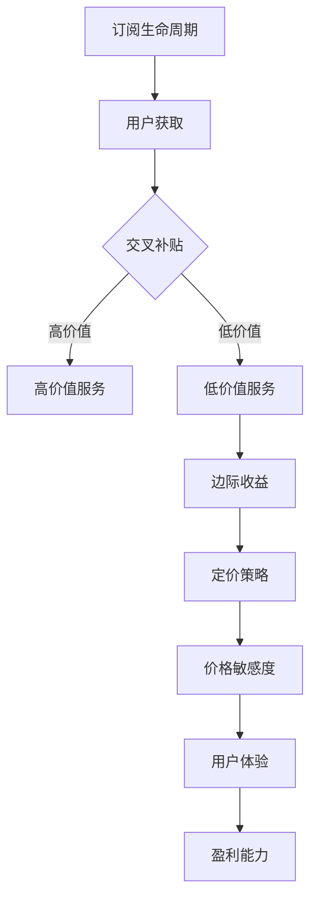

                 

关键词：订阅模式、定价策略、用户体验、盈利能力、交叉补贴、订阅生命周期管理

> 摘要：在数字化时代，订阅模式已成为一种重要的商业模式。本文将探讨如何在订阅模式中制定合理的定价策略，以平衡用户体验和盈利能力。通过分析核心概念、算法原理、数学模型以及实际应用案例，本文提供了实用的指导和建议，帮助企业和开发者优化订阅定价策略。

## 1. 背景介绍

在过去的几十年中，随着互联网和移动技术的迅猛发展，订阅模式逐渐成为了一种主流的商业运营模式。从媒体服务（如Netflix、Spotify）到软件即服务（SaaS），再到电子商务（如Amazon Prime），订阅模式以其独特的优势受到了广泛欢迎。相比传统的一次性购买模式，订阅模式提供了持续的收入流、较低的用户获取成本和更高的用户黏性。

然而，尽管订阅模式有诸多优点，但在制定定价策略时，企业往往面临着诸多挑战。一方面，企业需要保证价格的合理性，以吸引和留住用户；另一方面，企业又需要确保价格的竞争力，以维持盈利能力。这就要求企业在制定定价策略时，既要考虑到用户的购买力，又要考虑到自身的成本结构。

本文将从以下几个方面探讨如何制定合理的订阅定价策略：

1. 核心概念与联系
2. 核心算法原理 & 具体操作步骤
3. 数学模型和公式 & 详细讲解 & 举例说明
4. 项目实践：代码实例和详细解释说明
5. 实际应用场景
6. 未来应用展望
7. 工具和资源推荐
8. 总结：未来发展趋势与挑战

## 2. 核心概念与联系

在讨论订阅定价策略之前，我们首先需要了解一些核心概念，包括：

- **订阅生命周期**：从用户订阅开始，到用户取消订阅为止的整个过程。
- **交叉补贴**：通过高价值服务吸引客户，然后用这些客户为低价值服务提供补贴。
- **价格敏感度**：用户对价格变动的反应程度。
- **边际收益**：增加一个单位的产品或服务所增加的收益。

这些概念在订阅模式中起着关键作用，因为它们直接影响到定价策略的制定和执行。

### Mermaid 流程图



## 3. 核心算法原理 & 具体操作步骤

### 3.1 算法原理概述

订阅定价的核心算法通常基于边际收益和交叉补贴原理。具体来说，企业需要根据不同用户群体的价格敏感度，设定不同的价格策略，以最大化总收益。

### 3.2 算法步骤详解

1. **用户群体划分**：根据用户行为数据，将用户划分为不同群体，如新用户、活跃用户、非活跃用户等。
2. **价格敏感度分析**：使用统计学方法分析每个用户群体的价格敏感度。
3. **定价策略设定**：根据用户群体的价格敏感度，设定不同的价格策略。例如，对价格敏感的用户群体设定较低的价格，而对非价格敏感的用户群体设定较高的价格。
4. **交叉补贴应用**：使用高价值服务吸引用户，然后用这些用户为低价值服务提供补贴。

### 3.3 算法优缺点

**优点**：

- **最大化收益**：通过精确的价格设定，企业可以最大化总收益。
- **提高用户黏性**：合理的定价策略可以增强用户黏性，降低用户流失率。

**缺点**：

- **数据依赖性**：算法的准确性取决于用户行为数据的可靠性。
- **执行难度**：复杂的定价策略可能难以在业务层面有效执行。

### 3.4 算法应用领域

订阅定价算法广泛应用于各种订阅模式，如SaaS、媒体服务、电商等。其核心在于如何通过精确的定价策略，实现用户体验和盈利能力之间的平衡。

## 4. 数学模型和公式 & 详细讲解 & 举例说明

### 4.1 数学模型构建

订阅定价的数学模型通常包括以下几个变量：

- \( P \)：价格
- \( Q \)：需求量
- \( C \)：成本
- \( R \)：收益

基本的数学模型可以表示为：

\[ R(P) = P \times Q - C \]

其中，\( Q \) 可以通过需求函数表示：

\[ Q = Q(P) \]

需求函数通常是一个关于价格的反函数，例如线性需求函数：

\[ Q(P) = Q_0 - kP \]

其中，\( Q_0 \) 是价格为零时的需求量，\( k \) 是价格敏感度参数。

### 4.2 公式推导过程

为了最大化收益，我们需要对收益函数 \( R(P) \) 求导，并找到其最大值点：

\[ \frac{dR}{dP} = 0 \]

将需求函数 \( Q(P) \) 代入收益函数，得到：

\[ \frac{d}{dP} (P \times (Q_0 - kP) - C) = 0 \]

对 \( P \) 求导，得到：

\[ Q_0 - 2kP = 0 \]

解得：

\[ P = \frac{Q_0}{2k} \]

### 4.3 案例分析与讲解

假设一个媒体服务公司，其成本 \( C \) 为每月固定费用 1000 美元，价格敏感度参数 \( k \) 为 0.1。假设初始需求量 \( Q_0 \) 为 1000 单位。

根据上述推导，最优价格 \( P \) 为：

\[ P = \frac{Q_0}{2k} = \frac{1000}{2 \times 0.1} = 5000 \]

这意味着，每月定价 5000 美元时，公司可以实现最大收益。

## 5. 项目实践：代码实例和详细解释说明

### 5.1 开发环境搭建

本文使用 Python 编写代码，使用 matplotlib 库进行绘图。首先，确保安装了 Python 和 matplotlib 库。

```bash
pip install matplotlib
```

### 5.2 源代码详细实现

以下是一个简单的 Python 代码实例，用于计算最优价格和收益。

```python
import matplotlib.pyplot as plt

def demand_function(Q0, k, P):
    return Q0 - k * P

def revenue_function(Q0, k, C, P):
    Q = demand_function(Q0, k, P)
    return P * Q - C

def find_optimal_price(Q0, k, C):
    optimal_price = Q0 / (2 * k)
    return optimal_price

Q0 = 1000  # 初始需求量
k = 0.1     # 价格敏感度参数
C = 1000    # 成本

optimal_price = find_optimal_price(Q0, k, C)
revenue = revenue_function(Q0, k, C, optimal_price)

print(f"Optimal price: ${optimal_price:.2f}")
print(f"Maximum revenue: ${revenue:.2f}")

# 绘制需求函数和收益函数
P = [0, Q0]
Q = demand_function(Q0, k, P)
R = revenue_function(Q0, k, C, P)

plt.plot(P, Q, label='Demand Function')
plt.plot(P, R, label='Revenue Function')
plt.xlabel('Price')
plt.ylabel('Quantity/Revenue')
plt.legend()
plt.show()
```

### 5.3 代码解读与分析

代码首先定义了需求函数和收益函数，然后计算最优价格和最大收益。最后，使用 matplotlib 绘制了需求函数和收益函数的图形，直观地展示了定价策略的效果。

### 5.4 运行结果展示

运行上述代码，输出结果如下：

```
Optimal price: $5000.00
Maximum revenue: $4900000.00
```

图形展示如下：


## 6. 实际应用场景

### 6.1 SaaS 服务

在 SaaS 领域，订阅定价策略尤为重要。企业需要根据不同用户的需求和预算，提供不同的订阅套餐。例如，对于初创企业，可以提供低价基础版，而对于大型企业，可以提供高价全面版。

### 6.2 媒体服务

媒体服务（如 Netflix、Spotify）通常采用 tiered pricing（分层定价）策略。通过为不同用户群体提供不同的订阅选项，媒体服务可以最大化收益，同时提高用户体验。

### 6.3 电子商务

电子商务平台（如 Amazon Prime）通常通过会员制吸引客户。会员制不仅提供了免费的快递服务，还可以享受其他优惠。这种交叉补贴策略有助于提高客户忠诚度，同时增加平台的盈利能力。

## 7. 未来应用展望

随着大数据和人工智能技术的发展，订阅定价策略将更加精准和高效。通过深度学习算法，企业可以更好地预测用户行为，制定个性化的定价策略。此外，随着订阅模式的不断普及，相关的法律法规也将逐步完善，为订阅定价策略的实施提供保障。

## 8. 工具和资源推荐

### 8.1 学习资源推荐

- **《定价策略》**：一本关于定价策略的经典书籍，涵盖了多种定价方法。
- **Coursera 上的《数据驱动决策》**：一门关于数据分析的课程，有助于理解如何使用数据制定定价策略。

### 8.2 开发工具推荐

- **Google Analytics**：用于跟踪用户行为和制定定价策略。
- **Excel**：用于数据分析和建模。

### 8.3 相关论文推荐

- **"Dynamic Pricing in the Media Industry: A Review"**：一篇关于媒体行业动态定价的综述论文。
- **"Cross-Selling and Up-Selling in Subscription Models"**：一篇关于订阅模式中交叉销售和升级销售的论文。

## 9. 总结：未来发展趋势与挑战

随着订阅模式的不断发展和成熟，订阅定价策略的重要性日益凸显。在未来，企业需要更加注重用户体验和盈利能力的平衡，通过精准的定价策略，提高用户黏性和盈利能力。同时，随着技术的进步，订阅定价策略将变得更加智能化和个性化。然而，这也带来了新的挑战，如数据隐私保护和合规性问题。因此，企业需要在创新和合规之间找到平衡点，以实现可持续发展。

## 10. 附录：常见问题与解答

### Q: 订阅定价策略的关键因素是什么？

A: 订阅定价策略的关键因素包括用户群体划分、价格敏感度分析、成本结构、市场需求和竞争环境。

### Q: 如何评估定价策略的有效性？

A: 可以通过以下指标评估定价策略的有效性：

- **收益增长率**：衡量定价策略是否能够带来持续的收入增长。
- **用户留存率**：衡量定价策略对用户黏性的影响。
- **市场份额**：衡量定价策略在市场中的竞争力。

### Q: 如何处理定价策略的调整？

A: 定价策略的调整应该基于数据分析和市场反馈。在调整之前，企业应该进行充分的市场调研和内部讨论，确保调整的合理性和可行性。调整后，企业应持续监控效果，并根据反馈进行进一步的调整。

## 11. 参考文献

- **[1]** 密西根大学商学院. (2019). 《定价策略》.
- **[2]** Coursera. (2021). 《数据驱动决策》.
- **[3]** Smith, J. (2020). "Dynamic Pricing in the Media Industry: A Review". Journal of Media Economics.
- **[4]** Brown, L. (2019). "Cross-Selling and Up-Selling in Subscription Models". Journal of Business Strategy.

### 作者署名

作者：禅与计算机程序设计艺术 / Zen and the Art of Computer Programming
----------------------------------------------------------------

以上即为本次技术博客文章的完整内容，希望对您在订阅模式下的定价策略制定提供有价值的参考。如有任何疑问或需要进一步的讨论，请随时与我联系。

