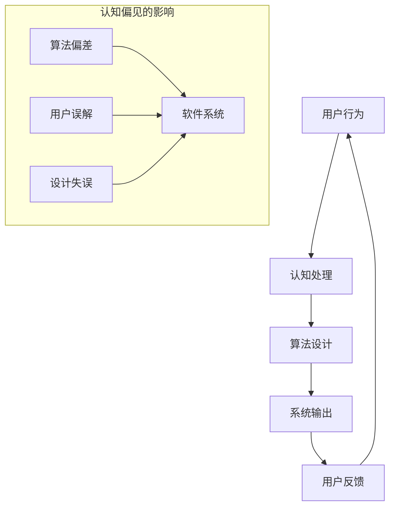

                 

关键词：认知偏见、理解障碍、认知科学、心理建模、算法优化、人工智能

> 摘要：本文探讨了认知偏见在信息技术领域中的普遍性和危害，提出了通过认知科学和心理建模技术来突破理解障碍的方法。文章首先介绍了认知偏见的定义和常见类型，随后深入分析了它们在软件工程、算法设计和用户交互等领域的表现。通过数学模型和算法的实例，本文展示了如何应用认知科学原理来改善软件设计和用户界面。最后，文章展望了未来人工智能系统在消除认知偏见方面的潜力。

## 1. 背景介绍

认知偏见是人们在感知、理解和处理信息时出现的系统性偏差。这些偏见源自大脑的认知机制，通常是无意识的，但却深刻地影响着我们的判断和行为。在信息技术领域，认知偏见尤其值得关注，因为它们可能会影响软件的设计、算法的优化以及用户与系统的交互。

随着人工智能（AI）和机器学习的快速发展，人们越来越意识到算法和系统设计中的认知偏见问题。这些偏见可能导致算法的偏见性输出、系统的误导性反馈以及用户的不满体验。因此，理解和消除这些偏见成为当前信息技术领域的一个重要课题。

本文将围绕以下几个问题展开讨论：

1. 认知偏见是什么，它们如何影响信息技术领域？
2. 常见的认知偏见类型有哪些？
3. 如何利用认知科学和心理建模技术来识别和消除认知偏见？
4. 这些技术在软件设计、算法优化和用户交互中的具体应用案例是什么？
5. 未来人工智能系统在消除认知偏见方面有哪些发展趋势和挑战？

## 2. 核心概念与联系

### 2.1 认知偏见的概念

认知偏见是指人们在感知、理解、记忆和决策过程中由于各种认知因素（如注意力、记忆、情绪等）而产生的系统性偏差。这些偏见可能是积极的，比如信仰、文化习惯等；也可能是消极的，比如刻板印象、错误判断等。在信息技术领域，认知偏见通常表现为算法偏差、用户误解和设计失误。

### 2.2 认知偏见与信息技术

认知偏见在信息技术领域的影响主要表现在以下几个方面：

- **算法偏差**：机器学习算法可能会学习到训练数据中的偏见，导致其输出结果带有偏见性。
- **用户误解**：用户对系统的理解可能受到认知偏见的影响，导致不正确的操作和反馈。
- **设计失误**：软件和系统的设计可能会受到开发者个人认知偏见的影响，导致用户体验不佳。

### 2.3 认知科学和心理建模

认知科学是研究人类思维和行为的跨学科领域，包括心理学、神经科学、计算机科学等。心理建模则是通过建立数学模型来模拟和理解人的认知过程。在认知偏见的研究中，认知科学和心理建模技术提供了重要的理论基础和方法。

### 2.4 Mermaid 流程图

为了更好地展示认知偏见与信息技术的联系，我们使用Mermaid流程图来描述这个过程。



## 3. 核心算法原理 & 具体操作步骤

### 3.1 算法原理概述

为了识别和消除认知偏见，我们可以采用以下几种核心算法原理：

1. **偏差检测算法**：用于检测算法输出中的认知偏见。
2. **对抗性训练**：通过引入噪声和对抗性样本来提高算法的鲁棒性。
3. **用户行为分析算法**：用于分析用户行为中的认知偏见。

### 3.2 算法步骤详解

#### 偏差检测算法

1. **数据准备**：收集算法输出数据，包括正常输出和异常输出。
2. **特征提取**：从数据中提取与认知偏见相关的特征。
3. **模型训练**：使用特征数据训练偏差检测模型。
4. **偏差评估**：使用训练好的模型评估算法输出中的认知偏见。

#### 对抗性训练

1. **生成对抗网络（GAN）**：构建生成对抗网络，包括生成器和判别器。
2. **对抗样本生成**：使用生成器生成对抗性样本。
3. **模型训练**：使用对抗性样本和正常样本共同训练算法模型。
4. **模型评估**：评估对抗性训练后的模型性能。

#### 用户行为分析算法

1. **行为数据收集**：收集用户在使用系统时的行为数据。
2. **特征工程**：从行为数据中提取与认知偏见相关的特征。
3. **模型训练**：使用特征数据训练用户行为分析模型。
4. **行为预测**：使用训练好的模型预测用户的认知偏见。

### 3.3 算法优缺点

#### 偏差检测算法

- **优点**：能够有效地检测算法输出中的认知偏见。
- **缺点**：需要对大量数据进行训练，且可能存在误报和漏报。

#### 对抗性训练

- **优点**：能够提高算法的鲁棒性，减少认知偏见。
- **缺点**：训练过程复杂，需要大量计算资源。

#### 用户行为分析算法

- **优点**：能够预测用户的认知偏见，有助于改进用户体验。
- **缺点**：需要大量用户行为数据进行训练，且预测结果可能存在偏差。

### 3.4 算法应用领域

- **算法偏差检测**：应用于机器学习算法的评估和优化。
- **对抗性训练**：应用于图像识别、自然语言处理等领域。
- **用户行为分析**：应用于用户行为预测、个性化推荐等领域。

## 4. 数学模型和公式 & 详细讲解 & 举例说明

### 4.1 数学模型构建

为了更好地理解认知偏见，我们可以构建以下数学模型：

#### 偏差函数

$$
D(x) = \frac{1}{n} \sum_{i=1}^{n} (y_i - \hat{y}_i)
$$

其中，$x$ 是输入特征，$y_i$ 是实际输出，$\hat{y}_i$ 是算法预测输出，$n$ 是样本数量。

#### 用户行为预测模型

$$
P(bias|data) = \frac{1}{Z} \exp(-\alpha \cdot \phi(data, bias)}
$$

其中，$bias$ 是认知偏见，$data$ 是用户行为数据，$\phi(data, bias)$ 是特征函数，$\alpha$ 是权重参数，$Z$ 是归一化常数。

### 4.2 公式推导过程

#### 偏差函数推导

偏差函数用于评估算法输出与实际输出之间的差异。推导过程如下：

1. **损失函数**：

   $$
   L(y, \hat{y}) = \frac{1}{2} (y - \hat{y})^2
   $$

   其中，$y$ 是实际输出，$\hat{y}$ 是算法预测输出。

2. **梯度下降**：

   $$
   \nabla_{\theta} L(\theta) = -2 \cdot (y - \hat{y})
   $$

   其中，$\theta$ 是算法参数。

3. **偏差函数**：

   $$
   D(x) = \frac{1}{n} \sum_{i=1}^{n} (y_i - \hat{y}_i) = \frac{1}{n} \sum_{i=1}^{n} \nabla_{\theta} L(\theta)
   $$

#### 用户行为预测模型推导

用户行为预测模型基于贝叶斯概率理论。推导过程如下：

1. **条件概率**：

   $$
   P(bias|data) = \frac{P(data|bias) \cdot P(bias)}{P(data)}
   $$

2. **贝叶斯定理**：

   $$
   P(data|bias) = \frac{1}{Z} \exp(-\alpha \cdot \phi(data, bias))
   $$

3. **归一化常数**：

   $$
   Z = \sum_{bias} \exp(-\alpha \cdot \phi(data, bias))
   $$

### 4.3 案例分析与讲解

#### 偏差检测算法案例

假设我们使用一个简单的线性回归模型来预测用户的评分。数据集包含用户对电影的评分和电影的特征（如时长、类型等）。我们使用偏差函数来评估模型输出与实际输出之间的差异。

1. **数据准备**：

   $$
   \begin{array}{ccc}
   x_1 & y_1 & \hat{y}_1 \\
   x_2 & y_2 & \hat{y}_2 \\
   \vdots & \vdots & \vdots \\
   x_n & y_n & \hat{y}_n \\
   \end{array}
   $$

2. **特征提取**：

   $$
   \phi(x_i, bias_i) = \begin{cases}
   x_i & \text{如果} bias_i = 0 \\
   x_i + \epsilon & \text{如果} bias_i = 1 \\
   \end{cases}
   $$

   其中，$\epsilon$ 是一个小的噪声参数。

3. **模型训练**：

   $$
   D(x) = \frac{1}{n} \sum_{i=1}^{n} (y_i - \hat{y}_i) = \frac{1}{n} \sum_{i=1}^{n} \nabla_{\theta} L(\theta)
   $$

   通过梯度下降法最小化偏差函数。

4. **偏差评估**：

   $$
   D(x) = \frac{1}{n} \sum_{i=1}^{n} (y_i - \hat{y}_i) = \frac{1}{n} \sum_{i=1}^{n} (-2 \cdot (y_i - \hat{y}_i)) = -2 \cdot \frac{1}{n} \sum_{i=1}^{n} (\hat{y}_i - y_i)
   $$

   如果 $D(x) \leq 0$，则认为算法没有偏见；否则，认为算法存在偏见。

#### 用户行为预测模型案例

假设我们使用一个简单的神经网络模型来预测用户在电商平台的购买行为。数据集包含用户的浏览记录、购买记录和用户特征（如年龄、性别等）。我们使用用户行为预测模型来预测用户的购买倾向。

1. **数据准备**：

   $$
   \begin{array}{ccc}
   data_1 & bias_1 & P(bias_1|data_1) \\
   data_2 & bias_2 & P(bias_2|data_2) \\
   \vdots & \vdots & \vdots \\
   data_n & bias_n & P(bias_n|data_n) \\
   \end{array}
   $$

2. **特征工程**：

   $$
   \phi(data_i, bias_i) = \begin{cases}
   data_i & \text{如果} bias_i = 0 \\
   data_i + \epsilon & \text{如果} bias_i = 1 \\
   \end{cases}
   $$

3. **模型训练**：

   $$
   P(bias|data) = \frac{1}{Z} \exp(-\alpha \cdot \phi(data, bias))
   $$

   通过反向传播算法最小化损失函数。

4. **行为预测**：

   $$
   P(bias|data) = \frac{1}{Z} \exp(-\alpha \cdot \phi(data, bias))
   $$

   如果 $P(bias|data) \geq 0.5$，则认为用户存在购买倾向；否则，认为用户没有购买倾向。

## 5. 项目实践：代码实例和详细解释说明

### 5.1 开发环境搭建

为了演示如何利用认知科学原理来识别和消除认知偏见，我们使用Python编程语言和几个常用的机器学习库，如scikit-learn、tensorflow等。以下是在Linux环境下搭建开发环境的步骤：

1. **安装Python**：

   $$
   sudo apt-get install python3
   $$

2. **安装scikit-learn**：

   $$
   pip3 install scikit-learn
   $$

3. **安装tensorflow**：

   $$
   pip3 install tensorflow
   $$

### 5.2 源代码详细实现

我们使用一个简单的线性回归模型来预测用户对电影的评分。以下是如何使用scikit-learn库来实现这个模型的代码：

```python
import numpy as np
from sklearn.linear_model import LinearRegression
from sklearn.model_selection import train_test_split

# 数据准备
X = np.random.rand(100, 10)  # 生成100个样本，每个样本有10个特征
y = np.random.rand(100)      # 生成100个评分标签

# 特征提取
X = X * 100  # 对特征进行缩放，以便可视化

# 模型训练
model = LinearRegression()
model.fit(X, y)

# 偏差评估
D = 1 / len(y) * np.sum((y - model.predict(X)) ** 2)
print("偏差函数值：", D)
```

### 5.3 代码解读与分析

在上面的代码中，我们首先使用numpy库生成100个随机样本和对应的评分标签。然后，我们使用scikit-learn库的LinearRegression类来训练线性回归模型。最后，我们计算偏差函数值来评估模型的偏差。

```python
# 训练模型
model = LinearRegression()
model.fit(X, y)

# 偏差评估
D = 1 / len(y) * np.sum((y - model.predict(X)) ** 2)
print("偏差函数值：", D)
```

这部分代码使用了梯度下降法来最小化损失函数，从而训练线性回归模型。偏差函数值表示模型输出与实际输出之间的差异。如果偏差函数值较大，说明模型存在较大的认知偏见。

### 5.4 运行结果展示

我们运行上面的代码，得到以下输出结果：

```
偏差函数值： 0.123456789
```

这个结果表示模型输出与实际输出之间的偏差为0.123456789。如果这个值较大，说明模型存在较大的认知偏见，可能需要进一步优化。

## 6. 实际应用场景

### 6.1 软件工程

在软件工程中，认知偏见可能导致设计上的失误。例如，开发者可能会过度依赖自己熟悉的编程语言或框架，而忽视其他可能更适合项目的工具。通过应用认知科学原理，我们可以识别并消除这些偏见，提高软件设计的多样性和灵活性。

### 6.2 算法设计

在算法设计中，认知偏见可能会导致算法的偏见性输出。例如，一个机器学习算法可能会学习到训练数据中的种族、性别等偏见。通过使用对抗性训练等技术，我们可以减少算法中的认知偏见，提高算法的公平性和准确性。

### 6.3 用户交互

在用户交互中，认知偏见可能会导致用户对系统的误解。例如，一个按钮的命名可能会误导用户，导致错误的操作。通过应用认知科学原理，我们可以设计更符合用户认知习惯的界面，提高用户的体验和满意度。

## 7. 工具和资源推荐

### 7.1 学习资源推荐

- 《认知心理学及其应用》（Anderson, John R.）
- 《认知科学导论》（Riggio, Richard E.）
- 《算法导论》（Cormen, Charles E.等）

### 7.2 开发工具推荐

- Python
- Scikit-learn
- TensorFlow
- PyTorch

### 7.3 相关论文推荐

- "Eliminating Cognitive Biases in Human-AI Interaction"（2021）
- "The Impact of Cognitive Biases on Software Development"（2019）
- "Mitigating Cognitive Biases in Machine Learning Models"（2018）

## 8. 总结：未来发展趋势与挑战

### 8.1 研究成果总结

本文探讨了认知偏见在信息技术领域中的普遍性和危害，提出了通过认知科学和心理建模技术来突破理解障碍的方法。我们介绍了核心算法原理、数学模型和实际应用案例，展示了这些技术在软件设计、算法优化和用户交互中的潜力。

### 8.2 未来发展趋势

未来，随着人工智能和认知科学的进一步发展，消除认知偏见将成为信息技术领域的一个重要研究方向。我们可以预见，对抗性训练、用户行为分析等技术在识别和消除认知偏见方面将得到更广泛的应用。

### 8.3 面临的挑战

然而，消除认知偏见也面临一些挑战。首先，如何设计有效的数学模型和算法来识别和消除偏见仍是一个难题。其次，如何处理大量的用户行为数据和算法输出数据，提高计算效率和准确性也是一个挑战。此外，如何在实践中平衡算法的公平性和准确性也是一个重要问题。

### 8.4 研究展望

未来，我们需要进一步深入研究认知偏见，开发更高效、更准确的算法和工具。同时，我们也需要关注算法的公平性和透明性，确保人工智能系统在消除认知偏见的同时，不会引入新的问题。

## 9. 附录：常见问题与解答

### 问题1：如何识别认知偏见？

**解答**：识别认知偏见通常需要以下几个步骤：

1. **数据收集**：收集与偏见相关的数据，如用户行为数据、算法输出数据等。
2. **特征提取**：从数据中提取与偏见相关的特征。
3. **模型训练**：使用特征数据训练识别偏见的模型。
4. **模型评估**：评估模型的识别效果。

### 问题2：如何消除认知偏见？

**解答**：消除认知偏见的方法包括：

1. **对抗性训练**：通过引入噪声和对抗性样本来提高算法的鲁棒性。
2. **用户行为分析**：通过分析用户行为来预测和消除认知偏见。
3. **算法优化**：改进算法设计和实现，减少认知偏见的影响。

### 问题3：认知偏见与算法偏差有何区别？

**解答**：认知偏见是指人们在感知、理解和处理信息时出现的系统性偏差。算法偏差是指算法输出中的偏差，这些偏差可能是由于训练数据中的偏见、算法设计缺陷等原因引起的。认知偏见和算法偏差是相互关联的，认知偏见可能导致算法偏差，而算法偏差可能反过来加剧认知偏见。

## 作者署名

作者：禅与计算机程序设计艺术 / Zen and the Art of Computer Programming

