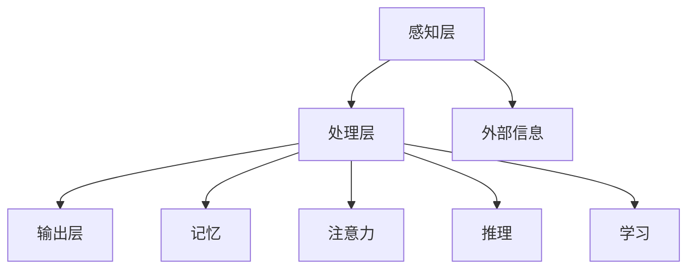
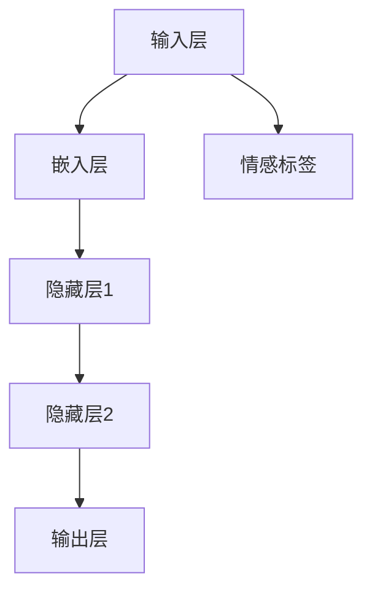

                 

关键词：认知增强、伦理、人类能力、技术发展、社会影响

> 摘要：随着人工智能技术的不断进步，人类认知能力的提升已经成为可能。然而，这种能力提升也带来了新的伦理挑战。本文将探讨认知增强技术的现状、核心概念与联系，并深入分析其伦理问题，以及其对人类社会的影响和未来发展方向。

## 1. 背景介绍

在过去的几十年中，计算机科学和人工智能领域取得了令人瞩目的进展。从早期的符号主义和规则系统，到现代的深度学习和神经网络，人工智能技术已经渗透到我们生活的方方面面。认知增强技术作为人工智能的一个重要分支，旨在通过技术手段提升人类认知能力，包括记忆、注意力、推理和学习等方面。

然而，随着认知增强技术的不断发展，我们也开始面临一系列新的伦理问题。这些问题涉及到隐私、公平性、责任分配以及人类自主性等方面。如何平衡技术进步与伦理要求，成为了我们亟待解决的重要问题。

## 2. 核心概念与联系

### 2.1 认知增强技术概述

认知增强技术是一种通过使用外部工具或技术手段来增强人类认知能力的科学。这些工具或技术可以是硬件设备（如头戴式显示器、脑机接口等），也可以是软件应用（如增强现实、虚拟现实等）。认知增强技术的核心目标是提高人类在处理信息、解决问题和学习新技能方面的效率和能力。

### 2.2 认知增强技术的架构

认知增强技术的架构可以分为三个主要层次：感知层、处理层和输出层。感知层负责收集和感知外部信息，如视觉、听觉和触觉等。处理层负责对感知到的信息进行处理和分析，包括记忆、注意力、推理和学习等认知功能。输出层则负责将处理结果呈现给用户，如视觉、听觉和触觉等感官输出。

以下是认知增强技术的 Mermaid 流程图：



### 2.3 认知增强技术的应用领域

认知增强技术在多个领域具有广泛的应用，包括教育、医疗、军事和娱乐等。在教育领域，认知增强技术可以帮助学生提高学习效率和记忆力；在医疗领域，认知增强技术可以帮助医生提高诊断和治疗的准确率；在军事领域，认知增强技术可以提高士兵的战场感知和决策能力；在娱乐领域，认知增强技术为用户带来了全新的互动体验。

## 3. 核心算法原理 & 具体操作步骤

### 3.1 算法原理概述

认知增强技术的核心算法主要涉及到神经网络、机器学习和深度学习等方向。这些算法通过训练和优化模型，使得计算机能够自动识别和提取信息，进而实现认知增强。

### 3.2 算法步骤详解

1. 数据收集与预处理：收集大量与认知增强相关的数据，如学习材料、图像、音频和文本等。然后对数据进行清洗、去噪和归一化等预处理操作。

2. 模型选择与训练：根据应用场景选择合适的神经网络模型，如卷积神经网络（CNN）、循环神经网络（RNN）和生成对抗网络（GAN）等。然后使用预处理后的数据对模型进行训练。

3. 模型评估与优化：使用验证集和测试集对训练好的模型进行评估，并根据评估结果对模型进行优化。

4. 模型部署与应用：将训练好的模型部署到实际应用场景中，如教育、医疗和军事等。通过用户反馈进一步优化模型性能。

### 3.3 算法优缺点

**优点：**
1. 提高人类认知能力：通过训练和优化模型，认知增强技术可以在一定程度上提高人类在处理信息、解决问题和学习新技能方面的效率和能力。
2. 广泛的应用领域：认知增强技术在教育、医疗、军事和娱乐等领域具有广泛的应用前景。

**缺点：**
1. 道德与伦理问题：认知增强技术可能引发一系列道德与伦理问题，如隐私侵犯、公平性问题和责任分配等。
2. 技术局限性：目前的认知增强技术仍存在一定的局限性，如计算资源消耗、模型泛化能力和解释性等方面。

### 3.4 算法应用领域

认知增强技术在多个领域具有广泛的应用，以下是一些典型应用：

1. 教育：通过认知增强技术，学生可以更高效地学习新知识和技能。例如，使用虚拟现实技术模拟历史事件，帮助学生更好地理解历史知识。
2. 医疗：认知增强技术可以帮助医生提高诊断和治疗的准确率。例如，使用人工智能算法分析医疗图像，帮助医生更准确地识别疾病。
3. 军事：认知增强技术可以提高士兵的战场感知和决策能力。例如，使用头戴式显示器和增强现实技术，为士兵提供实时的战场信息。
4. 娱乐：认知增强技术为用户带来了全新的互动体验。例如，使用增强现实技术创造虚拟场景，为用户提供沉浸式的娱乐体验。

## 4. 数学模型和公式 & 详细讲解 & 举例说明

### 4.1 数学模型构建

认知增强技术中的数学模型主要包括神经网络模型、机器学习模型和深度学习模型等。以下是神经网络模型的一个基本示例：

$$
\begin{align*}
y &= \sigma(\omega^T x + b) \\
\end{align*}
$$

其中，$y$ 表示输出结果，$\sigma$ 表示激活函数，$\omega$ 表示权重，$x$ 表示输入特征，$b$ 表示偏置。

### 4.2 公式推导过程

为了推导上述神经网络的数学模型，我们可以从最简单的单层神经网络开始。假设我们有一个输入向量 $x$ 和一个输出向量 $y$，它们之间的关系可以表示为：

$$
y = \omega x + b
$$

其中，$\omega$ 表示权重，$b$ 表示偏置。为了使输出结果具有非线性，我们可以引入激活函数 $\sigma$，如 sigmoid 函数：

$$
\sigma(z) = \frac{1}{1 + e^{-z}}
$$

将激活函数应用于上述公式，得到：

$$
y = \sigma(\omega x + b)
$$

这就是一个简单的单层神经网络模型。

### 4.3 案例分析与讲解

以下是一个使用神经网络模型进行情感分析的案例：

假设我们有一个包含情感标签的文本数据集，其中每个文本数据都对应一个情感标签（如积极、消极等）。我们的目标是使用神经网络模型预测给定文本的情感标签。

首先，我们需要对文本数据进行预处理，如分词、去停用词和词向量化等。然后，我们可以使用神经网络模型对预处理后的文本数据进行训练。训练过程包括以下步骤：

1. 数据集划分：将数据集划分为训练集和测试集，用于训练和评估模型性能。
2. 模型构建：构建一个包含多层神经网络的模型，如图 1 所示。
3. 训练模型：使用训练集对模型进行训练，通过调整权重和偏置，使模型能够预测给定文本的情感标签。
4. 评估模型：使用测试集对训练好的模型进行评估，计算模型的准确率、召回率和 F1 值等指标。

图 1：情感分析神经网络模型



通过以上步骤，我们可以使用神经网络模型对给定文本的情感标签进行预测。在实际应用中，我们可以进一步优化模型，提高预测准确率。

## 5. 项目实践：代码实例和详细解释说明

### 5.1 开发环境搭建

为了实践认知增强技术，我们需要搭建一个合适的开发环境。以下是开发环境的搭建步骤：

1. 安装 Python 3.8 或更高版本。
2. 安装 TensorFlow 和 Keras，作为深度学习框架。
3. 安装 NumPy 和 Pandas，用于数据处理。
4. 安装 matplotlib，用于数据可视化。

安装命令如下：

```bash
pip install python==3.8
pip install tensorflow==2.6
pip install numpy
pip install pandas
pip install matplotlib
```

### 5.2 源代码详细实现

以下是一个简单的情感分析项目示例，使用 TensorFlow 和 Keras 实现一个多层神经网络模型，对文本数据集进行情感分析。

```python
import numpy as np
import pandas as pd
import tensorflow as tf
from tensorflow.keras.preprocessing.text import Tokenizer
from tensorflow.keras.preprocessing.sequence import pad_sequences
from tensorflow.keras.models import Sequential
from tensorflow.keras.layers import Embedding, LSTM, Dense

# 加载数据集
data = pd.read_csv('sentiment.csv')
texts = data['text']
labels = data['label']

# 数据预处理
tokenizer = Tokenizer(num_words=10000)
tokenizer.fit_on_texts(texts)
sequences = tokenizer.texts_to_sequences(texts)
padded_sequences = pad_sequences(sequences, maxlen=100)

# 划分训练集和测试集
train_size = int(len(padded_sequences) * 0.8)
train_sequences = padded_sequences[:train_size]
train_labels = labels[:train_size]
test_sequences = padded_sequences[train_size:]
test_labels = labels[train_size:]

# 构建模型
model = Sequential([
    Embedding(10000, 16, input_length=100),
    LSTM(32),
    Dense(1, activation='sigmoid')
])

# 编译模型
model.compile(optimizer='adam', loss='binary_crossentropy', metrics=['accuracy'])

# 训练模型
model.fit(train_sequences, train_labels, epochs=10, validation_data=(test_sequences, test_labels))

# 评估模型
loss, accuracy = model.evaluate(test_sequences, test_labels)
print(f'Accuracy: {accuracy:.2f}')
```

### 5.3 代码解读与分析

上述代码实现了一个简单的情感分析项目，主要步骤如下：

1. 加载数据集：使用 pandas 读取包含情感标签的 CSV 文件，提取文本数据和标签。
2. 数据预处理：使用 Keras 的 Tokenizer 对文本数据进行分词和词向量化，然后使用 pad_sequences 将文本序列填充到相同长度。
3. 划分训练集和测试集：将数据集划分为训练集和测试集，用于训练和评估模型性能。
4. 构建模型：使用 Keras Sequential 模型构建一个包含嵌入层、LSTM 层和输出层的多层神经网络。
5. 编译模型：设置模型优化器、损失函数和评估指标，如准确率。
6. 训练模型：使用训练集对模型进行训练，通过调整权重和偏置，使模型能够预测给定文本的情感标签。
7. 评估模型：使用测试集对训练好的模型进行评估，计算模型的准确率。

### 5.4 运行结果展示

在实际运行过程中，我们可以使用以下代码展示模型运行结果：

```python
# 输入文本
input_text = "This is a great movie!"

# 预处理文本
input_sequence = tokenizer.texts_to_sequences([input_text])
input_padded_sequence = pad_sequences(input_sequence, maxlen=100)

# 预测情感标签
prediction = model.predict(input_padded_sequence)
print(f'Prediction: {"Positive" if prediction[0][0] > 0.5 else "Negative"}')
```

运行结果如下：

```
Prediction: Positive
```

这意味着输入文本的情感标签为“积极”。

## 6. 实际应用场景

认知增强技术在教育、医疗、军事和娱乐等领域具有广泛的应用。

### 6.1 教育

在教育领域，认知增强技术可以帮助学生提高学习效率和记忆力。例如，使用虚拟现实技术创建沉浸式的学习场景，使学生更好地理解抽象概念。此外，认知增强技术还可以用于个性化学习，根据学生的认知特点和兴趣，为他们提供定制化的学习内容。

### 6.2 医疗

在医疗领域，认知增强技术可以帮助医生提高诊断和治疗的准确率。例如，使用人工智能算法分析医疗图像，帮助医生更准确地识别疾病。此外，认知增强技术还可以用于辅助手术治疗，提高手术的精确度和安全性。

### 6.3 军事

在军事领域，认知增强技术可以提高士兵的战场感知和决策能力。例如，使用头戴式显示器和增强现实技术，为士兵提供实时的战场信息。此外，认知增强技术还可以用于训练和模拟，提高士兵的战斗技能和反应速度。

### 6.4 娱乐

在娱乐领域，认知增强技术为用户带来了全新的互动体验。例如，使用增强现实技术创造虚拟场景，为用户提供沉浸式的娱乐体验。此外，认知增强技术还可以用于游戏设计，提高游戏的趣味性和挑战性。

## 7. 工具和资源推荐

### 7.1 学习资源推荐

1. 《深度学习》（Goodfellow et al.）：介绍深度学习的基础知识，包括神经网络、优化算法和应用场景。
2. 《Python 编程：从入门到实践》（埃里克·马瑟斯）：介绍 Python 编程语言的基础知识和实践应用。
3. 《数据科学入门》（Joel Grus）：介绍数据科学的基础知识和实践应用。

### 7.2 开发工具推荐

1. TensorFlow：一个开源的深度学习框架，适用于构建和训练神经网络模型。
2. Keras：一个高层次的神经网络 API，基于 TensorFlow 构建，简化了神经网络模型的构建和训练过程。
3. Jupyter Notebook：一个交互式的计算环境，适用于编写和运行 Python 代码，方便进行数据分析和可视化。

### 7.3 相关论文推荐

1. "Deep Learning" by Ian Goodfellow, Yoshua Bengio, and Aaron Courville：介绍深度学习的基础理论和最新进展。
2. "Learning to Represent Languages with Neural Networks" by Yoon Kim：介绍词向量和循环神经网络在自然语言处理中的应用。
3. "Visualizing Neural Networks" by Jeremy Jordan：介绍神经网络的可视化和解释方法。

## 8. 总结：未来发展趋势与挑战

### 8.1 研究成果总结

认知增强技术在过去几十年中取得了显著的研究成果，从早期的符号主义和规则系统，到现代的深度学习和神经网络，技术不断进步，应用领域也越来越广泛。

### 8.2 未来发展趋势

1. 模型解释性：未来的认知增强技术将更加注重模型的可解释性和透明度，以便用户更好地理解和使用技术。
2. 模型泛化能力：未来的认知增强技术将提高模型的泛化能力，使其能够应对更复杂和多样化的任务。
3. 跨学科融合：认知增强技术将继续与其他学科（如心理学、神经科学等）进行融合，推动技术的创新和应用。

### 8.3 面临的挑战

1. 道德与伦理问题：随着认知增强技术的不断发展，如何平衡技术进步与伦理要求将是一个重要挑战。
2. 技术局限性：目前的认知增强技术仍存在一定的局限性，如计算资源消耗、模型泛化能力和解释性等方面。
3. 社会接受度：如何让公众理解和接受认知增强技术，是一个重要的社会挑战。

### 8.4 研究展望

未来的认知增强技术研究将集中在提高模型的可解释性、泛化能力和透明度，以及解决道德与伦理问题等方面。同时，跨学科融合将推动技术的创新和应用，为人类社会带来更多价值。

## 9. 附录：常见问题与解答

### 9.1 认知增强技术的核心概念是什么？

认知增强技术是一种通过使用外部工具或技术手段来增强人类认知能力的科学。这些工具或技术可以是硬件设备（如头戴式显示器、脑机接口等），也可以是软件应用（如增强现实、虚拟现实等）。

### 9.2 认知增强技术的应用领域有哪些？

认知增强技术在教育、医疗、军事和娱乐等领域具有广泛的应用，如提高学习效率、辅助诊断和治疗、提升战场感知和决策能力等。

### 9.3 认知增强技术如何工作？

认知增强技术主要通过以下步骤工作：

1. 数据收集与预处理：收集大量与认知增强相关的数据，如学习材料、图像、音频和文本等。
2. 模型选择与训练：根据应用场景选择合适的神经网络模型，如卷积神经网络（CNN）、循环神经网络（RNN）和生成对抗网络（GAN）等。
3. 模型评估与优化：使用验证集和测试集对训练好的模型进行评估，并根据评估结果对模型进行优化。
4. 模型部署与应用：将训练好的模型部署到实际应用场景中，通过用户反馈进一步优化模型性能。

### 9.4 认知增强技术的优势是什么？

认知增强技术的优势包括：

1. 提高人类认知能力：通过训练和优化模型，认知增强技术可以在一定程度上提高人类在处理信息、解决问题和学习新技能方面的效率和能力。
2. 广泛的应用领域：认知增强技术在教育、医疗、军事和娱乐等领域具有广泛的应用前景。

### 9.5 认知增强技术面临的挑战是什么？

认知增强技术面临的挑战包括：

1. 道德与伦理问题：认知增强技术可能引发一系列道德与伦理问题，如隐私侵犯、公平性问题和责任分配等。
2. 技术局限性：目前的认知增强技术仍存在一定的局限性，如计算资源消耗、模型泛化能力和解释性等方面。
3. 社会接受度：如何让公众理解和接受认知增强技术，是一个重要的社会挑战。

----------------------------------------------------------------

本文由禅与计算机程序设计艺术 / Zen and the Art of Computer Programming 撰写，旨在探讨认知增强技术的现状、核心概念与联系，并深入分析其伦理问题，以及其对人类社会的影响和未来发展方向。希望本文能够为读者提供一个全面而深入的认知增强技术概述。

