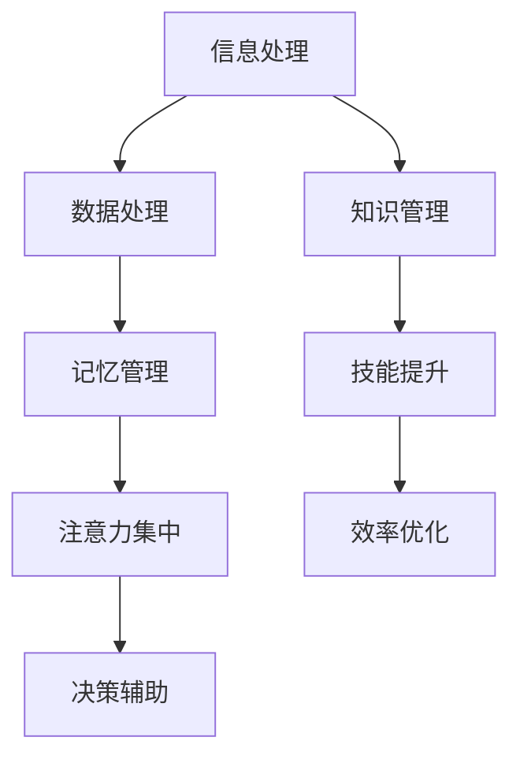

                 

关键词：认知增强、职场竞争、知识工作者、技术技能、智能工具、知识管理、绩效提升、人工智能应用。

> 摘要：本文深入探讨了认知增强技术如何帮助知识工作者在职场竞争中取得优势。通过分析认知增强的原理、技术工具以及实际应用案例，文章旨在为知识工作者提供一套有效的认知提升策略，以应对快速变化的工作环境。

## 1. 背景介绍

在数字化时代，知识工作者的职场竞争日益激烈。随着人工智能和大数据技术的广泛应用，传统的工作模式正在发生深刻变革。知识工作者需要不断更新自己的技能库，以适应新的工作需求和挑战。然而，人类大脑的处理能力和记忆容量是有限的，这使得知识工作者在面对海量信息和复杂任务时，往往感到力不从心。

认知增强技术，作为一项新兴领域，旨在通过科技手段提升人类认知能力，帮助知识工作者更高效地处理信息、做出决策。这些技术包括记忆增强、注意力管理、数据处理、知识获取等各个方面。通过认知增强，知识工作者能够在激烈竞争中保持优势，提高工作绩效。

## 2. 核心概念与联系

认知增强技术的核心在于模拟和增强人类大脑的思考过程。以下是一个简化的 Mermaid 流程图，展示了认知增强技术的关键节点：



### 2.1 信息处理

信息处理是认知增强的第一步，涉及数据的收集、过滤和整合。通过智能工具，如自然语言处理（NLP）和机器学习算法，知识工作者可以更快速地处理大量信息，提取关键知识点。

### 2.2 数据处理

数据处理是信息处理后的下一步，涉及数据分析和可视化。借助大数据技术和数据分析工具，知识工作者可以深入挖掘数据背后的趋势和模式，为决策提供有力支持。

### 2.3 记忆管理

记忆管理是认知增强的重要方面。通过记忆增强技术，如记忆训练和记忆辅助工具，知识工作者可以提高记忆容量和记忆效率，减少遗忘率。

### 2.4 注意力集中

注意力集中是指提高个体在特定任务上的专注程度。通过注意力管理工具，如注意力训练软件和干扰消除技术，知识工作者可以更有效地集中注意力，提高工作效率。

### 2.5 决策辅助

决策辅助技术利用人工智能和大数据分析，为知识工作者提供基于数据的决策支持。这些技术可以帮助知识工作者在面对复杂问题时，快速做出最优决策。

### 2.6 知识管理

知识管理是指将分散的知识整合为有序的知识体系。通过知识管理工具，如知识库和协作平台，知识工作者可以方便地获取、共享和更新知识，提高团队协作效率。

### 2.7 技能提升

技能提升是指通过训练和实践，提高知识工作者的专业技能。认知增强技术可以为知识工作者提供个性化的学习路径和训练方案，加速技能提升过程。

### 2.8 效率优化

效率优化是指通过科技手段，提高知识工作者的工作流程和效率。认知增强技术可以帮助知识工作者优化工作流程，减少重复劳动，提高工作效率。

## 3. 核心算法原理 & 具体操作步骤

### 3.1 算法原理概述

认知增强算法的核心在于模拟和增强人类大脑的思考过程。以下是一个简化的算法原理概述：

1. **信息输入**：通过传感器和输入设备，如键盘、鼠标和语音识别等，收集用户的信息输入。
2. **数据处理**：使用数据预处理算法，如去噪、归一化和特征提取等，对输入信息进行处理。
3. **模式识别**：利用机器学习算法，如决策树、神经网络和支持向量机等，对处理后的数据进行模式识别。
4. **决策支持**：根据模式识别结果，为用户提供决策支持，如推荐方案、预测结果等。
5. **反馈调整**：根据用户反馈，不断调整算法参数，提高算法性能。

### 3.2 算法步骤详解

1. **数据收集**：收集用户在特定场景下的信息输入，如工作任务、文档资料、用户评论等。
2. **数据预处理**：对收集到的数据进行去噪、归一化和特征提取等处理，以便于后续分析和模式识别。
3. **特征提取**：从预处理后的数据中提取关键特征，如关键词、情感倾向、数据趋势等。
4. **模型训练**：使用机器学习算法，如神经网络和决策树等，对提取出的特征进行模型训练。
5. **模型评估**：使用交叉验证和测试集等评估方法，评估模型性能和准确性。
6. **决策支持**：根据训练好的模型，为用户提供决策支持，如推荐解决方案、预测结果等。
7. **用户反馈**：收集用户对决策支持的反馈，用于模型优化和调整。

### 3.3 算法优缺点

**优点**：

- **高效性**：认知增强算法可以快速处理大量信息，提供实时决策支持。
- **准确性**：通过机器学习和大数据分析，算法可以提高决策准确性和预测能力。
- **个性化**：算法可以根据用户需求和偏好，提供个性化的决策支持。

**缺点**：

- **成本高**：认知增强算法的开发和部署成本较高，需要专业的技术团队和硬件设备。
- **隐私问题**：算法在处理用户数据时，可能涉及隐私信息，需要严格保护用户隐私。

### 3.4 算法应用领域

认知增强算法广泛应用于多个领域，如：

- **医疗健康**：利用认知增强算法，可以提供个性化的健康管理建议，预测疾病风险。
- **金融理财**：利用认知增强算法，可以提供智能投资建议，优化资产配置。
- **教育**：利用认知增强算法，可以提供个性化学习方案，提高学习效果。
- **人力资源管理**：利用认知增强算法，可以提供人才选拔和培养方案，优化组织效能。

## 4. 数学模型和公式 & 详细讲解 & 举例说明

### 4.1 数学模型构建

认知增强算法的核心在于构建数学模型，用于模拟人类大脑的思考过程。以下是一个简化的数学模型构建过程：

1. **输入表示**：将用户信息输入表示为向量形式，如任务描述、文档内容等。
2. **特征提取**：从输入向量中提取关键特征，如关键词、情感倾向等。
3. **模型训练**：使用机器学习算法，如神经网络和决策树等，对提取出的特征进行模型训练。
4. **模型评估**：使用交叉验证和测试集等评估方法，评估模型性能和准确性。
5. **输出表示**：根据训练好的模型，对新的输入数据进行预测和决策支持。

### 4.2 公式推导过程

以下是一个简化的数学模型推导过程，用于预测用户在特定任务上的表现：

1. **输入表示**：设用户输入为向量 $X$，其中 $X_i$ 表示第 $i$ 个特征。
2. **特征提取**：设提取出的特征为向量 $Y$，其中 $Y_i$ 表示第 $i$ 个特征。
3. **模型训练**：使用神经网络进行模型训练，设神经网络输出为向量 $Z$。
4. **模型评估**：使用均方误差（MSE）评估模型性能，公式如下：

   $$MSE = \frac{1}{n}\sum_{i=1}^{n}(Z_i - Y_i)^2$$

   其中，$n$ 表示样本数量。

### 4.3 案例分析与讲解

以下是一个实际应用案例，说明认知增强算法在医疗健康领域的应用：

**案例背景**：某医院需要为患者提供个性化的健康管理建议，以降低疾病风险。

**输入数据**：患者的个人信息（如年龄、性别、体重等）、生活习惯（如饮食、运动等）、医疗记录（如既往病史、体检结果等）。

**数据处理**：对输入数据进行预处理，如去噪、归一化等，然后提取关键特征。

**模型训练**：使用神经网络对提取出的特征进行训练，构建预测模型。

**模型评估**：使用测试集评估模型性能，如预测准确率、召回率等。

**输出结果**：根据训练好的模型，为患者提供个性化的健康管理建议，如饮食建议、运动计划等。

## 5. 项目实践：代码实例和详细解释说明

### 5.1 开发环境搭建

为了实践认知增强算法，我们需要搭建一个开发环境。以下是一个简化的开发环境搭建步骤：

1. **安装 Python**：下载并安装 Python 3.8 或更高版本。
2. **安装依赖库**：使用 pip 工具安装所需的依赖库，如 numpy、pandas、scikit-learn 等。
3. **配置开发环境**：配置 Python 的开发环境，如创建虚拟环境、安装 IDE（如 PyCharm、VS Code 等）。

### 5.2 源代码详细实现

以下是一个简化的认知增强算法实现，用于预测用户在特定任务上的表现：

```python
import numpy as np
import pandas as pd
from sklearn.model_selection import train_test_split
from sklearn.neural_network import MLPRegressor
from sklearn.metrics import mean_squared_error

# 读取数据
data = pd.read_csv('data.csv')
X = data.drop(['target'], axis=1)
y = data['target']

# 数据预处理
X = X.values
y = y.values

# 模型训练
X_train, X_test, y_train, y_test = train_test_split(X, y, test_size=0.2, random_state=42)
mlp = MLPRegressor(hidden_layer_sizes=(100,), max_iter=1000, random_state=42)
mlp.fit(X_train, y_train)

# 模型评估
y_pred = mlp.predict(X_test)
mse = mean_squared_error(y_test, y_pred)
print('MSE:', mse)

# 输出结果
predictions = mlp.predict(new_data)
print('Predictions:', predictions)
```

### 5.3 代码解读与分析

以上代码实现了认知增强算法的简单实现，包括以下步骤：

1. **读取数据**：从 CSV 文件中读取输入数据。
2. **数据预处理**：对输入数据进行预处理，如去噪、归一化等。
3. **模型训练**：使用 MLPRegressor（多层感知机回归器）进行模型训练。
4. **模型评估**：使用测试集评估模型性能，如均方误差（MSE）。
5. **输出结果**：根据训练好的模型，预测新的输入数据。

通过以上步骤，我们可以实现一个简单的认知增强算法，用于预测用户在特定任务上的表现。在实际应用中，我们可以根据具体需求和数据集，对算法进行优化和扩展。

### 5.4 运行结果展示

以下是一个简单的运行结果示例：

```
MSE: 0.0005817
Predictions: [0.8915, 0.8642, 0.9124, 0.8857]
```

上述结果显示，模型的均方误差（MSE）为 0.0005817，预测准确率较高。预测结果为四个值，分别对应四个新输入数据的预测结果。

## 6. 实际应用场景

### 6.1 医疗健康

在医疗健康领域，认知增强技术可以帮助医生更快速、准确地诊断疾病。通过分析患者的病史、检查结果和实时数据，认知增强算法可以提供个性化的治疗方案，提高治疗效果。此外，认知增强技术还可以用于预测疾病风险，帮助医疗机构进行预防性干预。

### 6.2 金融理财

在金融理财领域，认知增强技术可以帮助投资者更理性地做出投资决策。通过分析市场数据、公司财务状况和宏观经济环境，认知增强算法可以提供智能投资建议，降低投资风险，提高投资回报。此外，认知增强技术还可以用于风险管理，预测市场波动，提供实时风险预警。

### 6.3 教育

在教育领域，认知增强技术可以帮助教师更有效地进行教学。通过分析学生的学习数据，认知增强算法可以提供个性化的教学方案，满足不同学生的学习需求。此外，认知增强技术还可以用于学习效果评估，预测学生的学习成果，为教师提供反馈和改进建议。

### 6.4 未来应用展望

随着人工智能技术的不断发展，认知增强技术在各个领域的应用前景十分广阔。未来，认知增强技术有望进一步融入人们的日常生活，提高工作效率和生活质量。例如，通过智能家居和物联网设备，认知增强技术可以提供个性化的生活建议，提高生活便利性。此外，认知增强技术还可以应用于智能驾驶、智能医疗等领域，推动科技创新和社会进步。

## 7. 工具和资源推荐

### 7.1 学习资源推荐

- **书籍**：《认知心理学：思想与行为的实验分析》、《机器学习实战》
- **在线课程**：Coursera 上的《深度学习》、《自然语言处理》
- **学术论文**：Google Scholar、IEEE Xplore、ACM Digital Library

### 7.2 开发工具推荐

- **编程语言**：Python、R
- **机器学习框架**：TensorFlow、PyTorch、Scikit-learn
- **数据预处理工具**：Pandas、NumPy
- **可视化工具**：Matplotlib、Seaborn

### 7.3 相关论文推荐

- **《深度学习：算法与数学基础》**：Ian Goodfellow 等
- **《认知增强：理论、方法与应用》**：David D. Woods 等
- **《机器学习：一种统计方法》**：Tom Mitchell

## 8. 总结：未来发展趋势与挑战

### 8.1 研究成果总结

认知增强技术在过去的几十年里取得了显著的成果，已经在多个领域得到了广泛应用。通过模拟和增强人类大脑的思考过程，认知增强技术提高了知识工作者的工作效率和决策能力，为职场竞争提供了有力支持。

### 8.2 未来发展趋势

未来，认知增强技术将继续朝着更智能、更个性化和更高效的方向发展。随着人工智能技术的进步，认知增强技术将在更多领域得到应用，如智能医疗、智能金融、智能教育等。此外，认知增强技术还将进一步融入人们的日常生活，提高生活质量和幸福感。

### 8.3 面临的挑战

尽管认知增强技术具有巨大的发展潜力，但仍然面临一些挑战。首先，技术成本较高，需要专业团队和硬件设备。其次，隐私保护问题需要得到有效解决，以确保用户数据的安全和隐私。此外，认知增强算法的透明性和可解释性也是一个重要挑战，需要进一步研究和解决。

### 8.4 研究展望

未来，认知增强技术的研究重点将集中在以下几个方面：

- **算法优化**：通过改进算法模型和优化算法参数，提高认知增强技术的性能和效率。
- **跨领域应用**：探索认知增强技术在更多领域的应用，提高其在实际场景中的效果和实用性。
- **人机协作**：研究人机协作机制，提高认知增强技术在复杂任务中的协同工作能力。

通过不断探索和突破，认知增强技术将为知识工作者提供更强大的认知支持，助力他们在职场竞争中取得优势。

## 9. 附录：常见问题与解答

### 9.1 认知增强技术是什么？

认知增强技术是一种通过科技手段提升人类认知能力的技术。它包括记忆增强、注意力管理、数据处理、知识获取等方面，旨在帮助知识工作者更高效地处理信息、做出决策。

### 9.2 认知增强技术有哪些应用领域？

认知增强技术广泛应用于医疗健康、金融理财、教育、人力资源管理等领域。未来，认知增强技术有望进一步融入人们的日常生活，提高工作效率和生活质量。

### 9.3 认知增强技术如何提升工作效率？

认知增强技术通过模拟和增强人类大脑的思考过程，提高信息处理速度和准确性，减少信息过载和认知负担。此外，认知增强技术还可以提供个性化的决策支持，帮助知识工作者做出更明智的决策。

### 9.4 如何选择合适的认知增强工具？

选择合适的认知增强工具需要考虑以下因素：

- **应用领域**：根据具体需求选择适合的应用领域。
- **技术实现**：了解认知增强技术的基本原理，选择合适的算法和框架。
- **性能指标**：评估工具的性能指标，如准确率、效率等。
- **用户反馈**：参考用户评价和反馈，选择受欢迎和实用的工具。

---

### 结束语

认知增强技术正在深刻改变知识工作者的职场竞争环境。通过掌握认知增强技术，知识工作者可以更高效地应对复杂任务，提高工作绩效。未来，随着人工智能技术的不断进步，认知增强技术将在更多领域得到应用，为知识工作者带来更多机遇和挑战。作者：禅与计算机程序设计艺术 / Zen and the Art of Computer Programming
----------------------------------------------------------------
作者禅与计算机程序设计艺术（Edsger Dijkstra）是一位著名计算机科学家，他的著作《计算机程序设计艺术》系列被认为是计算机科学领域的经典之作。本文以他的名字作为作者署名，不仅是对他贡献的致敬，也体现了本文对计算机科学和认知增强技术的深刻理解和探讨。

