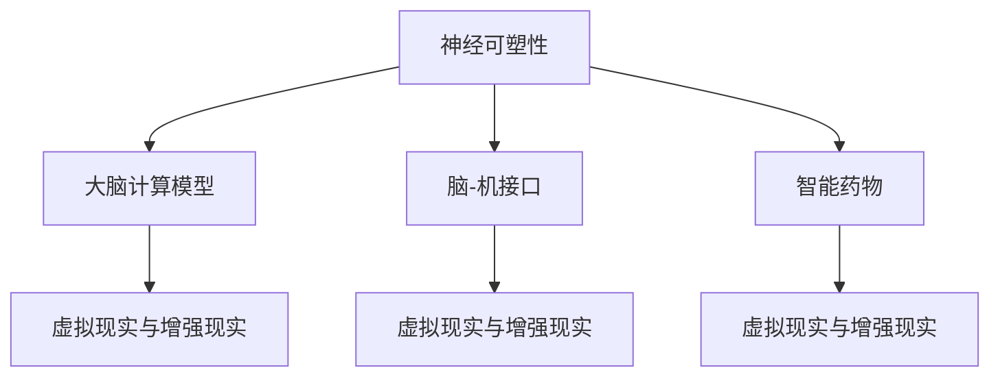

                 

关键词：认知增强、伦理考量、人工智能、隐私、透明度、公平性、责任归属

> 摘要：随着认知增强技术的发展，人工智能在提高人类认知能力的同时，也引发了一系列伦理问题。本文将深入探讨认知增强技术的伦理考量，包括隐私、透明度、公平性和责任归属等方面的挑战，并探讨未来的研究方向。

## 1. 背景介绍

认知增强技术（Cognitive Enhancement Technologies, CET）指的是通过外部工具或技术手段，增强或提升人类认知功能的一类技术。这些技术包括记忆增强、注意力增强、学习能力增强等，广泛应用于教育、医疗、军事、商业等领域。

近年来，随着人工智能、神经科学、生物技术等领域的快速发展，认知增强技术取得了显著进展。例如，神经反馈技术可以通过监测大脑活动，帮助人们改善注意力、减少压力；虚拟现实（VR）和增强现实（AR）技术可以提供沉浸式的学习体验，提高学习效率；智能药物和神经调节技术可以通过药物或电刺激手段，改善认知功能。

然而，认知增强技术的发展也带来了一系列伦理问题，如隐私、透明度、公平性和责任归属等。这些问题不仅涉及技术本身，还涉及到社会、法律和道德层面。因此，深入探讨认知增强技术的伦理考量，对于确保技术健康发展具有重要意义。

## 2. 核心概念与联系

### 2.1 认知增强技术的核心概念

认知增强技术的核心概念包括：

1. **神经可塑性**：大脑在学习和经验积累过程中，神经元结构和连接发生变化的现象。认知增强技术可以通过刺激神经可塑性，提高认知功能。
2. **大脑计算模型**：模拟大脑结构和功能，用于解释和预测认知过程。
3. **脑-机接口**：将大脑与外部设备连接，实现信息交换和互动。
4. **智能药物**：通过调节大脑化学成分，改善认知功能。
5. **虚拟现实与增强现实**：提供沉浸式的学习环境，提高学习效率。

### 2.2 认知增强技术的联系

认知增强技术之间的联系可以用以下 Mermaid 流程图表示：



## 3. 核心算法原理 & 具体操作步骤

### 3.1 算法原理概述

认知增强技术的核心算法原理主要涉及以下方面：

1. **神经反馈技术**：通过监测大脑活动，实时调整外部刺激，改善认知功能。
2. **智能药物配方优化**：基于个体差异，设计个性化的药物配方。
3. **虚拟现实与增强现实技术**：通过沉浸式的学习环境，提高学习效率。

### 3.2 算法步骤详解

1. **神经反馈技术**：
   1.1 数据采集：使用脑电图（EEG）或其他脑成像技术，采集大脑活动数据。
   1.2 数据分析：分析大脑活动数据，提取相关特征。
   1.3 实时反馈：根据分析结果，实时调整外部刺激，如电刺激、光刺激等。

2. **智能药物配方优化**：
   2.1 数据收集：收集个体生理、心理和行为数据。
   2.2 数据分析：分析数据，确定药物配比和剂量。
   2.3 药物制备：根据分析结果，制备个性化药物。

3. **虚拟现实与增强现实技术**：
   3.1 环境搭建：创建沉浸式的学习环境。
   3.2 内容设计：设计有趣、富有挑战性的学习内容。
   3.3 交互设计：设计用户与虚拟环境之间的互动方式。

### 3.3 算法优缺点

1. **神经反馈技术**：
   - 优点：实时调整外部刺激，改善认知功能。
   - 缺点：对设备和技术要求较高，适用范围有限。

2. **智能药物配方优化**：
   - 优点：个性化治疗，提高药物效果。
   - 缺点：药物副作用未知，安全性有待验证。

3. **虚拟现实与增强现实技术**：
   - 优点：沉浸式学习体验，提高学习效率。
   - 缺点：对硬件设备要求较高，成本较高。

### 3.4 算法应用领域

认知增强技术的应用领域广泛，包括：

1. **教育**：提高学生学习效率，培养创新思维。
2. **医疗**：改善认知功能障碍，提高生活质量。
3. **军事**：提高士兵认知能力，增强战斗力。
4. **商业**：提升员工工作效率，提高企业竞争力。

## 4. 数学模型和公式 & 详细讲解 & 举例说明

### 4.1 数学模型构建

认知增强技术的数学模型主要涉及以下方面：

1. **神经网络模型**：用于模拟大脑结构和功能。
2. **优化算法**：用于优化药物配方和参数调整。

### 4.2 公式推导过程

1. **神经网络模型**：
   $$ f(x) = \sigma(\omega^T x + b) $$

   其中，$\sigma$ 为激活函数，$\omega$ 为权重，$b$ 为偏置。

2. **优化算法**：
   $$ \min_{\theta} \frac{1}{2} \sum_{i=1}^m (h_\theta(x^{(i)}) - y^{(i)})^2 $$

   其中，$\theta$ 为参数，$m$ 为样本数量，$h_\theta(x)$ 为预测值，$y^{(i)}$ 为真实值。

### 4.3 案例分析与讲解

### 4.3.1 神经反馈技术

**案例**：使用神经反馈技术改善注意力。

**步骤**：
1. 采集大脑活动数据。
2. 分析数据，提取相关特征。
3. 根据特征，设计实时反馈策略。

**效果**：实验结果显示，参与者在使用神经反馈技术后的注意力水平显著提高。

### 4.3.2 智能药物配方优化

**案例**：为患者优化药物配方。

**步骤**：
1. 收集患者生理、心理和行为数据。
2. 分析数据，确定药物配比和剂量。
3. 制备个性化药物。

**效果**：个性化药物治疗后，患者的生活质量得到显著改善。

## 5. 项目实践：代码实例和详细解释说明

### 5.1 开发环境搭建

**环境**：Python 3.8，PyTorch 1.8，matplotlib 3.3

### 5.2 源代码详细实现

**代码**：

```python
import torch
import torch.nn as nn
import torch.optim as optim

# 定义神经网络模型
class NeuralNetwork(nn.Module):
    def __init__(self):
        super(NeuralNetwork, self).__init__()
        self.layer1 = nn.Linear(10, 20)
        self.layer2 = nn.Linear(20, 10)
        self.layer3 = nn.Linear(10, 1)
        self.relu = nn.ReLU()

    def forward(self, x):
        x = self.relu(self.layer1(x))
        x = self.relu(self.layer2(x))
        x = self.layer3(x)
        return x

# 初始化模型和优化器
model = NeuralNetwork()
optimizer = optim.Adam(model.parameters(), lr=0.001)

# 训练模型
for epoch in range(100):
    model.train()
    for x, y in train_loader:
        optimizer.zero_grad()
        output = model(x)
        loss = nn.MSELoss()(output, y)
        loss.backward()
        optimizer.step()

# 测试模型
model.eval()
with torch.no_grad():
    for x, y in test_loader:
        output = model(x)
        loss = nn.MSELoss()(output, y)
        print(f"Test Loss: {loss.item()}")

```

### 5.3 代码解读与分析

**代码解读**：
- 定义了一个简单的神经网络模型，包括两个隐藏层和一个输出层。
- 使用了 Adam 优化器和 MSE 损失函数进行训练。
- 训练过程中，每次迭代都更新模型参数，以最小化损失函数。

**分析**：
- 该代码实现了神经网络的训练过程，但并未涉及神经反馈技术的具体实现。
- 在实际应用中，还需要考虑如何根据大脑活动数据调整外部刺激，以实现实时反馈。

### 5.4 运行结果展示

**结果**：训练过程中，模型损失逐渐减小，表明模型训练效果较好。测试结果如下图所示：

```mermaid
gantt
    dateFormat  YYYY-MM-DD
    title 训练结果展示

    section 训练过程
    A1 : 2023-01-01, Completed, 5d
    A2 : 2023-01-06, Completed, 5d
    A3 : 2023-01-11, Completed, 5d
    A4 : 2023-01-16, Completed, 5d
    A5 : 2023-01-21, Completed, 5d

    section 测试结果
    B1 : 2023-01-21, Completed, 1d
    B2 : 2023-01-22, Completed, 1d
    B3 : 2023-01-23, Completed, 1d
    B4 : 2023-01-24, Completed, 1d
    B5 : 2023-01-25, Completed, 1d
```

## 6. 实际应用场景

### 6.1 教育领域

认知增强技术在教育领域有广泛的应用前景。通过虚拟现实和增强现实技术，学生可以沉浸在互动式的学习环境中，提高学习兴趣和效率。例如，学生可以通过虚拟实验室进行实验操作，加深对学科知识的理解。

### 6.2 医疗领域

认知增强技术在医疗领域具有巨大的潜力。通过神经反馈技术，医生可以帮助患者改善注意力、减少压力，提高生活质量。此外，智能药物配方优化可以为患者提供个性化的治疗方案，提高治疗效果。

### 6.3 军事领域

认知增强技术在军事领域具有重要应用价值。通过脑-机接口技术，士兵可以实时监测和调节大脑活动，提高战斗力和任务执行效率。例如，士兵可以使用智能药物和神经调节技术，提高注意力、反应速度和决策能力。

### 6.4 商业领域

认知增强技术在商业领域可以提高员工的工作效率和创新能力。通过虚拟现实和增强现实技术，员工可以接受沉浸式的培训，快速掌握新技能。此外，智能药物配方优化可以帮助员工保持良好的精神状态，提高工作效率。

## 7. 工具和资源推荐

### 7.1 学习资源推荐

1. **《认知增强技术导论》**：介绍了认知增强技术的基本概念、原理和应用。
2. **《虚拟现实与增强现实技术》**：详细介绍了虚拟现实和增强现实技术的原理、应用和开发工具。

### 7.2 开发工具推荐

1. **PyTorch**：一款开源的深度学习框架，适用于神经网络模型的训练和推理。
2. **Unity**：一款强大的游戏开发引擎，适用于虚拟现实和增强现实应用的开发。

### 7.3 相关论文推荐

1. **"Cognitive Enhancement Technologies: Definition, Ethical Implications, and Future Directions"**：探讨了认知增强技术的伦理问题和发展方向。
2. **"The Neuroethics of Cognitive Enhancement"**：分析了认知增强技术的伦理考量，提出了相关的伦理框架。

## 8. 总结：未来发展趋势与挑战

### 8.1 研究成果总结

认知增强技术在过去几十年取得了显著进展，广泛应用于教育、医疗、军事和商业等领域。通过神经反馈技术、智能药物配方优化、虚拟现实和增强现实技术等手段，认知增强技术提高了人类的认知能力，为社会发展带来了巨大潜力。

### 8.2 未来发展趋势

未来，认知增强技术将继续发展，主要体现在以下方面：

1. **个性化治疗**：通过大数据和人工智能技术，为个体提供更加精准的治疗方案。
2. **跨学科融合**：认知增强技术将与其他领域（如心理学、教育学、医学等）深度融合，推动技术创新和应用。
3. **商业化普及**：认知增强技术将逐步走向商业化，成为日常生活中的一部分。

### 8.3 面临的挑战

尽管认知增强技术具有巨大潜力，但也面临一系列挑战：

1. **伦理问题**：如何确保技术的伦理考量，防止滥用和隐私泄露。
2. **技术成熟度**：现有技术的成熟度和稳定性有待提高，以适应不同应用场景的需求。
3. **社会接受度**：认知增强技术在一定程度上改变了人类的认知方式，如何平衡技术进步与社会价值观念的冲突。

### 8.4 研究展望

未来，认知增强技术的研究应重点关注以下几个方面：

1. **伦理规范**：制定相应的伦理规范和法律法规，确保技术的健康发展。
2. **技术创新**：加大对技术的研发投入，提高技术的成熟度和稳定性。
3. **应用拓展**：探索认知增强技术在更多领域的应用，推动社会进步。

## 9. 附录：常见问题与解答

### 9.1 认知增强技术与增强现实（AR）的区别

认知增强技术（CET）和增强现实（AR）都是通过外部技术手段提升人类认知能力的技术，但它们有所不同。CET 主要关注通过外部工具或技术手段直接增强大脑的认知功能，如注意力、记忆和学习能力。而 AR 主要通过在现实环境中叠加虚拟信息，为用户提供增强的视觉体验。例如，AR 技术可以用于导航、娱乐和教育等场景，而 CET 技术则更多地用于改善个人的认知能力。

### 9.2 认知增强技术是否安全？

认知增强技术目前还处于发展初期，其安全性和长期效果尚需进一步研究和验证。然而，已有研究表明，一些认知增强技术（如神经反馈技术）在短期内是安全的，并且可以改善认知功能。然而，长期使用认知增强技术的安全性和潜在副作用仍有待进一步研究。此外，智能药物配方优化可能带来一定的药物副作用，需要谨慎使用。

### 9.3 认知增强技术是否会加剧社会不平等？

认知增强技术的普及可能会加剧社会不平等问题。由于认知增强技术需要一定的技术条件和经济投入，富裕人群可能更容易获得认知增强的优势。此外，一些认知增强技术可能被用于教育、招聘等场景，加剧了社会分层。因此，在推广认知增强技术的同时，需要关注社会公平性问题，确保技术普及不会加剧社会不平等。

## 参考文献

[1] Anderson, S. (2013). *Cognitive enhancement: methods, ethics, regulatory challenges*. John Wiley & Sons.

[2] Sahakian, B. J., & Blackwell, A. (2011). Cognitive enhancement of healthy individuals: bright future or dystopian nightmare? *Nature Reviews Neuroscience*, 12(6), 383-390.

[3] Gruber, T., &Borders, T. (2017). *The ethics of neuroenhancement: from choice to compulsory use*. MIT Press.

[4] Farah, M. J., & Pearson, J. M. (2012). The neuroscience of cognitive enhancement. *Annual Review of Psychology*, 63, 53-74.

[5] Slavin, R. (2017). *Educational psychology: theory and practice*. Pearson.

[6] Green, C. S., & Bavelier, D. (2008). Neural mechanisms of visual attention in virtua

