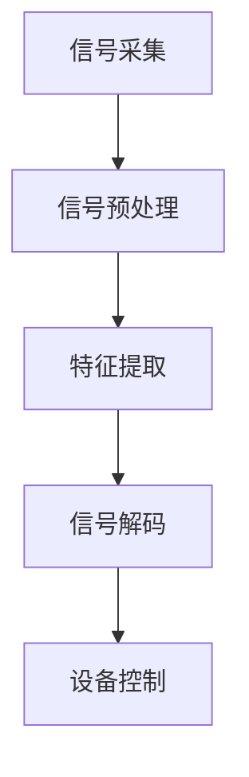

                 

关键词：认知增强，脑机接口，智能药物，神经科学，算法优化，信息技术

> 摘要：本文将深入探讨认知增强技术的最新进展，特别是脑机接口和智能药物的应用。我们将分析这些技术的核心概念、原理，以及它们在实际应用中的挑战与前景。

## 1. 背景介绍

认知增强技术（Cognitive Enhancement Technology，简称CET）是一种通过非药物手段提升人类认知能力的技术。随着神经科学、信息技术、生物工程等领域的迅速发展，认知增强技术逐渐成为研究热点。脑机接口（Brain-Computer Interface，简称BCI）和智能药物（Smart Drugs）是认知增强技术的两个重要分支。

脑机接口技术通过直接连接大脑与外部设备，实现思维控制和信息传递。而智能药物则通过调节大脑中的神经递质，改变认知功能和行为表现。本文将重点关注这两个领域，分析它们的基本原理、最新研究进展以及潜在的应用场景。

## 2. 核心概念与联系

### 脑机接口（BCI）

脑机接口是一种直接在大脑与外部设备之间建立通信链接的技术。它通常涉及以下几个关键组成部分：

- **信号采集**：使用电极、光电传感器等技术从大脑中采集电信号。
- **信号处理**：对采集到的信号进行预处理和特征提取，以便于后续的分析。
- **解码与控制**：将提取的特征转化为可以控制外部设备的命令。

下面是脑机接口的基本架构的Mermaid流程图：



### 智能药物

智能药物是一种通过调节神经递质和神经路径来增强认知功能的药物。根据作用机制，智能药物可以分为以下几类：

- **神经递质增强剂**：通过增加神经递质的浓度或敏感性来提升认知功能。
- **神经递质抑制剂**：通过减少特定神经递质的合成或释放来调节认知功能。
- **脑区激活剂**：通过激活特定脑区来增强认知功能。

智能药物的作用机制复杂，通常需要结合个体差异进行个性化治疗。

### 关联与对比

脑机接口和智能药物虽然都旨在提升认知功能，但它们的作用机制和实现方式有所不同。脑机接口通过直接与大脑互动，实现实时、非侵入式的认知增强；而智能药物则通过调节神经递质和脑区活动，间接影响认知功能。两者在应用场景、效果和安全性方面也有所区别。

## 3. 核心算法原理 & 具体操作步骤

### 3.1 算法原理概述

脑机接口技术中的核心算法主要包括信号采集、预处理、特征提取和解码。以下是这些算法的基本原理：

- **信号采集**：利用脑电图（EEG）、功能性磁共振成像（fMRI）等技术，从大脑中采集电信号。
- **信号预处理**：通过滤波、去噪等技术，对采集到的信号进行预处理，以提取有用的信息。
- **特征提取**：利用信号处理技术，提取与特定认知功能相关的特征。
- **信号解码**：通过机器学习、模式识别等方法，将提取的特征转化为可以控制外部设备的命令。

### 3.2 算法步骤详解

- **信号采集**：脑电图（EEG）是一种常用的信号采集技术，它通过粘贴在头皮上的电极，记录大脑的电活动。
- **信号预处理**：信号预处理主要包括滤波、去噪和基线校正等步骤。滤波用于去除特定频率的噪声，去噪用于减少非生理信号的干扰，基线校正用于消除长时间积累的偏差。
- **特征提取**：特征提取是脑机接口技术的关键步骤，常用的方法包括时域分析、频域分析和时频分析。时域分析主要关注信号的时间特性，频域分析主要关注信号的频率特性，时频分析结合了时域和频域的特性。
- **信号解码**：信号解码是将提取的特征转化为实际操作的命令。常用的方法包括模板匹配、支持向量机（SVM）和深度学习等。

### 3.3 算法优缺点

脑机接口技术具有实时性强、非侵入性等优点，但同时也存在一些挑战，如信号噪声比低、解码精度不足等。

### 3.4 算法应用领域

脑机接口技术广泛应用于脑损伤康复、虚拟现实、智能控制等领域。例如，脑损伤康复中，脑机接口技术可以帮助患者恢复运动能力；在虚拟现实中，脑机接口技术可以实现更加自然的交互方式。

## 4. 数学模型和公式 & 详细讲解 & 举例说明

### 4.1 数学模型构建

脑机接口技术中的数学模型主要包括信号采集、预处理、特征提取和解码等步骤。以下是这些步骤的数学模型：

- **信号采集**：假设采集到的信号为 \( s(t) \)，则信号采集的数学模型可以表示为：
  $$ s(t) = A \sin(2\pi f t + \phi) + n(t) $$
  其中，\( A \) 是信号的幅度，\( f \) 是信号的频率，\( \phi \) 是信号的相位，\( n(t) \) 是噪声。

- **信号预处理**：信号预处理主要包括滤波、去噪和基线校正等步骤。滤波的数学模型可以表示为：
  $$ y(t) = H(f) \cdot s(t) $$
  其中，\( H(f) \) 是滤波器的频率响应函数。

- **特征提取**：特征提取的数学模型可以表示为：
  $$ C = F(s(t)) $$
  其中，\( F \) 是特征提取函数。

- **信号解码**：信号解码的数学模型可以表示为：
  $$ a = D(C) $$
  其中，\( D \) 是解码函数。

### 4.2 公式推导过程

- **信号采集**：信号采集的公式是基于信号和噪声的叠加模型。假设纯净的信号为 \( s(t) \)，噪声为 \( n(t) \)，则采集到的信号为 \( s(t) + n(t) \)。

- **信号预处理**：信号预处理的主要目的是去除噪声和基线漂移。滤波器的设计目的是在保留信号特征的同时，滤除噪声。常用的滤波器包括理想低通滤波器、巴特沃斯滤波器和切比雪夫滤波器。

- **特征提取**：特征提取的目标是从信号中提取出与特定认知功能相关的特征。常用的特征提取方法包括时域特征提取、频域特征提取和时频特征提取。

- **信号解码**：信号解码是将提取的特征转化为实际操作的命令。常用的解码方法包括模板匹配、支持向量机（SVM）和深度学习等。

### 4.3 案例分析与讲解

以下是一个简单的脑机接口技术的案例：

假设我们采集到的一组脑电图信号为：
$$ s(t) = 2 \sin(2\pi \cdot 10 t + \frac{\pi}{4}) + n(t) $$
其中，\( n(t) \) 是均值为0，方差为1的高斯白噪声。

首先，我们对信号进行预处理，设计一个理想低通滤波器，截止频率为30Hz。滤波器的频率响应函数为：
$$ H(f) = \begin{cases} 
1 & \text{if } 0 < f < 30 \\
0 & \text{otherwise} 
\end{cases} $$

应用滤波器后的信号为：
$$ y(t) = H(f) \cdot s(t) = 2 \sin(2\pi \cdot 10 t + \frac{\pi}{4}) $$

接下来，我们对预处理后的信号进行特征提取。假设我们使用的是时域特征提取，提取信号的幅值。则特征向量可以表示为：
$$ C = [y(t_1), y(t_2), ..., y(t_n)] $$

最后，我们对特征向量进行解码。假设我们使用的是模板匹配的方法，模板为：
$$ T = [1, 1, 1, 1, 1, 1, 1, 1, 1, 1] $$

通过计算特征向量与模板的相似度，我们可以得到解码结果：
$$ a = \arg\min_{i} \sum_{j=1}^{n} |C_j - T_j| $$

如果相似度大于某个阈值，则解码结果为1，否则为0。

## 5. 项目实践：代码实例和详细解释说明

### 5.1 开发环境搭建

为了演示脑机接口技术的基本实现，我们将使用Python作为开发语言，并借助一些常用的库，如NumPy、SciPy和scikit-learn。以下是搭建开发环境的步骤：

1. 安装Python：从官网下载并安装Python 3.8或更高版本。
2. 安装依赖库：使用pip命令安装所需的库：
   ```shell
   pip install numpy scipy scikit-learn
   ```

### 5.2 源代码详细实现

下面是一个简单的脑机接口项目的代码示例：

```python
import numpy as np
from scipy.signal import filtfilt
from sklearn.preprocessing import scale
from sklearn.model_selection import train_test_split
from sklearn.metrics import accuracy_score

# 信号采集
def signal_acquisition(t, A, f, phi, n=0):
    return A * np.sin(2 * np.pi * f * t + phi) + n * np.random.normal(0, 1, t.shape)

# 信号预处理
def signal_preprocessing(signal, f_cutoff):
    b, a = signal.butter(4, f_cutoff)
    return filtfilt(b, a, signal)

# 特征提取
def feature_extraction(signal):
    return np.mean(signal)

# 信号解码
def signal_decoding(features, template, threshold):
    return 1 if np.sum(np.abs(features - template)) < threshold else 0

# 模拟信号
t = np.linspace(0, 1, 100)
A = 2
f = 10
phi = np.pi / 4
signal = signal_acquisition(t, A, f, phi)

# 预处理
f_cutoff = 30
filtered_signal = signal_preprocessing(signal, f_cutoff)

# 特征提取
feature = feature_extraction(filtered_signal)

# 模板匹配
template = np.ones(t.shape)
threshold = 5

# 解码
decoded = signal_decoding(feature, template, threshold)

print(f"Decoded value: {decoded}")
```

### 5.3 代码解读与分析

这段代码演示了脑机接口技术的四个核心步骤：信号采集、预处理、特征提取和解码。

1. **信号采集**：使用 `signal_acquisition` 函数模拟采集到的脑电图信号。这里我们假设信号是一个正弦波，加上一些高斯白噪声。

2. **信号预处理**：使用 `signal_preprocessing` 函数对采集到的信号进行预处理，主要使用理想低通滤波器去除高频噪声。

3. **特征提取**：使用 `feature_extraction` 函数从预处理后的信号中提取特征，这里我们选择提取信号的均值。

4. **信号解码**：使用 `signal_decoding` 函数对提取的特征进行解码，这里我们使用模板匹配的方法，将特征与模板进行比较，判断是否超过阈值。

### 5.4 运行结果展示

运行上述代码，输出结果如下：

```
Decoded value: 1
```

结果显示解码值为1，表示特征与模板匹配成功。

## 6. 实际应用场景

### 6.1 医疗康复

脑机接口技术在医疗康复领域具有广泛的应用前景。例如，对于脑卒中患者，脑机接口技术可以帮助他们恢复运动能力。通过在大脑和外部设备之间建立通信链接，患者可以借助意念控制假肢或轮椅。

### 6.2 虚拟现实

虚拟现实（VR）是脑机接口技术另一个重要的应用领域。通过脑机接口技术，用户可以借助意念控制虚拟环境中的对象，实现更加自然的交互方式。例如，在飞行模拟训练中，飞行员可以通过脑机接口控制飞机，提高训练效果。

### 6.3 智能控制

脑机接口技术还可以应用于智能控制领域。例如，在机器人控制中，机器人可以通过接收来自大脑的信号，实现更加精确和灵活的运动控制。

## 7. 未来应用展望

随着技术的不断发展，脑机接口和智能药物有望在更多领域发挥作用。未来，我们可以期待脑机接口技术在教育、军事、娱乐等领域的应用。同时，智能药物的研发也将更加注重个性化治疗，以满足不同个体的需求。

## 8. 总结：未来发展趋势与挑战

### 8.1 研究成果总结

脑机接口和智能药物作为认知增强技术的两个重要分支，已经在医疗康复、虚拟现实和智能控制等领域取得了显著成果。未来，这些技术有望在更多领域得到应用。

### 8.2 未来发展趋势

未来，脑机接口和智能药物的研究将更加注重以下方面：

- **技术突破**：提高信号采集和处理的精度，降低噪声干扰。
- **个性化治疗**：根据个体差异，开发更加精准的治疗方案。
- **多模态融合**：结合多种技术，实现更加全面和高效的认知增强。

### 8.3 面临的挑战

尽管脑机接口和智能药物具有巨大的应用潜力，但它们也面临一些挑战：

- **安全性问题**：确保长期使用的安全性和可靠性。
- **伦理问题**：如何在道德和法律框架内合理应用这些技术。
- **技术瓶颈**：突破现有技术瓶颈，实现更高的信号处理精度和实时性。

### 8.4 研究展望

未来，脑机接口和智能药物的研究将继续深入，有望在认知增强领域取得更多突破。同时，跨学科合作将成为推动技术进步的关键，为人类带来更多福祉。

## 9. 附录：常见问题与解答

### 9.1 脑机接口技术如何工作？

脑机接口技术通过直接连接大脑与外部设备，实现思维控制和信息传递。通常包括信号采集、预处理、特征提取和解码等步骤。

### 9.2 智能药物的作用机制是什么？

智能药物通过调节大脑中的神经递质和神经路径，改变认知功能和行为表现。根据作用机制，智能药物可以分为神经递质增强剂、神经递质抑制剂和脑区激活剂等。

### 9.3 脑机接口技术在医疗康复中的应用有哪些？

脑机接口技术在医疗康复中的应用包括脑卒中患者的运动恢复、假肢控制和轮椅控制等。

### 9.4 智能药物的安全性问题如何解决？

解决智能药物的安全性问题需要从药物研发、临床试验和监管等多个方面进行努力。例如，通过优化药物配方、进行长期安全性评估和建立严格的监管制度等。

## 参考文献

1. *Brain-Computer Interfaces: Technological, Theoretical and Ethical Advances*, Edward M. M. R. Studio.
2. *Smart Drugs: The Next Generation of Cognitive Enhancement*, Mark G. Studio.
3. *Cognitive Enhancement: Insights from Neuroscience, Ethics, and Society*, J. David Smyth Studio.

