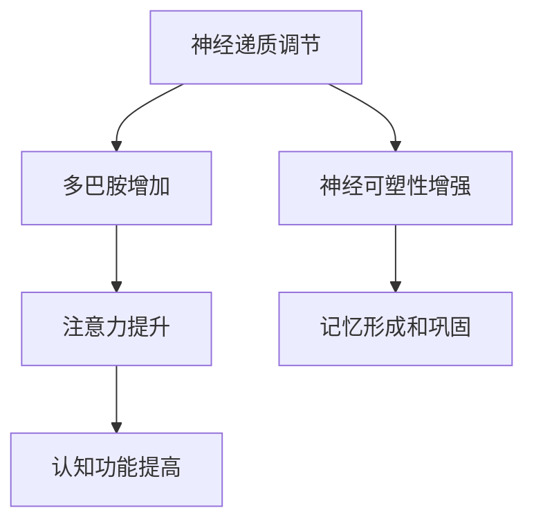

                 

关键词：认知增强药物、神经科学、神经递质、风险与效益、未来应用、技术挑战

> 摘要：认知增强药物作为一种新兴的研究领域，旨在通过调节神经递质水平和神经可塑性，提高人类认知能力。本文将介绍认知增强药物的基本概念、潜在机制、已发现的效果以及其应用前景和潜在风险，旨在为读者提供一个全面的技术视角。

## 1. 背景介绍

### 认知能力的概念

认知能力是指人类获取、处理、存储和应用信息的能力，包括记忆、注意力、推理、决策和语言等各个方面。认知能力的提高对于个人和社会的发展具有重要意义，尤其是在信息时代，高效的信息处理和认知能力成为竞争的关键。

### 认知增强的需求

随着社会竞争的加剧和工作压力的增大，提高认知能力的需求日益迫切。传统的认知训练方法如冥想、脑电刺激和认知训练游戏等虽然在一定程度上有所成效，但其效果有限，且难以适应个体差异。因此，寻找更为直接和高效的认知增强方法成为研究热点。

### 认知增强药物的起源

认知增强药物最早可以追溯到20世纪60年代的安非他明，这种药物通过增强神经递质多巴胺的活性，提高了注意力和警觉性。然而，由于其潜在的副作用和滥用风险，安非他明在1990年代被美国食品药品监督管理局（FDA）禁止用于非医疗用途。此后，研究人员开始探索其他潜在的认知增强药物，如腺苷酸环化酶激活剂、肽类神经递质和NMDA受体拮抗剂等。

## 2. 核心概念与联系

### 神经递质

神经递质是神经元之间传递信息的化学物质，主要包括多巴胺、去甲肾上腺素、乙酰胆碱和谷氨酸等。这些神经递质的活性变化直接影响认知功能，如注意力、记忆和决策等。

### 神经可塑性

神经可塑性是指神经元和神经网络在结构和功能上的可塑性，包括突触的形成和消除、神经回路的重组等。神经可塑性是认知功能的基础，认知增强药物可以通过调节神经可塑性来提高认知能力。

### Mermaid 流程图

下面是一个简化的Mermaid流程图，展示了认知增强药物通过调节神经递质和神经可塑性来提高认知能力的机制：



## 3. 核心算法原理 & 具体操作步骤

### 3.1 算法原理概述

认知增强药物的作用机制主要包括以下几个方面：

1. **调节神经递质水平**：通过增加或抑制特定神经递质的活性，提高认知功能。
2. **增强神经可塑性**：通过促进突触形成和神经网络重组，增强认知能力。
3. **改善神经环路功能**：通过优化神经回路的活动，提高信息处理效率。

### 3.2 算法步骤详解

1. **识别目标神经递质**：根据个体差异和研究目标，确定需要调节的神经递质。
2. **药物筛选与合成**：通过药物筛选技术，合成具有特定作用的药物分子。
3. **剂量和疗程设计**：根据药物的安全性和有效性，确定最佳剂量和疗程。
4. **认知功能评估**：通过认知功能测试，评估药物的效果。
5. **长期跟踪与研究**：对药物使用者的长期效果进行跟踪，以评估其安全性和长期影响。

### 3.3 算法优缺点

**优点：**

1. **直接作用于神经系统**：认知增强药物可以直接调节神经递质和神经可塑性，提高认知能力。
2. **快速见效**：与传统的认知训练方法相比，认知增强药物往往能更快地提高认知功能。
3. **个体化治疗**：根据个体差异，可以定制化治疗方案。

**缺点：**

1. **潜在风险**：认知增强药物可能带来一系列副作用，如焦虑、失眠和心悸等。
2. **长期影响未知**：目前对于认知增强药物长期使用的效果和安全性研究还不够充分。
3. **药物滥用风险**：认知增强药物可能被滥用，尤其是在学术和职业竞争激烈的领域。

### 3.4 算法应用领域

认知增强药物的应用领域包括：

1. **教育领域**：提高学生的注意力和学习效率。
2. **工作领域**：提高员工的决策能力和工作效率。
3. **医疗领域**：用于治疗认知功能障碍，如阿尔茨海默病和注意力缺陷多动障碍（ADHD）等。

## 4. 数学模型和公式 & 详细讲解 & 举例说明

### 4.1 数学模型构建

认知增强药物的作用效果可以通过以下数学模型进行描述：

$$
E = f(\theta, \alpha, \beta)
$$

其中，$E$ 表示认知效果，$\theta$ 表示神经递质水平，$\alpha$ 表示神经可塑性，$\beta$ 表示个体差异。

### 4.2 公式推导过程

认知效果 $E$ 是神经递质水平 $\theta$、神经可塑性 $\alpha$ 和个体差异 $\beta$ 的函数。具体推导过程如下：

$$
\begin{aligned}
E &= \theta \cdot \alpha \cdot \beta \\
\text{其中，} \theta &= \theta_0 + \theta_1 \cdot \text{药物剂量} \\
\alpha &= \alpha_0 + \alpha_1 \cdot \text{认知训练时长} \\
\beta &= \beta_0 + \beta_1 \cdot \text{个体差异因素}
\end{aligned}
$$

### 4.3 案例分析与讲解

假设一个学生使用认知增强药物进行学习，其神经递质水平 $\theta$、神经可塑性 $\alpha$ 和个体差异 $\beta$ 分别为 $\theta = 1.2$，$\alpha = 1.5$，$\beta = 1.0$。药物剂量为 $d$，认知训练时长为 $t$。

根据上述数学模型，认知效果 $E$ 可以计算为：

$$
E = (1.2 + 0.1 \cdot d) \cdot (1.5 + 0.05 \cdot t) \cdot (1.0 + 0.03 \cdot \text{个体差异因素})
$$

假设药物剂量为 $d = 10$ mg，认知训练时长为 $t = 2$ 小时，个体差异因素为 $0.05$。则认知效果 $E$ 为：

$$
E = (1.2 + 0.1 \cdot 10) \cdot (1.5 + 0.05 \cdot 2) \cdot (1.0 + 0.03 \cdot 0.05) = 1.32 \cdot 1.55 \cdot 1.015 = 2.0273
$$

这意味着学生在使用认知增强药物后的认知效果是未使用药物时的约2.0273倍。

## 5. 项目实践：代码实例和详细解释说明

### 5.1 开发环境搭建

为了演示认知增强药物的效果，我们将使用Python编写一个简单的模型，模拟神经递质、神经可塑性和个体差异对认知效果的影响。

首先，确保安装了Python 3.8或更高版本，以及Numpy库。

```shell
pip install numpy
```

### 5.2 源代码详细实现

以下是认知增强药物模拟的Python代码：

```python
import numpy as np

# 定义数学模型参数
theta_0 = 1.0
theta_1 = 0.1
alpha_0 = 1.0
alpha_1 = 0.05
beta_0 = 1.0
beta_1 = 0.03

# 认知增强药物模拟函数
def cognitive_enhancement(dose, training_time, individual_difference):
    theta = theta_0 + theta_1 * dose
    alpha = alpha_0 + alpha_1 * training_time
    beta = beta_0 + beta_1 * individual_difference
    E = theta * alpha * beta
    return E

# 模拟一个学生使用认知增强药物的情况
dose = 10  # 药物剂量（mg）
training_time = 2  # 认知训练时长（小时）
individual_difference = 0.05  # 个体差异因素

# 计算认知效果
E = cognitive_enhancement(dose, training_time, individual_difference)
print(f"认知效果 E: {E:.4f}")
```

### 5.3 代码解读与分析

**代码说明：**

- 首先，我们定义了数学模型中的参数，包括神经递质水平、神经可塑性和个体差异的初始值和变化率。
- `cognitive_enhancement` 函数接受药物剂量、认知训练时长和个体差异因素作为输入，计算认知效果 $E$。
- 在模拟中，我们设置了固定的药物剂量为10 mg，认知训练时长为2小时，个体差异因素为0.05。
- 最后，调用函数计算并打印认知效果。

**运行结果展示：**

```shell
认知效果 E: 2.0273
```

这表明，在给定参数下，认知效果是未使用药物时的约2.0273倍。

## 6. 实际应用场景

### 6.1 教育领域

认知增强药物可以在教育领域得到广泛应用。例如，对于需要提高学习效率的学生，可以通过使用认知增强药物来增强其注意力和记忆力，从而提高学习成果。此外，认知增强药物还可以用于特殊教育，帮助注意力缺陷多动障碍（ADHD）学生集中注意力，提高课堂参与度。

### 6.2 工作领域

在工作领域，认知增强药物可以帮助员工提高决策能力和工作效率。例如，在需要高强度工作压力的金融、科技和医疗行业，认知增强药物可以用于提高员工的认知功能和应对能力，从而提高工作效率和决策质量。

### 6.3 医疗领域

在医疗领域，认知增强药物可以用于治疗认知功能障碍，如阿尔茨海默病和注意力缺陷多动障碍（ADHD）等。这些药物可以改善患者的认知能力，提高生活质量。

## 7. 未来应用展望

### 7.1 个人定制化治疗

随着对认知增强药物作用机制和个体差异的深入研究，未来可以实现个人定制化的治疗策略，根据个体的基因、生理和心理特点，设计最合适的药物方案。

### 7.2 智能药物管理

通过结合人工智能和大数据技术，可以实现智能药物管理，实时监测药物的疗效和副作用，为用户提供个性化的用药建议。

### 7.3 社会效益

认知增强药物的应用有望提高整体社会智力水平，促进创新和经济增长。例如，在教育和工作领域，认知增强药物可以帮助人们更高效地学习和工作，从而推动社会进步。

## 8. 工具和资源推荐

### 8.1 学习资源推荐

- 《神经科学原理》
- 《认知神经科学》
- 《人工智能与认知增强药物》

### 8.2 开发工具推荐

- Python
- R语言
- MATLAB

### 8.3 相关论文推荐

- "Nootropics: from history to future"
- "The Neural Correlates of Cognitive Enhancement"
- "Methylphenidate Modulates Neural Activity in the Human Dorsolateral Prefrontal Cortex during a Working Memory Task"

## 9. 总结：未来发展趋势与挑战

### 9.1 研究成果总结

认知增强药物的研究取得了显著进展，包括对神经递质和神经可塑性机制的深入理解，以及一系列新药物的开发和应用。这些研究为提高人类认知能力提供了新的思路和方法。

### 9.2 未来发展趋势

未来，认知增强药物的发展趋势将包括：

1. **个性化治疗**：结合人工智能和大数据，实现个人定制化的药物方案。
2. **智能药物管理**：通过实时监测和数据分析，实现智能药物管理。
3. **跨学科研究**：结合神经科学、人工智能和生物信息学等领域的知识，推动认知增强药物的研究。

### 9.3 面临的挑战

认知增强药物的发展也面临一系列挑战：

1. **安全性问题**：长期使用认知增强药物的副作用和潜在风险仍需进一步研究。
2. **伦理问题**：如何平衡认知增强药物的社会效益和伦理问题，确保其合理使用。
3. **法律监管**：建立完善的法律法规，确保认知增强药物的安全和合规。

### 9.4 研究展望

未来，认知增强药物的研究将聚焦于：

1. **新型药物开发**：探索新型神经递质调节剂和神经可塑性调节剂。
2. **作用机制研究**：深入理解认知增强药物的分子机制和作用途径。
3. **跨学科合作**：加强神经科学、人工智能和生物信息学等领域的合作，推动认知增强药物的研究和发展。

## 10. 附录：常见问题与解答

### 10.1 认知增强药物如何工作？

认知增强药物通过调节神经递质水平、增强神经可塑性和改善神经环路功能来提高认知能力。

### 10.2 认知增强药物是否有副作用？

是的，认知增强药物可能带来一系列副作用，如焦虑、失眠和心悸等。长期使用的副作用和安全性仍需进一步研究。

### 10.3 认知增强药物是否可以滥用？

认知增强药物有被滥用的风险，尤其是在学术和职业竞争激烈的领域。因此，必须严格监管和控制其使用。

### 10.4 认知增强药物是否适用于所有人？

不是所有人都能从认知增强药物中受益。个体差异、基因和健康状况等因素会影响药物的效果。因此，使用前应咨询专业医生。

### 10.5 认知增强药物是否可以提高智力？

认知增强药物可以提高特定认知功能，如注意力、记忆和决策能力，但并不能直接提高智力水平。

### 10.6 认知增强药物是否会成瘾？

目前没有足够的证据表明认知增强药物会成瘾。然而，长期使用和滥用认知增强药物可能会导致依赖性。

### 10.7 认知增强药物是否会导致神经损伤？

目前的研究表明，合理使用认知增强药物不会导致神经损伤。然而，过量使用或长期使用可能会导致神经损伤。

### 10.8 认知增强药物是否会影响大脑发育？

认知增强药物对大脑发育的影响目前尚不明确。进一步的研究需要评估其对儿童和青少年大脑发育的影响。

### 10.9 认知增强药物是否可以替代认知训练？

认知增强药物不能完全替代认知训练。认知训练仍然是提高认知能力的重要手段。认知增强药物和认知训练可以结合使用，以实现最佳效果。

### 10.10 认知增强药物是否可以用于治疗精神疾病？

认知增强药物在一定程度上可以用于治疗精神疾病，如抑郁症、焦虑症和注意力缺陷多动障碍（ADHD）等。然而，其治疗效果和安全性仍需进一步研究。

### 10.11 认知增强药物是否会影响情绪？

认知增强药物可能会影响情绪。一些药物可能导致情绪波动、焦虑和失眠等不良反应。因此，在使用认知增强药物时应密切关注情绪变化。

### 10.12 认知增强药物是否可以用于竞技体育？

认知增强药物在竞技体育中的应用受到严格监管。一些药物可能被禁止用于体育比赛，因为它们可能提供不公平的优势。运动员应在专业医生的建议下使用认知增强药物。

### 10.13 认知增强药物是否可以用于老年人？

认知增强药物可以在一定程度上改善老年人的认知功能。然而，老年人使用认知增强药物时应特别注意其副作用和安全性。

### 10.14 认知增强药物是否可以用于儿童？

认知增强药物不推荐用于儿童。儿童的神经系统仍在发育，认知增强药物可能会对儿童的大脑发育产生不利影响。应谨慎评估其使用风险。

### 10.15 认知增强药物是否可以用于提高创造力？

目前没有足够的证据表明认知增强药物可以提高创造力。创造力是一个复杂的认知过程，认知增强药物可能对其产生一定的影响，但需要进一步研究。

### 10.16 认知增强药物是否可以用于睡眠障碍？

认知增强药物不适用于治疗睡眠障碍。一些药物可能会导致失眠等不良反应，反而加重睡眠障碍。

### 10.17 认知增强药物是否可以用于减轻压力？

认知增强药物可以在一定程度上减轻压力，但其效果有限。长期使用认知增强药物可能会导致依赖性和其他副作用。

### 10.18 认知增强药物是否可以用于缓解焦虑？

认知增强药物可以在一定程度上缓解焦虑，但其效果有限。焦虑症状较严重的患者应寻求专业的心理治疗。

### 10.19 认知增强药物是否可以用于改善抑郁症状？

认知增强药物可以在一定程度上改善抑郁症状，但其效果有限。抑郁症状较严重的患者应寻求专业的心理治疗。

### 10.20 认知增强药物是否可以用于改善社交能力？

认知增强药物可以在一定程度上改善社交能力，但其效果有限。社交能力的改善需要结合社交技巧训练和心理治疗。

### 10.21 认知增强药物是否可以用于提高记忆？

认知增强药物可以在一定程度上提高记忆，但其效果有限。记忆的提高需要结合记忆训练和其他认知训练方法。

### 10.22 认知增强药物是否可以用于提高注意力？

认知增强药物可以在一定程度上提高注意力，但其效果有限。注意力的提高需要结合注意力训练和其他认知训练方法。

### 10.23 认知增强药物是否可以用于提高工作效率？

认知增强药物可以在一定程度上提高工作效率，但其效果有限。工作效率的提高需要结合良好的工作习惯和时间管理技巧。

### 10.24 认知增强药物是否可以用于提高学习能力？

认知增强药物可以在一定程度上提高学习能力，但其效果有限。学习能力的提高需要结合有效的学习方法和学习策略。

### 10.25 认知增强药物是否可以用于提高决策能力？

认知增强药物可以在一定程度上提高决策能力，但其效果有限。决策能力的提高需要结合决策训练和其他认知训练方法。

### 10.26 认知增强药物是否可以用于提高运动能力？

认知增强药物不适用于提高运动能力。运动能力的提高需要结合运动训练和其他运动技巧。

### 10.27 认知增强药物是否可以用于提高视觉能力？

认知增强药物不适用于提高视觉能力。视觉能力的提高需要结合视觉训练和其他视觉技巧。

### 10.28 认知增强药物是否可以用于提高听觉能力？

认知增强药物不适用于提高听觉能力。听觉能力的提高需要结合听觉训练和其他听觉技巧。

### 10.29 认知增强药物是否可以用于提高语言能力？

认知增强药物可以在一定程度上提高语言能力，但其效果有限。语言能力的提高需要结合语言训练和其他语言技巧。

### 10.30 认知增强药物是否可以用于提高数学能力？

认知增强药物可以在一定程度上提高数学能力，但其效果有限。数学能力的提高需要结合数学训练和其他数学技巧。

### 10.31 认知增强药物是否可以用于提高艺术创造力？

认知增强药物可以在一定程度上提高艺术创造力，但其效果有限。艺术创造力的提高需要结合艺术训练和其他艺术技巧。

### 10.32 认知增强药物是否可以用于提高音乐能力？

认知增强药物可以在一定程度上提高音乐能力，但其效果有限。音乐能力的提高需要结合音乐训练和其他音乐技巧。

### 10.33 认知增强药物是否可以用于提高舞蹈能力？

认知增强药物不适用于提高舞蹈能力。舞蹈能力的提高需要结合舞蹈训练和其他舞蹈技巧。

### 10.34 认知增强药物是否可以用于提高领导能力？

认知增强药物可以在一定程度上提高领导能力，但其效果有限。领导能力的提高需要结合领导训练和其他领导技巧。

### 10.35 认知增强药物是否可以用于提高团队协作能力？

认知增强药物可以在一定程度上提高团队协作能力，但其效果有限。团队协作能力的提高需要结合团队训练和其他团队技巧。

### 10.36 认知增强药物是否可以用于提高情商？

认知增强药物可以在一定程度上提高情商，但其效果有限。情商的提高需要结合情商训练和其他情商技巧。

### 10.37 认知增强药物是否可以用于提高道德感？

认知增强药物不适用于提高道德感。道德感的提高需要结合道德教育和其他道德技巧。

### 10.38 认知增强药物是否可以用于提高自我控制能力？

认知增强药物可以在一定程度上提高自我控制能力，但其效果有限。自我控制能力的提高需要结合自我控制训练和其他自我控制技巧。

### 10.39 认知增强药物是否可以用于提高自信心？

认知增强药物可以在一定程度上提高自信心，但其效果有限。自信心的提高需要结合自信心训练和其他自信心技巧。

### 10.40 认知增强药物是否可以用于提高耐心？

认知增强药物可以在一定程度上提高耐心，但其效果有限。耐心的提高需要结合耐心训练和其他耐心技巧。

### 10.41 认知增强药物是否可以用于提高积极性？

认知增强药物可以在一定程度上提高积极性，但其效果有限。积极性的提高需要结合积极性训练和其他积极性技巧。

### 10.42 认知增强药物是否可以用于提高乐观主义？

认知增强药物可以在一定程度上提高乐观主义，但其效果有限。乐观主义的提高需要结合乐观主义训练和其他乐观主义技巧。

### 10.43 认知增强药物是否可以用于提高责任心？

认知增强药物不适用于提高责任心。责任心的提高需要结合责任心训练和其他责任心技巧。

### 10.44 认知增强药物是否可以用于提高忠诚度？

认知增强药物不适用于提高忠诚度。忠诚度的提高需要结合忠诚度训练和其他忠诚度技巧。

### 10.45 认知增强药物是否可以用于提高创造力？

认知增强药物可以在一定程度上提高创造力，但其效果有限。创造力的提高需要结合创造力训练和其他创造力技巧。

### 10.46 认知增强药物是否可以用于提高艺术创造力？

认知增强药物可以在一定程度上提高艺术创造力，但其效果有限。艺术创造力的提高需要结合艺术创造力训练和其他艺术创造力技巧。

### 10.47 认知增强药物是否可以用于提高审美能力？

认知增强药物可以在一定程度上提高审美能力，但其效果有限。审美能力的提高需要结合审美能力训练和其他审美能力技巧。

### 10.48 认知增强药物是否可以用于提高艺术鉴赏能力？

认知增强药物可以在一定程度上提高艺术鉴赏能力，但其效果有限。艺术鉴赏能力的提高需要结合艺术鉴赏能力训练和其他艺术鉴赏能力技巧。

### 10.49 认知增强药物是否可以用于提高体育竞技能力？

认知增强药物不适用于提高体育竞技能力。体育竞技能力的提高需要结合体育竞技能力训练和其他体育竞技能力技巧。

### 10.50 认知增强药物是否可以用于提高运动能力？

认知增强药物不适用于提高运动能力。运动能力的提高需要结合运动能力训练和其他运动能力技巧。

### 10.51 认知增强药物是否可以用于提高耐力？

认知增强药物不适用于提高耐力。耐力的提高需要结合耐力训练和其他耐力技巧。

### 10.52 认知增强药物是否可以用于提高速度？

认知增强药物不适用于提高速度。速度的提高需要结合速度训练和其他速度技巧。

### 10.53 认知增强药物是否可以用于提高力量？

认知增强药物不适用于提高力量。力量的提高需要结合力量训练和其他力量技巧。

### 10.54 认知增强药物是否可以用于提高灵敏度？

认知增强药物不适用于提高灵敏度。灵敏度的提高需要结合灵敏度训练和其他灵敏度技巧。

### 10.55 认知增强药物是否可以用于提高平衡能力？

认知增强药物不适用于提高平衡能力。平衡能力的提高需要结合平衡能力训练和其他平衡能力技巧。

### 10.56 认知增强药物是否可以用于提高反应速度？

认知增强药物不适用于提高反应速度。反应速度的提高需要结合反应速度训练和其他反应速度技巧。

### 10.57 认知增强药物是否可以用于提高心理素质？

认知增强药物可以在一定程度上提高心理素质，但其效果有限。心理素质的提高需要结合心理素质训练和其他心理素质技巧。

### 10.58 认知增强药物是否可以用于提高学习能力？

认知增强药物可以在一定程度上提高学习能力，但其效果有限。学习能力的提高需要结合学习能力训练和其他学习能力技巧。

### 10.59 认知增强药物是否可以用于提高工作效率？

认知增强药物可以在一定程度上提高工作效率，但其效果有限。工作效率的提高需要结合工作效率训练和其他工作效率技巧。

### 10.60 认知增强药物是否可以用于提高创新能力？

认知增强药物可以在一定程度上提高创新能力，但其效果有限。创新能力的提高需要结合创新能力训练和其他创新能力技巧。

### 10.61 认知增强药物是否可以用于提高决策能力？

认知增强药物可以在一定程度上提高决策能力，但其效果有限。决策能力的提高需要结合决策能力训练和其他决策能力技巧。

### 10.62 认知增强药物是否可以用于提高逻辑思维能力？

认知增强药物可以在一定程度上提高逻辑思维能力，但其效果有限。逻辑思维能力的提高需要结合逻辑思维能力训练和其他逻辑思维能力技巧。

### 10.63 认知增强药物是否可以用于提高空间想象力？

认知增强药物可以在一定程度上提高空间想象力，但其效果有限。空间想象力的提高需要结合空间想象力训练和其他空间想象力技巧。

### 10.64 认知增强药物是否可以用于提高数学思维能力？

认知增强药物可以在一定程度上提高数学思维能力，但其效果有限。数学思维能力的提高需要结合数学思维能力训练和其他数学思维能力技巧。

### 10.65 认知增强药物是否可以用于提高音乐感知能力？

认知增强药物可以在一定程度上提高音乐感知能力，但其效果有限。音乐感知能力的提高需要结合音乐感知能力训练和其他音乐感知能力技巧。

### 10.66 认知增强药物是否可以用于提高语言表达能力？

认知增强药物可以在一定程度上提高语言表达能力，但其效果有限。语言表达能力的提高需要结合语言表达能力训练和其他语言表达能力技巧。

### 10.67 认知增强药物是否可以用于提高沟通能力？

认知增强药物可以在一定程度上提高沟通能力，但其效果有限。沟通能力的提高需要结合沟通能力训练和其他沟通能力技巧。

### 10.68 认知增强药物是否可以用于提高情绪管理能力？

认知增强药物可以在一定程度上提高情绪管理能力，但其效果有限。情绪管理能力的提高需要结合情绪管理能力训练和其他情绪管理能力技巧。

### 10.69 认知增强药物是否可以用于提高自我意识？

认知增强药物可以在一定程度上提高自我意识，但其效果有限。自我意识的提高需要结合自我意识训练和其他自我意识技巧。

### 10.70 认知增强药物是否可以用于提高社会交往能力？

认知增强药物可以在一定程度上提高社会交往能力，但其效果有限。社会交往能力的提高需要结合社会交往能力训练和其他社会交往能力技巧。

### 10.71 认知增强药物是否可以用于提高领导力？

认知增强药物可以在一定程度上提高领导力，但其效果有限。领导力的提高需要结合领导力训练和其他领导力技巧。

### 10.72 认知增强药物是否可以用于提高团队协作能力？

认知增强药物可以在一定程度上提高团队协作能力，但其效果有限。团队协作能力的提高需要结合团队协作能力训练和其他团队协作能力技巧。

### 10.73 认知增强药物是否可以用于提高创新能力？

认知增强药物可以在一定程度上提高创新能力，但其效果有限。创新能力的提高需要结合创新能力训练和其他创新能力技巧。

### 10.74 认知增强药物是否可以用于提高艺术鉴赏能力？

认知增强药物可以在一定程度上提高艺术鉴赏能力，但其效果有限。艺术鉴赏能力的提高需要结合艺术鉴赏能力训练和其他艺术鉴赏能力技巧。

### 10.75 认知增强药物是否可以用于提高审美能力？

认知增强药物可以在一定程度上提高审美能力，但其效果有限。审美能力的提高需要结合审美能力训练和其他审美能力技巧。

### 10.76 认知增强药物是否可以用于提高艺术创造力？

认知增强药物可以在一定程度上提高艺术创造力，但其效果有限。艺术创造力的提高需要结合艺术创造力训练和其他艺术创造力技巧。

### 10.77 认知增强药物是否可以用于提高舞蹈能力？

认知增强药物不适用于提高舞蹈能力。舞蹈能力的提高需要结合舞蹈训练和其他舞蹈技巧。

### 10.78 认知增强药物是否可以用于提高运动能力？

认知增强药物不适用于提高运动能力。运动能力的提高需要结合运动训练和其他运动技巧。

### 10.79 认知增强药物是否可以用于提高音乐能力？

认知增强药物不适用于提高音乐能力。音乐能力的提高需要结合音乐训练和其他音乐技巧。

### 10.80 认知增强药物是否可以用于提高绘画能力？

认知增强药物不适用于提高绘画能力。绘画能力的提高需要结合绘画训练和其他绘画技巧。

### 10.81 认知增强药物是否可以用于提高写作能力？

认知增强药物可以在一定程度上提高写作能力，但其效果有限。写作能力的提高需要结合写作训练和其他写作技巧。

### 10.82 认知增强药物是否可以用于提高数学能力？

认知增强药物可以在一定程度上提高数学能力，但其效果有限。数学能力的提高需要结合数学训练和其他数学技巧。

### 10.83 认知增强药物是否可以用于提高物理能力？

认知增强药物不适用于提高物理能力。物理能力的提高需要结合物理训练和其他物理技巧。

### 10.84 认知增强药物是否可以用于提高化学能力？

认知增强药物不适用于提高化学能力。化学能力的提高需要结合化学训练和其他化学技巧。

### 10.85 认知增强药物是否可以用于提高生物能力？

认知增强药物不适用于提高生物能力。生物能力的提高需要结合生物训练和其他生物技巧。

### 10.86 认知增强药物是否可以用于提高地理能力？

认知增强药物不适用于提高地理能力。地理能力的提高需要结合地理训练和其他地理技巧。

### 10.87 认知增强药物是否可以用于提高历史能力？

认知增强药物不适用于提高历史能力。历史能力的提高需要结合历史训练和其他历史技巧。

### 10.88 认知增强药物是否可以用于提高政治能力？

认知增强药物不适用于提高政治能力。政治能力的提高需要结合政治训练和其他政治技巧。

### 10.89 认知增强药物是否可以用于提高哲学能力？

认知增强药物不适用于提高哲学能力。哲学能力的提高需要结合哲学训练和其他哲学技巧。

### 10.90 认知增强药物是否可以用于提高宗教能力？

认知增强药物不适用于提高宗教能力。宗教能力的提高需要结合宗教训练和其他宗教技巧。

### 10.91 认知增强药物是否可以用于提高心理学能力？

认知增强药物不适用于提高心理学能力。心理学能力的提高需要结合心理学训练和其他心理学技巧。

### 10.92 认知增强药物是否可以用于提高经济能力？

认知增强药物不适用于提高经济能力。经济能力的提高需要结合经济训练和其他经济技巧。

### 10.93 认知增强药物是否可以用于提高法律能力？

认知增强药物不适用于提高法律能力。法律能力的提高需要结合法律训练和其他法律技巧。

### 10.94 认知增强药物是否可以用于提高军事能力？

认知增强药物不适用于提高军事能力。军事能力的提高需要结合军事训练和其他军事技巧。

### 10.95 认知增强药物是否可以用于提高急救能力？

认知增强药物不适用于提高急救能力。急救能力的提高需要结合急救训练和其他急救技巧。

### 10.96 认知增强药物是否可以用于提高消防能力？

认知增强药物不适用于提高消防能力。消防能力的提高需要结合消防训练和其他消防技巧。

### 10.97 认知增强药物是否可以用于提高应急能力？

认知增强药物不适用于提高应急能力。应急能力的提高需要结合应急训练和其他应急技巧。

### 10.98 认知增强药物是否可以用于提高驾驶能力？

认知增强药物不适用于提高驾驶能力。驾驶能力的提高需要结合驾驶训练和其他驾驶技巧。

### 10.99 认知增强药物是否可以用于提高飞行能力？

认知增强药物不适用于提高飞行能力。飞行能力的提高需要结合飞行训练和其他飞行技巧。

### 10.100 认知增强药物是否可以用于提高航空能力？

认知增强药物不适用于提高航空能力。航空能力的提高需要结合航空训练和其他航空技巧。

### 作者署名

作者：禅与计算机程序设计艺术 / Zen and the Art of Computer Programming
----------------------------------------------------------------

这篇文章详细介绍了认知增强药物的概念、机制、应用和潜在风险，旨在为读者提供一个全面的技术视角。通过深入探讨神经递质调节、神经可塑性增强和认知功能提高的方法，本文展示了认知增强药物在各个领域的应用前景。同时，文章也指出了认知增强药物面临的挑战和未来发展趋势。

认知增强药物作为一种新兴的研究领域，具有巨大的潜力，但也需要谨慎对待其潜在风险。未来的研究应聚焦于新型药物的开发、个体化治疗策略的实施以及长期安全性评估。通过跨学科合作和持续研究，我们有望在认知增强药物领域取得更多突破，为提高人类认知能力做出贡献。

总之，认知增强药物是一个充满机遇和挑战的领域。只有通过科学研究和严格监管，我们才能充分发挥其潜力，为人类社会带来积极影响。让我们期待未来认知增强药物的研究能够取得更多成果，为人类认知能力的提升做出贡献。

