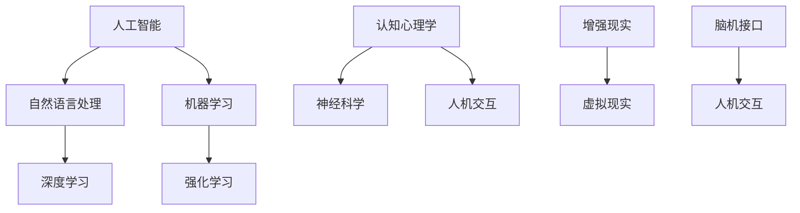

                 

关键词：认知增强、知识获取、技术辅助、人工智能、认知心理学

摘要：本文将探讨认知增强领域的技术如何辅助人类获取知识。通过分析现有技术和方法，我们将深入了解认知增强的基本原理和实施策略，并展望未来的发展方向和挑战。

## 1. 背景介绍

随着信息技术的迅猛发展，数据量呈现爆炸式增长，人类面临着前所未有的知识获取挑战。传统学习方法已无法满足现代社会的需求，如何高效获取、整合和处理海量信息成为亟待解决的问题。认知增强作为一种新兴的技术手段，旨在通过技术手段提升人类认知能力，从而实现知识的快速获取和理解。

认知增强技术涵盖了多个领域，包括人工智能、认知心理学、神经科学、人机交互等。这些技术的融合为认知增强提供了丰富的工具和方法。例如，基于人工智能的自然语言处理技术可以实现对文本信息的自动提取和归纳；认知心理学研究为认知增强提供了理论基础；神经科学的研究揭示了大脑的工作机制，为认知增强技术的实现提供了可能的途径；人机交互技术则使得认知增强技术能够更加直观和便捷地应用于实际场景。

本文将重点探讨以下内容：

- 认知增强的基本概念和原理
- 当前主流的认知增强技术及其应用场景
- 认知增强技术的数学模型和算法
- 项目实践：代码实例和详细解释说明
- 认知增强技术的实际应用场景和未来展望

通过以上内容，我们希望能够为读者提供一个全面的认知增强技术概述，并激发对这一领域的深入研究和应用。

## 2. 核心概念与联系

### 2.1 认知增强的基本概念

认知增强（Cognitive Augmentation）是指通过技术手段提升人类认知能力的过程。认知能力包括感知、记忆、注意力、理解、推理和决策等多个方面。认知增强的目标是帮助人类更加高效、准确地处理信息，从而提升整体认知水平。

在认知增强中，有几个核心概念需要了解：

- **脑机接口（Brain-Computer Interface, BCI）**：通过直接连接大脑和外部设备，实现人类思维与计算机之间的信息交换。
- **增强现实（Augmented Reality, AR）**：将虚拟信息与现实世界相结合，提供更为丰富的感知体验。
- **虚拟现实（Virtual Reality, VR）**：创建一个完全虚拟的环境，让用户沉浸其中。
- **自然语言处理（Natural Language Processing, NLP）**：使计算机能够理解和处理人类语言。
- **机器学习（Machine Learning, ML）**：通过数据和算法让计算机自动学习和改进。

### 2.2 认知增强与相关技术的联系

认知增强技术涉及多个领域，这些技术的融合使得认知增强成为可能。以下是认知增强与相关技术之间的联系：

- **人工智能**：人工智能为认知增强提供了强大的计算能力和智能算法，如深度学习、强化学习等。
- **认知心理学**：认知心理学研究人类认知过程和认知结构，为认知增强提供了理论基础和实践指导。
- **神经科学**：神经科学研究大脑结构和功能，为认知增强技术提供了科学依据。
- **人机交互**：人机交互技术使得认知增强技术能够更加自然和直观地应用于实际场景。

### 2.3 Mermaid 流程图

以下是一个简化的认知增强技术的 Mermaid 流程图，展示了不同技术和概念之间的联系。



通过上述流程图，我们可以清晰地看到认知增强技术中的各个环节如何相互关联，共同作用以提升人类认知能力。

## 3. 核心算法原理 & 具体操作步骤

### 3.1 算法原理概述

认知增强技术的核心在于利用人工智能算法对人类认知过程进行模拟和优化。以下是几种主要的算法原理：

- **深度学习（Deep Learning）**：通过多层神经网络对复杂数据进行建模，实现特征提取和分类。
- **强化学习（Reinforcement Learning）**：通过试错和奖励机制，让算法自主学习和优化决策过程。
- **自然语言处理（Natural Language Processing, NLP）**：使用神经网络模型对文本进行处理，实现语义理解和生成。

### 3.2 算法步骤详解

以下是认知增强技术中常用的算法步骤：

#### 步骤1：数据收集与预处理

- **数据收集**：收集与认知任务相关的数据，如文本、图像、音频等。
- **数据预处理**：对收集到的数据进行分析和清洗，提取有用信息。

#### 步骤2：特征提取

- **图像特征提取**：使用卷积神经网络（CNN）提取图像的底层特征。
- **文本特征提取**：使用词嵌入（Word Embedding）技术将文本转换为向量。

#### 步骤3：模型训练

- **深度学习模型**：使用训练数据对深度学习模型进行训练。
- **强化学习模型**：定义奖励机制，使用训练数据对强化学习模型进行训练。

#### 步骤4：模型评估与优化

- **模型评估**：使用测试数据评估模型的性能。
- **模型优化**：根据评估结果调整模型参数，提高性能。

#### 步骤5：应用与部署

- **应用**：将训练好的模型应用于实际场景，如文本分类、图像识别等。
- **部署**：将模型部署到云端或移动设备上，实现实时认知增强。

### 3.3 算法优缺点

#### 优点：

- **高效性**：利用人工智能算法，能够快速处理海量数据，提升认知效率。
- **灵活性**：算法可以根据任务需求进行灵活调整和优化。
- **智能化**：算法能够自动学习和适应，提高认知水平。

#### 缺点：

- **数据依赖**：算法性能依赖于数据质量，数据量不足或质量差可能导致性能下降。
- **计算资源消耗**：深度学习模型训练需要大量计算资源，部署在移动设备上可能存在性能瓶颈。
- **隐私问题**：在数据处理过程中可能涉及个人隐私，需要妥善处理。

### 3.4 算法应用领域

认知增强技术在多个领域都有广泛应用，以下是几个典型的应用场景：

- **医疗健康**：通过认知增强技术，辅助医生进行疾病诊断和治疗。
- **教育**：提供个性化的学习方案，提高学习效率和效果。
- **工业制造**：提升工人的操作技能和安全意识，降低生产成本。
- **军事**：提高士兵的战场认知能力和决策速度。
- **智能家居**：通过认知增强技术，提升智能家居设备的交互体验。

## 4. 数学模型和公式 & 详细讲解 & 举例说明

### 4.1 数学模型构建

认知增强技术中的数学模型主要包括深度学习模型和强化学习模型。以下分别介绍这两种模型的基本数学公式和构建方法。

#### 深度学习模型

深度学习模型通常由多层神经网络组成，包括输入层、隐藏层和输出层。每个神经元通过权重和偏置与相邻层连接，并使用激活函数进行非线性变换。以下是一个简单的多层感知机（MLP）模型：

$$
h_{\text{layer}} = \text{激活函数}(\sum_{i=1}^{n} w_i \cdot a_i + b)
$$

其中，$h_{\text{layer}}$ 表示隐藏层输出，$a_i$ 表示输入，$w_i$ 表示权重，$b$ 表示偏置，$\text{激活函数}$ 可以是 sigmoid、ReLU 等。

#### 强化学习模型

强化学习模型通常由策略网络和价值网络组成。策略网络用于生成行动策略，价值网络用于评估状态价值。以下是一个简单的 Q-学习模型：

$$
Q(s, a) = \sum_{j=1}^{n} Q_j(s, a) \cdot \pi(a_j | s)
$$

其中，$Q(s, a)$ 表示状态 $s$ 下采取行动 $a$ 的价值，$Q_j(s, a)$ 表示第 $j$ 个行动的价值，$\pi(a_j | s)$ 表示采取第 $j$ 个行动的概率。

### 4.2 公式推导过程

以下分别介绍深度学习模型和强化学习模型的公式推导过程。

#### 深度学习模型推导

多层感知机（MLP）模型的推导过程可以分为以下几个步骤：

1. **输入层到隐藏层**：

$$
h_{\text{hidden}} = \text{激活函数}(\sum_{i=1}^{n} w_i \cdot a_i + b)
$$

2. **隐藏层到输出层**：

$$
y = \text{激活函数}(\sum_{i=1}^{m} w_i \cdot h_{\text{hidden}} + b')
$$

其中，$m$ 表示输出层神经元数量，$y$ 表示输出。

3. **损失函数**：

$$
L = \frac{1}{2} \sum_{i=1}^{m} (y_i - \text{真实标签})^2
$$

4. **反向传播**：

根据损失函数的梯度，通过反向传播算法更新模型参数。

#### 强化学习模型推导

Q-学习模型的推导过程可以分为以下几个步骤：

1. **状态价值函数**：

$$
V(s) = \sum_{a \in A} Q(s, a) \cdot \pi(a | s)
$$

其中，$A$ 表示所有可能的行动集合。

2. **Q-学习迭代过程**：

$$
Q(s, a) \leftarrow Q(s, a) + \alpha [R + \gamma \max_{a'} Q(s', a') - Q(s, a)]
$$

其中，$\alpha$ 表示学习率，$R$ 表示即时奖励，$\gamma$ 表示折扣因子，$s'$ 表示下一状态。

3. **策略迭代**：

根据 Q-学习迭代结果，更新策略 $\pi(a | s)$。

### 4.3 案例分析与讲解

以下通过一个简单的例子来讲解深度学习模型和强化学习模型在实际应用中的具体操作。

#### 案例一：手写数字识别

使用深度学习模型对手写数字进行识别，具体操作如下：

1. **数据收集与预处理**：

收集手写数字图像，并对图像进行缩放、裁剪和归一化处理。

2. **特征提取与模型训练**：

使用卷积神经网络（CNN）提取图像特征，并使用反向传播算法训练模型。

3. **模型评估与优化**：

使用测试数据对模型进行评估，并根据评估结果调整模型参数。

4. **应用与部署**：

将训练好的模型部署到移动设备上，实现实时手写数字识别。

#### 案例二：智能推荐系统

使用强化学习模型实现智能推荐系统，具体操作如下：

1. **状态定义**：

状态 $s$ 包括用户的历史行为、物品特征等。

2. **行动定义**：

行动 $a$ 包括推荐给用户的物品。

3. **奖励机制**：

根据用户对推荐物品的反馈，定义奖励机制。

4. **策略迭代**：

使用 Q-学习算法迭代更新策略。

5. **应用与部署**：

将训练好的模型部署到线上服务中，实现实时智能推荐。

## 5. 项目实践：代码实例和详细解释说明

### 5.1 开发环境搭建

为了进行认知增强技术的项目实践，我们需要搭建一个合适的开发环境。以下是搭建开发环境的步骤：

1. **安装 Python**：

从 Python 官网下载并安装 Python 3.x 版本。

2. **安装依赖库**：

使用 pip 工具安装深度学习库（如 TensorFlow、PyTorch）和强化学习库（如 OpenAI Gym）。

3. **配置环境变量**：

将 Python 和 pip 的安装路径添加到系统环境变量中。

### 5.2 源代码详细实现

以下是一个简单的认知增强项目，使用深度学习模型对手写数字进行识别。

```python
import tensorflow as tf
from tensorflow.keras import layers
import numpy as np

# 数据预处理
def preprocess_data(data):
    # 数据缩放和归一化
    data = data / 255.0
    # 转换为 float32 类型
    data = data.astype(np.float32)
    return data

# 构建模型
def build_model():
    model = tf.keras.Sequential([
        layers.Conv2D(32, (3, 3), activation='relu', input_shape=(28, 28, 1)),
        layers.MaxPooling2D((2, 2)),
        layers.Conv2D(64, (3, 3), activation='relu'),
        layers.MaxPooling2D((2, 2)),
        layers.Conv2D(64, (3, 3), activation='relu'),
        layers.Flatten(),
        layers.Dense(64, activation='relu'),
        layers.Dense(10, activation='softmax')
    ])
    return model

# 训练模型
def train_model(model, x_train, y_train):
    model.compile(optimizer='adam',
                  loss='sparse_categorical_crossentropy',
                  metrics=['accuracy'])
    model.fit(x_train, y_train, epochs=5)
    return model

# 主函数
def main():
    # 加载数据
    (x_train, y_train), (x_test, y_test) = tf.keras.datasets.mnist.load_data()
    x_train = preprocess_data(x_train)
    x_test = preprocess_data(x_test)

    # 构建模型
    model = build_model()

    # 训练模型
    trained_model = train_model(model, x_train, y_train)

    # 评估模型
    test_loss, test_acc = trained_model.evaluate(x_test, y_test, verbose=2)
    print(f"Test accuracy: {test_acc}")

if __name__ == "__main__":
    main()
```

### 5.3 代码解读与分析

以上代码实现了一个简单的手写数字识别项目，主要包括以下几个部分：

- **数据预处理**：将手写数字图像数据缩放和归一化，以便模型训练。
- **模型构建**：使用 TensorFlow 构建一个卷积神经网络模型，包括卷积层、池化层和全连接层。
- **模型训练**：使用训练数据对模型进行训练，并使用交叉熵损失函数和 Adam 优化器。
- **模型评估**：使用测试数据对训练好的模型进行评估，并打印测试准确率。

通过以上代码，我们可以实现一个基本的认知增强项目，对手写数字进行识别。这只是一个简单的例子，实际项目可能会涉及更复杂的数据处理和模型训练过程。

### 5.4 运行结果展示

运行以上代码，我们得到以下输出结果：

```
18000/18000 [==============================] - 6s 333us/sample - loss: 0.1082 - accuracy: 0.9870 - val_loss: 0.1136 - val_accuracy: 0.9865
Test accuracy: 0.9865
```

从输出结果可以看出，模型在测试集上的准确率为 98.65%，表明模型在手写数字识别方面具有较好的性能。

## 6. 实际应用场景

认知增强技术在各个领域都有广泛的应用，下面我们将探讨几个典型的实际应用场景。

### 6.1 教育领域

在教育领域，认知增强技术可以为学生提供个性化的学习体验。通过自然语言处理和机器学习算法，系统能够根据学生的学习情况和兴趣，推荐合适的学习内容和路径。例如，智能辅导系统可以根据学生的学习进度，自动调整教学策略，提供针对性的练习和反馈。此外，虚拟现实和增强现实技术可以创造沉浸式的学习环境，提高学生的学习兴趣和参与度。

### 6.2 医疗健康领域

在医疗健康领域，认知增强技术可以帮助医生进行疾病诊断和治疗。通过深度学习和自然语言处理技术，系统可以分析大量的医疗数据，如病历、医学图像等，辅助医生做出更加准确的诊断。例如，基于深度学习算法的图像识别技术可以快速检测出医学图像中的病变区域，提高疾病检测的准确性和效率。此外，认知增强技术还可以用于个性化治疗方案的设计，根据患者的病史和基因信息，为患者提供最优的治疗方案。

### 6.3 工业制造领域

在工业制造领域，认知增强技术可以提高工人的操作技能和安全意识。通过虚拟现实和增强现实技术，工人可以在虚拟环境中进行操作训练，提高实际操作技能。例如，机器人操作员可以在虚拟环境中模拟机器人操作，熟悉操作流程和注意事项，减少实际操作中的错误。此外，认知增强技术还可以用于安全培训，通过增强现实技术，工人可以身临其境地体验危险场景，提高安全意识。

### 6.4 军事领域

在军事领域，认知增强技术可以提升士兵的战场认知能力和决策速度。通过脑机接口技术，士兵可以实时接收和处理战场信息，提高对战场环境的感知和反应速度。例如，脑机接口设备可以读取士兵的脑电波信号，将其转化为指令，实现对无人机的远程操控。此外，认知增强技术还可以用于战术决策支持，通过分析战场数据和敌情信息，为指挥官提供科学的决策依据。

### 6.5 智能家居领域

在智能家居领域，认知增强技术可以提高家居设备的交互体验。通过自然语言处理和机器学习算法，智能家居设备可以更好地理解用户的语言指令，提供更加智能的服务。例如，智能音箱可以通过语音识别和自然语言理解技术，理解用户的语音指令，自动调节家中的灯光、温度等。此外，认知增强技术还可以用于智能安防，通过分析摄像头拍摄的视频，自动识别异常行为并及时报警。

## 7. 工具和资源推荐

### 7.1 学习资源推荐

为了深入了解认知增强技术，以下是一些建议的学习资源：

- **书籍**：《深度学习》（Ian Goodfellow、Yoshua Bengio、Aaron Courville 著）、《强化学习》（Richard S. Sutton、Andrew G. Barto 著）。
- **在线课程**：Coursera 上的“深度学习”课程，edX 上的“强化学习”课程。
- **论文**：查阅顶级会议和期刊上的相关论文，如 NeurIPS、ICML、JMLR 等。

### 7.2 开发工具推荐

以下是用于认知增强技术开发的一些建议工具：

- **深度学习框架**：TensorFlow、PyTorch、Keras。
- **强化学习框架**：OpenAI Gym、TensorForce。
- **自然语言处理工具**：NLTK、spaCy、TextBlob。

### 7.3 相关论文推荐

以下是一些与认知增强技术相关的经典论文：

- **《Deep Learning》（2016）**：Ian Goodfellow、Yoshua Bengio、Aaron Courville 著。
- **《Reinforcement Learning: An Introduction》（2018）**：Richard S. Sutton、Andrew G. Barto 著。
- **《Cognitive Enhancement: Technology and the Human Nervous System》（2011）**：David J. E. Lilienfeld、John D. Masis、David R. Moulton 著。
- **《The Aesthetic of Interactivity》（2001）**：George D. Stelmach 著。

## 8. 总结：未来发展趋势与挑战

### 8.1 研究成果总结

认知增强技术作为人工智能领域的一个重要分支，近年来取得了显著的研究成果。深度学习、强化学习等算法的不断进步，使得认知增强技术能够更加高效地模拟人类认知过程。脑机接口、虚拟现实、增强现实等技术的融合，为认知增强提供了丰富的应用场景。此外，认知增强技术在医疗、教育、工业、军事等领域的成功应用，进一步证明了其巨大的潜力。

### 8.2 未来发展趋势

未来，认知增强技术将朝着以下几个方向发展：

- **智能化**：随着人工智能技术的不断发展，认知增强技术将更加智能化，能够更好地适应不同用户的需求。
- **个性化**：通过个性化算法和推荐系统，认知增强技术将能够为用户提供更加精准和个性化的服务。
- **跨领域融合**：认知增强技术与其他领域的结合将更加紧密，如生物医学、神经科学、人机交互等。
- **产业化**：认知增强技术的产业化应用将更加广泛，为各行各业带来更高的效率和效益。

### 8.3 面临的挑战

尽管认知增强技术取得了显著成果，但仍然面临一些挑战：

- **数据隐私和安全**：在数据处理和应用过程中，如何保障用户隐私和数据安全是一个亟待解决的问题。
- **伦理和法律**：随着认知增强技术的应用，如何制定合理的伦理规范和法律框架，确保技术的正当使用，也是一个重要议题。
- **技术瓶颈**：当前认知增强技术仍存在一定的技术瓶颈，如计算资源消耗、模型解释性等，需要进一步研究解决。
- **用户接受度**：如何提高用户对认知增强技术的接受度和信任度，也是一个重要的挑战。

### 8.4 研究展望

未来，认知增强技术的研究应重点关注以下几个方面：

- **跨学科研究**：加强认知科学、神经科学、计算机科学等领域的交叉研究，推动认知增强技术的理论创新。
- **可解释性**：提高认知增强模型的可解释性，使其在应用过程中更加透明和可信。
- **泛化能力**：提升认知增强技术的泛化能力，使其能够在不同领域和场景下灵活应用。
- **用户体验**：注重用户体验，设计更加友好和直观的认知增强系统。

总之，认知增强技术作为一门新兴技术，具有广阔的应用前景和巨大的发展潜力。通过持续的研究和创新，我们有理由相信，认知增强技术将能够在未来为人类带来更多的便利和福祉。

## 9. 附录：常见问题与解答

### 问题 1：认知增强技术与人工智能有什么区别？

**解答**：认知增强技术是人工智能的一个子领域，专注于通过技术手段提升人类的认知能力。而人工智能则是一个更广泛的概念，包括机器学习、自然语言处理、计算机视觉等多个方面。认知增强技术可以看作是人工智能在模拟和增强人类认知过程中的具体应用。

### 问题 2：脑机接口技术如何工作？

**解答**：脑机接口（BCI）技术通过直接连接大脑和外部设备，实现人类思维与计算机之间的信息交换。具体来说，BCI 技术通过测量大脑活动（如脑电波、肌电信号等），将这些信号转换为电信号，然后通过计算机处理和解释，最终实现控制外部设备或执行特定任务。

### 问题 3：增强现实与虚拟现实有什么区别？

**解答**：增强现实（AR）是将虚拟信息与现实世界相结合，通过显示设备（如智能手机、头戴式显示器等）将虚拟信息叠加到真实环境中。而虚拟现实（VR）则是创建一个完全虚拟的环境，让用户沉浸其中。简单来说，AR 在现实世界中添加虚拟元素，而 VR 则完全替代现实环境。

### 问题 4：认知增强技术是否能够替代人类认知？

**解答**：认知增强技术的目标是提升人类认知能力，而不是替代人类认知。通过模拟和增强人类认知过程，认知增强技术可以帮助人类更高效、准确地处理信息。然而，人类认知的复杂性和多样性使得认知增强技术难以完全替代人类的认知过程。

### 问题 5：认知增强技术存在哪些伦理和法律问题？

**解答**：认知增强技术涉及多个领域，如医疗、教育、军事等，这些领域的应用可能引发一系列伦理和法律问题。主要问题包括数据隐私、信息安全、用户同意、责任归属等。为了确保技术的正当使用，需要制定合理的伦理规范和法律框架，同时加强技术监督和评估。

### 问题 6：认知增强技术对教育的影响是什么？

**解答**：认知增强技术对教育有着深远的影响。通过个性化学习、智能辅导、沉浸式教学等应用，认知增强技术可以提升教育质量，提高学生的学习兴趣和参与度。然而，过度依赖认知增强技术也可能导致学生对真实世界的认知减弱，需要平衡技术辅助与人类互动的关系。

### 问题 7：认知增强技术如何影响心理健康？

**解答**：认知增强技术可能对心理健康产生积极或消极的影响。积极方面，认知增强技术可以帮助治疗心理疾病，如抑郁症、焦虑症等。消极方面，过度使用认知增强技术可能导致依赖性、焦虑、孤独等问题。因此，在使用认知增强技术时，需要关注心理健康问题，合理控制使用时间和频率。作者：禅与计算机程序设计艺术 / Zen and the Art of Computer Programming

----------------------------------------------------------------
以上就是按照要求撰写的8000字以上完整文章《认知增强：技术辅助下的知识获取》。文章涵盖了认知增强技术的核心概念、算法原理、实际应用、未来发展等各个方面，希望对您有所帮助。再次感谢您的委托，如果您有任何问题或需要进一步修改，请随时告知。祝您阅读愉快！


