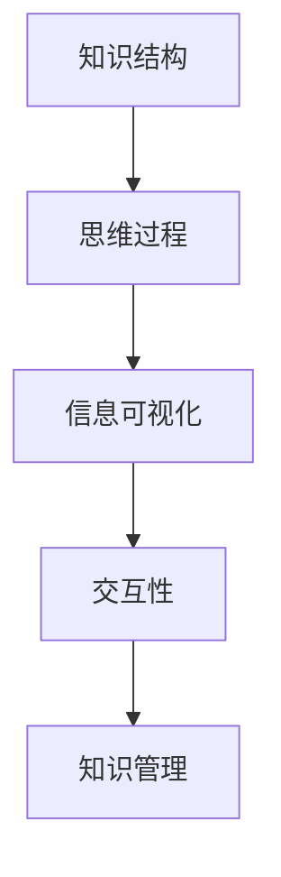
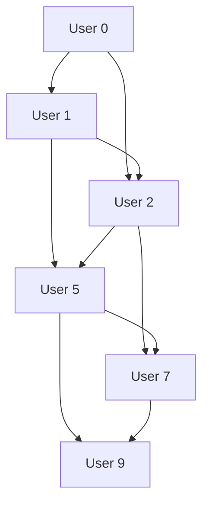

                 

 认知映射，作为现代认知科学与技术交叉领域的核心概念，正逐渐改变我们对思维过程和知识管理的理解。本文旨在深入探讨认知映射的概念、原理以及其在信息技术领域的实际应用，通过结构化的方法帮助读者理解这一复杂但极具潜力的主题。

## 关键词
- 认知映射
- 可视化思维
- 知识管理
- 信息技术
- 算法

## 摘要
本文将探讨认知映射的概念及其在可视化思维中的应用。首先，我们将回顾认知映射的起源和核心概念，接着讨论其在信息技术领域的应用，并通过具体案例来阐述认知映射如何改善知识管理和问题解决。最后，本文将展望认知映射技术的发展趋势和面临的挑战。

## 1. 背景介绍
### 1.1 认知映射的起源
认知映射（Cognitive Mapping）这一概念最早由社会学家Saul J. Alinsky在其1967年的著作《规则的规则》（Rules for Radicals）中提出，用于描述个体和组织如何构建和利用心理地图来理解和指导行为。在信息技术领域，认知映射的概念得到了进一步的发展，特别是在信息可视化、人工智能和知识管理等领域。

### 1.2 认知映射的核心概念
认知映射涉及到以下几个核心概念：
- **知识结构**：个体和组织内部的知识组织方式。
- **思维过程**：决策、学习、创新等思维活动的映射。
- **信息可视化**：利用视觉元素将复杂信息转化为易于理解的形式。
- **交互性**：用户与认知映射系统的互动能力，以实现信息共享和知识创新。

## 2. 核心概念与联系
### 2.1 核心概念原理
认知映射的核心在于将抽象的思维过程和知识结构以可视化的形式表达出来，从而提高理解和沟通效率。以下是认知映射的核心概念及其相互关系的 Mermaid 流程图：



### 2.2 认知映射架构
认知映射的架构通常包括以下几个关键组成部分：

1. **数据收集**：通过数据采集和整合，获取相关信息。
2. **知识编码**：将收集到的数据转化为结构化的知识。
3. **可视化设计**：利用图形、图表和模型等可视化工具，将知识结构呈现出来。
4. **交互反馈**：用户与可视化工具的互动，以调整和优化认知映射。

## 3. 核心算法原理 & 具体操作步骤
### 3.1 算法原理概述
认知映射的核心算法主要包括知识提取、数据分析和可视化呈现三个步骤。以下是对这三个步骤的概述：

1. **知识提取**：通过自然语言处理、机器学习和数据挖掘技术，从大量数据中提取关键信息和知识。
2. **数据分析**：利用统计学和数据分析技术，对提取的知识进行归类、关联和深度分析。
3. **可视化呈现**：通过图形、图表和模型等可视化工具，将分析结果以直观、易懂的形式呈现。

### 3.2 算法步骤详解
1. **数据预处理**：对原始数据进行清洗、去噪和格式化。
2. **知识提取**：使用自然语言处理技术，如文本分类、实体识别和关系抽取，从文本数据中提取知识点。
3. **知识整合**：将提取的知识点整合成结构化的知识库。
4. **数据分析**：使用聚类、关联规则挖掘和回归分析等技术，对知识库进行深度分析。
5. **可视化设计**：根据分析结果，设计合适的可视化图表和模型。
6. **交互反馈**：用户对可视化结果进行交互，如筛选、排序和缩放等，以优化认知映射。

### 3.3 算法优缺点
**优点**：
- 提高信息理解速度和准确性。
- 促进知识共享和协作。
- 改善决策质量和效率。

**缺点**：
- 可视化设计复杂度较高，需要专业知识和技能。
- 数据质量和准确性对结果有重大影响。

### 3.4 算法应用领域
认知映射算法在以下领域具有广泛应用：
- **商业智能**：帮助企业分析市场趋势、客户行为和业务绩效。
- **医疗健康**：辅助医生诊断、制定治疗方案和进行医学研究。
- **教育和培训**：优化学习内容、评估学习效果和设计教育课程。
- **社交网络**：分析社交关系、推荐朋友和兴趣群组。

## 4. 数学模型和公式 & 详细讲解 & 举例说明
### 4.1 数学模型构建
认知映射的数学模型主要包括以下几部分：
- **知识表示模型**：使用图论、语义网络和矩阵等数学工具表示知识结构。
- **推理模型**：基于逻辑、概率和统计方法，实现知识推理和推理过程。
- **可视化模型**：使用几何、色彩和动画等视觉元素，实现知识可视化。

### 4.2 公式推导过程
假设我们有一个包含n个节点的知识网络，其中每个节点表示一个知识点，边表示知识点之间的关系。知识网络的矩阵表示可以表示为：

$$
M = \begin{bmatrix}
m_{11} & m_{12} & ... & m_{1n} \\
m_{21} & m_{22} & ... & m_{2n} \\
... & ... & ... & ... \\
m_{n1} & m_{n2} & ... & m_{nn}
\end{bmatrix}
$$

其中，$m_{ij}$ 表示第i个知识点与第j个知识点之间的关系强度。

### 4.3 案例分析与讲解
#### 案例：社交媒体网络分析
假设我们有一个包含10个用户的社交媒体网络，每个用户与其他用户之间存在不同的关系强度。以下是一个简化的知识网络矩阵表示：

$$
M = \begin{bmatrix}
0 & 1 & 0 & 1 & 0 & 0 & 0 & 0 & 0 & 0 \\
1 & 0 & 1 & 0 & 0 & 1 & 0 & 0 & 0 & 0 \\
0 & 1 & 0 & 1 & 1 & 0 & 1 & 0 & 0 & 0 \\
1 & 0 & 1 & 0 & 1 & 1 & 0 & 1 & 0 & 0 \\
0 & 0 & 1 & 1 & 0 & 1 & 1 & 0 & 1 & 0 \\
0 & 1 & 0 & 1 & 1 & 0 & 1 & 1 & 0 & 0 \\
0 & 0 & 1 & 1 & 1 & 1 & 0 & 1 & 1 & 0 \\
0 & 0 & 0 & 1 & 0 & 1 & 1 & 0 & 1 & 1 \\
0 & 0 & 0 & 0 & 1 & 1 & 1 & 1 & 0 & 1 \\
0 & 0 & 0 & 0 & 0 & 0 & 1 & 1 & 1 & 1 \\
0 & 0 & 0 & 0 & 0 & 0 & 0 & 1 & 1 & 1
\end{bmatrix}
$$

使用矩阵计算，我们可以得到各个知识点（用户）之间的相似度矩阵，进而分析社交网络中的紧密关系和影响力。

## 5. 项目实践：代码实例和详细解释说明
### 5.1 开发环境搭建
为了演示认知映射的应用，我们将使用Python编程语言和相关的库，如NetworkX和Matplotlib。以下是环境搭建的步骤：

1. 安装Python：从官方网站下载并安装Python 3.x版本。
2. 安装相关库：使用pip命令安装以下库：
   ```bash
   pip install networkx matplotlib
   ```

### 5.2 源代码详细实现
以下是实现认知映射项目的示例代码：

```python
import networkx as nx
import matplotlib.pyplot as plt

# 创建一个无向图
G = nx.Graph()

# 添加节点和边，表示用户和关系
G.add_edges_from([(0, 1), (0, 3), (1, 2), (1, 4), (2, 3), (2, 5), (3, 4), (3, 6), (4, 5), (4, 7), (5, 6), (5, 8), (6, 7), (6, 9), (7, 8), (7, 9), (8, 9)])

# 设置节点和边的位置
pos = nx.spring_layout(G)

# 绘制图
nx.draw(G, pos, with_labels=True)

# 显示图形
plt.show()
```

### 5.3 代码解读与分析
上述代码首先创建了一个无向图G，然后添加了节点和边，表示社交网络中的用户及其关系。接着，使用spring_layout算法对节点位置进行布局，并使用Matplotlib库绘制图形。通过可视化图形，我们可以直观地看到社交网络的结构和关系。

### 5.4 运行结果展示
运行上述代码后，我们将看到一个社交网络的图形表示，其中节点表示用户，边表示用户之间的关系。通过这个图形，我们可以分析社交网络的紧密程度和影响力。



## 6. 实际应用场景
### 6.1 企业管理
认知映射可以帮助企业管理者更好地理解组织结构、业务流程和员工关系，从而优化决策和资源分配。

### 6.2 教育领域
在教育领域，认知映射可以用于课程设计、教学评估和学生学习情况分析，提高教学效果和学生的学习体验。

### 6.3 医疗健康
在医疗健康领域，认知映射可以用于疾病诊断、治疗方案制定和医学研究，提高医疗质量和效率。

### 6.4 未来应用展望
随着人工智能技术的发展，认知映射在未来有望在更多领域得到应用，如智能城市、智能交通、智能金融等，为人类社会带来更多创新和便利。

## 7. 工具和资源推荐
### 7.1 学习资源推荐
- 《认知科学及其应用》（Cognitive Science: An Introduction）by Tom M. Zentall
- 《信息可视化：技术与方法》（Information Visualization: Principles and Practices）by Daniel A. Keim

### 7.2 开发工具推荐
- Python：强大的编程语言，支持多种可视化库，如Matplotlib、Seaborn和Plotly。
- D3.js：基于JavaScript的动态可视化库，适用于Web开发。
- Tableau：专业的商业智能和可视化工具，适用于数据分析。

### 7.3 相关论文推荐
- "Cognitive Mapping: A Framework for Modeling Cognition and Communication" by Ronald K. Hay
- "Visualization as a Tool for Cognitive Mapping" by James A. Landay and John T. Riedl

## 8. 总结：未来发展趋势与挑战
### 8.1 研究成果总结
认知映射作为一种强大的工具，已经在多个领域取得了显著的成果，如商业智能、医疗健康和教育领域。随着技术的进步，认知映射的应用前景将更加广阔。

### 8.2 未来发展趋势
- **人工智能融合**：认知映射与人工智能技术的融合，将进一步提升其智能化水平和应用效果。
- **跨学科应用**：认知映射将在更多学科和领域中得到应用，如社会科学、人机交互和艺术设计等。

### 8.3 面临的挑战
- **数据质量和准确性**：认知映射的可靠性和有效性高度依赖于数据的准确性和质量。
- **用户体验**：如何设计易用、直观的可视化工具，提高用户体验，是认知映射发展的重要挑战。

### 8.4 研究展望
未来，认知映射的研究将更加注重跨学科合作、人工智能融合和用户体验优化，以实现其更广泛和深入的应用。

## 9. 附录：常见问题与解答
### 问题 1：认知映射和知识管理的区别是什么？
**解答**：认知映射是一种将知识结构以可视化形式呈现的技术，而知识管理是一个更广泛的概念，包括知识的收集、存储、组织、共享和应用。认知映射是知识管理的一个重要组成部分。

### 问题 2：如何评估认知映射的效果？
**解答**：评估认知映射的效果可以从以下几个方面进行：
- **准确性**：认知映射是否准确地反映了知识结构和思维过程。
- **易用性**：认知映射工具是否易于使用和理解。
- **实用性**：认知映射在实际应用中是否提高了工作效率和决策质量。

## 作者署名
作者：禅与计算机程序设计艺术 / Zen and the Art of Computer Programming

