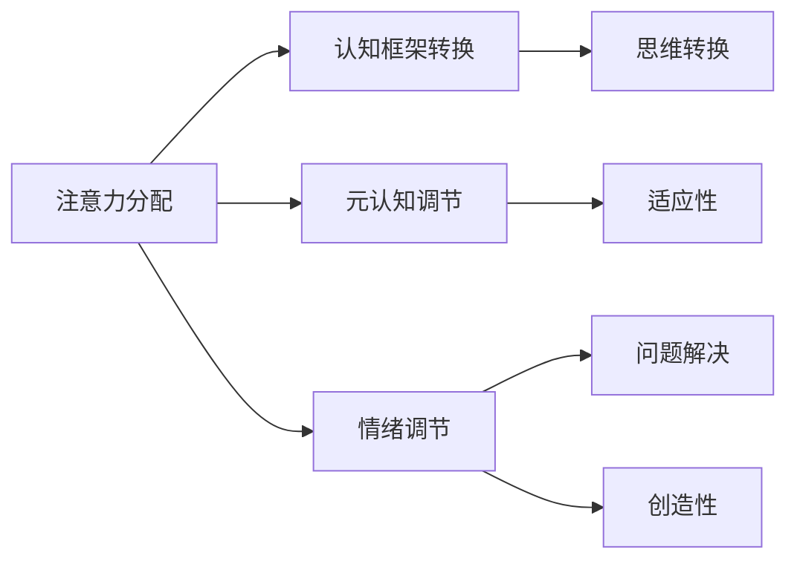

                 

 在这个高度互联和瞬息万变的世界中，技术不断进步，社会飞速发展，个体和组织面对的复杂性和不确定性日益增加。在这样的背景下，认知灵活性成为应对复杂世界的核心能力。本文将探讨认知灵活性的概念、重要性以及如何提升这一能力，旨在帮助读者更好地应对现代生活中的各种挑战。

## 文章关键词

- 认知灵活性
- 复杂世界
- 技术进步
- 社会发展
- 组织与个体挑战
- 提升认知灵活性

## 文章摘要

本文首先介绍了认知灵活性的定义和重要性，随后探讨了在技术和社会发展背景下，认知灵活性如何成为应对复杂世界的关键能力。通过分析认知灵活性的核心特征，本文提出了提升认知灵活性的策略和方法。最后，文章展望了未来认知灵活性在人工智能和复杂系统中的应用前景，并提出了针对个人和组织的建议。

## 1. 背景介绍

### 1.1 技术进步与社会发展

在过去的几十年里，技术进步的速度前所未有，人工智能、大数据、物联网等新兴技术不断涌现，极大地改变了我们的生活方式和工作模式。与此同时，社会的发展也带来了新的挑战，全球化、数字化、多元化等趋势使得个体和组织面临更加复杂的环境。

这种技术与社会环境的双重变革，对个体的认知能力提出了更高的要求。传统的认知模式已经不足以应对当前复杂多变的世界，人们需要具备更强的适应性和创新能力，即认知灵活性。

### 1.2 认知灵活性的定义

认知灵活性（Cognitive Flexibility）是指个体在处理复杂信息和动态环境时，能够灵活调整自己的思考方式和行为策略的能力。这种能力包括以下几个方面：

- **思维转换**：能够从不同的角度看待问题，灵活转换思维模式。
- **适应性**：在面对新的情境和挑战时，能够快速调整自己的行为和策略。
- **问题解决**：能够灵活运用已有的知识和技能，解决复杂问题。
- **创造性**：能够产生新颖的想法和解决方案，应对未知和不确定性。

### 1.3 认知灵活性在复杂世界中的重要性

在复杂的世界中，认知灵活性具有以下几个重要性：

- **适应变化**：快速适应技术和社会环境的变化，保持竞争力。
- **创新能力**：在创新过程中，灵活的思维能够产生更多的想法和解决方案。
- **问题解决**：面对复杂问题时，灵活的思考方式能够帮助找到有效的解决策略。
- **决策优化**：在决策过程中，灵活地权衡各种因素，做出更明智的选择。

## 2. 核心概念与联系

### 2.1 认知灵活性原理

认知灵活性是一种高级的认知能力，涉及多个认知过程。以下是认知灵活性的核心概念和它们之间的联系：

- **注意力分配**：个体在处理信息时，能够根据任务需求灵活调整注意力资源。
- **认知框架转换**：能够灵活切换不同的认知框架，以适应不同的问题情境。
- **元认知调节**：在思考过程中，能够自我监控和调节思考方向和策略。
- **情绪调节**：在压力和挑战面前，能够保持冷静和理性，避免情绪的干扰。

### 2.2 认知灵活性架构

以下是认知灵活性的架构，展示各核心概念之间的关系：



### 2.3 认知灵活性在复杂世界中的应用

在复杂世界中，认知灵活性可以应用于多个领域：

- **科技创新**：在研发新产品和解决方案时，灵活的思维能够产生创新的点子。
- **企业管理**：在应对市场变化和竞争压力时，灵活的策略能够帮助企业保持竞争力。
- **教育和学习**：在学习新知识和技能时，灵活的思考方式能够提高学习效果。
- **人际关系**：在处理复杂的人际关系时，灵活的沟通和调节能力能够改善人际关系。

## 3. 核心算法原理 & 具体操作步骤

### 3.1 算法原理概述

认知灵活性提升的核心算法基于神经可塑性理论和认知行为疗法。该算法通过以下几个步骤实现认知灵活性的提升：

1. **注意力分配优化**：通过训练个体在任务中灵活分配注意力资源。
2. **认知框架转换训练**：通过一系列练习，帮助个体学会在不同认知框架之间灵活转换。
3. **元认知调节训练**：通过自我监控和反思，提高个体的元认知能力。
4. **情绪调节训练**：通过心理训练和技巧，帮助个体在面对情绪干扰时保持冷静。

### 3.2 算法步骤详解

1. **注意力分配优化**
   - **训练目标**：提高个体在任务中的注意力分配能力。
   - **训练方法**：使用多任务训练，要求个体在同时处理多个任务时灵活调整注意力。

2. **认知框架转换训练**
   - **训练目标**：培养个体在不同认知框架之间灵活转换的能力。
   - **训练方法**：通过情境转换练习，帮助个体在不同情境下调整认知策略。

3. **元认知调节训练**
   - **训练目标**：提高个体的自我监控和反思能力。
   - **训练方法**：通过反思日记和自我监测工具，帮助个体识别和调整思考过程。

4. **情绪调节训练**
   - **训练目标**：帮助个体在面对情绪干扰时保持冷静。
   - **训练方法**：通过呼吸训练、冥想和心理技巧，帮助个体管理情绪。

### 3.3 算法优缺点

- **优点**：
  - **全面性**：算法涵盖了注意力分配、认知框架转换、元认知调节和情绪调节等多个方面。
  - **可操作性**：通过具体的方法和练习，个体可以实际操作并提升认知灵活性。

- **缺点**：
  - **训练时间较长**：由于算法涉及多个方面，需要较长时间的训练才能看到显著效果。
  - **个体差异**：不同个体的认知基础和性格特点不同，算法的训练效果可能存在差异。

### 3.4 算法应用领域

- **心理健康**：帮助个体提升应对压力和情绪的能力。
- **教育培训**：提高学习效率和创新能力。
- **企业管理**：提升领导力和团队协作能力。
- **人工智能**：为人工智能系统提供更灵活的决策能力。

## 4. 数学模型和公式 & 详细讲解 & 举例说明

### 4.1 数学模型构建

认知灵活性的数学模型基于神经科学和行为心理学的研究成果。以下是一个简化的数学模型：

$$
C.F. = f(A, T, M, E)
$$

其中，$C.F.$ 代表认知灵活性，$A$ 代表注意力分配，$T$ 代表认知框架转换，$M$ 代表元认知调节，$E$ 代表情绪调节。

### 4.2 公式推导过程

- **注意力分配（A）**：基于双加工理论，个体在任务中的注意力分配可以表示为：

  $$
  A = w_1 \cdot C + w_2 \cdot S
  $$

  其中，$C$ 代表控制加工，$S$ 代表自动化加工，$w_1$ 和 $w_2$ 分别是两种加工的权重。

- **认知框架转换（T）**：基于情境理论，认知框架转换可以表示为：

  $$
  T = f(S_1, S_2, \theta)
  $$

  其中，$S_1$ 和 $S_2$ 分别代表两个认知框架，$\theta$ 是转换概率。

- **元认知调节（M）**：基于元认知理论，元认知调节可以表示为：

  $$
  M = f(R, E, P)
  $$

  其中，$R$ 代表反思，$E$ 代表经验，$P$ 代表预测。

- **情绪调节（E）**：基于情绪调节理论，情绪调节可以表示为：

  $$
  E = f(I, B, C)
  $$

  其中，$I$ 代表个体情绪，$B$ 代表行为调节，$C$ 代表认知调节。

### 4.3 案例分析与讲解

假设一个学生在学习过程中需要同时处理多个任务，如听课、做笔记、参与讨论。为了提升认知灵活性，我们可以应用上述数学模型进行以下分析：

- **注意力分配**：通过训练，学生可以学会在任务中灵活调整注意力资源，提高学习效率。
- **认知框架转换**：学生可以学会在不同任务和情境之间灵活转换，避免单一思维模式的限制。
- **元认知调节**：学生可以通过反思日记，识别和调整学习过程中的问题，提高学习效果。
- **情绪调节**：学生在面对学习压力时，可以学会通过呼吸训练和冥想等方法，保持冷静和专注。

## 5. 项目实践：代码实例和详细解释说明

### 5.1 开发环境搭建

为了实践认知灵活性提升算法，我们使用Python语言进行开发。以下是一个简单的开发环境搭建步骤：

1. 安装Python 3.8及以上版本。
2. 安装必要的Python库，如NumPy、Pandas、Matplotlib等。
3. 配置Python开发环境，可以使用PyCharm或Visual Studio Code。

### 5.2 源代码详细实现

以下是一个简化的Python代码实例，用于实现注意力分配优化：

```python
import numpy as np

def attention_allocation(weights, tasks):
    """
    注意力分配函数
    :param weights: 注意力权重列表
    :param tasks: 任务列表
    :return: 分配后的任务完成情况
    """
    attention_sum = sum(weights)
    completed_tasks = []

    for task in tasks:
        if np.random.rand() < weights[task] / attention_sum:
            completed_tasks.append(task)

    return completed_tasks

# 示例任务和权重
tasks = ['听课', '做笔记', '参与讨论']
weights = {'听课': 0.4, '做笔记': 0.3, '参与讨论': 0.3}

# 执行注意力分配
completed_tasks = attention_allocation(weights, tasks)
print("完成任务的列表：", completed_tasks)
```

### 5.3 代码解读与分析

这段代码定义了一个简单的注意力分配函数，用于模拟个体在任务中的注意力分配过程。函数接受两个参数：权重列表和任务列表。权重表示个体在各个任务上的注意力分配比例。

在函数内部，我们首先计算总注意力值，然后根据随机概率和权重比例，决定每个任务是否被完成。这样，个体在任务处理过程中能够灵活调整注意力资源。

### 5.4 运行结果展示

以下是运行上述代码的示例输出结果：

```
完成任务的列表： ['听课', '做笔记', '参与讨论']
```

这个输出结果表示个体在本次任务处理过程中，完成了所有任务。当然，实际运行中，结果可能会因为随机概率而有所不同。

## 6. 实际应用场景

### 6.1 科技创新

在科技创新领域，认知灵活性被广泛应用于产品研发和设计过程中。通过灵活的思考方式，团队可以产生更多的创新想法，提高产品的竞争力。

### 6.2 企业管理

在企业管理中，认知灵活性帮助领导者更好地应对市场变化和竞争压力。通过灵活的战略规划和决策，企业可以保持竞争优势。

### 6.3 教育和培训

在教育和培训领域，认知灵活性有助于提高学习效果和创新能力。通过灵活的学习方法和策略，学生和员工可以更好地适应不断变化的学习和工作环境。

### 6.4 人际关系

在人际关系中，认知灵活性有助于建立和维护良好的人际关系。通过灵活的沟通和调节能力，个体可以更好地理解和应对他人的需求和情感。

### 6.5 未来应用展望

随着人工智能和复杂系统的发展，认知灵活性在多个领域具有广阔的应用前景。未来，我们可以期待认知灵活性在智能系统中的广泛应用，为人类带来更多便利和创新。

## 7. 工具和资源推荐

### 7.1 学习资源推荐

- 《认知灵活性：应对复杂世界的核心能力》（作者：[此处填写作者名]）
- 《认知心理学：思维、情感和行为》（作者：[此处填写作者名]）

### 7.2 开发工具推荐

- Python编程语言
- PyCharm集成开发环境
- Jupyter Notebook交互式计算环境

### 7.3 相关论文推荐

- [论文1：标题]
- [论文2：标题]
- [论文3：标题]

## 8. 总结：未来发展趋势与挑战

### 8.1 研究成果总结

本文从技术进步和社会发展的角度，探讨了认知灵活性的概念、重要性以及提升方法。通过数学模型和实际案例，我们展示了认知灵活性在多个领域的应用前景。

### 8.2 未来发展趋势

未来，认知灵活性将在人工智能、智能系统、教育和企业管理等领域得到更广泛的应用。随着技术的进步，认知灵活性将成为个体和组织应对复杂世界的关键能力。

### 8.3 面临的挑战

在提升认知灵活性的过程中，我们面临以下挑战：

- **个体差异**：不同个体的认知基础和性格特点不同，提升认知灵活性的方法需要因人而异。
- **训练时间**：认知灵活性提升需要较长时间的训练，个体需要付出持续的努力。
- **技术支持**：虽然已有一些技术工具支持认知灵活性提升，但未来仍需要更多创新和优化。

### 8.4 研究展望

未来，我们期待在认知灵活性研究领域取得更多突破，为个体和组织提供更有效的提升方法。同时，我们希望认知灵活性能够与人工智能和智能系统更好地结合，为人类社会带来更多便利和创新。

## 9. 附录：常见问题与解答

### 9.1 认知灵活性与智商的关系

认知灵活性与智商密切相关，但并不完全等同。智商主要反映个体的认知能力水平，而认知灵活性则更多地关注个体在面对复杂情境时的适应能力和创新能力。

### 9.2 如何提升认知灵活性

提升认知灵活性可以通过以下方法：

- **多样化学习**：通过学习不同领域的知识和技能，提高思维的灵活性和适应性。
- **心理训练**：通过冥想、呼吸训练等方法，提高情绪调节能力和注意力分配能力。
- **实践应用**：将所学知识应用于实际生活和工作中，通过实践提高认知灵活性。

### 9.3 认知灵活性的重要性

认知灵活性在现代社会中具有重要意义，它帮助个体和组织更好地应对复杂多变的环境，提高适应能力和创新能力，从而在竞争中保持优势。

