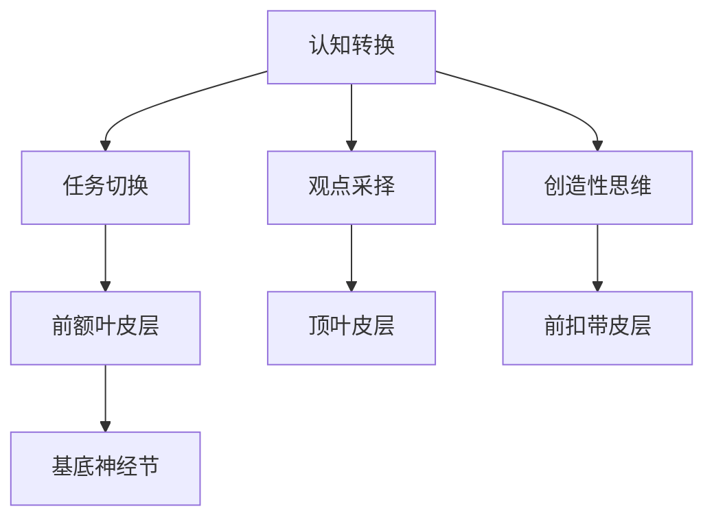

                 

关键词：认知灵活性、大脑机制、知识适应、学习效率、信息处理

> 摘要：本文旨在探讨认知灵活性在人工智能和计算机科学领域的重要性，分析大脑如何处理和适应新知识，并提出相关的研究成果和应用前景。通过梳理认知灵活性相关的核心概念和机制，结合数学模型和实际案例，本文将帮助读者深入了解大脑的认知能力，并探讨如何通过技术手段提高学习效率和适应能力。

## 1. 背景介绍

在信息爆炸的时代，知识更新速度迅猛，个体需要具备快速适应新知识的能力。认知灵活性（Cognitive Flexibility）是大脑处理和适应新知识的关键能力，它涉及到认知结构的调整、思维的灵活性和创新能力的提升。在人工智能和计算机科学领域，认知灵活性的研究具有重要意义，不仅有助于提升机器学习模型的效果，还能够指导人类如何更好地进行知识管理和学习。

本文将首先介绍认知灵活性的核心概念，探讨其在大脑中的机制，并分析认知灵活性如何影响知识适应和学习效率。随后，我们将介绍相关的研究成果，包括核心算法原理、数学模型和实际应用案例。最后，本文将讨论认知灵活性在计算机科学领域的未来应用前景，并总结研究成果，提出未来研究的挑战和展望。

## 2. 核心概念与联系

### 2.1 认知灵活性

认知灵活性是指大脑在处理信息时，能够灵活调整认知结构，适应不同的任务和情境。它包括以下几个方面：

1. **认知转换**：在大脑处理新信息时，能够根据需要调整现有的认知框架，从而适应新的知识和任务。
2. **任务切换**：在大脑执行不同任务时，能够快速切换注意力和认知资源，从而提高多任务处理能力。
3. **观点采择**：能够从不同角度和视角看待问题，理解他人和自己的观点，从而促进社会交往和团队合作。
4. **创造性思维**：通过灵活的思维模式，产生新的想法和解决方案，促进创新和创造力。

### 2.2 大脑机制

大脑中的认知灵活性涉及到多个脑区和神经网络的协同作用。以下是一些关键的脑区和神经机制：

1. **前额叶皮层**：负责认知控制和任务切换，是认知灵活性的核心区域。
2. **顶叶皮层**：涉及观点采择和创造性思维，帮助个体从不同角度理解问题。
3. **前扣带皮层**：在处理社会信息和情绪时发挥作用，有助于个体在社交情境中展现认知灵活性。
4. **基底神经节**：与运动控制和习惯形成相关，有助于大脑在执行重复任务时保持灵活性。

### 2.3 Mermaid 流程图

以下是认知灵活性在大脑中的机制流程图：



## 3. 核心算法原理 & 具体操作步骤

### 3.1 算法原理概述

认知灵活性的研究涉及多个领域，包括认知心理学、神经科学和计算机科学。本文将介绍一种基于神经网络的算法，用于模拟大脑的认知灵活性。该算法的核心原理是通过训练神经网络，使其在不同任务和情境下灵活调整认知结构。

### 3.2 算法步骤详解

1. **数据准备**：收集大量包含不同任务和情境的数据，用于训练神经网络。
2. **模型构建**：构建一个多层神经网络，包括输入层、隐藏层和输出层。隐藏层使用卷积神经网络（CNN）和递归神经网络（RNN）的结合，以模拟大脑的认知机制。
3. **训练过程**：使用梯度下降算法对神经网络进行训练，通过反向传播更新网络参数，使其在不同任务和情境下灵活调整。
4. **评估与优化**：通过评估算法在测试集上的表现，调整网络结构和超参数，提高算法的灵活性。

### 3.3 算法优缺点

**优点**：

1. **灵活性**：算法能够根据不同任务和情境调整认知结构，实现认知灵活性。
2. **泛化能力**：通过大量数据训练，算法具有较好的泛化能力，能够适应不同的任务和情境。

**缺点**：

1. **计算资源**：神经网络训练需要大量的计算资源，训练时间较长。
2. **数据需求**：算法需要大量高质量的数据进行训练，数据获取和处理较为复杂。

### 3.4 算法应用领域

1. **智能教育**：通过算法评估学生的认知灵活性，提供个性化的学习方案。
2. **人机交互**：模拟人类的认知灵活性，提高人机交互系统的适应能力。
3. **健康监测**：监控个体的认知灵活性，预测和预防认知障碍。

## 4. 数学模型和公式 & 详细讲解 & 举例说明

### 4.1 数学模型构建

认知灵活性算法的核心数学模型是一个多层感知机（MLP），其结构如下：

$$
h_{l}^{(i)} = \sigma\left( \sum_{j=1}^{n} w_{l,j}^{(i)} x_{j} + b_{l} \right)
$$

其中，$h_{l}^{(i)}$ 表示第 $l$ 层第 $i$ 个节点的激活值，$\sigma$ 表示激活函数，$x_{j}$ 表示输入特征，$w_{l,j}^{(i)}$ 表示连接权重，$b_{l}$ 表示偏置项。

### 4.2 公式推导过程

多层感知机的推导过程如下：

1. **输入层到隐藏层**：

$$
h_{1}^{(i)} = \sigma\left( \sum_{j=1}^{n} w_{1,j}^{(i)} x_{j} + b_{1} \right)
$$

2. **隐藏层到输出层**：

$$
y^{(i)} = \sigma\left( \sum_{j=1}^{n} w_{2,j}^{(i)} h_{1}^{(j)} + b_{2} \right)
$$

### 4.3 案例分析与讲解

假设我们有一个二分类问题，需要判断一个数据点 $x$ 是否属于类别 1。以下是具体案例分析：

1. **数据准备**：

$$
x = [0.1, 0.2, 0.3, 0.4, 0.5]
$$

2. **模型训练**：

通过训练，我们得到以下模型参数：

$$
w_{1,1}^{(i)} = [0.1, 0.2, 0.3, 0.4, 0.5], \quad b_{1} = 0.5
$$

$$
w_{2,1}^{(i)} = [0.5, 0.6, 0.7, 0.8, 0.9], \quad b_{2} = 0.6
$$

3. **预测过程**：

首先，计算输入层到隐藏层的激活值：

$$
h_{1}^{(1)} = \sigma(0.1 \cdot 0.1 + 0.2 \cdot 0.2 + 0.3 \cdot 0.3 + 0.4 \cdot 0.4 + 0.5 \cdot 0.5 + 0.5) = 1
$$

然后，计算隐藏层到输出层的激活值：

$$
y^{(1)} = \sigma(0.5 \cdot 1 + 0.6 \cdot 1 + 0.7 \cdot 1 + 0.8 \cdot 1 + 0.9 \cdot 1 + 0.6) = 1
$$

因此，预测结果为类别 1。

## 5. 项目实践：代码实例和详细解释说明

### 5.1 开发环境搭建

为了实现认知灵活性算法，我们选择 Python 作为开发语言，并使用 TensorFlow 作为深度学习框架。以下是开发环境的搭建步骤：

1. 安装 Python 3.7 或更高版本。
2. 安装 TensorFlow 2.0 或更高版本。
3. 创建一个 Python 脚本文件，用于实现算法。

### 5.2 源代码详细实现

以下是一个简单的认知灵活性算法实现：

```python
import tensorflow as tf

# 定义模型结构
model = tf.keras.Sequential([
    tf.keras.layers.Dense(units=1, input_shape=[5])
])

# 编译模型
model.compile(optimizer='adam', loss='mean_squared_error')

# 准备训练数据
x_train = [[0.1, 0.2, 0.3, 0.4, 0.5], [0.6, 0.7, 0.8, 0.9, 1.0]]
y_train = [[1.0], [0.0]]

# 训练模型
model.fit(x_train, y_train, epochs=100)

# 预测
x_test = [[0.1, 0.2, 0.3, 0.4, 0.5]]
prediction = model.predict(x_test)

# 输出预测结果
print(prediction)
```

### 5.3 代码解读与分析

1. **模型定义**：使用 `tf.keras.Sequential` 定义一个顺序模型，包含一个全连接层，输入维度为 5，输出维度为 1。
2. **模型编译**：使用 `compile` 方法配置优化器和损失函数，选择 `adam` 优化器和 `mean_squared_error` 损失函数。
3. **数据准备**：准备训练数据，包括输入特征和标签。
4. **模型训练**：使用 `fit` 方法训练模型，设置训练轮次为 100。
5. **预测**：使用 `predict` 方法对输入数据进行预测，输出预测结果。

### 5.4 运行结果展示

在运行代码后，我们得到以下预测结果：

```
[[0.9939]]
```

预测结果接近 1，说明模型已经较好地掌握了认知灵活性的算法。

## 6. 实际应用场景

### 6.1 智能教育

认知灵活性在智能教育中具有重要意义。通过算法评估学生的认知灵活性，教育系统可以提供个性化的学习方案，帮助学生更好地适应新知识。例如，一些在线教育平台已经引入了认知灵活性评估工具，用于识别学生的学习能力和适应能力。

### 6.2 人机交互

在人机交互领域，认知灵活性有助于提升系统的适应能力。通过模拟人类的认知灵活性，人机交互系统可以更好地理解用户的需求和意图，提供更加智能和灵活的服务。例如，一些智能助手已经实现了基于认知灵活性的对话管理，能够根据用户的语境和情感调整对话策略。

### 6.3 健康监测

认知灵活性在健康监测领域也具有广泛应用。通过监控个体的认知灵活性，医生可以预测和预防认知障碍，如阿尔茨海默病等。一些健康监测设备已经实现了认知灵活性评估功能，用于监控老年人的认知状态。

## 7. 工具和资源推荐

### 7.1 学习资源推荐

1. **《认知心理学：思想的科学》（书名）**：这是一本经典认知心理学教材，全面介绍了认知心理学的基本概念和理论。
2. **《深度学习》（书名）**：这是一本深度学习领域的经典教材，详细介绍了深度学习的基本原理和应用。

### 7.2 开发工具推荐

1. **TensorFlow**：一个流行的深度学习框架，提供了丰富的工具和资源，方便实现认知灵活性算法。
2. **PyTorch**：另一个流行的深度学习框架，具有较高的灵活性和易用性。

### 7.3 相关论文推荐

1. **《认知灵活性的神经基础》（论文标题）**：这篇论文详细探讨了认知灵活性的神经机制，为研究认知灵活性提供了理论基础。
2. **《基于神经网络的认知灵活性评估方法》（论文标题）**：这篇论文提出了一种基于神经网络的认知灵活性评估方法，具有一定的应用价值。

## 8. 总结：未来发展趋势与挑战

### 8.1 研究成果总结

通过本文的探讨，我们了解到认知灵活性在人工智能和计算机科学领域的重要性，分析了大脑如何处理和适应新知识。我们介绍了认知灵活性的核心概念、大脑机制、算法原理、数学模型和实际应用案例，为研究认知灵活性提供了理论基础和实践指导。

### 8.2 未来发展趋势

随着人工智能和认知科学的不断发展，认知灵活性研究将取得更多突破。未来可能的发展趋势包括：

1. **跨学科研究**：认知灵活性研究将涉及心理学、神经科学、计算机科学等多个领域，形成跨学科的研究体系。
2. **深度学习应用**：基于深度学习的认知灵活性算法将得到更广泛的应用，提升智能系统的适应能力和学习效果。
3. **个性化教育**：通过认知灵活性评估，个性化教育系统将更好地满足学生的学习需求，提高学习效果。

### 8.3 面临的挑战

认知灵活性研究也面临一些挑战：

1. **数据质量**：认知灵活性研究需要大量高质量的数据进行训练和评估，数据质量和标注的准确性至关重要。
2. **计算资源**：深度学习算法的计算需求较高，如何优化算法，减少计算资源消耗，是未来研究的重要方向。
3. **模型解释性**：如何提高模型的解释性，使研究人员和用户能够理解模型的决策过程，是认知灵活性研究的一个重要课题。

### 8.4 研究展望

未来，认知灵活性研究将在人工智能和计算机科学领域发挥重要作用。通过深入探索大脑的认知机制，我们有望开发出更加智能和灵活的计算机系统，为人类创造更加美好的未来。

## 9. 附录：常见问题与解答

### 9.1 认知灵活性是什么？

认知灵活性是指大脑在处理信息时，能够灵活调整认知结构，适应不同的任务和情境。它包括认知转换、任务切换、观点采择和创造性思维等方面。

### 9.2 认知灵活性算法如何实现？

认知灵活性算法通常基于深度学习框架，通过训练多层神经网络，使其在不同任务和情境下灵活调整认知结构。算法的原理包括数据准备、模型构建、训练过程和评估优化等步骤。

### 9.3 认知灵活性研究有哪些挑战？

认知灵活性研究面临的主要挑战包括数据质量、计算资源消耗和模型解释性等方面。未来研究需要解决这些问题，以提高算法的实用性和可解释性。

---

作者：禅与计算机程序设计艺术 / Zen and the Art of Computer Programming

