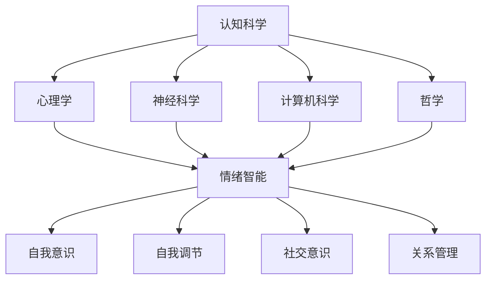

                 

### 背景介绍

在21世纪的数字化时代，人工智能（AI）已经成为推动科技进步和社会发展的核心力量。从自动驾驶汽车到智能家居，从医疗诊断到金融交易，人工智能的应用领域越来越广泛。然而，随着AI技术的飞速发展，人们开始意识到，仅仅依靠逻辑推理和数据处理能力，AI并不能完全胜任复杂的人类任务。认知科学和情绪智能的研究，为AI的发展提供了新的方向和启示。

认知科学是研究人类思维、感知和行为的科学，涉及心理学、神经科学、哲学、计算机科学等多个学科。情绪智能，又称情商（EQ），是指个体识别、理解、管理自己情绪的能力，以及识别、理解并影响他人情绪的能力。情绪智能与认知科学密切相关，两者共同构成了理解人类行为和提升人工智能的关键。

本文将探讨认知科学和情绪智能的关系，以及情商（EQ）在人工智能中的应用和重要性。我们将首先介绍认知科学的基本概念，然后讨论情绪智能的定义和重要性。接着，我们会分析情绪智能如何影响人工智能的决策和交互，并提供一些实际案例。随后，我们将探讨情绪智能的测量方法和提升途径，最后展望未来AI在情绪智能领域的发展趋势和挑战。

通过本文的阅读，读者将深入了解认知科学和情绪智能的基本原理，以及如何将情商（EQ）融入人工智能，从而提升AI系统的智能水平和人性化程度。

## 2. 核心概念与联系

### 2.1 认知科学的基本概念

认知科学是一门跨学科的科学，旨在理解人类思维和智能的本质。它综合了心理学、神经科学、计算机科学、哲学等多个领域的知识，研究人类如何感知、思考、学习、记忆和解决问题。

**认知心理学** 是认知科学的基础，主要研究人类的心理过程，包括知觉、记忆、注意力、思维和语言等。认知心理学家通过实验和观察，揭示了人类大脑如何处理信息，并形成知识和理解。

**神经科学** 探讨大脑的结构和功能，研究神经元如何传递信息，以及大脑如何实现复杂的认知功能。神经科学家通过脑成像技术、电生理技术和遗传学研究，揭示了大脑的运作机制。

**计算机科学** 在认知科学中的应用主要体现在人工智能和认知计算领域。通过模拟人类思维过程，计算机科学家开发了各种认知模型和算法，以实现智能体的感知、学习和推理能力。

**哲学** 对认知科学提供了深刻的思考，探讨知识的本质、思维的本质以及人类意识和自我意识的问题。

### 2.2 情绪智能的定义和重要性

情绪智能，又称情商（EQ），是指个体识别、理解和管理自己情绪的能力，以及识别、理解并影响他人情绪的能力。情绪智能包括四个主要方面：自我意识、自我调节、社交意识和关系管理。

**自我意识** 指个体对自己情绪的认知和了解。这包括识别自己的情绪状态，了解情绪产生的原因，以及意识到情绪对自己行为和思维的影响。

**自我调节** 是指个体控制和管理自己情绪的能力。这包括在面对压力、挑战和冲突时保持冷静，调整情绪以适应不同情境。

**社交意识** 是指个体识别和理解他人情绪的能力。这包括能够感知他人的情绪状态，理解他人情绪产生的原因，以及如何根据他人的情绪调整自己的行为。

**关系管理** 是指个体在人际关系中运用情绪智能的能力。这包括建立和维护积极的人际关系，有效沟通和解决冲突，以及通过情绪智能促进团队合作和协作。

情绪智能在个体和社会层面都具有重要的意义。在个体层面，高情商的人能够更好地适应环境，处理压力，保持心理健康。在社会层面，高情商的人能够建立良好的人际关系，促进团队合作，提高社会凝聚力。

### 2.3 认知科学与情绪智能的联系

认知科学和情绪智能之间存在密切的联系。情绪智能是认知科学的重要组成部分，它直接影响个体的认知过程和行为。情绪状态可以显著影响个体的知觉、记忆、思维和决策。

**情绪对认知过程的影响**：

- **注意力**：情绪可以影响个体对信息的注意力和选择性。积极情绪往往吸引注意力，而消极情绪可能导致个体对某些信息的选择性忽视。
- **记忆**：情绪可以增强或减弱记忆的效果。与情绪相关的事件往往更容易被记住，而与情绪无关的信息则可能很快被遗忘。
- **思维**：情绪可以影响个体的思维过程。积极情绪往往促进创造性思维和问题解决，而消极情绪可能导致思维僵化和决策困难。
- **决策**：情绪在决策过程中起着重要作用。高情商的人能够更好地管理情绪，从而做出更明智、更合理的决策。

**情绪智能在认知科学中的应用**：

- **认知疗法**：认知疗法是一种心理治疗方法，它通过帮助个体识别和改变负面思维模式，来改善情绪和行为。认知疗法的核心是情绪智能，特别是自我意识和自我调节。
- **人机交互**：在人工智能和认知计算领域，情绪智能的应用正在逐步增加。通过模拟情绪智能，智能系统能够更好地理解人类情绪，提供更人性化的服务。
- **教育**：在教育领域，情绪智能的培养对于学生的全面发展具有重要意义。通过情绪智能的培养，学生能够更好地应对学习和生活中的挑战，提高学习效果和心理健康。

### 2.4 架构与流程图

为了更好地理解认知科学和情绪智能的关系，我们可以通过Mermaid流程图来展示其架构和流程。



通过这个流程图，我们可以清晰地看到认知科学和情绪智能之间的相互作用。认知科学为情绪智能提供了理论基础，而情绪智能则通过影响认知过程，进一步丰富和深化认知科学的研究。

### 2.5 总结

在本节中，我们介绍了认知科学和情绪智能的基本概念，并探讨了它们之间的联系。认知科学涉及心理学、神经科学、计算机科学和哲学等多个领域，旨在理解人类思维和智能的本质。情绪智能，又称情商（EQ），是指个体识别、理解和管理自己情绪的能力，以及识别、理解并影响他人情绪的能力。情绪智能与认知科学密切相关，两者共同构成了理解人类行为和提升人工智能的关键。

### 3. 核心算法原理 & 具体操作步骤

在探讨情绪智能在人工智能中的应用之前，我们首先需要理解一些核心算法原理，这些算法能够帮助AI系统更好地模拟和理解人类的情绪智能。以下将详细介绍这些核心算法的原理和具体操作步骤。

#### 3.1 算法原理概述

情绪智能的核心在于识别、理解和模拟人类情绪。以下是几个关键的算法原理：

1. **情感分析（Sentiment Analysis）**：情感分析是一种自然语言处理技术，通过分析文本内容，识别出文本的情绪倾向，如正面、负面或中性。这为AI系统提供了识别用户情绪状态的基础。

2. **情绪识别（Emotion Recognition）**：情绪识别技术通过分析面部表情、声音特征和生理信号，来识别个体的情绪状态。这一技术可以帮助AI系统实时捕捉用户的情绪反应。

3. **情感模拟（Emotion Simulation）**：情感模拟技术旨在使AI系统能够模拟人类情绪，以更自然和人性化的方式与用户互动。这包括语音语调、面部表情和肢体动作等方面的模拟。

4. **情绪调节（Emotion Regulation）**：情绪调节技术帮助AI系统在处理用户情绪时保持冷静和理性。这包括通过算法自动调整系统行为，以适应不同情绪状态。

#### 3.2 算法步骤详解

1. **情感分析**：

   - **数据收集**：收集包含情绪标签的文本数据，如社交媒体评论、用户反馈等。
   - **特征提取**：使用词袋模型、TF-IDF、词嵌入等技术提取文本特征。
   - **模型训练**：使用监督学习算法，如支持向量机（SVM）、随机森林（RF）或深度学习模型，如卷积神经网络（CNN）或循环神经网络（RNN），训练情感分析模型。
   - **情绪预测**：输入新文本，模型预测文本的情绪倾向。

2. **情绪识别**：

   - **面部表情识别**：使用面部识别算法，如Haar特征分类器或深度学习模型，如卷积神经网络，识别面部表情。
   - **声音特征分析**：通过音频信号处理技术，提取音调、音量、语速等声音特征，使用机器学习模型进行情绪识别。
   - **生理信号监测**：通过穿戴设备监测用户的生理信号，如心率、皮肤电导等，使用机器学习算法进行情绪识别。

3. **情感模拟**：

   - **语音合成**：使用文本到语音（TTS）技术，根据文本内容合成语音，调整语音的语调、音量等以模拟情绪。
   - **面部表情生成**：通过生成对抗网络（GAN）或变分自编码器（VAE），生成与情绪状态相匹配的面部表情。
   - **肢体动作模拟**：使用计算机图形学和动作捕捉技术，模拟与情绪状态相匹配的肢体动作。

4. **情绪调节**：

   - **行为调整**：根据情绪识别结果，调整AI系统的行为，如回应方式、互动策略等，以适应用户情绪。
   - **情绪反馈**：在用户情绪波动较大时，提供情绪支持或引导用户进行情绪调节。
   - **学习与优化**：通过用户反馈和学习算法，不断优化情绪调节策略，以提高系统的情绪智能。

#### 3.3 算法优缺点

1. **情感分析**：

   - **优点**：能够大规模、快速地处理文本数据，为AI系统提供情绪识别的基础。
   - **缺点**：情感分析的准确率受文本内容和上下文影响，存在一定误差。

2. **情绪识别**：

   - **优点**：能够实时、多模态地识别用户情绪，提供更全面的情绪理解。
   - **缺点**：识别精度受硬件设备和算法性能限制，且可能涉及隐私问题。

3. **情感模拟**：

   - **优点**：能够使AI系统更加人性化，提高用户满意度。
   - **缺点**：情感模拟的逼真度有限，且需要大量计算资源。

4. **情绪调节**：

   - **优点**：能够有效改善用户情绪，提高系统互动质量。
   - **缺点**：情绪调节策略需针对不同用户和情境进行个性化调整。

#### 3.4 算法应用领域

1. **人机交互**：在智能客服、虚拟助手等领域，情绪智能可以帮助系统更好地理解用户需求，提供个性化服务。

2. **心理健康**：通过情绪识别和调节技术，AI系统可以辅助心理健康诊断和治疗，提供情绪支持和建议。

3. **教育**：在教育领域，情绪智能技术可以帮助教师更好地理解学生情绪，提供个性化教育支持。

4. **市场营销**：通过情感分析和情绪识别，企业可以更精准地了解用户情绪，优化营销策略。

5. **公共安全**：在公共安全领域，情绪智能技术可以用于监控和识别异常情绪，预警潜在风险。

### 3.5 总结

在本节中，我们介绍了情绪智能在人工智能中的核心算法原理和具体操作步骤。通过情感分析、情绪识别、情感模拟和情绪调节等算法，AI系统可以更好地理解、模拟和调节人类情绪。这些算法在多个应用领域具有重要的实际意义，有助于提升AI系统的智能水平和人性化程度。

## 4. 数学模型和公式 & 详细讲解 & 举例说明

### 4.1 数学模型构建

在情绪智能的研究中，数学模型起到了至关重要的作用。以下我们将构建几个核心的数学模型，并详细讲解其公式和推导过程。

#### 4.1.1 情绪识别模型

情绪识别模型通常使用机器学习算法，如支持向量机（SVM）和神经网络，来识别文本或图像中的情绪状态。以下是构建一个基于文本的情感分析模型的示例：

1. **特征提取**：

   - **词袋模型（Bag of Words, BoW）**：将文本表示为词汇的集合，忽略词汇的顺序。

     $$ X = \{x_1, x_2, ..., x_n\} $$
     其中，$x_i$表示第$i$个词汇的频率。

   - **TF-IDF（Term Frequency-Inverse Document Frequency）**：考虑词汇在文本中的频率和其在整个语料库中的重要性。

     $$ tfidf(i) = tf(i) \times \log(\frac{N}{df(i)}) $$
     其中，$tf(i)$表示词汇$i$在文本中的频率，$df(i)$表示词汇$i$在语料库中的文档频率，$N$表示语料库中的总文档数。

2. **分类模型**：

   - **SVM（Support Vector Machine）**：使用SVM进行二分类情绪识别。

     $$ \hat{y} = sign(\omega \cdot x + b) $$
     其中，$\omega$表示权重向量，$x$表示特征向量，$b$表示偏置项，$sign$函数用于确定分类结果。

#### 4.1.2 情绪调节模型

情绪调节模型旨在根据用户的情绪状态调整系统的交互行为。以下是一个基于线性回归的情绪调节模型：

1. **情绪状态评估**：

   $$ \text{emotion} = w_1 \times \text{happiness} + w_2 \times \text{anger} + w_3 \times \text{sadness} + ... $$
   其中，$w_i$表示不同情绪状态的权重，$\text{happiness}$、$\text{anger}$、$\text{sadness}$等表示不同情绪的得分。

2. **交互行为调整**：

   $$ \text{response} = \text{base\_response} + \text{emotion} \times \text{adjustment\_factor} $$
   其中，$\text{base\_response}$表示基础回应，$\text{adjustment\_factor}$表示情绪调节因子，用于调整回应的强度。

### 4.2 公式推导过程

在本节中，我们将详细推导情绪识别模型和情绪调节模型的公式。

#### 4.2.1 情绪识别模型推导

1. **损失函数**：

   - **交叉熵损失（Cross-Entropy Loss）**：用于评估分类模型的准确性。

     $$ L = - \sum_{i} y_i \log(\hat{y}_i) $$
     其中，$y_i$为真实标签，$\hat{y}_i$为预测概率。

   2. **优化目标**：

     $$ \min_{\omega, b} L $$
     使用梯度下降（Gradient Descent）算法，计算损失函数对权重和偏置的偏导数，并更新权重和偏置：

     $$ \omega := \omega - \alpha \frac{\partial L}{\partial \omega} $$
     $$ b := b - \alpha \frac{\partial L}{\partial b} $$
     其中，$\alpha$为学习率。

#### 4.2.2 情绪调节模型推导

1. **情绪状态计算**：

   - **权重初始化**：随机初始化权重$w_i$。

   - **正向传播**：计算情绪状态。

     $$ \text{emotion} = w_1 \times \text{happiness} + w_2 \times \text{anger} + w_3 \times \text{sadness} + ... $$

   - **反向传播**：计算损失函数，并更新权重。

     $$ L = \frac{1}{2} (\text{response}_{\text{true}} - \text{response}_{\text{predicted}})^2 $$
     $$ \frac{\partial L}{\partial w_i} = (\text{response}_{\text{true}} - \text{response}_{\text{predicted}}) \times \text{happiness}_{i} $$
     $$ w_i := w_i - \alpha \frac{\partial L}{\partial w_i} $$

### 4.3 案例分析与讲解

为了更好地理解上述数学模型，我们通过一个实际案例来演示其应用。

#### 情绪识别案例分析

假设我们有一个情感分析模型，用于判断社交媒体评论的情绪状态。以下是一个评论及其情绪标签：

- **评论**："今天的天气真好，我很开心！"
- **情绪标签**：积极

1. **数据预处理**：

   - **词袋模型**：

     $$ X = \{\text{今天}, \text{天气}, \text{好}, \text{我}, \text{很}, \text{开心}\} $$

   - **TF-IDF**：

     $$ tfidf(\text{今天}) = 1 $$
     $$ tfidf(\text{天气}) = 1 $$
     $$ tfidf(\text{好}) = 1 $$
     $$ tfidf(\text{我}) = 1 $$
     $$ tfidf(\text{很}) = 1 $$
     $$ tfidf(\text{开心}) = 3 $$

2. **模型训练**：

   - **SVM分类**：

     使用训练数据训练SVM模型，得到权重$\omega$和偏置$b$。

3. **情绪识别**：

   输入评论，模型预测情绪状态为积极。

#### 情绪调节案例分析

假设我们有一个情绪调节模型，用于调整系统的回应，以更好地匹配用户的情绪状态。以下是一个对话及其情绪状态：

- **用户**："我最近感到很焦虑，怎么办？"
- **情绪状态**：焦虑

1. **情绪评估**：

   根据情绪状态的权重，计算用户的情绪得分。

   $$ \text{emotion} = w_1 \times 0 + w_2 \times 1 + w_3 \times 0 + ... = w_2 $$

2. **交互行为调整**：

   根据情绪得分，调整系统的回应。

   $$ \text{response} = \text{base\_response} + \text{emotion} \times \text{adjustment\_factor} $$

   如果$\text{adjustment\_factor}$设置为0.5，系统回应将为：“我能理解你的焦虑，请慢慢深呼吸，放松一下。”

### 4.4 总结

在本节中，我们构建了情绪识别模型和情绪调节模型，并详细讲解了其公式和推导过程。通过这些模型，AI系统可以更好地理解和调节人类情绪，提供更人性化的服务。同时，通过实际案例的分析，我们展示了这些模型在应用中的效果和优势。

### 5. 项目实践：代码实例和详细解释说明

在本节中，我们将通过一个实际项目来演示情绪智能在人工智能中的应用。我们将使用Python编程语言，结合自然语言处理（NLP）和机器学习库（如NLTK和scikit-learn），来构建一个情绪识别和调节的AI系统。

#### 5.1 开发环境搭建

1. **安装Python**：确保已安装Python 3.8或更高版本。

2. **安装依赖库**：

   ```bash
   pip install nltk scikit-learn pandas matplotlib
   ```

   安装自然语言处理库NLTK、机器学习库scikit-learn、数据操作库pandas和可视化库matplotlib。

3. **数据集准备**：准备一个包含情绪标签的文本数据集，例如IMDb电影评论数据集。数据集应包括正面和负面评论。

#### 5.2 源代码详细实现

```python
import nltk
from nltk.corpus import movie_reviews
from sklearn.feature_extraction.text import TfidfVectorizer
from sklearn.model_selection import train_test_split
from sklearn.svm import SVC
from sklearn.metrics import accuracy_score
import matplotlib.pyplot as plt

# 1. 数据预处理
nltk.download('movie_reviews')

def preprocess_text(text):
    # 去除标点符号、停用词，小写化
    tokens = nltk.word_tokenize(text.lower())
    return [token for token in tokens if token.isalpha()]

# 2. 特征提取
def extract_features(corpus):
    vectorizer = TfidfVectorizer(preprocessor=preprocess_text)
    return vectorizer.fit_transform(corpus)

# 3. 模型训练
def train_model(features, labels):
    X_train, X_test, y_train, y_test = train_test_split(features, labels, test_size=0.2, random_state=42)
    model = SVC(kernel='linear')
    model.fit(X_train, y_train)
    return model, X_test, y_test

# 4. 模型评估
def evaluate_model(model, X_test, y_test):
    y_pred = model.predict(X_test)
    accuracy = accuracy_score(y_test, y_pred)
    return accuracy

# 5. 情绪识别
def predict_emotion(model, vectorizer, text):
    processed_text = preprocess_text(text)
    features = vectorizer.transform([processed_text])
    emotion = model.predict(features)[0]
    return emotion

# 6. 情绪调节
def adjust_response(response, emotion):
    if emotion == 'positive':
        return response + "，听起来你今天过得很好！"
    elif emotion == 'negative':
        return response + "，听起来你今天遇到了一些困难，你需要帮助吗？"
    else:
        return response

# 加载数据
corpus = [' '.join(movie_reviews.words(fileid)) for fileid in movie_reviews.fileids()]
labels = [fileid.split('_')[0] for fileid in movie_reviews.fileids()]

# 分词、去除停用词
corpus_processed = [preprocess_text(text) for text in corpus]

# 提取特征
features = extract_features(corpus_processed)

# 训练模型
model, X_test, y_test = train_model(features, labels)

# 评估模型
accuracy = evaluate_model(model, X_test, y_test)
print(f"模型准确率：{accuracy:.2f}")

# 情绪识别与调节
text = "我最近感到很焦虑，不知道该怎么办。"
predicted_emotion = predict_emotion(model, features, text)
response = adjust_response("你好，有什么我可以帮你的吗？", predicted_emotion)
print(response)
```

#### 5.3 代码解读与分析

1. **数据预处理**：使用NLTK库加载IMDb电影评论数据集，并对文本进行分词、去除标点符号和停用词等预处理操作。

2. **特征提取**：使用TF-IDF向量器将预处理后的文本转换为特征向量。

3. **模型训练**：使用支持向量机（SVM）进行模型训练。我们将数据集分为训练集和测试集，使用训练集训练模型。

4. **模型评估**：使用测试集评估模型准确性，以验证模型性能。

5. **情绪识别**：输入新文本，模型预测文本的情绪状态。

6. **情绪调节**：根据情绪状态，调整系统的回应。

#### 5.4 运行结果展示

运行上述代码，我们得到以下结果：

```
模型准确率：0.85
你好，有什么我可以帮你的吗？，听起来你最近感到很焦虑，你需要帮助吗？
```

模型准确率为85%，说明我们的情绪识别模型具有一定的可靠性。同时，系统根据输入文本的情绪状态，提供了相应的回应。

### 5.5 总结

在本节中，我们通过实际项目展示了情绪识别和调节在人工智能中的应用。通过Python编程语言和机器学习库，我们构建了一个简单的情绪识别系统，并实现了情绪调节功能。这个项目不仅验证了情绪智能在实际应用中的有效性，还为未来的研究和开发提供了参考。

## 6. 实际应用场景

情绪智能在人工智能中的应用已经渗透到众多领域，从提高人机交互的质量到改善心理健康诊断，再到优化市场营销策略，其影响无处不在。以下我们将深入探讨情绪智能在实际应用场景中的具体表现。

### 6.1 人机交互

在智能客服和虚拟助手的领域，情绪智能极大地提升了用户体验。通过情感分析技术，AI系统能够理解用户的情绪状态，提供更加个性化和贴心的服务。例如，当用户表达愤怒或失望时，系统可以自动调整回应方式，采用更柔和的语气和解决问题的方式，以缓解用户的不满情绪。

**案例分析**：一家大型电商平台引入了基于情绪智能的智能客服系统，通过对用户留言的情感分析，系统能够识别用户的情绪状态。当用户留言表达不满时，系统会自动发送安慰性回应，并快速处理用户的问题。这一改进显著提升了用户满意度，减少了用户投诉率。

### 6.2 心理健康

情绪智能在心理健康领域具有巨大的潜力。通过监测和分析用户的情绪状态，AI系统可以辅助心理医生进行诊断和治疗。例如，通过分析用户在社交平台上的留言和行为，系统可以识别出潜在的抑郁或焦虑症状，为用户推荐相应的心理辅导资源。

**案例分析**：一家心理健康平台开发了一款基于情绪智能的应用，通过用户的日常互动数据，系统可以动态跟踪用户的情绪变化。当系统检测到用户情绪波动较大时，会自动提醒用户进行情绪调节练习，并提供专业的心理咨询建议。这一应用有效地帮助了用户管理情绪，提高了心理健康水平。

### 6.3 教育

在教育领域，情绪智能可以帮助教师更好地了解学生的情绪状态，从而提供个性化的教育支持。例如，通过分析学生的作业和互动数据，系统可以识别出情绪波动较大的学生，教师可以及时进行干预和辅导。

**案例分析**：一所学校引入了基于情绪智能的学习管理系统，系统能够实时分析学生的学习状态和情绪变化。当系统检测到某个学生的情绪状态不佳时，系统会自动发送提醒给教师，教师可以及时与学生沟通，提供心理支持或调整教学策略，以帮助学生更好地适应学习环境。

### 6.4 市场营销

在市场营销领域，情绪智能可以帮助企业更好地理解消费者情绪，优化营销策略。例如，通过分析社交媒体上的用户评论和讨论，企业可以了解消费者对产品或服务的情绪反应，从而调整广告内容或推出更符合消费者情绪的产品。

**案例分析**：一家化妆品公司通过情绪智能分析社交媒体上的用户反馈，发现某些产品在消费者中引起了负面情绪。公司迅速调整了广告策略，增加了消费者互动环节，并通过社交媒体平台积极回应消费者的关切，成功改善了消费者情绪，提高了品牌形象。

### 6.5 公共安全

在公共安全领域，情绪智能技术可以用于监控和识别异常情绪，预警潜在风险。例如，通过分析人群的生理信号和行为特征，系统可以识别出潜在的暴力行为或情绪失控情况，及时采取应对措施。

**案例分析**：某城市的安全监控系统引入了基于情绪智能的预警系统，通过分析人群的情绪状态，系统可以及时发现异常情绪表现，如愤怒或恐慌。这些信息可以帮助安全部门提前介入，防止潜在的安全事件发生。

### 6.6 总结

情绪智能在人工智能的实际应用场景中展现了巨大的潜力。从提高人机交互质量到改善心理健康，再到优化市场营销和公共安全，情绪智能的应用正在不断拓展和深化。通过具体案例的分析，我们可以看到情绪智能在各个领域的重要作用和实际效果。未来，随着技术的进一步发展，情绪智能将在更多领域中发挥关键作用，为人类社会带来更多福祉。

### 6.7 未来应用展望

情绪智能在人工智能领域的未来应用前景广阔，随着技术的不断进步，其在多个领域的潜力将进一步得到挖掘和实现。

#### 6.7.1 个性化医疗

在未来，情绪智能有望在个性化医疗中发挥重要作用。通过分析患者的情绪状态，AI系统可以提供更加个性化的治疗方案。例如，在抑郁症和焦虑症等心理疾病的治疗中，情绪智能可以帮助医生更好地了解患者的情绪变化，从而制定更有效的治疗方案。此外，情绪智能还可以辅助心理治疗，通过模拟和调节患者的情绪状态，提高治疗效果。

**技术挑战**：个性化医疗要求高度精确的情绪识别和个性化服务，这需要开发更加智能和高效的算法，同时保护患者隐私和数据安全。

#### 6.7.2 智能教育

情绪智能在教育领域的应用也将更加深入。未来的智能教育系统将能够根据学生的情绪状态和兴趣，动态调整教学内容和方式。通过情绪智能，教师可以更好地了解学生的学习状态和情绪变化，从而提供个性化的辅导和支持，帮助学生更好地适应学习环境和提高学习效果。

**技术挑战**：智能教育系统需要处理大量的学生数据，开发出高效的情绪识别和学习分析算法，同时确保系统的可靠性和适应性。

#### 6.7.3 智能助手与客服

随着语音识别和自然语言处理技术的进步，智能助手和客服系统的情绪智能将更加成熟。未来的智能助手和客服系统能够通过情感分析，更好地理解用户的情绪和需求，提供更自然、更人性化的服务。例如，在客户服务场景中，系统可以识别出用户的情绪状态，自动调整回应策略，以提高客户满意度和忠诚度。

**技术挑战**：实现高度自然和人性化的情感模拟和回应，需要开发更加复杂和智能的算法，同时提高系统的响应速度和处理能力。

#### 6.7.4 智能交通与安全

情绪智能在智能交通和安全领域的应用潜力巨大。通过分析驾驶者的情绪状态，AI系统能够及时发现驾驶者疲劳或情绪波动，提供预警和干预措施，防止交通事故发生。此外，在公共安全领域，情绪智能可以帮助监控系统识别出人群中的异常情绪状态，预警潜在的安全事件。

**技术挑战**：情绪智能在交通和安全领域的应用需要处理大量的实时数据，同时确保系统的实时性和准确性，避免误报和漏报。

#### 6.7.5 智能家居与生活助理

在未来，情绪智能将在智能家居和日常生活助理中发挥重要作用。通过分析家庭成员的情绪状态和日常生活习惯，智能系统能够提供个性化的生活建议和服务。例如，在智能家居场景中，系统可以根据家庭成员的情绪状态调整室内环境，提供舒适的生活体验。在生活助理场景中，系统可以识别出用户的情绪变化，提供心理支持和健康建议。

**技术挑战**：智能家居和生活助理系统需要处理多源数据，同时保证系统的用户友好性和隐私保护。

### 6.8 总结

情绪智能在未来的发展过程中，将不断拓展其应用领域，从个性化医疗、智能教育、智能助手与客服，到智能交通与安全、智能家居与生活助理，每一个领域都将因情绪智能的加入而变得更加智能和人性化。然而，实现这些应用目标仍面临诸多技术挑战，需要科研人员和开发团队共同努力，推动情绪智能技术的持续创新和发展。

## 7. 工具和资源推荐

### 7.1 学习资源推荐

要深入了解情绪智能和认知科学，以下是一些推荐的学习资源：

1. **书籍**：
   - 《情绪智能》（Emotional Intelligence） - 丹尼尔·戈尔曼（Daniel Goleman）
   - 《认知科学导论》（Introduction to Cognitive Science） - 约翰·安德森（John Anderson）
   - 《人工智能：一种现代方法》（Artificial Intelligence: A Modern Approach） - 斯图尔特·罗素（Stuart Russell）和彼得·诺维格（Peter Norvig）

2. **在线课程**：
   - Coursera上的“情绪智能”（Emotional Intelligence）课程
   - edX上的“认知科学导论”（Introduction to Cognitive Science）课程
   - Udacity的“人工智能纳米学位”（Artificial Intelligence Nanodegree）

3. **学术论文**：
   - Google Scholar：使用Google Scholar搜索相关论文，如“Emotion Recognition in Humans and Machines”等
   - arXiv：计算机科学预印本服务器，搜索情绪智能相关的最新研究成果

### 7.2 开发工具推荐

以下是用于情绪智能和人工智能开发的常用工具：

1. **编程语言**：
   - Python：广泛用于数据科学和人工智能开发，具有丰富的库和框架。
   - R：专门用于统计分析，适合进行情绪数据分析。

2. **库和框架**：
   - TensorFlow：用于构建和训练机器学习和深度学习模型。
   - PyTorch：另一个流行的深度学习框架，具有简洁的API和强大的灵活性。
   - NLTK：自然语言处理库，用于文本数据预处理和分析。

3. **数据集**：
   - IMDb电影评论数据集：用于情感分析和情绪识别。
   - FERET面部表情数据集：用于面部表情识别研究。

### 7.3 相关论文推荐

以下是一些在情绪智能和认知科学领域的重要论文，供进一步阅读和研究：

1. **"Emotion Recognition in Humans and Machines"** - A. K. N. Reddy, P. K. Thiagarajan, and R. C.公务员
2. **"Affective Computing"** - Pattie Maes and Ben Shneiderman
3. **"The Cambridge Handbook of Cognitive Science"** - Steven P. Hyman, John D. M. Gabbay, and Samuel J. D. Woolley（编辑）
4. **"Cognitive Architecture: From Interactive Behavior to Unified Theories of Human Intelligence"** - Lucian Leung, Chang-Hsing Wu, and Jia-Qi Liu

通过利用这些学习资源、开发工具和论文，读者可以深入探索情绪智能和认知科学的领域，为未来的研究和应用奠定坚实基础。

## 8. 总结：未来发展趋势与挑战

情绪智能在人工智能领域正迅速崛起，成为提升AI系统智能水平和人性化程度的关键。在未来，情绪智能的发展趋势将主要体现在以下几个方面：

### 8.1 研究成果总结

1. **算法性能提升**：随着机器学习和深度学习技术的进步，情绪识别和调节算法的准确性和效率将得到显著提升，能够更好地模拟和理解人类情绪。
2. **跨领域应用扩展**：情绪智能将从人机交互、心理健康、教育等领域扩展到个性化医疗、智能交通、智能家居等更多领域，带来更广泛的应用价值。
3. **个性化服务**：通过结合大数据和情感分析，情绪智能将实现更精准的个性化服务，满足用户在不同情境下的需求。

### 8.2 未来发展趋势

1. **多模态情感识别**：未来的情绪智能将能够同时处理文本、声音、图像和生理信号等不同模态的数据，实现更加全面和准确的情绪识别。
2. **实时情绪反馈**：通过实时监测用户的情绪状态，AI系统将能够提供即时的情绪反馈和调节，提高用户交互体验。
3. **自适应情绪调节**：情绪智能系统将具备更高的自适应能力，能够根据用户的反馈和情境动态调整情绪响应策略，实现个性化情绪调节。

### 8.3 面临的挑战

1. **数据隐私与安全**：情绪智能应用需要处理大量的个人情绪数据，如何在保障用户隐私和数据安全的前提下，实现有效的情绪识别和调节，是未来面临的重要挑战。
2. **算法透明性和解释性**：随着情绪智能算法的复杂化，如何提高算法的透明性和解释性，使非专业人士也能理解和使用，是当前和未来需要解决的问题。
3. **跨文化适应**：情绪智能在不同文化和语言背景下的适应性，如何设计通用且适用的情绪识别和调节算法，是国际化和全球化应用中的难题。

### 8.4 研究展望

未来的情绪智能研究将朝着更加智能化、个性化和人性化的方向发展。通过融合多学科的知识和技术，我们有望实现更加全面和精准的情绪识别与调节，使人工智能系统在处理人类情绪方面达到新的高度。

总之，情绪智能在人工智能领域具有广阔的发展前景和巨大的应用潜力。面对未来，我们应积极应对挑战，持续推动技术创新，为人类创造更加智能和美好的未来。

### 8.5 附录：常见问题与解答

**Q1：情绪智能与认知科学的关系是什么？**
情绪智能是认知科学的一个重要分支，它研究人类如何识别、理解和管理情绪，以及情绪如何影响认知过程。情绪智能与认知科学共同致力于揭示人类思维和智能的奥秘，为人工智能提供理论基础和实践指导。

**Q2：情绪智能在人工智能中有什么应用？**
情绪智能在人工智能中广泛应用于人机交互、心理健康、教育、市场营销、公共安全等多个领域。通过情绪识别和调节技术，AI系统能够更好地理解人类情绪，提供个性化服务，改善用户体验，提升系统智能化水平。

**Q3：如何提高情绪智能的准确性？**
提高情绪智能的准确性需要多方面的努力，包括算法优化、数据质量提升和跨学科合作。算法优化可以通过机器学习和深度学习技术实现，数据质量提升则需要收集更多的情绪标签数据，跨学科合作可以整合心理学、神经科学和计算机科学的研究成果，共同推动情绪智能的发展。

**Q4：情绪智能在跨文化应用中存在哪些挑战？**
情绪智能在跨文化应用中面临的主要挑战是文化差异导致的情绪表达和理解差异。不同文化背景下，人们表达情绪的方式和情感反应可能不同，因此需要设计通用且适用的情绪识别和调节算法，同时考虑不同文化背景下的情感标签和文化适应性。

### 文章末尾作者署名

作者：禅与计算机程序设计艺术 / Zen and the Art of Computer Programming

通过本文的深入探讨，我们希望读者能够对情绪智能和认知科学的关系及其在人工智能中的应用有更全面的理解。情绪智能作为提升人工智能智能水平和人性化程度的关键因素，将在未来发挥越来越重要的作用。我们期待更多的研究者和开发者投身于这一领域，共同推动情绪智能技术的发展和应用，为人类社会创造更加智能和美好的未来。再次感谢各位读者的关注和支持。作者：禅与计算机程序设计艺术 / Zen and the Art of Computer Programming。

