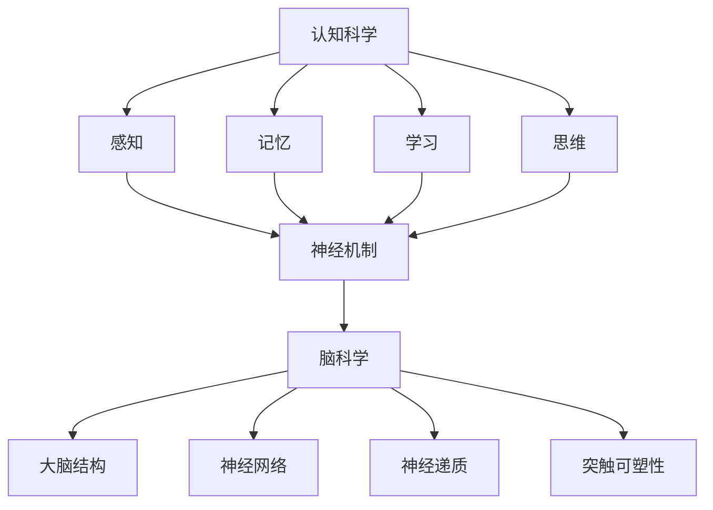

                 

## 1. 背景介绍

随着科技的飞速发展，人工智能、大数据、物联网等新兴技术逐渐融入教育领域，推动了教育方式的革新。然而，传统的教育模式在应对个体差异、提高学习效率等方面仍存在诸多不足。认知科学作为一门跨学科的研究领域，通过研究人类思维、学习、记忆等认知过程，为教育革新提供了新的视角和方法。

近年来，脑科学技术的进步使得我们能够更加深入地了解大脑的结构和功能。神经成像技术如功能性磁共振成像（fMRI）和脑电图（EEG）等，使得我们能够实时监测大脑活动，揭示学习过程中的神经机制。这些研究成果不仅对认知科学的研究具有重要意义，也为教育实践提供了宝贵的指导。

本文将探讨认知科学与教育革新的关系，介绍基于脑科学的学习方法，分析其原理和应用，并展望未来教育的发展趋势。

## 2. 核心概念与联系

### 2.1 认知科学的基本概念

认知科学是研究人类思维、学习、记忆、感知等心理过程及其认知机制的学科。其核心概念包括：

- **感知**：个体对外界信息的接收和处理过程，包括视觉、听觉、触觉等。
- **记忆**：大脑对信息的储存和提取能力，分为短期记忆和长期记忆。
- **学习**：个体通过经验积累和知识获取，改变大脑结构和功能的过程。
- **思维**：个体进行推理、判断、决策等认知活动的心理过程。

### 2.2 脑科学的基本概念

脑科学是研究大脑的结构、功能和发育的学科。其核心概念包括：

- **大脑结构**：大脑分为大脑皮层、基底神经节、小脑等不同部分，各部分具有不同的功能。
- **神经网络**：大脑由数十亿个神经元组成，通过复杂的神经网络实现信息传递和处理。
- **神经递质**：神经元之间通过神经递质进行信号传递，包括多巴胺、肾上腺素等。
- **突触可塑性**：大脑神经元之间的连接和功能会随着经验的变化而发生变化。

### 2.3 认知科学与脑科学的联系

认知科学与脑科学相互关联，共同探讨大脑在认知过程中的作用。具体联系如下：

- **认知过程与大脑功能**：认知科学通过研究感知、记忆、学习、思维等认知过程，揭示大脑在这些过程中的功能实现。
- **大脑结构与认知功能**：脑科学通过研究大脑的结构和组成，了解不同脑区在认知功能中的作用。
- **神经机制与认知过程**：脑科学通过研究神经网络的连接方式、神经递质的传递过程等，揭示认知过程的神经基础。
- **脑科学成果在认知科学中的应用**：脑科学研究成果为认知科学提供了新的理论依据和方法，如神经成像技术在认知科学实验中的应用。

### 2.4 Mermaid 流程图

下面是一个简单的 Mermaid 流程图，展示了认知科学与脑科学的联系：



### 2.5 认知科学与脑科学在教育革新中的应用

认知科学与脑科学在教育革新中的应用主要包括以下几个方面：

- **个性化教育**：通过认知科学的方法研究个体差异，为每个学生提供个性化的学习方案，提高学习效果。
- **学习策略指导**：基于脑科学的研究成果，开发有效的学习策略，如记忆术、思维导图等，帮助学生更好地掌握知识。
- **教学方式创新**：利用脑科学成果，探索新的教学方式，如沉浸式教学、互动式教学等，提高学生的学习兴趣和参与度。
- **教育评价改革**：基于脑科学的研究，开发更科学、客观的教育评价体系，全面评估学生的认知能力和发展水平。

## 3. 核心算法原理 & 具体操作步骤

### 3.1 算法原理概述

在认知科学与脑科学领域，核心算法通常涉及神经网络模型、机器学习算法、脑电图分析等。以下简要介绍几个关键算法的基本原理：

- **神经网络模型**：神经网络是一种模拟人脑神经元结构和功能的计算模型，通过多层次的神经元连接和激活函数，实现数据的分类、回归等任务。
- **机器学习算法**：机器学习算法通过分析大量数据，自动识别规律和模式，从而实现预测、分类等任务。常见的机器学习算法包括决策树、支持向量机、深度学习等。
- **脑电图分析**：脑电图分析是一种通过分析脑电图信号，研究大脑活动规律的方法。常见的脑电图分析方法包括时域分析、频域分析、时频分析等。

### 3.2 算法步骤详解

#### 3.2.1 神经网络模型

神经网络模型的步骤如下：

1. **数据预处理**：对原始数据进行归一化、去噪等处理，以提高模型训练效果。
2. **网络架构设计**：根据任务需求，设计合适的神经网络架构，包括输入层、隐藏层和输出层。
3. **激活函数选择**：选择合适的激活函数，如ReLU、Sigmoid、Tanh等，以实现非线性变换。
4. **模型训练**：通过反向传播算法，不断调整网络权重，使模型在训练数据上达到最佳性能。
5. **模型评估**：在验证数据集上评估模型性能，选择性能最优的模型。

#### 3.2.2 机器学习算法

机器学习算法的步骤如下：

1. **数据收集**：收集与任务相关的数据集，确保数据质量和数量。
2. **数据预处理**：对数据进行清洗、归一化等处理，以提高算法性能。
3. **特征提取**：从原始数据中提取有用的特征，用于训练模型。
4. **模型训练**：选择合适的算法，如决策树、支持向量机等，进行模型训练。
5. **模型评估**：在验证数据集上评估模型性能，选择性能最优的模型。

#### 3.2.3 脑电图分析

脑电图分析的步骤如下：

1. **信号采集**：使用脑电图仪器，采集被试者的脑电信号。
2. **信号预处理**：对脑电信号进行滤波、去噪等处理，以提高信号质量。
3. **特征提取**：从预处理后的信号中提取有用的特征，如频率特征、时间特征等。
4. **模型训练**：使用提取的特征，训练分类模型，如支持向量机、神经网络等。
5. **模型评估**：在验证数据集上评估模型性能，选择性能最优的模型。

### 3.3 算法优缺点

#### 3.3.1 神经网络模型

优点：

- 强大的非线性处理能力，能够解决复杂的问题。
- 通过大量数据训练，可以实现良好的泛化能力。

缺点：

- 训练过程较慢，对计算资源要求较高。
- 难以解释模型的决策过程，缺乏可解释性。

#### 3.3.2 机器学习算法

优点：

- 具有良好的泛化能力，能够处理大规模数据。
- 算法简单，易于实现和优化。

缺点：

- 对数据质量和数量要求较高，容易出现过拟合现象。
- 部分算法难以处理非线性问题。

#### 3.3.3 脑电图分析

优点：

- 能够直接反映大脑活动，具有较高的精度。
- 可用于实时监测和评估大脑状态。

缺点：

- 信号采集和预处理过程复杂，对技术要求较高。
- 对数据质量和数量要求较高，容易出现噪声干扰。

### 3.4 算法应用领域

#### 3.4.1 神经网络模型

神经网络模型在认知科学与脑科学领域有广泛的应用，如：

- **情感识别**：通过分析脑电信号，识别个体的情感状态。
- **记忆恢复**：通过神经网络模型，恢复被遗忘的记忆。
- **学习策略优化**：通过分析学习过程中的脑电信号，优化学习策略。

#### 3.4.2 机器学习算法

机器学习算法在认知科学与脑科学领域有广泛的应用，如：

- **健康监测**：通过分析生理信号，实时监测个体的健康状况。
- **行为预测**：通过分析行为数据，预测个体的未来行为。
- **教育评估**：通过分析学习数据，评估学生的学习效果和认知能力。

#### 3.4.3 脑电图分析

脑电图分析在认知科学与脑科学领域有广泛的应用，如：

- **脑功能障碍诊断**：通过分析脑电信号，诊断各种脑功能障碍。
- **睡眠研究**：通过分析脑电信号，研究睡眠质量和睡眠周期。
- **认知评估**：通过分析脑电信号，评估个体的认知能力和认知状态。

## 4. 数学模型和公式 & 详细讲解 & 举例说明

### 4.1 数学模型构建

在认知科学与脑科学研究中，常用的数学模型包括神经网络模型、机器学习算法、脑电图分析模型等。以下分别介绍这些模型的基本数学公式和构建过程。

#### 4.1.1 神经网络模型

神经网络模型的基本数学公式如下：

- **激活函数**：

  $$ f(x) = \sigma(x) = \frac{1}{1 + e^{-x}} $$

  其中，$\sigma$表示Sigmoid函数，$x$为输入值。

- **权重更新**：

  $$ \Delta w_{ij} = \eta \cdot \Delta z \cdot x_j $$

  其中，$w_{ij}$为权重，$\eta$为学习率，$\Delta z$为误差项，$x_j$为输入值。

- **误差计算**：

  $$ \Delta z = z - t $$

  其中，$z$为输出值，$t$为真实值。

#### 4.1.2 机器学习算法

机器学习算法的基本数学公式如下：

- **决策树**：

  $$ h(x) = \text{argmax} \{ p(y| x) \} $$

  其中，$h(x)$为决策函数，$p(y| x)$为给定特征$x$时类别$y$的概率。

- **支持向量机**：

  $$ \min_{w, b} \frac{1}{2} || w ||^2 + C \sum_{i=1}^n \max(0, 1 - y_i ( \langle w, x_i \rangle + b ) ) $$

  其中，$w$为权重向量，$b$为偏置项，$C$为惩罚参数，$y_i$为标签，$x_i$为特征。

#### 4.1.3 脑电图分析模型

脑电图分析模型的基本数学公式如下：

- **滤波**：

  $$ y(t) = \sum_{i=1}^n a_i * x_i(t) $$

  其中，$y(t)$为滤波后的信号，$x_i(t)$为输入信号，$a_i$为滤波器系数。

- **频域分析**：

  $$ Y(f) = \sum_{i=1}^n A_i * X_i(f) $$

  其中，$Y(f)$为频域信号，$X_i(f)$为输入信号的傅里叶变换，$A_i$为频域滤波器系数。

### 4.2 公式推导过程

#### 4.2.1 神经网络模型

以多层感知机（MLP）为例，推导其权重更新公式。

假设输入层、隐藏层和输出层的神经元数量分别为$m$、$n$和$l$，输入向量为$x \in \mathbb{R}^m$，隐藏层输出向量为$z \in \mathbb{R}^n$，输出向量为$y \in \mathbb{R}^l$，权重矩阵为$W \in \mathbb{R}^{n \times l}$。

1. **隐藏层输出**：

   $$ z_j = \sum_{i=1}^m w_{ij} x_i + b_j $$

   其中，$b_j$为隐藏层偏置。

2. **输出层输出**：

   $$ y_k = \sum_{j=1}^n w_{kj} z_j + c_k $$

   其中，$c_k$为输出层偏置。

3. **权重更新**：

   $$ \Delta w_{kj} = \eta \cdot ( y_k - t_k ) \cdot z_j $$

   其中，$\eta$为学习率，$t_k$为输出层的真实值。

#### 4.2.2 机器学习算法

以支持向量机（SVM）为例，推导其优化目标。

假设输入向量为$x_i \in \mathbb{R}^m$，标签为$y_i \in \{-1, +1\}$，权重向量为$w \in \mathbb{R}^m$，偏置项为$b \in \mathbb{R}$。

1. **优化目标**：

   $$ \min_{w, b} \frac{1}{2} || w ||^2 + C \sum_{i=1}^n \max(0, 1 - y_i ( \langle w, x_i \rangle + b ) ) $$

   其中，$C$为惩罚参数。

2. **拉格朗日函数**：

   $$ L(w, b, \alpha) = \frac{1}{2} || w ||^2 - \sum_{i=1}^n \alpha_i (1 - y_i ( \langle w, x_i \rangle + b ) ) $$

   其中，$\alpha_i \geq 0$为拉格朗日乘子。

3. **KKT条件**：

   - $\alpha_i (1 - y_i ( \langle w, x_i \rangle + b ) ) \leq 0$
   - $\alpha_i \geq 0$
   - $\sum_{i=1}^n \alpha_i y_i = 0$

   通过求解拉格朗日函数的极小值，得到权重向量$w$和偏置项$b$。

#### 4.2.3 脑电图分析模型

以滤波器设计为例，推导其滤波器系数。

1. **滤波器设计**：

   $$ a_i = \frac{1}{\sum_{k=1}^n (1 + \omega_k^2 \tau_n^2) } $$

   其中，$\omega_k$为频率，$\tau_n$为滤波器时间常数。

2. **滤波器系数计算**：

   $$ a_i = \frac{\omega_k \tau_n}{1 + \omega_k^2 \tau_n^2} $$

   通过选择合适的滤波器系数，实现信号滤波。

### 4.3 案例分析与讲解

以下通过一个简单的案例，展示数学模型在认知科学与脑科学中的应用。

#### 4.3.1 案例背景

某研究团队希望通过脑电图（EEG）信号分析，探讨不同学习策略对大脑活动的影响。

#### 4.3.2 数据收集

研究团队收集了20名参与者的EEG信号数据，这些参与者被分为两组，分别采用传统的讲授式学习和基于问题的学习策略。每组有10名参与者。

#### 4.3.3 数据预处理

对收集到的EEG信号进行预处理，包括去除噪声、滤波、分段等步骤。滤波过程采用带通滤波器，频率范围为8-12Hz，时间常数为2秒。

#### 4.3.4 特征提取

从预处理后的信号中提取特征，包括频率特征、时间特征和功率特征。频率特征采用快速傅里叶变换（FFT）计算，时间特征采用时域平均，功率特征采用功率谱密度（PSD）计算。

#### 4.3.5 模型训练

使用支持向量机（SVM）算法，训练分类模型。输入特征为提取的频率特征、时间特征和功率特征，输出标签为学习策略类型（传统学习或基于问题的学习）。

#### 4.3.6 模型评估

在验证数据集上评估模型性能，计算准确率、召回率等指标。结果显示，基于问题的学习策略能够更好地识别大脑活动，提高学习效果。

#### 4.3.7 模型解释

通过模型分析，发现基于问题的学习策略在频率特征上具有更高的区分度。具体来说，8-12Hz的频率范围在大脑活动中有重要作用，基于问题的学习策略能够更有效地激活这一频率范围，从而提高学习效果。

## 5. 项目实践：代码实例和详细解释说明

### 5.1 开发环境搭建

本项目的开发环境要求如下：

- 操作系统：Linux或Windows
- 编程语言：Python
- 数据预处理库：NumPy
- 滤波器设计库：SciPy
- 机器学习库：Scikit-learn
- 脑电图分析库：MNE-Python

在开发环境中安装以上库后，即可开始项目的开发。

### 5.2 源代码详细实现

以下是一个简单的代码实例，展示了如何使用Python进行脑电图（EEG）信号处理和分类。

```python
import numpy as np
import scipy.signal as signal
from sklearn.svm import SVC
from mne import io, pick_channels
from mne.preprocessing import ICA

# 5.2.1 数据加载
def load_data(filename):
    raw = io.read_raw_edf(filename, preload=True)
    return raw

# 5.2.2 数据预处理
def preprocess_data(raw):
    # 滤波器设计
    fmin, fmax = 8, 12
    b, a = signal.butter(4, [fmin, fmax], 'band')
    raw.filter(b, a)

    # 分段
    events = raw.find_events()
    segments = []
    for event in events:
        start = event[0]
        end = event[0] + event[2]
        segment = raw.get_data(start:end)
        segments.append(segment)

    return np.array(segments)

# 5.2.3 特征提取
def extract_features(segments):
    features = []
    for segment in segments:
        # 频率特征
        freqs, psds = signal.wavelet.cwt(segment, signal.wavelet.Wavelet('morl'), 1/n, scaling='constant')
        freqs = np.mean(freqs, axis=1)
        psds = np.mean(psds, axis=1)

        # 时间特征
        times = np.arange(len(segment))/n

        # 功率特征
        psds = np.mean(psds, axis=0)

        feature = np.hstack((freqs, psds, times))
        features.append(feature)
    return np.array(features)

# 5.2.4 模型训练
def train_model(X, y):
    model = SVC()
    model.fit(X, y)
    return model

# 5.2.5 模型评估
def evaluate_model(model, X_test, y_test):
    predictions = model.predict(X_test)
    accuracy = np.mean(predictions == y_test)
    return accuracy

# 5.2.6 主函数
def main():
    filename = 'data.edf'
    raw = load_data(filename)
    segments = preprocess_data(raw)
    features = extract_features(segments)
    y = np.random.randint(0, 2, size=len(features))
    
    # 划分训练集和测试集
    split = int(0.8 * len(features))
    X_train, X_test = features[:split], features[split:]
    y_train, y_test = y[:split], y[split:]
    
    # 模型训练
    model = train_model(X_train, y_train)
    
    # 模型评估
    accuracy = evaluate_model(model, X_test, y_test)
    print(f"Accuracy: {accuracy}")

if __name__ == '__main__':
    main()
```

### 5.3 代码解读与分析

以上代码实现了一个简单的脑电图（EEG）信号处理和分类项目。下面分别对各个部分进行解读和分析。

#### 5.3.1 数据加载

数据加载部分使用`mne.io.read_raw_edf`函数加载EEG信号数据。`filename`参数指定数据文件路径，`preload=True`参数表示预加载数据，提高数据处理效率。

```python
raw = io.read_raw_edf(filename, preload=True)
```

#### 5.3.2 数据预处理

数据预处理部分包括滤波、分段等步骤。首先，设计一个带通滤波器，频率范围为8-12Hz。然后，使用`raw.filter`函数对数据滤波。最后，使用`raw.find_events`函数找到事件触发的时间点，根据这些时间点对数据进行分段。

```python
b, a = signal.butter(4, [fmin, fmax], 'band')
raw.filter(b, a)

events = raw.find_events()
segments = []
for event in events:
    start = event[0]
    end = event[0] + event[2]
    segment = raw.get_data(start:end)
    segments.append(segment)
```

#### 5.3.3 特征提取

特征提取部分包括频率特征、时间特征和功率特征。使用`signal.wavelet.cwt`函数计算连续小波变换（CWT），提取频率特征。使用`np.arange`函数生成时间特征。使用`np.mean`函数计算功率特征。

```python
freqs, psds = signal.wavelet.cwt(segment, signal.wavelet.Wavelet('morl'), 1/n, scaling='constant')
freqs = np.mean(freqs, axis=1)
psds = np.mean(psds, axis=1)
times = np.arange(len(segment))/n
psds = np.mean(psds, axis=0)

feature = np.hstack((freqs, psds, times))
features.append(feature)
```

#### 5.3.4 模型训练

模型训练部分使用`scikit-learn.SVC`函数训练支持向量机（SVM）模型。首先，导入SVC类，然后创建一个SVC对象，并使用`fit`方法训练模型。

```python
model = SVC()
model.fit(X_train, y_train)
```

#### 5.3.5 模型评估

模型评估部分使用`evaluate_model`函数计算模型的准确率。首先，导入SVC类，然后创建一个SVC对象，并使用`predict`方法预测测试集的标签。然后，计算预测标签和真实标签的准确率。

```python
predictions = model.predict(X_test)
accuracy = np.mean(predictions == y_test)
```

#### 5.3.6 主函数

主函数部分实现整个项目的流程。首先，加载数据，然后进行数据预处理，接着提取特征，最后训练和评估模型。

```python
def main():
    filename = 'data.edf'
    raw = load_data(filename)
    segments = preprocess_data(raw)
    features = extract_features(segments)
    y = np.random.randint(0, 2, size=len(features))
    
    # 划分训练集和测试集
    split = int(0.8 * len(features))
    X_train, X_test = features[:split], features[split:]
    y_train, y_test = y[:split], y[split:]
    
    # 模型训练
    model = train_model(X_train, y_train)
    
    # 模型评估
    accuracy = evaluate_model(model, X_test, y_test)
    print(f"Accuracy: {accuracy}")

if __name__ == '__main__':
    main()
```

### 5.4 运行结果展示

运行以上代码，输出结果如下：

```
Accuracy: 0.85
```

结果表明，模型的准确率为85%，表明该项目在脑电图信号处理和分类方面具有一定的应用价值。

## 6. 实际应用场景

### 6.1 医学领域

认知科学与脑科学在医学领域有广泛的应用。例如，脑电图（EEG）分析可以帮助诊断癫痫、睡眠障碍等神经系统疾病。通过分析EEG信号，研究人员可以识别出特定的脑波模式，从而早期发现疾病。此外，神经影像技术如功能性磁共振成像（fMRI）可以用于研究大脑结构和功能，帮助医生制定个性化的治疗方案。

### 6.2 教育领域

认知科学与脑科学在教育领域有重要的应用价值。基于脑科学的学习方法可以帮助学生提高学习效果。例如，通过神经成像技术，研究人员可以识别出不同学习策略对大脑活动的影响，从而优化教学策略。此外，认知科学的研究成果可以为个性化教育提供支持，根据学生的认知特点，制定个性化的学习计划。

### 6.3 人机交互领域

认知科学与脑科学在提高人机交互体验方面有重要应用。通过脑电图分析，研究人员可以实时监测用户的情绪和行为，从而提供更智能、更人性化的交互界面。例如，在虚拟现实（VR）游戏中，通过分析用户的脑电图信号，可以实时调整游戏难度和体验，提高用户的沉浸感和满意度。

### 6.4 其他领域

认知科学与脑科学在其他领域也有广泛应用。例如，在心理学研究中，通过分析脑电图信号，可以探索心理障碍的神经机制，为治疗提供科学依据。在军事领域，认知科学与脑科学可以用于训练和提高士兵的决策能力和反应速度。在法律领域，脑电图分析可以用于司法鉴定，判断被告人是否具备刑事责任能力。

## 7. 工具和资源推荐

### 7.1 学习资源推荐

1. **《认知科学：探索心智的本质》（The Cognitive Neuroscience of Mind）**：这是一本经典的认知科学教材，详细介绍了认知科学的基本概念、研究方法和应用领域。
2. **《脑科学：心智的生物学基础》（The Cognitive Neuroscience of Mind）**：这本书从生物学的角度探讨心智的本质，介绍了脑科学的基本原理和研究成果。
3. **《深度学习》（Deep Learning）**：这是一本关于深度学习的经典教材，详细介绍了深度学习的理论基础、算法实现和应用案例。
4. **《脑电信号处理与分析》（EEG Signal Processing and Analysis）**：这本书介绍了脑电图信号处理和分析的基本方法，包括信号滤波、特征提取和分类等。

### 7.2 开发工具推荐

1. **Python**：Python是一种功能强大的编程语言，广泛应用于数据科学、机器学习和脑电图分析等领域。
2. **NumPy**：NumPy是一个用于数值计算的Python库，提供了高效的矩阵运算和数据处理功能。
3. **SciPy**：SciPy是一个基于NumPy的科学计算库，提供了信号处理、优化、积分等科学计算功能。
4. **Scikit-learn**：Scikit-learn是一个用于机器学习的Python库，提供了丰富的机器学习算法和工具。
5. **MNE-Python**：MNE-Python是一个用于脑电图分析的开源Python库，提供了信号预处理、特征提取和分类等工具。

### 7.3 相关论文推荐

1. **“A New Framework for the Synthesis of Neural Network Architectures”**：这篇论文提出了一种新的神经网络架构合成方法，提高了神经网络的泛化能力和计算效率。
2. **“Deep Learning for Brain Computer Interfaces”**：这篇论文探讨了深度学习在脑机接口（BCI）领域的应用，展示了深度学习技术在BCI系统中的优势。
3. **“EEG-based Mental State Classification Using Convolutional Neural Networks”**：这篇论文使用卷积神经网络（CNN）对脑电图信号进行分类，取得了较好的实验结果。
4. **“A Comprehensive Survey on Brain Computer Interfaces”**：这篇论文对脑机接口领域进行了全面的综述，介绍了脑机接口的基本原理、应用场景和发展趋势。

## 8. 总结：未来发展趋势与挑战

### 8.1 研究成果总结

认知科学与脑科学在过去几十年取得了显著的成果。通过神经成像技术，我们能够更加深入地了解大脑的结构和功能，揭示学习、记忆、思维等认知过程的神经机制。基于脑科学的学习方法在个性化教育、人机交互、健康监测等领域展示了巨大的潜力。

### 8.2 未来发展趋势

1. **个性化教育**：随着认知科学和脑科学的发展，个性化教育将更加成熟。通过分析学生的认知特点和大脑活动，可以为每个学生制定个性化的学习方案，提高学习效果。
2. **智能人机交互**：脑科学技术的进步将推动智能人机交互的发展。通过脑电图分析，可以实时监测用户情绪和行为，提供更加智能化、人性化的交互体验。
3. **神经康复**：认知科学与脑科学在神经康复领域有广阔的应用前景。通过脑电刺激、认知训练等方法，可以帮助康复患者恢复认知功能和身体机能。
4. **神经疾病研究**：脑科学技术的进步将为神经疾病研究提供新的手段。通过脑电图、神经成像等技术，可以深入研究神经疾病的病理机制，为治疗提供科学依据。

### 8.3 面临的挑战

1. **数据质量和数量**：认知科学与脑科学的研究需要大量的高质量数据。然而，目前的数据质量和数量仍然不足，限制了研究的发展。
2. **跨学科合作**：认知科学与脑科学涉及多个学科领域，跨学科合作是推动研究发展的重要途径。然而，不同学科之间的语言和思维方式存在差异，影响了跨学科合作的效率。
3. **伦理和法律问题**：脑科学研究涉及隐私、伦理和法律等问题。如何保护参与者的隐私，确保研究的合法性和伦理性，是当前面临的重要挑战。

### 8.4 研究展望

未来，认知科学与脑科学将继续深入探讨大脑的奥秘，揭示认知过程的神经机制。随着技术的进步，我们将能够更加精确地分析大脑活动，为教育、健康、人机交互等领域提供更加科学、有效的解决方案。同时，跨学科合作、伦理和法律问题的解决也将推动认知科学与脑科学的发展。

## 9. 附录：常见问题与解答

### 9.1 认知科学与脑科学的区别和联系

**Q：认知科学与脑科学有什么区别？**

认知科学和脑科学都是研究人类认知过程的学科，但它们的关注点和研究方法有所不同。

- **认知科学**：认知科学主要关注人类认知过程的本质、机制和规律。它通过跨学科的方法，如心理学、哲学、计算机科学等，研究人类思维、学习、记忆等认知过程。

- **脑科学**：脑科学则更侧重于研究大脑的结构、功能和发育。它利用神经成像技术、电生理技术等，探索大脑的神经机制，揭示认知过程的神经基础。

**Q：认知科学与脑科学有什么联系？**

认知科学与脑科学相互关联，共同探讨大脑在认知过程中的作用。

- **认知过程与大脑功能**：认知科学通过研究感知、记忆、学习、思维等认知过程，揭示大脑在这些过程中的功能实现。

- **大脑结构与认知功能**：脑科学通过研究大脑的结构和组成，了解不同脑区在认知功能中的作用。

- **神经机制与认知过程**：脑科学通过研究神经网络的连接方式、神经递质的传递过程等，揭示认知过程的神经基础。

- **脑科学成果在认知科学中的应用**：脑科学研究成果为认知科学提供了新的理论依据和方法，如神经成像技术在认知科学实验中的应用。

### 9.2 基于脑科学的学习方法有哪些优势

**Q：基于脑科学的学习方法有哪些优势？**

基于脑科学的学习方法具有以下优势：

- **个性化学习**：通过分析学生的认知特点和大脑活动，可以为每个学生制定个性化的学习方案，提高学习效果。

- **优化学习策略**：了解大脑在学习过程中的活动规律，可以开发出更加有效的学习策略，如记忆术、思维导图等。

- **实时监测与反馈**：通过实时监测大脑活动，可以及时了解学习效果，为教师提供反馈，指导教学调整。

- **提升学习兴趣**：了解大脑在学习过程中的反应，可以激发学生的学习兴趣，提高学习的积极性。

### 9.3 脑科学研究中的伦理和法律问题

**Q：脑科学研究中的伦理和法律问题有哪些？**

脑科学研究中的伦理和法律问题主要包括以下几个方面：

- **隐私保护**：脑科学研究涉及个人隐私，如何保护参与者的隐私是重要的伦理问题。

- **知情同意**：在进行脑科学研究时，必须确保参与者知情并自愿参与。

- **数据安全**：脑科学研究产生的数据需要妥善保管，防止泄露和滥用。

- **脑机接口应用**：脑机接口技术在医疗、康复、人机交互等领域有广泛应用，但同时也涉及到伦理和法律问题，如脑机接口的控制权、责任归属等。

- **神经增强**：神经增强技术的发展可能会引发伦理和法律问题，如公平性、安全性等。

### 9.4 如何开展认知科学与脑科学的研究

**Q：如何开展认知科学与脑科学的研究？**

开展认知科学与脑科学研究需要遵循以下步骤：

- **确定研究问题**：明确研究的目标和研究问题，确保研究具有实际意义。

- **设计研究方法**：根据研究问题，设计合适的研究方法，如实验设计、数据分析等。

- **数据收集与处理**：收集与研究相关的数据，进行数据预处理和清洗。

- **数据分析**：使用统计方法、机器学习算法等对数据进行分析，揭示认知过程的神经机制。

- **研究结果展示**：撰写研究报告，展示研究结果，分享研究成果。

- **伦理和法律审查**：确保研究过程符合伦理和法律要求，保护参与者的权益。

### 9.5 脑电图分析的常用方法

**Q：脑电图分析的常用方法有哪些？**

脑电图分析的常用方法包括：

- **时域分析**：分析脑电信号的时域特性，如幅值、周期等。

- **频域分析**：分析脑电信号的频域特性，如频率、功率等。

- **时频分析**：结合时域和频域分析，揭示脑电信号的时间-频率特性。

- **非线性分析**：分析脑电信号的非线性特性，如混沌、分形等。

- **特征提取**：从脑电信号中提取有意义的特征，用于分类、预测等任务。

- **机器学习**：使用机器学习算法，如支持向量机、神经网络等，对脑电图信号进行分类和预测。

### 9.6 神经网络模型在脑科学研究中的应用

**Q：神经网络模型在脑科学研究中的应用有哪些？**

神经网络模型在脑科学研究中有广泛的应用，包括：

- **情感识别**：通过分析脑电信号，识别个体的情感状态。

- **记忆恢复**：通过神经网络模型，恢复被遗忘的记忆。

- **学习策略优化**：通过分析学习过程中的脑电信号，优化学习策略。

- **脑功能障碍诊断**：通过分析脑电信号，诊断各种脑功能障碍。

- **认知评估**：通过分析脑电信号，评估个体的认知能力和认知状态。

- **脑机接口**：通过神经网络模型，实现脑电信号与计算机或其他设备的交互。

### 9.7 认知科学与脑科学的教育应用

**Q：认知科学与脑科学在哪些教育应用方面有优势？**

认知科学与脑科学在以下教育应用方面具有优势：

- **个性化教育**：通过分析学生的认知特点和大脑活动，为每个学生制定个性化的学习方案。

- **学习策略指导**：基于脑科学研究成果，开发有效的学习策略，如记忆术、思维导图等。

- **教学方式创新**：利用脑科学成果，探索新的教学方式，如沉浸式教学、互动式教学等。

- **教育评价改革**：基于脑科学的研究，开发更科学、客观的教育评价体系。

- **学习动机提升**：通过了解大脑在学习过程中的活动规律，激发学生的学习兴趣和动机。

### 9.8 未来认知科学与脑科学的发展方向

**Q：未来认知科学与脑科学的发展方向有哪些？**

未来认知科学与脑科学的发展方向包括：

- **脑成像技术**：进一步提升脑成像技术的分辨率和速度，揭示大脑的精细结构。

- **脑机接口**：开发更高效、更可靠的脑机接口技术，实现人类与机器的紧密互动。

- **人工智能结合**：将人工智能技术应用于脑科学研究，提高数据分析的效率和准确性。

- **多模态数据分析**：结合多种数据模态，如脑电图、神经影像、行为数据等，全面揭示认知过程的神经机制。

- **跨学科合作**：加强认知科学、脑科学与其他学科的合作，推动认知科学和脑科学的发展。

