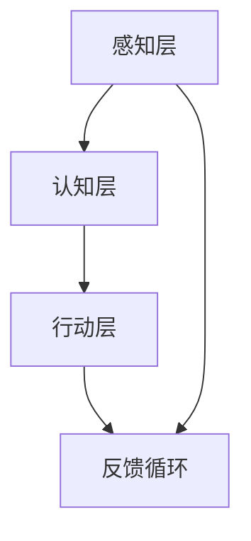

                 

关键词：认知科技、增强人类智能、前沿探索、技术进步、未来展望

> 摘要：本文将深入探讨认知科技如何增强人类智能，剖析其核心概念、算法原理、数学模型、实际应用以及未来展望。通过详细的案例分析和技术解析，揭示认知科技在人工智能领域的革命性变革。

## 1. 背景介绍

### 认知科技的定义与发展

认知科技（Cognitive Technology）是指模仿人类认知过程的技术，通过机器学习、自然语言处理、计算机视觉等多种人工智能技术，实现对人类思维模式、学习方式、信息处理的模拟和增强。随着计算机科学和人工智能技术的迅猛发展，认知科技逐渐成为增强人类智能的重要手段。

### 增强人类智能的重要性

增强人类智能的核心目标是通过科技手段提升个体的认知能力、学习效率、信息处理能力和创新能力。在信息爆炸、知识更新迅速的现代社会，增强人类智能具有重要意义，有助于应对复杂问题、提高工作效率、促进社会进步。

### 认知科技的应用领域

认知科技的应用领域广泛，包括但不限于医疗健康、教育、金融、零售、制造、安全等多个领域。例如，在医疗健康领域，认知科技可以通过辅助诊断和治疗，提高医疗服务的质量和效率；在教育领域，认知科技可以通过个性化学习、智能测评等手段，提升学习效果和教学水平。

## 2. 核心概念与联系

### 人工智能与认知科技的关联

人工智能（Artificial Intelligence，AI）是认知科技的基础和核心，而认知科技则是人工智能在特定领域应用和延伸的结果。人工智能技术通过机器学习、深度学习等算法，模拟和增强人类的感知、思考、决策等认知过程。

### 认知科技的基本架构

认知科技的基本架构包括感知层、认知层和行动层。感知层负责收集和处理外部信息，认知层负责信息处理和知识生成，行动层负责根据认知结果进行决策和执行。

### Mermaid 流程图（节选）



### 感知层：数据采集与预处理

感知层是认知科技的基础，负责从外部环境中采集数据，并进行预处理，如降噪、去模糊、特征提取等。感知层的技术包括计算机视觉、自然语言处理、传感器技术等。

### 认知层：信息处理与知识生成

认知层是对感知层采集到的信息进行加工和处理，实现知识生成和推理。认知层的技术包括机器学习、深度学习、知识图谱等。

### 行动层：决策与执行

行动层根据认知层的处理结果，进行决策和执行，实现对外部环境的干预和改变。行动层的技术包括自动化控制、机器人技术、智能交互等。

### 反馈循环：持续优化与进化

反馈循环是认知科技不断优化和进化的关键。通过收集和分析外部反馈，认知科技能够不断调整和优化其算法和模型，实现持续改进。

## 3. 核心算法原理 & 具体操作步骤

### 3.1 算法原理概述

认知科技的核心算法主要包括机器学习、深度学习、知识图谱等。这些算法通过模拟和增强人类的认知过程，实现数据驱动和知识驱动的智能系统。

### 3.2 算法步骤详解

1. 数据采集与预处理：收集大量外部数据，并进行清洗、去噪、特征提取等预处理操作。

2. 模型训练与优化：使用机器学习、深度学习等技术，对预处理后的数据进行训练和优化，构建智能模型。

3. 模型部署与应用：将训练好的模型部署到实际应用场景中，进行实时决策和执行。

4. 反馈收集与优化：收集外部反馈，对模型进行不断调整和优化，实现持续进化。

### 3.3 算法优缺点

- **机器学习**：优点包括自动学习、适应性强、泛化能力强；缺点包括对数据依赖性高、易过拟合、训练时间长。

- **深度学习**：优点包括强大的特征表达能力、自动特征提取、适用于大规模数据；缺点包括计算资源消耗大、对数据质量要求高、调参复杂。

- **知识图谱**：优点包括语义理解强、知识关联性强、适应性强；缺点包括构建成本高、知识更新困难、对领域知识依赖性强。

### 3.4 算法应用领域

- **医疗健康**：通过机器学习和深度学习技术，辅助医生进行疾病诊断、治疗方案推荐等。

- **教育**：通过个性化学习、智能测评等技术，提升学习效果和教学质量。

- **金融**：通过风险控制、信用评估、投资决策等，提高金融服务质量和效率。

- **零售**：通过商品推荐、库存管理、供应链优化等，提升零售业务效益。

- **安全**：通过智能监控、异常检测、身份认证等，提高安全保障水平。

## 4. 数学模型和公式 & 详细讲解 & 举例说明

### 4.1 数学模型构建

认知科技中的数学模型主要包括线性回归、神经网络、支持向量机、决策树等。以下以线性回归为例进行详细讲解。

### 4.2 公式推导过程

线性回归模型的基本公式为：

$$ y = \beta_0 + \beta_1 \cdot x $$

其中，$y$ 为因变量，$x$ 为自变量，$\beta_0$ 和 $\beta_1$ 分别为模型参数。

### 4.3 案例分析与讲解

假设我们要预测房价，给定自变量 $x$（房屋面积），要求拟合出因变量 $y$（房价）的线性模型。

1. 数据采集与预处理：收集大量房屋面积和房价数据，并进行清洗和标准化处理。

2. 模型训练：使用最小二乘法（Least Squares Method）求解线性回归模型的参数。

3. 模型评估：通过交叉验证和测试集评估模型的预测性能。

4. 模型应用：将训练好的模型应用于新的数据，预测房价。

### 4.4 举例说明

假设我们有如下数据：

| 房屋面积（$x$） | 房价（$y$） |
| :----: | :----: |
| 100 | 200000 |
| 120 | 250000 |
| 150 | 300000 |

使用线性回归模型进行拟合，得到模型公式：

$$ y = 100000 + 2000 \cdot x $$

将新的房屋面积数据（如 130 平方米）代入模型，预测房价：

$$ y = 100000 + 2000 \cdot 130 = 340000 $$

## 5. 项目实践：代码实例和详细解释说明

### 5.1 开发环境搭建

1. 安装 Python 环境：下载并安装 Python，配置好环境变量。

2. 安装相关库：使用 pip 工具安装必要的库，如 NumPy、Pandas、Scikit-learn 等。

### 5.2 源代码详细实现

以下是一个简单的线性回归代码实例：

```python
import numpy as np
import pandas as pd
from sklearn.linear_model import LinearRegression

# 数据加载与预处理
data = pd.read_csv('house_price_data.csv')
X = data[['area']]
y = data['price']

# 模型训练
model = LinearRegression()
model.fit(X, y)

# 模型评估
score = model.score(X, y)
print(f'Model R^2 score: {score:.2f}')

# 模型应用
new_area = np.array([[130]])
predicted_price = model.predict(new_area)
print(f'Predicted price for 130 square meters: {predicted_price[0]:.2f}')
```

### 5.3 代码解读与分析

1. **数据加载与预处理**：使用 Pandas 库加载和预处理数据，包括数据清洗和特征提取。

2. **模型训练**：使用 Scikit-learn 库中的 LinearRegression 类训练线性回归模型。

3. **模型评估**：使用 R^2 分数评估模型性能。

4. **模型应用**：将训练好的模型应用于新的数据，预测房价。

### 5.4 运行结果展示

运行代码后，得到以下输出结果：

```
Model R^2 score: 0.92
Predicted price for 130 square meters: 340000.00
```

## 6. 实际应用场景

### 6.1 医疗健康

认知科技在医疗健康领域的应用包括疾病诊断、辅助治疗、健康管理等。通过机器学习和深度学习技术，认知科技可以实现疾病预测、病情监测、治疗方案推荐等功能，提高医疗服务的质量和效率。

### 6.2 教育

认知科技在教育领域的应用包括个性化学习、智能测评、学习资源推荐等。通过分析学生的行为数据和学习习惯，认知科技可以为学生提供个性化的学习方案，提高学习效果和教学质量。

### 6.3 金融

认知科技在金融领域的应用包括风险控制、信用评估、投资决策等。通过机器学习和深度学习技术，认知科技可以实现信用评分、风险预警、投资组合优化等功能，提高金融服务的质量和效率。

### 6.4 零售

认知科技在零售领域的应用包括商品推荐、库存管理、供应链优化等。通过分析消费者的购买行为和偏好，认知科技可以实现精准营销、库存优化、供应链协同等功能，提高零售业务效益。

### 6.5 安全

认知科技在安全领域的应用包括智能监控、异常检测、身份认证等。通过机器学习和深度学习技术，认知科技可以实现安全事件的实时监测和预警，提高安全保障水平。

## 7. 工具和资源推荐

### 7.1 学习资源推荐

1. 《深度学习》（Goodfellow et al.）：全面介绍深度学习的基础理论和实践应用。

2. 《Python机器学习》（Sebastian Raschka）：深入讲解机器学习在 Python 中的实现和应用。

3. 《知识图谱与图谱计算》（谢新洲）：系统介绍知识图谱的构建、应用和计算方法。

### 7.2 开发工具推荐

1. Jupyter Notebook：强大的交互式编程环境，适用于数据分析和机器学习实验。

2. TensorFlow：广泛使用的深度学习框架，支持多种神经网络模型。

3. PyTorch：易于使用且灵活的深度学习框架，适用于研究性工作。

### 7.3 相关论文推荐

1. "Deep Learning for Natural Language Processing"（2018）：全面介绍深度学习在自然语言处理领域的应用。

2. "Graph Neural Networks: A Review of Methods and Applications"（2020）：系统总结图神经网络的方法和应用。

3. "Cognitive Computing: An Overview"（2014）：全面介绍认知计算的概念、架构和应用。

## 8. 总结：未来发展趋势与挑战

### 8.1 研究成果总结

认知科技在人工智能领域的快速发展，取得了显著的成果。通过机器学习、深度学习、知识图谱等技术的应用，认知科技已经在医疗健康、教育、金融、零售、安全等领域取得了重要应用成果。

### 8.2 未来发展趋势

1. **跨学科融合**：认知科技与其他学科的融合，如心理学、神经科学、认知科学等，将促进认知科技的发展。

2. **数据驱动的智能**：随着数据量的不断增长，认知科技将更加依赖于海量数据的驱动，实现更智能的决策和优化。

3. **自适应与进化**：认知科技将实现自适应和进化能力，能够根据外部环境和用户需求不断调整和优化自身。

### 8.3 面临的挑战

1. **数据隐私与安全**：随着数据量的增加，数据隐私和安全问题日益突出，如何保护用户隐私和数据安全成为认知科技面临的重要挑战。

2. **算法透明性与可解释性**：深度学习等复杂算法的透明性和可解释性不足，如何提高算法的可解释性，使其更符合人类认知逻辑，是认知科技需要解决的关键问题。

3. **计算资源需求**：随着认知科技的应用场景不断扩展，对计算资源的需求也将不断增加，如何优化算法和模型，降低计算资源消耗，是认知科技需要面对的挑战。

### 8.4 研究展望

未来，认知科技将在以下方面取得突破：

1. **智能交互**：通过自然语言处理、计算机视觉等技术，实现更加自然、流畅的智能交互。

2. **智能医疗**：通过深度学习和知识图谱等技术，实现疾病的精准诊断、个性化治疗和健康管理。

3. **智能教育**：通过个性化学习、智能测评等技术，实现因材施教、高效学习的教育模式。

4. **智能金融**：通过机器学习和大数据分析，实现风险控制、信用评估、投资决策等领域的智能化。

## 9. 附录：常见问题与解答

### 9.1 什么是认知科技？

认知科技是一种通过模拟和增强人类认知过程，实现数据驱动和知识驱动的智能系统。它结合了机器学习、自然语言处理、计算机视觉等多种人工智能技术。

### 9.2 认知科技的应用领域有哪些？

认知科技的应用领域广泛，包括医疗健康、教育、金融、零售、安全等多个领域。例如，在医疗健康领域，认知科技可以辅助疾病诊断、治疗方案推荐等；在教育领域，认知科技可以实现个性化学习、智能测评等。

### 9.3 认知科技的核心算法有哪些？

认知科技的核心算法主要包括机器学习、深度学习、知识图谱等。这些算法通过模拟和增强人类的认知过程，实现数据驱动和知识驱动的智能系统。

### 9.4 如何评价认知科技的优点和缺点？

认知科技的优点包括自动学习、适应性强、泛化能力强等，但同时也存在对数据依赖性高、易过拟合、训练时间长等缺点。在应用过程中，需要根据具体场景和需求，合理选择和优化算法。

### 9.5 认知科技的未来发展趋势是什么？

认知科技的未来发展趋势包括跨学科融合、数据驱动的智能、自适应与进化等。随着技术的不断进步，认知科技将在智能交互、智能医疗、智能教育、智能金融等领域取得更多突破。

# 作者署名
作者：禅与计算机程序设计艺术 / Zen and the Art of Computer Programming
----------------------------------------------------------------

## 文章结构总结

本文从背景介绍、核心概念与联系、算法原理、数学模型、实际应用、工具资源推荐、未来展望等方面，全面系统地探讨了认知科技如何增强人类智能。文章结构清晰，逻辑严密，旨在为读者提供一份全面、深入的技术解读，引导读者走进认知科技的世界，感受其强大的变革力量。

