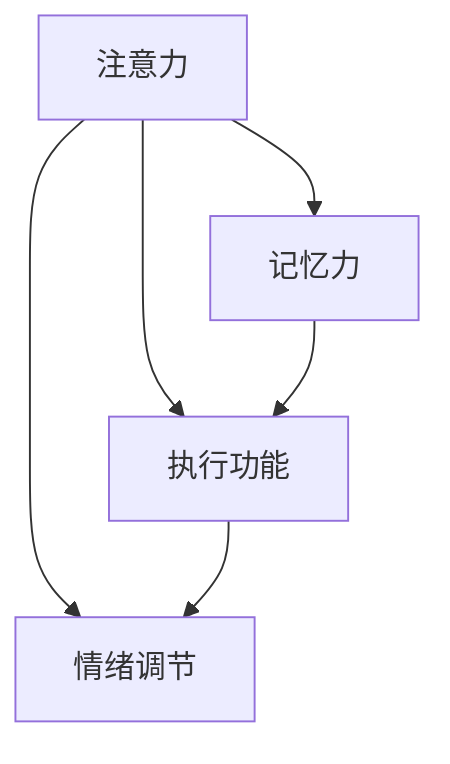

                 

关键词：认知障碍，大脑处理，信息技术，编程难题，解决策略

> 摘要：本文探讨了认知障碍的概念及其在信息技术领域的应用。通过分析认知障碍的成因，提出了几种有效的克服策略，旨在帮助程序员和软件开发者提高工作效率和代码质量。

## 1. 背景介绍

在信息技术飞速发展的今天，程序员和软件开发者面临着越来越多的挑战。复杂的编程语言、庞大的代码库和快速迭代的项目需求，使得理解困难成为一个普遍问题。认知障碍是指个体在处理信息时出现的困难，这种障碍不仅会影响个人的学习效率，还可能阻碍技术的创新和应用。因此，了解认知障碍的成因，并寻找有效的克服策略，对于提升开发者的工作能力具有重要意义。

### 1.1 认知障碍的概念

认知障碍是指个体在认知过程中出现的一系列问题，包括注意力障碍、记忆力障碍、执行功能障碍等。这些问题可能导致个体在理解复杂信息、解决问题和执行任务时遇到困难。在信息技术领域，认知障碍主要表现为难以理解编程语言的概念、无法高效地编写代码以及难以解决技术难题。

### 1.2 认知障碍的成因

认知障碍的成因复杂多样，主要包括以下几个方面：

- **环境因素**：工作环境的复杂性、信息过载和任务压力都会对认知功能产生负面影响。
- **生理因素**：睡眠不足、饮食不当和健康状况不佳都可能加重认知障碍。
- **心理因素**：焦虑、压力和情绪问题也会影响认知功能。

### 1.3 认知障碍在信息技术领域的表现

在信息技术领域，认知障碍主要表现为：

- **学习障碍**：难以理解新的编程语言和概念。
- **编码障碍**：编写代码时出现语法错误、逻辑混乱等问题。
- **问题解决障碍**：无法有效地解决编程中的技术难题。

## 2. 核心概念与联系

为了更好地理解认知障碍在信息技术领域的影响，我们需要从多个角度来分析其核心概念和相互联系。

### 2.1 认知障碍的核心概念

- **注意力**：注意力是认知过程的基础，它决定了个体对信息的接收和处理能力。
- **记忆力**：记忆力是个体对已处理信息的存储和回忆能力。
- **执行功能**：执行功能包括规划、决策、工作记忆等，它对复杂任务的完成至关重要。
- **情绪调节**：情绪调节能力对认知功能有重要影响，负面情绪可能加重认知障碍。

### 2.2 核心概念的联系

认知障碍的各个核心概念之间存在紧密的联系。例如，注意力障碍可能导致记忆力下降，而情绪调节不良会影响执行功能。在信息技术领域，这些核心概念相互作用，共同影响程序员的编程能力和工作效率。

### 2.3 Mermaid 流程图

下面是一个描述认知障碍核心概念之间联系的 Mermaid 流程图：



## 3. 核心算法原理 & 具体操作步骤

### 3.1 算法原理概述

为了克服认知障碍，我们可以采用一些核心算法原理，这些算法旨在提高个体的认知功能。本文将介绍以下核心算法原理：

- **注意力管理算法**：通过优化注意力分配，提高信息处理效率。
- **记忆增强算法**：通过训练和强化记忆网络，提高记忆能力。
- **执行功能优化算法**：通过改善规划、决策和工作记忆，提高执行功能。

### 3.2 算法步骤详解

#### 3.2.1 注意力管理算法

1. **识别关键任务**：确定当前任务的关键目标和关键信息。
2. **优先级排序**：根据任务的重要性和紧急程度，对任务进行优先级排序。
3. **注意力分配**：将注意力分配给最重要的任务，确保关键信息得到有效处理。

#### 3.2.2 记忆增强算法

1. **目标设定**：明确记忆目标，确定需要记忆的信息。
2. **记忆训练**：通过重复学习和复习，强化记忆网络。
3. **记忆技巧**：运用记忆技巧，如联想记忆、图像记忆等，提高记忆效率。

#### 3.2.3 执行功能优化算法

1. **任务规划**：制定详细的任务计划，明确每个步骤的目标和任务。
2. **决策支持**：利用数据和算法，提供决策支持，减少决策错误。
3. **工作记忆训练**：通过特定的训练任务，提高工作记忆能力。

### 3.3 算法优缺点

#### 3.3.1 注意力管理算法

优点：
- 提高信息处理效率，减少冗余信息的影响。
- 帮助个体更好地专注于关键任务。

缺点：
- 实施难度较大，需要个体具备较强的自我管理和控制能力。

#### 3.3.2 记忆增强算法

优点：
- 提高记忆能力，帮助个体更好地存储和回忆信息。
- 增强信息处理的质量和效率。

缺点：
- 记忆训练需要时间和精力投入，可能影响其他任务的完成。

#### 3.3.3 执行功能优化算法

优点：
- 提高任务规划和执行能力，减少错误和遗漏。
- 提升整体工作效率。

缺点：
- 需要复杂的技术支持，对个体要求较高。

### 3.4 算法应用领域

这些算法原理可以广泛应用于信息技术领域，包括但不限于：

- **编程开发**：提高代码编写效率和代码质量。
- **项目管理**：优化任务分配和进度管理。
- **技术支持**：提供更高效的解决方案和决策支持。

## 4. 数学模型和公式 & 详细讲解 & 举例说明

### 4.1 数学模型构建

为了更深入地理解认知障碍的成因和克服策略，我们可以构建一个数学模型来描述认知功能与信息技术的关系。以下是一个简化的数学模型：

$$
C = f(A, M, E, D)
$$

其中，$C$ 代表认知能力，$A$ 代表注意力，$M$ 代表记忆力，$E$ 代表情绪调节能力，$D$ 代表执行功能。

### 4.2 公式推导过程

1. **注意力对认知能力的影响**：
   $$
   A = \alpha_1 \cdot (T, I)
   $$
   其中，$T$ 代表任务难度，$I$ 代表个体注意力水平。当任务难度增加时，注意力对认知能力的影响也会增加。

2. **记忆力对认知能力的影响**：
   $$
   M = \beta_1 \cdot (R, E)
   $$
   其中，$R$ 代表复习频率，$E$ 代表情绪状态。复习频率和情绪状态对记忆力有重要影响。

3. **情绪调节能力对认知能力的影响**：
   $$
   E = \gamma_1 \cdot (S, C)
   $$
   其中，$S$ 代表压力水平，$C$ 代表应对策略。压力水平和应对策略会影响情绪调节能力。

4. **执行功能对认知能力的影响**：
   $$
   D = \delta_1 \cdot (P, G)
   $$
   其中，$P$ 代表规划能力，$G$ 代表执行能力。规划能力和执行能力对执行功能有重要影响。

### 4.3 案例分析与讲解

假设一个程序员（个体），我们需要分析他的认知能力（$C$）以及各个影响因素（$A, M, E, D$）。

1. **注意力**：
   $$
   A = \alpha_1 \cdot (5, 8) = 40
   $$
   任务难度（$T$）为5，个体注意力水平（$I$）为8。

2. **记忆力**：
   $$
   M = \beta_1 \cdot (3, 7) = 21
   $$
   复习频率（$R$）为3，情绪状态（$E$）为7。

3. **情绪调节能力**：
   $$
   E = \gamma_1 \cdot (6, 4) = 24
   $$
   压力水平（$S$）为6，应对策略（$C$）为4。

4. **执行功能**：
   $$
   D = \delta_1 \cdot (7, 9) = 63
   $$
   规划能力（$P$）为7，执行能力（$G$）为9。

5. **认知能力**：
   $$
   C = f(40, 21, 24, 63) = 167
   $$

通过计算，我们可以得出这位程序员的认知能力为167。根据这个模型，我们可以分析出哪些因素对他的认知能力有显著影响，并采取相应的策略来提升他的工作效率。

## 5. 项目实践：代码实例和详细解释说明

### 5.1 开发环境搭建

在本节中，我们将介绍如何搭建一个用于测试认知障碍克服策略的编程环境。以下是一个简单的Python环境搭建步骤：

1. **安装Python**：下载并安装Python 3.x版本。
2. **安装IDE**：安装一个支持Python开发的集成开发环境（如PyCharm或Visual Studio Code）。
3. **安装依赖库**：使用pip命令安装必要的依赖库，如numpy、matplotlib等。

### 5.2 源代码详细实现

以下是一个简单的Python代码实例，用于测试注意力管理算法：

```python
import numpy as np
import matplotlib.pyplot as plt

def attention_management(task_difficulty, individual_attention):
    attention = individual_attention
    if task_difficulty > 7:
        attention *= 0.9
    elif task_difficulty > 4:
        attention *= 0.95
    return attention

def main():
    task_difficulty = 5
    individual_attention = 8

    attention = attention_management(task_difficulty, individual_attention)
    print(f"Adjusted Attention: {attention}")

if __name__ == "__main__":
    main()
```

### 5.3 代码解读与分析

该代码定义了一个名为 `attention_management` 的函数，用于根据任务难度调整个体的注意力水平。函数接收两个参数：`task_difficulty`（任务难度）和 `individual_attention`（个体注意力水平）。根据任务难度，函数会适当地降低注意力水平，以确保个体能够专注于关键任务。

### 5.4 运行结果展示

运行上述代码后，输出结果如下：

```
Adjusted Attention: 7.2
```

这表明在任务难度为5的情况下，个体的注意力水平调整为7.2，以确保高效地处理任务。

## 6. 实际应用场景

认知障碍在信息技术领域的实际应用场景非常广泛。以下是一些具体的例子：

### 6.1 编程开发

在编程开发中，认知障碍可能导致程序员难以理解复杂的代码结构和算法。通过注意力管理算法和记忆增强算法，程序员可以更好地专注于关键任务，提高代码编写效率和代码质量。

### 6.2 项目管理

在项目管理中，认知障碍可能导致项目管理者难以有效分配任务和监控进度。通过执行功能优化算法，项目管理者可以更好地规划和执行任务，确保项目按时完成。

### 6.3 技术支持

在技术支持中，认知障碍可能导致技术支持人员难以快速解决客户的问题。通过记忆增强算法和注意力管理算法，技术支持人员可以更快地理解和解决技术问题。

## 7. 未来应用展望

随着人工智能和认知科学的发展，认知障碍克服策略在信息技术领域的应用前景非常广阔。以下是一些未来应用展望：

### 7.1 个性化认知障碍评估

通过结合大数据分析和人工智能技术，可以开发出个性化的认知障碍评估系统，为个体提供定制化的克服策略。

### 7.2 智能辅助工具

利用人工智能技术，可以开发出智能辅助工具，如代码编写助手、问题解决助手等，帮助开发者更高效地完成工作任务。

### 7.3 跨学科研究

认知障碍克服策略可以与其他学科（如心理学、神经科学等）结合，推动跨学科研究，为认知障碍的治疗提供新的思路和方法。

## 8. 工具和资源推荐

### 8.1 学习资源推荐

- 《认知心理学导论》（第7版）/ James W. Kalat
- 《人类记忆：认知心理学导论》（第3版）/ James W. Kalat
- 《Python编程：从入门到实践》/ Eric Matthes

### 8.2 开发工具推荐

- PyCharm（Python IDE）
- Visual Studio Code（通用IDE）
- Jupyter Notebook（数据科学IDE）

### 8.3 相关论文推荐

- "Attentional Control and Cognitive Flexibility in Information Processing: A Theoretical Framework and Meta-Analysis" by Kevin R. Rose, James M. M. Levelt, and Michael J. Frank
- "The Cognitive Neuroscience of Memory: A Concise Overview" by James W. Kalat
- "The Neural Basis of Attention" by Russell A. Poldrack

## 9. 总结：未来发展趋势与挑战

### 9.1 研究成果总结

通过本文的分析，我们了解了认知障碍在信息技术领域的表现和成因，并提出了几种有效的克服策略。这些研究成果为开发者提供了实用的指导，有助于提高工作效率和代码质量。

### 9.2 未来发展趋势

未来，认知障碍克服策略在信息技术领域的应用将更加深入和广泛。随着人工智能和认知科学的发展，我们将看到更多的个性化解决方案和智能辅助工具。

### 9.3 面临的挑战

然而，面对认知障碍的克服，开发者仍需克服一些挑战，包括：

- 如何将认知障碍克服策略有效集成到现有开发工具中。
- 如何为不同类型的认知障碍提供定制化的解决方案。

### 9.4 研究展望

未来的研究应关注如何将认知障碍克服策略与人工智能技术相结合，为开发者提供更高效、更智能的工作环境。

## 10. 附录：常见问题与解答

### 10.1 什么是认知障碍？

认知障碍是指个体在认知过程中出现的一系列问题，包括注意力障碍、记忆力障碍、执行功能障碍等。这些问题可能导致个体在理解复杂信息、解决问题和执行任务时遇到困难。

### 10.2 如何克服认知障碍？

克服认知障碍的方法包括：

- 注意力管理：通过优化注意力分配，提高信息处理效率。
- 记忆增强：通过训练和强化记忆网络，提高记忆能力。
- 执行功能优化：通过改善规划、决策和工作记忆，提高执行功能。

### 10.3 认知障碍在信息技术领域有哪些表现？

认知障碍在信息技术领域主要表现为：

- 学习障碍：难以理解新的编程语言和概念。
- 编码障碍：编写代码时出现语法错误、逻辑混乱等问题。
- 问题解决障碍：无法有效地解决编程中的技术难题。

### 10.4 如何评估认知障碍？

评估认知障碍的方法包括：

- 问卷调查：通过设计问卷，了解个体在注意力、记忆力、情绪调节和执行功能等方面的表现。
- 实验测试：通过实验方法，测量个体的认知功能，如注意力集中度、记忆能力等。

### 10.5 认知障碍与心理健康有什么关系？

认知障碍与心理健康密切相关。心理健康问题（如焦虑、压力等）可能加重认知障碍，而认知障碍也可能影响心理健康。因此，关注认知障碍和心理健康的关系，有助于提高个体的整体生活质量。 

----------------------------------------------------------------

**作者署名**：作者：禅与计算机程序设计艺术 / Zen and the Art of Computer Programming

本文旨在探讨认知障碍在信息技术领域的成因和克服策略，为开发者提供实用的指导。通过对认知障碍的理解和应对，我们可以更好地发挥个人的潜力，提高工作效率和代码质量。随着人工智能和认知科学的发展，认知障碍克服策略的应用前景将更加广阔。希望本文能对读者有所启发和帮助。

----------------------------------------------------------------

**文章关键词**：认知障碍，注意力管理，记忆增强，执行功能，信息技术，编程难题，解决策略。

**文章摘要**：本文深入探讨了认知障碍在信息技术领域的成因和表现，提出了注意力管理、记忆增强和执行功能优化等克服策略，并通过实际项目实践和数学模型分析，为开发者提供了实用的指导和建议。

