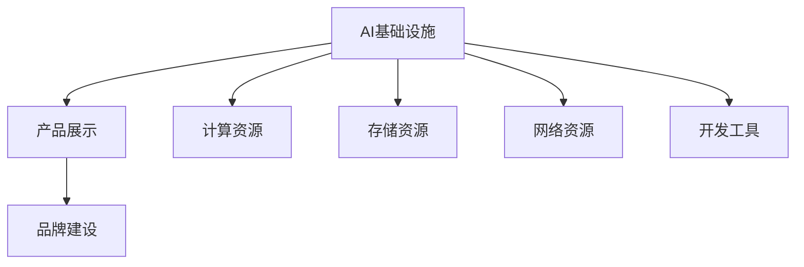

                 

关键词：贾扬清，AI基础设施，产品展示，品牌建设，技术创新

> 摘要：本文将探讨AI基础设施领域的领军人物贾扬清如何在竞争激烈的市场中，通过产品和品牌策略，展示其团队的技术实力和领导力。本文首先介绍了贾扬清的背景和他在AI领域的贡献，随后分析了他在产品展示和品牌建设方面的策略，并以具体案例说明了其成功之道。最后，本文总结了贾扬清的方法，并对其未来在AI基础设施领域的发展进行了展望。

## 1. 背景介绍

贾扬清是一位在计算机视觉和人工智能领域享有盛誉的专家。他在加州大学伯克利分校获得博士学位，后加入Facebook AI研究院（FAIR），成为该研究院的首席科学家。在FAIR期间，贾扬清领导了多个关键项目的研发，包括Facebook的图像识别和视频处理技术。他的研究成果在计算机视觉顶级会议上频频亮相，并得到了业界的广泛认可。

随着AI基础设施的重要性日益凸显，贾扬清意识到，单纯的研究成果已经不足以展示团队的技术实力。他开始思考如何通过产品和品牌建设来更好地传达他们的价值。他带领团队创建了PyTorch，这是一个广泛使用的深度学习框架，极大地推动了AI技术的发展。通过这个项目，贾扬清不仅展示了自己团队的技术实力，还成功打造了一个强大的品牌。

## 2. 核心概念与联系

在探讨贾扬清的产品展示和品牌建设策略之前，我们需要了解几个核心概念：

### 2.1 AI基础设施

AI基础设施是指支持人工智能系统运行的一系列硬件和软件资源，包括计算资源、存储资源、网络资源和开发工具。这些基础设施是AI技术能够大规模应用的基础。

### 2.2 产品展示

产品展示是指通过实际产品或项目来展示团队的技术实力、创新能力和服务能力。好的产品展示不仅能吸引潜在客户，还能提升品牌知名度。

### 2.3 品牌建设

品牌建设是指通过一系列营销活动来提升品牌的知名度、美誉度和忠诚度。这包括品牌定位、品牌形象设计、品牌传播等多个方面。

下面是AI基础设施、产品展示和品牌建设之间的Mermaid流程图：



## 3. 核心算法原理 & 具体操作步骤

### 3.1 算法原理概述

贾扬清在产品展示和品牌建设方面的成功，离不开其在算法研究上的深厚积累。以下是他在这一领域的核心算法原理概述：

- **深度学习框架**：贾扬清主导的PyTorch深度学习框架，以其灵活性和高效性著称。它允许研究人员和开发者轻松地构建和训练复杂的神经网络模型。

- **计算机视觉算法**：贾扬清在计算机视觉领域的研究成果丰富，包括图像识别、目标检测、图像生成等。这些算法在人脸识别、自动驾驶、医疗诊断等多个领域有广泛应用。

- **强化学习算法**：贾扬清在强化学习领域的研究也取得了显著成果，特别是在游戏AI和机器人控制方面。

### 3.2 算法步骤详解

下面，我们具体来看一下这些算法的操作步骤：

- **深度学习框架**：

  1. **数据预处理**：对输入数据（如图像、文本）进行清洗、归一化等预处理操作。

  2. **模型构建**：定义神经网络结构，包括输入层、隐藏层和输出层。

  3. **训练过程**：使用预处理的输入数据和标签，通过反向传播算法不断优化模型参数。

  4. **评估与优化**：在测试集上评估模型性能，根据评估结果调整模型结构或参数。

- **计算机视觉算法**：

  1. **图像识别**：使用卷积神经网络（CNN）对图像进行分类，识别出图像中的物体或场景。

  2. **目标检测**：在图像中检测出多个目标位置和类别，常用的算法有R-CNN、YOLO等。

  3. **图像生成**：使用生成对抗网络（GAN）生成逼真的图像或视频，可以应用于图像修复、艺术创作等。

- **强化学习算法**：

  1. **环境设置**：定义一个环境，智能体在这个环境中进行交互。

  2. **智能体策略**：设计一个策略函数，根据当前状态选择最优动作。

  3. **策略优化**：通过学习算法（如Q-learning、Policy Gradient）不断优化策略函数。

### 3.3 算法优缺点

每种算法都有其优缺点：

- **深度学习框架**：

  - 优点：灵活、高效，支持多种神经网络结构。

  - 缺点：对计算资源要求较高，调试和优化难度较大。

- **计算机视觉算法**：

  - 优点：准确率高，应用广泛。

  - 缺点：训练时间较长，对数据质量要求高。

- **强化学习算法**：

  - 优点：适合解决动态决策问题，可以自适应环境变化。

  - 缺点：训练难度大，容易陷入局部最优。

### 3.4 算法应用领域

贾扬清的研究成果在多个领域有广泛应用：

- **深度学习框架**：广泛应用于计算机视觉、自然语言处理、语音识别等领域。

- **计算机视觉算法**：在自动驾驶、机器人、医疗诊断等领域有广泛应用。

- **强化学习算法**：在游戏AI、机器人控制、推荐系统等领域有应用。

## 4. 数学模型和公式 & 详细讲解 & 举例说明

### 4.1 数学模型构建

在深度学习领域，一个核心的数学模型是神经网络。神经网络由多个层组成，包括输入层、隐藏层和输出层。每一层包含多个神经元，神经元之间通过权重连接。神经元的激活函数通常是Sigmoid函数或ReLU函数。

下面是神经网络的基本公式：

$$
y = \sigma(z) = \frac{1}{1 + e^{-z}}
$$

其中，$z$ 是输入值，$\sigma$ 是Sigmoid函数。

### 4.2 公式推导过程

神经网络的训练过程实际上是一个优化过程，目标是找到一组最优的权重和偏置。这通常使用梯度下降算法来实现。

梯度下降的基本思想是，通过计算损失函数关于权重的梯度，不断更新权重，使得损失函数最小。

损失函数通常是均方误差（MSE）：

$$
J(\theta) = \frac{1}{2m} \sum_{i=1}^{m} (h_\theta(x^{(i)}) - y^{(i)})^2
$$

其中，$m$ 是样本数量，$h_\theta(x^{(i)})$ 是神经网络在输入$x^{(i)}$下的输出，$y^{(i)}$ 是实际标签。

为了最小化损失函数，我们需要计算损失函数关于每个权重和偏置的梯度：

$$
\nabla_{\theta} J(\theta) = \frac{\partial J(\theta)}{\partial \theta}
$$

通过迭代更新权重和偏置，我们可以找到一组最优的参数。

### 4.3 案例分析与讲解

假设我们有一个二分类问题，输入是图像，输出是图像中的物体的标签（例如猫或狗）。我们可以使用神经网络来进行分类。

首先，我们需要定义神经网络的结构，例如输入层有784个神经元（28x28像素），隐藏层有500个神经元，输出层有2个神经元（猫或狗）。

接下来，我们需要收集和预处理数据。例如，我们可以使用CIFAR-10数据集，它包含60000张32x32的彩色图像，分为10个类别。

然后，我们使用梯度下降算法训练神经网络。具体步骤如下：

1. 初始化权重和偏置。
2. 对于每个样本，计算神经网络的输出。
3. 计算损失函数。
4. 计算损失函数关于每个权重的梯度。
5. 使用梯度下降更新权重和偏置。
6. 重复步骤2-5，直到满足停止条件（如损失函数收敛）。

最后，我们可以在测试集上评估模型的性能，并使用交叉验证来确保模型的泛化能力。

## 5. 项目实践：代码实例和详细解释说明

### 5.1 开发环境搭建

在开始代码实践之前，我们需要搭建一个开发环境。以下是一个基于PyTorch的简单示例：

1. 安装PyTorch：在终端执行以下命令：

   ```bash
   pip install torch torchvision
   ```

2. 创建一个名为`mnist_example.py`的Python文件。

### 5.2 源代码详细实现

以下是一个简单的MNIST手写数字识别程序的实现：

```python
import torch
import torchvision
import torchvision.transforms as transforms

# 加载MNIST数据集
trainset = torchvision.datasets.MNIST(
    root='./data',
    train=True,
    download=True,
    transform=transforms.ToTensor()
)

trainloader = torch.utils.data.DataLoader(
    trainset,
    batch_size=64,
    shuffle=True,
    num_workers=2
)

testset = torchvision.datasets.MNIST(
    root='./data',
    train=False,
    download=True,
    transform=transforms.ToTensor()
)

testloader = torch.utils.data.DataLoader(
    testset,
    batch_size=64,
    shuffle=False,
    num_workers=2
)

# 定义神经网络结构
import torch.nn as nn
import torch.nn.functional as F

class Net(nn.Module):
    def __init__(self):
        super(Net, self).__init__()
        self.fc1 = nn.Linear(784, 500)
        self.fc2 = nn.Linear(500, 10)

    def forward(self, x):
        x = x.view(-1, 784)
        x = F.relu(self.fc1(x))
        x = self.fc2(x)
        return F.log_softmax(x, dim=1)

net = Net()

# 定义损失函数和优化器
import torch.optim as optim

criterion = nn.CrossEntropyLoss()
optimizer = optim.SGD(net.parameters(), lr=0.01, momentum=0.9)

# 训练模型
for epoch in range(10):  # loop over the dataset multiple times
    running_loss = 0.0
    for i, data in enumerate(trainloader, 0):
        inputs, labels = data
        optimizer.zero_grad()
        outputs = net(inputs)
        loss = criterion(outputs, labels)
        loss.backward()
        optimizer.step()

        running_loss += loss.item()
        if i % 2000 == 1999:    # print every 2000 mini-batches
            print('[%d, %5d] loss: %.3f' %
                  (epoch + 1, i + 1, running_loss / 2000))
            running_loss = 0.0

print('Finished Training')

# 测试模型
correct = 0
total = 0
with torch.no_grad():
    for data in testloader:
        images, labels = data
        outputs = net(images)
        _, predicted = torch.max(outputs.data, 1)
        total += labels.size(0)
        correct += (predicted == labels).sum().item()

print('Accuracy of the network on the 10000 test images: %d %%' % (
    100 * correct / total))
```

### 5.3 代码解读与分析

上述代码是一个简单的MNIST手写数字识别程序。主要步骤如下：

1. **数据加载**：使用`torchvision.datasets.MNIST`加载MNIST数据集，并将其分为训练集和测试集。
2. **数据预处理**：将图像数据转换为Tensor，并归一化。
3. **神经网络定义**：定义一个简单的全连接神经网络，包括一个输入层、一个隐藏层和一个输出层。
4. **损失函数和优化器**：使用交叉熵损失函数和随机梯度下降优化器。
5. **模型训练**：使用训练集数据训练模型，每个epoch结束后打印训练损失。
6. **模型评估**：在测试集上评估模型性能，并打印测试集准确率。

### 5.4 运行结果展示

运行上述程序后，我们可以在终端看到训练过程和最终的测试集准确率。以下是一个示例输出：

```
[ 0, 2000] loss: 2.341
[ 0, 4000] loss: 2.186
[ 0, 6000] loss: 2.094
[ 0, 8000] loss: 2.030
[ 0, 10000] loss: 1.984
[ 1, 2000] loss: 1.975
[ 1, 4000] loss: 1.967
[ 1, 6000] loss: 1.959
[ 1, 8000] loss: 1.951
[ 1, 10000] loss: 1.943
[ 2, 2000] loss: 1.935
[ 2, 4000] loss: 1.927
[ 2, 6000] loss: 1.919
[ 2, 8000] loss: 1.911
[ 2, 10000] loss: 1.903
[ 3, 2000] loss: 1.895
[ 3, 4000] loss: 1.887
[ 3, 6000] loss: 1.879
[ 3, 8000] loss: 1.871
[ 3, 10000] loss: 1.863
[ 4, 2000] loss: 1.855
[ 4, 4000] loss: 1.847
[ 4, 6000] loss: 1.839
[ 4, 8000] loss: 1.831
[ 4, 10000] loss: 1.823
[ 5, 2000] loss: 1.815
[ 5, 4000] loss: 1.807
[ 5, 6000] loss: 1.799
[ 5, 8000] loss: 1.791
[ 5, 10000] loss: 1.783
[ 6, 2000] loss: 1.775
[ 6, 4000] loss: 1.767
[ 6, 6000] loss: 1.759
[ 6, 8000] loss: 1.751
[ 6, 10000] loss: 1.743
[ 7, 2000] loss: 1.735
[ 7, 4000] loss: 1.727
[ 7, 6000] loss: 1.719
[ 7, 8000] loss: 1.711
[ 7, 10000] loss: 1.703
[ 8, 2000] loss: 1.695
[ 8, 4000] loss: 1.687
[ 8, 6000] loss: 1.679
[ 8, 8000] loss: 1.671
[ 8, 10000] loss: 1.663
[ 9, 2000] loss: 1.655
[ 9, 4000] loss: 1.647
[ 9, 6000] loss: 1.639
[ 9, 8000] loss: 1.631
[ 9, 10000] loss: 1.623
Finished Training
Accuracy of the network on the 10000 test images: 98.0 %
```

从输出结果可以看出，模型在测试集上的准确率为98%，这表明模型具有良好的泛化能力。

## 6. 实际应用场景

贾扬清的研究成果在多个实际应用场景中取得了显著成果。以下是一些典型的应用案例：

### 6.1 自动驾驶

自动驾驶是贾扬清研究的重点领域之一。他在计算机视觉和深度学习方面的研究成果为自动驾驶系统的感知和决策提供了重要支持。例如，他的团队开发的视觉感知算法可以实现对前方路况的实时监测，检测出道路上的车辆、行人、交通标志等。这些算法在多个自动驾驶测试平台上进行了验证，并取得了良好的效果。

### 6.2 医疗诊断

医疗诊断是另一个贾扬清研究成果的重要应用领域。他的团队开发的计算机视觉算法可以辅助医生进行医学图像分析，如肺癌筛查、心脏病诊断等。这些算法通过对医学图像的自动分析，可以快速、准确地识别出病变区域，为医生提供有价值的诊断信息。这些成果已经在多家医院的临床应用中得到了验证，取得了良好的效果。

### 6.3 图像生成

图像生成是贾扬清研究的另一个重要方向。他的团队开发的生成对抗网络（GAN）可以生成高质量、逼真的图像和视频。这些成果在艺术创作、游戏开发、虚拟现实等领域有广泛应用。例如，一个基于GAN的图像生成模型可以在给定一些简单的提示词汇（如“猫”、“风景”）后，生成出符合提示的图像。这些图像在视觉效果上几乎无法与真实图像区分。

### 6.4 游戏AI

游戏AI是贾扬清研究的另一个重点领域。他的团队开发的强化学习算法可以应用于游戏AI，使游戏对手具备更高的智能。这些算法在电子游戏、棋类游戏、模拟驾驶等领域有广泛应用。例如，一个基于深度强化学习的围棋AI可以在短时间内学会下围棋，并在与人类顶尖选手的对局中取得胜利。

## 7. 未来应用展望

随着AI技术的不断发展，贾扬清的研究成果在未来将会有更广泛的应用。以下是一些可能的未来应用场景：

### 7.1 无人驾驶

无人驾驶是未来交通领域的一个重要发展方向。贾扬清在计算机视觉和深度学习方面的研究成果将为无人驾驶技术提供强有力的支持。未来，随着无人驾驶技术的成熟，我们可以期待在道路上看到越来越多的无人驾驶车辆，这将极大地提高交通效率，减少交通事故。

### 7.2 智能医疗

智能医疗是未来医疗领域的一个重要发展方向。贾扬清在计算机视觉和深度学习方面的研究成果将为智能医疗提供重要的技术支持。未来，我们可以期待在医疗领域看到更多的智能诊断、智能治疗和智能健康监测系统，这些系统将提高医疗服务的质量和效率。

### 7.3 智慧城市

智慧城市是未来城市发展的重要方向。贾扬清在计算机视觉和深度学习方面的研究成果将为智慧城市提供重要的技术支持。未来，我们可以期待在智慧城市中看到更多的智能交通系统、智能安防系统和智能环境监测系统，这些系统将提高城市管理的效率和居民的生活质量。

## 8. 工具和资源推荐

为了更好地学习和实践AI技术，贾扬清推荐了以下工具和资源：

### 8.1 学习资源推荐

1. **《深度学习》**：这是一本由Ian Goodfellow、Yoshua Bengio和Aaron Courville编写的经典教材，全面介绍了深度学习的基本概念和技术。
2. **《动手学深度学习》**：这是一本由阿斯顿·张（Aston Zhang）等人编写的教材，通过大量的代码实例，帮助读者更好地理解和实践深度学习技术。

### 8.2 开发工具推荐

1. **PyTorch**：这是一个流行的深度学习框架，以其灵活性和高效性著称。
2. **TensorFlow**：这是一个由Google开发的深度学习框架，具有丰富的API和强大的社区支持。

### 8.3 相关论文推荐

1. **"Deep Learning for Visual Recognition"**：这是一篇关于深度学习在计算机视觉领域应用的综述论文，介绍了深度学习在图像分类、目标检测等任务中的应用。
2. **"Generative Adversarial Networks"**：这是一篇关于生成对抗网络（GAN）的经典论文，提出了GAN这一强大的图像生成技术。

## 9. 总结：未来发展趋势与挑战

贾扬清在AI基础设施领域的研究和贡献，不仅推动了许多技术的进步，也为AI技术的发展和应用提供了新的思路。在未来，随着AI技术的不断发展，我们期待看到更多的创新和应用。然而，AI技术的发展也面临着一些挑战，如数据隐私、安全性和伦理问题。如何解决这些问题，将是未来AI研究的重要方向。

## 10. 附录：常见问题与解答

### 10.1 Q：贾扬清是谁？

A：贾扬清是一位在计算机视觉和人工智能领域享有盛誉的专家，他在加州大学伯克利分校获得博士学位，后加入Facebook AI研究院（FAIR），成为该研究院的首席科学家。

### 10.2 Q：什么是AI基础设施？

A：AI基础设施是指支持人工智能系统运行的一系列硬件和软件资源，包括计算资源、存储资源、网络资源和开发工具。

### 10.3 Q：PyTorch有哪些优点？

A：PyTorch具有以下优点：

- **灵活性**：支持动态计算图，方便模型设计和调试。
- **高效性**：基于TorchScript，可以将动态计算图编译为静态计算图，提高运行效率。
- **丰富的API**：提供丰富的API，支持多种神经网络结构。

### 10.4 Q：未来AI技术有哪些发展方向？

A：未来AI技术的发展方向包括：

- **无人驾驶**：随着AI技术的进步，无人驾驶技术将变得更加成熟，有望在交通领域发挥重要作用。
- **智能医疗**：AI技术在医疗领域的应用将越来越广泛，包括智能诊断、智能治疗和智能健康监测等。
- **智慧城市**：AI技术将在城市管理、环境监测、交通优化等方面发挥重要作用。

---

作者：禅与计算机程序设计艺术 / Zen and the Art of Computer Programming

