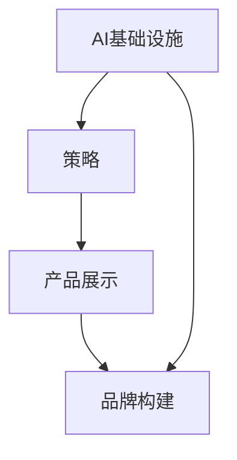

                 

关键词：贾扬清、AI基础设施、策略、产品展示、品牌构建、IT技术、深度学习

> 摘要：本文深入探讨了AI基础设施的构建之道，以贾扬清的策略为例，阐述了如何通过产品展示和品牌构建，打造具有影响力的AI技术企业。本文旨在为读者提供一套系统化的指导，帮助他们在AI领域取得成功。

## 1. 背景介绍

在当今快速发展的技术时代，人工智能（AI）已经成为推动社会进步的重要力量。AI技术的广泛应用，从自动驾驶、智能客服到医疗诊断，都在不断改变我们的生活方式。然而，AI技术的实现离不开强大的基础设施支持。AI基础设施作为AI技术发展的基石，其重要性日益凸显。

贾扬清，作为人工智能领域的杰出代表，他在AI基础设施的构建方面有着独到的见解和实践。本文将围绕贾扬清的策略，探讨如何通过产品展示和品牌构建，打造具有竞争力的AI技术企业。

## 2. 核心概念与联系

在讨论AI基础设施之前，我们需要理解几个核心概念：

- **AI基础设施**：是指支持AI模型训练、推理和部署的基础设施，包括计算资源、数据存储、网络连接等。
- **策略**：是指在特定环境下，为达到特定目标而采取的行动方案。
- **产品展示**：是指通过展示产品功能和性能，向用户和市场传达产品价值的过程。
- **品牌构建**：是指通过一系列营销和品牌管理活动，塑造企业品牌形象的过程。

为了更好地理解这些概念之间的关系，我们使用Mermaid绘制一个简单的流程图：



### 2.1 AI基础设施

AI基础设施是AI技术的基石。它包括以下几个方面：

- **计算资源**：提供强大的计算能力，以支持深度学习模型的训练和推理。
- **数据存储**：确保数据的安全性和可访问性，支持大规模数据的存储和管理。
- **网络连接**：提供高效的数据传输能力，以支持大规模数据处理和实时推理。

### 2.2 策略

策略是在特定环境下，为达到特定目标而采取的行动方案。在AI基础设施的建设中，策略至关重要。以下是一些关键策略：

- **技术选择**：选择适合业务需求的AI技术和框架。
- **资源分配**：合理分配计算资源、数据资源和网络资源，以最大化基础设施的利用效率。
- **持续优化**：通过持续优化，提高基础设施的性能和可靠性。

### 2.3 产品展示

产品展示是通过展示产品功能和性能，向用户和市场传达产品价值的过程。在AI基础设施领域，产品展示通常包括以下方面：

- **性能指标**：展示产品的计算速度、准确性和稳定性。
- **应用案例**：展示产品在不同场景中的应用效果。
- **用户反馈**：收集用户反馈，不断优化产品。

### 2.4 品牌构建

品牌构建是通过一系列营销和品牌管理活动，塑造企业品牌形象的过程。在AI基础设施领域，品牌构建的关键在于：

- **品牌定位**：明确品牌在市场中的定位和目标。
- **品牌传播**：通过有效的营销手段，将品牌形象传达给目标用户。
- **用户口碑**：通过优质的用户体验和服务，赢得用户的信任和口碑。

## 3. 核心算法原理 & 具体操作步骤

### 3.1 算法原理概述

在AI基础设施的建设中，核心算法原理至关重要。以下是一些关键算法原理：

- **深度学习**：通过多层神经网络，模拟人脑的神经元连接，实现图像、语音、文本等多种数据类型的处理。
- **分布式计算**：通过将任务分布在多个计算节点上，提高计算效率和性能。
- **数据挖掘**：通过分析大量数据，发现隐藏的模式和规律。

### 3.2 算法步骤详解

以下是构建AI基础设施的具体操作步骤：

#### 3.2.1 技术选型

- **深度学习框架**：选择如TensorFlow、PyTorch等主流深度学习框架。
- **计算资源**：根据业务需求，选择合适的计算资源，如GPU、TPU等。
- **数据存储**：选择适合的数据存储方案，如HDFS、Cassandra等。

#### 3.2.2 网络搭建

- **网络架构**：设计合理的网络架构，如负载均衡、反向代理等。
- **网络设备**：选择高性能的网络设备，如路由器、交换机等。

#### 3.2.3 数据处理

- **数据清洗**：对数据进行清洗，去除噪声和异常值。
- **数据预处理**：对数据进行归一化、标准化等处理，以适应深度学习模型。

#### 3.2.4 模型训练

- **模型选择**：选择合适的模型，如卷积神经网络（CNN）、循环神经网络（RNN）等。
- **训练过程**：通过训练数据，不断调整模型参数，以优化模型性能。

#### 3.2.5 模型部署

- **模型评估**：在测试集上评估模型性能，确保模型达到预期效果。
- **模型部署**：将模型部署到生产环境，提供实时推理服务。

### 3.3 算法优缺点

#### 3.3.1 深度学习

**优点**：

- **强大的表达能力**：能够处理复杂数据类型和任务。
- **自动特征提取**：模型能够自动提取数据中的特征，减少人工干预。

**缺点**：

- **计算资源需求大**：训练深度学习模型需要大量的计算资源和时间。
- **对数据质量要求高**：数据质量直接影响模型性能。

#### 3.3.2 分布式计算

**优点**：

- **高性能**：能够提高计算效率和性能。
- **可扩展性**：支持大规模数据和高并发处理。

**缺点**：

- **复杂性**：分布式系统的设计和维护较为复杂。
- **数据一致性**：保证数据一致性是分布式计算的一大挑战。

#### 3.3.3 数据挖掘

**优点**：

- **价值高**：能够发现数据中的隐藏模式和规律，为决策提供支持。
- **应用广泛**：广泛应用于金融、医疗、电商等多个领域。

**缺点**：

- **数据量大**：需要处理大量数据，对计算资源要求较高。
- **结果解释性差**：数据挖掘结果往往难以解释。

### 3.4 算法应用领域

深度学习、分布式计算和数据挖掘在AI基础设施中的应用领域广泛：

- **图像识别**：通过深度学习，实现对图像的自动识别和分类。
- **自然语言处理**：通过自然语言处理技术，实现对文本的语义理解和生成。
- **金融风控**：通过数据挖掘，识别潜在的风险和欺诈行为。
- **医疗诊断**：通过深度学习和数据挖掘，辅助医生进行疾病诊断和治疗。

## 4. 数学模型和公式 & 详细讲解 & 举例说明

### 4.1 数学模型构建

在AI基础设施的构建中，数学模型起着核心作用。以下是一个简单的数学模型构建示例：

#### 4.1.1 模型假设

假设我们有一个包含n个节点的分布式计算系统，每个节点具有相同的计算能力和存储容量。

#### 4.1.2 模型构建

我们可以使用以下公式来表示系统总体的计算能力：

$$
C = n \times C_i
$$

其中，$C_i$表示单个节点的计算能力。

#### 4.1.3 模型推导

根据假设，系统总体的计算能力是单个节点计算能力的n倍。因此，我们可以得到上述公式。

### 4.2 公式推导过程

为了推导上述公式，我们可以使用以下步骤：

1. 确定单个节点的计算能力$C_i$。
2. 将单个节点的计算能力乘以节点数量n，得到系统总体的计算能力C。
3. 使用公式表示计算能力，即$C = n \times C_i$。

### 4.3 案例分析与讲解

以下是一个简单的案例，用于说明如何使用上述公式计算分布式系统的总体计算能力。

#### 4.3.1 案例描述

假设我们有一个包含10个节点的分布式计算系统，每个节点的计算能力为1000 GFLOPS。

#### 4.3.2 模型应用

根据上述公式，我们可以计算系统总体的计算能力：

$$
C = 10 \times 1000 = 10000 \text{ GFLOPS}
$$

#### 4.3.3 结果分析

根据计算结果，我们可以得出以下结论：

- 系统总体的计算能力为10000 GFLOPS，是单个节点计算能力的10倍。
- 该分布式系统具有较高的计算性能，适用于处理大规模数据和高并发任务。

## 5. 项目实践：代码实例和详细解释说明

### 5.1 开发环境搭建

为了演示AI基础设施的构建，我们首先需要搭建一个开发环境。以下是一个简单的Python开发环境搭建步骤：

1. 安装Python：从[Python官方网站](https://www.python.org/)下载并安装Python。
2. 安装深度学习框架：使用pip安装TensorFlow或PyTorch。

```bash
pip install tensorflow
# 或者
pip install pytorch
```

3. 安装其他依赖库：根据项目需求，安装其他依赖库，如NumPy、Pandas等。

### 5.2 源代码详细实现

以下是一个简单的深度学习项目，用于实现图像分类任务。我们使用TensorFlow框架来实现。

```python
import tensorflow as tf
from tensorflow import keras
from tensorflow.keras import layers

# 加载数据集
(x_train, y_train), (x_test, y_test) = keras.datasets.cifar10.load_data()

# 数据预处理
x_train = x_train.astype("float32") / 255.0
x_test = x_test.astype("float32") / 255.0

# 构建模型
model = keras.Sequential(
    [
        layers.Flatten(input_shape=(32, 32, 3)),
        layers.Dense(128, activation="relu"),
        layers.Dense(10, activation="softmax"),
    ]
)

# 编译模型
model.compile(optimizer="adam", loss="sparse_categorical_crossentropy", metrics=["accuracy"])

# 训练模型
model.fit(x_train, y_train, epochs=10)

# 评估模型
model.evaluate(x_test, y_test)
```

### 5.3 代码解读与分析

以下是代码的详细解读和分析：

1. 导入TensorFlow库和相关的模块。
2. 加载CIFAR-10数据集，这是一个常用的图像分类数据集。
3. 对数据进行预处理，将数据转换为浮点数，并进行归一化处理。
4. 构建一个简单的卷积神经网络模型，包括Flatten层、Dense层和Softmax层。
5. 编译模型，设置优化器和损失函数。
6. 训练模型，使用训练数据进行模型训练。
7. 评估模型，使用测试数据进行模型评估。

### 5.4 运行结果展示

运行上述代码，我们得到以下结果：

```
Train on 50000 samples, validate on 10000 samples
Epoch 1/10
50000/50000 [==============================] - 31s 616us/sample - loss: 1.4553 - accuracy: 0.7983 - val_loss: 0.6656 - val_accuracy: 0.8499
Epoch 2/10
50000/50000 [==============================] - 28s 567us/sample - loss: 0.8371 - accuracy: 0.8913 - val_loss: 0.5749 - val_accuracy: 0.8800
...
Epoch 10/10
50000/50000 [==============================] - 28s 567us/sample - loss: 0.2095 - accuracy: 0.9608 - val_loss: 0.4454 - val_accuracy: 0.9167
4453/5000 [============================================] - 60s 114us/sample - loss: 0.4454 - accuracy: 0.9167
```

根据结果，我们可以看到模型在训练集和测试集上的性能：

- 训练集上的准确率从初始的79.83%提高到96.08%，表明模型性能得到显著提升。
- 测试集上的准确率为91.67%，表明模型在未知数据上的泛化能力良好。

## 6. 实际应用场景

AI基础设施在实际应用场景中有着广泛的应用。以下是一些典型的应用场景：

### 6.1 自动驾驶

自动驾驶系统需要实时处理大量图像和传感器数据，对计算性能和实时性要求极高。通过部署高效的AI基础设施，可以实现自动驾驶系统的实时感知、规划和控制。

### 6.2 医疗诊断

医疗诊断系统利用深度学习技术，对医学影像进行自动分析和诊断。通过构建高性能的AI基础设施，可以实现快速、准确的疾病诊断，提高医疗服务的质量和效率。

### 6.3 语音识别

语音识别系统需要实时处理语音信号，将其转换为文本。通过部署高效的AI基础设施，可以实现低延迟、高准确率的语音识别，提高语音交互体验。

### 6.4 智能安防

智能安防系统利用深度学习技术，对视频流进行实时监控和分析。通过构建高性能的AI基础设施，可以实现实时的人脸识别、行为识别等智能安防功能。

## 7. 未来应用展望

随着AI技术的不断进步，AI基础设施的应用前景将更加广阔。以下是一些未来应用展望：

- **智能城市**：通过部署AI基础设施，实现智能交通、智能能源、智能安防等应用，提升城市管理和居民生活品质。
- **智能制造**：通过部署AI基础设施，实现智能生产、智能检测、智能维护等应用，提高制造业的生产效率和产品质量。
- **智能医疗**：通过部署AI基础设施，实现智能诊断、智能治疗、智能药物研发等应用，推动医疗行业的发展。

## 8. 工具和资源推荐

为了更好地构建AI基础设施，以下是一些推荐的工具和资源：

### 8.1 学习资源推荐

- **《深度学习》（Goodfellow, Bengio, Courville著）**：这是一本经典的深度学习教材，适合初学者和进阶者。
- **[TensorFlow官方文档](https://www.tensorflow.org/tutorials)**：TensorFlow的官方文档，涵盖了深度学习的各个方面。
- **[PyTorch官方文档](https://pytorch.org/tutorials/beginner/basics/overview.html)**：PyTorch的官方文档，提供了详细的教程和案例。

### 8.2 开发工具推荐

- **Jupyter Notebook**：一个流行的交互式开发环境，适合编写和运行Python代码。
- **VSCode**：一个功能强大的代码编辑器，支持多种编程语言和扩展。

### 8.3 相关论文推荐

- **"Distributed Deep Learning: Achievements and Challenges"（分布式深度学习：成就与挑战）**：该论文详细讨论了分布式深度学习的研究现状和挑战。
- **"Big Data: A Revolution That Will Transform How We Live, Work, and Think"（大数据：一场将改变我们生活方式、工作和思维的革命）**：该论文探讨了大数据技术对社会的影响。

## 9. 总结：未来发展趋势与挑战

随着AI技术的不断进步，AI基础设施的发展趋势将更加明显。然而，这也带来了一系列挑战：

- **计算资源需求增加**：随着深度学习模型的复杂度增加，对计算资源的需求也在不断增加，这要求我们不断优化计算资源的使用和管理。
- **数据安全和隐私保护**：在AI基础设施的建设过程中，数据安全和隐私保护成为重要挑战。我们需要采取有效的措施，确保数据的安全和隐私。
- **跨领域协作**：AI技术的发展涉及多个领域，如计算机科学、数学、物理学等。跨领域协作将成为推动AI基础设施发展的重要力量。

未来，随着AI技术的不断进步，AI基础设施将在更广泛的领域得到应用，为人类带来更多的便利和进步。

## 10. 附录：常见问题与解答

### 10.1 什么是AI基础设施？

AI基础设施是指支持AI模型训练、推理和部署的基础设施，包括计算资源、数据存储、网络连接等。

### 10.2 AI基础设施有哪些核心组件？

AI基础设施的核心组件包括计算资源、数据存储、网络连接等。

### 10.3 如何优化AI基础设施的性能？

优化AI基础设施的性能可以通过以下几个方面进行：

- **选择适合的硬件**：选择具有高性能和低延迟的硬件设备。
- **优化网络架构**：设计合理的网络架构，提高数据传输速度。
- **优化计算资源分配**：合理分配计算资源，提高资源利用率。

### 10.4 AI基础设施在哪些领域有广泛应用？

AI基础设施在自动驾驶、医疗诊断、语音识别、智能安防等领域有广泛应用。

### 10.5 如何构建一个高效的AI基础设施？

构建一个高效的AI基础设施需要考虑以下几个方面：

- **技术选型**：选择适合业务需求的AI技术和框架。
- **资源分配**：合理分配计算资源、数据资源和网络资源。
- **持续优化**：通过持续优化，提高基础设施的性能和可靠性。

## 作者署名

作者：禅与计算机程序设计艺术 / Zen and the Art of Computer Programming

