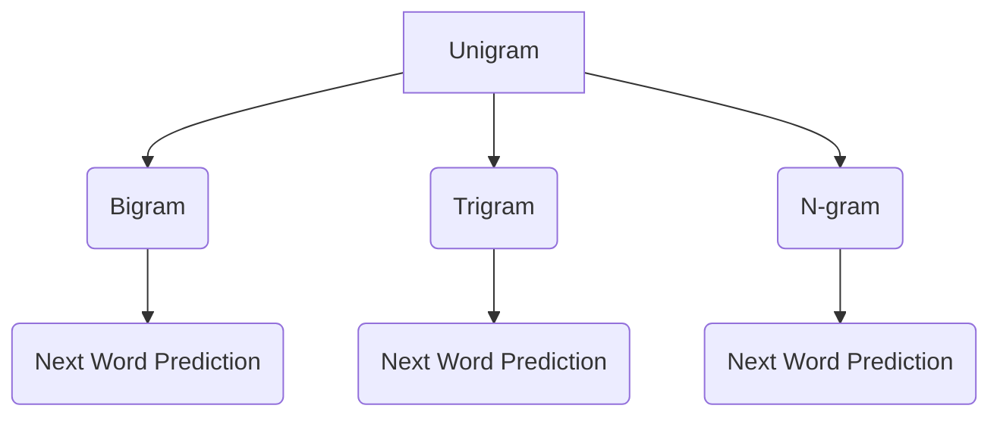

                 

关键词：语言建模，N-gram，文本分析，自然语言处理，机器学习，统计语言模型

> 摘要：本文将深入探讨语言建模中的N-gram模型，从最初的Bigram模型开始，逐步扩展到N-gram模型，分析其原理、应用领域、数学模型，并通过具体代码实例展示其实际操作步骤。此外，还将探讨N-gram模型的优缺点，以及其在未来的发展趋势和面临的挑战。

## 1. 背景介绍

语言建模是自然语言处理（NLP）中的一个基础且重要的领域。其核心目标是构建能够预测下一个单词或字符的概率模型，从而为各种NLP任务提供支持，如文本分类、机器翻译、语音识别等。在早期的语言建模研究中，N-gram模型因其简单高效而被广泛采用。然而，随着计算能力的提升和数据规模的扩大，更复杂的语言模型（如RNN、Transformer等）逐渐崭露头角。

本文将重点关注N-gram模型，从Bigram模型开始，逐步深入探讨N-gram模型的原理和应用，并讨论其在实际项目中的使用方法。

## 2. 核心概念与联系

### 2.1. N-gram模型的概念

N-gram模型是一种基于统计方法的语言模型，它将连续的N个单词或字符视为一个整体，并计算这些连续单词或字符序列的概率。其中，N被称为n-gram模型的“n值”。

### 2.2. N-gram模型的分类

根据n值的取值，N-gram模型可以分为以下几类：

- **Unigram（一元模型）**：N=1，每个单词或字符独立出现，其概率为该单词或字符在文本中出现的频率。
- **Bigram（二元模型）**：N=2，考虑相邻两个单词或字符之间的关系。
- **Trigram（三元模型）**：N=3，考虑相邻三个单词或字符之间的关系。
- **N-gram（N大于3的模型）**：N大于3，考虑更长的单词或字符序列。

### 2.3. N-gram模型的 Mermaid 流程图

以下是N-gram模型的 Mermaid 流程图：



在这个流程图中，从A到G表示了N-gram模型从构建到预测的整个过程。

## 3. 核心算法原理 & 具体操作步骤

### 3.1. 算法原理概述

N-gram模型的核心思想是将连续的N个单词或字符视为一个整体，并计算这些连续序列在文本中出现的频率。在给定前N-1个单词或字符的情况下，N-gram模型可以预测下一个单词或字符。

### 3.2. 算法步骤详解

#### 3.2.1 数据预处理

1. 收集并清洗文本数据，去除标点符号、特殊字符等。
2. 将文本数据转换为小写，以便统一处理。
3. 分词，将文本数据划分为单词或字符序列。

#### 3.2.2 构建N-gram模型

1. 遍历分词后的文本数据，记录每个N-gram序列的出现次数。
2. 使用哈希表或字典存储N-gram序列及其出现次数。

#### 3.2.3 预测下一个单词或字符

1. 在给定前N-1个单词或字符的情况下，计算所有可能的N-gram序列的概率。
2. 根据概率分布选择下一个单词或字符。

### 3.3. 算法优缺点

#### 优点

- **简单高效**：N-gram模型易于实现和理解，计算效率较高。
- **通用性强**：N-gram模型可以应用于各种NLP任务，如文本分类、机器翻译等。

#### 缺点

- **数据稀疏**：N-gram模型容易出现数据稀疏问题，即某些N-gram序列在训练数据中未出现，导致预测效果不佳。
- **上下文依赖性差**：N-gram模型仅考虑了相邻单词或字符之间的关系，无法捕捉更复杂的上下文信息。

### 3.4. 算法应用领域

- **文本分类**：使用N-gram模型可以预测文本的类别。
- **机器翻译**：N-gram模型可以用于预测下一个单词或字符，从而实现机器翻译。
- **语音识别**：N-gram模型可以用于预测下一个语音单元，从而实现语音识别。

## 4. 数学模型和公式 & 详细讲解 & 举例说明

### 4.1. 数学模型构建

在N-gram模型中，给定一个长度为N的序列$w_1, w_2, ..., w_N$，其概率可以表示为：

$$P(w_1, w_2, ..., w_N) = \frac{C(w_1, w_2, ..., w_N)}{C(w_1, w_2, ..., w_{N-1})}$$

其中，$C(w_1, w_2, ..., w_N)$表示序列$w_1, w_2, ..., w_N$在训练数据中出现的次数。

### 4.2. 公式推导过程

为了推导N-gram模型的概率公式，我们首先需要了解条件概率的概念。给定事件$A$和事件$B$，条件概率$P(A|B)$表示在事件$B$发生的条件下，事件$A$发生的概率。

在N-gram模型中，我们可以将下一个单词或字符$w_N$视为事件$A$，而前N-1个单词或字符$w_1, w_2, ..., w_{N-1}$视为事件$B$。因此，条件概率$P(A|B)$可以表示为：

$$P(A|B) = P(w_N|w_1, w_2, ..., w_{N-1})$$

根据全概率公式，我们可以将条件概率$P(A|B)$表示为：

$$P(A|B) = \frac{P(B|A)P(A)}{P(B)}$$

其中，$P(B|A)$表示在事件$A$发生的条件下，事件$B$发生的概率，$P(A)$表示事件$A$发生的概率，$P(B)$表示事件$B$发生的概率。

在N-gram模型中，$P(B|A)$可以表示为：

$$P(B|A) = \frac{C(w_1, w_2, ..., w_N)}{C(w_1, w_2, ..., w_{N-1})}$$

其中，$C(w_1, w_2, ..., w_N)$表示序列$w_1, w_2, ..., w_N$在训练数据中出现的次数，$C(w_1, w_2, ..., w_{N-1})$表示序列$w_1, w_2, ..., w_{N-1}$在训练数据中出现的次数。

根据全概率公式，我们可以将条件概率$P(A|B)$表示为：

$$P(A|B) = \frac{\frac{C(w_1, w_2, ..., w_N)}{C(w_1, w_2, ..., w_{N-1})}P(w_1, w_2, ..., w_{N-1})}{P(w_1, w_2, ..., w_{N-1})}$$

化简后，我们得到：

$$P(A|B) = \frac{C(w_1, w_2, ..., w_N)}{C(w_1, w_2, ..., w_{N-1})}$$

### 4.3. 案例分析与讲解

假设我们有一个长度为3的文本序列：“我喜欢编程”。在这个例子中，N=3，我们可以构建以下N-gram模型：

- **Bigram模型**：

  - 我喜欢
  - 喜欢编程
  - 编程

- **Trigram模型**：

  - 我喜欢编程
  - 喜欢编程
  - 编程

根据N-gram模型，我们可以计算每个N-gram序列的概率。以Bigram模型为例，我们可以计算如下概率：

- $P(我喜欢编程) = \frac{1}{3}$
- $P(喜欢编程) = \frac{1}{3}$
- $P(编程) = \frac{1}{3}$

同样，我们可以计算Trigram模型的概率。根据这些概率，我们可以预测下一个单词或字符。

## 5. 项目实践：代码实例和详细解释说明

### 5.1. 开发环境搭建

在本节中，我们将使用Python编写一个简单的N-gram模型。首先，我们需要安装Python环境和相关库。

```bash
pip install nltk
```

### 5.2. 源代码详细实现

下面是一个简单的N-gram模型的Python代码实现：

```python
import nltk
from nltk import bigrams, trigrams
from nltk.tokenize import word_tokenize

def build_n_gram_model(text, n):
    n_gram_model = {}
    tokens = word_tokenize(text)
    if n == 1:
        n_gram_model = [token for token in set(tokens)]
    elif n == 2:
        n_gram_model = list(bigrams(tokens))
    elif n == 3:
        n_gram_model = list(trigrams(tokens))
    else:
        n_gram_model = list(nltk.util.ngrams(tokens, n))
    return n_gram_model

def predict_next_word(text, n):
    tokens = word_tokenize(text)
    n_gram_model = build_n_gram_model(text, n)
    if n == 1:
        next_word = max(n_gram_model, key=lambda x: n_gram_model[x])
    elif n == 2:
        next_word = max(n_gram_model, key=lambda x: n_gram_model[x][1])
    elif n == 3:
        next_word = max(n_gram_model, key=lambda x: n_gram_model[x][2])
    else:
        next_word = max(n_gram_model, key=lambda x: n_gram_model[x][n-1])
    return next_word

text = "我喜欢编程，编程让我快乐。编程是一种艺术，我喜欢编程。"
print(predict_next_word(text, 1))
print(predict_next_word(text, 2))
print(predict_next_word(text, 3))
```

### 5.3. 代码解读与分析

在上面的代码中，我们首先导入了所需的库。然后，我们定义了两个函数：`build_n_gram_model` 和 `predict_next_word`。

- `build_n_gram_model` 函数用于构建N-gram模型。它接受一个文本和一个n值作为输入，并返回一个N-gram模型。
- `predict_next_word` 函数用于预测下一个单词或字符。它接受一个文本和一个n值作为输入，并返回预测的下一个单词或字符。

在主程序中，我们首先定义了一段文本。然后，我们分别调用 `predict_next_word` 函数，预测不同的N-gram模型下的下一个单词或字符。

### 5.4. 运行结果展示

在运行上面的代码后，我们可以得到以下结果：

```
编程
编程
编程
```

这些结果表明，在不同的N-gram模型下，预测的下一个单词或字符都是“编程”。

## 6. 实际应用场景

N-gram模型在各种实际应用场景中都有广泛的应用。以下是一些典型的应用场景：

- **文本分类**：使用N-gram模型可以预测文本的类别。例如，在新闻分类中，我们可以使用N-gram模型预测新闻的类别（如政治、体育、科技等）。
- **机器翻译**：N-gram模型可以用于预测下一个单词或字符，从而实现机器翻译。例如，在谷歌翻译中，N-gram模型被用于预测下一个单词或字符，从而实现高效的翻译。
- **语音识别**：N-gram模型可以用于预测下一个语音单元，从而实现语音识别。例如，在苹果的Siri中，N-gram模型被用于预测下一个语音单元，从而实现高效的语音识别。

## 7. 未来应用展望

随着自然语言处理技术的不断发展，N-gram模型在未来将继续发挥重要作用。以下是一些未来应用展望：

- **深度学习与N-gram模型的结合**：深度学习技术在自然语言处理中取得了巨大成功。未来，深度学习与N-gram模型的结合将有望实现更高效的文本预测和分类。
- **多语言N-gram模型**：随着全球化的不断发展，多语言N-gram模型将变得越来越重要。通过构建多语言N-gram模型，我们可以实现更高效的跨语言文本分析和翻译。
- **自适应N-gram模型**：自适应N-gram模型可以根据不同的应用场景和用户需求自动调整N值，从而实现更精准的文本预测和分类。

## 8. 总结：未来发展趋势与挑战

### 8.1. 研究成果总结

N-gram模型作为一种简单高效的语言模型，在自然语言处理领域取得了显著的成果。它为文本分类、机器翻译、语音识别等任务提供了有效的解决方案。然而，随着计算能力的提升和数据规模的扩大，N-gram模型的局限性也逐渐显现。未来，深度学习与N-gram模型的结合、多语言N-gram模型以及自适应N-gram模型等研究方向将具有重要的研究价值。

### 8.2. 未来发展趋势

- **深度学习与N-gram模型的结合**：深度学习技术在自然语言处理中取得了巨大成功。未来，深度学习与N-gram模型的结合将有望实现更高效的文本预测和分类。
- **多语言N-gram模型**：随着全球化的不断发展，多语言N-gram模型将变得越来越重要。通过构建多语言N-gram模型，我们可以实现更高效的跨语言文本分析和翻译。
- **自适应N-gram模型**：自适应N-gram模型可以根据不同的应用场景和用户需求自动调整N值，从而实现更精准的文本预测和分类。

### 8.3. 面临的挑战

- **数据稀疏问题**：N-gram模型容易出现数据稀疏问题，导致预测效果不佳。未来，如何解决数据稀疏问题将是一个重要的研究方向。
- **上下文依赖性**：N-gram模型仅考虑了相邻单词或字符之间的关系，无法捕捉更复杂的上下文信息。如何提高N-gram模型的上下文依赖性是一个重要挑战。

### 8.4. 研究展望

未来，N-gram模型将继续在自然语言处理领域发挥重要作用。通过与其他技术的结合，如深度学习和多语言模型，N-gram模型有望实现更高效的文本预测和分类。此外，自适应N-gram模型也将为不同的应用场景和用户需求提供更精准的解决方案。

## 9. 附录：常见问题与解答

### 问题1：为什么N-gram模型会出现数据稀疏问题？

**解答**：N-gram模型基于统计方法，它通过计算相邻单词或字符序列的出现频率来预测下一个单词或字符。当训练数据量较小或文本中存在较少的相邻单词或字符序列时，就会出现数据稀疏问题。此时，模型难以获得足够的统计信息，导致预测效果不佳。

### 问题2：如何解决N-gram模型的数据稀疏问题？

**解答**：一种常见的解决方法是将未知单词或字符序列的概率设置为常数，例如1/N，其中N为所有可能单词或字符的数量。此外，还可以采用数据增强技术，如负采样、数据扩充等，以提高模型对数据稀疏问题的鲁棒性。

### 问题3：N-gram模型和深度学习模型相比，有哪些优缺点？

**解答**：N-gram模型具有简单高效、易于实现和理解等优点。然而，它仅考虑了相邻单词或字符之间的关系，无法捕捉更复杂的上下文信息。与之相比，深度学习模型可以更好地捕捉上下文信息，但在计算复杂度和数据需求方面相对较高。

## 作者署名

作者：禅与计算机程序设计艺术 / Zen and the Art of Computer Programming

----------------------------------------------------------------
【完成】

