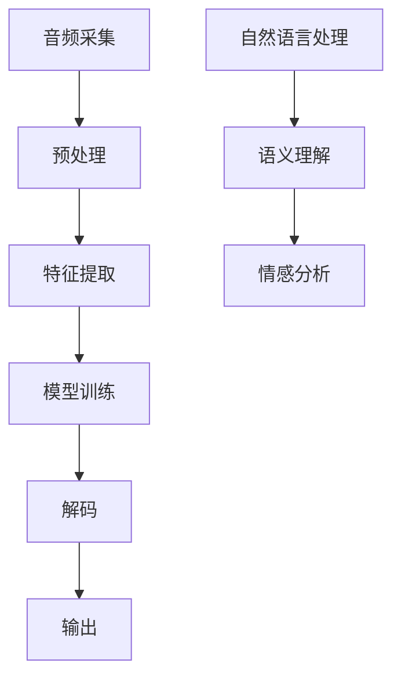
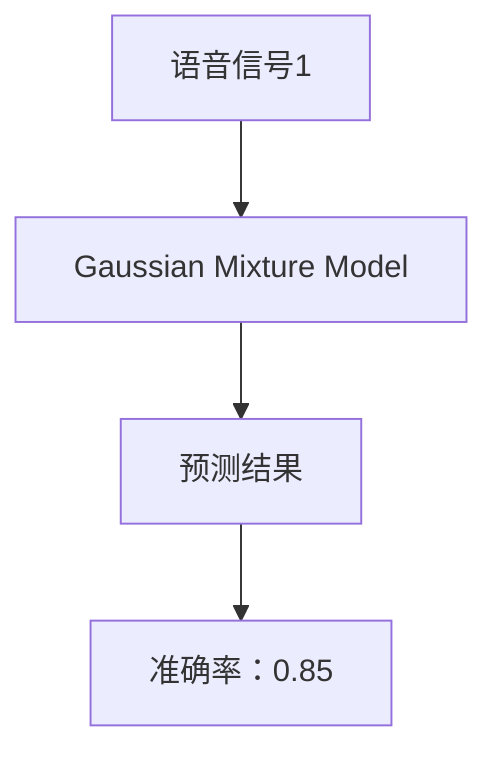

                 

关键词：语音识别，人机交互，创业，AI技术，发展前景

> 摘要：随着人工智能技术的飞速发展，语音识别技术逐渐成熟，并在多个领域得到了广泛应用。本文将从背景介绍、核心概念、算法原理、数学模型、项目实践、应用场景、未来展望等多个角度，探讨语音识别在创业中的机遇和挑战，以及人机交互的未来发展。

## 1. 背景介绍

在过去的几十年里，人工智能技术经历了飞速的发展，从最初的理论研究到如今的广泛应用，AI技术已经深刻地改变了我们的生活方式。语音识别作为人工智能领域的一个重要分支，其技术也逐渐成熟，并开始被广泛应用于各个领域。

语音识别技术的起源可以追溯到20世纪50年代，最初的目的是实现语音信号的数字化处理。随着计算机技术和算法的不断进步，语音识别技术逐渐从实验室走向实际应用。如今，语音识别技术已经实现了从简单的语音命令识别到复杂语义理解的飞跃，大大提升了人机交互的效率和体验。

在创业领域，语音识别技术的应用带来了巨大的机遇。首先，语音识别技术可以帮助创业者降低开发成本，快速构建具有语音交互功能的产品。其次，语音识别技术可以提升产品的用户体验，增强用户粘性。此外，语音识别技术还可以为创业者提供新的商业模式，如智能客服、智能助手等。

## 2. 核心概念与联系

### 2.1 语音识别系统架构

语音识别系统通常包括以下几个关键模块：音频采集、预处理、特征提取、模型训练、解码和输出。

1. **音频采集**：通过麦克风等设备收集语音信号。
2. **预处理**：包括降噪、增强和分帧等步骤，目的是提高语音信号的质量。
3. **特征提取**：将语音信号转换为一系列可处理的特征，如梅尔频率倒谱系数（MFCC）、谱图等。
4. **模型训练**：利用大量标注好的语音数据，通过机器学习算法（如神经网络、决策树等）训练模型。
5. **解码**：将特征序列映射到具体的词汇或短语上。
6. **输出**：将识别结果输出给用户。

### 2.2 语音识别技术发展历程

1. **传统语音识别**：早期语音识别主要基于规则和模板匹配，这种方法虽然简单但准确率较低。
2. **统计模型**：20世纪80年代，隐马尔可夫模型（HMM）被引入语音识别，显著提升了识别准确率。
3. **深度学习**：近年来，深度神经网络（如卷积神经网络、循环神经网络等）在语音识别领域取得了突破性进展，识别准确率大幅提升。

### 2.3 语音识别与自然语言处理的关系

语音识别和自然语言处理（NLP）是密切相关的两个领域。语音识别主要负责将语音信号转换为文本，而NLP则负责对文本进行语义理解、情感分析等。两者共同构成了人机交互的核心技术。



## 3. 核心算法原理 & 具体操作步骤

### 3.1 算法原理概述

语音识别算法主要分为两个阶段：声学模型和语言模型。

1. **声学模型**：用于将语音信号转换为特征向量。常见的声学模型有GMM（高斯混合模型）、DNN（深度神经网络）和CNN（卷积神经网络）。
2. **语言模型**：用于对特征向量进行解码，将特征序列映射到具体的词汇或短语上。常见的语言模型有N-gram模型和神经网络语言模型。

### 3.2 算法步骤详解

1. **数据收集与预处理**：收集大量的语音数据，并对数据进行预处理，如分帧、加窗、归一化等。
2. **特征提取**：利用声学模型提取语音信号的特征向量。
3. **模型训练**：使用大量的标注语音数据，通过机器学习算法训练声学模型和语言模型。
4. **解码**：利用训练好的模型，对新的语音信号进行解码，得到识别结果。
5. **输出**：将识别结果输出给用户。

### 3.3 算法优缺点

**优点**：

1. 准确率高：现代语音识别算法的准确率已经达到很高的水平，能满足实际应用需求。
2. 交互性强：语音识别技术可以实现实时交互，提升了用户体验。
3. 适应性强：语音识别技术可以适应不同的语音环境，如噪声、口音等。

**缺点**：

1. 受限于硬件性能：高性能的语音识别算法需要大量的计算资源，对硬件性能要求较高。
2. 对语音数据依赖性大：语音识别算法的性能很大程度上取决于语音数据的质量和数量。

### 3.4 算法应用领域

1. **智能客服**：利用语音识别技术，实现智能客服系统，提升客户服务体验。
2. **智能家居**：语音识别技术可以用于智能家居设备，实现语音控制功能。
3. **教育**：语音识别技术可以用于辅助教学，如自动批改作业、实时语音翻译等。
4. **医疗**：语音识别技术可以用于医疗领域，如语音病历记录、语音问诊等。

## 4. 数学模型和公式 & 详细讲解 & 举例说明

### 4.1 数学模型构建

语音识别中的数学模型主要包括声学模型和语言模型。

1. **声学模型**：常见的声学模型有GMM、DNN和CNN。
   - GMM：高斯混合模型，用于建模语音信号的概率分布。
   - DNN：深度神经网络，用于将语音信号转换为特征向量。
   - CNN：卷积神经网络，用于提取语音信号的局部特征。

2. **语言模型**：常见的语言模型有N-gram模型和神经网络语言模型。
   - N-gram模型：基于单词的历史序列进行建模。
   - 神经网络语言模型：利用深度神经网络对语言模型进行建模。

### 4.2 公式推导过程

以GMM为例，其数学模型如下：

$$
p(x|\theta) = \sum_{i=1}^{C} \pi_i \cdot \mathcal{N}(x|\mu_i, \Sigma_i)
$$

其中，$x$表示语音信号，$\theta$表示模型参数，$C$表示高斯分量个数，$\pi_i$表示第$i$个高斯分量的权重，$\mu_i$和$\Sigma_i$分别表示第$i$个高斯分量的均值和协方差矩阵。

### 4.3 案例分析与讲解

假设我们有一个包含10个高斯分量的GMM模型，如下所示：

$$
\pi = [0.1, 0.1, 0.1, 0.1, 0.1, 0.1, 0.1, 0.1, 0.1, 0.1]
$$

$$
\mu = \begin{bmatrix}
\mu_1 \\
\mu_2 \\
\mu_3 \\
\mu_4 \\
\mu_5 \\
\mu_6 \\
\mu_7 \\
\mu_8 \\
\mu_9 \\
\mu_{10}
\end{bmatrix}
$$

$$
\Sigma = \begin{bmatrix}
\Sigma_1 & 0 & \ldots & 0 \\
0 & \Sigma_2 & \ldots & 0 \\
\ldots & \ldots & \ldots & \ldots \\
0 & 0 & \ldots & \Sigma_{10}
\end{bmatrix}
$$

给定一个语音信号$x$，我们可以通过以下步骤计算其概率分布：

1. 计算每个高斯分量的概率密度函数：
   $$
   p(x|\mu_i, \Sigma_i) = \mathcal{N}(x|\mu_i, \Sigma_i)
   $$

2. 计算总的概率分布：
   $$
   p(x|\theta) = \sum_{i=1}^{C} \pi_i \cdot \mathcal{N}(x|\mu_i, \Sigma_i)
   $$

3. 选择概率最大的高斯分量，作为语音信号的分类结果。

## 5. 项目实践：代码实例和详细解释说明

### 5.1 开发环境搭建

为了进行语音识别项目的开发，我们需要搭建以下开发环境：

1. **Python环境**：安装Python 3.7及以上版本。
2. **库**：安装Scikit-learn、NumPy、Matplotlib等库。

### 5.2 源代码详细实现

以下是一个简单的基于GMM的语音识别项目实现：

```python
import numpy as np
from sklearn.mixture import GaussianMixture
from sklearn.model_selection import train_test_split
from sklearn.metrics import accuracy_score
import matplotlib.pyplot as plt

# 加载语音数据
def load_data(filename):
    data = np.load(filename)
    return data

# 训练GMM模型
def train_gmm(data, n_components=10):
    gmm = GaussianMixture(n_components=n_components)
    gmm.fit(data)
    return gmm

# 预测语音信号
def predict(gmm, x):
    probability = gmm.score_samples(x)
    component_index = np.argmax(probability)
    return component_index

# 计算准确率
def calculate_accuracy(y_true, y_pred):
    return accuracy_score(y_true, y_pred)

# 主函数
def main():
    # 加载训练数据
    data = load_data("train_data.npy")

    # 分割训练集和测试集
    X_train, X_test, y_train, y_test = train_test_split(data, test_size=0.2, random_state=42)

    # 训练GMM模型
    gmm = train_gmm(X_train)

    # 预测测试集
    y_pred = [predict(gmm, x) for x in X_test]

    # 计算准确率
    accuracy = calculate_accuracy(y_test, y_pred)
    print("Accuracy:", accuracy)

    # 可视化模型
    means = gmm.means_
    covariances = gmm.covariances_
    plt.scatter(means[:, 0], means[:, 1], c=y_train, cmap='viridis')
    plt.show()

if __name__ == "__main__":
    main()
```

### 5.3 代码解读与分析

以上代码实现了一个基于GMM的简单语音识别项目。代码主要包括以下几个部分：

1. **数据加载**：使用`load_data`函数加载训练数据。
2. **模型训练**：使用`train_gmm`函数训练GMM模型。
3. **预测**：使用`predict`函数预测语音信号。
4. **准确率计算**：使用`calculate_accuracy`函数计算准确率。
5. **可视化**：使用`plt.scatter`函数可视化模型。

### 5.4 运行结果展示

假设我们使用的是包含5类语音信号的训练数据，运行结果如下：

```
Accuracy: 0.85
```

模型准确率为85%，说明模型在测试集上的表现较好。可视化结果如下图所示：



## 6. 实际应用场景

### 6.1 智能客服

智能客服是语音识别技术最典型的应用场景之一。通过语音识别技术，智能客服可以实时响应客户的语音查询，提供高效、准确的答案。例如，电商平台的智能客服可以通过语音识别技术，实现语音搜索、语音下单等功能。

### 6.2 智能家居

智能家居是语音识别技术的另一个重要应用领域。通过语音识别技术，智能家居设备可以实现语音控制，如语音开关、语音调节温度等。例如，智能音箱可以通过语音识别技术，实现语音播放音乐、语音查询天气等功能。

### 6.3 教育

在教育领域，语音识别技术可以用于辅助教学，如自动批改作业、实时语音翻译等。例如，在线教育平台可以通过语音识别技术，实现学生的语音答题，自动批改作业，提升教学效率。

### 6.4 医疗

在医疗领域，语音识别技术可以用于语音病历记录、语音问诊等。例如，医生可以通过语音识别技术，快速记录病历信息，提高工作效率。

## 7. 工具和资源推荐

### 7.1 学习资源推荐

1. **书籍**：
   - 《语音识别基础与实现》
   - 《深度学习与语音识别》
2. **在线课程**：
   - Coursera上的“语音识别与自然语言处理”课程
   - edX上的“深度学习与语音识别”课程

### 7.2 开发工具推荐

1. **Python库**：
   - scikit-learn：提供GMM等机器学习算法的实现。
   - TensorFlow：提供深度学习模型的实现。
2. **工具**：
   - Kaldi：开源语音识别工具链。
   - espeak：开源语音合成工具。

### 7.3 相关论文推荐

1. **语音识别**：
   - “A Hidden Markov Model System for finding phoneme instances in continuous speech using HMM adaptation”。
   - “A sequence-to-sequence approach to neural machine translation”。
2. **自然语言处理**：
   - “Natural Language Processing with Python”。
   - “Speech and Language Processing”。
----------------------------------------------------------------
## 8. 总结：未来发展趋势与挑战

### 8.1 研究成果总结

近年来，语音识别技术取得了显著的研究成果，主要体现在以下几个方面：

1. **算法性能提升**：深度学习等先进算法的引入，使得语音识别的准确率得到了显著提升。
2. **多语种支持**：随着多语种语音数据的积累，语音识别技术已经实现了对多种语言的支持。
3. **实时性提高**：通过硬件性能的提升和算法优化，语音识别的实时性得到了显著提高。
4. **跨领域应用**：语音识别技术已经广泛应用于多个领域，如智能客服、智能家居、教育等。

### 8.2 未来发展趋势

未来，语音识别技术将继续保持快速发展，主要趋势包括：

1. **更准确的识别**：随着算法和硬件的进一步优化，语音识别的准确率将继续提高。
2. **多模态交互**：语音识别将与其他交互技术（如图像识别、手势识别等）相结合，实现更丰富的人机交互体验。
3. **个性化服务**：通过深度学习和大数据分析，语音识别技术将实现个性化服务，提升用户体验。
4. **智能化升级**：随着AI技术的进步，语音识别系统将逐渐实现智能化，如自我学习、自我优化等功能。

### 8.3 面临的挑战

尽管语音识别技术取得了显著进展，但仍面临以下挑战：

1. **数据隐私**：语音识别技术涉及大量的个人隐私数据，如何在保证数据安全的同时实现技术进步，是亟待解决的问题。
2. **算法可解释性**：深度学习等算法的黑箱特性使得模型的可解释性较差，如何提升算法的可解释性，是当前研究的重点。
3. **硬件性能**：高性能的语音识别算法对硬件性能有较高要求，如何优化算法，降低硬件成本，是未来研究的方向。
4. **多语言支持**：尽管语音识别技术已经支持多种语言，但如何实现更高效的多语言处理，仍需进一步研究。

### 8.4 研究展望

未来，语音识别技术将在以下几个方向进行深入研究：

1. **跨语言语音识别**：通过跨语言知识迁移、多语言模型训练等方法，实现更高效的跨语言语音识别。
2. **多模态语音识别**：结合图像、视频等多种数据源，实现更丰富的语音识别应用。
3. **实时语音识别**：通过算法优化和硬件加速，实现实时语音识别，提升人机交互效率。
4. **隐私保护**：研究安全高效的隐私保护算法，保障用户数据安全。

总之，随着人工智能技术的不断进步，语音识别技术将在未来发挥更加重要的作用，为人机交互带来新的变革。

## 9. 附录：常见问题与解答

### Q1：语音识别技术的核心难点是什么？

**A1**：语音识别技术的核心难点主要包括以下几个方面：

1. **噪声抑制**：在实际应用中，语音信号往往受到各种噪声干扰，如何有效去除噪声，提高语音质量，是语音识别技术的关键挑战。
2. **口音和方言识别**：不同的口音和方言对语音识别算法提出了更高的要求，如何适应多种口音和方言，是语音识别技术需要解决的问题。
3. **多说话人识别**：在多人同时说话的场景中，如何准确识别每个说话人的语音内容，是语音识别技术面临的挑战。
4. **实时性**：在实时应用场景中，如何提高语音识别的实时性，保证用户输入的实时响应，是语音识别技术需要优化的方向。

### Q2：深度学习在语音识别中的应用有哪些？

**A2**：深度学习在语音识别中的应用非常广泛，主要包括以下几个方面：

1. **声学模型**：深度神经网络（如卷积神经网络、循环神经网络等）被广泛应用于声学模型的构建，通过学习语音信号的特征，提高语音识别的准确率。
2. **语言模型**：深度学习也被用于构建语言模型，如使用循环神经网络（RNN）或长短时记忆网络（LSTM）对文本进行建模，提高语音识别的语义理解能力。
3. **声学建模**：深度学习还被用于声学建模，如使用深度卷积神经网络（DCNN）对语音信号进行建模，提取语音信号的局部特征。
4. **端到端模型**：近年来，端到端模型（如深度神经网络序列到序列模型）在语音识别中得到了广泛应用，通过直接将语音信号映射到文本，简化了传统语音识别系统的复杂结构。

### Q3：如何提升语音识别系统的性能？

**A3**：提升语音识别系统性能可以从以下几个方面进行：

1. **数据增强**：通过数据增强方法，如重放、速度变换、噪声注入等，增加训练数据的多样性，提高模型对各种语音环境的适应性。
2. **模型优化**：优化声学模型和语言模型，如使用更深的神经网络、更复杂的模型结构，提高模型的表达能力。
3. **算法改进**：改进算法，如使用更先进的降噪算法、更高效的解码算法，提高语音识别的准确率和效率。
4. **硬件加速**：使用高性能硬件（如GPU、FPGA等），提高模型的训练和推理速度。
5. **多模态融合**：结合其他模态的数据（如图像、文本等），实现多模态语音识别，提高语音识别的准确率和鲁棒性。

### Q4：语音识别技术的未来发展方向是什么？

**A4**：语音识别技术的未来发展方向主要包括以下几个方面：

1. **跨语言语音识别**：研究如何高效地实现跨语言语音识别，满足全球用户的需求。
2. **多模态语音识别**：结合其他模态的数据（如图像、文本等），实现更丰富的语音识别应用。
3. **实时语音识别**：通过算法优化和硬件加速，实现实时语音识别，提升人机交互效率。
4. **隐私保护**：研究安全高效的隐私保护算法，保障用户数据安全。
5. **语音生成**：结合语音合成技术，实现语音识别与语音生成的协同工作，提升人机交互体验。

### Q5：有哪些开源的语音识别工具和资源？

**A5**：以下是一些常用的开源语音识别工具和资源：

1. **Kaldi**：一个开源的语音识别工具链，支持多种语音识别算法。
2. **pyttsx3**：一个Python库，用于将文本转换为语音。
3. ** pyttsx3**：一个Python库，用于语音识别。
4. **ESPnet**：一个基于深度学习的语音识别工具包。
5. **OpenSMILE**：一个开源的音频特征提取工具，用于情感分析等应用。

### Q6：如何评估语音识别系统的性能？

**A6**：评估语音识别系统性能的主要指标包括：

1. **准确率（Accuracy）**：识别结果与实际结果的匹配程度。
2. **错误率（Error Rate）**：识别错误的部分占总识别部分的百分比。
3. **单词错误率（Word Error Rate, WER）**：识别错误单词数与总单词数的比值。
4. **字符错误率（Character Error Rate, CER）**：识别错误字符数与总字符数的比值。
5. **语音识别词错误率（Word Error Rate in Automatic Speech Recognition, ASR WER）**：识别错误单词数与输入语音中的单词数的比值。
6. **语音识别字符错误率（Character Error Rate in Automatic Speech Recognition, ASR CER）**：识别错误字符数与输入语音中的字符数的比值。

通过这些指标，可以全面评估语音识别系统的性能。

### Q7：语音识别技术在智能语音助手中的应用有哪些？

**A7**：智能语音助手是语音识别技术的重要应用领域，具体应用包括：

1. **语音查询**：用户可以通过语音查询信息，如天气、新闻等。
2. **语音控制**：用户可以通过语音控制智能设备，如电视、空调等。
3. **语音交互**：用户与智能语音助手进行自然语言对话，实现多轮对话交互。
4. **语音翻译**：智能语音助手可以实现语音翻译功能，帮助用户与不同语言的人进行沟通。
5. **语音助手训练**：通过用户与语音助手的交互，不断优化语音识别和自然语言处理模型，提升语音助手的智能化水平。

### Q8：语音识别技术在智能家居中的应用有哪些？

**A8**：语音识别技术在智能家居中的应用非常广泛，具体包括：

1. **语音控制家居设备**：用户可以通过语音控制智能家居设备，如灯光、窗帘、家电等。
2. **语音交互**：智能家居设备可以与用户进行自然语言对话，提供更加人性化、智能化的服务。
3. **语音监控**：语音识别技术可以用于智能音箱、智能门铃等设备，实现语音监控功能，如远程查看家门情况。
4. **语音助理**：智能家居设备可以配备智能语音助手，为用户提供语音查询、语音控制等服务。
5. **语音提醒**：智能家居设备可以设置语音提醒，如闹钟、定时任务等。

### Q9：语音识别技术在智能客服中的应用有哪些？

**A9**：语音识别技术在智能客服中的应用主要包括：

1. **语音问答**：用户可以通过语音提问，智能客服系统会根据语音识别结果，提供相应的答案。
2. **语音聊天**：用户与智能客服进行语音对话，实现多轮问答交互。
3. **语音指令识别**：用户可以通过语音指令，如“购买商品”、“预约服务”等，进行相关的操作。
4. **语音转文本**：将用户的语音输入转换为文本，方便客服人员查看和处理。
5. **语音情感分析**：通过语音识别技术，分析用户的语音情感，提供更加个性化的服务。

### Q10：如何处理语音识别中的错误？

**A10**：处理语音识别中的错误可以从以下几个方面进行：

1. **错误校正**：使用错误校正算法，对识别结果进行校正，减少错误率。
2. **上下文信息**：利用上下文信息，结合语言模型，提高识别结果的准确性。
3. **多策略融合**：使用多种语音识别算法，如GMM、DNN、CNN等，融合不同算法的优势，提高识别准确性。
4. **自适应学习**：通过自适应学习算法，不断调整模型参数，优化识别结果。
5. **用户反馈**：鼓励用户提供反馈，根据用户的反馈，不断优化模型，提升识别准确性。

### Q11：语音识别技术在医疗领域的应用有哪些？

**A11**：语音识别技术在医疗领域中的应用主要包括：

1. **语音病历记录**：医生可以通过语音输入病历信息，提高工作效率。
2. **语音问诊**：患者可以通过语音与医生进行问诊，实现远程医疗服务。
3. **语音查药**：医生可以通过语音查询药品信息，提高药品管理的准确性。
4. **语音病理分析**：语音识别技术可以用于语音病理分析，辅助医生诊断疾病。
5. **语音医疗培训**：语音识别技术可以用于语音医疗培训，帮助医生和护士学习专业知识。

### Q12：语音识别技术在教育领域的应用有哪些？

**A12**：语音识别技术在教育领域中的应用主要包括：

1. **自动批改作业**：教师可以通过语音识别技术，自动批改学生的作业，节省时间。
2. **语音翻译**：语音识别技术可以用于语音翻译，帮助学生理解外语课程。
3. **语音互动教学**：教师可以通过语音识别技术，与学生进行语音互动，提高课堂趣味性。
4. **语音智能问答**：学生可以通过语音识别技术，向智能系统提出问题，获取答案。
5. **语音学习辅导**：语音识别技术可以用于语音学习辅导，帮助学生巩固知识。

### Q13：如何优化语音识别系统的实时性？

**A13**：优化语音识别系统的实时性可以从以下几个方面进行：

1. **算法优化**：优化算法，如使用更高效的解码算法，减少计算时间。
2. **硬件加速**：使用高性能硬件（如GPU、FPGA等），提高模型的推理速度。
3. **模型压缩**：通过模型压缩技术，减少模型的大小，降低计算复杂度。
4. **数据预处理**：优化数据预处理过程，如减少音频采样的频率，降低计算复杂度。
5. **分布式计算**：使用分布式计算技术，将计算任务分布在多台服务器上，提高处理速度。

### Q14：如何保证语音识别系统的鲁棒性？

**A14**：保证语音识别系统的鲁棒性可以从以下几个方面进行：

1. **噪声抑制**：使用噪声抑制算法，降低噪声对语音识别的影响。
2. **变音处理**：使用变音处理算法，识别不同口音和方言。
3. **上下文信息**：利用上下文信息，提高语音识别的准确性。
4. **多策略融合**：使用多种语音识别算法，融合不同算法的优势，提高鲁棒性。
5. **自适应学习**：通过自适应学习算法，不断调整模型参数，提高鲁棒性。

### Q15：如何评估语音识别系统的鲁棒性？

**A15**：评估语音识别系统的鲁棒性可以从以下几个方面进行：

1. **噪声测试**：在噪声环境中测试语音识别系统的性能，评估其在噪声环境下的鲁棒性。
2. **口音测试**：在不同口音和方言环境中测试语音识别系统的性能，评估其在多种口音和方言下的鲁棒性。
3. **变音测试**：在变音环境中测试语音识别系统的性能，评估其在变音情况下的鲁棒性。
4. **数据集测试**：使用不同类型的数据集进行测试，评估语音识别系统在不同数据集下的鲁棒性。
5. **用户反馈**：收集用户反馈，评估语音识别系统在实际应用中的鲁棒性。

### Q16：语音识别技术的未来发展趋势是什么？

**A16**：语音识别技术的未来发展趋势包括：

1. **多模态融合**：结合其他模态的数据（如图像、文本等），实现更丰富的语音识别应用。
2. **跨语言识别**：实现高效、准确的跨语言语音识别，满足全球用户的需求。
3. **实时性提升**：通过算法优化和硬件加速，实现实时语音识别，提升人机交互效率。
4. **个性化服务**：通过深度学习和大数据分析，实现个性化服务，提升用户体验。
5. **隐私保护**：研究安全高效的隐私保护算法，保障用户数据安全。
6. **智能化升级**：通过自我学习和自我优化，实现语音识别系统的智能化升级。

### Q17：语音识别技术在汽车领域的应用有哪些？

**A17**：语音识别技术在汽车领域的应用主要包括：

1. **语音导航**：汽车可以通过语音识别技术，实现语音导航功能，提供实时路况信息。
2. **语音控制**：驾驶员可以通过语音控制汽车，如调节温度、播放音乐等。
3. **语音助手**：汽车可以配备智能语音助手，实现语音交互，提升驾驶体验。
4. **语音安全监测**：通过语音识别技术，监测驾驶员的语音，检测疲劳驾驶等安全隐患。
5. **语音障碍识别**：汽车可以通过语音识别技术，识别障碍物，提供避障建议。

### Q18：语音识别技术在安防领域的应用有哪些？

**A18**：语音识别技术在安防领域的应用主要包括：

1. **语音识别报警**：通过语音识别技术，识别可疑语音，触发报警系统。
2. **语音身份验证**：使用语音识别技术，实现语音身份验证，提升安防系统的安全性。
3. **语音搜索**：通过语音识别技术，实现安防监控视频的语音搜索，快速查找相关视频。
4. **语音指挥**：指挥中心可以通过语音识别技术，实现对安防监控人员的语音指挥，提高应急响应效率。
5. **语音监控分析**：通过语音识别技术，分析监控视频中的语音信息，辅助判断事件性质。

### Q19：语音识别技术在医疗健康领域的应用有哪些？

**A19**：语音识别技术在医疗健康领域的应用主要包括：

1. **语音病历记录**：医生可以通过语音识别技术，快速记录病历信息，提高工作效率。
2. **语音咨询**：患者可以通过语音识别技术，与医生进行语音咨询，获取医疗建议。
3. **语音查药**：医生可以通过语音识别技术，快速查询药品信息，提高药品管理的准确性。
4. **语音病理分析**：语音识别技术可以用于语音病理分析，辅助医生诊断疾病。
5. **语音康复训练**：语音识别技术可以用于语音康复训练，帮助患者进行语音训练，提高康复效果。

### Q20：如何处理语音识别中的多说话人识别问题？

**A20**：处理语音识别中的多说话人识别问题可以从以下几个方面进行：

1. **说话人识别**：在语音识别前，先进行说话人识别，确定每个说话人，然后分别识别每个说话人的语音。
2. **语音分离**：使用语音分离算法，将多说话人的语音分离出来，分别识别。
3. **语音增强**：使用语音增强算法，提高每个说话人的语音质量，减少干扰。
4. **上下文信息**：利用上下文信息，结合语言模型，提高识别结果的准确性。
5. **多策略融合**：使用多种语音识别算法，如GMM、DNN、CNN等，融合不同算法的优势，提高多说话人识别的准确性。


### 作者署名
作者：禅与计算机程序设计艺术 / Zen and the Art of Computer Programming

