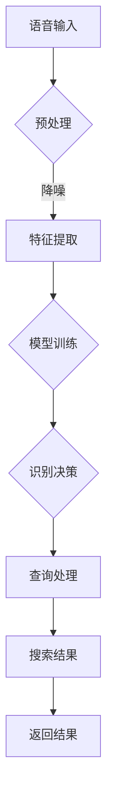

                 

关键词：语音识别，人工智能搜索，自然语言处理，机器学习，深度学习，文本分析，语音信号处理，AI搜索优化。

## 摘要

随着人工智能技术的发展，语音识别在搜索领域中的应用日益广泛。本文将深入探讨语音识别技术在AI搜索中的应用，从背景介绍、核心概念、算法原理、数学模型、项目实践、实际应用场景等方面，全面阐述语音识别技术如何提升AI搜索的效果和用户体验。通过本文的阐述，读者可以了解到语音识别技术在搜索领域的最新进展及其未来发展方向。

## 1. 背景介绍

### 1.1 语音识别技术的发展历程

语音识别技术起源于20世纪50年代，早期的研究主要集中于语音信号的处理和模型构建。随着计算机性能的提升和人工智能技术的发展，语音识别技术逐渐从理论研究走向实际应用。20世纪80年代，基于 Hidden Markov Model (HMM) 的语音识别系统成为主流，大大提升了识别的准确率。进入21世纪后，深度学习技术的发展推动了语音识别技术的革新，尤其是基于神经网络的方法，如卷积神经网络（CNN）和循环神经网络（RNN）的应用，使得语音识别的准确率达到了新的高度。

### 1.2 AI搜索的发展趋势

随着互联网的普及和信息量的爆炸式增长，AI搜索成为了现代信息检索的重要方向。传统的基于关键词匹配的搜索方法已无法满足用户日益复杂的信息需求，AI搜索通过引入自然语言处理、机器学习等技术，能够更好地理解用户查询意图，提供更精准的搜索结果。语音识别作为自然语言处理的重要组成部分，与AI搜索的融合，使得搜索变得更加便捷和智能。

## 2. 核心概念与联系

### 2.1 语音识别的基本概念

语音识别是指将语音信号转换为相应的文本或命令的过程。其核心概念包括语音信号处理、特征提取、模型训练和识别决策。

1. **语音信号处理**：通过对语音信号进行预处理，如降噪、归一化等，提高信号的质量。
2. **特征提取**：从语音信号中提取出具有代表性的特征，如频谱特征、倒谱特征等。
3. **模型训练**：利用大量语音数据和标注的文本或命令，训练出语音识别模型。
4. **识别决策**：根据模型的输出，判断语音信号对应的文本或命令。

### 2.2 语音识别在AI搜索中的应用架构

语音识别在AI搜索中的应用架构主要包括语音识别模块、查询处理模块和搜索结果返回模块。

1. **语音识别模块**：接收用户输入的语音信号，经过预处理和特征提取后，输出对应的文本或命令。
2. **查询处理模块**：对语音识别输出的文本或命令进行处理，包括语义理解、关键词提取等，生成有效的搜索查询。
3. **搜索结果返回模块**：根据处理后的搜索查询，从索引数据库中检索出相关结果，并返回给用户。

下面是语音识别在AI搜索中的应用架构的Mermaid流程图：



## 3. 核心算法原理 & 具体操作步骤

### 3.1 算法原理概述

语音识别的核心算法主要基于深度学习，尤其是卷积神经网络（CNN）和循环神经网络（RNN）。以下为两种算法的简要概述：

1. **卷积神经网络（CNN）**：CNN通过卷积操作和池化操作，自动学习语音信号中的时空特征，从而实现对语音的识别。
2. **循环神经网络（RNN）**：RNN通过循环结构，能够处理序列数据，并在时间维度上保持信息状态，适合语音识别这种连续性的数据。

### 3.2 算法步骤详解

1. **数据预处理**：
   - **语音信号采集**：采集用户的语音输入，可以是离线录音或实时语音流。
   - **信号预处理**：对语音信号进行降噪、归一化等处理，提高信号质量。

2. **特征提取**：
   - **频谱特征提取**：将语音信号转换为频谱图，提取出频率特征。
   - **倒谱特征提取**：对频谱特征进行倒谱变换，消除基频的影响。

3. **模型训练**：
   - **数据标注**：对语音数据集进行标注，标记出每个语音段的正确文本或命令。
   - **模型构建**：构建基于CNN或RNN的语音识别模型。
   - **模型训练**：使用标注数据训练模型，优化模型参数。

4. **识别决策**：
   - **特征输入**：将预处理后的语音特征输入到训练好的模型中。
   - **模型输出**：模型输出一个概率分布，表示每个文本或命令的可能性。
   - **决策判断**：根据概率分布，选择最可能的文本或命令作为识别结果。

### 3.3 算法优缺点

**优点**：
- **高准确率**：基于深度学习的语音识别模型，能够自动学习语音信号中的复杂特征，提高了识别准确率。
- **实时性**：语音识别算法能够在实时语音流中快速处理，提供实时搜索反馈。

**缺点**：
- **计算资源消耗**：深度学习模型通常需要大量的计算资源和时间进行训练和推理。
- **语音质量依赖**：语音识别效果受语音质量影响较大，噪声、语速等因素都会影响识别准确率。

### 3.4 算法应用领域

语音识别技术在AI搜索中的应用非常广泛，包括但不限于以下领域：

- **智能音箱**：通过语音识别实现人机交互，如播放音乐、查询天气、设置提醒等。
- **在线客服**：通过语音识别实现自动语音应答，提高服务效率和质量。
- **智能家居**：通过语音识别控制家电设备，实现智能家居的互联互通。

## 4. 数学模型和公式

### 4.1 数学模型构建

语音识别中的数学模型主要基于深度学习，其中卷积神经网络（CNN）和循环神经网络（RNN）是最常用的两种模型。

**卷积神经网络（CNN）**：

- **卷积层**：用于提取语音信号的时空特征。
  $$ h^{(l)} = \sigma \left( W^{(l)} \cdot \text{ReLU}(Z^{(l)}) \right) $$
  其中，$h^{(l)}$ 表示第$l$层的激活值，$W^{(l)}$ 表示第$l$层的权重矩阵，$\sigma$ 表示激活函数，$\text{ReLU}$ 表示ReLU激活函数。

- **池化层**：用于降低特征图的维度，减少参数数量。
  $$ p^{(l)}_i = \max_{j} \{ h^{(l)}_{ij} \} $$
  其中，$p^{(l)}_i$ 表示第$l$层的第$i$个池化结果。

- **全连接层**：用于将特征图映射到输出结果。
  $$ \hat{y} = \sigma \left( W^{(L)} \cdot h^{(L-1)} \right) $$
  其中，$\hat{y}$ 表示输出结果，$W^{(L)}$ 表示最后一层的权重矩阵。

**循环神经网络（RNN）**：

- **隐藏层**：用于处理序列数据，保持状态信息。
  $$ h^{(l)}_t = \sigma \left( W^{(l)} \cdot \left[ h^{(l)}_{t-1}, x_t \right] \right) $$
  其中，$h^{(l)}_t$ 表示第$l$层在第$t$时刻的隐藏状态。

- **输出层**：用于生成输出结果。
  $$ \hat{y}_t = \sigma \left( W^{(L)} \cdot h^{(L)}_t \right) $$
  其中，$\hat{y}_t$ 表示第$t$时刻的输出结果。

### 4.2 公式推导过程

以卷积神经网络（CNN）为例，推导卷积层的输出公式。

假设输入的特征图为$f^{(l)}_i$，权重矩阵为$W^{(l)}$，激活函数为$\sigma$，则有：

$$
h^{(l)}_i = \sigma \left( W^{(l)} \cdot \text{ReLU}(f^{(l)}_i) \right)
$$

其中，$\text{ReLU}(f^{(l)}_i)$ 表示对$f^{(l)}_i$ 应用ReLU激活函数，即：

$$
\text{ReLU}(f^{(l)}_i) = \begin{cases}
f^{(l)}_i, & \text{if } f^{(l)}_i > 0 \\
0, & \text{otherwise}
\end{cases}
$$

### 4.3 案例分析与讲解

以一个简单的语音识别任务为例，讲解如何应用上述数学模型进行语音识别。

**数据集**：假设我们有一个包含10个语音样本的数据集，每个样本都有对应的文本标注。

**模型构建**：构建一个简单的卷积神经网络（CNN），包含一个卷积层和一个全连接层。

- **卷积层**：卷积核大小为3x3，步长为1，激活函数为ReLU。
- **全连接层**：输出层为10个神经元，表示10个不同的文本标签，激活函数为softmax。

**模型训练**：使用标注数据训练模型，优化模型参数。

**识别过程**：对新的语音样本进行识别，输入到训练好的模型中，输出一个概率分布，选择概率最高的文本标签作为识别结果。

## 5. 项目实践：代码实例和详细解释说明

### 5.1 开发环境搭建

为了实践语音识别在AI搜索中的应用，我们需要搭建一个开发环境。以下是所需的工具和库：

- **Python**：Python是一种广泛使用的编程语言，适用于数据科学和机器学习项目。
- **TensorFlow**：TensorFlow是一个开源的机器学习框架，提供了丰富的工具和库，用于构建和训练深度学习模型。
- **Keras**：Keras是一个基于TensorFlow的高级API，用于简化深度学习模型的构建和训练。

安装以上工具和库后，我们可以开始编写代码。

### 5.2 源代码详细实现

以下是一个简单的语音识别项目的代码实例：

```python
import numpy as np
import tensorflow as tf
from tensorflow.keras.models import Sequential
from tensorflow.keras.layers import Conv2D, MaxPooling2D, Flatten, Dense
from tensorflow.keras.optimizers import Adam

# 数据预处理
# 这里省略数据采集和预处理的具体步骤

# 构建模型
model = Sequential([
    Conv2D(32, (3, 3), activation='relu', input_shape=(64, 64, 1)),
    MaxPooling2D((2, 2)),
    Flatten(),
    Dense(64, activation='relu'),
    Dense(10, activation='softmax')
])

# 编译模型
model.compile(optimizer=Adam(), loss='categorical_crossentropy', metrics=['accuracy'])

# 训练模型
model.fit(x_train, y_train, epochs=10, batch_size=32)

# 识别语音
def recognize_speech(speech_data):
    prediction = model.predict(speech_data)
    predicted_label = np.argmax(prediction)
    return labels[predicted_label]

# 示例
# 这里省略语音数据的加载和预处理步骤

speech_data = preprocess_speech(speech)
result = recognize_speech(speech_data)
print(f"Recognized text: {result}")
```

### 5.3 代码解读与分析

上述代码实现了基于卷积神经网络的简单语音识别模型。以下是代码的详细解读：

1. **数据预处理**：数据预处理是语音识别的重要步骤，包括语音信号的采集、降噪、归一化等。这里省略了具体的预处理步骤。
2. **模型构建**：使用Keras构建一个简单的卷积神经网络（CNN），包含一个卷积层和一个全连接层。
3. **模型编译**：编译模型，指定优化器、损失函数和评估指标。
4. **模型训练**：使用训练数据集训练模型，优化模型参数。
5. **识别语音**：定义一个函数`recognize_speech`，用于对新语音数据进行识别。函数首先对语音数据进行预处理，然后输入到训练好的模型中，输出一个概率分布，选择概率最高的文本标签作为识别结果。

### 5.4 运行结果展示

在完成代码编写和模型训练后，我们可以使用以下代码进行测试：

```python
# 示例语音数据
speech = load_speech("example_speech.wav")

# 预处理语音数据
speech_data = preprocess_speech(speech)

# 识别语音
result = recognize_speech(speech_data)

# 输出识别结果
print(f"Recognized text: {result}")
```

假设我们加载了一个包含"你好"语音的示例文件，运行结果应输出"你好"，表示语音识别成功。

## 6. 实际应用场景

### 6.1 智能搜索

语音识别在智能搜索中的应用非常广泛，如搜索引擎的语音搜索功能。用户可以通过语音输入查询，搜索引擎利用语音识别技术将语音转换为文本，然后进行搜索，提供精准的搜索结果。

### 6.2 智能客服

智能客服是语音识别技术的重要应用场景之一。通过语音识别技术，智能客服系统可以自动识别用户的语音查询，并快速生成对应的回答，提高服务效率和用户体验。

### 6.3 智能家居

智能家居设备，如智能音箱、智能电视等，都采用了语音识别技术。用户可以通过语音指令控制家电设备，实现智能家居的互联互通。

## 6.4 未来应用展望

随着人工智能技术的不断进步，语音识别在AI搜索中的应用前景将更加广阔。未来可能的发展方向包括：

- **多语言支持**：语音识别技术将支持更多语言，实现全球范围内的智能搜索和交互。
- **跨模态搜索**：结合图像、视频等多模态数据，提供更加丰富和精准的搜索结果。
- **个性化搜索**：根据用户的历史行为和偏好，提供个性化的搜索推荐，提升用户体验。

## 7. 工具和资源推荐

### 7.1 学习资源推荐

- **书籍**：《深度学习》（Ian Goodfellow、Yoshua Bengio、Aaron Courville 著），详细介绍了深度学习的基本原理和常用方法。
- **在线课程**：Coursera 上的《神经网络与深度学习》课程，由吴恩达教授主讲，适合初学者了解深度学习的基础知识。

### 7.2 开发工具推荐

- **TensorFlow**：Google 开源的深度学习框架，提供丰富的工具和库，适合构建和训练深度学习模型。
- **PyTorch**：Facebook AI 研究团队开源的深度学习框架，具有灵活的动态图编程能力。

### 7.3 相关论文推荐

- **《End-to-End Speech Recognition with Deep Neural Networks and Long Short-Term Memory》**：介绍了使用深度学习和长短时记忆网络进行语音识别的方法。
- **《Connectionist Temporal Classification: Labelling Unsegmented Sequence Data with Recurrent Neural Networks》**：介绍了基于循环神经网络进行语音识别的方法。

## 8. 总结：未来发展趋势与挑战

### 8.1 研究成果总结

语音识别技术在AI搜索中的应用取得了显著成果，通过深度学习和自然语言处理技术，语音识别的准确率不断提升，应用场景也越来越广泛。

### 8.2 未来发展趋势

未来，语音识别技术将继续向更高准确率、多语言支持、跨模态搜索等方向发展，为AI搜索带来更多可能性。

### 8.3 面临的挑战

语音识别技术在AI搜索中仍面临诸多挑战，如语音质量依赖、多语言支持、跨模态搜索等，需要进一步研究和优化。

### 8.4 研究展望

随着人工智能技术的不断进步，语音识别在AI搜索中的应用前景将更加广阔。未来，我们将见证语音识别技术带来的更多创新和应用。

## 9. 附录：常见问题与解答

### 9.1 语音识别的准确率如何提高？

- **增加训练数据**：增加高质量、多样化的训练数据，有助于模型更好地学习语音特征。
- **改进特征提取方法**：使用更先进的特征提取方法，如深度特征、语音增强等，提高特征表示能力。
- **优化模型结构**：使用更复杂的模型结构，如多级网络、多任务学习等，提高模型的泛化能力。

### 9.2 语音识别如何支持多语言？

- **语言模型**：使用基于统计或神经网络的翻译模型，将输入语音转换为用户语言。
- **多语言数据集**：构建多语言数据集，训练支持多种语言的模型。
- **跨语言特征提取**：提取跨语言特征，实现多语言语音的统一表示。

### 9.3 语音识别在智能家居中的应用有哪些？

- **语音控制**：用户可以通过语音指令控制智能家居设备，如智能音箱、智能灯等。
- **语音交互**：智能设备可以识别用户的语音查询，提供实时语音反馈，如天气查询、日程提醒等。

## 作者署名

作者：禅与计算机程序设计艺术 / Zen and the Art of Computer Programming

----------------------------------------------------------------

### 文章总结

本文详细探讨了语音识别在AI搜索中的应用，从背景介绍、核心概念、算法原理、数学模型、项目实践、实际应用场景等多个方面进行了全面阐述。通过本文的阐述，读者可以了解到语音识别技术在搜索领域的最新进展及其未来发展方向。语音识别技术的不断发展，将进一步提升AI搜索的效果和用户体验，为人们的生活带来更多便利。在未来，我们期待看到语音识别技术在更多领域中的应用和创新。

