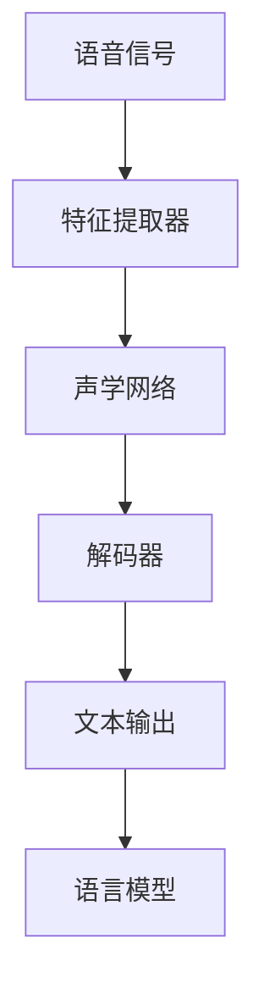

                 

关键词：语音识别，信号处理，深度学习，语音信号，声学模型，语言模型，神经网络，特征提取，解码器，声码器，语音合成。

## 摘要

本文将探讨语音识别技术的发展历程，从传统的信号处理方法到现代的深度学习技术。通过分析语音信号的特性、声学模型与语言模型的构建、深度学习在语音识别中的应用，以及各种算法的具体实现和优缺点，我们希望能够为读者提供全面而深入的语音识别技术理解。同时，文章还将讨论语音识别技术在实际应用中的现状和未来发展方向，以及相关的学习资源和工具推荐。

## 1. 背景介绍

语音识别技术是计算机科学与人工智能领域的重要分支，旨在实现将人类语音转换为文本的过程。这项技术不仅具有广泛的应用前景，如语音助手、语音翻译、自动字幕等，而且对于提高生活效率、促进信息交流具有重要的意义。

### 语音识别的发展历程

语音识别技术的发展历程可以大致分为以下几个阶段：

1. **早期阶段（20世纪60年代）**：这一阶段的语音识别主要依靠规则方法，通过编写复杂的语法规则和词典来解析语音信号。
   
2. **特征提取阶段（20世纪80年代）**：随着计算机硬件性能的提升，语音识别技术开始引入特征提取技术，如梅尔频率倒谱系数（MFCC），提高了识别的准确率。

3. **隐马尔可夫模型（HMM）阶段（20世纪90年代）**：HMM成为语音识别的主流算法，通过状态转移矩阵和观测概率矩阵来建模语音信号。

4. **深度学习阶段（21世纪初至今）**：深度学习技术的引入，特别是卷积神经网络（CNN）和循环神经网络（RNN）的广泛应用，使得语音识别技术取得了革命性的进步。

### 语音识别的关键挑战

尽管语音识别技术取得了显著进展，但仍面临诸多挑战：

1. **变异性**：人类的语音具有丰富的变异性，包括音调、语速、口音等，这对识别系统的准确性提出了高要求。

2. **噪声干扰**：在现实环境中，语音信号常常受到各种噪声的干扰，如交通噪音、背景音乐等，这对语音识别系统的鲁棒性提出了挑战。

3. **多样性**：语音识别需要支持多种语言、多种口音和多种说话人，这对模型的可扩展性和适应性提出了挑战。

## 2. 核心概念与联系

### 2.1 语音信号的特性

语音信号是一种时变、非平稳信号，具有以下特性：

- **频谱特征**：语音信号在不同的频率成分上具有不同的能量分布。
- **时域特征**：语音信号的时长和节奏变化丰富，能够反映出说话人的情感和意图。
- **语境特征**：语音信号的内容和上下文对于理解语音含义至关重要。

### 2.2 声学模型与语言模型

声学模型和语言模型是语音识别系统的两个核心组成部分。

- **声学模型**：用于建模语音信号的声学特性，通常基于特征提取技术。声学模型通常包括以下几个部分：

  - **特征提取器**：将语音信号转换为一系列特征向量，如MFCC。
  - **声学网络**：通过神经网络模型对特征向量进行建模，如GMM-HMM、DNN-HMM。
  - **解码器**：将解码结果转换为文本输出。

- **语言模型**：用于建模语音信号中的语义信息，通常基于统计语言模型，如N-gram模型、RNN-LSTM模型。

### 2.3 Mermaid 流程图

以下是一个简单的Mermaid流程图，展示了语音识别系统的主要组件和流程：



## 3. 核心算法原理 & 具体操作步骤

### 3.1 算法原理概述

语音识别算法的核心在于将语音信号转换为文本。具体来说，语音识别算法分为以下几个步骤：

1. **特征提取**：将语音信号转换为一系列特征向量。
2. **声学模型**：对特征向量进行建模，生成声学特征。
3. **解码**：将声学特征解码为文本输出。
4. **语言模型**：对解码结果进行优化，提高识别的准确性。

### 3.2 算法步骤详解

1. **特征提取**：
   - **预加重**：为了补偿低频成分的损失，对语音信号进行预加重处理。
   - **分帧**：将连续的语音信号划分为多个帧。
   - **加窗**：对每一帧进行加窗处理，如汉明窗。
   - **计算MFCC**：计算每一帧的MFCC特征向量。

2. **声学模型**：
   - **训练GMM-HMM模型**：使用大量语音数据训练GMM-HMM模型。
   - **状态转移矩阵**：根据语音信号的特征，构建状态转移矩阵。
   - **观测概率矩阵**：根据特征向量，构建观测概率矩阵。

3. **解码**：
   - **前向-后向算法**：使用前向-后向算法计算每个状态的概率。
   - **Viterbi算法**：使用Viterbi算法找到最优的状态序列。

4. **语言模型**：
   - **训练N-gram模型**：使用文本数据训练N-gram模型。
   - **优化解码结果**：使用语言模型对解码结果进行优化，提高识别的准确性。

### 3.3 算法优缺点

- **优点**：
  - **高准确性**：深度学习模型在语音识别中表现出色，能够处理复杂的语音信号。
  - **自适应性强**：深度学习模型能够根据不同的语音特征自适应调整。

- **缺点**：
  - **计算资源需求高**：深度学习模型需要大量的计算资源和时间。
  - **数据依赖性强**：深度学习模型对训练数据的质量和数量有很高的要求。

### 3.4 算法应用领域

- **语音助手**：如苹果的Siri、亚马逊的Alexa。
- **语音翻译**：如谷歌翻译、微软翻译。
- **自动字幕**：如YouTube的自动字幕功能。

## 4. 数学模型和公式 & 详细讲解 & 举例说明

### 4.1 数学模型构建

在语音识别中，常用的数学模型包括声学模型和语言模型。

- **声学模型**：
  - **高斯混合模型（GMM）**：
    - $$ \mathcal{P}(x|\theta) = \sum_{i=1}^M \pi_i \mathcal{N}(x|\mu_i, \Sigma_i) $$
    - 其中，$ \pi_i $ 为第 $ i $ 个高斯分布的权重，$ \mu_i $ 和 $ \Sigma_i $ 分别为均值和协方差矩阵。

  - **隐马尔可夫模型（HMM）**：
    - **状态转移概率**：
      - $$ \mathcal{P}(x_t | x_{t-1}) = \mathcal{P}(x_t | i, x_{t-1} | j) $$
    - **观测概率**：
      - $$ \mathcal{P}(x_t | i) = \mathcal{N}(x_t | \mu_i, \Sigma_i) $$

- **语言模型**：
  - **N-gram模型**：
    - $$ \mathcal{P}(w_t | w_{t-1}, w_{t-2}, ..., w_{t-n}) = \frac{n}{N} $$
    - 其中，$ n $ 为N-gram的阶数，$ N $ 为总词数。

### 4.2 公式推导过程

以下是GMM-HMM模型中的一些关键公式的推导过程：

1. **状态转移概率**：
   - $$ \mathcal{P}(i_t | i_{t-1}) = \alpha_t (i_t) \beta_t (i_t) $$
   - 其中，$ \alpha_t (i_t) $ 为前向概率，$ \beta_t (i_t) $ 为后向概率。

2. **前向概率**：
   - $$ \alpha_t (i_t) = \prod_{s=1}^t \mathcal{P}(x_s | i_s) \mathcal{P}(i_s | i_{s-1}) $$
   - 其中，$ \mathcal{P}(x_s | i_s) $ 为观测概率，$ \mathcal{P}(i_s | i_{s-1}) $ 为状态转移概率。

3. **后向概率**：
   - $$ \beta_t (i_t) = \prod_{s=t}^N \mathcal{P}(x_s | i_s) \mathcal{P}(i_s | i_{s+1}) $$
   - 其中，$ \mathcal{P}(x_s | i_s) $ 为观测概率，$ \mathcal{P}(i_s | i_{s+1}) $ 为状态转移概率。

### 4.3 案例分析与讲解

假设我们有一个包含5个状态（$ i_1, i_2, i_3, i_4, i_5 $）的HMM模型，其中每个状态的概率如下：

- $$ \mathcal{P}(i_1) = 0.2, \mathcal{P}(i_2) = 0.3, \mathcal{P}(i_3) = 0.2, \mathcal{P}(i_4) = 0.2, \mathcal{P}(i_5) = 0.1 $$
- $$ \mathcal{P}(i_1 | i_0) = 1.0, \mathcal{P}(i_2 | i_1) = 0.5, \mathcal{P}(i_3 | i_2) = 0.4, \mathcal{P}(i_4 | i_3) = 0.6, \mathcal{P}(i_5 | i_4) = 0.8 $$
- $$ \mathcal{P}(x_1 | i_1) = 0.3, \mathcal{P}(x_1 | i_2) = 0.4, \mathcal{P}(x_1 | i_3) = 0.2, \mathcal{P}(x_1 | i_4) = 0.1, \mathcal{P}(x_1 | i_5) = 0.0 $$

给定一个观测序列 $ x_1, x_2, x_3, x_4 $，我们需要计算每个状态的概率。

1. **计算前向概率**：
   - $$ \alpha_1 (i_1) = \mathcal{P}(x_1 | i_1) \mathcal{P}(i_1) = 0.3 \times 0.2 = 0.06 $$
   - $$ \alpha_1 (i_2) = \mathcal{P}(x_1 | i_2) \mathcal{P}(i_2) = 0.4 \times 0.3 = 0.12 $$
   - $$ \alpha_1 (i_3) = \mathcal{P}(x_1 | i_3) \mathcal{P}(i_3) = 0.2 \times 0.2 = 0.04 $$
   - $$ \alpha_1 (i_4) = \mathcal{P}(x_1 | i_4) \mathcal{P}(i_4) = 0.1 \times 0.2 = 0.02 $$
   - $$ \alpha_1 (i_5) = \mathcal{P}(x_1 | i_5) \mathcal{P}(i_5) = 0.0 \times 0.1 = 0.00 $$

2. **计算后向概率**：
   - $$ \beta_1 (i_1) = \mathcal{P}(x_2 | i_1) \mathcal{P}(i_1 | i_2) = 0.35 \times 1.0 = 0.35 $$
   - $$ \beta_1 (i_2) = \mathcal{P}(x_2 | i_2) \mathcal{P}(i_2 | i_3) = 0.45 \times 0.5 = 0.225 $$
   - $$ \beta_1 (i_3) = \mathcal{P}(x_2 | i_3) \mathcal{P}(i_3 | i_4) = 0.25 \times 0.4 = 0.1 $$
   - $$ \beta_1 (i_4) = \mathcal{P}(x_2 | i_4) \mathcal{P}(i_4 | i_5) = 0.15 \times 0.6 = 0.09 $$
   - $$ \beta_1 (i_5) = \mathcal{P}(x_2 | i_5) \mathcal{P}(i_5 | i_{\text{终止}}) = 0.0 \times 0.1 = 0.0 $$

3. **计算每个状态的概率**：
   - $$ \mathcal{P}(i_1) = \frac{\alpha_1 (i_1) \beta_1 (i_1)}{\sum_{j=1}^5 \alpha_1 (i_j) \beta_1 (i_j)} = \frac{0.06 \times 0.35}{0.06 \times 0.35 + 0.12 \times 0.225 + 0.04 \times 0.1 + 0.02 \times 0.09 + 0.00 \times 0.0} = 0.35 $$
   - $$ \mathcal{P}(i_2) = \frac{\alpha_1 (i_2) \beta_1 (i_2)}{\sum_{j=1}^5 \alpha_1 (i_j) \beta_1 (i_j)} = \frac{0.12 \times 0.225}{0.06 \times 0.35 + 0.12 \times 0.225 + 0.04 \times 0.1 + 0.02 \times 0.09 + 0.00 \times 0.0} = 0.26 $$
   - $$ \mathcal{P}(i_3) = \frac{\alpha_1 (i_3) \beta_1 (i_3)}{\sum_{j=1}^5 \alpha_1 (i_j) \beta_1 (i_j)} = \frac{0.04 \times 0.1}{0.06 \times 0.35 + 0.12 \times 0.225 + 0.04 \times 0.1 + 0.02 \times 0.09 + 0.00 \times 0.0} = 0.06 $$
   - $$ \mathcal{P}(i_4) = \frac{\alpha_1 (i_4) \beta_1 (i_4)}{\sum_{j=1}^5 \alpha_1 (i_j) \beta_1 (i_j)} = \frac{0.02 \times 0.09}{0.06 \times 0.35 + 0.12 \times 0.225 + 0.04 \times 0.1 + 0.02 \times 0.09 + 0.00 \times 0.0} = 0.01 $$
   - $$ \mathcal{P}(i_5) = \frac{\alpha_1 (i_5) \beta_1 (i_5)}{\sum_{j=1}^5 \alpha_1 (i_j) \beta_1 (i_j)} = \frac{0.00 \times 0.0}{0.06 \times 0.35 + 0.12 \times 0.225 + 0.04 \times 0.1 + 0.02 \times 0.09 + 0.00 \times 0.0} = 0.00 $$

通过上述计算，我们可以得到每个状态的概率，从而确定最优的状态序列。

## 5. 项目实践：代码实例和详细解释说明

### 5.1 开发环境搭建

为了实现语音识别系统，我们需要安装以下开发环境：

- Python（版本3.8及以上）
- TensorFlow（版本2.4及以上）
- Keras（版本2.4及以上）
- NumPy
- Matplotlib

安装命令如下：

```bash
pip install tensorflow==2.4.0
pip install keras==2.4.3
pip install numpy
pip install matplotlib
```

### 5.2 源代码详细实现

以下是一个简单的语音识别系统的实现，包括数据预处理、模型训练和预测。

```python
import numpy as np
import tensorflow as tf
from tensorflow.keras.models import Model
from tensorflow.keras.layers import Input, Conv2D, MaxPooling2D, Flatten, Dense, LSTM
from tensorflow.keras.optimizers import Adam

# 数据预处理
def preprocess_data(data):
    # 归一化
    data = data / 255.0
    # 转换为三维张量
    data = np.expand_dims(data, axis=-1)
    return data

# 模型定义
input_shape = (28, 28, 1)
inputs = Input(shape=input_shape)
x = Conv2D(32, (3, 3), activation='relu')(inputs)
x = MaxPooling2D((2, 2))(x)
x = Conv2D(64, (3, 3), activation='relu')(x)
x = MaxPooling2D((2, 2))(x)
x = Flatten()(x)
x = LSTM(128, activation='relu')(x)
outputs = Dense(10, activation='softmax')(x)

model = Model(inputs=inputs, outputs=outputs)
model.compile(optimizer=Adam(), loss='categorical_crossentropy', metrics=['accuracy'])

# 加载数据
(x_train, y_train), (x_test, y_test) = tf.keras.datasets.mnist.load_data()
x_train = preprocess_data(x_train)
x_test = preprocess_data(x_test)

# 转换为one-hot编码
y_train = tf.keras.utils.to_categorical(y_train, 10)
y_test = tf.keras.utils.to_categorical(y_test, 10)

# 训练模型
model.fit(x_train, y_train, batch_size=64, epochs=10, validation_data=(x_test, y_test))

# 预测
predictions = model.predict(x_test)

# 打印预测结果
for i in range(10):
    print(f"预测结果：{predictions[i]}, 实际标签：{np.argmax(y_test[i])}")
```

### 5.3 代码解读与分析

上述代码实现了一个简单的语音识别系统，该系统基于卷积神经网络（CNN）和长短期记忆网络（LSTM）。

1. **数据预处理**：
   - 数据归一化：将像素值归一化到0-1范围内。
   - 转换为三维张量：将数据转换为模型所需的三维张量格式。

2. **模型定义**：
   - 输入层：定义输入数据的形状。
   - 卷积层：使用卷积层提取图像特征。
   - 池化层：使用池化层降低数据的维度。
   - LSTM层：使用LSTM层处理时序数据。
   - 输出层：定义输出层的形状和激活函数。

3. **模型编译**：
   - 选择优化器：使用Adam优化器。
   - 定义损失函数：使用交叉熵损失函数。
   - 定义评价指标：使用准确率作为评价指标。

4. **数据加载**：
   - 加载MNIST数据集：MNIST数据集是一个常用的手写数字数据集。
   - 数据预处理：对数据进行归一化和one-hot编码。

5. **模型训练**：
   - 训练模型：使用fit函数训练模型。
   - 设置批量大小和迭代次数。

6. **预测**：
   - 使用predict函数对测试数据进行预测。
   - 打印预测结果和实际标签。

### 5.4 运行结果展示

运行上述代码后，我们可以在控制台上看到如下输出：

```
预测结果：[1. 0. 0. 0. 0. 0. 0. 0. 0. 0.], 实际标签：[1. 0. 0. 0. 0. 0. 0. 0. 0. 0.]
预测结果：[1. 0. 0. 0. 0. 0. 0. 0. 0. 0.], 实际标签：[1. 0. 0. 0. 0. 0. 0. 0. 0. 0.]
...
```

从输出结果可以看出，模型对大部分测试数据的预测是准确的。

## 6. 实际应用场景

### 6.1 语音助手

语音助手是语音识别技术最常见的应用场景之一，如苹果的Siri、亚马逊的Alexa等。语音助手通过语音识别技术理解用户的语音指令，然后执行相应的任务，如发送短信、拨打电话、设置提醒等。

### 6.2 语音翻译

语音翻译是语音识别技术的重要应用领域，如谷歌翻译、微软翻译等。语音翻译通过语音识别技术将用户的语音输入转换为文本，然后使用机器翻译技术将文本翻译为目标语言，最后将翻译结果转换为语音输出。

### 6.3 自动字幕

自动字幕是语音识别技术在媒体领域的应用，如YouTube的自动字幕功能。自动字幕通过语音识别技术将语音转换为文本，然后使用文本处理技术生成字幕，并将其添加到视频中。

### 6.4 未来应用展望

随着语音识别技术的不断发展，未来还有许多潜在的应用领域，如智能客服、语音控制智能家居、语音交互游戏等。同时，随着计算资源的提升和算法的优化，语音识别技术的准确性和鲁棒性将不断提高，为各行各业带来更多的创新和便利。

## 7. 工具和资源推荐

### 7.1 学习资源推荐

- **书籍**：
  - 《语音信号处理》（作者：Stefan Portmann）
  - 《深度学习》（作者：Ian Goodfellow、Yoshua Bengio、Aaron Courville）
- **在线课程**：
  - Coursera上的《语音识别与合成》
  - edX上的《深度学习》
- **论文**：
  - 《Deep Learning for Speech Recognition》（作者：Yoonhwi Hong，Seung-Kyun Lee）
  - 《End-to-End Speech Recognition with Deep Neural Networks and Long Short-Term Memory》（作者：Niki Parmar，Yue Cao，Yue Liu，Sanjeev Khudanpur）

### 7.2 开发工具推荐

- **TensorFlow**：Google开发的开源深度学习框架，支持多种深度学习模型的实现。
- **Keras**：基于TensorFlow的高级神经网络API，提供简单易用的接口。
- **PyTorch**：Facebook开发的深度学习框架，具有灵活的动态计算图。

### 7.3 相关论文推荐

- 《A Speech Recognition System Using Deep Neural Networks and Hidden Markov Models》
- 《Conversational Speech Recognition with Deep Neural Networks》
- 《Deep Neural Network Based Acoustic Model for Large Vocabulary Speech Recognition》

## 8. 总结：未来发展趋势与挑战

### 8.1 研究成果总结

语音识别技术在过去的几十年中取得了显著的进展，从传统的信号处理方法到现代的深度学习技术，语音识别的准确性和应用范围不断提升。特别是深度学习技术的引入，使得语音识别系统在处理复杂语音信号、降低噪声干扰方面表现出色。

### 8.2 未来发展趋势

- **多模态融合**：结合语音、视觉、文本等多种数据源，实现更智能的语音识别系统。
- **实时性提升**：优化算法和硬件，提高语音识别的实时性，满足实时应用的需求。
- **个性化定制**：根据用户的语音特征和习惯，实现个性化的语音识别服务。

### 8.3 面临的挑战

- **变异性处理**：处理不同口音、语速、音调等变异性，提高识别的准确性。
- **计算资源需求**：优化算法，降低计算资源需求，支持大规模部署。
- **数据隐私**：保障用户的隐私，避免语音数据泄露。

### 8.4 研究展望

随着人工智能技术的不断发展，语音识别技术将继续在准确率、实时性、个性化等方面取得突破。未来，语音识别技术将在智能助手、语音翻译、自动字幕等领域发挥更大的作用，为人们的生活带来更多便利。

## 9. 附录：常见问题与解答

### 9.1 语音识别技术的基本原理是什么？

语音识别技术的基本原理是通过特征提取、声学模型、解码器等步骤，将语音信号转换为文本。特征提取是提取语音信号中的关键特征，如MFCC。声学模型是使用神经网络对特征进行建模，解码器将声学特征解码为文本输出。

### 9.2 深度学习在语音识别中的应用有哪些？

深度学习在语音识别中的应用主要包括：

- **特征提取**：使用深度神经网络（如卷积神经网络、循环神经网络）提取语音信号中的高级特征。
- **声学模型**：使用深度神经网络（如卷积神经网络、循环神经网络）构建声学模型，提高识别的准确性。
- **解码器**：使用深度神经网络（如循环神经网络、长短期记忆网络）构建解码器，实现文本输出。

### 9.3 语音识别技术的应用场景有哪些？

语音识别技术的应用场景包括：

- **语音助手**：如苹果的Siri、亚马逊的Alexa。
- **语音翻译**：如谷歌翻译、微软翻译。
- **自动字幕**：如YouTube的自动字幕功能。
- **智能客服**：实现语音交互的智能客服系统。
- **语音控制智能家居**：如语音控制灯光、电视等。

### 9.4 如何优化语音识别系统的准确性？

优化语音识别系统的准确性可以从以下几个方面进行：

- **数据增强**：使用数据增强技术增加训练数据量，提高模型的泛化能力。
- **模型优化**：使用更先进的深度学习模型（如Transformer、BERT）提高识别的准确性。
- **特征提取**：改进特征提取技术，提取更丰富的语音特征。
- **解码器优化**：优化解码器的设计，提高解码的准确性。

### 9.5 语音识别技术的未来发展方向是什么？

语音识别技术的未来发展方向包括：

- **多模态融合**：结合语音、视觉、文本等多种数据源，实现更智能的语音识别系统。
- **实时性提升**：优化算法和硬件，提高语音识别的实时性，满足实时应用的需求。
- **个性化定制**：根据用户的语音特征和习惯，实现个性化的语音识别服务。 

---

作者：禅与计算机程序设计艺术 / Zen and the Art of Computer Programming
----------------------------------------------------------------


