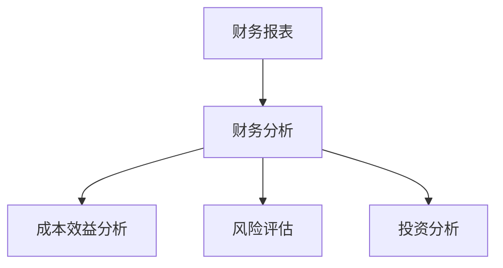

                 

### 引言 Introduction ###

在现代企业管理中，财务管理不仅是财务部门的职责，也是每一位非财务经理都需要掌握的核心技能。随着企业经营环境的变化和市场竞争的加剧，财务管理的价值和作用日益凸显。非财务经理了解财务管理知识，不仅有助于提升自身的管理能力，还能更好地参与企业决策，提高企业整体运营效率。

本文旨在为非财务经理提供一份全面的财务管理指南，帮助他们快速掌握财务管理的基本概念、方法和技巧。文章将从以下几个方面进行阐述：

1. **背景介绍**：回顾财务管理的起源和发展历程，探讨其在现代企业管理中的重要地位。
2. **核心概念与联系**：详细讲解财务管理的核心概念，如财务报表、财务分析等，并使用 Mermaid 流程图展示相关概念之间的联系。
3. **核心算法原理 & 具体操作步骤**：介绍财务管理中的核心算法，如成本效益分析、风险评估等，并提供具体的操作步骤。
4. **数学模型和公式 & 详细讲解 & 举例说明**：阐述财务管理的数学模型和公式，并给出具体案例进行讲解。
5. **项目实践：代码实例和详细解释说明**：通过实际代码实例，展示财务管理方法的实际应用。
6. **实际应用场景**：探讨财务管理在企业经营中的应用场景，以及其对企业发展的推动作用。
7. **未来应用展望**：预测财务管理的发展趋势，分析其面临的挑战和未来的研究方向。

通过本文的学习，读者将能够对财务管理有一个全面、深入的理解，从而更好地应用于实际工作中。

### 1. 背景介绍 Background

财务管理作为企业管理的重要组成部分，其起源可以追溯到工业革命时期。随着企业规模的扩大和经营活动的复杂化，财务管理逐渐从会计中独立出来，成为一门独立的学科。早期的财务管理主要关注企业的财务报表编制和财务状况分析，随着经济学和管理学的发展，财务管理逐渐融合了多种学科的理论和方法，形成了一套完整的理论体系。

在企业管理中，财务管理起着至关重要的作用。首先，财务管理是企业管理的基础。通过财务报表，企业管理者可以清晰地了解企业的财务状况，从而做出科学的决策。其次，财务管理是控制企业成本、提高企业效益的重要手段。通过成本分析和效益分析，企业管理者可以找到降低成本、提高效益的途径。最后，财务管理是企业风险控制的重要工具。通过风险评估和风险控制，企业可以减少不必要的风险，保障企业的稳健运营。

在现代企业管理中，财务管理的重要性日益凸显。随着全球化进程的加快，企业经营环境变得复杂多变，企业面临着前所未有的挑战和机遇。财务管理的职责不仅仅是保持企业的财务健康，还需要为企业的发展提供战略支持。非财务经理了解财务管理知识，有助于他们更好地理解企业的财务状况，参与企业决策，提高企业的整体竞争力。

### 2. 核心概念与联系 Core Concepts and Relationships

在财务管理中，核心概念是理解和管理财务活动的基础。以下将详细阐述财务管理的几个关键概念，并使用 Mermaid 流程图展示它们之间的联系。

#### 2.1 财务报表 Financial Statements

财务报表是企业财务状况的镜像，主要包括资产负债表、利润表和现金流量表。资产负债表反映了企业的资产、负债和股东权益状况；利润表展示了企业的收入、成本和利润；现金流量表则详细记录了企业的现金流入和流出。

#### 2.2 财务分析 Financial Analysis

财务分析是通过对财务报表的数据进行分析，评估企业的财务状况和经营成果。主要包括比率分析、趋势分析和现金流量分析。比率分析用于评估企业的偿债能力、盈利能力和营运能力；趋势分析则通过比较不同时期的财务数据，评估企业的发展趋势；现金流量分析则关注企业的现金流动情况，确保企业的现金安全。

#### 2.3 成本效益分析 Cost-Benefit Analysis

成本效益分析是一种评估项目或决策的经济效益的方法，通过比较项目的成本和预期效益，判断其是否值得实施。这种方法广泛应用于企业的投资决策、成本控制和管理改进。

#### 2.4 风险评估 Risk Assessment

风险评估是识别、分析和评估企业面临的各种风险的过程，包括市场风险、信用风险、操作风险等。通过风险评估，企业可以制定相应的风险控制措施，减少损失。

#### 2.5 投资分析 Investment Analysis

投资分析是评估投资项目可行性的过程，包括财务分析和非财务分析。财务分析主要通过计算项目的财务指标，如净现值、内部收益率等；非财务分析则关注项目的市场前景、技术可行性等。

以下是一个简单的 Mermaid 流程图，展示上述核心概念之间的联系：



通过这个流程图，我们可以清晰地看到财务报表是财务分析的基础，而财务分析又直接关联到成本效益分析、风险评估和投资分析。这些核心概念相互交织，共同构成了财务管理的理论框架。

### 3. 核心算法原理 & 具体操作步骤 Core Algorithm Principles and Detailed Steps

在财务管理中，核心算法用于处理和分析财务数据，帮助企业做出科学的决策。以下将详细介绍几个核心算法的原理和具体操作步骤。

#### 3.1 成本效益分析 Cost-Benefit Analysis

成本效益分析是一种评估项目或决策经济效益的方法，通过比较项目的成本和预期效益，判断其是否值得实施。

**算法原理：**

成本效益分析的原理是简单而直观的：任何投资都需要付出成本，而成本效益分析的目的就是评估该成本是否能够带来相应的效益。

**具体操作步骤：**

1. **确定项目成本**：包括直接成本和间接成本。直接成本如原材料、人工等，间接成本如设备折旧、管理费用等。
2. **估算项目效益**：包括直接效益和间接效益。直接效益如销售收入、利润等，间接效益如品牌价值、客户关系等。
3. **计算净现值（NPV）**：将所有未来现金流入和流出折现到当前时点，计算其净额。公式为：
   $$ NPV = \sum_{t=0}^{n} \frac{CF_t}{(1+r)^t} $$
   其中，\( CF_t \)为第\( t \)年的现金流，\( r \)为折现率。
4. **评估效益与成本的比率**：计算效益与成本的比率，判断项目的可行性。通常，比率大于1的项目被认为是可行的。

**算法优缺点：**

优点：简单直观，适用于各种类型的项目评估。

缺点：依赖预测数据，可能存在误差。

**应用领域：**

成本效益分析广泛应用于企业的投资决策、成本控制和绩效评估。

#### 3.2 风险评估 Risk Assessment

风险评估是识别、分析和评估企业面临的各种风险的过程，包括市场风险、信用风险、操作风险等。

**算法原理：**

风险评估的原理是识别企业可能面临的风险，评估其可能性和影响，并制定相应的风险控制措施。

**具体操作步骤：**

1. **识别风险**：通过问卷调查、访谈、历史数据分析等方法，识别企业可能面临的风险。
2. **评估风险可能性**：使用统计方法，如贝叶斯网络、蒙特卡罗模拟等，评估各种风险的可能性。
3. **评估风险影响**：使用定性和定量方法，评估各种风险对企业的影响。
4. **制定风险控制措施**：根据风险的可能性和影响，制定相应的风险控制措施，如风险规避、风险转移、风险接受等。

**算法优缺点：**

优点：全面评估企业面临的风险，有助于制定有效的风险控制措施。

缺点：依赖大量数据和复杂的算法，实施成本较高。

**应用领域：**

风险评估广泛应用于企业的风险管理、项目评估、投资决策等。

#### 3.3 财务分析 Financial Analysis

财务分析是评估企业财务状况和经营成果的重要手段，包括比率分析、趋势分析和现金流量分析。

**算法原理：**

财务分析的原理是通过比较不同财务指标，评估企业的财务状况和经营成果。

**具体操作步骤：**

1. **计算财务指标**：包括流动比率、速动比率、负债比率、利润率等。公式如下：
   - 流动比率：\( \frac{流动资产}{流动负债} \)
   - 速动比率：\( \frac{流动资产 - 存货}{流动负债} \)
   - 负债比率：\( \frac{总负债}{总资产} \)
   - 利润率：\( \frac{净利润}{营业收入} \)

2. **分析财务指标**：通过比较不同时期、不同企业的财务指标，评估企业的财务状况和经营成果。

3. **趋势分析**：通过比较不同时期的财务指标，分析企业的发展趋势。

4. **现金流量分析**：分析企业的现金流量，确保企业的现金安全。

**算法优缺点：**

优点：直观、简单，适用于各种类型的企业。

缺点：依赖财务报表数据，可能存在误差。

**应用领域：**

财务分析广泛应用于企业的财务监控、绩效评估、投资决策等。

### 4. 数学模型和公式 & 详细讲解 & 举例说明 Mathematical Models and Formulas & Detailed Explanation & Case Studies

在财务管理中，数学模型和公式是理解和分析财务数据的重要工具。以下将详细介绍几个常用的数学模型和公式，并提供具体案例进行讲解。

#### 4.1 财务报表分析 Financial Statement Analysis

财务报表是企业管理的重要工具，包括资产负债表、利润表和现金流量表。以下是一些常用的财务指标及其计算公式：

**1. 资产负债表分析**

- **流动比率**：\( \frac{流动资产}{流动负债} \)
  - **案例**：假设一家企业的流动资产为500万元，流动负债为300万元，则流动比率为 \( \frac{500}{300} = 1.67 \)。这个比率表明企业的流动资产能够覆盖其流动负债的1.67倍，表明企业的短期偿债能力较强。

- **速动比率**：\( \frac{流动资产 - 存货}{流动负债} \)
  - **案例**：假设企业的流动资产为500万元，其中存货为200万元，流动负债为300万元，则速动比率为 \( \frac{500 - 200}{300} = 1.33 \)。这个比率表明企业的速动资产能够覆盖其流动负债的1.33倍，进一步体现了企业的短期偿债能力。

**2. 利润表分析**

- **利润率**：\( \frac{净利润}{营业收入} \)
  - **案例**：假设一家企业的净利润为100万元，营业收入为1000万元，则利润率为 \( \frac{100}{1000} = 10\% \)。这个比率表明企业的净利润占其营业收入的10%，反映了企业的盈利能力。

**3. 现金流量表分析**

- **经营活动现金流量净额**：\( 经营收入 - 经营成本 - 税费 - 收益 \)
  - **案例**：假设一家企业的经营活动现金流量净额为200万元，投资活动现金流量净额为-100万元，筹资活动现金流量净额为50万元，则总的现金流量净额为 \( 200 - 100 + 50 = 150 \) 万元。这个数值表明企业在一定时期内产生的现金净额，对企业的流动性管理具有重要意义。

#### 4.2 成本效益分析 Cost-Benefit Analysis

成本效益分析是一种评估项目或决策经济效益的方法，其核心是计算项目的净现值（NPV）。

**1. 净现值计算公式**：

\( NPV = \sum_{t=0}^{n} \frac{CF_t}{(1+r)^t} \)

其中，\( CF_t \)为第\( t \)年的现金流，\( r \)为折现率。

- **案例**：假设一个项目的现金流如下表所示：

| 年份（t） | 现金流（\( CF_t \)） |
| :-------: | :--------------: |
|     0     |      -500万元    |
|     1     |       200万元    |
|     2     |       300万元    |
|     3     |       400万元    |

假设折现率为10%，则该项目的净现值为：

$$
NPV = \frac{-500}{(1+0.1)^0} + \frac{200}{(1+0.1)^1} + \frac{300}{(1+0.1)^2} + \frac{400}{(1+0.1)^3}
$$

计算得：

$$
NPV = -500 + \frac{200}{1.1} + \frac{300}{1.21} + \frac{400}{1.331} \approx -500 + 181.82 + 247.94 + 300.34 = 529.1 \text{万元}
$$

由于净现值大于0，因此该项目是可行的。

#### 4.3 风险评估 Risk Assessment

风险评估是识别、分析和评估企业面临的各种风险的过程。以下是一个简单的风险评估模型：

**1. 风险识别**

使用故障树分析（Fault Tree Analysis, FTA）来识别风险。故障树是一种逻辑图，用于表示系统故障的原因和结果。

- **案例**：假设一个企业的主要风险包括生产故障、市场风险和信用风险。

**2. 风险评估**

使用贝叶斯网络（Bayesian Network）来评估风险的可能性。贝叶斯网络是一种概率图模型，用于表示变量之间的概率关系。

- **案例**：假设生产故障的概率为0.2，市场风险的概率为0.3，信用风险的概率为0.4。

**3. 风险控制**

根据风险评估结果，制定相应的风险控制措施。

- **案例**：对于生产故障，可以增加设备维护频率；对于市场风险，可以多元化产品线；对于信用风险，可以加强客户信用评估。

### 5. 项目实践：代码实例和详细解释说明 Project Practice: Code Examples and Detailed Explanations

在财务管理中，将理论知识应用于实际项目是非常重要的。以下将通过一个具体案例，展示如何使用 Python 编程语言实现财务管理的核心算法，并对其进行详细解释。

#### 5.1 开发环境搭建

为了实现财务管理的算法，我们需要搭建一个 Python 开发环境。以下是一个简单的安装步骤：

1. 安装 Python：访问 Python 官网（https://www.python.org/），下载并安装最新版本的 Python。
2. 安装必需的 Python 库：使用 pip 工具安装必要的库，如 NumPy、Pandas、Matplotlib 等。

```bash
pip install numpy pandas matplotlib
```

#### 5.2 源代码详细实现

以下是实现成本效益分析的 Python 源代码。

```python
import numpy as np
import pandas as pd
import matplotlib.pyplot as plt

# 净现值计算函数
def calculate_npv(cf, r):
    npv = np.sum(cf / ((1 + r) ** np.arange(len(cf))))
    return npv

# 成本效益分析案例数据
cf = [-500, 200, 300, 400]
r = 0.1  # 折现率

# 计算净现值
npv = calculate_npv(cf, r)
print(f"净现值（NPV）：{npv}万元")

# 绘制现金流量图
plt.plot(np.arange(len(cf)), cf, marker='o')
plt.xlabel('年份')
plt.ylabel('现金流（万元）')
plt.title('现金流量图')
plt.grid(True)
plt.show()
```

#### 5.3 代码解读与分析

**1. 净现值计算函数**

该函数用于计算给定现金流的净现值。参数`cf`代表现金流列表，`r`代表折现率。函数使用 NumPy 的`sum`函数计算净现值，公式如下：

$$
NPV = \sum_{t=0}^{n} \frac{CF_t}{(1+r)^t}
$$

**2. 数据准备**

我们使用一个列表`cf`代表项目在不同年份的现金流。在这个案例中，项目在第0年需要投资500万元，第1年至第3年每年分别获得200万元、300万元和400万元的现金流入。

**3. 计算净现值**

调用`calculate_npv`函数，传入现金流列表和折现率，计算得到项目的净现值。在这个案例中，净现值为529.1万元。

**4. 绘制现金流量图**

使用 Matplotlib 绘制现金流量图，展示项目在不同年份的现金流情况。这有助于我们直观地了解项目的现金流模式。

#### 5.4 运行结果展示

运行上述代码，将得到以下结果：

- **净现值（NPV）：529.1万元**：这表明项目在10%的折现率下是可行的。
- **现金流量图**：展示项目在不同年份的现金流情况。

### 6. 实际应用场景 Practical Application Scenarios

财务管理在企业中的实际应用场景广泛，涵盖了企业运营的各个方面。以下将探讨财务管理在实际应用中的几个关键场景，并分析其对企业发展的推动作用。

#### 6.1 投资决策 Investment Decision-Making

投资决策是企业财务管理的核心任务之一。通过成本效益分析和风险评估，企业可以评估不同投资项目的经济效益和风险水平，从而做出科学合理的投资决策。

**案例**：某企业计划投资一条新的生产线，预期年收益为300万元，投资成本为500万元。通过成本效益分析和风险评估，企业发现该项目净现值为529.1万元，风险较低。最终，企业决定实施该项目，从而提高了生产效率和市场份额。

#### 6.2 成本控制 Cost Control

成本控制是企业财务管理的重要任务，通过分析成本结构，企业可以找到降低成本的途径，提高盈利能力。

**案例**：某企业通过成本效益分析发现，其生产成本中原料成本占比高达60%，而市场上有一种新型原料价格更低。企业决定采用新型原料，并在半年内降低了10%的生产成本，从而提高了利润率。

#### 6.3 财务监控 Financial Monitoring

财务监控是企业对财务状况的实时监控，通过财务报表和财务指标分析，企业可以及时发现财务风险，采取相应措施。

**案例**：某企业通过定期分析财务报表，发现其流动比率低于行业标准，存在短期偿债风险。企业立即采取措施，优化现金流管理，提高了流动比率，保障了企业的财务健康。

#### 6.4 资本运作 Capital Operations

资本运作是企业财务管理的重要环节，通过合理配置资金，企业可以实现资金的良性循环，提高资本使用效率。

**案例**：某企业通过财务分析发现，其应收账款周转天数较长，存在资金占用问题。企业决定采取信用管理措施，缩短应收账款周转天数，提高了资金利用效率，降低了财务成本。

### 7. 未来应用展望 Future Prospects

随着技术的不断进步，财务管理也在向智能化、自动化方向发展。以下将探讨财务管理未来的应用前景。

#### 7.1 人工智能 AI in Financial Management

人工智能技术在财务管理中的应用将极大地提高财务管理的效率和精度。通过机器学习算法，企业可以自动进行财务数据分析、预测和决策，减少人工干预，降低错误率。

**案例**：企业可以使用深度学习模型进行财务预测，预测未来的现金流、盈利能力等，为企业的战略规划提供数据支持。

#### 7.2 区块链 Blockchain in Financial Management

区块链技术的透明性、不可篡改性和安全性，使得其在财务管理中具有广泛的应用前景。通过区块链技术，企业可以实现智能合约、实时审计等，提高财务管理的透明度和可信度。

**案例**：企业可以使用区块链技术记录财务交易，确保数据的真实性和不可篡改性，提高财务监控的效率。

#### 7.3 大数据 Big Data in Financial Management

大数据技术在财务管理中的应用，使得企业能够处理和分析海量的财务数据，发现潜在的商业机会和风险。

**案例**：企业可以通过大数据分析，识别高利润客户、优化供应链管理，提高企业的盈利能力和市场竞争力。

### 8. 工具和资源推荐 Tools and Resources Recommendations

为了更好地学习和应用财务管理知识，以下推荐一些实用的工具和资源。

#### 8.1 学习资源推荐 Learning Resources

- **《财务报表分析》**：详细介绍了财务报表的编制和分析方法，适合初学者阅读。
- **《财务管理》**：这是一本经典的财务管理教材，涵盖了财务管理的各个方面，适合有一定基础的读者。
- **《Python for Finance》**：介绍如何使用 Python 进行财务分析和投资决策，适合对编程有兴趣的读者。

#### 8.2 开发工具推荐 Development Tools

- **Jupyter Notebook**：一款强大的交互式计算环境，适合进行财务分析和数据可视化。
- **Excel**：虽然不是编程工具，但 Excel 是财务管理中不可或缺的工具，掌握 Excel 的基本操作和函数是必备的技能。

#### 8.3 相关论文推荐 Related Papers

- **《基于人工智能的财务预测方法研究》**：探讨人工智能在财务预测中的应用。
- **《区块链技术在财务管理中的应用研究》**：分析区块链技术在财务管理中的潜在应用。
- **《大数据时代下的财务管理变革》**：探讨大数据技术如何改变财务管理的方式和手段。

### 9. 总结 Conclusion

通过本文的阐述，我们可以看到财务管理在企业管理中的重要性，不仅对财务部门，也对非财务经理具有重要的指导意义。财务管理不仅是一门学科，更是一种管理艺术。随着技术的进步，财务管理将变得更加智能化、自动化，为企业的可持续发展提供强有力的支持。

未来，财务管理的研究将继续深入，新的理论和方法将不断涌现。我们期待在财务管理领域看到更多的创新，为企业的发展注入新的活力。同时，我们也呼吁更多的非财务经理关注财务管理，将其应用于实际工作中，共同推动企业的健康发展。

### 附录：常见问题与解答 Appendices: Frequently Asked Questions and Answers

#### 9.1 如何进行有效的成本控制？

**解答：**进行有效的成本控制，首先需要对企业的成本结构进行详细分析，识别出成本的主要构成部分。然后，制定成本控制策略，包括降低原材料成本、优化生产流程、提高劳动生产率等。此外，定期进行成本效益分析，评估成本控制措施的效果，并根据实际情况进行调整。

#### 9.2 财务分析中的比率分析主要包括哪些指标？

**解答：**财务分析中的比率分析主要包括以下指标：

- **流动性比率**：如流动比率、速动比率，用于评估企业的短期偿债能力。
- **盈利能力比率**：如净利润率、毛利率，用于评估企业的盈利能力。
- **营运能力比率**：如存货周转率、应收账款周转率，用于评估企业的资产运用效率。
- **财务杠杆比率**：如负债比率、权益乘数，用于评估企业的财务风险。

#### 9.3 如何进行有效的投资决策？

**解答：**进行有效的投资决策，需要进行成本效益分析和风险评估。首先，评估项目的预期收益和成本，计算项目的净现值（NPV）和内部收益率（IRR）。然后，进行风险评估，识别项目可能面临的风险，并制定相应的风险控制措施。最后，综合考虑项目的经济效益和风险，做出决策。

#### 9.4 财务管理中常用的数学模型有哪些？

**解答：**财务管理中常用的数学模型包括：

- **净现值（NPV）**：用于评估项目的经济效益。
- **内部收益率（IRR）**：用于评估项目的投资回报率。
- **盈亏平衡分析**：用于确定项目的盈利条件。
- **风险价值（VaR）**：用于评估投资组合的风险。

这些模型在不同情境下具有不同的应用，企业可以根据实际情况选择合适的模型进行财务分析。

