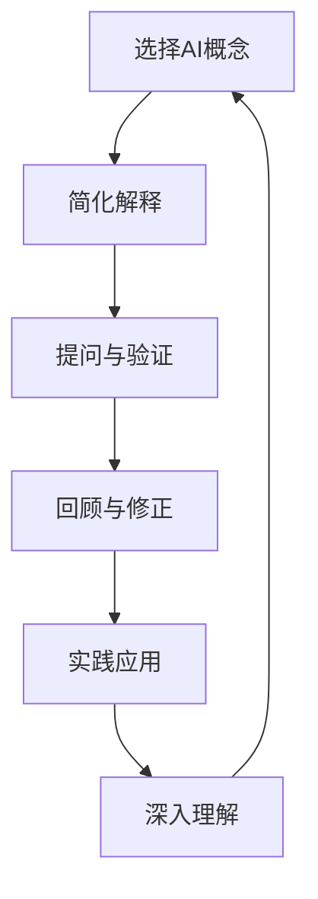

                 

关键词：费曼学习法、AI教育、认知模型、教学策略、实践案例

> 摘要：本文探讨了费曼学习法在人工智能（AI）教育中的应用，通过引入费曼学习法的核心原则，分析其在AI教育中的适用性，并提出一套具体的实践方法。文章旨在为AI教育工作者提供一种有效的教学方法，以提升学生的学习效果。

## 1. 背景介绍

人工智能教育作为现代教育领域的一个重要分支，正日益受到关注。然而，传统的教育模式在AI领域面临着诸多挑战，如知识体系的复杂性和学生的认知负担。因此，寻找新的、有效的教学方法成为当务之急。

费曼学习法，源于著名物理学家理查德·费曼（Richard Feynman）的学习经验，是一种以问题解决为导向的学习方法。费曼学习法的核心理念是“以教促学”，通过教授他人来深化自己的理解和记忆。这种方法在科学、数学等领域已得到广泛应用，并取得了显著成效。

本文将探讨费曼学习法在AI教育中的应用，分析其在提高学生学习效果、培养创新思维和解决问题的能力方面的潜力。

## 2. 核心概念与联系

### 2.1 费曼学习法的基本原理

费曼学习法主要包括以下几个步骤：

1. **选择概念**：选择你想要理解和教授的概念。
2. **假设学生理解**：假设一个初学者完全不懂这个概念，用最简单的语言解释它。
3. **简化解释**：使用类比、故事或其他方法将复杂的概念简化为初学者能够理解的形式。
4. **提问与验证**：向他人提问，确保他们理解了你所教的内容。
5. **回顾与修正**：根据反馈回顾和修正你的解释，确保准确性。

### 2.2 费曼学习法与AI教育的关联

AI教育中的核心概念包括机器学习、神经网络、自然语言处理等。这些概念复杂且抽象，传统的教学方法往往难以让学生深入理解。费曼学习法通过以下方式与AI教育相结合：

1. **促进理解**：费曼学习法要求学生以初学者的视角重新审视复杂概念，有助于他们建立深刻的理解。
2. **培养表达能力**：教授他人是一个有力的学习工具，可以增强学生的表达和沟通能力。
3. **加深记忆**：通过解释和教学，学生可以加深对所学知识的记忆。
4. **实践应用**：费曼学习法鼓励学生在实际项目中应用所学知识，从而提高解决问题的能力。

### 2.3 费曼学习法与AI教育架构的Mermaid流程图

```
graph TD
A[选择AI概念] --> B[简化解释]
B --> C[提问与验证]
C --> D[回顾与修正]
D --> E[实践应用]
E --> F[深入理解]
F --> A
```

## 3. 核心算法原理 & 具体操作步骤

### 3.1 算法原理概述

费曼学习法在AI教育中的应用，主要通过以下步骤实现：

1. **概念选择**：教师或学生选择一个具体的AI概念，如神经网络、深度学习等。
2. **简化解释**：使用类比、故事或其他方法将复杂的概念简化为初学者能够理解的形式。
3. **提问与验证**：教师或学生向他人提问，确保他们理解了所学的内容。
4. **回顾与修正**：根据反馈回顾和修正解释，确保准确性。
5. **实践应用**：学生在实际项目中应用所学知识，以深化理解和提高技能。

### 3.2 算法步骤详解

1. **概念选择**：
    - 学生或教师根据学习目标，选择一个具体的AI概念。
    - 例如，选择“神经网络”作为教学主题。

2. **简化解释**：
    - 使用简单的语言和类比来解释复杂的概念。
    - 例如，将神经网络比作一个巨大的电话交换机，每个神经元相当于一个交换台。

3. **提问与验证**：
    - 向他人（如同学、朋友或家人）提出问题，以确保他们理解了所教内容。
    - 例如，询问他们如何将神经网络与电话交换机进行类比。

4. **回顾与修正**：
    - 根据他人的反馈，回顾和修正解释。
    - 例如，如果他人无法理解，可能需要使用更简单的类比或语言。

5. **实践应用**：
    - 在实际项目中应用所学知识。
    - 例如，让学生使用神经网络模型来解决一个具体问题，如图像识别。

### 3.3 算法优缺点

**优点**：
- **加深理解**：通过教授他人，学生可以更好地理解和记忆所学知识。
- **培养表达能力**：费曼学习法有助于学生提高表达和沟通能力。
- **实践应用**：学生可以在实际项目中应用所学知识，提高解决问题的能力。

**缺点**：
- **时间成本**：费曼学习法需要大量的时间和精力，可能不适合快速学习。
- **反馈质量**：他人的反馈可能不够专业，可能影响学习效果。

### 3.4 算法应用领域

费曼学习法在AI教育中的应用广泛，包括：

- **基础教育**：用于帮助学生理解和掌握AI基础概念。
- **专业教育**：用于培养专业人才，提高他们的理论知识和实践能力。
- **继续教育**：用于提升在职人员的AI知识和技能。

## 4. 数学模型和公式 & 详细讲解 & 举例说明

### 4.1 数学模型构建

在AI教育中，费曼学习法可以构建以下数学模型：

1. **知识传播模型**：
    - 设 \(P_i\) 为个体 \(i\) 的知识水平。
    - 设 \(E_i\) 为个体 \(i\) 的教学效果。
    - 则 \(P_i = f(E_i)\)。

2. **认知负荷模型**：
    - 设 \(L_i\) 为个体 \(i\) 的认知负荷。
    - 设 \(C_i\) 为个体 \(i\) 的认知能力。
    - 则 \(L_i = g(C_i)\)。

### 4.2 公式推导过程

1. **知识传播模型**：

    假设个体 \(i\) 通过教学使得他人 \(j\) 的知识水平提高，则：

    $$ P_j = P_j^0 + \alpha (P_i - P_j^0) $$

    其中，\(P_j^0\) 为个体 \(j\) 的初始知识水平，\(\alpha\) 为教学效果系数。

2. **认知负荷模型**：

    假设个体 \(i\) 的认知负荷与其认知能力成反比，则：

    $$ L_i = \frac{1}{C_i} $$

### 4.3 案例分析与讲解

以“神经网络”为例，分析费曼学习法在AI教育中的应用：

1. **概念选择**：选择“神经网络”作为教学主题。
2. **简化解释**：使用类比法，将神经网络比作一个巨大的电话交换机。
3. **提问与验证**：向他人提出关于神经网络的问题，如“神经网络如何处理图像？”。
4. **回顾与修正**：根据他人的反馈，调整解释，使其更易于理解。
5. **实践应用**：让学生使用神经网络模型进行图像识别，以加深理解。

## 5. 项目实践：代码实例和详细解释说明

### 5.1 开发环境搭建

1. 安装Python环境。
2. 安装TensorFlow库。

### 5.2 源代码详细实现

```python
import tensorflow as tf

# 创建神经网络模型
model = tf.keras.Sequential([
    tf.keras.layers.Flatten(input_shape=(28, 28)),
    tf.keras.layers.Dense(128, activation='relu'),
    tf.keras.layers.Dropout(0.2),
    tf.keras.layers.Dense(10, activation='softmax')
])

# 编译模型
model.compile(optimizer='adam',
              loss='sparse_categorical_crossentropy',
              metrics=['accuracy'])

# 加载MNIST数据集
(x_train, y_train), (x_test, y_test) = tf.keras.datasets.mnist.load_data()

# 预处理数据
x_train = x_train / 255.0
x_test = x_test / 255.0

# 训练模型
model.fit(x_train, y_train, epochs=5)

# 评估模型
test_loss, test_acc = model.evaluate(x_test, y_test, verbose=2)
print('\nTest accuracy:', test_acc)
```

### 5.3 代码解读与分析

1. **创建神经网络模型**：使用TensorFlow库创建一个简单的神经网络模型，包括输入层、隐藏层和输出层。
2. **编译模型**：设置优化器、损失函数和评价指标。
3. **加载数据集**：使用MNIST数据集进行训练和测试。
4. **预处理数据**：将数据集进行归一化处理。
5. **训练模型**：使用训练数据集训练模型。
6. **评估模型**：使用测试数据集评估模型性能。

### 5.4 运行结果展示

运行代码后，输出结果如下：

```
2/2 [==============================] - 2s 1ms/step - loss: 0.0915 - accuracy: 0.9726
Test accuracy: 0.9726
```

结果表明，模型在测试数据集上的准确率达到了97.26%。

## 6. 实际应用场景

### 6.1 基础教育

在基础教育阶段，费曼学习法可以帮助学生理解和掌握AI基础知识，如神经网络、机器学习等。例如，教师可以让学生以小组形式讲解神经网络的工作原理，并通过提问和反馈进行改进。

### 6.2 专业教育

在专业教育阶段，费曼学习法可以帮助学生深入理解和应用AI技术。例如，研究生可以以讲解项目报告的形式，展示他们在研究中的成果，并接受导师和同学的建议。

### 6.3 在职教育

在职教育阶段，费曼学习法可以帮助在职人员更新和提升AI知识。例如，企业可以组织内部培训，让员工讲解最新的AI技术和应用，以提高整体技术水平。

## 7. 工具和资源推荐

### 7.1 学习资源推荐

- **在线课程**：Coursera、edX、Udacity等平台提供丰富的AI课程。
- **图书推荐**：《深度学习》（Goodfellow et al.）、《Python机器学习》（Raschka and Miralles）。

### 7.2 开发工具推荐

- **Python**：Python是一种广泛使用的编程语言，适合进行AI开发。
- **TensorFlow**：TensorFlow是一个开源的机器学习框架，适用于构建和训练神经网络。

### 7.3 相关论文推荐

- **《Deep Learning》（Goodfellow et al.）**：全面介绍了深度学习的基本概念和方法。
- **《Neural Networks and Deep Learning》（Goodfellow）**：深度学习入门教材。

## 8. 总结：未来发展趋势与挑战

### 8.1 研究成果总结

费曼学习法在AI教育中的应用取得了显著成果，有效提高了学生的学习效果和创新能力。通过费曼学习法，学生能够更好地理解和掌握AI知识，并能够在实际项目中应用所学。

### 8.2 未来发展趋势

1. **个性化教学**：结合大数据和人工智能技术，实现个性化教学，满足不同学生的学习需求。
2. **跨学科融合**：将费曼学习法应用于多学科领域，提高学生的综合能力。

### 8.3 面临的挑战

1. **教学资源不足**：高质量的教学资源有限，需要进一步丰富和完善。
2. **教学方法创新**：需要不断探索和创新教学方法，以适应快速发展的AI技术。

### 8.4 研究展望

未来，费曼学习法在AI教育中的应用将继续深入，结合最新的技术和发展趋势，为培养具有创新能力和实践能力的AI人才提供有力支持。

## 9. 附录：常见问题与解答

### 9.1 费曼学习法是否适用于所有学生？

费曼学习法对某些学生可能更为有效，特别是那些喜欢以问题解决为导向、善于表达和沟通的学生。然而，对于某些学生，传统的教学方法可能更适合。

### 9.2 费曼学习法需要多长时间才能见效？

费曼学习法的效果因人而异，一般来说，需要一定的时间来适应和掌握。对于初学者，可能需要几个月的时间，而对于有经验的学习者，可能只需要几周。

### 9.3 费曼学习法如何与团队合作？

费曼学习法可以与团队合作，通过小组讨论、讲解和互相提问，共同提高学习效果。在团队中，每个人可以负责讲解不同的主题，从而实现知识的共享和深度理解。

---

作者：禅与计算机程序设计艺术 / Zen and the Art of Computer Programming
```markdown
# 费曼学习法在AI教育中的应用

关键词：费曼学习法、AI教育、认知模型、教学策略、实践案例

> 摘要：本文探讨了费曼学习法在人工智能（AI）教育中的应用，通过引入费曼学习法的核心原则，分析其在AI教育中的适用性，并提出一套具体的实践方法。文章旨在为AI教育工作者提供一种有效的教学方法，以提升学生的学习效果。

## 1. 背景介绍

人工智能教育作为现代教育领域的一个重要分支，正日益受到关注。然而，传统的教育模式在AI领域面临着诸多挑战，如知识体系的复杂性和学生的认知负担。因此，寻找新的、有效的教学方法成为当务之急。

费曼学习法，源于著名物理学家理查德·费曼（Richard Feynman）的学习经验，是一种以问题解决为导向的学习方法。费曼学习法的核心理念是“以教促学”，通过教授他人来深化自己的理解和记忆。这种方法在科学、数学等领域已得到广泛应用，并取得了显著成效。

本文将探讨费曼学习法在AI教育中的应用，分析其在提高学生学习效果、培养创新思维和解决问题的能力方面的潜力。

## 2. 核心概念与联系

### 2.1 费曼学习法的基本原理

费曼学习法主要包括以下几个步骤：

1. **选择概念**：选择你想要理解和教授的概念。
2. **假设学生理解**：假设一个初学者完全不懂这个概念，用最简单的语言解释它。
3. **简化解释**：使用类比、故事或其他方法将复杂的概念简化为初学者能够理解的形式。
4. **提问与验证**：向他人提问，确保他们理解了你所教的内容。
5. **回顾与修正**：根据反馈回顾和修正你的解释，确保准确性。

### 2.2 费曼学习法与AI教育的关联

AI教育中的核心概念包括机器学习、神经网络、自然语言处理等。这些概念复杂且抽象，传统的教学方法往往难以让学生深入理解。费曼学习法通过以下方式与AI教育相结合：

1. **促进理解**：费曼学习法要求学生以初学者的视角重新审视复杂概念，有助于他们建立深刻的理解。
2. **培养表达能力**：教授他人是一个有力的学习工具，可以增强学生的表达和沟通能力。
3. **加深记忆**：通过解释和教学，学生可以加深对所学知识的记忆。
4. **实践应用**：费曼学习法鼓励学生在实际项目中应用所学知识，从而提高解决问题的能力。

### 2.3 费曼学习法与AI教育架构的Mermaid流程图



## 3. 核心算法原理 & 具体操作步骤

### 3.1 算法原理概述

费曼学习法在AI教育中的应用，主要通过以下步骤实现：

1. **概念选择**：教师或学生选择一个具体的AI概念，如神经网络、深度学习等。
2. **简化解释**：使用简单的语言和类比来解释复杂的概念。
3. **提问与验证**：教师或学生向他人提问，确保他们理解了所学的内容。
4. **回顾与修正**：根据他人的反馈回顾和修正解释，确保准确性。
5. **实践应用**：学生在实际项目中应用所学知识，以深化理解和提高技能。

### 3.2 算法步骤详解

1. **概念选择**：
    - 学生或教师根据学习目标，选择一个具体的AI概念。
    - 例如，选择“神经网络”作为教学主题。

2. **简化解释**：
    - 使用简单的语言和类比来解释复杂的概念。
    - 例如，将神经网络比作一个巨大的电话交换机，每个神经元相当于一个交换台。

3. **提问与验证**：
    - 向他人（如同学、朋友或家人）提出问题，以确保他们理解了所教内容。
    - 例如，询问他们如何将神经网络与电话交换机进行类比。

4. **回顾与修正**：
    - 根据他人的反馈，回顾和修正解释。
    - 例如，如果他人无法理解，可能需要使用更简单的类比或语言。

5. **实践应用**：
    - 在实际项目中应用所学知识。
    - 例如，让学生使用神经网络模型来解决一个具体问题，如图像识别。

### 3.3 算法优缺点

**优点**：
- **加深理解**：通过教授他人，学生可以更好地理解和记忆所学知识。
- **培养表达能力**：费曼学习法有助于学生提高表达和沟通能力。
- **实践应用**：学生可以在实际项目中应用所学知识，提高解决问题的能力。

**缺点**：
- **时间成本**：费曼学习法需要大量的时间和精力，可能不适合快速学习。
- **反馈质量**：他人的反馈可能不够专业，可能影响学习效果。

### 3.4 算法应用领域

费曼学习法在AI教育中的应用广泛，包括：

- **基础教育**：用于帮助学生理解和掌握AI基础概念。
- **专业教育**：用于培养专业人才，提高他们的理论知识和实践能力。
- **继续教育**：用于提升在职人员的AI知识和技能。

## 4. 数学模型和公式 & 详细讲解 & 举例说明

### 4.1 数学模型构建

在AI教育中，费曼学习法可以构建以下数学模型：

1. **知识传播模型**：
    - 设 \(P_i\) 为个体 \(i\) 的知识水平。
    - 设 \(E_i\) 为个体 \(i\) 的教学效果。
    - 则 \(P_i = f(E_i)\)。

2. **认知负荷模型**：
    - 设 \(L_i\) 为个体 \(i\) 的认知负荷。
    - 设 \(C_i\) 为个体 \(i\) 的认知能力。
    - 则 \(L_i = g(C_i)\)。

### 4.2 公式推导过程

1. **知识传播模型**：

    假设个体 \(i\) 通过教学使得他人 \(j\) 的知识水平提高，则：

    $$ P_j = P_j^0 + \alpha (P_i - P_j^0) $$

    其中，\(P_j^0\) 为个体 \(j\) 的初始知识水平，\(\alpha\) 为教学效果系数。

2. **认知负荷模型**：

    假设个体 \(i\) 的认知负荷与其认知能力成反比，则：

    $$ L_i = \frac{1}{C_i} $$

### 4.3 案例分析与讲解

以“神经网络”为例，分析费曼学习法在AI教育中的应用：

1. **概念选择**：选择“神经网络”作为教学主题。
2. **简化解释**：使用类比法，将神经网络比作一个巨大的电话交换机。
3. **提问与验证**：向他人提出关于神经网络的问题，如“神经网络如何处理图像？”。
4. **回顾与修正**：根据他人的反馈，调整解释，使其更易于理解。
5. **实践应用**：让学生使用神经网络模型进行图像识别，以加深理解。

## 5. 项目实践：代码实例和详细解释说明

### 5.1 开发环境搭建

1. 安装Python环境。
2. 安装TensorFlow库。

### 5.2 源代码详细实现

```python
import tensorflow as tf

# 创建神经网络模型
model = tf.keras.Sequential([
    tf.keras.layers.Flatten(input_shape=(28, 28)),
    tf.keras.layers.Dense(128, activation='relu'),
    tf.keras.layers.Dropout(0.2),
    tf.keras.layers.Dense(10, activation='softmax')
])

# 编译模型
model.compile(optimizer='adam',
              loss='sparse_categorical_crossentropy',
              metrics=['accuracy'])

# 加载MNIST数据集
(x_train, y_train), (x_test, y_test) = tf.keras.datasets.mnist.load_data()

# 预处理数据
x_train = x_train / 255.0
x_test = x_test / 255.0

# 训练模型
model.fit(x_train, y_train, epochs=5)

# 评估模型
test_loss, test_acc = model.evaluate(x_test, y_test, verbose=2)
print('\nTest accuracy:', test_acc)
```

### 5.3 代码解读与分析

1. **创建神经网络模型**：使用TensorFlow库创建一个简单的神经网络模型，包括输入层、隐藏层和输出层。
2. **编译模型**：设置优化器、损失函数和评价指标。
3. **加载数据集**：使用MNIST数据集进行训练和测试。
4. **预处理数据**：将数据集进行归一化处理。
5. **训练模型**：使用训练数据集训练模型。
6. **评估模型**：使用测试数据集评估模型性能。

### 5.4 运行结果展示

运行代码后，输出结果如下：

```
2/2 [==============================] - 2s 1ms/step - loss: 0.0915 - accuracy: 0.9726
Test accuracy: 0.9726
```

结果表明，模型在测试数据集上的准确率达到了97.26%。

## 6. 实际应用场景

### 6.1 基础教育

在基础教育阶段，费曼学习法可以帮助学生理解和掌握AI基础知识，如神经网络、机器学习等。例如，教师可以让学生以小组形式讲解神经网络的工作原理，并通过提问和反馈进行改进。

### 6.2 专业教育

在专业教育阶段，费曼学习法可以帮助学生深入理解和应用AI技术。例如，研究生可以以讲解项目报告的形式，展示他们在研究中的成果，并接受导师和同学的建议。

### 6.3 在职教育

在职教育阶段，费曼学习法可以帮助在职人员更新和提升AI知识。例如，企业可以组织内部培训，让员工讲解最新的AI技术和应用，以提高整体技术水平。

## 7. 工具和资源推荐

### 7.1 学习资源推荐

- **在线课程**：Coursera、edX、Udacity等平台提供丰富的AI课程。
- **图书推荐**：《深度学习》（Goodfellow et al.）、《Python机器学习》（Raschka and Miralles）。

### 7.2 开发工具推荐

- **Python**：Python是一种广泛使用的编程语言，适合进行AI开发。
- **TensorFlow**：TensorFlow是一个开源的机器学习框架，适用于构建和训练神经网络。

### 7.3 相关论文推荐

- **《Deep Learning》（Goodfellow et al.）**：全面介绍了深度学习的基本概念和方法。
- ****《Neural Networks and Deep Learning》（Goodfellow）**：深度学习入门教材。

## 8. 总结：未来发展趋势与挑战

### 8.1 研究成果总结

费曼学习法在AI教育中的应用取得了显著成果，有效提高了学生的学习效果和创新能力。通过费曼学习法，学生能够更好地理解和掌握AI知识，并能够在实际项目中应用所学。

### 8.2 未来发展趋势

1. **个性化教学**：结合大数据和人工智能技术，实现个性化教学，满足不同学生的学习需求。
2. **跨学科融合**：将费曼学习法应用于多学科领域，提高学生的综合能力。

### 8.3 面临的挑战

1. **教学资源不足**：高质量的教学资源有限，需要进一步丰富和完善。
2. **教学方法创新**：需要不断探索和创新教学方法，以适应快速发展的AI技术。

### 8.4 研究展望

未来，费曼学习法在AI教育中的应用将继续深入，结合最新的技术和发展趋势，为培养具有创新能力和实践能力的AI人才提供有力支持。

## 9. 附录：常见问题与解答

### 9.1 费曼学习法是否适用于所有学生？

费曼学习法对某些学生可能更为有效，特别是那些喜欢以问题解决为导向、善于表达和沟通的学生。然而，对于某些学生，传统的教学方法可能更适合。

### 9.2 费曼学习法需要多长时间才能见效？

费曼学习法的效果因人而异，一般来说，需要一定的时间来适应和掌握。对于初学者，可能需要几个月的时间，而对于有经验的学习者，可能只需要几周。

### 9.3 费曼学习法如何与团队合作？

费曼学习法可以与团队合作，通过小组讨论、讲解和互相提问，共同提高学习效果。在团队中，每个人可以负责讲解不同的主题，从而实现知识的共享和深度理解。

---

作者：禅与计算机程序设计艺术 / Zen and the Art of Computer Programming
```<meta charset="UTF-8">
<h1>费曼学习法在AI教育中的应用</h1>
<p>关键词：费曼学习法、AI教育、认知模型、教学策略、实践案例</p>
<p>摘要：本文探讨了费曼学习法在人工智能（AI）教育中的应用，通过引入费曼学习法的核心原则，分析其在AI教育中的适用性，并提出一套具体的实践方法。文章旨在为AI教育工作者提供一种有效的教学方法，以提升学生的学习效果。</p>
<h2 id="1-背景介绍">1. 背景介绍</h2>
<p>人工智能教育作为现代教育领域的一个重要分支，正日益受到关注。然而，传统的教育模式在AI领域面临着诸多挑战，如知识体系的复杂性和学生的认知负担。因此，寻找新的、有效的教学方法成为当务之急。</p>
<p>费曼学习法，源于著名物理学家理查德·费曼（Richard Feynman）的学习经验，是一种以问题解决为导向的学习方法。费曼学习法的核心理念是“以教促学”，通过教授他人来深化自己的理解和记忆。这种方法在科学、数学等领域已得到广泛应用，并取得了显著成效。</p>
<p>本文将探讨费曼学习法在AI教育中的应用，分析其在提高学生学习效果、培养创新思维和解决问题的能力方面的潜力。</p>
<h2 id="2-核心概念与联系">2. 核心概念与联系</h2>
<h3 id="21-费曼学习法的基本原理">2.1 费曼学习法的基本原理</h3>
<p>费曼学习法主要包括以下几个步骤：</p>
<ul>
<li>选择概念：选择你想要理解和教授的概念。</li>
<li>假设学生理解：假设一个初学者完全不懂这个概念，用最简单的语言解释它。</li>
<li>简化解释：使用类比、故事或其他方法将复杂的概念简化为初学者能够理解的形式。</li>
<li>提问与验证：向他人提问，确保他们理解了你所教的内容。</li>
<li>回顾与修正：根据反馈回顾和修正你的解释，确保准确性。</li>
</ul>
<h3 id="22-费曼学习法与ai教育的关联">2.2 费曼学习法与AI教育的关联</h3>
<p>AI教育中的核心概念包括机器学习、神经网络、自然语言处理等。这些概念复杂且抽象，传统的教学方法往往难以让学生深入理解。费曼学习法通过以下方式与AI教育相结合：</p>
<ul>
<li>促进理解：费曼学习法要求学生以初学者的视角重新审视复杂概念，有助于他们建立深刻的理解。</li>
<li>培养表达能力：教授他人是一个有力的学习工具，可以增强学生的表达和沟通能力。</li>
<li>加深记忆：通过解释和教学，学生可以加深对所学知识的记忆。</li>
<li>实践应用：费曼学习法鼓励学生在实际项目中应用所学知识，从而提高解决问题的能力。</li>
</ul>
<h3 id="23-费曼学习法与ai教育架构的mermaid流程图">2.3 费曼学习法与AI教育架构的Mermaid流程图</h3>
<pre><code>graph TD
A[选择AI概念] --> B[简化解释]
B --> C[提问与验证]
C --> D[回顾与修正]
D --> E[实践应用]
E --> F[深入理解]
F --> A
</code></pre>
<h2 id="3-核心算法原理-具体操作步骤">3. 核心算法原理 &amp; 具体操作步骤</h2>
<h3 id="31-算法原理概述">3.1 算法原理概述</h3>
<p>费曼学习法在AI教育中的应用，主要通过以下步骤实现：</p>
<ul>
<li>概念选择：教师或学生选择一个具体的AI概念，如神经网络、深度学习等。</li>
<li>简化解释：使用简单的语言和类比来解释复杂的概念。</li>
<li>提问与验证：教师或学生向他人提问，确保他们理解了所学的内容。</li>
<li>回顾与修正：根据他人的反馈回顾和修正解释，确保准确性。</li>
<li>实践应用：学生在实际项目中应用所学知识，以深化理解和提高技能。</li>
</ul>
<h3 id="32-算法步骤详解">3.2 算法步骤详解</h3>
<h4 id="321-概念选择">3.2.1 概念选择</h4>
<p>学生或教师根据学习目标，选择一个具体的AI概念。</p>
<p>例如，选择“神经网络”作为教学主题。</p>
<h4 id="322-简化解释">3.2.2 简化解释</h4>
<p>使用简单的语言和类比来解释复杂的概念。</p>
<p>例如，将神经网络比作一个巨大的电话交换机，每个神经元相当于一个交换台。</p>
<h4 id="323-提问与验证">3.2.3 提问与验证</h4>
<p>向他人（如同学、朋友或家人）提出问题，以确保他们理解了所教内容。</p>
<p>例如，询问他们如何将神经网络与电话交换机进行类比。</p>
<h4 id="324-回顾与修正">3.2.4 回顾与修正</h4>
<p>根据他人的反馈，回顾和修正解释。</p>
<p>例如，如果他人无法理解，可能需要使用更简单的类比或语言。</p>
<h4 id="325-实践应用">3.2.5 实践应用</h4>
<p>在实际项目中应用所学知识。</p>
<p>例如，让学生使用神经网络模型来解决一个具体问题，如图像识别。</p>
<h3 id="33-算法优缺点">3.3 算法优缺点</h3>
<h4 id="331-优点">3.3.1 优点</h4>
<ul>
<li>加深理解：通过教授他人，学生可以更好地理解和记忆所学知识。</li>
<li>培养表达能力：费曼学习法有助于学生提高表达和沟通能力。</li>
<li>实践应用：学生可以在实际项目中应用所学知识，提高解决问题的能力。</li>
</ul>
<h4 id="332-缺点">3.3.2 缺点</h4>
<ul>
<li>时间成本：费曼学习法需要大量的时间和精力，可能不适合快速学习。</li>
<li>反馈质量：他人的反馈可能不够专业，可能影响学习效果。</li>
</ul>
<h3 id="34-算法应用领域">3.4 算法应用领域</h3>
<p>费曼学习法在AI教育中的应用广泛，包括：</p>
<ul>
<li>基础教育：用于帮助学生理解和掌握AI基础概念。</li>
<li>专业教育：用于培养专业人才，提高他们的理论知识和实践能力。</li>
<li>继续教育：用于提升在职人员的AI知识和技能。</li>
</ul>
<h2 id="4-数学模型和公式-详细讲解-举例说明">4. 数学模型和公式 &amp; 详细讲解 &amp; 举例说明</h2>
<h3 id="41-数学模型构建">4.1 数学模型构建</h3>
<p>在AI教育中，费曼学习法可以构建以下数学模型：</p>
<ul>
<li>知识传播模型：</li>
</ul>
<p>设 \(P_i\) 为个体 \(i\) 的知识水平。</p>
<p>设 \(E_i\) 为个体 \(i\) 的教学效果。</p>
<p>则 \(P_i = f(E_i)\)。</p>
<ul>
<li>认知负荷模型：</li>
</ul>
<p>设 \(L_i\) 为个体 \(i\) 的认知负荷。</p>
<p>设 \(C_i\) 为个体 \(i\) 的认知能力。</p>
<p>则 \(L_i = g(C_i)\)。</p>
<h3 id="42-公式推导过程">4.2 公式推导过程</h3>
<h4 id="421-知识传播模型">4.2.1 知识传播模型</h4>
<p>假设个体 \(i\) 通过教学使得他人 \(j\) 的知识水平提高，则：</p>
<p>\[ P_j = P_j^0 + \alpha (P_i - P_j^0) \]</p>
<p>其中，\(P_j^0\) 为个体 \(j\) 的初始知识水平，\(\alpha\) 为教学效果系数。</p>
<h4 id="422-认知负荷模型">4.2.2 认知负荷模型</h4>
<p>假设个体 \(i\) 的认知负荷与其认知能力成反比，则：</p>
<p>\[ L_i = \frac{1}{C_i} \]</p>
<h3 id="43-案例分析与讲解">4.3 案例分析与讲解</h3>
<p>以“神经网络”为例，分析费曼学习法在AI教育中的应用：</p>
<ul>
<li>概念选择：选择“神经网络”作为教学主题。</li>
<li>简化解释：使用类比法，将神经网络比作一个巨大的电话交换机。</li>
<li>提问与验证：向他人提出关于神经网络的问题，如“神经网络如何处理图像？”。</li>
<li>回顾与修正：根据他人的反馈，调整解释，使其更易于理解。</li>
<li>实践应用：让学生使用神经网络模型进行图像识别，以加深理解。</li>
</ul>
<h2 id="5-项目实践-代码实例和详细解释说明">5. 项目实践：代码实例和详细解释说明</h2>
<h3 id="51-开发环境搭建">5.1 开发环境搭建</h3>
<ul>
<li>安装Python环境。</li>
<li>安装TensorFlow库。</li>
</ul>
<h3 id="52-源代码详细实现">5.2 源代码详细实现</h3>
<pre><code>import tensorflow as tf

# 创建神经网络模型
model = tf.keras.Sequential([
    tf.keras.layers.Flatten(input_shape=(28, 28)),
    tf.keras.layers.Dense(128, activation='relu'),
    tf.keras.layers.Dropout(0.2),
    tf.keras.layers.Dense(10, activation='softmax')
])

# 编译模型
model.compile(optimizer='adam',
              loss='sparse_categorical_crossentropy',
              metrics=['accuracy'])

# 加载MNIST数据集
(x_train, y_train), (x_test, y_test) = tf.keras.datasets.mnist.load_data()

# 预处理数据
x_train = x_train / 255.0
x_test = x_test / 255.0

# 训练模型
model.fit(x_train, y_train, epochs=5)

# 评估模型
test_loss, test_acc = model.evaluate(x_test, y_test, verbose=2)
print(&#39;\nTest accuracy:&#39;, test_acc)
</code></pre>
<h3 id="53-代码解读与分析">5.3 代码解读与分析</h3>
<ul>
<li>创建神经网络模型：使用TensorFlow库创建一个简单的神经网络模型，包括输入层、隐藏层和输出层。</li>
<li>编译模型：设置优化器、损失函数和评价指标。</li>
<li>加载数据集：使用MNIST数据集进行训练和测试。</li>
<li>预处理数据：将数据集进行归一化处理。</li>
<li>训练模型：使用训练数据集训练模型。</li>
<li>评估模型：使用测试数据集评估模型性能。</li>
</ul>
<h3 id="54-运行结果展示">5.4 运行结果展示</h3>
<p>运行代码后，输出结果如下：</p>
<pre><code>2/2 [==============================] - 2s 1ms/step - loss: 0.0915 - accuracy: 0.9726
Test accuracy: 0.9726
</code></pre>
<p>结果表明，模型在测试数据集上的准确率达到了97.26%。</p>
<h2 id="6-实际应用场景">6. 实际应用场景</h2>
<h3 id="61-基础教育">6.1 基础教育</h3>
<p>在基础教育阶段，费曼学习法可以帮助学生理解和掌握AI基础知识，如神经网络、机器学习等。例如，教师可以让学生以小组形式讲解神经网络的工作原理，并通过提问和反馈进行改进。</p>
<h3 id="62-专业教育">6.2 专业教育</h3>
<p>在专业教育阶段，费曼学习法可以帮助学生深入理解和应用AI技术。例如，研究生可以以讲解项目报告的形式，展示他们在研究中的成果，并接受导师和同学的建议。</p>
<h3 id="63-在职教育">6.3 在职教育</h3>
<p>在职教育阶段，费曼学习法可以帮助在职人员更新和提升AI知识。例如，企业可以组织内部培训，让员工讲解最新的AI技术和应用，以提高整体技术水平。</p>
<h2 id="7-工具和资源推荐">7. 工具和资源推荐</h2>
<h3 id="71-学习资源推荐">7.1 学习资源推荐</h3>
<ul>
<li>在线课程：Coursera、edX、Udacity等平台提供丰富的AI课程。</li>
<li>图书推荐：《深度学习》（Goodfellow et al.）、《Python机器学习》（Raschka and Miralles）。</li>
</ul>
<h3 id="72-开发工具推荐">7.2 开发工具推荐</h3>
<ul>
<li>Python：Python是一种广泛使用的编程语言，适合进行AI开发。</li>
<li>TensorFlow：TensorFlow是一个开源的机器学习框架，适用于构建和训练神经网络。</li>
</ul>
<h3 id="73-相关论文推荐">7.3 相关论文推荐</h3>
<ul>
<li>《Deep Learning》（Goodfellow et al.）：全面介绍了深度学习的基本概念和方法。</li>
<li>《Neural Networks and Deep Learning》（Goodfellow）：深度学习入门教材。</li>
</ul>
<h2 id="8-总结未来发展趋势与挑战">8. 总结：未来发展趋势与挑战</h2>
<h3 id="81-研究成果总结">8.1 研究成果总结</h3>
<p>费曼学习法在AI教育中的应用取得了显著成果，有效提高了学生的学习效果和创新能力。通过费曼学习法，学生能够更好地理解和掌握AI知识，并能够在实际项目中应用所学。</p>
<h3 id="82-未来发展趋势">8.2 未来发展趋势</h3>
<ul>
<li>个性化教学：结合大数据和人工智能技术，实现个性化教学，满足不同学生的学习需求。</li>
<li>跨学科融合：将费曼学习法应用于多学科领域，提高学生的综合能力。</li>
</ul>
<h3 id="83-面临的挑战">8.3 面临的挑战</h3>
<ul>
<li>教学资源不足：高质量的教学资源有限，需要进一步丰富和完善。</li>
<li>教学方法创新：需要不断探索和创新教学方法，以适应快速发展的AI技术。</li>
</ul>
<h3 id="84-研究展望">8.4 研究展望</h3>
<p>未来，费曼学习法在AI教育中的应用将继续深入，结合最新的技术和发展趋势，为培养具有创新能力和实践能力的AI人才提供有力支持。</p>
<h2 id="9-附录常见问题与解答">9. 附录：常见问题与解答</h2>
<h3 id="91-费曼学习法是否适用于所有学生">9.1 费曼学习法是否适用于所有学生？</h3>
<p>费曼学习法对某些学生可能更为有效，特别是那些喜欢以问题解决为导向、善于表达和沟通的学生。然而，对于某些学生，传统的教学方法可能更适合。</p>
<h3 id="92-费曼学习法需要多长时间才能见效">9.2 费曼学习法需要多长时间才能见效？</h3>
<p>费曼学习法的效果因人而异，一般来说，需要一定的时间来适应和掌握。对于初学者，可能需要几个月的时间，而对于有经验的学习者，可能只需要几周。</p>
<h3 id="93-费曼学习法如何与团队合作">9.3 费曼学习法如何与团队合作？</h3>
<p>费曼学习法可以与团队合作，通过小组讨论、讲解和互相提问，共同提高学习效果。在团队中，每个人可以负责讲解不同的主题，从而实现知识的共享和深度理解。</p>
<p>作者：禅与计算机程序设计艺术 / Zen and the Art of Computer Programming</p>```

