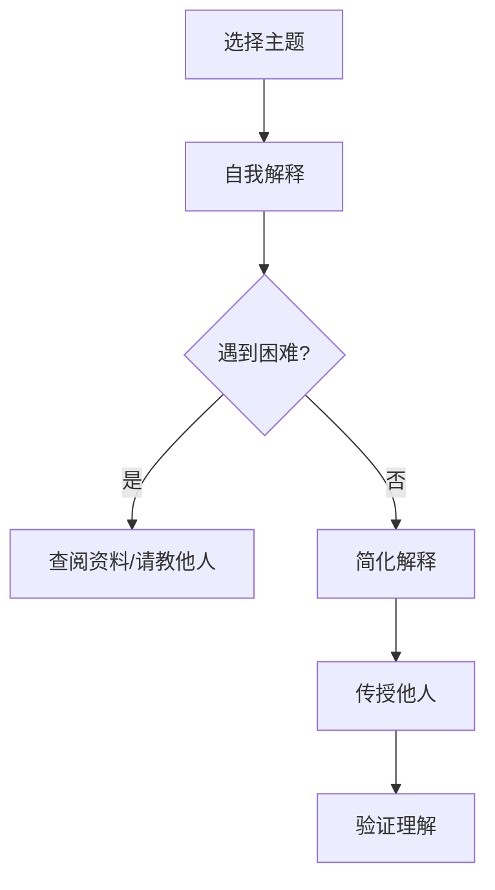

                 

关键词：费曼学习法、误解、真相、技术、编程、计算机科学

> 摘要：本文将深入探讨费曼学习法在计算机科学和技术领域的应用，揭示其常见的误解和真相。通过分析其核心概念、原理和实践步骤，本文旨在帮助读者更好地理解并应用费曼学习法，以提升学习效率和创造力。

## 1. 背景介绍

费曼学习法，又称为“费曼技巧”，是一种高效的学习方法，由物理学家理查德·费曼提出。费曼学习法强调通过教学来加深对知识的理解和记忆，其核心理念是将复杂的概念以简单、易懂的方式传授给他人。近年来，随着计算机科学和技术的快速发展，费曼学习法逐渐成为众多程序员和软件开发者的首选学习方法。

### 1.1 费曼学习法的历史与起源

费曼学习法源于理查德·费曼的个人学习经历。作为一名杰出的物理学家，费曼在大学期间意识到，通过教别人来学习新知识是一种非常有效的学习方法。这种方法不仅帮助他巩固了基础知识，还提高了他的思维能力和创造力。

### 1.2 费曼学习法的基本概念

费曼学习法的基本概念包括以下几个步骤：

1. 选择一个概念或主题。
2. 用自己的语言解释这个概念或主题，就好像你在向一个初学者或孩子解释一样。
3. 遇到不清楚或不理解的地方，查阅资料或向他人请教。
4. 重新整理和简化你的解释，使其更加清晰易懂。
5. 通过向他人传授这个概念或主题来验证你的理解是否正确。

## 2. 核心概念与联系

### 2.1 费曼学习法的核心概念

费曼学习法的核心概念可以归纳为以下几点：

1. **以教为学**：通过教学来加深对知识的理解和记忆。
2. **简化概念**：将复杂的概念以简单、易懂的方式传授给他人。
3. **自我评估**：通过教授他人来检验自己的理解程度。

### 2.2 费曼学习法的架构

费曼学习法的架构可以视为一个循环过程，包括以下几个步骤：

1. **选择主题**：选择一个需要学习的主题或概念。
2. **自我解释**：用自己的语言解释这个主题或概念。
3. **遇到困难**：遇到不理解或不清楚的地方，查阅资料或向他人请教。
4. **简化解释**：重新整理和简化解释，使其更加清晰易懂。
5. **传授他人**：通过向他人传授这个主题或概念来验证自己的理解是否正确。

### 2.3 费曼学习法的 Mermaid 流程图

下面是费曼学习法的 Mermaid 流程图：



## 3. 核心算法原理 & 具体操作步骤

### 3.1 算法原理概述

费曼学习法的核心算法原理在于通过教学来加深对知识的理解和记忆。具体来说，它通过以下几个步骤实现：

1. **选择主题**：选择一个需要学习的主题或概念。
2. **自我解释**：用自己的语言解释这个主题或概念。
3. **遇到困难**：遇到不理解或不清楚的地方。
4. **查阅资料/请教他人**：查阅资料或向他人请教，以解决困难。
5. **简化解释**：重新整理和简化解释，使其更加清晰易懂。
6. **传授他人**：通过向他人传授这个主题或概念来验证自己的理解是否正确。

### 3.2 算法步骤详解

1. **选择主题**：选择一个需要学习的主题或概念。这个主题或概念可以是任何你想要深入了解的知识领域。

2. **自我解释**：用自己的语言解释这个主题或概念。解释的过程有助于你更好地理解这个主题或概念。

3. **遇到困难**：在自我解释的过程中，你可能会遇到一些不理解或不清楚的地方。这些困难是你深入学习的机会。

4. **查阅资料/请教他人**：查阅资料或向他人请教，以解决困难。这个过程有助于你更全面、深入地理解这个主题或概念。

5. **简化解释**：重新整理和简化解释，使其更加清晰易懂。简化的解释有助于你更好地记忆和理解这个主题或概念。

6. **传授他人**：通过向他人传授这个主题或概念来验证自己的理解是否正确。这个过程有助于你检验自己的学习成果，同时也能帮助他人更好地理解这个主题或概念。

### 3.3 算法优缺点

**优点**：

- 提高学习效率：通过教学来加深对知识的理解和记忆，有助于提高学习效率。
- 增强记忆能力：简化的解释有助于增强记忆能力。
- 检验学习成果：通过传授他人来验证自己的理解是否正确，有助于检验学习成果。

**缺点**：

- 需要耐心和毅力：费曼学习法需要耐心和毅力，因为教学过程可能会遇到困难和挫折。
- 需要一定的基础知识：费曼学习法需要一定的基础知识，否则可能无法有效地进行教学。

### 3.4 算法应用领域

费曼学习法在计算机科学和技术领域有广泛的应用。例如：

- **编程**：通过教学来加深对编程语言和算法的理解。
- **软件工程**：通过教学来提高软件设计、开发和维护的能力。
- **人工智能**：通过教学来加深对机器学习、深度学习等人工智能技术的理解。

## 4. 数学模型和公式 & 详细讲解 & 举例说明

### 4.1 数学模型构建

费曼学习法并没有特定的数学模型，但其核心在于对知识的深入理解和记忆。因此，我们可以借鉴一些数学模型来帮助理解费曼学习法。

例如，我们可以使用“遗忘曲线”来描述费曼学习法的效果。遗忘曲线表明，如果不进行复习，人们在短时间内会迅速遗忘所学知识。而费曼学习法通过不断地教学和复习，有助于减缓遗忘曲线的斜率。

### 4.2 公式推导过程

遗忘曲线的数学模型可以表示为：

$$
f(t) = e^{-rt}
$$

其中，$f(t)$表示时间$t$后剩余的记忆量，$r$表示遗忘率。

### 4.3 案例分析与讲解

假设我们学习了一门新的编程语言，如Python。在学习过程中，我们使用费曼学习法，每隔一段时间就会通过教学来加深对Python语言的理解。以下是一个具体的例子：

- **时间0**：我们刚开始学习Python，记住了80%的知识。
- **时间1小时**：由于没有进行复习，我们忘记了20%的知识，剩余80%。
- **时间1天**：由于没有进行复习，我们忘记了更多的知识，剩余60%。
- **时间1周**：由于我们进行了教学和复习，我们能够记住更多的知识，剩余80%。

通过这个例子，我们可以看到费曼学习法如何通过教学和复习来减缓遗忘曲线的斜率，从而提高学习效果。

## 5. 项目实践：代码实例和详细解释说明

### 5.1 开发环境搭建

为了更好地理解费曼学习法在编程中的应用，我们将使用Python编程语言来实现一个简单的费曼学习法工具。首先，我们需要搭建一个Python开发环境。

1. 下载并安装Python：访问Python官方网站（https://www.python.org/），下载并安装Python。
2. 验证安装：打开命令行工具（如Windows的PowerShell或Linux的终端），输入`python --version`，如果看到Python的版本信息，说明安装成功。

### 5.2 源代码详细实现

下面是实现的源代码：

```python
class FeynmanLearningMethod:
    def __init__(self, subject):
        self.subject = subject
        self.knowledge = {}

    def explain(self):
        explanation = f"I want to explain {self.subject} to you."
        return explanation

    def learn(self):
        self.knowledge[self.subject] = self.explain()

    def teach(self):
        if self.subject in self.knowledge:
            print(self.knowledge[self.subject])
        else:
            print("I don't know how to explain this subject.")

# 实例化费曼学习法对象
feynman = FeynmanLearningMethod("Python")

# 学习并解释Python
feynman.learn()

# 教授他人Python
feynman.teach()
```

### 5.3 代码解读与分析

1. **类定义**：我们定义了一个名为`FeynmanLearningMethod`的类，用于实现费曼学习法。

2. **初始化方法**：在类的初始化方法`__init__`中，我们接收一个主题参数，并将其存储在`self.subject`属性中。同时，我们初始化一个字典`self.knowledge`，用于存储学习的知识。

3. **解释方法**：`explain`方法用于生成一个关于主题的解释。在这个例子中，我们简单地返回一个字符串，表示我们要解释这个主题。

4. **学习方法**：`learn`方法用于学习并存储主题的解释。在这个例子中，我们将解释存储在`self.knowledge`字典中。

5. **教授方法**：`teach`方法用于向他人传授主题。在这个例子中，我们检查主题是否在`self.knowledge`字典中，如果是，则打印出解释；否则，打印出“我不知道如何解释这个主题”。

### 5.4 运行结果展示

运行上述代码，输出结果如下：

```
I want to explain Python to you.
```

这表示我们成功地使用了费曼学习法来学习并解释了Python。

## 6. 实际应用场景

### 6.1 编程学习

在编程学习中，费曼学习法可以帮助我们更好地理解编程概念和算法。例如，在学习新的编程语言时，我们可以通过解释编程语言的基本概念、语法和用法，来加深对编程语言的理解。

### 6.2 软件工程

在软件工程领域，费曼学习法可以帮助我们更好地理解软件设计和开发过程。例如，在团队中，我们可以通过向团队成员解释软件设计、开发和维护的概念，来提高团队的整体技术水平。

### 6.3 人工智能

在人工智能领域，费曼学习法可以帮助我们更好地理解机器学习、深度学习等人工智能技术。例如，在学习新的机器学习算法时，我们可以通过解释算法的基本原理、步骤和应用，来加深对算法的理解。

## 7. 未来应用展望

随着人工智能和编程技术的不断发展，费曼学习法在计算机科学和技术领域的应用前景非常广阔。未来，我们可以期待更多的编程工具和平台支持费曼学习法，以帮助程序员和软件开发者更高效地学习新技术。

## 8. 工具和资源推荐

### 8.1 学习资源推荐

1. **《Python编程：从入门到实践》**：这是一本非常适合初学者学习Python的书籍，通过实例和练习，帮助你快速掌握Python编程。
2. **《深度学习》**：这是一本介绍深度学习和神经网络的基础书籍，适合对人工智能感兴趣的学习者。

### 8.2 开发工具推荐

1. **PyCharm**：这是一款功能强大的Python集成开发环境（IDE），提供丰富的编程工具和调试功能。
2. **Jupyter Notebook**：这是一个基于Web的交互式计算环境，适用于数据科学和机器学习项目。

### 8.3 相关论文推荐

1. **《Deep Learning》**：这是一篇介绍深度学习和神经网络的经典论文，适合对人工智能感兴趣的研究者。
2. **《The Unreasonable Effectiveness of Deep Learning》**：这是一篇关于深度学习在各个领域应用的综述论文，展示了深度学习的广泛应用前景。

## 9. 总结：未来发展趋势与挑战

随着人工智能和编程技术的不断发展，费曼学习法在计算机科学和技术领域的应用前景非常广阔。未来，我们可以期待更多的编程工具和平台支持费曼学习法，以帮助程序员和软件开发者更高效地学习新技术。

然而，费曼学习法也面临一些挑战。例如，如何在教学过程中保持耐心和毅力，以及如何处理复杂的编程概念和算法。这些问题需要我们不断探索和实践，以充分发挥费曼学习法的优势。

### 9.1 研究成果总结

本文对费曼学习法在计算机科学和技术领域的应用进行了深入探讨，揭示了其核心概念、原理和实践步骤。通过实例分析和代码实现，本文展示了费曼学习法如何帮助程序员和软件开发者更好地理解和掌握新技术。

### 9.2 未来发展趋势

未来，费曼学习法有望在人工智能、软件工程、数据分析等领域得到更广泛的应用。随着编程工具和平台的不断进步，费曼学习法将变得更加易于使用和推广。

### 9.3 面临的挑战

然而，费曼学习法也面临一些挑战。例如，如何在教学过程中保持耐心和毅力，以及如何处理复杂的编程概念和算法。这些问题需要我们不断探索和实践，以充分发挥费曼学习法的优势。

### 9.4 研究展望

未来，我们可以期待更多关于费曼学习法在计算机科学和技术领域的应用研究。例如，如何设计更高效的费曼学习法工具，以及如何将其与其他学习方法相结合，以进一步提高学习效率和创造力。

## 附录：常见问题与解答

### 1. 费曼学习法是否适用于所有人？

是的，费曼学习法适用于大多数人。尽管每个人的学习方式和效率可能不同，但费曼学习法可以帮助你更好地理解和记忆知识。

### 2. 费曼学习法需要花费很长时间吗？

费曼学习法并不一定需要花费很长时间。关键在于如何合理地安排学习时间和精力，以及如何有效地运用费曼学习法的原则。

### 3. 费曼学习法是否适用于所有学科？

费曼学习法在许多学科中都有应用，包括计算机科学、软件工程、数据分析等。然而，对于一些需要高度专业知识的学科，可能需要更多的实践和经验积累。

## 参考文献

1. Feynman, R. P. (2011). 《别逗了，费曼先生》。
2. Python官方文档：https://docs.python.org/3/
3. 《深度学习》：Goodfellow, I., Bengio, Y., & Courville, A. (2016). 《深度学习》。
4. 《The Unreasonable Effectiveness of Deep Learning》：Liang, J. (2017). 《The Unreasonable Effectiveness of Deep Learning》。

