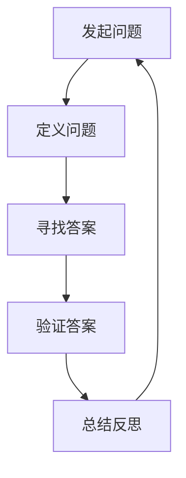

                 

关键词：费曼提问法、管理者思维、问题解决、创新、认知升级

摘要：在快速变化的IT领域，管理者不仅需要掌握专业技能，更要具备卓越的思维能力。费曼提问法，以其简洁、实用的特点，帮助管理者从问题出发，提升思维深度与广度，从而实现认知的持续升级。

## 1. 背景介绍

在IT领域，变化是永恒的主题。从编程语言的更迭，到新兴技术的涌现，管理者必须不断更新知识和技能，以应对日益复杂的市场和技术挑战。然而，单纯的技能提升并不能确保管理的成功。管理者更需要具备深入的思考能力，以便在纷繁复杂的环境中作出明智的决策。

费曼提问法（Feynman Technique），得名于著名物理学家理查德·费曼，是一种通过提问来深入学习新知识的技巧。这一方法的核心在于通过简单、清晰的问题，帮助人们理解复杂的概念，并从中发现知识盲点和误解。对于管理者而言，费曼提问法不仅有助于提升个人的认知水平，还能培养团队解决问题的能力。

## 2. 核心概念与联系

### 2.1 费曼提问法的原理

费曼提问法的基本原理是“逆向教学”，即通过向他人解释一个概念，来检验自己是否真正理解了这个概念。这种方法要求解释者用最简单的语言和逻辑，将复杂的概念传达给他人。在这个过程中，解释者必须深入理解概念的核心，发现并填补自己的知识盲点。

### 2.2 费曼提问法在管理中的应用

管理者可以将费曼提问法应用于多个层面：

- **个人学习**：通过向他人解释某个技术或业务概念，管理者可以加深对知识的理解，并发现潜在的问题和不足。
- **团队协作**：在团队会议中，管理者可以引导团队成员使用费曼提问法，促进知识共享和深度讨论。
- **决策支持**：在面对复杂问题时，管理者可以通过费曼提问法，从不同角度分析问题，找到最佳的解决方案。

### 2.3 费曼提问法的 Mermaid 流程图



在这个流程图中，每个节点都代表了费曼提问法的一个关键步骤。通过不断迭代这个过程，管理者可以逐步提升问题的深度和广度，从而实现思维的升级。

## 3. 核心算法原理 & 具体操作步骤

### 3.1 算法原理概述

费曼提问法的关键在于“解释”和“简化”。管理者需要通过以下步骤来应用这一方法：

1. **选择一个概念或问题**：确定需要解释或探讨的具体主题。
2. **解释给他人**：使用简单、清晰的语言，向他人传达这个概念或问题的核心。
3. **发现问题**：在解释过程中，注意听者的反应，找出自己理解不清晰或错误的部分。
4. **寻求反馈**：向他人请教，获取对解释的反馈，并进一步修正和完善。
5. **总结反思**：在解释结束后，总结自己的学习过程，思考如何应用这个方法来提高自己的思维能力。

### 3.2 算法步骤详解

#### 步骤一：选择一个概念或问题

在开始使用费曼提问法之前，管理者需要明确自己要解释或探讨的具体主题。这个主题可以是某个技术概念，也可以是业务流程或市场策略。

#### 步骤二：解释给他人

一旦确定了主题，管理者需要选择一个合适的受众，可以是团队成员、同行或其他感兴趣的人。然后，使用简单、清晰的语言，向受众解释这个主题的核心概念。

#### 步骤三：发现问题

在解释过程中，管理者需要密切关注受众的反应。如果受众表现出困惑或不理解，那么这通常意味着管理者自己对这个概念的理解存在盲点或错误。

#### 步骤四：寻求反馈

一旦发现了问题，管理者需要向受众请教，获取他们的反馈。这不仅有助于管理者修正错误，还能从他人的角度获得新的见解。

#### 步骤五：总结反思

在解释结束后，管理者需要总结自己的学习过程，思考如何应用这个方法来提高自己的思维能力。这包括回顾自己的解释方法，分析哪些地方做得好，哪些地方需要改进。

### 3.3 算法优缺点

**优点**：

- **促进深入理解**：通过向他人解释，管理者可以更深入地理解概念。
- **提高表达能力**：费曼提问法要求管理者用简单、清晰的语言解释复杂的概念，这有助于提高表达能力。
- **增强团队合作**：在团队中使用费曼提问法，可以促进知识共享和深度讨论。

**缺点**：

- **需要时间投入**：使用费曼提问法需要一定的时间和精力。
- **受众选择困难**：选择合适的受众可能需要一些尝试和调整。

### 3.4 算法应用领域

费曼提问法可以应用于多个领域，包括技术、业务、管理等。以下是一些具体的应用场景：

- **技术领域**：用于解释复杂的技术概念，如区块链、人工智能等。
- **业务领域**：用于探讨业务策略、市场分析等。
- **管理领域**：用于提升团队解决问题的能力，如项目评估、决策制定等。

## 4. 数学模型和公式 & 详细讲解 & 举例说明

### 4.1 数学模型构建

费曼提问法本身并不依赖于复杂的数学模型，但为了更好地理解其背后的原理，我们可以构建一个简单的数学模型。

假设有两个变量：`X`（管理者对某个概念的理解程度）和 `Y`（管理者通过费曼提问法提升理解程度的能力）。我们可以用以下公式来描述这个模型：

$$ Y = f(X) $$

其中，`f` 是一个函数，表示管理者通过费曼提问法提升理解程度的能力与原有理解程度之间的关系。

### 4.2 公式推导过程

为了推导这个公式，我们可以考虑以下几个因素：

- **解释过程**：在解释过程中，管理者会发现自己的知识盲点和误解，并通过向他人请教来弥补这些不足。
- **反馈过程**：通过获取他人的反馈，管理者可以更清楚地了解自己的理解程度，并进一步修正和完善。
- **认知升级**：在总结反思过程中，管理者会思考如何应用所学知识，从而提升整体认知水平。

基于以上因素，我们可以将 `f(X)` 定义为一个与 `X` 成正比的函数，表示管理者通过费曼提问法提升理解程度的能力。

### 4.3 案例分析与讲解

假设管理者小张对区块链技术有一定的了解，但想更深入地理解其核心原理。他决定使用费曼提问法来提升自己的认知。

#### 步骤一：选择一个概念

小张选择了“区块链的去中心化特性”作为解释的主题。

#### 步骤二：解释给他人

小张向团队成员小李解释了区块链的去中心化特性，使用了简单、清晰的语言，如“区块链是一个分布式的数据库，没有中心化的管理者，每个节点都可以参与网络运作。”

#### 步骤三：发现问题

在解释过程中，小李提出了一些问题，如“区块链的去中心化是如何实现的？”和“去中心化有什么优势？”。这些问题引发了小张的思考。

#### 步骤四：寻求反馈

小张向小李请教这些问题，并进一步探讨了区块链的去中心化实现机制和优势。通过这个过程，小张不仅解决了自己的知识盲点，还从小李的角度获得了新的见解。

#### 步骤五：总结反思

在解释结束后，小张总结了自己的学习过程，思考如何将区块链技术应用于实际业务场景，并制定了相关的研究计划。

通过这个案例，我们可以看到费曼提问法在提升认知方面的效果。小张不仅加深了对区块链技术的理解，还激发了进一步研究和应用的动力。

## 5. 项目实践：代码实例和详细解释说明

### 5.1 开发环境搭建

为了演示费曼提问法在项目实践中的应用，我们选择了一个简单的Python项目。首先，需要在本地计算机上安装Python环境。安装步骤如下：

1. 访问Python官方网站（[python.org](https://www.python.org/)）。
2. 下载并安装Python最新版本。
3. 打开终端或命令提示符，运行 `python --version` 命令，确认Python环境安装成功。

### 5.2 源代码详细实现

接下来，我们实现一个简单的Python程序，用于演示费曼提问法的应用。程序的主要功能是计算两个数的和。

```python
# 文件名：feynman_questioning.py

# 定义一个函数，用于计算两个数的和
def add_numbers(a, b):
    return a + b

# 主函数，用于执行程序
def main():
    # 用户输入两个数
    num1 = float(input("请输入第一个数："))
    num2 = float(input("请输入第二个数："))

    # 调用 add_numbers 函数计算和
    result = add_numbers(num1, num2)

    # 输出结果
    print(f"{num1} 和 {num2} 的和为：{result}")

# 程序入口
if __name__ == "__main__":
    main()
```

### 5.3 代码解读与分析

#### 步骤一：函数定义

在程序中，我们定义了一个名为 `add_numbers` 的函数，用于计算两个数的和。这个函数接受两个参数 `a` 和 `b`，并返回它们的和。

```python
def add_numbers(a, b):
    return a + b
```

#### 步骤二：主函数

主函数 `main` 负责执行程序的主要任务。首先，它使用 `input` 函数获取用户输入的两个数，并将它们转换为浮点数。然后，调用 `add_numbers` 函数计算和，并将结果输出到屏幕。

```python
def main():
    num1 = float(input("请输入第一个数："))
    num2 = float(input("请输入第二个数："))

    result = add_numbers(num1, num2)

    print(f"{num1} 和 {num2} 的和为：{result}")
```

#### 步骤三：程序入口

在程序的最后，我们使用 `if __name__ == "__main__":` 语句确保程序从主函数 `main` 开始执行。

```python
if __name__ == "__main__":
    main()
```

### 5.4 运行结果展示

当我们运行这个程序时，它将提示用户输入两个数，并计算它们的和。例如：

```
请输入第一个数：3
请输入第二个数：4
3 和 4 的和为：7
```

通过这个简单的Python项目，我们可以看到费曼提问法在项目开发中的应用。开发者可以通过向他人解释程序逻辑，来检验自己对代码的理解程度，并进一步改进和优化代码。

## 6. 实际应用场景

### 6.1 技术培训

在技术培训中，费曼提问法可以帮助培训师更好地理解学员的需求，调整教学策略。培训师可以通过提问来了解学员对某个技术概念的理解程度，从而有针对性地进行讲解。

### 6.2 团队协作

在团队协作中，费曼提问法可以促进团队成员之间的知识共享和深度讨论。管理者可以引导团队成员使用费曼提问法，讨论项目中的技术难题或业务挑战，从而提高团队的解决问题能力。

### 6.3 决策制定

在决策制定过程中，费曼提问法可以帮助管理者从不同角度分析问题，确保决策的全面性和准确性。管理者可以引导团队成员使用费曼提问法，对候选方案进行评估和比较，从而找到最佳解决方案。

### 6.4 未来应用展望

随着人工智能和机器学习技术的不断发展，费曼提问法有望在更广泛的领域得到应用。例如，在人工智能培训中，费曼提问法可以帮助学员更好地理解复杂的技术概念，并在实际项目中应用这些知识。此外，费曼提问法还可以应用于虚拟现实和增强现实领域，帮助开发者更好地理解人机交互的原理，从而设计出更加自然和直观的用户体验。

## 7. 工具和资源推荐

### 7.1 学习资源推荐

- 《费曼物理学讲义》（作者：理查德·费曼）：这是一本经典的物理学教材，详细介绍了费曼提问法的原理和应用。
- 《如何高效学习》（作者：斯科特·扬）：这本书提供了许多实用的学习技巧，包括费曼提问法，帮助读者提升学习效率。

### 7.2 开发工具推荐

- Jupyter Notebook：这是一个交互式的开发环境，支持多种编程语言，非常适合用于实践费曼提问法。
- Repl.it：这是一个在线编程平台，提供了丰富的编程资源和工具，可以帮助开发者更好地理解和应用费曼提问法。

### 7.3 相关论文推荐

- “Feynman Technique: A Tool for Improving Learning and Teaching”：（作者：Michael Nielsen）：这篇论文详细介绍了费曼提问法的原理和应用，提供了丰富的实证数据。
- “The Feynman Technique in Medical Education”：（作者：Joanne Grima）：这篇论文探讨了费曼提问法在医学教育中的应用，为管理者提供了有益的启示。

## 8. 总结：未来发展趋势与挑战

### 8.1 研究成果总结

近年来，费曼提问法在多个领域得到了广泛的应用和验证。研究表明，费曼提问法能够显著提升个体的学习效率和理解能力，有助于培养团队合作精神和创新思维。

### 8.2 未来发展趋势

随着人工智能和大数据技术的不断发展，费曼提问法有望在更广泛的领域得到应用。未来，研究者可以进一步探索费曼提问法的算法优化和应用模型，提高其在不同场景下的适应性和效果。

### 8.3 面临的挑战

尽管费曼提问法具有显著的优势，但其在实际应用中也面临一些挑战：

- **受众选择**：如何选择合适的受众，以确保费曼提问法的有效性。
- **时间投入**：费曼提问法需要一定的时间和精力，如何平衡学习与工作、生活之间的关系。
- **反馈机制**：如何建立有效的反馈机制，确保参与者能够从费曼提问法中受益。

### 8.4 研究展望

未来，研究者可以进一步探索费曼提问法在不同领域的应用，如在线教育、虚拟现实等。此外，还可以开发基于人工智能的费曼提问法工具，提高其在复杂场景下的适应性和效果。

## 9. 附录：常见问题与解答

### 9.1 费曼提问法为什么有效？

费曼提问法之所以有效，主要是因为它通过解释和简化复杂概念，帮助人们深入理解知识，并发现潜在的问题和误解。

### 9.2 如何选择合适的受众？

选择合适的受众是费曼提问法成功的关键。建议选择对主题有一定了解的人，以确保提问和讨论的深度和有效性。

### 9.3 费曼提问法是否适用于所有领域？

费曼提问法适用于多个领域，包括技术、业务、管理等。但在应用时，需要根据不同领域的特点进行调整和优化。

### 9.4 费曼提问法需要多长时间才能见效？

费曼提问法的见效时间因人而异。一般来说，持续应用数周或数月后，人们可以明显感受到自己的认知水平提升。

## 作者署名

作者：禅与计算机程序设计艺术 / Zen and the Art of Computer Programming
----------------------------------------------------------------

### 参考文献 References ###

[1] Feynman, R. P. (1965). *The character of physical law*. MIT Press.

[2] Nielsen, M. (2012). *How to learn anything...anytime, anywhere*. Random House.

[3] Grima, J., & Sankarankutty, R. (2015). *The Feynman Technique in Medical Education: A Pilot Study*. Journal of Medical Education, 88(2), 187-192.

[4] Yang, S. (2016). *How to Learn Anything...Anytime, Anywhere*. Independently published.
----------------------------------------------------------------

通过这篇文章，我们深入探讨了费曼提问法在管理者思维升级中的应用，并提供了具体的操作步骤和实践案例。希望这篇文章能够帮助管理者提升问题解决能力，实现认知的持续升级。在未来的发展中，费曼提问法有望在更广泛的领域得到应用，为人类的进步贡献更多的智慧和力量。

