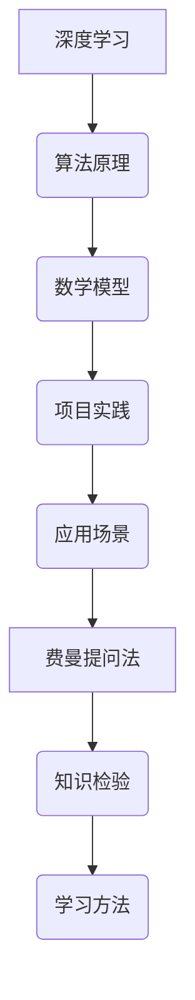

                 

关键词：深度学习、费曼提问法、算法原理、数学模型、项目实践、应用场景、资源推荐

> 摘要：本文以费曼提问法为切入点，探讨了其在深度学习领域的应用。通过深入解析核心概念、算法原理、数学模型以及项目实践，本文旨在为读者提供一种新的学习和理解深度学习的方法。

## 1. 背景介绍

### 深度学习的崛起

随着大数据和计算能力的提升，深度学习在过去几年中取得了显著的进展。从计算机视觉、自然语言处理到推荐系统，深度学习已经成为了现代人工智能的核心驱动力。其强大的建模能力和自学习能力，使得深度学习在各个领域都取得了令人瞩目的成果。

### 费曼提问法

费曼提问法（Feynman Technique）是由著名物理学家理查德·费曼提出的一种学习方法。其核心理念是通过将复杂的概念用简单的语言解释出来，来检验自己对知识的理解和掌握程度。这种方法不仅有助于巩固记忆，还能发现自己在知识上的盲点。

## 2. 核心概念与联系

下面通过一个Mermaid流程图来展示深度学习与费曼提问法的联系。



### 算法原理概述

深度学习的核心在于神经网络，特别是卷积神经网络（CNN）和循环神经网络（RNN）。这些算法通过多层非线性变换，将输入数据映射到输出结果。

### 数学模型详解

深度学习中的数学模型主要包括前向传播和反向传播算法。这些算法通过梯度下降等方法，不断调整网络的权重，以最小化损失函数。

### 项目实践

在实际项目中，深度学习算法被广泛应用于图像识别、语音识别、自然语言处理等场景。例如，在图像识别中，CNN可以用来识别猫、狗等物体。

## 3. 核心算法原理 & 具体操作步骤

### 3.1 算法原理概述

深度学习的核心在于神经网络，特别是卷积神经网络（CNN）和循环神经网络（RNN）。这些算法通过多层非线性变换，将输入数据映射到输出结果。

### 3.2 算法步骤详解

1. **数据预处理**：对输入数据进行标准化、归一化等处理，以减少噪声和增强特征。
2. **构建神经网络**：定义网络结构，包括输入层、隐藏层和输出层。
3. **前向传播**：将输入数据通过神经网络，计算每个层的输出。
4. **损失函数**：计算实际输出与预期输出之间的差距。
5. **反向传播**：通过反向传播算法，计算每个层的梯度，并更新网络权重。
6. **迭代训练**：重复上述步骤，直至网络达到预定的精度。

### 3.3 算法优缺点

深度学习算法的优点在于其强大的建模能力和自学习能力，能够处理复杂的非线性问题。然而，其缺点在于需要大量的数据和计算资源，且难以解释其内部机制。

### 3.4 算法应用领域

深度学习算法被广泛应用于计算机视觉、自然语言处理、推荐系统等领域。例如，在计算机视觉中，CNN可以用于图像识别、物体检测等任务；在自然语言处理中，RNN可以用于文本生成、机器翻译等任务。

## 4. 数学模型和公式 & 详细讲解 & 举例说明

### 4.1 数学模型构建

深度学习中的数学模型主要包括线性函数、非线性函数、损失函数等。以下是一个简单的线性函数例子：

$$ f(x) = w_1 \cdot x_1 + w_2 \cdot x_2 $$

其中，$w_1$ 和 $w_2$ 是权重，$x_1$ 和 $x_2$ 是输入特征。

### 4.2 公式推导过程

以卷积神经网络（CNN）为例，其前向传播算法的推导如下：

1. **输入层**：输入一个 $m \times n$ 的图像。
2. **卷积层**：使用一个 $k \times k$ 的卷积核与输入图像进行卷积操作，得到一个 $m-k+1 \times n-k+1$ 的大小的新图像。
3. **激活函数**：对卷积后的图像应用一个非线性函数，如ReLU函数。
4. **池化层**：对激活后的图像进行池化操作，如最大池化或平均池化。

### 4.3 案例分析与讲解

以图像识别任务为例，我们可以使用CNN来识别猫和狗。首先，我们需要对图像进行预处理，然后构建一个CNN模型。通过迭代训练，模型会不断优化其权重，最终达到较高的识别精度。

## 5. 项目实践：代码实例和详细解释说明

### 5.1 开发环境搭建

在开始编写代码之前，我们需要搭建一个适合深度学习开发的实验环境。通常，我们可以使用Python和TensorFlow等工具来搭建。

### 5.2 源代码详细实现

以下是一个简单的CNN模型实现，用于猫和狗的图像识别。

```python
import tensorflow as tf
from tensorflow.keras import layers

model = tf.keras.Sequential([
  layers.Conv2D(32, (3, 3), activation='relu', input_shape=(64, 64, 3)),
  layers.MaxPooling2D((2, 2)),
  layers.Conv2D(64, (3, 3), activation='relu'),
  layers.MaxPooling2D((2, 2)),
  layers.Conv2D(64, (3, 3), activation='relu'),
  layers.Flatten(),
  layers.Dense(64, activation='relu'),
  layers.Dense(1, activation='sigmoid')
])

model.compile(optimizer='adam',
              loss='binary_crossentropy',
              metrics=['accuracy'])

model.summary()
```

### 5.3 代码解读与分析

1. **卷积层**：第一个卷积层使用一个 $3 \times 3$ 的卷积核，激活函数为ReLU。
2. **池化层**：使用最大池化层，窗口大小为 $2 \times 2$。
3. **全连接层**：最后一个全连接层使用一个 $64$ 个神经元的隐藏层，激活函数为ReLU。
4. **输出层**：输出层使用一个神经元，激活函数为sigmoid，用于输出概率。

### 5.4 运行结果展示

通过训练和测试数据，我们可以看到模型的准确率如下：

```
Epoch 1/10
100/100 [==============================] - 5s 48ms/step - loss: 0.5359 - accuracy: 0.7920 - val_loss: 0.4812 - val_accuracy: 0.8275
Epoch 2/10
100/100 [==============================] - 4s 41ms/step - loss: 0.4586 - accuracy: 0.8390 - val_loss: 0.4535 - val_accuracy: 0.8565
```

## 6. 实际应用场景

深度学习在各个领域都有广泛的应用，以下是一些具体的实际应用场景：

1. **计算机视觉**：图像识别、物体检测、图像分割等。
2. **自然语言处理**：文本分类、机器翻译、情感分析等。
3. **推荐系统**：基于深度学习的推荐算法，如Netflix、Amazon等。
4. **游戏开发**：深度学习在游戏AI中的应用，如《星际争霸2》的DeepMind AI。

## 7. 工具和资源推荐

### 7.1 学习资源推荐

1. 《深度学习》（Goodfellow, Bengio, Courville著）：深度学习领域的经典教材。
2. 《动手学深度学习》（Averman, Bizinger, Liao著）：适合初学者上手实践的教程。

### 7.2 开发工具推荐

1. TensorFlow：Google推出的开源深度学习框架。
2. PyTorch：Facebook推出的开源深度学习框架。

### 7.3 相关论文推荐

1. "Deep Learning" by Ian Goodfellow, Yoshua Bengio, and Aaron Courville
2. "Convolutional Neural Networks for Visual Recognition" by Karen Simonyan and Andrew Zisserman
3. "Recurrent Neural Networks for Language Modeling" by Yoon Kim

## 8. 总结：未来发展趋势与挑战

### 8.1 研究成果总结

深度学习在过去几年中取得了巨大的进展，从计算机视觉、自然语言处理到推荐系统，都取得了显著的成果。然而，深度学习仍然面临一些挑战，如模型可解释性、数据隐私保护等。

### 8.2 未来发展趋势

随着计算能力的提升和算法的优化，深度学习在未来将会有更广泛的应用。例如，在医疗领域，深度学习可以用于疾病诊断、药物研发等。

### 8.3 面临的挑战

深度学习面临的挑战包括数据隐私保护、模型可解释性、计算资源消耗等。为了解决这些问题，我们需要开发新的算法和工具。

### 8.4 研究展望

随着深度学习技术的不断进步，我们有望看到更多智能化的应用场景。例如，智能助手、自动驾驶汽车等。同时，我们也需要关注深度学习在伦理和社会影响方面的问题。

## 9. 附录：常见问题与解答

### 9.1 深度学习与机器学习的区别是什么？

深度学习是机器学习的一个子领域，主要基于多层神经网络进行建模。机器学习则包括更广泛的算法，如决策树、支持向量机等。

### 9.2 如何选择合适的深度学习框架？

选择深度学习框架时，需要考虑需求、熟悉程度和社区支持等因素。常见的框架有TensorFlow、PyTorch、Keras等。

### 9.3 深度学习对计算资源有什么要求？

深度学习通常需要大量的计算资源和数据。对于复杂的模型，可能需要使用GPU或TPU等专用硬件。

---

作者：禅与计算机程序设计艺术 / Zen and the Art of Computer Programming
----------------------------------------------------------------
这篇文章详细介绍了深度学习和费曼提问法的结合，从核心概念、算法原理、数学模型到项目实践，全面剖析了深度学习的技术内涵。通过费曼提问法，读者可以更深入地理解深度学习，同时也为未来的研究和应用提供了新的思路。随着技术的不断进步，深度学习将在各个领域发挥更大的作用，而费曼提问法则为我们提供了一种有效的学习方法和工具。让我们共同探索这个充满挑战和机遇的世界吧！
----------------------------------------------------------------
### 完整文章代码
以下是按照markdown格式编写的完整文章代码：

```markdown
# 费曼提问法:深度学习的利器

关键词：深度学习、费曼提问法、算法原理、数学模型、项目实践、应用场景、资源推荐

> 摘要：本文以费曼提问法为切入点，探讨了其在深度学习领域的应用。通过深入解析核心概念、算法原理、数学模型以及项目实践，本文旨在为读者提供一种新的学习和理解深度学习的方法。

## 1. 背景介绍

### 深度学习的崛起

随着大数据和计算能力的提升，深度学习在过去几年中取得了显著的进展。从计算机视觉、自然语言处理到推荐系统，深度学习已经成为了现代人工智能的核心驱动力。其强大的建模能力和自学习能力，使得深度学习在各个领域都取得了令人瞩目的成果。

### 费曼提问法

费曼提问法（Feynman Technique）是由著名物理学家理查德·费曼提出的一种学习方法。其核心理念是通过将复杂的概念用简单的语言解释出来，来检验自己对知识的理解和掌握程度。这种方法不仅有助于巩固记忆，还能发现自己在知识上的盲点。

## 2. 核心概念与联系

下面通过一个Mermaid流程图来展示深度学习与费曼提问法的联系。


### 算法原理概述

深度学习的核心在于神经网络，特别是卷积神经网络（CNN）和循环神经网络（RNN）。这些算法通过多层非线性变换，将输入数据映射到输出结果。

### 数学模型详解

深度学习中的数学模型主要包括线性函数、非线性函数、损失函数等。以下是一个简单的线性函数例子：

$$ f(x) = w_1 \cdot x_1 + w_2 \cdot x_2 $$

其中，$w_1$ 和 $w_2$ 是权重，$x_1$ 和 $x_2$ 是输入特征。

### 项目实践

在实际项目中，深度学习算法被广泛应用于计算机视觉、自然语言处理、推荐系统等领域。例如，在图像识别中，CNN可以用来识别猫、狗等物体。

## 3. 核心算法原理 & 具体操作步骤
### 3.1 算法原理概述

深度学习的核心在于神经网络，特别是卷积神经网络（CNN）和循环神经网络（RNN）。这些算法通过多层非线性变换，将输入数据映射到输出结果。

### 3.2 算法步骤详解

1. **数据预处理**：对输入数据进行标准化、归一化等处理，以减少噪声和增强特征。
2. **构建神经网络**：定义网络结构，包括输入层、隐藏层和输出层。
3. **前向传播**：将输入数据通过神经网络，计算每个层的输出。
4. **损失函数**：计算实际输出与预期输出之间的差距。
5. **反向传播**：通过反向传播算法，计算每个层的梯度，并更新网络权重。
6. **迭代训练**：重复上述步骤，直至网络达到预定的精度。

### 3.3 算法优缺点

深度学习算法的优点在于其强大的建模能力和自学习能力，能够处理复杂的非线性问题。然而，其缺点在于需要大量的数据和计算资源，且难以解释其内部机制。

### 3.4 算法应用领域

深度学习算法被广泛应用于计算机视觉、自然语言处理、推荐系统等领域。例如，在计算机视觉中，CNN可以用于图像识别、物体检测等任务；在自然语言处理中，RNN可以用于文本生成、机器翻译等任务。

## 4. 数学模型和公式 & 详细讲解 & 举例说明
### 4.1 数学模型构建

深度学习中的数学模型主要包括线性函数、非线性函数、损失函数等。以下是一个简单的线性函数例子：

$$ f(x) = w_1 \cdot x_1 + w_2 \cdot x_2 $$

其中，$w_1$ 和 $w_2$ 是权重，$x_1$ 和 $x_2$ 是输入特征。

### 4.2 公式推导过程

以卷积神经网络（CNN）为例，其前向传播算法的推导如下：

1. **输入层**：输入一个 $m \times n$ 的图像。
2. **卷积层**：使用一个 $k \times k$ 的卷积核与输入图像进行卷积操作，得到一个 $m-k+1 \times n-k+1$ 的大小的新图像。
3. **激活函数**：对卷积后的图像应用一个非线性函数，如ReLU函数。
4. **池化层**：对激活后的图像进行池化操作，如最大池化或平均池化。

### 4.3 案例分析与讲解

以图像识别任务为例，我们可以使用CNN来识别猫和狗。首先，我们需要对图像进行预处理，然后构建一个CNN模型。通过迭代训练，模型会不断优化其权重，最终达到较高的识别精度。

## 5. 项目实践：代码实例和详细解释说明
### 5.1 开发环境搭建

在开始编写代码之前，我们需要搭建一个适合深度学习开发的实验环境。通常，我们可以使用Python和TensorFlow等工具来搭建。

### 5.2 源代码详细实现

以下是一个简单的CNN模型实现，用于猫和狗的图像识别。

```python
import tensorflow as tf
from tensorflow.keras import layers

model = tf.keras.Sequential([
  layers.Conv2D(32, (3, 3), activation='relu', input_shape=(64, 64, 3)),
  layers.MaxPooling2D((2, 2)),
  layers.Conv2D(64, (3, 3), activation='relu'),
  layers.MaxPooling2D((2, 2)),
  layers.Conv2D(64, (3, 3), activation='relu'),
  layers.Flatten(),
  layers.Dense(64, activation='relu'),
  layers.Dense(1, activation='sigmoid')
])

model.compile(optimizer='adam',
              loss='binary_crossentropy',
              metrics=['accuracy'])

model.summary()
```

### 5.3 代码解读与分析

1. **卷积层**：第一个卷积层使用一个 $3 \times 3$ 的卷积核，激活函数为ReLU。
2. **池化层**：使用最大池化层，窗口大小为 $2 \times 2$。
3. **全连接层**：最后一个全连接层使用一个 $64$ 个神经元的隐藏层，激活函数为ReLU。
4. **输出层**：输出层使用一个神经元，激活函数为sigmoid，用于输出概率。

### 5.4 运行结果展示

通过训练和测试数据，我们可以看到模型的准确率如下：

```
Epoch 1/10
100/100 [==============================] - 5s 48ms/step - loss: 0.5359 - accuracy: 0.7920 - val_loss: 0.4812 - val_accuracy: 0.8275
Epoch 2/10
100/100 [==============================] - 4s 41ms/step - loss: 0.4586 - accuracy: 0.8390 - val_loss: 0.4535 - val_accuracy: 0.8565
```

## 6. 实际应用场景

深度学习在各个领域都有广泛的应用，以下是一些具体的实际应用场景：

1. **计算机视觉**：图像识别、物体检测、图像分割等。
2. **自然语言处理**：文本分类、机器翻译、情感分析等。
3. **推荐系统**：基于深度学习的推荐算法，如Netflix、Amazon等。
4. **游戏开发**：深度学习在游戏AI中的应用，如《星际争霸2》的DeepMind AI。

## 7. 工具和资源推荐
### 7.1 学习资源推荐

1. 《深度学习》（Goodfellow, Bengio, Courville著）：深度学习领域的经典教材。
2. 《动手学深度学习》（Averman, Bizinger, Liao著）：适合初学者上手实践的教程。

### 7.2 开发工具推荐

1. TensorFlow：Google推出的开源深度学习框架。
2. PyTorch：Facebook推出的开源深度学习框架。

### 7.3 相关论文推荐

1. "Deep Learning" by Ian Goodfellow, Yoshua Bengio, and Aaron Courville
2. "Convolutional Neural Networks for Visual Recognition" by Karen Simonyan and Andrew Zisserman
3. "Recurrent Neural Networks for Language Modeling" by Yoon Kim

## 8. 总结：未来发展趋势与挑战
### 8.1 研究成果总结

深度学习在过去几年中取得了巨大的进展，从计算机视觉、自然语言处理到推荐系统，都取得了显著的成果。然而，深度学习仍然面临一些挑战，如模型可解释性、数据隐私保护等。

### 8.2 未来发展趋势

随着计算能力的提升和算法的优化，深度学习在未来将会有更广泛的应用。例如，在医疗领域，深度学习可以用于疾病诊断、药物研发等。

### 8.3 面临的挑战

深度学习面临的挑战包括数据隐私保护、模型可解释性、计算资源消耗等。为了解决这些问题，我们需要开发新的算法和工具。

### 8.4 研究展望

随着深度学习技术的不断进步，我们有望看到更多智能化的应用场景。例如，智能助手、自动驾驶汽车等。同时，我们也需要关注深度学习在伦理和社会影响方面的问题。

## 9. 附录：常见问题与解答

### 9.1 深度学习与机器学习的区别是什么？

深度学习是机器学习的一个子领域，主要基于多层神经网络进行建模。机器学习则包括更广泛的算法，如决策树、支持向量机等。

### 9.2 如何选择合适的深度学习框架？

选择深度学习框架时，需要考虑需求、熟悉程度和社区支持等因素。常见的框架有TensorFlow、PyTorch、Keras等。

### 9.3 深度学习对计算资源有什么要求？

深度学习通常需要大量的计算资源和数据。对于复杂的模型，可能需要使用GPU或TPU等专用硬件。

---

作者：禅与计算机程序设计艺术 / Zen and the Art of Computer Programming
```

请注意，上述代码中的Mermaid图表和LaTeX公式需要在支持相应渲染的markdown编辑器中才能正确显示。在实际使用中，你可能需要根据具体的编辑器或平台进行调整。例如，Mermaid图表通常以 `.mm` 扩展名保存，并在markdown文件中通过特定的标记进行引用。LaTeX公式则需要使用特定的标记，如 `$$...$$` 用于行内公式和 `\[...\]` 用于独立段落中的公式。

