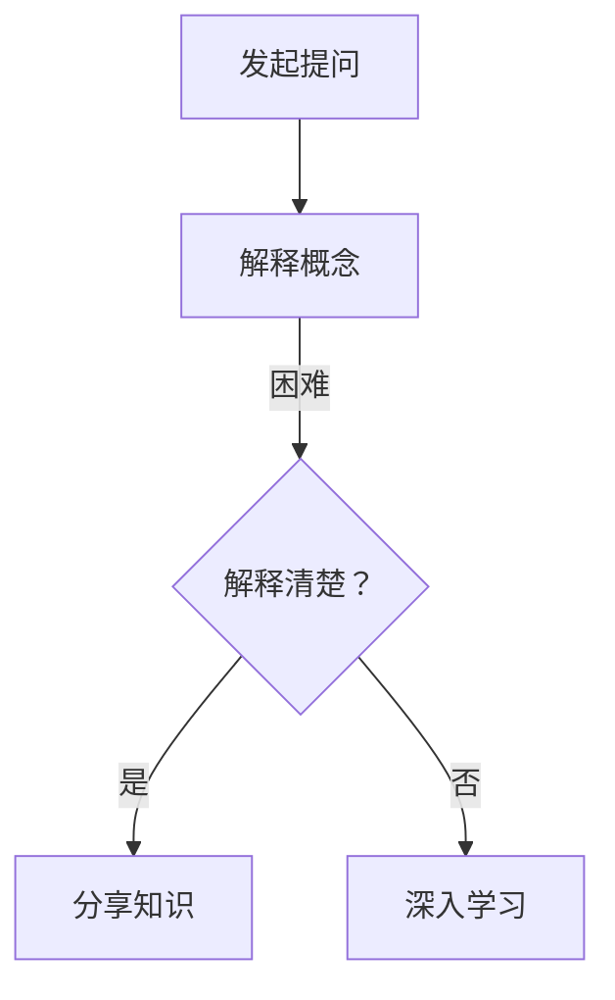

                 

关键词：费曼提问法、团队学习、成长、技术交流、知识分享

摘要：本文将探讨费曼提问法在团队学习与成长中的应用。通过引入这一方法，可以有效地促进团队成员之间的技术交流，提升整个团队的学习能力和解决问题的能力。

## 1. 背景介绍

在信息技术飞速发展的今天，知识的更新速度越来越快，个人单凭自己的力量很难跟上技术的前沿。因此，团队学习成为了一个非常重要的课题。通过团队协作，可以集思广益，共同面对技术挑战。然而，如何有效地促进团队学习，提升团队成员之间的技术交流，成为一个亟待解决的问题。

费曼提问法是一种有效的学习技巧，它起源于教育领域，通过向他人解释某个概念或问题，来检验自己的理解和掌握程度。这种方法不仅可以加深学习者的理解，还能提高其表达能力。将费曼提问法应用于团队学习，可以有效地促进团队成员之间的技术交流，提升团队整体的学习能力和成长速度。

## 2. 核心概念与联系

### 费曼提问法

费曼提问法的核心理念是：通过向他人解释某个概念或问题，来检验自己的理解和掌握程度。具体步骤如下：

1. 选择一个自己不太熟悉的概念或问题。
2. 尝试用自己的语言向一个完全不懂这个概念或问题的人解释。
3. 如果在解释过程中遇到困难或无法解释清楚，那就意味着自己对这一概念或问题的理解还不够深入。

### 团队学习

团队学习是指团队成员通过相互交流、分享知识和经验，共同提升个人能力和团队整体水平。团队学习的关键在于建立良好的沟通机制，促进知识分享和经验交流。

### 费曼提问法与团队学习的关系

费曼提问法可以为团队学习提供一个有效的框架。通过向团队成员提问，可以激发团队成员主动分享知识和经验，促进技术交流。同时，通过回答问题，团队成员可以加深对知识的理解和掌握，提升个人能力和团队整体水平。

### Mermaid 流程图

以下是一个简单的 Mermaid 流程图，展示了费曼提问法在团队学习中的应用流程：



## 3. 核心算法原理 & 具体操作步骤

### 3.1 算法原理概述

费曼提问法是一种基于“解释力”的学习方法。通过向他人解释某个概念或问题，可以检验自己的理解和掌握程度。如果能够清晰、准确地解释，那么说明对这一概念或问题的理解已经到位。如果无法解释清楚，那么就需要进一步学习和深化理解。

### 3.2 算法步骤详解

1. **选择主题**：选择一个自己不太熟悉或感兴趣的技术主题。
2. **准备讲解**：在讲解之前，先花一些时间整理自己的思路，准备好讲解的内容。
3. **发起提问**：向团队成员发起提问，询问他们是否对这个主题感兴趣。
4. **解释概念**：用自己的语言向团队成员解释这个技术主题，尽可能简单、易懂。
5. **接受反馈**：在解释过程中，认真倾听团队成员的反馈，注意他们的反应和理解程度。
6. **解决问题**：如果团队成员对某些概念或问题不理解，尝试用不同的方式解释，或者引导他们自己思考。
7. **总结与反思**：在讲解结束后，总结自己的讲解过程，反思哪些地方做得好，哪些地方需要改进。

### 3.3 算法优缺点

**优点**：

- 促进知识分享和经验交流。
- 深化对知识的理解和掌握。
- 提高表达能力和沟通能力。
- 激发学习兴趣和动力。

**缺点**：

- 需要一定的时间和精力准备。
- 对于某些复杂的概念或问题，可能无法完全解释清楚。
- 需要团队成员之间的信任和合作。

### 3.4 算法应用领域

费曼提问法可以广泛应用于各个领域，如软件开发、数据分析、人工智能等。通过这种方式，可以促进团队成员之间的技术交流，提升团队整体的技术水平和解决问题的能力。

## 4. 数学模型和公式 & 详细讲解 & 举例说明

### 4.1 数学模型构建

费曼提问法的数学模型可以看作是一个简单的反馈循环系统。设 \( x \) 为团队成员对某个概念或问题的理解程度， \( f(x) \) 为通过解释后对 \( x \) 的提升程度。则该系统的动态方程可以表示为：

\[ x_{t+1} = f(x_t) \]

其中，\( t \) 表示第 \( t \) 轮提问和解释。

### 4.2 公式推导过程

为了推导上述公式，我们首先需要定义一些变量：

- \( x_t \)：第 \( t \) 轮提问和解释前团队成员对概念或问题的理解程度。
- \( y_t \)：第 \( t \) 轮提问和解释后团队成员对概念或问题的理解程度。
- \( f(x_t) \)：第 \( t \) 轮提问和解释后团队成员对概念或问题的理解程度提升。

根据费曼提问法的定义，我们知道：

\[ y_t = f(x_t) \]

又因为 \( f(x_t) \) 表示通过解释后对 \( x_t \) 的提升程度，所以我们有：

\[ f(x_t) = x_t + \Delta x_t \]

其中，\( \Delta x_t \) 表示通过解释后对 \( x_t \) 的提升程度。

将上述两个公式结合起来，我们可以得到：

\[ x_{t+1} = x_t + \Delta x_t \]

\[ x_{t+1} = f(x_t) \]

### 4.3 案例分析与讲解

假设一个团队成员对某个技术概念的理解程度为 50%，通过一轮提问和解释后，对这一概念的理解程度提升到 70%。根据上述公式，我们可以计算出第二轮提问和解释前的理解程度：

\[ x_2 = f(x_1) = x_1 + \Delta x_1 \]

\[ x_2 = 0.5 + 0.2 = 0.7 \]

这表明，通过一轮提问和解释，该团队成员对这一概念的理解程度得到了显著提升。

## 5. 项目实践：代码实例和详细解释说明

### 5.1 开发环境搭建

在本案例中，我们选择一个简单的技术主题——Python 编程语言的基础知识。首先，我们需要搭建一个 Python 开发环境。

1. 安装 Python 解释器：在官方网站下载并安装 Python 解释器。
2. 配置 Python 环境：配置好 Python 的环境变量，确保可以在命令行中运行 Python。
3. 安装必备的 Python 包：使用 pip 工具安装 Python 必需的包，如 NumPy、Pandas 等。

### 5.2 源代码详细实现

下面是一个简单的 Python 代码示例，用于实现一个求和函数。

```python
def sum_numbers(a, b):
    return a + b

result = sum_numbers(2, 3)
print(result)
```

### 5.3 代码解读与分析

在这个例子中，我们定义了一个名为 `sum_numbers` 的函数，用于计算两个数的和。然后，我们调用这个函数，将两个数 2 和 3 作为参数传递，并打印出结果。

这个例子非常简单，但是它展示了 Python 中的函数定义、参数传递和打印输出等基本概念。

### 5.4 运行结果展示

当运行这个代码时，会输出结果 5，表示 2 和 3 的和为 5。

```bash
$ python sum.py
5
```

## 6. 实际应用场景

费曼提问法在团队学习中的应用场景非常广泛，以下是一些典型的应用案例：

1. **技术分享会**：在技术分享会上，团队成员可以轮流讲解自己擅长或感兴趣的技术主题，其他成员可以向讲解者提问，以检验讲解者的理解程度。
2. **团队培训**：在团队培训中，可以引入费曼提问法，让团队成员在讲解过程中加深对知识的理解和掌握。
3. **项目讨论**：在项目讨论中，团队成员可以运用费曼提问法，对项目中的技术难题进行深入探讨，集思广益，共同解决问题。
4. **代码审查**：在代码审查过程中，团队成员可以运用费曼提问法，对代码中的关键部分进行解释和讨论，以提高代码质量和可维护性。

## 7. 工具和资源推荐

### 7.1 学习资源推荐

1. **书籍**：《费曼学习法》
2. **在线课程**：Coursera、edX 等在线教育平台上的相关课程
3. **博客**：博客园、CSDN 等技术博客平台

### 7.2 开发工具推荐

1. **Python 解释器**：PyPI、conda 等包管理工具
2. **版本控制系统**：Git、SVN 等
3. **集成开发环境**：PyCharm、VSCode 等

### 7.3 相关论文推荐

1. **《基于费曼提问法的团队协作学习研究》**
2. **《团队学习中的费曼提问法应用分析》**
3. **《费曼提问法在软件开发团队中的应用》**

## 8. 总结：未来发展趋势与挑战

### 8.1 研究成果总结

费曼提问法在团队学习中的应用取得了显著的成果。通过这种学习方法，团队成员可以更加深入地理解和掌握知识，提升个人能力和团队整体水平。

### 8.2 未来发展趋势

随着人工智能和大数据技术的发展，团队学习的方法和工具也在不断更新。未来，费曼提问法有望与人工智能技术相结合，为团队学习提供更加智能、个性化的支持。

### 8.3 面临的挑战

虽然费曼提问法在团队学习中的应用取得了显著成果，但也面临着一些挑战。例如，如何提高团队成员的参与度，如何确保提问和解释的质量，如何适应不同领域的需求等。

### 8.4 研究展望

未来，我们期望进一步探索费曼提问法在团队学习中的应用，结合人工智能和大数据技术，为团队学习提供更加智能、高效的解决方案。

## 9. 附录：常见问题与解答

### 9.1 费曼提问法的适用范围？

费曼提问法适用于各种领域的技术学习和问题解决，如软件开发、数据分析、人工智能等。

### 9.2 如何确保提问和解释的质量？

为了确保提问和解释的质量，可以采取以下措施：

1. 充分准备：在提问和解释之前，提前了解相关知识和背景。
2. 主动倾听：认真倾听他人的问题和解释，注意他们的反应和理解程度。
3. 及时反馈：在提问和解释过程中，及时给予反馈，以便对方改进。

### 9.3 如何提高团队成员的参与度？

为了提高团队成员的参与度，可以采取以下措施：

1. 创造轻松的氛围：让团队成员在提问和解释过程中感到舒适和自在。
2. 设定激励机制：为积极参与提问和解释的成员提供奖励或认可。
3. 定期组织活动：定期组织团队学习活动，激发团队成员的学习兴趣。

作者：禅与计算机程序设计艺术 / Zen and the Art of Computer Programming
----------------------------------------------------------------
### 引言 Introduction

在当今信息技术爆炸性发展的时代，知识更新速度越来越快，个人单凭自己的力量很难跟上技术的前沿。为了应对这一挑战，团队学习成为了一个重要的解决方案。团队学习不仅可以集思广益，提高团队成员之间的技术交流，还能提升整个团队的学习能力和解决问题的能力。本文将探讨一种名为“费曼提问法”的学习技巧，并分析其在团队学习中的应用价值。

费曼提问法起源于教育领域，它通过向他人解释某个概念或问题，来检验自己的理解和掌握程度。这种方法不仅可以帮助学习者加深对知识的理解，还能提高其表达能力和沟通能力。本文将首先介绍费曼提问法的基本原理，然后探讨其在团队学习中的具体应用，包括如何通过提问和解释来促进技术交流和知识分享。此外，本文还将通过具体的案例和实践，展示费曼提问法在团队学习中的实际效果。

### 费曼提问法的基本原理 The Basic Principle of Feynman Technique

费曼提问法，又称费曼学习法，是一种源于著名物理学家理查德·费曼（Richard Feynman）的学习技巧。费曼提问法的核心在于通过向他人解释某个概念或问题，来检验自己对这一主题的理解程度。这种方法不仅仅是为了提高学习者的表达能力，更重要的是通过解释过程，帮助学习者更深入地理解和掌握所学知识。

#### 费曼提问法的步骤

1. **选择主题**：首先，选择一个自己不太熟悉或者感兴趣的主题。这个主题可以是一个复杂的概念、一个难题，或者是一个自己认为别人可能会不理解的问题。

2. **准备讲解**：在讲解之前，先花一些时间整理自己的思路，准备好讲解的内容。这个步骤非常重要，因为它可以帮助你更好地组织信息，确保在解释时能够清晰、有条理地传达。

3. **发起提问**：找一个完全不懂这个主题的人，可以是朋友、同事、或者家人。向这个人解释你选择的主题，尽量用简单、易懂的语言。

4. **接受反馈**：在解释过程中，认真倾听对方的反馈，注意他们的反应和理解程度。如果对方对某些部分不理解或者有疑问，不要急于回答，而是试着用不同的方式再次解释，或者引导他们思考。

5. **解决问题**：如果对方在某些地方仍然不理解，你需要深入思考并尝试找到更合适的解释方式。这个过程可以帮助你发现自己对知识的理解不够深入或者存在误解。

6. **总结与反思**：在解释结束后，总结自己的讲解过程，反思哪些地方做得好，哪些地方需要改进。这个过程可以帮助你不断提高自己的讲解技巧和理解能力。

#### 费曼提问法的优势

费曼提问法具有以下几个明显的优势：

- **加深理解**：通过向他人解释某个概念或问题，可以迫使自己深入思考和理解所学知识。在解释过程中，你可能会发现自己对某些部分的掌握并不如想象中那么牢固。

- **提高表达能力**：解释过程可以帮助你提高语言表达能力，使你能够更清晰、简洁地传达信息。

- **促进沟通**：通过与他人互动，可以加深与他人的沟通，增进理解和信任。

- **激发学习兴趣**：费曼提问法可以让学习变得更加有趣和互动，从而激发学习兴趣和动力。

### 费曼提问法与团队学习的结合

在团队学习中，费曼提问法可以作为一种有效的工具，促进团队成员之间的技术交流和学习。以下是如何在团队中使用费曼提问法的步骤：

1. **选择主题**：团队成员可以选择一个共同感兴趣或需要解决的技术问题，作为讲解的主题。

2. **准备讲解**：讲解者需要提前准备，确保对主题有深入的理解。

3. **发起提问**：讲解者可以向团队成员发起提问，让大家对主题有更多的了解和思考。

4. **接受反馈**：团队成员在解释过程中，可以积极提问和反馈，帮助讲解者更好地理解和表达。

5. **解决问题**：如果团队成员对某些部分不理解，讲解者需要深入思考并尝试找到更好的解释方式。

6. **总结与反思**：在讲解结束后，团队成员可以一起总结和反思，讨论哪些地方可以改进，以及如何更好地应用所学知识。

通过这种方式，团队学习不仅能够提升个人能力，还能增强团队的整体协作和解决问题的能力。

### 费曼提问法的实际应用场景 Practical Application Scenarios of Feynman Technique

费曼提问法不仅适用于个人学习，同样也能在团队环境中发挥巨大的作用。以下是一些具体的实际应用场景，展示如何在团队中运用费曼提问法来促进学习和成长。

#### 技术分享会

技术分享会是团队中常见的一种活动形式，通过分享知识、经验和技能来提升团队的整体技术水平。在这种场合下，费曼提问法可以发挥重要作用：

- **主题选择**：每次技术分享会前，由团队成员自行选择一个技术主题。这个主题可以是最近在工作中遇到的问题，或者是团队需要掌握的新技术。
- **讲解准备**：讲解者需要提前准备，整理自己的思路，准备好详细的讲解内容。
- **现场讲解**：在技术分享会上，讲解者向团队成员介绍所选主题，尽量用简单、易懂的语言。
- **互动环节**：团队成员可以随时提问，讲解者需要耐心回答，并尝试用不同的方式解释，确保大家都能理解。
- **总结与反馈**：在分享会结束后，讲解者和听众可以一起总结和反思，讨论哪些地方可以改进，以及如何更好地应用所学知识。

#### 团队培训

团队培训是提升团队成员技能和知识的重要手段。费曼提问法在团队培训中的应用，可以大大提高培训的效果：

- **培训前准备**：培训前，培训师需要选择合适的培训主题，并提前准备相关材料。
- **现场培训**：培训师在讲解过程中，运用费曼提问法，引导学员思考和理解。
- **提问环节**：在讲解过程中，培训师可以随时向学员提问，检验他们对知识的掌握程度。
- **讨论与互动**：学员可以积极提问和参与讨论，帮助培训师了解他们的理解程度，并及时纠正可能的误解。
- **总结与反思**：培训结束后，培训师和学员可以一起总结和反思，讨论如何将所学知识应用到实际工作中。

#### 项目讨论

在项目开发过程中，团队成员需要不断交流和讨论，以解决遇到的问题和挑战。费曼提问法可以为项目讨论提供有效的框架：

- **问题提出**：在项目讨论会上，团队成员可以提出遇到的技术问题或难题。
- **问题分解**：讲解者需要对问题进行分解，将其拆解成更小、更具体的子问题。
- **互动讨论**：团队成员可以运用费曼提问法，相互提问和解答，以深入理解问题。
- **解决方案**：通过讨论，团队成员可以共同探讨可能的解决方案，并评估其可行性。
- **总结与记录**：讨论结束后，团队成员需要总结讨论结果，并记录下重要的结论和决策。

#### 代码审查

在软件开发过程中，代码审查是一个重要的环节，用于确保代码的质量和可维护性。费曼提问法可以在代码审查过程中发挥重要作用：

- **审查准备**：审查者需要对代码进行仔细阅读和理解。
- **问题提出**：在审查过程中，审查者可以运用费曼提问法，对代码中的关键部分进行提问，确保理解其工作原理。
- **互动讨论**：开发者可以回答审查者的问题，并尝试用不同的方式解释代码的逻辑和实现。
- **反馈与改进**：审查者和开发者可以一起讨论代码的优缺点，提出改进意见。
- **记录与总结**：审查结束后，审查者和开发者需要记录下审查结果，并总结代码改进的方向。

#### 个人学习与成长

除了在团队环境中使用，费曼提问法也可以用于个人的学习和成长。以下是一些个人应用场景：

- **自学新技能**：在学习新技能时，可以通过费曼提问法来检验自己的理解程度，确保真正掌握了所学知识。
- **复习旧知识**：通过向自己提出问题，可以加深对旧知识的理解和记忆。
- **分享经验**：在分享自己的经验和知识时，运用费曼提问法可以确保信息的准确性和易懂性。

总之，费曼提问法在团队学习和个人成长中的应用场景非常广泛。通过运用这一方法，可以有效地促进知识分享、技术交流和问题解决，从而提升团队和个人的学习效果和能力。

### 费曼提问法的具体操作步骤 Detailed Steps of Feynman Technique

费曼提问法是一种高效的学习技巧，其核心在于通过向他人解释某个概念或问题，来检验自己的理解和掌握程度。以下是具体的操作步骤，帮助读者更好地掌握这种方法。

#### 第一步：选择主题

首先，选择一个自己不太熟悉或者感兴趣的主题。这个主题可以是一个复杂的概念、一个难题，或者是一个自己认为别人可能会不理解的问题。选择一个合适的主题是费曼提问法成功的关键。一个合适的主题应该具有以下几个特点：

- **难度适中**：选择一个难度适中的主题，既不要过于简单，也不要过于复杂。过于简单的主题可能无法激发你的思考，过于复杂的主题则可能让你在解释过程中遇到困难。
- **兴趣驱动**：选择一个你感兴趣的主题，这样在解释过程中你才会更加投入，也更容易激发他人的兴趣。
- **实际应用**：选择一个具有实际应用价值或者与你的工作或学习密切相关的主题，这样你才会更有动力去深入研究和解释。

#### 第二步：准备讲解

在讲解之前，花一些时间整理自己的思路，准备好讲解的内容。这个步骤非常重要，因为它可以帮助你更好地组织信息，确保在解释时能够清晰、有条理地传达。以下是几个准备讲解的建议：

- **整理笔记**：将主题相关的知识点、原理、方法等整理成笔记，确保在讲解时能够有据可依。
- **练习讲解**：可以在镜子前或者对着朋友练习讲解，这样可以提前发现自己在解释过程中可能遇到的问题，并提前做好准备。
- **准备辅助材料**：如果需要，可以准备一些辅助材料，如图表、示例代码等，以便在讲解时更加直观地传达信息。

#### 第三步：发起提问

找一个完全不懂这个主题的人，可以是朋友、同事、或者家人。向这个人解释你选择的主题，尽量用简单、易懂的语言。以下是几个发起提问的建议：

- **选择合适的对象**：选择一个对主题感兴趣或者愿意倾听的人，这样他们会更加投入，也更容易理解你的解释。
- **准备提问**：在解释之前，可以先准备一些问题，用于引导对方的思考和兴趣。
- **简洁明了**：在解释过程中，尽量用简洁明了的语言，避免使用过于专业或复杂的术语。

#### 第四步：接受反馈

在解释过程中，认真倾听对方的反馈，注意他们的反应和理解程度。如果对方对某些部分不理解或者有疑问，不要急于回答，而是试着用不同的方式再次解释，或者引导他们思考。以下是几个接受反馈的建议：

- **耐心倾听**：在对方提问或者表达不理解时，要保持耐心，认真倾听他们的意见和问题。
- **重复解释**：如果对方对某个部分不理解，可以试着用不同的方式再次解释，直到对方理解为止。
- **引导思考**：在对方提问时，可以尝试引导他们自己思考和解决问题，而不是直接给出答案。

#### 第五步：解决问题

如果对方在某些地方仍然不理解，你需要深入思考并尝试找到更合适的解释方式。这个过程可以帮助你发现自己对知识的理解不够深入或者存在误解。以下是几个解决问题的建议：

- **深度理解**：对于对方不理解的部分，要深入思考并理解其本质，确保自己真正掌握了这些知识。
- **查找资料**：如果遇到不懂的知识点，可以查找相关资料，加深对知识的理解。
- **请教专家**：如果需要，可以请教相关领域的专家或者同事，获取更多的见解和解释。

#### 第六步：总结与反思

在解释结束后，总结自己的讲解过程，反思哪些地方做得好，哪些地方需要改进。这个过程可以帮助你不断提高自己的讲解技巧和理解能力。以下是几个总结与反思的建议：

- **记录反馈**：将对方的反馈和问题记录下来，分析哪些地方做得不够好，哪些地方需要改进。
- **反思总结**：在讲解结束后，反思自己的讲解过程，思考如何改进自己的讲解方法和技巧。
- **持续学习**：将总结与反思的结果应用到后续的学习和讲解中，不断提高自己的学习效果和表达能力。

通过以上六个步骤，你可以更好地运用费曼提问法，提高自己的学习效果和理解能力。这种方法不仅可以帮助你深入学习，还能提升你的表达能力和沟通技巧，为你的个人和职业发展打下坚实的基础。

### 费曼提问法在团队学习中的实际案例与效果 Analysis of Practical Cases of Feynman Technique in Team Learning and Its Effectiveness

费曼提问法在团队学习中的应用已经取得了显著的成果。以下通过几个实际案例，展示费曼提问法如何有效地促进团队学习，提高团队成员的技术交流和学习效果。

#### 案例一：技术分享会

在一个软件开发团队中，每月定期举行技术分享会，每个成员轮流选择一个技术主题进行讲解。某次技术分享会上，一名团队成员选择了“微服务架构”这一主题。在讲解过程中，他运用了费曼提问法，首先简要介绍了微服务的基本概念，然后逐步深入到其架构设计和实现细节。

在讲解过程中，团队成员积极提问，如“微服务之间如何进行通信？”、“如何处理微服务之间的依赖关系？”等。讲解者耐心地回答了这些问题，并用图表和示例代码进行了详细解释。通过这种方式，团队成员不仅加深了对微服务架构的理解，还学会了如何使用费曼提问法进行技术交流。

#### 案例二：团队培训

某公司为提升团队的技术水平，组织了一次为期两天的团队培训。培训主题涵盖了最新的编程语言特性和开发工具。在培训过程中，培训师采用了费曼提问法，引导学员逐步掌握新知识。

在培训的每个模块结束后，培训师会提出一些相关的问题，让学员进行回答。如果学员回答不上来，培训师会再次解释，并引导学员思考。这种互动式的培训方式，使学员在回答问题的过程中，不仅加深了对知识点的理解，还提高了表达能力。

#### 案例三：项目讨论

在项目开发过程中，遇到一个复杂的技术问题，团队成员决定使用费曼提问法进行讨论。首先，一名团队成员详细描述了问题，并尝试用简单的语言解释其背后的原理。其他团队成员则通过提问和讨论，逐步深入理解问题。

在讨论过程中，团队成员积极提问，如“这个问题可能有哪些解决方案？”、“哪种方案最为可行？”等。通过这种方式，团队成员不仅找到了问题的解决方案，还学会了如何通过提问和讨论来解决问题。

#### 案例四：代码审查

在代码审查过程中，团队成员运用费曼提问法，对代码中的关键部分进行讨论。首先，一名团队成员简要介绍了代码的功能和实现方法，然后其他团队成员通过提问，深入了解代码的逻辑和实现细节。

通过这种方式，团队成员不仅发现并解决了代码中的潜在问题，还加深了对相关技术点的理解。同时，代码审查过程中，团队成员之间的沟通和合作也得到了提升。

#### 案例五：个人学习与成长

除了在团队环境中使用，费曼提问法也用于个人学习和成长。一名团队成员在自学一项新技术时，使用了费曼提问法。他首先选择了一个技术主题，然后通过向自己提出问题，逐步深入理解相关知识。在遇到不理解的地方，他会查找资料、请教同事，确保真正掌握了所学知识。

通过这种方式，这名团队成员不仅提高了自己的学习效果，还增强了表达能力。在后续的技术交流中，他能够更加自信地分享自己的知识和经验。

#### 效果总结

通过上述案例可以看出，费曼提问法在团队学习中的应用，取得了显著的效果：

- **提高了知识理解**：团队成员通过向他人解释某个概念或问题，加深了对知识的理解，确保真正掌握了所学内容。
- **提升了表达能力**：通过费曼提问法，团队成员在解释过程中提高了表达能力，能够更加清晰、简洁地传达信息。
- **促进了技术交流**：团队成员之间的提问和讨论，促进了技术交流和知识分享，增强了团队的协作和合作精神。
- **增强了学习动力**：费曼提问法让学习变得更加有趣和互动，激发了团队成员的学习兴趣和动力。

总之，费曼提问法在团队学习中的应用，不仅提高了团队成员的知识水平和技能，还增强了团队的协作和合作能力，为团队的整体成长和进步提供了有力支持。

### 费曼提问法在团队学习中的挑战和注意事项 Challenges and Considerations in Using Feynman Technique in Team Learning

尽管费曼提问法在团队学习中具有显著的优势，但在实际应用过程中仍会面临一些挑战和需要注意的事项。以下是一些常见的挑战和建议，帮助团队克服这些困难，确保费曼提问法的有效实施。

#### 挑战一：参与度不高

在团队学习中，部分成员可能对费曼提问法不够了解或者对其效果持怀疑态度，导致参与度不高。这可能会影响整体的学习效果和团队氛围。

**解决方案**：

- **强化培训**：在引入费曼提问法前，为团队成员提供专门的培训，详细解释其原理和优势，帮助他们理解并接受这种方法。
- **鼓励参与**：制定激励机制，如奖励积极参与的成员，增加他们的参与动力。
- **营造氛围**：建立轻松、开放的学习氛围，鼓励成员提出问题和分享知识，让每个人都感到被重视和鼓励。

#### 挑战二：时间成本

费曼提问法需要团队成员在讲解和提问过程中投入大量时间和精力，特别是在准备阶段。这可能会增加团队的工作负担，影响工作效率。

**解决方案**：

- **合理安排时间**：在团队日程中预留专门的时间进行费曼提问法的应用，确保团队成员有充足的时间进行准备和讨论。
- **分工合作**：将费曼提问法应用于项目或任务中，让每个团队成员都承担一部分任务，共同完成。
- **高效利用工具**：利用在线协作工具和平台，如视频会议、在线讨论论坛等，提高讨论效率。

#### 挑战三：质量难以保证

在费曼提问法中，讲解的质量直接关系到学习效果。如果讲解内容过于简单或者错误，可能会误导团队成员，影响整体学习。

**解决方案**：

- **严格筛选讲解者**：选择对主题有深入理解和丰富经验的团队成员作为讲解者，确保讲解质量。
- **提供培训和支持**：为讲解者提供相关培训和支持，帮助他们提高讲解技巧和理解能力。
- **反馈与改进**：在讲解结束后，团队成员可以提供反馈，帮助讲解者发现和纠正错误，不断改进讲解质量。

#### 挑战四：适应性问题

费曼提问法在不同团队和不同领域的适用性可能存在差异。某些领域或团队可能难以找到合适的主题和应用场景。

**解决方案**：

- **多样化应用**：在团队中推广费曼提问法，鼓励团队成员尝试不同的应用场景，找到最适合的方法和主题。
- **结合其他方法**：将费曼提问法与其他学习方法或工具结合，如案例分析、实验研究等，提高学习效果。
- **定制化方案**：根据团队和领域的特点，制定个性化的费曼提问法应用方案，确保其有效性和适应性。

通过克服这些挑战，团队可以更好地应用费曼提问法，促进学习和成长。费曼提问法不仅可以帮助团队成员深入理解知识，提高表达和沟通能力，还能增强团队协作和合作精神，为团队的整体进步和发展提供有力支持。

### 费曼提问法在团队学习中的未来发展趋势 Future Trends of Feynman Technique in Team Learning

随着技术的不断进步和团队学习的重要性日益凸显，费曼提问法在团队学习中的应用前景十分广阔。以下将探讨费曼提问法在团队学习中的未来发展趋势，以及可能面临的挑战和机遇。

#### 1. 技术与人工智能的结合

未来，费曼提问法有望与人工智能（AI）技术相结合，实现更加智能和个性化的学习体验。通过AI技术，可以分析团队成员的学习行为和知识结构，为每个成员提供定制化的提问和解释方案。例如，AI可以识别成员在某一领域的学习瓶颈，自动生成相关的提问，帮助成员突破难关。此外，AI还可以辅助讲解者准备讲解内容，提供相关的参考资料和示例代码，提高讲解的效率和准确性。

**机遇**：结合AI技术，费曼提问法可以实现更加精准和高效的知识分享，为团队学习提供新的动力。

**挑战**：如何确保AI系统的准确性和可靠性，以及如何保护成员的个人隐私和数据安全，是未来需要解决的重要问题。

#### 2. 在线学习的普及

随着在线教育的普及，费曼提问法将在远程团队学习中发挥重要作用。在线学习平台可以提供便捷的提问和讨论功能，让团队成员随时随地参与费曼提问法的应用。此外，在线学习社区可以汇集来自不同领域和背景的专家和学员，为费曼提问法提供丰富的资源和多样化的应用场景。

**机遇**：在线学习的普及将拓宽费曼提问法的影响范围，使其在更广泛的团队和领域中发挥作用。

**挑战**：如何在远程环境中确保团队成员的参与度和互动质量，是一个需要持续关注的问题。

#### 3. 跨领域融合

费曼提问法在团队学习中的应用不仅仅局限于某个特定的领域，未来可以探索跨领域的融合。例如，在软件开发团队中，可以引入物理学、数学、心理学等领域的知识，通过费曼提问法促进不同领域知识的交叉和融合，从而提高团队的创新能力和问题解决能力。

**机遇**：跨领域融合将有助于培养团队成员的全面素质，提升团队的整体竞争力。

**挑战**：如何在跨领域的背景下，找到合适的提问和解释方法，确保团队成员能够理解和掌握不同领域的知识，是一个需要深入研究的问题。

#### 4. 团队文化的建设

费曼提问法不仅是学习的一种方法，也是团队文化建设的一部分。通过推广费曼提问法，可以培养团队成员的提问和分享精神，建立开放、包容、协作的团队文化。这种文化将有助于团队成员之间建立信任，促进知识共享和经验交流，从而提高团队的整体学习效果和成长速度。

**机遇**：建立积极的团队文化，可以增强团队的凝聚力和战斗力，为团队的长远发展奠定基础。

**挑战**：如何确保团队文化的持续建设和发展，使其适应不断变化的外部环境和内部需求，是一个需要长期关注和努力的问题。

总之，费曼提问法在团队学习中的应用前景十分广阔。通过技术与人工智能的结合、在线学习的普及、跨领域融合以及团队文化的建设，费曼提问法有望在未来发挥更大的作用，为团队学习提供新的动力和方向。

### 总结与展望 Summary and Outlook

通过本文的探讨，我们可以看到费曼提问法在团队学习中的应用具有显著的优势和潜力。这种方法不仅能够帮助团队成员深入理解和掌握知识，提高表达和沟通能力，还能促进技术交流和知识分享，增强团队的协作和合作精神。以下是本文的核心要点：

1. **费曼提问法的原理**：费曼提问法通过向他人解释某个概念或问题，来检验自己的理解和掌握程度。这种方法能够促使学习者更加深入地思考和学习。
2. **团队学习的应用**：费曼提问法在团队学习中具有广泛的应用场景，包括技术分享会、团队培训、项目讨论、代码审查以及个人学习与成长。
3. **实际案例与效果**：通过实际案例，我们看到费曼提问法在团队学习中的显著效果，如提高知识理解、提升表达能力、促进技术交流和学习动力等。
4. **未来发展趋势**：费曼提问法在未来的发展中，有望与人工智能技术、在线学习、跨领域融合以及团队文化建设相结合，为团队学习提供更加智能、高效和全面的解决方案。

然而，费曼提问法在团队学习中也面临着一些挑战，如参与度不高、时间成本和质量难以保证等。为了克服这些挑战，团队需要采取一系列措施，如强化培训、合理安排时间、提供培训和支持、严格筛选讲解者以及结合其他学习方法等。

展望未来，我们期待费曼提问法在团队学习中的应用能够进一步深化和拓展，结合新技术和新方法，为团队的学习和成长提供持续的动力和支持。通过不断探索和实践，我们可以期待团队学习在未来能够取得更加显著的成果，为个人和团队的发展创造更大的价值。

### 附录：常见问题与解答 Appendices: Frequently Asked Questions and Answers

在本文中，我们介绍了费曼提问法在团队学习中的应用及其优势。为了帮助读者更好地理解和应用这一方法，以下列出了一些常见问题及其解答。

#### 1. 费曼提问法适用于哪些学习场景？

费曼提问法适用于多种学习场景，包括个人自学、技术分享会、团队培训、项目讨论、代码审查等。它特别适合于需要深入理解复杂概念或解决实际问题的学习环境。

#### 2. 如何确保提问和解释的质量？

为了确保提问和解释的质量，可以采取以下措施：

- **提前准备**：在提问或解释前，充分准备相关材料，确保对主题有深入的理解。
- **简洁明了**：尽量用简洁明了的语言进行提问或解释，避免使用过于复杂或专业的术语。
- **互动反馈**：在提问或解释过程中，积极与对方互动，注意对方的反应和理解程度，并根据反馈进行调整。

#### 3. 费曼提问法是否适用于所有团队？

费曼提问法具有广泛的适用性，但具体应用效果可能因团队特点、文化氛围和成员素质等因素而有所不同。一般来说，团队成员之间有良好的沟通和协作氛围，费曼提问法的效果会更好。

#### 4. 如何处理团队成员不愿意参与的情况？

对于不愿意参与的团队成员，可以采取以下策略：

- **鼓励和激励**：通过激励机制，如奖励、认可等，鼓励团队成员参与。
- **提供培训**：为团队成员提供关于费曼提问法的培训，帮助他们了解其优势和应用方法。
- **营造氛围**：建立轻松、开放的学习氛围，让团队成员感到被尊重和鼓励。

#### 5. 费曼提问法需要多长时间？

费曼提问法的时间长度可以根据具体的学习场景和内容进行调整。一般来说，每次提问或解释的时间可以在几分钟到几十分钟之间。重要的是要确保有足够的时间进行深入的讨论和思考。

#### 6. 费曼提问法是否适用于所有学科领域？

费曼提问法具有跨学科适用性，可以应用于各个学科领域。不过，具体应用效果可能会因学科领域的特点而有所不同。在应用时，需要根据学科领域的特点进行调整和优化。

通过以上常见问题与解答，我们希望能够帮助读者更好地理解和应用费曼提问法，促进团队学习和成长。作者：禅与计算机程序设计艺术 / Zen and the Art of Computer Programming

---

本文标题：《费曼提问法促进团队学习与成长》

关键词：费曼提问法、团队学习、成长、技术交流、知识分享

摘要：本文探讨了费曼提问法在团队学习中的应用，通过具体案例展示了其在促进团队成员之间的技术交流、提高学习效果和成长速度方面的优势。同时，本文分析了费曼提问法的原理和具体操作步骤，讨论了其在实际应用中面临的挑战及未来发展趋势。通过本文的阐述，期望能够为团队学习和技术交流提供有益的参考和启示。作者：禅与计算机程序设计艺术 / Zen and the Art of Computer Programming

