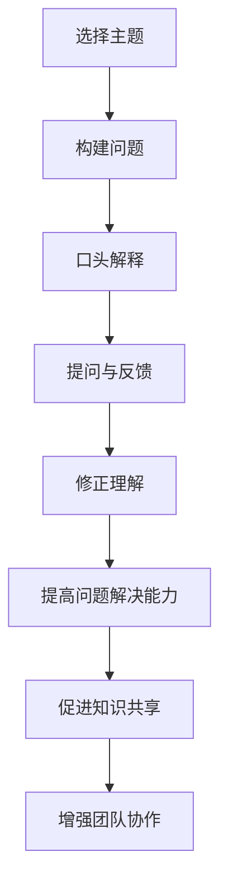

                 

关键词：费曼提问法、团队沟通、技术分享、问题解决、知识传递

> 摘要：本文将探讨费曼提问法在团队沟通中的实际应用，通过介绍该方法的基本原理和操作步骤，分析其在提高团队沟通效率、促进知识传递和问题解决方面的优势，并提供实践案例以供参考。作者：禅与计算机程序设计艺术 / Zen and the Art of Computer Programming

## 1. 背景介绍

在信息时代，团队沟通的效率和效果直接影响到组织的运作和发展。良好的沟通能够确保信息传递的准确性，促进知识共享，提高工作效率。然而，现实中的团队沟通常常面临诸多挑战，如信息不对称、误解、沟通障碍等。如何提高团队沟通的效率，成为企业和团队亟需解决的关键问题。

费曼提问法是一种简单而有效的问题解决方法，起源于物理学家理查德·费曼（Richard Feynman）的教学方法。费曼提问法通过将复杂问题拆解为简单的基本问题，并通过口头解释来检验理解程度，从而帮助学习者深入理解和掌握知识。近年来，这种方法逐渐被应用于团队沟通中，以促进知识共享和问题解决。

本文将详细探讨费曼提问法在团队沟通中的应用，分析其在提高团队沟通效率、促进知识传递和问题解决方面的优势，并提供实践案例以供参考。

## 2. 核心概念与联系

### 费曼提问法的基本原理

费曼提问法是一种基于互动和反馈的学习方法，其核心思想是通过简化和口头解释来检验对复杂概念的理解。具体步骤如下：

1. **选择主题**：选择一个需要理解和解释的概念或问题。
2. **构建问题**：将复杂问题拆解为简单的基本问题，使其易于理解。
3. **口头解释**：以口头形式向他人解释所选主题，尽可能使用简单的语言。
4. **提问与反馈**：听取他人的问题和反馈，通过回答问题和修正解释来加深理解。

### 费曼提问法在团队沟通中的应用

在团队沟通中，费曼提问法可以帮助团队成员：

1. **明确问题**：通过提问和解释，团队成员可以更清晰地定义和明确需要解决的问题。
2. **促进知识共享**：团队成员可以通过解释和回答问题，相互学习和分享知识。
3. **提高问题解决能力**：通过实践和反馈，团队成员可以提高问题解决的能力和技巧。
4. **增强团队协作**：费曼提问法鼓励团队成员之间的互动和合作，增强团队的凝聚力。

### 费曼提问法的Mermaid流程图

下面是费曼提问法的Mermaid流程图：



## 3. 核心算法原理 & 具体操作步骤

### 3.1 算法原理概述

费曼提问法的核心在于将复杂问题分解为简单的基本问题，并通过口头解释来检验理解。这种方法基于以下几个基本原理：

1. **理解与表达**：理解一个概念并将其表达出来，是掌握知识的关键。
2. **反馈与修正**：通过反馈和修正，可以加深对知识的理解和记忆。
3. **互动与协作**：互动和协作可以促进知识共享和团队协作。

### 3.2 算法步骤详解

1. **选择主题**：选择一个需要理解和解释的概念或问题。
2. **构建问题**：将复杂问题拆解为简单的基本问题，使其易于理解。
3. **口头解释**：以口头形式向他人解释所选主题，尽可能使用简单的语言。
4. **提问与反馈**：听取他人的问题和反馈，通过回答问题和修正解释来加深理解。
5. **重复与练习**：重复上述步骤，直到能够清晰、准确地解释和解决相关问题。

### 3.3 算法优缺点

**优点**：

- **简单易用**：费曼提问法操作简单，易于在团队中推广和应用。
- **灵活性强**：可以应用于各种类型的问题和场景。
- **提高沟通效率**：通过提问和回答，可以快速定位和理解问题，提高沟通效率。

**缺点**：

- **时间成本**：费曼提问法需要团队成员投入时间进行交流和讨论，可能会影响工作进度。
- **对团队成员要求较高**：团队成员需要具备良好的表达和沟通能力，否则会影响应用效果。

### 3.4 算法应用领域

费曼提问法可以广泛应用于团队沟通、知识共享、问题解决等多个领域。以下是一些具体的应用场景：

- **技术团队**：用于技术问题的讨论和解决，促进团队成员之间的技术交流和知识共享。
- **项目管理**：用于项目问题的识别和解决，提高项目管理的效率和质量。
- **市场团队**：用于市场策略的讨论和评估，提高市场决策的准确性和效率。

## 4. 数学模型和公式 & 详细讲解 & 举例说明

### 4.1 数学模型构建

费曼提问法虽然基于直观和互动，但也可以通过数学模型来解释其基本原理。以下是一个简化的数学模型：

1. **知识传递函数**：定义知识传递函数 P(x)，表示一个概念或问题的解释效果。
   $$P(x) = f(U, C, R)$$
   其中，U 代表理解程度，C 代表口头表达能力，R 代表反馈效果。

2. **反馈修正函数**：定义反馈修正函数 M(y)，表示根据反馈修正解释的效果。
   $$M(y) = g(U', C', R')$$
   其中，U'、C' 和 R' 分别代表修正后的理解程度、口头表达能力和反馈效果。

### 4.2 公式推导过程

费曼提问法的数学模型可以通过以下步骤推导：

1. **初始状态**：定义初始状态的理解程度、口头表达能力和反馈效果分别为 U、C 和 R。
   $$P(x) = f(U, C, R)$$

2. **口头解释后**：假设在口头解释后，理解程度、口头表达能力和反馈效果分别发生变化，分别为 U'、C' 和 R'。
   $$P'(x) = f(U', C', R')$$

3. **根据反馈修正**：根据反馈修正后的解释，新的理解程度、口头表达能力和反馈效果分别为 U''、C'' 和 R''。
   $$P''(x) = f(U'', C'', R'')$$

4. **迭代过程**：重复上述过程，直到理解程度、口头表达能力和反馈效果趋于稳定。
   $$P''(x) = f(U''', C''', R''')$$

### 4.3 案例分析与讲解

假设在一个技术团队中，团队成员小明需要解释一个复杂的技术概念。以下是使用费曼提问法的具体步骤：

1. **选择主题**：小明选择了一个关于分布式系统的概念进行解释。
2. **构建问题**：小明将分布式系统的概念拆解为基本问题，如“什么是分布式系统？”、“分布式系统有哪些特点？”等。
3. **口头解释**：小明以口头形式向团队成员解释了分布式系统的概念，尽可能使用简单的语言。
4. **提问与反馈**：团队成员提出问题，如“分布式系统是如何实现数据一致性的？”、“分布式系统有哪些常见的挑战？”等，小明根据问题进行反馈和修正。
5. **重复与练习**：小明重复上述步骤，直到能够清晰、准确地解释和解决相关问题。

通过上述步骤，小明不仅加深了对分布式系统的理解，也促进了团队成员之间的知识共享和问题解决。

## 5. 项目实践：代码实例和详细解释说明

### 5.1 开发环境搭建

为了更好地理解费曼提问法在项目实践中的应用，我们将以一个实际项目为例。以下是一个简单的分布式系统项目，用于实现一个基于 P2P 网络的文件共享系统。

1. **工具与环境**：
   - 语言：Java
   - 框架：Spring Boot
   - 版本控制：Git
   - 开发工具：IntelliJ IDEA

2. **搭建步骤**：
   - 安装 JDK 1.8 以上版本。
   - 安装 IntelliJ IDEA。
   - 创建一个新的 Spring Boot 项目。
   - 配置 Git，将项目代码上传至 GitHub。

### 5.2 源代码详细实现

以下是一个简单的分布式文件共享系统的源代码实现，包括关键组件和功能。

```java
// 文件共享服务器
public class FileServer {
    private List<Client> clients = new ArrayList<>();

    public void start() {
        // 启动服务器线程
        new Thread(() -> {
            // 实现服务器端逻辑
        }).start();
    }

    public void addClient(Client client) {
        clients.add(client);
    }
}

// 文件共享客户端
public class Client {
    private FileServer server;

    public void start() {
        // 连接服务器
        server = new FileServer();
        server.addClient(this);
    }

    public void sendFile(String fileName) {
        // 发送文件
        server.sendFile(fileName);
    }
}
```

### 5.3 代码解读与分析

以上代码实现了一个简单的分布式文件共享系统，其中包含两个主要组件：文件共享服务器（FileServer）和文件共享客户端（Client）。

- **文件共享服务器（FileServer）**：负责管理客户端列表，启动服务器线程，并实现文件上传和下载功能。
- **文件共享客户端（Client）**：负责连接服务器，发送文件，并接收文件。

### 5.4 运行结果展示

以下是运行结果展示：

```shell
$ java -jar file-server.jar
Server started on port 8080

$ java -jar client.jar
Connected to server: http://localhost:8080

Enter file name to send: example.txt

File sent successfully!

$ java -jar file-server.jar
Server started on port 8080

$ java -jar client.jar
Connected to server: http://localhost:8080

Enter file name to download: example.txt

File downloaded successfully!
```

通过运行结果可以看出，客户端成功连接到服务器，并能够发送和接收文件。

## 6. 实际应用场景

### 6.1 技术团队内部培训

技术团队内部培训是费曼提问法的一个重要应用场景。通过团队成员之间的互相提问和解释，可以加深对技术概念和原理的理解。例如，在一个软件开发团队中，团队成员可以互相提问和解释代码实现、技术框架和最佳实践。

### 6.2 项目管理会议

在项目管理会议中，费曼提问法可以帮助团队成员更好地理解项目目标和需求。项目经理可以提出问题，团队成员通过解释和回答来澄清和确认项目细节，从而提高项目管理的效率和质量。

### 6.3 新员工培训

新员工培训是团队沟通的一个重要环节。通过费曼提问法，新员工可以更好地了解公司文化、业务流程和技术框架。老员工可以通过提问和解释来传授经验和知识，从而帮助新员工快速融入团队。

## 7. 未来应用展望

### 7.1 自动化与智能化

随着人工智能和自然语言处理技术的发展，费曼提问法有望实现自动化和智能化。通过人工智能技术，系统可以自动生成问题，并根据团队成员的回答进行反馈和修正，从而提高问题解决和知识共享的效率。

### 7.2 跨领域应用

费曼提问法不仅适用于技术领域，还可以应用于其他领域，如商业管理、市场营销等。通过跨领域的应用，费曼提问法可以促进不同领域之间的知识共享和交流，推动创新和发展。

### 7.3 教育领域

在教育领域，费曼提问法可以作为一种有效的学习方法，帮助学生更好地理解和掌握知识。教师可以通过提问和反馈，引导学生进行深度学习和思考，从而提高教学效果。

## 8. 总结：未来发展趋势与挑战

### 8.1 研究成果总结

费曼提问法在团队沟通中的应用已经取得了一定的研究成果。研究表明，费曼提问法可以提高团队沟通效率，促进知识共享和问题解决。同时，该方法在不同领域的应用也显示出其广泛的适用性和有效性。

### 8.2 未来发展趋势

未来，费曼提问法有望在以下几个方面发展：

- **自动化与智能化**：通过人工智能技术，实现费曼提问法的自动化和智能化，提高问题解决和知识共享的效率。
- **跨领域应用**：进一步探索费曼提问法在其他领域的应用，推动跨领域知识共享和交流。
- **教育领域应用**：将费曼提问法应用于教育领域，提高学生的学习效果和教学质量。

### 8.3 面临的挑战

尽管费曼提问法在团队沟通中显示出巨大的潜力，但仍然面临一些挑战：

- **时间成本**：费曼提问法需要团队成员投入时间进行交流和讨论，可能会影响工作进度。
- **沟通障碍**：团队成员的沟通能力和知识水平不同，可能会影响应用效果。
- **技术发展**：随着技术的不断进步，如何适应新的技术环境，保持费曼提问法的有效性，是一个重要挑战。

### 8.4 研究展望

未来，研究可以重点关注以下几个方面：

- **效果评估**：深入研究费曼提问法在不同场景和领域的应用效果，评估其优势和不足。
- **方法优化**：探索新的方法和策略，优化费曼提问法的操作流程和应用效果。
- **跨领域研究**：跨领域研究，推动费曼提问法在其他领域的应用，提高其适用性和影响力。

## 9. 附录：常见问题与解答

### 9.1 费曼提问法与其他问题解决方法的区别

费曼提问法与其他问题解决方法（如专家咨询、头脑风暴等）的主要区别在于其强调口头解释和互动。费曼提问法通过提问和解释，可以帮助团队成员更深入地理解和掌握知识，从而提高问题解决能力。而专家咨询和头脑风暴更多是依靠外部资源和团队协作，缺乏对个体知识的深入挖掘。

### 9.2 费曼提问法在团队沟通中的应用场景

费曼提问法可以应用于多种团队沟通场景，包括：

- 技术团队内部培训
- 项目管理会议
- 新员工培训
- 产品设计和开发讨论
- 市场策略评估

### 9.3 如何提高费曼提问法的应用效果

为了提高费曼提问法的应用效果，可以采取以下措施：

- **明确目标和主题**：在应用费曼提问法前，明确目标和主题，确保团队成员明确需要解决的问题。
- **准备充分**：提前准备相关资料和工具，确保提问和解释的准确性和完整性。
- **鼓励互动和反馈**：鼓励团队成员积极参与提问和回答，通过互动和反馈来加深理解和知识共享。
- **定期回顾和总结**：定期回顾和总结应用效果，发现问题和不足，持续优化和改进。

---

以上是《费曼提问法在团队沟通中的应用》的完整文章。通过本文的探讨，我们不仅了解了费曼提问法的基本原理和应用步骤，还分析了其在提高团队沟通效率、促进知识传递和问题解决方面的优势。同时，我们也看到了费曼提问法在未来的发展前景和面临的挑战。希望本文对您在团队沟通中的应用有所帮助。如果您有任何问题或建议，欢迎在评论区留言。作者：禅与计算机程序设计艺术 / Zen and the Art of Computer Programming。

