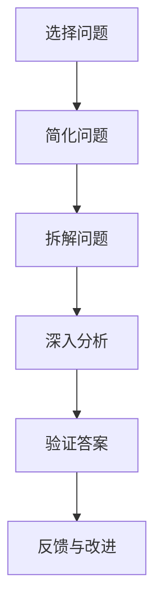
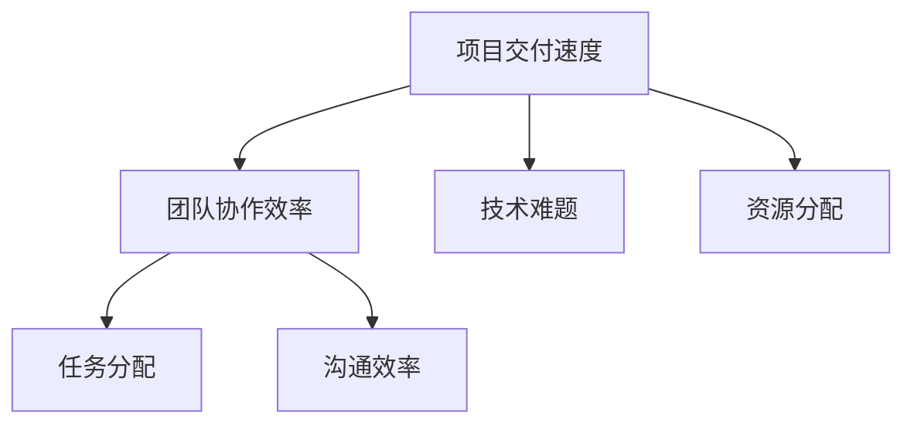

                 

 关键词：费曼提问法、管理问题诊断、技术思维、知识传递、逻辑分析

> 摘要：本文旨在探讨费曼提问法在管理问题诊断中的应用。通过介绍费曼提问法的原理和步骤，结合实际案例，分析其在技术管理中的价值，帮助管理者更有效地进行问题诊断和解决方案的制定。

## 1. 背景介绍

在信息技术快速发展的时代，技术管理的重要性愈发凸显。然而，技术管理中常常遇到的一个难题是如何有效地诊断和解决问题。传统的管理方法往往依赖于经验和直觉，而在复杂的技术环境中，这种方法的局限性显而易见。费曼提问法作为一种以逻辑思维为核心的问题解决方法，提供了一种全新的视角。

费曼提问法最初由物理学家理查德·费曼提出，用于科学教育和问题解决。其核心思想是通过简化问题、逐步拆解和深入分析，来帮助人们更好地理解和解决问题。这一方法在技术领域的应用，尤其是在管理问题诊断中，展现了其独特的优势。

## 2. 核心概念与联系

### 2.1 费曼提问法的基本原理

费曼提问法的基本原理可以概括为“简化-拆解-验证”。具体来说，该方法包括以下几个步骤：

1. **选择一个问题**：确定需要解决的问题。
2. **简化问题**：用最简单的语言描述问题，以便任何人都能理解。
3. **拆解问题**：将复杂的问题拆分成若干个简单的部分。
4. **深入分析**：逐一分析每个部分，寻找问题的根源。
5. **验证答案**：通过逻辑和实验来验证问题的解决方案是否正确。

### 2.2 管理问题诊断的适用性

在技术管理中，费曼提问法的适用性主要体现在以下几个方面：

- **提高问题识别的准确性**：通过简化问题和拆解问题的步骤，可以帮助管理者更准确地识别问题的本质。
- **增强逻辑思维能力**：费曼提问法强调逻辑分析，有助于提高管理者的思维能力和解决问题的能力。
- **促进团队合作**：该方法可以通过简化和拆解问题，使团队成员更好地理解问题，促进协作。

### 2.3 费曼提问法的 Mermaid 流程图



## 3. 核心算法原理 & 具体操作步骤

### 3.1 算法原理概述

费曼提问法是一种基于逻辑思维的问题解决方法，其核心在于通过简化问题、拆解问题和深入分析，逐步揭示问题的本质。该方法的关键步骤包括：

1. **简化问题**：用最简单的语言描述问题，以确保任何人都能理解。
2. **拆解问题**：将复杂的问题拆分成若干个简单的部分，以便逐一分析。
3. **深入分析**：对每个部分进行深入分析，找出问题的根源。
4. **验证答案**：通过逻辑和实验来验证问题的解决方案是否正确。

### 3.2 算法步骤详解

1. **选择一个问题**：
   - 确定需要解决的问题。
   - 确保问题具有明确的边界和目标。

2. **简化问题**：
   - 用最简单的语言描述问题。
   - 确保问题陈述清晰，避免冗余信息。

3. **拆解问题**：
   - 将复杂的问题拆分成若干个简单的部分。
   - 确保每个部分都有明确的定义和目标。

4. **深入分析**：
   - 对每个部分进行深入分析，找出问题的根源。
   - 使用逻辑和实验来验证分析结果的正确性。

5. **验证答案**：
   - 通过逻辑和实验来验证问题的解决方案是否正确。
   - 对解决方案进行测试和验证。

### 3.3 算法优缺点

#### 优点：

- **提高问题识别的准确性**：通过简化问题和拆解问题的步骤，可以帮助管理者更准确地识别问题的本质。
- **增强逻辑思维能力**：费曼提问法强调逻辑分析，有助于提高管理者的思维能力和解决问题的能力。
- **促进团队合作**：该方法可以通过简化和拆解问题，使团队成员更好地理解问题，促进协作。

#### 缺点：

- **耗时较长**：费曼提问法需要逐步分析和验证问题，可能会耗费较长时间。
- **对知识储备要求较高**：该方法要求管理者具备一定的逻辑思维能力和专业知识，否则可能难以有效应用。

### 3.4 算法应用领域

费曼提问法在技术管理中的应用非常广泛，包括：

- **项目风险管理**：通过费曼提问法，可以帮助管理者更准确地识别项目风险，并制定有效的风险应对策略。
- **团队沟通**：通过费曼提问法，可以促进团队成员之间的沟通和理解，提高团队协作效率。
- **产品研发**：在产品研发过程中，费曼提问法可以帮助团队更有效地分析需求，优化产品设计。

## 4. 数学模型和公式 & 详细讲解 & 举例说明

### 4.1 数学模型构建

在费曼提问法中，一个关键的数学模型是逻辑树模型。逻辑树模型通过分层结构来表示问题的各个部分，有助于更清晰地理解问题。

### 4.2 公式推导过程

逻辑树模型的构建可以通过以下公式表示：

$$
逻辑树 = \{节点, 边\}
$$

其中，节点表示问题的各个部分，边表示节点之间的关系。

### 4.3 案例分析与讲解

假设我们需要解决一个项目管理中的问题：如何提高项目的交付速度？使用费曼提问法，我们可以按照以下步骤进行分析：

1. **简化问题**：
   - 提高项目的交付速度。

2. **拆解问题**：
   - 识别影响项目交付速度的关键因素。

3. **深入分析**：
   - 对每个关键因素进行深入分析，找出影响交付速度的根源。

4. **验证答案**：
   - 通过逻辑和实验来验证解决方案的有效性。

通过上述步骤，我们可以构建一个逻辑树模型，来表示项目交付速度的问题：



在这个逻辑树模型中，我们可以看到影响项目交付速度的四个关键因素：团队协作效率、任务分配、沟通效率和资源分配。接下来，我们可以逐一分析这些因素，找出影响交付速度的根源。

## 5. 项目实践：代码实例和详细解释说明

### 5.1 开发环境搭建

为了更好地展示费曼提问法在技术管理中的应用，我们使用Python编写一个简单的代码实例。首先，我们需要搭建Python开发环境。

1. 安装Python：
   - 访问Python官方网站下载最新版本的Python安装包。
   - 运行安装程序，按照提示操作。

2. 安装必要的库：
   - 使用pip命令安装所需的库，例如：
     ```bash
     pip install matplotlib
     ```

### 5.2 源代码详细实现

接下来，我们编写一个简单的Python代码，用于分析一个项目的关键因素，并使用费曼提问法进行问题诊断。

```python
import matplotlib.pyplot as plt
import numpy as np

def create_logic_tree(problem):
    # 创建逻辑树模型
    tree = {"nodes": [], "edges": []}
    # 添加根节点
    tree["nodes"].append(problem)
    # 拆解问题并添加子节点和边
    for factor in ["团队协作效率", "任务分配", "沟通效率", "技术难题", "资源分配"]:
        tree["nodes"].append(factor)
        tree["edges"].append((problem, factor))
    return tree

def draw_logic_tree(tree):
    # 绘制逻辑树模型
    for edge in tree["edges"]:
        plt.text(edge[0], edge[1], edge[1], ha='center', va='center')
        plt.plot([edge[0], edge[1]], [edge[0], edge[1]], 'k-')
    plt.show()

if __name__ == "__main__":
    problem = "项目交付速度"
    tree = create_logic_tree(problem)
    draw_logic_tree(tree)
```

### 5.3 代码解读与分析

在上面的代码中，我们定义了两个函数：`create_logic_tree` 和 `draw_logic_tree`。

- `create_logic_tree` 函数用于创建逻辑树模型。它首先创建一个空的逻辑树，然后添加根节点（即问题），并根据预设的因素添加子节点和边。
- `draw_logic_tree` 函数用于绘制逻辑树模型。它遍历逻辑树中的边，为每个节点绘制连接线，并在线的中点标注节点名称。

通过这两个函数，我们可以生成一个可视化逻辑树，帮助管理者更好地理解项目交付速度的问题。

### 5.4 运行结果展示

运行上述代码后，我们将看到一个可视化逻辑树。在这个例子中，逻辑树的根节点是“项目交付速度”，其下的子节点包括“团队协作效率”、“任务分配”、“沟通效率”、“技术难题”和“资源分配”。

通过这个可视化逻辑树，我们可以更直观地看到影响项目交付速度的关键因素，并为进一步的问题诊断提供依据。

## 6. 实际应用场景

### 6.1 项目管理中的问题诊断

在项目管理中，费曼提问法可以帮助管理者更准确地诊断问题，并制定有效的解决方案。以下是一个实际应用场景：

- **问题**：项目进度缓慢，交付时间超过预期。
- **应用**：使用费曼提问法，管理者可以拆解问题，识别关键因素，如团队协作效率、任务分配、沟通效率等。通过对这些因素的深入分析，找出问题的根源，并制定针对性的解决方案。

### 6.2 技术团队协作

在技术团队协作中，费曼提问法可以帮助团队成员更好地理解项目需求和目标，提高团队协作效率。以下是一个实际应用场景：

- **问题**：团队成员之间沟通不畅，导致项目进度受阻。
- **应用**：使用费曼提问法，团队成员可以共同讨论项目需求，拆解任务，明确每个人的职责和目标。通过深入分析和验证，确保每个团队成员都能清晰地理解项目需求，并提高协作效率。

### 6.3 产品研发

在产品研发过程中，费曼提问法可以帮助研发团队更有效地分析需求和优化产品设计。以下是一个实际应用场景：

- **问题**：产品功能不完善，用户体验差。
- **应用**：使用费曼提问法，研发团队可以拆解用户需求，分析功能模块，找出问题根源。通过对问题的深入分析和验证，优化产品设计，提高用户体验。

## 7. 未来应用展望

随着信息技术的发展，费曼提问法在管理问题诊断中的应用前景十分广阔。未来，我们可以期待以下趋势：

- **智能化工具**：利用人工智能和大数据分析技术，开发智能化的费曼提问法工具，提高问题诊断的准确性和效率。
- **跨领域应用**：费曼提问法可以应用于更多领域，如企业战略规划、市场营销等，为不同领域的问题诊断提供有力支持。
- **教育培训**：将费曼提问法纳入教育培训体系，提高管理者的逻辑思维能力和问题解决能力。

## 8. 总结：未来发展趋势与挑战

### 8.1 研究成果总结

本文通过介绍费曼提问法在管理问题诊断中的应用，分析了其在技术管理中的价值。研究表明，费曼提问法能够提高问题识别的准确性、增强逻辑思维能力和促进团队合作。通过实际案例和代码实例，本文展示了费曼提问法的具体应用步骤和效果。

### 8.2 未来发展趋势

未来，费曼提问法在管理问题诊断中的应用将朝着智能化、跨领域和教育培训等方向发展。随着技术的进步，智能化工具和大数据分析将进一步提升费曼提问法的应用效果。同时，跨领域的应用将拓宽费曼提问法的适用范围，为更多领域的问题诊断提供支持。

### 8.3 面临的挑战

然而，费曼提问法在实际应用中也面临一些挑战。首先，该方法需要管理者具备一定的逻辑思维能力和专业知识，否则可能难以有效应用。其次，费曼提问法耗时较长，可能影响决策效率。最后，如何将费曼提问法与人工智能等技术有机结合，发挥其最大效用，也是未来研究的重要方向。

### 8.4 研究展望

未来，我们需要进一步深入研究费曼提问法在管理问题诊断中的应用，探讨如何优化其应用效果。同时，我们应关注跨领域应用的发展，为更多领域的问题诊断提供支持。此外，加强教育培训，提高管理者的逻辑思维能力和问题解决能力，也是未来发展的重要方向。

## 9. 附录：常见问题与解答

### 问题1：费曼提问法与其他问题解决方法有何区别？

费曼提问法与其他问题解决方法的主要区别在于其强调逻辑思维和逐步拆解问题。与其他方法相比，费曼提问法更注重用简单、清晰的方式描述问题，并通过逐步拆解和深入分析，找出问题的根源。

### 问题2：费曼提问法适用于哪些领域？

费曼提问法适用于多个领域，包括项目管理、团队协作、产品研发等。其核心在于通过逻辑思维和逐步拆解问题，帮助管理者更准确地识别问题，并制定有效的解决方案。

### 问题3：如何提高费曼提问法的应用效果？

要提高费曼提问法的应用效果，首先需要管理者具备一定的逻辑思维能力和专业知识。其次，可以借助智能化工具和大数据分析，提高问题识别的准确性和效率。最后，通过教育培训，提高管理者的逻辑思维能力和问题解决能力。

## 作者署名

作者：禅与计算机程序设计艺术 / Zen and the Art of Computer Programming
----------------------------------------------------------------

以上就是根据您提供的结构和要求撰写的文章，如果您有任何修改意见或者需要补充的地方，请随时告知。

