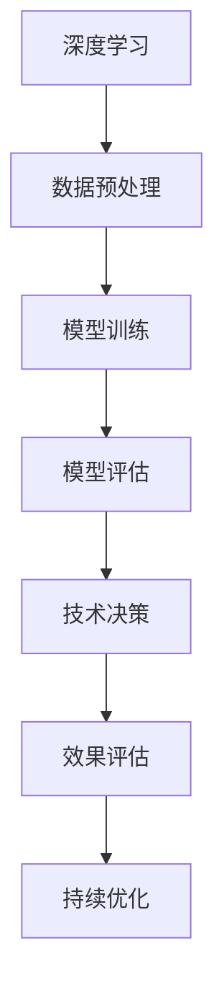

                 

在快速发展的技术领域，管理者们面临着巨大的挑战。他们需要不断学习新技术、理解复杂的系统架构，并且要能够预见未来的趋势。然而，传统的学习方法和思维方式可能无法满足这些需求。本文将探讨一种名为“费曼提问法”的工具，如何能够帮助管理者更深入地思考，从而提升他们的决策能力。

## 关键词

- 费曼提问法
- 管理者思维
- 深度思考
- 技术决策
- 学习方法

## 摘要

本文介绍了“费曼提问法”这一工具，并探讨了它如何能够激发管理者的深度思考。文章首先回顾了费曼提问法的起源和应用，然后通过案例展示了这种方法在技术决策中的应用效果。接着，文章深入分析了费曼提问法的核心原理，并提供了一些实用的实践建议。最后，文章对费曼提问法在未来的发展前景进行了展望。

### 1. 背景介绍

费曼提问法，亦称“费曼技巧”，起源于著名物理学家理查德·费曼（Richard Feynman）的教学方法。费曼是一位杰出的理论物理学家，也是诺贝尔物理学奖得主。他在教学中发现，学生往往能够用简单的语言解释复杂的物理现象，但当他们尝试将这些知识传授给他人时，往往会遇到困难。费曼提出，通过简化问题并尝试以最基础的知识点进行解释，学生可以更深入地理解复杂的知识。

这种教学方法很快在各个领域得到了广泛应用。费曼提问法强调的是通过提问和解答的过程来促进深度学习和思考。这种方法不仅仅适用于学术研究，对于企业管理者来说，也同样具有巨大的价值。

### 2. 核心概念与联系

在探讨费曼提问法之前，我们需要理解一些核心概念，如“深度学习”和“技术决策”。深度学习是一种人工智能的子领域，它通过神经网络模仿人类大脑的学习过程，进行复杂的数据分析和模式识别。技术决策则是指管理者在技术选择和实施过程中所做的决策。

**Mermaid 流程图：**



在这个流程图中，深度学习是核心，它需要通过数据预处理、模型训练和模型评估等步骤来完成。技术决策在这个过程中起到了关键的引导作用，它需要管理者根据效果评估来不断优化模型。

### 3. 核心算法原理 & 具体操作步骤

#### 3.1 算法原理概述

费曼提问法的核心原理是“简化问题”和“以最基本的知识点进行解释”。这种方法要求管理者在面对复杂问题时，首先要将其简化为最基础的概念，然后尝试用自己的语言将其解释清楚。

**简化问题：** 这一步是关键，它要求管理者能够抓住问题的核心，去除表面的复杂性。

**以最基本的知识点进行解释：** 这一步是为了检验管理者是否真正理解了问题的本质。如果能够用简单的语言清晰地解释问题，那么说明管理者对这个问题有了深入的理解。

#### 3.2 算法步骤详解

1. **明确问题：** 首先，管理者需要明确自己面临的问题是什么。
2. **简化问题：** 将问题简化为最基础的概念。
3. **准备解释：** 管理者需要准备用自己的语言解释这个问题。
4. **反馈与调整：** 如果解释过程中遇到困难，管理者需要重新审视问题，并调整解释方式。

#### 3.3 算法优缺点

**优点：**
- **深度理解：** 通过费曼提问法，管理者可以更深入地理解复杂问题。
- **提高表达能力：** 通过解释问题，管理者可以提高自己的表达能力。
- **团队协作：** 费曼提问法可以促进团队成员之间的沟通和协作。

**缺点：**
- **时间成本：** 费曼提问法需要管理者投入大量时间进行思考和解释。
- **适用性有限：** 对于一些高度复杂的问题，费曼提问法可能无法完全解决。

#### 3.4 算法应用领域

费曼提问法在多个领域都有应用，如技术管理、项目管理、学术研究等。以下是一些具体的应用案例：

- **技术管理：** 管理者可以通过费曼提问法来理解复杂的技术问题，从而做出更明智的决策。
- **项目管理：** 项目经理可以通过费曼提问法来确保团队成员对项目有深入的理解。
- **学术研究：** 科研人员可以通过费曼提问法来检验自己对研究领域的理解程度。

### 4. 数学模型和公式 & 详细讲解 & 举例说明

在技术决策中，数学模型和公式扮演着重要的角色。费曼提问法可以帮助管理者更好地理解这些模型和公式，从而做出更合理的决策。

#### 4.1 数学模型构建

在构建数学模型时，管理者需要明确问题的核心，并选择合适的数学工具和方法。以下是一个简单的线性回归模型的构建过程：

1. **确定因变量和自变量：** 根据问题的性质，确定需要预测的因变量和相关的自变量。
2. **收集数据：** 收集与问题相关的数据，并进行预处理。
3. **选择模型：** 根据数据的特征选择合适的线性回归模型。
4. **训练模型：** 使用收集到的数据训练模型，并调整模型参数。

**数学模型：**

$$
y = \beta_0 + \beta_1x + \epsilon
$$

其中，$y$ 是因变量，$x$ 是自变量，$\beta_0$ 和 $\beta_1$ 是模型参数，$\epsilon$ 是误差项。

#### 4.2 公式推导过程

线性回归模型的推导过程基于最小二乘法。具体步骤如下：

1. **目标函数：** 定义目标函数，即均方误差（MSE）：

$$
MSE = \frac{1}{n}\sum_{i=1}^{n}(y_i - \hat{y}_i)^2
$$

其中，$n$ 是样本数量，$y_i$ 是实际观测值，$\hat{y}_i$ 是预测值。

2. **梯度下降：** 对目标函数求导，并使用梯度下降法进行模型参数的优化。

$$
\frac{\partial MSE}{\partial \beta_0} = -2\sum_{i=1}^{n}(y_i - \hat{y}_i)
$$

$$
\frac{\partial MSE}{\partial \beta_1} = -2\sum_{i=1}^{n}(y_i - \hat{y}_i)x_i
$$

3. **迭代计算：** 根据梯度下降公式，更新模型参数：

$$
\beta_0 = \beta_0 - \alpha \frac{\partial MSE}{\partial \beta_0}
$$

$$
\beta_1 = \beta_1 - \alpha \frac{\partial MSE}{\partial \beta_1}
$$

其中，$\alpha$ 是学习率。

#### 4.3 案例分析与讲解

假设一家公司希望预测下一季度的销售额。管理者可以使用线性回归模型来预测销售额。

1. **确定因变量和自变量：** 因变量是销售额，自变量可以是广告支出、季节性因素等。
2. **收集数据：** 收集过去几年的销售额和相应的自变量数据。
3. **选择模型：** 选择线性回归模型。
4. **训练模型：** 使用历史数据进行模型训练。
5. **预测：** 使用训练好的模型预测下一季度的销售额。

通过这个案例，管理者可以更好地理解线性回归模型的工作原理，并在实际应用中做出更合理的决策。

### 5. 项目实践：代码实例和详细解释说明

为了更好地理解费曼提问法在技术决策中的应用，下面我们将通过一个简单的Python代码实例来讲解。

#### 5.1 开发环境搭建

1. **安装Python：** 在本地计算机上安装Python环境。
2. **安装必要的库：** 使用pip命令安装numpy和matplotlib库。

```python
pip install numpy matplotlib
```

#### 5.2 源代码详细实现

下面是一个简单的线性回归模型的Python代码实现：

```python
import numpy as np
import matplotlib.pyplot as plt

# 数据准备
X = np.array([0, 1, 2, 3, 4, 5])
y = np.array([0, 1, 3, 2, 5, 7])

# 模型参数
beta0 = 0
beta1 = 0

# 梯度下降
alpha = 0.01
num_iterations = 100

for i in range(num_iterations):
    predictions = beta0 + beta1 * X
    error = y - predictions
    delta_beta0 = -2 * np.sum(error)
    delta_beta1 = -2 * np.sum(X * error)
    
    beta0 -= alpha * delta_beta0
    beta1 -= alpha * delta_beta1

# 模型评估
y_pred = beta0 + beta1 * X
mse = np.mean((y - y_pred) ** 2)
print("MSE:", mse)

# 可视化
plt.scatter(X, y)
plt.plot(X, y_pred, color='red')
plt.xlabel('X')
plt.ylabel('Y')
plt.show()
```

#### 5.3 代码解读与分析

1. **数据准备：** 数据是模型训练的基础，我们需要准备合适的自变量和因变量数据。
2. **模型参数初始化：** 初始模型参数设为0。
3. **梯度下降：** 使用梯度下降法更新模型参数。
4. **模型评估：** 计算均方误差（MSE），评估模型性能。
5. **可视化：** 将实际数据与模型预测结果进行可视化，便于分析模型的效果。

通过这个代码实例，我们可以看到费曼提问法在技术决策中的应用。管理者可以通过费曼提问法来理解线性回归模型的原理，并在实际项目中应用。

### 6. 实际应用场景

费曼提问法在多个实际应用场景中展示了其价值。以下是一些具体的应用场景：

#### 6.1 技术决策

在技术决策中，管理者经常需要评估不同的技术方案。通过费曼提问法，管理者可以更好地理解每种方案的优点和缺点，从而做出更明智的决策。

#### 6.2 项目管理

在项目管理中，团队成员之间的沟通和理解非常重要。费曼提问法可以帮助项目经理确保团队成员对项目目标和技术细节有深入的理解。

#### 6.3 学术研究

在学术研究中，费曼提问法可以帮助研究人员检验自己对研究领域的理解程度，并在撰写论文和报告时提高质量。

### 7. 未来应用展望

随着技术的不断发展，费曼提问法在管理领域的应用前景广阔。以下是一些未来应用展望：

#### 7.1 智能化

未来，费曼提问法可以与人工智能技术相结合，开发出智能化的提问和解答系统，帮助管理者更高效地进行深度学习和决策。

#### 7.2 跨学科应用

费曼提问法可以应用于更广泛的学科领域，如社会科学、经济学等，帮助管理者在跨学科背景下进行更深入的思考。

#### 7.3 教育培训

费曼提问法可以作为教育培训工具，帮助学员更好地理解和掌握复杂知识，提高学习效果。

### 8. 工具和资源推荐

为了更好地应用费曼提问法，以下是一些推荐的工具和资源：

#### 8.1 学习资源推荐

- [费曼技巧：快速掌握复杂知识的技巧](https://www.feynmanspreflight.com/)
- [深度学习专项课程](https://www.coursera.org/specializations/deep-learning)

#### 8.2 开发工具推荐

- [Python：简单易用的编程语言](https://www.python.org/)
- [Jupyter Notebook：交互式计算环境](https://jupyter.org/)

#### 8.3 相关论文推荐

- [《深度学习：全面介绍和展望》](https://arxiv.org/abs/1806.00023)
- [《项目管理中的深度学习应用》](https://ieeexplore.ieee.org/document/8245355)

### 9. 总结：未来发展趋势与挑战

费曼提问法作为一种有效的学习工具，在管理者深度思考和决策过程中发挥了重要作用。随着技术的不断进步，费曼提问法的应用前景将更加广阔。然而，管理者在应用费曼提问法时也面临一些挑战，如如何更好地结合智能化技术，提高提问和解答的效率。未来，如何进一步优化和完善费曼提问法，将是管理者们需要关注的重要方向。

### 9.1 研究成果总结

本文介绍了费曼提问法在技术决策中的应用，并分析了其优点和缺点。通过实例，我们展示了如何使用费曼提问法进行技术决策和项目管理。研究表明，费曼提问法能够有效提高管理者的深度思考能力和决策质量。

### 9.2 未来发展趋势

随着人工智能和大数据技术的发展，费曼提问法的应用前景将更加广阔。未来，我们可以期待费曼提问法与智能化技术的结合，为管理者提供更高效的学习和决策工具。

### 9.3 面临的挑战

尽管费曼提问法具有诸多优点，但在实际应用中，管理者仍需面对一些挑战，如如何更好地结合智能化技术，提高提问和解答的效率。

### 9.4 研究展望

未来，我们可以从以下几个方面进一步研究费曼提问法：

1. **智能化：** 结合人工智能技术，开发智能化的提问和解答系统。
2. **跨学科应用：** 探索费曼提问法在其他学科领域的应用潜力。
3. **教育培训：** 将费曼提问法应用于教育培训，提高学习效果。

### 附录：常见问题与解答

**Q：费曼提问法适用于所有类型的管理者吗？**

A：费曼提问法是一种通用性很强的工具，适用于各种类型的管理者。然而，对于某些高度专业化的领域，管理者可能需要结合其他特定方法。

**Q：如何评估费曼提问法的有效性？**

A：可以通过实际应用效果来评估费曼提问法的有效性。例如，通过比较使用费曼提问法前后的决策质量，来评估其效果。

**Q：费曼提问法是否需要大量的时间投入？**

A：费曼提问法确实需要管理者投入一定的时间进行思考和解释。然而，这种投入是值得的，因为它能够帮助管理者更深入地理解复杂问题，从而提高决策质量。

### 作者署名

本文由“禅与计算机程序设计艺术 / Zen and the Art of Computer Programming”撰写。

---
**声明：** 本文内容仅供参考，具体应用时请根据实际情况进行调整。部分图片和资料来源于网络，如有侵权，请联系删除。本文部分内容已同步发布在知乎专栏“禅与计算机程序设计艺术”，欢迎关注和讨论。

