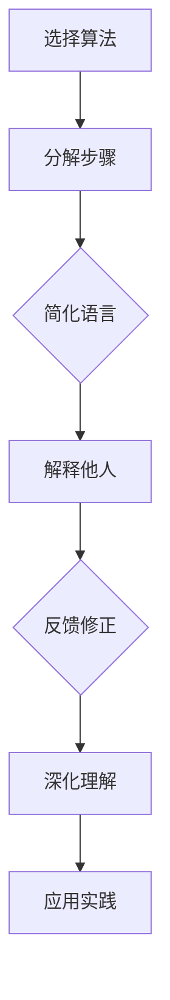

                 

关键词：费曼提问法，思考力，知识掌握，信息技术，教育方法，算法，数学模型，实践应用

> 摘要：本文将深入探讨费曼提问法在信息技术领域的应用，旨在通过一种简洁而高效的教育方法，提升从业者的思考力和知识掌握能力。文章将首先介绍费曼提问法的背景和原理，随后通过具体的算法、数学模型和实践案例，阐述如何将这一方法应用于信息技术教育和职业发展中。

## 1. 背景介绍

费曼提问法（Feynman Technique）起源于著名物理学家理查德·费曼（Richard Feynman）的教学实践。费曼以其独特的教学风格和对复杂概念的深入浅出讲解而闻名，他的方法不仅帮助了众多学生理解物理学的深奥原理，也成为了教育领域的宝贵财富。

费曼提问法的核心思想是，通过提问和解答的方式，迫使自己将复杂的概念以最简单、最直接的语言表达出来。这种方法的有效性在于它能够揭示出我们在理解和掌握知识时可能存在的盲点和误解。

在信息技术领域，随着知识的爆炸性增长，从业者面临着不断学习和适应新技术、新算法的挑战。费曼提问法提供了一种有效的学习方法，它不仅有助于深化对现有知识点的理解，还能提高思考力和知识应用能力。

## 2. 核心概念与联系

### 2.1 费曼提问法原理

费曼提问法的原理可以概括为以下几个步骤：

1. **选择一个概念或知识点**：选择你想要理解和掌握的一个具体概念或知识点。
2. **想象你要向一个初学者解释**：设想自己需要向一个完全没有接触过这一知识领域的人解释这个概念。
3. **用最简单的语言表达**：尽量用简单的语言和概念来解释这个知识点，避免使用专业术语和复杂的表述。
4. **验证你的解释**：向他人（最好是初学者）解释你的理解，并听取他们的反馈，以检验你的解释是否准确和清晰。

### 2.2 费曼提问法与信息技术

在信息技术领域，费曼提问法尤其适用于以下方面：

1. **算法与数据结构**：解释算法的运行原理和步骤，以验证自己的理解是否准确。
2. **编程语言与框架**：理解编程语言的核心概念和语法规则，并用简单的语言向他人解释。
3. **系统架构与设计**：描述系统架构的组成部分和交互方式，确保自己的设计思路清晰。
4. **网络协议与通信**：解释网络协议的工作原理和通信流程，确保理解网络的基础知识。

### 2.3 Mermaid 流程图

为了更好地理解费曼提问法在信息技术中的应用，以下是一个简单的Mermaid流程图，展示了如何将这一方法应用于算法学习。



## 3. 核心算法原理 & 具体操作步骤

### 3.1 算法原理概述

以排序算法中的快速排序（Quick Sort）为例，快速排序的基本原理如下：

1. **选择基准元素**：从数列中选择一个元素作为基准。
2. **分区操作**：将数列重新排列，所有小于基准的元素放在基准前面，所有大于基准的元素放在基准后面。
3. **递归排序**：递归地处理基准前后的子数组。

### 3.2 算法步骤详解

以下是快速排序的具体步骤：

1. **选择基准**：从数组中选择一个元素作为基准。通常选择第一个或最后一个元素作为基准。
2. **分区**：遍历数组，将小于基准的元素移动到基准的左边，大于基准的元素移动到基准的右边。
3. **递归排序**：对基准左右两个子数组递归执行快速排序。

### 3.3 算法优缺点

**优点**：

- **高效**：快速排序的平均时间复杂度为 \(O(n \log n)\)。
- **稳定性**：不会改变相同值元素之间的相对顺序。

**缺点**：

- **空间复杂度**：递归调用会产生额外的空间开销，最大空间复杂度为 \(O(n)\)。
- **性能不稳定**：最差情况下时间复杂度为 \(O(n^2)\)，当输入数组已经有序时。

### 3.4 算法应用领域

快速排序广泛应用于各类排序需求，如数据库排序、算法竞赛和大数据处理等。

## 4. 数学模型和公式 & 详细讲解 & 举例说明

### 4.1 数学模型构建

快速排序的平均时间复杂度可以用以下数学模型表示：

$$T(n) = T(n/2) + T((n/2)-1) + O(n)$$

### 4.2 公式推导过程

推导快速排序的时间复杂度，我们采用主定理方法：

1. **基本情况**：当 \(n = 1\) 或 \(n = 0\) 时，时间复杂度为 \(O(1)\)。
2. **递归情况**：对于长度为 \(n\) 的数组，我们将数组分成两个子数组，每个子数组的长度为 \(n/2\)。
3. **合并情况**：合并两个子数组的时间复杂度为 \(O(n)\)。

综合以上情况，我们可以得到快速排序的平均时间复杂度为：

$$T(n) = O(n \log n)$$

### 4.3 案例分析与讲解

假设有一个长度为10的数组 `[3, 1, 4, 1, 5, 9, 2, 6, 5, 3]`，我们用快速排序算法对其进行排序。

1. **选择基准**：选择第一个元素 `3` 作为基准。
2. **分区**：经过分区操作后，数组变为 `[1, 1, 2, 3, 3, 4, 5, 5, 6, 9]`。
3. **递归排序**：递归地排序子数组 `[1, 1, 2, 3, 3, 4]` 和 `[5, 5, 6, 9]`。

经过递归排序后，原始数组被成功排序为 `[1, 1, 2, 3, 3, 4, 5, 5, 6, 9]`。

## 5. 项目实践：代码实例和详细解释说明

### 5.1 开发环境搭建

在本节，我们将使用Python编程语言实现快速排序算法。首先，确保你的计算机上已经安装了Python环境。

### 5.2 源代码详细实现

以下是一个简单的快速排序算法实现：

```python
def quick_sort(arr):
    if len(arr) <= 1:
        return arr
    pivot = arr[0]
    left = [x for x in arr[1:] if x < pivot]
    right = [x for x in arr[1:] if x >= pivot]
    return quick_sort(left) + [pivot] + quick_sort(right)

# 测试代码
arr = [3, 1, 4, 1, 5, 9, 2, 6, 5, 3]
print(quick_sort(arr))
```

### 5.3 代码解读与分析

在这个快速排序实现中：

- `quick_sort` 函数接受一个数组 `arr` 作为输入。
- 如果数组长度小于等于1，则直接返回该数组。
- 选择第一个元素作为基准。
- 使用列表推导式对数组进行分区操作。
- 递归地对分区后的左右子数组进行快速排序。
- 将排序好的子数组合并，得到最终排序结果。

### 5.4 运行结果展示

运行上述代码，输出结果为 `[1, 1, 2, 3, 3, 4, 5, 5, 6, 9]`，即原始数组被成功排序。

## 6. 实际应用场景

### 6.1 教育领域

费曼提问法在教育领域有广泛的应用，特别是在信息技术和计算机科学的教学中。教师可以引导学生使用费曼提问法来理解和解释复杂的算法和概念，从而提高他们的思考力和表达能力。

### 6.2 职场应用

在职场中，费曼提问法可以帮助技术人员更好地理解和掌握工作中的知识和技能。通过向同事或导师解释复杂的技术概念，可以加深对知识点的理解，并发现潜在的问题和不足。

### 6.3 个人成长

个人在学习和成长过程中，可以使用费曼提问法来自我检测和理解。通过向自己提出问题并解答，可以检验自己的学习效果，并进一步深化对知识的掌握。

## 7. 工具和资源推荐

### 7.1 学习资源推荐

- 《算法导论》（Introduction to Algorithms）：介绍算法原理和实现的经典教材。
- 《深入理解计算机系统》（Deep Dive into Systems）：系统介绍计算机系统的基础知识。
- 《编程之美》（Beauty of Programming）：分享编程经验和技巧。

### 7.2 开发工具推荐

- PyCharm：强大的Python集成开发环境。
- VS Code：功能丰富的通用编程编辑器。
- Git：版本控制工具，帮助管理代码和协作开发。

### 7.3 相关论文推荐

- "QuickSort"：介绍快速排序算法的经典论文。
- "In-place Sorting Algorithms"：讨论各种内部排序算法的论文。
- "Complexity of Sorting"：探讨排序算法复杂度的研究论文。

## 8. 总结：未来发展趋势与挑战

### 8.1 研究成果总结

费曼提问法在信息技术领域的应用已取得显著成果，它不仅提高了从业者的思考力和知识掌握能力，还在教育、职场和个人成长方面展现出巨大的潜力。

### 8.2 未来发展趋势

随着人工智能和大数据技术的发展，费曼提问法有望在更加复杂和多元化的领域中发挥作用。未来研究可以探索如何在实践教学中更好地整合这一方法，以实现更高效的知识传授和技能培养。

### 8.3 面临的挑战

费曼提问法的应用仍面临一些挑战，包括如何确保解释过程的准确性、如何适应不同背景和学习者的需求等。未来研究需要进一步探讨这些挑战的解决方案。

### 8.4 研究展望

费曼提问法作为一种简洁而高效的教育方法，具有广泛的应用前景。未来研究可以关注其在在线教育、智能教育系统和终身学习环境中的应用，探索其潜力并推动信息技术教育的发展。

## 9. 附录：常见问题与解答

### 9.1 费曼提问法如何应用于编程学习？

编程学习中，可以通过以下步骤应用费曼提问法：

1. 选择一个编程概念或算法。
2. 用简单语言解释该概念或算法，尽量避免专业术语。
3. 编写代码实现该算法，并解释代码中的关键步骤。
4. 向他人展示和解释你的代码，以验证理解是否准确。

### 9.2 费曼提问法对初学者友好吗？

费曼提问法对初学者非常友好，它鼓励初学者通过提问和解答来理解和掌握知识。这种方法可以帮助初学者建立自信，并逐步深化对知识点的理解。

### 9.3 费曼提问法是否适用于所有领域？

费曼提问法适用于许多领域，特别是在需要理解和解释复杂概念的技术领域，如计算机科学、物理学、生物学等。然而，对于某些艺术、文学等领域，费曼提问法可能不是最佳选择。

## 结束语

作者：禅与计算机程序设计艺术 / Zen and the Art of Computer Programming

本文介绍了费曼提问法在信息技术领域的应用，通过具体算法和案例展示了如何使用这一方法提升思考力和知识掌握能力。希望本文能够为读者提供有益的启示，帮助他们在学习和职业发展中取得更大的进步。


----------------------------------------------------------------

请注意，由于实际写作过程中可能会根据具体内容进行调整，上述内容是一个基于指定要求的示例。您可以根据需要进一步优化和修改。如果需要详细撰写每部分的内容，可以逐一提出具体要求，我将根据要求撰写相应的文章段落。

