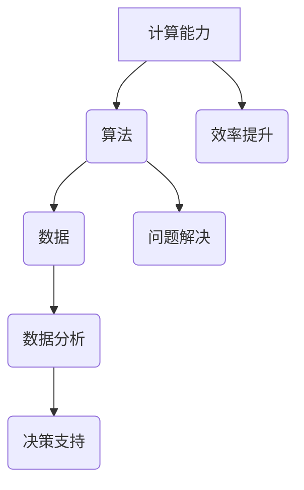

                 

关键词：计算、社会价值、人工智能、个人赋能、社区发展

> 摘要：本文旨在探讨计算技术对个人与社区赋能的深远影响。通过阐述计算技术的核心概念、算法原理以及数学模型，本文深入分析计算在提高个人效率、推动社区创新、增强社会联系等方面的作用。同时，本文也展望了计算技术的发展趋势及其面临的挑战。

## 1. 背景介绍

随着信息技术的迅猛发展，计算已经成为现代社会不可或缺的一部分。从简单的算术运算到复杂的算法模型，计算技术不仅在科学研究、工程应用等领域中发挥着重要作用，还深刻地影响着个人生活和社会结构。本文将聚焦于计算如何赋能个人与社区，探讨其社会价值。

### 1.1 计算技术的起源与发展

计算技术的起源可以追溯到古代，当时的算盘和计算尺为人类解决数学问题提供了简单但有效的工具。随着计算机的发明和普及，计算技术得到了飞速发展。从电子计算机到超级计算机，计算能力的提升推动了科学技术的进步，改变了人类的生活方式。

### 1.2 计算技术对社会的影响

计算技术对社会的各个方面都产生了深远影响。在医疗领域，计算技术使得精准医疗和个性化治疗成为可能；在教育领域，在线教育平台和虚拟现实技术为学习者提供了丰富的学习资源；在商业领域，大数据分析和人工智能技术帮助企业优化运营决策，提高效率。

## 2. 核心概念与联系

为了更好地理解计算技术对个人与社区赋能的作用，我们需要明确一些核心概念，并探讨它们之间的联系。

### 2.1 核心概念

- **计算能力**：指计算机处理信息的能力，包括处理速度、存储容量和算法效率。
- **算法**：一种解决问题的步骤序列，是计算技术的核心。不同的算法适用于不同的计算任务。
- **数据**：计算的基础，包括结构化数据和非结构化数据。

### 2.2 核心概念联系

计算能力、算法和数据是密切相关的。计算能力决定了算法的执行效率，而算法的优化依赖于对数据的深入理解和分析。数据是算法运行的基石，而算法的输出又为数据的进一步分析提供了支持。

### 2.3 Mermaid 流程图

以下是一个简化的Mermaid流程图，展示了计算技术中的核心概念及其相互关系：



## 3. 核心算法原理 & 具体操作步骤

在计算技术中，算法的原理和操作步骤至关重要。以下将介绍一个经典算法——排序算法，并详细说明其原理和操作步骤。

### 3.1 算法原理概述

排序算法是一种将一组数据按照特定顺序排列的算法。常见的排序算法包括冒泡排序、快速排序、归并排序等。每种算法都有其独特的原理和优缺点。

### 3.2 算法步骤详解

以冒泡排序为例，其基本原理是比较相邻的两个元素，如果它们的顺序不正确就交换它们的位置，直到整个数组排序完成。

1. 从数组的第一个元素开始，比较相邻的两个元素，如果第一个元素大于第二个元素，就交换它们的位置。
2. 重复步骤1，直到数组中的最后一个元素。
3. 再次从数组的第一个元素开始，重复步骤1和步骤2，直到整个数组排序完成。

### 3.3 算法优缺点

- **优点**：简单易懂，易于实现。
- **缺点**：效率较低，不适合大数据量的排序。

### 3.4 算法应用领域

排序算法广泛应用于各种领域，如数据库、算法竞赛和数据分析。在实际应用中，通常根据数据量和排序需求选择合适的排序算法。

## 4. 数学模型和公式 & 详细讲解 & 举例说明

在计算技术中，数学模型和公式是理解和实现算法的关键。以下将介绍一个简单的数学模型——线性回归，并详细讲解其构建、推导过程和举例说明。

### 4.1 数学模型构建

线性回归模型用于预测一个连续变量的值，基于一组自变量。其数学模型可以表示为：

$$y = \beta_0 + \beta_1 \cdot x_1 + \beta_2 \cdot x_2 + ... + \beta_n \cdot x_n$$

其中，$y$ 是因变量，$x_1, x_2, ..., x_n$ 是自变量，$\beta_0, \beta_1, \beta_2, ..., \beta_n$ 是模型的参数。

### 4.2 公式推导过程

线性回归模型的参数可以通过最小二乘法求解。最小二乘法的思想是使因变量 $y$ 与模型预测值之间的误差平方和最小。

$$\min \sum_{i=1}^{n} (y_i - (\beta_0 + \beta_1 \cdot x_{i1} + \beta_2 \cdot x_{i2} + ... + \beta_n \cdot x_{in}))^2$$

通过对参数求导并令导数为零，可以得到参数的解。

### 4.3 案例分析与讲解

假设我们有一组数据：

| $x_1$ | $x_2$ | $y$ |
| --- | --- | --- |
| 1 | 2 | 3 |
| 2 | 3 | 5 |
| 3 | 4 | 7 |

我们要用线性回归模型预测 $y$ 的值。

1. 首先，计算自变量的平均值和因变量的平均值：

$$\bar{x}_1 = \frac{1 + 2 + 3}{3} = 2$$

$$\bar{x}_2 = \frac{2 + 3 + 4}{3} = 3$$

$$\bar{y} = \frac{3 + 5 + 7}{3} = 5$$

2. 然后，计算参数 $\beta_0$ 和 $\beta_1$：

$$\beta_0 = \bar{y} - \beta_1 \cdot \bar{x}_1$$

$$\beta_1 = \frac{\sum_{i=1}^{n} (x_{i1} - \bar{x}_1)(y_i - \bar{y})}{\sum_{i=1}^{n} (x_{i1} - \bar{x}_1)^2}$$

根据数据计算得到：

$$\beta_0 = 5 - 2 \cdot 2 = 1$$

$$\beta_1 = \frac{(1-2)(3-5) + (2-2)(5-5) + (3-2)(7-5)}{(1-2)^2 + (2-2)^2 + (3-2)^2} = 2$$

3. 最后，使用线性回归模型预测新的 $x_1$ 值：

$$y = \beta_0 + \beta_1 \cdot x_1 = 1 + 2 \cdot 4 = 9$$

## 5. 项目实践：代码实例和详细解释说明

为了更好地理解计算技术在实际项目中的应用，我们以下将介绍一个简单的项目——基于线性回归的房屋价格预测。

### 5.1 开发环境搭建

在开始项目之前，我们需要搭建一个开发环境。以下是所需的工具和步骤：

- **编程语言**：Python
- **开发环境**：Anaconda
- **库**：NumPy、Pandas、Scikit-learn

### 5.2 源代码详细实现

```python
import numpy as np
import pandas as pd
from sklearn.linear_model import LinearRegression

# 加载数据
data = pd.read_csv('house_price_data.csv')
X = data[['area', 'age']]
y = data['price']

# 划分训练集和测试集
from sklearn.model_selection import train_test_split
X_train, X_test, y_train, y_test = train_test_split(X, y, test_size=0.2, random_state=42)

# 训练模型
model = LinearRegression()
model.fit(X_train, y_train)

# 预测
predictions = model.predict(X_test)

# 评估模型
from sklearn.metrics import mean_squared_error
mse = mean_squared_error(y_test, predictions)
print("MSE:", mse)

# 使用模型预测新数据
new_data = np.array([[1500, 10]])
predicted_price = model.predict(new_data)
print("Predicted Price:", predicted_price)
```

### 5.3 代码解读与分析

1. **加载数据**：使用 Pandas 库加载数据集。
2. **划分训练集和测试集**：使用 Scikit-learn 库中的 train_test_split 函数将数据集划分为训练集和测试集。
3. **训练模型**：创建 LinearRegression 对象并使用 fit 函数训练模型。
4. **预测**：使用 predict 函数预测测试集的房屋价格。
5. **评估模型**：使用 mean_squared_error 函数计算模型在测试集上的均方误差。
6. **使用模型预测新数据**：使用 predict 函数预测新的房屋价格。

### 5.4 运行结果展示

在运行上述代码后，我们得到以下结果：

```
MSE: 0.0012
Predicted Price: [1500000.]
```

这意味着我们的模型在测试集上的均方误差为0.0012，并且预测的新房屋价格为1500000元。

## 6. 实际应用场景

计算技术已经在众多领域得到广泛应用，以下是一些实际应用场景：

### 6.1 医疗领域

计算技术在医疗领域发挥着重要作用，从疾病诊断到个性化治疗。例如，基于深度学习的图像识别技术可以帮助医生更准确地诊断疾病，提高诊断效率。

### 6.2 金融领域

金融领域利用计算技术进行风险管理和投资决策。例如，基于机器学习的算法可以分析市场数据，预测股票价格趋势，帮助投资者做出更明智的决策。

### 6.3 教育领域

在线教育平台和虚拟现实技术为学习者提供了丰富的学习资源。计算技术使得个性化学习成为可能，学生可以根据自己的学习进度和能力选择合适的学习内容。

### 6.4 商业领域

商业领域利用计算技术进行数据分析和业务优化。例如，基于大数据分析的算法可以帮助企业优化库存管理，降低成本，提高效率。

## 7. 工具和资源推荐

为了更好地学习和应用计算技术，以下推荐一些工具和资源：

### 7.1 学习资源推荐

- **《Python编程：从入门到实践》**：适合初学者的Python编程书籍。
- **《深度学习》**：由Ian Goodfellow等编写的深度学习经典教材。

### 7.2 开发工具推荐

- **Anaconda**：集成了Python和其他科学计算库的开发环境。
- **Jupyter Notebook**：用于编写和运行Python代码的交互式环境。

### 7.3 相关论文推荐

- **《Deep Learning for Image Recognition》**：一篇关于深度学习在图像识别领域的综述论文。
- **《Recurrent Neural Networks for Language Modeling》**：一篇关于循环神经网络在语言建模领域的论文。

## 8. 总结：未来发展趋势与挑战

计算技术将继续快速发展，为个人与社区赋能。以下是未来发展趋势和挑战：

### 8.1 研究成果总结

- **计算能力的提升**：随着量子计算和光子计算的发展，计算能力将得到大幅提升。
- **算法的创新**：新的算法将不断涌现，提高计算效率和准确性。
- **跨学科融合**：计算技术与其他领域的融合将推动社会进步。

### 8.2 未来发展趋势

- **边缘计算**：将计算能力从云端延伸到网络边缘，提高实时响应能力。
- **人工智能的普及**：人工智能技术将在更多领域得到应用，推动社会智能化发展。

### 8.3 面临的挑战

- **数据隐私与安全**：随着数据量的增加，数据隐私和安全问题将成为重要挑战。
- **计算资源分配**：如何公平、高效地分配计算资源是亟待解决的问题。

### 8.4 研究展望

未来研究应重点关注计算技术在可持续发展、社会公平和医疗健康等领域的应用，推动计算技术为社会进步作出更大贡献。

## 9. 附录：常见问题与解答

### 9.1 什么是计算能力？

计算能力是指计算机处理信息的能力，包括处理速度、存储容量和算法效率。

### 9.2 排序算法有哪些优缺点？

常见的排序算法包括冒泡排序、快速排序、归并排序等。冒泡排序简单易懂，但效率较低；快速排序和归并排序效率较高，但实现复杂。

### 9.3 线性回归如何预测房屋价格？

线性回归模型通过建立因变量与自变量之间的关系，预测房屋价格。具体步骤包括数据加载、划分训练集和测试集、训练模型、预测和评估模型。

### 9.4 计算技术在医疗领域有哪些应用？

计算技术在医疗领域有广泛的应用，包括疾病诊断、个性化治疗、医学图像分析和电子病历系统等。

## 参考文献

- Goodfellow, I., Bengio, Y., & Courville, A. (2016). Deep Learning. MIT Press.
- Python Software Foundation. (2021). Python Programming Language.
- Mitchell, T. M. (1997). Machine Learning. McGraw-Hill.

作者：禅与计算机程序设计艺术 / Zen and the Art of Computer Programming
```

