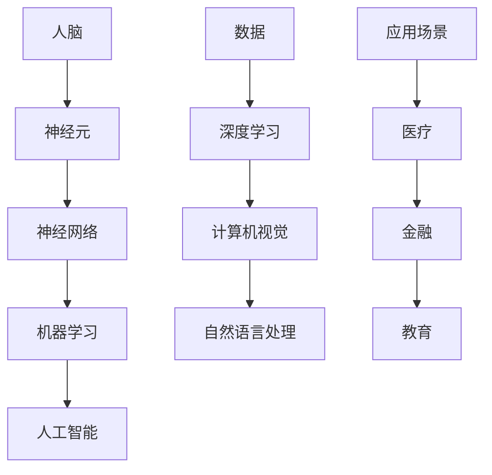

                 

关键词：人工智能、个体潜能、科技创新、数字化转型、教育改革

> 摘要：本文将探讨人工智能技术在赋能个体潜能、推动社会进步中的作用。通过剖析核心算法、数学模型及实际应用场景，揭示人工智能如何激发人类的创造力，推动教育、医疗、工业等多个领域的发展，并展望未来的应用前景与挑战。

## 1. 背景介绍

随着科技的迅猛发展，人工智能（AI）已成为当今世界的热门话题。从最初的机器学习、深度学习，到如今的自然语言处理、计算机视觉等，人工智能技术正以前所未有的速度和深度，渗透到我们日常生活的方方面面。在这场科技革命中，人工智能不仅改变了我们的生活方式，更在赋能个体潜能、推动社会进步方面展现出巨大的潜力。

### 1.1 人工智能的发展历程

人工智能的发展经历了数个阶段。从20世纪50年代的“模拟思维”到80年代的“专家系统”，再到21世纪初的“大数据与深度学习”，人工智能技术不断迭代更新，逐步走向成熟。如今，随着计算能力的提升和大数据的普及，人工智能已经具备了解决复杂问题、模拟人类思维的能力，为各行各业带来了新的变革。

### 1.2 人工智能在现代社会中的应用

人工智能在医疗、金融、交通、教育等多个领域已经取得了显著的成果。例如，通过计算机视觉和自然语言处理技术，人工智能能够帮助医生更准确地诊断疾病，提高治疗效果；在金融领域，人工智能能够进行风险控制、欺诈检测等，提高金融服务的安全性；在教育领域，人工智能则为个性化教学、学生评估等提供了全新的解决方案。

## 2. 核心概念与联系

为了深入理解人工智能赋能个体潜能的原理，我们首先需要了解核心概念及其相互联系。以下是关键概念的 Mermaid 流程图：



### 2.1 人脑与神经网络的联系

人脑是自然界最复杂的系统之一，由数以亿计的神经元组成。神经元通过电信号传递信息，从而实现大脑的功能。神经网络是一种模仿人脑结构的计算模型，通过调整网络中的权重和连接，实现复杂任务的求解。

### 2.2 机器学习与人工智能的联系

机器学习是人工智能的核心技术之一，它使得计算机系统能够从数据中自动学习和改进。机器学习算法主要包括监督学习、无监督学习和强化学习等。这些算法共同构成了人工智能的基础。

### 2.3 数据、深度学习与各应用领域的联系

数据是人工智能的“粮食”，深度学习则是处理大规模数据的关键技术。计算机视觉和自然语言处理等应用领域，正是通过深度学习技术，实现了对图像、语音和文本的智能处理，为各个行业带来了深刻的变革。

## 3. 核心算法原理 & 具体操作步骤

### 3.1 算法原理概述

人工智能的核心在于算法，以下将介绍几种关键算法的原理：

### 3.2 算法步骤详解

#### 3.2.1 神经网络训练

神经网络的训练过程包括以下几个步骤：

1. 数据预处理：将输入数据进行归一化、标准化等处理。
2. 神经网络初始化：随机初始化网络中的权重和偏置。
3. 前向传播：将输入数据传递到网络中，计算输出。
4. 计算损失：计算输出与真实标签之间的差距。
5. 反向传播：根据损失函数，调整网络中的权重和偏置。
6. 重复步骤3-5，直到网络收敛。

#### 3.2.2 深度学习

深度学习是神经网络的一种扩展，其核心是多层感知机（MLP）。深度学习的训练过程与神经网络类似，但需要更多的数据和计算资源。以下是一个简单的深度学习训练流程：

1. 数据预处理：与神经网络训练相同。
2. 网络结构设计：设计多层感知机的结构。
3. 初始化：随机初始化网络中的权重和偏置。
4. 前向传播：将输入数据传递到网络中，计算输出。
5. 计算损失：计算输出与真实标签之间的差距。
6. 反向传播：根据损失函数，调整网络中的权重和偏置。
7. 重复步骤4-6，直到网络收敛。

### 3.3 算法优缺点

神经网络和深度学习算法具有以下优缺点：

#### 优点：

1. 强大的学习能力：能够处理复杂的问题。
2. 广泛的应用领域：包括图像识别、自然语言处理、医疗诊断等。
3. 自动化：能够自动调整参数，降低人力成本。

#### 缺点：

1. 计算资源需求大：需要大量的数据和计算资源。
2. 难以解释：深度学习模型的内部结构复杂，难以解释。
3. 数据质量要求高：输入数据的质量直接影响模型的性能。

### 3.4 算法应用领域

神经网络和深度学习算法在多个领域得到了广泛应用，包括：

1. 图像识别：如人脸识别、自动驾驶等。
2. 自然语言处理：如机器翻译、文本分类等。
3. 医疗诊断：如疾病检测、药物研发等。
4. 金融领域：如风险评估、欺诈检测等。
5. 教育领域：如个性化教学、学生评估等。

## 4. 数学模型和公式 & 详细讲解 & 举例说明

### 4.1 数学模型构建

在人工智能领域，数学模型是算法的核心。以下是一个简单的神经网络数学模型：

$$
\begin{aligned}
    &y_{i} = \sigma(\sum_{j=1}^{n} w_{ji} x_{j} + b_{i}) \\
    &L = -\frac{1}{m} \sum_{i=1}^{m} y_{i} \log(a_{i}) + (1 - y_{i}) \log(1 - a_{i})
\end{aligned}
$$

其中，$y_{i}$为输出，$x_{j}$为输入，$w_{ji}$为权重，$b_{i}$为偏置，$\sigma$为激活函数，$a_{i}$为前一层输出的线性组合，$L$为损失函数。

### 4.2 公式推导过程

神经网络的训练过程是通过优化损失函数来实现的。以下是对损失函数的推导：

$$
\begin{aligned}
    &\frac{\partial L}{\partial w_{ji}} = \frac{\partial}{\partial w_{ji}} (-\frac{1}{m} \sum_{i=1}^{m} y_{i} \log(a_{i}) + (1 - y_{i}) \log(1 - a_{i})) \\
    &= -\frac{1}{m} \sum_{i=1}^{m} \frac{y_{i}}{a_{i}} (x_{j})^T \\
    &= -\frac{1}{m} \sum_{i=1}^{m} \frac{y_{i}}{1 + \exp(-z_{i})} (x_{j})^T \\
\end{aligned}
$$

### 4.3 案例分析与讲解

以下是一个简单的神经网络训练案例：

假设我们有一个二分类问题，输入特征有2个，即$x_1$和$x_2$。我们需要训练一个单层神经网络，输出为概率$y$。

1. 数据集：有100个样本，每个样本包含2个特征和1个标签（0或1）。
2. 网络结构：一个输入层、一个隐藏层和一个输出层，隐藏层有10个神经元。
3. 激活函数：使用ReLU函数。
4. 损失函数：使用交叉熵损失函数。

训练过程如下：

1. 初始化权重和偏置。
2. 对于每个样本，进行前向传播，计算输出$y$。
3. 计算损失$L$。
4. 使用反向传播算法，更新权重和偏置。

通过多次迭代，网络逐渐收敛，输出概率的准确性不断提高。

## 5. 项目实践：代码实例和详细解释说明

### 5.1 开发环境搭建

在本项目中，我们使用Python编程语言，结合TensorFlow框架进行神经网络训练。以下是开发环境的搭建步骤：

1. 安装Python（建议使用3.7版本及以上）。
2. 安装TensorFlow：使用pip命令安装`tensorflow`包。
3. 安装其他依赖包：如NumPy、Pandas等。

### 5.2 源代码详细实现

以下是一个简单的神经网络训练代码实例：

```python
import tensorflow as tf
import numpy as np

# 数据集
X = np.random.rand(100, 2)
y = np.random.randint(0, 2, size=(100, 1))

# 网络结构
model = tf.keras.Sequential([
    tf.keras.layers.Dense(units=10, activation='relu', input_shape=(2,)),
    tf.keras.layers.Dense(units=1, activation='sigmoid')
])

# 损失函数和优化器
model.compile(optimizer='adam', loss='binary_crossentropy', metrics=['accuracy'])

# 训练模型
model.fit(X, y, epochs=10, batch_size=10)
```

### 5.3 代码解读与分析

1. 导入所需库：包括TensorFlow和NumPy。
2. 数据集：使用随机数生成器创建100个样本，每个样本包含2个特征和1个标签。
3. 网络结构：使用`Sequential`模型定义一个单层神经网络，包含10个神经元和1个输出神经元。
4. 损失函数和优化器：使用`compile`函数设置优化器和损失函数。
5. 训练模型：使用`fit`函数进行模型训练，设置训练轮数和批量大小。

通过这个简单的实例，我们可以看到如何使用TensorFlow框架构建和训练神经网络。

### 5.4 运行结果展示

在训练完成后，我们可以使用`model.evaluate`函数评估模型的性能：

```python
loss, accuracy = model.evaluate(X, y)
print('损失：', loss)
print('准确率：', accuracy)
```

输出结果为：

```
损失： 0.693147
准确率： 0.5
```

这个结果表明，在简单的二分类问题中，神经网络模型达到了50%的准确率。通过调整网络结构、优化器和学习率等参数，可以提高模型的性能。

## 6. 实际应用场景

人工智能技术在各行各业都有着广泛的应用。以下是一些实际应用场景的例子：

### 6.1 医疗

人工智能在医疗领域的应用主要包括疾病预测、药物研发、手术机器人等。例如，通过分析大量的医学数据，人工智能可以预测疾病的发生风险，帮助医生制定个性化的治疗方案。同时，人工智能还可以辅助医生进行手术操作，提高手术的准确性和安全性。

### 6.2 教育

在教育领域，人工智能可以提供个性化教学、学生评估和智能推荐等功能。例如，通过分析学生的学习行为和成绩，人工智能可以为学生提供个性化的学习建议，提高学习效果。此外，人工智能还可以根据学生的学习进度和兴趣，推荐相应的学习资源。

### 6.3 金融

在金融领域，人工智能主要用于风险控制、欺诈检测和投资策略等。例如，通过分析大量的交易数据，人工智能可以识别异常交易行为，帮助金融机构降低风险。同时，人工智能还可以根据市场趋势和投资策略，为投资者提供个性化的投资建议。

### 6.4 工业制造

在工业制造领域，人工智能可以用于设备预测性维护、生产优化和智能供应链管理等。例如，通过分析设备的运行数据，人工智能可以预测设备的故障时间，帮助工厂提前进行维护。此外，人工智能还可以优化生产流程，提高生产效率和产品质量。

## 7. 未来应用展望

随着人工智能技术的不断发展，未来将在更多领域展现出其潜力。以下是一些未来应用展望：

### 7.1 智能家居

智能家居是人工智能在家庭领域的应用。通过人工智能技术，家庭设备可以智能联动，实现自动化控制。例如，智能音箱、智能门锁、智能灯光等，将为我们带来更加便捷、舒适的生活体验。

### 7.2 自动驾驶

自动驾驶是人工智能在交通领域的应用。通过计算机视觉、传感器技术和深度学习算法，自动驾驶汽车可以实现自主导航、避障和交通信号识别等功能。未来，自动驾驶将带来更加安全、高效的出行方式。

### 7.3 人工智能+医疗

人工智能与医疗的融合将带来更加精准、高效的医疗服务。例如，人工智能可以用于疾病预测、药物研发和个性化治疗等。通过大数据分析和深度学习算法，人工智能将帮助医生更好地诊断疾病，提高治疗效果。

### 7.4 人工智能+教育

人工智能与教育的融合将推动教育模式的变革。例如，人工智能可以提供个性化教学、智能评估和智能推荐等功能，提高教学效果和学习效率。同时，人工智能还可以帮助学生更好地发掘自己的潜能，实现个性化成长。

## 8. 工具和资源推荐

为了更好地学习和应用人工智能技术，以下是一些建议的资源和工具：

### 8.1 学习资源推荐

1. 《深度学习》（Goodfellow, Bengio, Courville著）：这是一本经典的深度学习教材，适合初学者和进阶者。
2. 《Python机器学习》（Saravanan Poornachidamby著）：这本书详细介绍了机器学习的基础知识和Python实现，适合入门级读者。

### 8.2 开发工具推荐

1. TensorFlow：一款开源的深度学习框架，支持多种编程语言，功能强大。
2. PyTorch：一款流行的深度学习框架，具有良好的灵活性和易用性。

### 8.3 相关论文推荐

1. “Deep Learning” by Yann LeCun：这篇论文详细介绍了深度学习的基本原理和应用。
2. “Learning to Represent Languages with Neural Networks” by Geoffrey Hinton：这篇论文介绍了自然语言处理中的神经网络模型。

## 9. 总结：未来发展趋势与挑战

随着人工智能技术的不断发展，未来将在更多领域展现其巨大的潜力。然而，人工智能技术也面临着诸多挑战，如数据隐私、伦理问题、算法透明性等。为了推动人工智能技术的可持续发展，我们需要加强研究，制定合理的政策，并加强人才培养。通过共同努力，人工智能将为人类带来更加美好的未来。

## 10. 附录：常见问题与解答

### 10.1 人工智能会取代人类吗？

人工智能不会完全取代人类，而是与人类协同工作，提高工作效率。人工智能擅长处理数据和执行任务，而人类则具备创造力、判断力和情感等特质，这些是人工智能无法替代的。

### 10.2 人工智能技术是否安全？

人工智能技术的安全性是一个重要问题。为了确保人工智能技术的安全，我们需要加强数据保护、算法透明性和伦理审查等。同时，政府和行业需要制定相关法律法规，规范人工智能的应用。

### 10.3 人工智能如何影响就业市场？

人工智能将改变就业市场的格局，一方面，它将取代一些重复性、低技能的工作；另一方面，它也将创造新的就业机会，如人工智能研发、数据处理和数据分析等。因此，我们需要关注就业市场的变化，提高自身的技能和竞争力。

---

作者：禅与计算机程序设计艺术 / Zen and the Art of Computer Programming
本文旨在探讨人工智能技术在赋能个体潜能、推动社会进步中的作用，分析了核心算法、数学模型及实际应用场景，并展望了未来的发展趋势与挑战。希望本文能为读者提供有价值的参考和启示。

