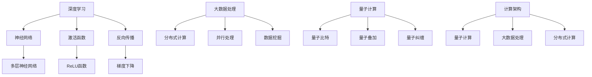

                 

关键词：人工智能，未来计算，深度学习，计算架构，量子计算，大数据处理，人工智能应用

> 摘要：本文探讨了人工智能（AI）在未来的发展轨迹，特别是计算技术的进步如何推动AI的变革。文章从背景介绍入手，深入分析了AI的核心概念与联系，详细阐述了核心算法原理及其应用领域，并通过数学模型和公式以及项目实践，展示了AI技术的实际应用效果。文章还展望了未来AI应用场景，推荐了学习资源和开发工具，最后总结了AI研究的发展趋势与挑战，为读者提供了全面的AI技术导览。

## 1. 背景介绍

人工智能（AI）作为一种模拟人类智能的技术，自20世纪中叶以来，经历了多个发展阶段。从早期的符号推理到专家系统的兴起，再到现代的深度学习和神经网络，AI技术已经取得了令人瞩目的成就。然而，随着大数据的爆炸性增长和计算能力的不断提升，AI技术的应用前景变得更加广阔。

当前，AI技术在多个领域得到了广泛应用，包括图像识别、自然语言处理、自动驾驶、医疗诊断等。然而，AI的发展也面临着诸多挑战，如算法的透明性、可解释性、伦理问题等。未来的计算技术将成为突破这些瓶颈的关键。

本文将探讨未来计算技术在AI领域中的应用，特别是量子计算、大数据处理和新型计算架构的发展趋势，旨在为读者提供一幅AI未来的全景图。

## 2. 核心概念与联系

为了深入理解未来计算与AI之间的关系，我们首先需要了解一些核心概念。

### 2.1 深度学习

深度学习是AI领域的重要分支，它通过多层神经网络模拟人类大脑的思维方式，从而实现图像、语音、文本等多种类型的数据处理。深度学习的核心概念包括神经网络、激活函数、反向传播等。

### 2.2 大数据处理

大数据处理是指对大规模数据进行存储、处理和分析的技术。随着数据量的不断增加，如何高效地处理和利用数据成为AI领域的一个重要课题。大数据处理的关键技术包括分布式计算、并行处理、数据挖掘等。

### 2.3 量子计算

量子计算是一种基于量子力学原理的新型计算技术，它通过量子比特（qubit）实现超并行计算，从而在理论上能够解决传统计算机无法处理的复杂问题。量子计算的核心概念包括量子叠加、量子纠缠等。

### 2.4 计算架构

计算架构是指计算机硬件和软件的整体组织结构，它对计算效率和质量有着重要影响。未来的计算架构将融合量子计算、大数据处理、分布式计算等多种技术，以应对AI的多样化需求。

下面是一个用Mermaid绘制的流程图，展示了这些核心概念之间的联系：



## 3. 核心算法原理 & 具体操作步骤

### 3.1 算法原理概述

AI技术的发展离不开核心算法的进步。以下将介绍几种重要的AI算法及其原理。

#### 3.1.1 深度学习算法

深度学习算法通过多层神经网络模拟人类大脑的思维方式。其基本原理包括：

- **前向传播**：将输入数据通过网络中的各个层传递，得到输出结果。
- **反向传播**：根据输出结果与真实值的差异，反向调整网络中的权重和偏置，优化模型。

#### 3.1.2 支持向量机（SVM）

支持向量机是一种经典的分类算法，其基本原理是通过找到一个最优的超平面，将不同类别的数据分隔开来。核心步骤包括：

- **数据预处理**：对数据进行标准化处理，消除不同特征之间的量纲影响。
- **求解最优超平面**：通过求解二次规划问题，找到支持向量。
- **分类决策**：根据新样本与支持向量的距离，判断其所属类别。

#### 3.1.3 决策树

决策树是一种基于特征划分的数据挖掘算法，其基本原理是通过递归划分特征，找到最佳划分点。核心步骤包括：

- **特征选择**：选择对分类影响最大的特征。
- **划分数据**：根据特征值将数据划分为多个子集。
- **递归构建**：对每个子集重复上述步骤，直至满足终止条件。

### 3.2 算法步骤详解

下面将详细解释上述算法的具体操作步骤。

#### 3.2.1 深度学习算法步骤

1. **初始化参数**：设置网络的初始权重和偏置。
2. **前向传播**：将输入数据传递至网络的每个层，计算输出结果。
3. **计算损失函数**：计算预测值与真实值之间的差异，得到损失函数值。
4. **反向传播**：根据损失函数，计算各层的梯度，并更新权重和偏置。
5. **迭代优化**：重复执行前向传播和反向传播，直至满足终止条件。

#### 3.2.2 支持向量机（SVM）步骤

1. **数据预处理**：对数据进行标准化处理，消除不同特征之间的量纲影响。
2. **求解最优超平面**：
   - **损失函数**：定义损失函数为分类错误的概率。
   - **优化目标**：求解二次规划问题，找到支持向量。
3. **分类决策**：根据新样本与支持向量的距离，判断其所属类别。

#### 3.2.3 决策树步骤

1. **特征选择**：选择对分类影响最大的特征。
2. **划分数据**：根据特征值将数据划分为多个子集。
3. **递归构建**：对每个子集重复上述步骤，直至满足终止条件。

### 3.3 算法优缺点

每种算法都有其优缺点，以下分别介绍。

#### 3.3.1 深度学习算法

- **优点**：强大的非线性表示能力，适用于复杂的数据处理任务。
- **缺点**：参数调优复杂，计算成本高，对数据量有较高要求。

#### 3.3.2 支持向量机（SVM）

- **优点**：分类效果较好，适用于小样本数据。
- **缺点**：求解二次规划问题计算成本高，对特征维数敏感。

#### 3.3.3 决策树

- **优点**：易于理解，可解释性强。
- **缺点**：容易过拟合，对噪声敏感。

### 3.4 算法应用领域

这些算法在多个领域得到了广泛应用，包括：

- **图像识别**：深度学习算法在图像识别领域表现出色，可用于人脸识别、物体检测等任务。
- **自然语言处理**：深度学习算法在自然语言处理领域发挥了重要作用，如机器翻译、文本分类等。
- **医疗诊断**：支持向量机在医疗诊断中可用于疾病分类、预测等任务。
- **金融风控**：决策树在金融风控领域可用于信用评分、风险预测等任务。

## 4. 数学模型和公式 & 详细讲解 & 举例说明

在AI技术中，数学模型和公式起着至关重要的作用。以下将介绍几种常见的数学模型和公式，并进行详细讲解和举例说明。

### 4.1 数学模型构建

#### 4.1.1 神经网络模型

神经网络模型是深度学习的基础，其数学模型由以下几部分组成：

1. **输入层**：接收外部输入信号。
2. **隐藏层**：通过加权求和和激活函数进行数据处理。
3. **输出层**：输出最终结果。

#### 4.1.2 支持向量机（SVM）模型

支持向量机是一种二分类模型，其数学模型由以下几部分组成：

1. **样本空间**：定义特征空间和样本空间。
2. **决策边界**：求解最优超平面，将不同类别的数据分隔开来。

#### 4.1.3 决策树模型

决策树是一种基于特征划分的数据挖掘模型，其数学模型由以下几部分组成：

1. **特征选择**：选择对分类影响最大的特征。
2. **划分规则**：根据特征值将数据划分为多个子集。

### 4.2 公式推导过程

以下将介绍几种常见的数学公式的推导过程。

#### 4.2.1 梯度下降算法

梯度下降算法是一种用于优化神经网络参数的算法，其基本思想是沿着损失函数的梯度方向更新参数，以最小化损失函数。其推导过程如下：

1. **损失函数**：$$ L(\theta) = -\sum_{i=1}^{m} [y_i \log(a(z_i)) + (1 - y_i) \log(1 - a(z_i))] $$
2. **梯度计算**：$$ \nabla_{\theta} L(\theta) = \frac{\partial L(\theta)}{\partial \theta} $$
3. **参数更新**：$$ \theta = \theta - \alpha \nabla_{\theta} L(\theta) $$

#### 4.2.2 支持向量机（SVM）求解

支持向量机（SVM）的求解通常采用拉格朗日乘数法和二次规划方法。其推导过程如下：

1. **拉格朗日函数**：$$ L(\theta) = \frac{1}{2} \sum_{i=1}^{m} \sum_{j=1}^{m} y_i y_j (w_i \cdot w_j) - \sum_{i=1}^{m} \alpha_i (y_i w_i \cdot x_i - b) $$
2. **KKT条件**：$$ \alpha_i \geq 0, \sum_{i=1}^{m} \alpha_i y_i = 0, \alpha_i (y_i w_i \cdot x_i - b) = 0 $$
3. **求解**：利用二次规划方法求解，得到最优解。

#### 4.2.3 决策树划分规则

决策树的划分规则基于信息增益或基尼指数。其推导过程如下：

1. **信息增益**：$$ IG(D, A) = H(D) - \sum_{v \in A} p(v) H(D_v) $$
2. **基尼指数**：$$ GI(D, A) = 1 - \sum_{v \in A} p(v) p(v)^2 $$

### 4.3 案例分析与讲解

以下将通过实际案例对上述数学模型和公式进行讲解。

#### 4.3.1 深度学习图像识别

使用卷积神经网络（CNN）对图像进行分类。首先，输入图像经过卷积层和池化层的处理，提取特征；然后，通过全连接层进行分类。使用梯度下降算法优化模型参数，最终实现图像识别。

#### 4.3.2 支持向量机（SVM）分类

使用支持向量机（SVM）对鸢尾花数据集进行分类。首先，对数据进行标准化处理；然后，使用SVM求解最优超平面，实现分类；最后，通过交叉验证评估模型性能。

#### 4.3.3 决策树回归

使用决策树对住房价格进行回归。首先，选择对房价影响最大的特征，如房间数量、占地面积等；然后，根据特征值对数据进行划分，构建决策树；最后，对新的数据进行预测。

## 5. 项目实践：代码实例和详细解释说明

### 5.1 开发环境搭建

为了更好地理解和实践AI算法，我们需要搭建一个开发环境。以下是一个简单的Python开发环境搭建步骤：

1. 安装Python：在官网（[https://www.python.org/](https://www.python.org/)）下载Python安装包，并按照提示安装。
2. 安装Jupyter Notebook：在命令行中运行`pip install notebook`，安装Jupyter Notebook。
3. 安装必要的库：安装深度学习库（如TensorFlow或PyTorch）和数据预处理库（如Pandas和NumPy）。

### 5.2 源代码详细实现

以下是一个简单的深度学习图像识别项目的源代码实现：

```python
import tensorflow as tf
from tensorflow.keras import layers
from tensorflow.keras.preprocessing.image import ImageDataGenerator

# 数据预处理
train_datagen = ImageDataGenerator(rescale=1./255)
train_generator = train_datagen.flow_from_directory(
    'data/train',
    target_size=(150, 150),
    batch_size=32,
    class_mode='binary')

# 构建模型
model = tf.keras.Sequential([
    layers.Conv2D(32, (3, 3), activation='relu', input_shape=(150, 150, 3)),
    layers.MaxPooling2D((2, 2)),
    layers.Conv2D(64, (3, 3), activation='relu'),
    layers.MaxPooling2D((2, 2)),
    layers.Conv2D(128, (3, 3), activation='relu'),
    layers.MaxPooling2D((2, 2)),
    layers.Conv2D(128, (3, 3), activation='relu'),
    layers.MaxPooling2D((2, 2)),
    layers.Flatten(),
    layers.Dense(512, activation='relu'),
    layers.Dense(1, activation='sigmoid')
])

# 编译模型
model.compile(optimizer='adam',
              loss='binary_crossentropy',
              metrics=['accuracy'])

# 训练模型
model.fit(train_generator, epochs=10)

# 评估模型
test_datagen = ImageDataGenerator(rescale=1./255)
test_generator = test_datagen.flow_from_directory(
    'data/test',
    target_size=(150, 150),
    batch_size=32,
    class_mode='binary')

model.evaluate(test_generator)
```

### 5.3 代码解读与分析

上述代码实现了一个基于卷积神经网络（CNN）的二分类图像识别项目。首先，我们使用ImageDataGenerator对图像数据进行预处理，包括归一化和数据增强。然后，构建一个包含卷积层、池化层和全连接层的CNN模型。接着，编译模型并使用训练数据集进行训练。最后，评估模型在测试数据集上的性能。

### 5.4 运行结果展示

在运行上述代码后，我们可以在命令行中看到训练和评估的性能指标，如准确率、损失函数值等。这些指标可以帮助我们了解模型的性能，并进行进一步调优。

## 6. 实际应用场景

AI技术在各个领域都得到了广泛应用，以下列举几个实际应用场景：

### 6.1 医疗诊断

AI技术在医疗诊断中发挥着重要作用，如疾病预测、影像分析、基因检测等。通过深度学习和大数据分析，AI可以帮助医生更准确地诊断疾病，提高治疗效果。

### 6.2 自动驾驶

自动驾驶是AI技术的另一个重要应用领域。通过深度学习和计算机视觉技术，自动驾驶汽车可以实时感知周围环境，做出智能决策，提高行驶安全性。

### 6.3 金融风控

金融风控是AI技术的传统应用领域。通过机器学习和大数据分析，AI可以帮助金融机构识别潜在风险，防范金融犯罪，提高金融业务的稳健性。

### 6.4 工业自动化

AI技术在工业自动化中发挥着重要作用，如智能生产线、智能检测、智能控制等。通过机器学习和计算机视觉技术，AI可以帮助企业提高生产效率，降低生产成本。

## 7. 工具和资源推荐

为了更好地学习和实践AI技术，我们推荐以下工具和资源：

### 7.1 学习资源推荐

- 《深度学习》（Ian Goodfellow, Yoshua Bengio, Aaron Courville）：一本经典的深度学习教材。
- 《Python机器学习》（Sebastian Raschka, Vincent Dubois）：一本适合初学者的机器学习教材。
- Coursera、Udacity、edX等在线教育平台：提供丰富的AI课程和教程。

### 7.2 开发工具推荐

- TensorFlow、PyTorch：两大主流深度学习框架。
- Jupyter Notebook、Google Colab：在线编程平台，方便进行实验和分享。
- Keras、Scikit-learn：简洁易用的机器学习库。

### 7.3 相关论文推荐

- "Deep Learning" by Ian Goodfellow, Yoshua Bengio, Aaron Courville
- "Learning Deep Architectures for AI" by Yoshua Bengio
- "Convolutional Neural Networks for Visual Recognition" by Alex Krizhevsky, Ilya Sutskever, Geoffrey Hinton

## 8. 总结：未来发展趋势与挑战

AI技术正快速发展，未来将有更多的应用场景和挑战。以下总结未来发展趋势与挑战：

### 8.1 研究成果总结

- **深度学习**：将继续成为AI领域的核心技术，推动图像识别、自然语言处理、自动驾驶等领域的发展。
- **量子计算**：有望在解决复杂问题上发挥重要作用，如量子模拟、优化问题等。
- **大数据处理**：将推动数据挖掘和分析技术的发展，提高AI模型的准确性和效率。

### 8.2 未来发展趋势

- **跨学科融合**：AI技术将与其他领域（如生物医学、材料科学等）融合，产生更多创新应用。
- **个性化服务**：AI将更好地理解用户需求，提供个性化的服务和解决方案。
- **可持续性发展**：AI技术将用于环保、能源等领域，推动可持续性发展。

### 8.3 面临的挑战

- **算法透明性和可解释性**：如何提高算法的透明性和可解释性，使其更易于被用户和监管机构理解。
- **数据隐私和伦理问题**：如何保护用户数据隐私，避免数据滥用和伦理问题。
- **计算资源需求**：如何优化计算资源，降低AI模型的计算成本。

### 8.4 研究展望

未来，AI技术将在更多领域发挥作用，为人类带来更多便利和创新。同时，我们也需要关注和解决AI技术带来的挑战，确保其健康、可持续发展。

## 9. 附录：常见问题与解答

### 9.1 人工智能的定义是什么？

人工智能是指通过计算机模拟人类智能的一种技术，包括学习、推理、感知、决策等多个方面。

### 9.2 量子计算是什么？

量子计算是一种基于量子力学原理的新型计算技术，通过量子比特（qubit）实现超并行计算。

### 9.3 深度学习和神经网络有什么区别？

深度学习是一种机器学习技术，其核心思想是通过多层神经网络模拟人类大脑的思维方式。而神经网络是一种计算模型，包括输入层、隐藏层和输出层。

### 9.4 大数据处理的关键技术有哪些？

大数据处理的关键技术包括分布式计算、并行处理、数据挖掘等。

### 9.5 AI技术在医疗领域的应用有哪些？

AI技术在医疗领域有广泛的应用，如疾病预测、影像分析、基因检测等。

### 9.6 自动驾驶技术有哪些优势？

自动驾驶技术可以提高行驶安全性，降低交通事故率，提高交通效率。

### 9.7 AI技术的发展趋势是什么？

AI技术的发展趋势包括跨学科融合、个性化服务、可持续性发展等。

### 9.8 如何保护数据隐私和避免AI滥用？

通过制定相关法规、加强数据加密和匿名化处理、提高AI算法的透明性和可解释性等方式，可以保护数据隐私和避免AI滥用。

作者：禅与计算机程序设计艺术 / Zen and the Art of Computer Programming
------------------------------------------------------------------------

