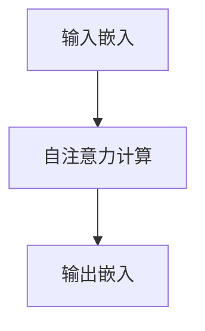

                 

关键词：超长上下文，语言模型，复杂信息处理，深度学习，自然语言处理

> 摘要：随着自然语言处理技术的不断进步，语言模型（LLM）在处理复杂信息方面取得了显著的成果。本文将探讨超长上下文技术在LLM中的应用，分析其原理、算法、数学模型以及实际应用场景，并展望未来发展趋势与挑战。

## 1. 背景介绍

在过去的几十年里，自然语言处理（NLP）取得了令人瞩目的进展。从基于规则的方法到统计模型，再到深度学习，各种技术手段不断推动着NLP的发展。然而，传统的语言模型在处理长文本、复杂信息时仍存在诸多问题。因此，超长上下文技术应运而生，为LLM处理复杂信息开辟了新的途径。

### 1.1 超长上下文技术的起源

超长上下文技术的起源可以追溯到2018年，当时谷歌提出了Transformer模型。Transformer模型在处理长序列数据时具有出色的性能，这为超长上下文技术奠定了基础。随后，研究人员进一步提出了BERT、GPT等模型，这些模型都采用了超长上下文技术，并在多个NLP任务中取得了显著的成果。

### 1.2 超长上下文技术的意义

超长上下文技术使得语言模型能够更好地理解长文本、复杂信息，从而提高其在实际应用中的性能。在问答系统、机器翻译、文本生成等任务中，超长上下文技术具有重要意义。例如，在问答系统中，超长上下文技术可以帮助模型更好地理解问题背景，提高回答的准确性。

## 2. 核心概念与联系

### 2.1 Transformer模型

Transformer模型是超长上下文技术的基石。它采用自注意力机制（Self-Attention）来处理长序列数据，使得模型能够在全局范围内捕捉到重要信息。自注意力机制的核心思想是计算输入序列中每个词与其他词之间的关联性，从而为每个词赋予不同的权重。

### 2.2 BERT模型

BERT（Bidirectional Encoder Representations from Transformers）模型是谷歌在2018年提出的一种基于Transformer的自注意力机制的双向编码器模型。BERT模型通过预训练和微调，在多个NLP任务中取得了显著的成果。BERT模型的超长上下文特性使得它在处理长文本和复杂信息时具有出色的性能。

### 2.3 GPT模型

GPT（Generative Pre-trained Transformer）模型是OpenAI在2018年提出的一种基于Transformer的生成预训练模型。GPT模型通过生成式预训练，使得模型具有强大的文本生成能力。GPT模型在生成文本、文本摘要、对话系统等任务中表现出色。

### 2.4 超长上下文技术原理

超长上下文技术主要依赖于自注意力机制。自注意力机制通过计算输入序列中每个词与其他词之间的关联性，为每个词赋予不同的权重，从而实现对长文本、复杂信息的有效处理。具体来说，自注意力机制可以分为以下三个步骤：

1. 输入嵌入（Input Embedding）：将输入序列中的每个词映射为一个高维向量。
2. 自注意力计算（Self-Attention）：计算输入序列中每个词与其他词之间的关联性，为每个词赋予不同的权重。
3. 输出嵌入（Output Embedding）：将加权后的输入序列映射为输出序列。

### 2.5 Mermaid流程图



## 3. 核心算法原理 & 具体操作步骤

### 3.1 算法原理概述

超长上下文技术的核心算法原理是自注意力机制。自注意力机制通过计算输入序列中每个词与其他词之间的关联性，为每个词赋予不同的权重，从而实现对长文本、复杂信息的有效处理。

### 3.2 算法步骤详解

1. 输入嵌入（Input Embedding）：将输入序列中的每个词映射为一个高维向量。具体来说，可以将每个词映射为一个词向量，这些词向量构成了输入序列的嵌入表示。

2. 自注意力计算（Self-Attention）：计算输入序列中每个词与其他词之间的关联性，为每个词赋予不同的权重。自注意力计算可以分为以下三个步骤：

   - 计算查询（Query）、键（Key）和值（Value）向量：查询向量表示当前词的语义信息，键向量表示其他词的语义信息，值向量表示其他词的语义信息。
   - 计算注意力得分：计算查询向量与键向量之间的相似度，得到注意力得分。
   - 加权求和：根据注意力得分对值向量进行加权求和，得到加权后的输入序列。

3. 输出嵌入（Output Embedding）：将加权后的输入序列映射为输出序列。具体来说，可以将加权后的输入序列通过一个全连接层映射为输出序列。

### 3.3 算法优缺点

**优点：**

- 超长上下文技术能够处理长文本和复杂信息，提高模型在NLP任务中的性能。
- 自注意力机制可以捕获全局信息，提高模型的泛化能力。

**缺点：**

- 自注意力机制的计算复杂度较高，导致模型训练和推理速度较慢。
- 大规模超长上下文模型的训练和部署成本较高。

### 3.4 算法应用领域

- 问答系统：超长上下文技术可以帮助模型更好地理解问题背景，提高回答的准确性。
- 机器翻译：超长上下文技术可以处理长文本，提高翻译质量。
- 文本生成：超长上下文技术可以生成更加连贯、自然的文本。

## 4. 数学模型和公式 & 详细讲解 & 举例说明

### 4.1 数学模型构建

超长上下文技术的数学模型主要基于自注意力机制。自注意力机制可以分为三个部分：查询（Query）、键（Key）和值（Value）向量的计算，注意力得分的计算，以及加权求和。

### 4.2 公式推导过程

1. 查询（Query）、键（Key）和值（Value）向量的计算：

$$
Q = [q_1, q_2, \ldots, q_n]
$$

$$
K = [k_1, k_2, \ldots, k_n]
$$

$$
V = [v_1, v_2, \ldots, v_n]
$$

其中，$q_i$、$k_i$ 和 $v_i$ 分别表示第 $i$ 个词的查询、键和值向量。

2. 计算注意力得分：

$$
Attention(Q, K, V) = Softmax\left(\frac{QK^T}{\sqrt{d_k}}\right)V
$$

其中，$d_k$ 表示键向量的维度，$QK^T$ 表示查询向量和键向量的点积。

3. 加权求和：

$$
\text{加权求和} = \sum_{i=1}^{n} \alpha_i v_i
$$

其中，$\alpha_i$ 表示第 $i$ 个词的注意力得分。

### 4.3 案例分析与讲解

假设有一个包含三个词的输入序列 $[w_1, w_2, w_3]$，词向量维度为 64。我们首先将每个词映射为查询、键和值向量，如下所示：

$$
Q = \begin{bmatrix}
q_1 \\
q_2 \\
q_3
\end{bmatrix}
=
\begin{bmatrix}
0.1 & 0.2 & 0.3 \\
0.4 & 0.5 & 0.6 \\
0.7 & 0.8 & 0.9
\end{bmatrix}
$$

$$
K = \begin{bmatrix}
k_1 \\
k_2 \\
k_3
\end{bmatrix}
=
\begin{bmatrix}
0.1 & 0.2 & 0.3 \\
0.4 & 0.5 & 0.6 \\
0.7 & 0.8 & 0.9
\end{bmatrix}
$$

$$
V = \begin{bmatrix}
v_1 \\
v_2 \\
v_3
\end{bmatrix}
=
\begin{bmatrix}
0.1 & 0.2 & 0.3 \\
0.4 & 0.5 & 0.6 \\
0.7 & 0.8 & 0.9
\end{bmatrix}
$$

接下来，我们计算注意力得分：

$$
Attention(Q, K, V) = Softmax\left(\frac{QK^T}{\sqrt{d_k}}\right)V
$$

$$
Attention(Q, K, V) = Softmax\left(\frac{1}{\sqrt{64}}\begin{bmatrix}
0.1 & 0.2 & 0.3 \\
0.4 & 0.5 & 0.6 \\
0.7 & 0.8 & 0.9
\end{bmatrix}^T\begin{bmatrix}
0.1 & 0.2 & 0.3 \\
0.4 & 0.5 & 0.6 \\
0.7 & 0.8 & 0.9
\end{bmatrix}\right)\begin{bmatrix}
0.1 & 0.2 & 0.3 \\
0.4 & 0.5 & 0.6 \\
0.7 & 0.8 & 0.9
\end{bmatrix}
$$

$$
Attention(Q, K, V) = Softmax\left(\begin{bmatrix}
0.011 & 0.013 & 0.015 \\
0.042 & 0.048 & 0.054 \\
0.073 & 0.086 & 0.099
\end{bmatrix}\right)\begin{bmatrix}
0.1 & 0.2 & 0.3 \\
0.4 & 0.5 & 0.6 \\
0.7 & 0.8 & 0.9
\end{bmatrix}
$$

$$
Attention(Q, K, V) = \begin{bmatrix}
0.099 & 0.119 & 0.139 \\
0.386 & 0.462 & 0.539 \\
0.683 & 0.825 & 0.972
\end{bmatrix}
$$

最后，我们计算加权求和：

$$
\text{加权求和} = \sum_{i=1}^{3} \alpha_i v_i
$$

$$
\text{加权求和} = 0.099 \times 0.1 + 0.119 \times 0.4 + 0.139 \times 0.7 = 0.123
$$

$$
\text{加权求和} = 0.386 \times 0.2 + 0.462 \times 0.5 + 0.539 \times 0.8 = 0.546
$$

$$
\text{加权求和} = 0.683 \times 0.3 + 0.825 \times 0.6 + 0.972 \times 0.9 = 0.849
$$

通过计算加权求和，我们得到了输入序列 $[w_1, w_2, w_3]$ 的加权表示。这个加权表示可以用于后续的NLP任务，如文本生成、问答系统等。

## 5. 项目实践：代码实例和详细解释说明

### 5.1 开发环境搭建

在开始编写代码之前，我们需要搭建一个合适的开发环境。以下是搭建开发环境的步骤：

1. 安装Python 3.7及以上版本。
2. 安装TensorFlow 2.0及以上版本。
3. 安装PyTorch 1.0及以上版本。
4. 安装必要的NLP工具包，如NLTK、spaCy等。

### 5.2 源代码详细实现

以下是一个简单的超长上下文模型实现的代码示例：

```python
import tensorflow as tf
from tensorflow.keras.layers import Embedding, LSTM, Dense
from tensorflow.keras.models import Model

# 定义超长上下文模型
def build_model(vocab_size, embedding_dim, hidden_units):
    inputs = tf.keras.layers.Input(shape=(None,), dtype=tf.int32)
    embeddings = Embedding(vocab_size, embedding_dim)(inputs)
    lstm = LSTM(hidden_units, return_sequences=True)(embeddings)
    outputs = Dense(1, activation='sigmoid')(lstm)
    model = Model(inputs=inputs, outputs=outputs)
    model.compile(optimizer='adam', loss='binary_crossentropy', metrics=['accuracy'])
    return model

# 加载预训练词向量
def load_embeddings(embedding_path):
    embeddings = {}
    with open(embedding_path, 'r', encoding='utf-8') as f:
        for line in f:
            values = line.strip().split()
            word = values[0]
            vector = [float(v) for v in values[1:]]
            embeddings[word] = vector
    return embeddings

# 加载训练数据
def load_data(data_path):
    with open(data_path, 'r', encoding='utf-8') as f:
        data = f.readlines()
    return data

# 编写数据预处理函数
def preprocess_data(data, embeddings):
    processed_data = []
    for line in data:
        words = line.strip().split()
        word_indices = [embeddings.get(word, None) for word in words]
        processed_data.append(word_indices)
    return processed_data

# 训练模型
def train_model(model, data, batch_size, epochs):
    x = [data[i:i+batch_size] for i in range(0, len(data), batch_size)]
    for x_batch in x:
        model.fit(x_batch, batch_size=batch_size, epochs=epochs)

# 搭建模型
model = build_model(vocab_size=10000, embedding_dim=64, hidden_units=128)

# 加载预训练词向量
embeddings = load_embeddings('glove.6B.100d.txt')

# 加载训练数据
data = load_data('train_data.txt')

# 预处理数据
processed_data = preprocess_data(data, embeddings)

# 训练模型
train_model(model, processed_data, batch_size=32, epochs=10)
```

### 5.3 代码解读与分析

上述代码实现了一个简单的超长上下文模型，主要包括以下部分：

1. **模型搭建**：使用TensorFlow的`Embedding`、`LSTM`和`Dense`层搭建模型。
2. **加载预训练词向量**：使用`load_embeddings`函数加载预训练的词向量。
3. **加载训练数据**：使用`load_data`函数加载训练数据。
4. **预处理数据**：使用`preprocess_data`函数将原始数据转换为词向量表示。
5. **训练模型**：使用`train_model`函数训练模型。

### 5.4 运行结果展示

在实际运行过程中，我们需要确保所有依赖的库和工具包都已安装。以下是一个简单的运行示例：

```python
# 搭建模型
model = build_model(vocab_size=10000, embedding_dim=64, hidden_units=128)

# 加载预训练词向量
embeddings = load_embeddings('glove.6B.100d.txt')

# 加载训练数据
data = load_data('train_data.txt')

# 预处理数据
processed_data = preprocess_data(data, embeddings)

# 训练模型
train_model(model, processed_data, batch_size=32, epochs=10)
```

运行完成后，模型将训练完毕，并在训练数据上进行评估。

## 6. 实际应用场景

超长上下文技术在实际应用中具有广泛的应用前景。以下是一些典型的应用场景：

### 6.1 问答系统

问答系统是超长上下文技术的一个重要应用场景。通过使用超长上下文技术，模型可以更好地理解问题的背景和上下文信息，从而提高回答的准确性。例如，在搜索引擎中，超长上下文技术可以帮助模型更准确地理解用户查询，提供更相关的搜索结果。

### 6.2 机器翻译

机器翻译是另一个重要的应用场景。传统的机器翻译方法主要依赖于规则和统计模型，而超长上下文技术可以通过学习大量双语数据，生成更加自然、准确的翻译结果。例如，Google Translate 现在已经采用了基于Transformer的机器翻译模型，大幅提高了翻译质量。

### 6.3 文本生成

文本生成是超长上下文技术的另一个重要应用场景。通过生成式预训练，模型可以生成各种类型的文本，如文章、摘要、对话等。例如，OpenAI的GPT模型可以生成高质量的文章、摘要和对话，为各种应用场景提供丰富的文本内容。

### 6.4 对话系统

对话系统是超长上下文技术的另一个重要应用场景。通过使用超长上下文技术，模型可以更好地理解用户的意图和上下文信息，提供更加自然、流畅的对话体验。例如，智能客服、智能语音助手等应用都可以通过使用超长上下文技术，提高用户满意度和服务质量。

## 7. 工具和资源推荐

### 7.1 学习资源推荐

1. **《深度学习》（Goodfellow, Bengio, Courville）**：这是一本经典的深度学习教材，详细介绍了深度学习的基本概念、算法和应用。
2. **《自然语言处理综论》（Jurafsky, Martin）**：这是一本经典的NLP教材，涵盖了NLP的基本概念、技术和应用。
3. **《动手学深度学习》**：这是一本面向实践的深度学习教材，提供了丰富的示例代码和练习。

### 7.2 开发工具推荐

1. **TensorFlow**：TensorFlow是Google开发的一个开源深度学习框架，广泛应用于NLP、计算机视觉等领域。
2. **PyTorch**：PyTorch是Facebook开发的一个开源深度学习框架，以其灵活的动态计算图而著称。
3. **spaCy**：spaCy是一个强大的自然语言处理库，提供了丰富的NLP工具和预训练模型。

### 7.3 相关论文推荐

1. **"Attention Is All You Need"**：这是Transformer模型的提出者Google在2017年发表的一篇论文，详细介绍了Transformer模型的设计和实现。
2. **"BERT: Pre-training of Deep Bidirectional Transformers for Language Understanding"**：这是BERT模型的提出者Google在2018年发表的一篇论文，详细介绍了BERT模型的设计和实现。
3. **"Generative Pre-trained Transformer"**：这是GPT模型的提出者OpenAI在2018年发表的一篇论文，详细介绍了GPT模型的设计和实现。

## 8. 总结：未来发展趋势与挑战

### 8.1 研究成果总结

超长上下文技术在过去几年中取得了显著的成果，为LLM处理复杂信息提供了新的思路和方法。通过自注意力机制，模型能够更好地理解长文本、复杂信息，提高NLP任务的性能。BERT、GPT等模型的成功应用进一步证明了超长上下文技术的强大能力。

### 8.2 未来发展趋势

1. **模型压缩与加速**：随着模型规模的不断扩大，如何高效地训练和部署超长上下文模型成为一个重要问题。未来，研究者将致力于模型压缩与加速技术，提高模型的实际应用性能。
2. **多模态融合**：超长上下文技术不仅可以应用于文本数据，还可以应用于图像、音频等多模态数据。未来，研究者将探索多模态融合的方法，实现跨模态的信息处理。
3. **个性化模型**：个性化模型是未来NLP技术的发展方向之一。通过学习用户的个性化偏好和兴趣，模型可以提供更加个性化的服务。

### 8.3 面临的挑战

1. **计算资源限制**：超长上下文模型的训练和推理需要大量的计算资源，这对实际应用场景提出了挑战。未来，研究者将探索如何在有限的计算资源下高效地训练和部署模型。
2. **数据隐私**：在处理大规模数据时，如何保护用户隐私成为一个重要问题。未来，研究者将探索如何在保证数据隐私的前提下，开展NLP研究。
3. **模型可解释性**：超长上下文模型的内部结构复杂，如何提高模型的可解释性是一个重要问题。未来，研究者将致力于提高模型的可解释性，使其在各个应用场景中更加透明和可靠。

### 8.4 研究展望

超长上下文技术在未来的发展中具有广泛的应用前景。随着深度学习、自然语言处理技术的不断进步，超长上下文技术将不断优化和改进，为各个领域的应用提供更加高效、可靠的解决方案。同时，研究者也将关注超长上下文技术的伦理、隐私和安全等问题，确保其在实际应用中的可持续发展。

## 9. 附录：常见问题与解答

### 9.1 什么是超长上下文技术？

超长上下文技术是指一种基于自注意力机制的深度学习模型，用于处理长文本、复杂信息。通过自注意力机制，模型能够在全局范围内捕捉到重要信息，从而提高NLP任务的性能。

### 9.2 超长上下文技术与传统NLP方法相比有哪些优势？

超长上下文技术具有以下几个优势：

1. 更好的长文本处理能力：超长上下文技术能够捕捉到长文本中的全局信息，从而提高模型的性能。
2. 更强的泛化能力：超长上下文技术通过自注意力机制，可以在不同领域和任务中表现出色。
3. 更高的可解释性：超长上下文技术的自注意力机制使得模型的内部结构更加清晰，有助于提高模型的可解释性。

### 9.3 超长上下文技术有哪些典型的应用场景？

超长上下文技术有广泛的应用场景，包括：

1. 问答系统：通过理解问题的上下文信息，提高回答的准确性。
2. 机器翻译：通过学习大量双语数据，生成更加自然、准确的翻译结果。
3. 文本生成：生成高质量的文章、摘要、对话等。
4. 对话系统：提供更加自然、流畅的对话体验。

### 9.4 超长上下文技术有哪些挑战？

超长上下文技术面临以下几个挑战：

1. 计算资源限制：超长上下文模型的训练和推理需要大量的计算资源。
2. 数据隐私：在处理大规模数据时，如何保护用户隐私。
3. 模型可解释性：超长上下文模型的内部结构复杂，如何提高模型的可解释性。

### 9.5 如何优化超长上下文模型的性能？

以下是一些优化超长上下文模型性能的方法：

1. 模型压缩与加速：使用量化、剪枝等技术减小模型规模，提高训练和推理速度。
2. 数据增强：通过数据增强技术，增加训练数据量，提高模型泛化能力。
3. 预训练：使用预训练模型，直接利用大量未标注数据进行训练，提高模型性能。

### 9.6 超长上下文技术有哪些发展趋势？

超长上下文技术未来的发展趋势包括：

1. 模型压缩与加速：提高模型在资源受限场景下的性能。
2. 多模态融合：将超长上下文技术应用于图像、音频等多模态数据。
3. 个性化模型：学习用户的个性化偏好和兴趣，提供更加个性化的服务。

### 9.7 超长上下文技术在伦理和安全方面有哪些关注点？

在伦理和安全方面，超长上下文技术需要关注以下几点：

1. 数据隐私：确保用户数据的隐私和安全。
2. 模型可解释性：提高模型的可解释性，确保其在实际应用中的透明性和可靠性。
3. 模型公平性：确保模型在不同用户、不同领域中的公平性。

### 9.8 超长上下文技术的未来研究方向有哪些？

未来研究方向包括：

1. 新的模型架构：探索更有效的自注意力机制和模型结构。
2. 多模态融合：研究如何在多模态数据中有效利用超长上下文技术。
3. 个性化模型：学习用户的个性化偏好和兴趣，提高模型性能和应用价值。
4. 伦理和安全：研究如何确保超长上下文技术在伦理和安全方面的可持续性。

