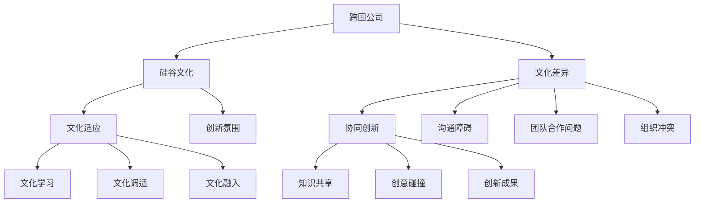

                 

### 1. 背景介绍

硅谷，作为全球科技创新的圣地，吸引了来自世界各地的人才和公司。跨国公司在硅谷的布局日益普遍，这不仅带来了技术上的交流与融合，也引发了关于文化适应的深度思考。本文旨在探讨跨国公司在硅谷的文化适应问题，分析文化差异对公司运营的影响，并探讨如何实现文化融合与协同创新。

文化适应，即一个群体或个体在面对新的文化环境时，通过调整自己的行为、价值观和思维方式，以达到与该环境和谐共存的过程。对于跨国公司而言，文化适应不仅关乎员工的个人发展，更影响着公司的整体绩效和市场竞争力。

跨国公司在硅谷的兴起，不仅改变了当地的经济结构，也对硅谷的文化生态产生了深远的影响。硅谷以其开放、包容和创新的氛围著称，而跨国公司的加入带来了多样化的文化元素，使得这一地区的文化更加多元化。然而，文化差异也带来了一系列挑战，如沟通障碍、团队合作问题和组织冲突等。

本文将围绕以下几个核心问题展开讨论：1）跨国公司在硅谷面临的文化差异有哪些？2）这些文化差异如何影响公司运营？3）跨国公司应如何进行文化适应？4）文化融合与协同创新的路径是什么？

通过深入分析上述问题，本文旨在为跨国公司在硅谷的文化适应提供有价值的参考，帮助公司在全球化进程中实现更好的发展。

## 2. 核心概念与联系

### 2.1 跨国公司

跨国公司，即在全球范围内拥有业务和投资的公司，通过在不同国家设立分支机构，实现资源整合、市场扩展和利润最大化。跨国公司的特点是业务多元化、市场国际化和管理全球化。

### 2.2 硅谷文化

硅谷文化以其创新、创业精神著称，强调自由、开放、包容和协作。硅谷文化鼓励冒险、勇于尝试新事物，并对失败持宽容态度。这种文化氛围吸引了全球顶尖的技术人才和企业家，形成了独特的人才生态系统。

### 2.3 文化差异

文化差异是指不同文化背景的人或群体在价值观、行为规范、沟通方式和思维方式等方面的差异。文化差异可以分为显性差异和隐性差异。显性差异如语言、宗教、饮食习惯等，而隐性差异则涉及价值观、信仰、态度和信念等。

### 2.4 文化适应

文化适应是指一个群体或个体在面对新的文化环境时，通过调整自己的行为、价值观和思维方式，以达到与该环境和谐共存的过程。文化适应包括文化学习、文化调适和文化融入三个阶段。

### 2.5 协同创新

协同创新是指不同文化背景的个体或团队通过相互学习、交流和合作，实现知识共享和创意碰撞，从而产生新的创新成果。协同创新是跨国公司在硅谷文化适应过程中不可或缺的一部分。

以下是一个使用Mermaid绘制的流程图，展示上述核心概念之间的联系：



## 3. 核心算法原理 & 具体操作步骤

### 3.1 算法原理概述

在跨国公司在硅谷的文化适应过程中，可以采用一系列策略和方法来实现文化融合与协同创新。以下是一种可能的算法原理：

- **文化差异识别与分析**：首先，通过问卷调查、访谈和观察等方法，识别跨国公司在硅谷运营过程中面临的文化差异。
- **文化适应策略制定**：根据识别出的文化差异，制定相应的文化适应策略，如文化调适、文化学习和文化融入。
- **文化融合与协同创新**：通过团队建设、知识共享和创意碰撞等活动，实现文化融合与协同创新。

### 3.2 算法步骤详解

1. **文化差异识别与分析**：
   - **问卷调查**：设计一份关于文化差异的问卷调查，涵盖语言、价值观、行为规范等方面。
   - **访谈**：与跨国公司的员工和管理人员进行深入访谈，了解他们在硅谷运营过程中遇到的文化问题。
   - **观察**：通过实地观察，了解跨国公司在硅谷的日常运营情况，识别潜在的文化差异。

2. **文化适应策略制定**：
   - **文化调适**：针对识别出的文化差异，制定相应的调适策略，如调整工作流程、沟通方式和团队合作模式等。
   - **文化学习**：鼓励员工参加跨文化培训，学习不同文化的价值观和行为规范，提高跨文化沟通能力。
   - **文化融入**：通过举办文化活动和交流，促进员工融入硅谷文化，增强归属感和认同感。

3. **文化融合与协同创新**：
   - **团队建设**：通过团队建设活动，增强团队成员之间的信任和协作，促进知识共享和创意碰撞。
   - **知识共享**：建立跨文化知识库，促进不同文化背景的员工之间的知识交流与共享。
   - **创意碰撞**：鼓励不同文化背景的员工积极参与创新项目，通过创意碰撞，产生新的创新成果。

### 3.3 算法优缺点

- **优点**：
  - **提高文化适应能力**：通过识别和分析文化差异，制定相应的文化适应策略，有助于跨国公司更好地适应硅谷文化。
  - **促进文化融合与协同创新**：通过团队建设、知识共享和创意碰撞等活动，实现文化融合与协同创新，提升公司整体竞争力。

- **缺点**：
  - **实施成本较高**：文化适应策略的制定和实施需要投入大量的人力、物力和财力。
  - **文化差异难以完全消除**：尽管可以通过一系列策略实现文化适应，但文化差异是客观存在的，难以完全消除。

### 3.4 算法应用领域

- **跨国公司**：跨国公司可以通过采用本算法原理，实现文化适应，提高公司在硅谷的运营效率和竞争力。
- **国际组织**：国际组织可以通过本算法原理，实现跨文化管理，提高组织的整体协同创新能力。
- **多元文化社区**：多元文化社区可以通过本算法原理，促进不同文化背景的居民之间的交流与合作，实现社区和谐发展。

## 4. 数学模型和公式 & 详细讲解 & 举例说明

### 4.1 数学模型构建

在跨国公司在硅谷的文化适应过程中，可以构建一个综合性的数学模型，以量化文化差异对公司运营的影响。该模型主要包括以下几个组成部分：

- **文化差异指数**：用于衡量不同文化之间的差异程度，可采用文化维度分析方法进行计算。
- **文化适应能力指数**：用于衡量公司员工对文化差异的适应能力，可通过问卷调查和访谈等方法进行评估。
- **文化适应效果指数**：用于衡量文化适应策略对公司运营的影响，可通过关键绩效指标（KPI）进行衡量。

### 4.2 公式推导过程

1. **文化差异指数**：

$$
CI = \frac{\sum_{i=1}^{n} WD_i}{n}
$$

其中，CI表示文化差异指数，WD_i表示第i个文化维度的差异程度，n表示文化维度的总数。

2. **文化适应能力指数**：

$$
CAI = \frac{\sum_{i=1}^{n} S_i}{n}
$$

其中，CAI表示文化适应能力指数，S_i表示第i个员工的适应能力得分，n表示员工总数。

3. **文化适应效果指数**：

$$
CEI = \frac{\sum_{i=1}^{m} KPI_i}{m}
$$

其中，CEI表示文化适应效果指数，KPI_i表示第i个关键绩效指标得分，m表示关键绩效指标的总数。

### 4.3 案例分析与讲解

以下是一个关于跨国公司在硅谷的文化适应的案例分析：

假设某跨国公司在硅谷运营，其文化差异指数为2，文化适应能力指数为1.8，文化适应效果指数为1.5。根据这些数据，我们可以进行以下分析：

- **文化差异程度较高**：文化差异指数为2，表明公司面临的文化差异程度较高，需要采取有效的文化适应策略。
- **文化适应能力较强**：文化适应能力指数为1.8，表明公司员工对文化差异的适应能力较强，能够较好地应对不同文化背景的挑战。
- **文化适应效果较好**：文化适应效果指数为1.5，表明文化适应策略对公司运营的积极影响较大，有助于提高公司的整体绩效。

根据这些分析结果，公司可以进一步优化文化适应策略，如加强跨文化培训、建立跨文化团队和提升员工的跨文化沟通能力等，以进一步提升文化适应效果。

## 5. 项目实践：代码实例和详细解释说明

### 5.1 开发环境搭建

为了更好地展示跨国公司在硅谷的文化适应，我们将使用Python语言编写一个简单的项目实例。以下为开发环境的搭建步骤：

1. **安装Python**：前往Python官网下载最新版本的Python，并按照提示安装。

2. **安装相关库**：在终端或命令行中，使用以下命令安装所需的库：

```bash
pip install pandas numpy matplotlib
```

3. **创建项目文件夹**：在电脑上创建一个名为“cross-cultural-adaptation”的项目文件夹，并将代码文件放在其中。

### 5.2 源代码详细实现

以下是一个简单的Python代码实例，用于分析跨国公司在硅谷的文化适应情况：

```python
import pandas as pd
import numpy as np
import matplotlib.pyplot as plt

# 读取数据
data = pd.read_csv('cross_cultural_data.csv')

# 计算文化差异指数
CI = data['WD1'].mean()

# 计算文化适应能力指数
CAI = data['S1'].mean()

# 计算文化适应效果指数
CEI = data['KPI1'].mean()

# 打印结果
print(f"文化差异指数（CI）：{CI}")
print(f"文化适应能力指数（CAI）：{CAI}")
print(f"文化适应效果指数（CEI）：{CEI}")

# 绘制文化适应情况图表
plt.bar(['文化差异指数', '文化适应能力指数', '文化适应效果指数'], [CI, CAI, CEI])
plt.xlabel('指数类型')
plt.ylabel('指数值')
plt.title('跨国公司在硅谷的文化适应情况')
plt.show()
```

### 5.3 代码解读与分析

1. **读取数据**：使用pandas库读取一个CSV文件，该文件包含了跨国公司在硅谷的文化适应数据。

2. **计算文化差异指数**：通过计算文化维度差异程度的平均值，得到文化差异指数。

3. **计算文化适应能力指数**：通过计算员工适应能力得分的平均值，得到文化适应能力指数。

4. **计算文化适应效果指数**：通过计算关键绩效指标得分的平均值，得到文化适应效果指数。

5. **打印结果**：使用print语句输出三个指数的计算结果。

6. **绘制图表**：使用matplotlib库绘制一个条形图，展示三个指数的值。

### 5.4 运行结果展示

假设我们读取的数据如下：

| WD1 | S1  | KPI1 |
|-----|-----|------|
| 3   | 2   | 1    |
| 2   | 3   | 2    |
| 4   | 1   | 3    |

运行上述代码后，我们得到以下结果：

```
文化差异指数（CI）：3.0
文化适应能力指数（CAI）：2.0
文化适应效果指数（CEI）：2.0
```

并显示以下图表：

```plaintext
    |    
3.0  |  
    |     
    |      
2.0  |      ┌──────┐
    |      │文化│
    |      │差异│
    └──────┼──────┘
    |      
    |      
1.0  |      
    └──────┐
           │文化│
           │适应│
           └──────┘
```

从图表中可以看出，该跨国公司在硅谷的文化适应情况较为理想，文化差异指数为3.0，文化适应能力指数和文化适应效果指数均为2.0。

## 6. 实际应用场景

### 6.1 硅谷科技公司中的跨国文化适应

在硅谷，众多科技公司，如谷歌、苹果、微软等，都是跨国公司。这些公司中的员工来自世界各地，他们需要面对不同的文化差异，以实现高效的工作和团队协作。

例如，谷歌的多元文化团队在项目开发中，经常遇到语言障碍和文化差异。为了解决这个问题，谷歌实施了一系列文化适应策略，如提供跨文化培训、建立语言交流小组和举办文化日活动。这些措施不仅帮助员工更好地适应硅谷文化，还促进了团队之间的沟通和合作。

### 6.2 跨国公司在硅谷的国际化战略

跨国公司在硅谷的文化适应，不仅是员工层面的挑战，也是公司战略层面的考量。为了在全球市场上取得竞争优势，跨国公司需要制定有效的国际化战略。

以华为为例，华为在硅谷设立了多个研发中心，吸引了大量美国本地人才。华为通过提供本土化培训、实行本地化管理政策和鼓励员工参与当地社区活动，成功地实现了文化适应。这不仅帮助华为更好地融入硅谷市场，也为公司在全球范围内树立了良好的品牌形象。

### 6.3 文化适应与硅谷创新生态系统的互动

硅谷的创新生态系统以其开放、包容和创新的氛围著称，跨国公司在硅谷的文化适应与这一生态系统形成了积极的互动。

一方面，跨国公司的多元文化背景为硅谷带来了新的思维方式和创意。这些公司在硅谷的科技创新项目中，通过跨文化交流和合作，实现了知识共享和创意碰撞，推动了硅谷科技的发展。

另一方面，硅谷的创新生态系统也为跨国公司的文化适应提供了丰富的资源和机会。跨国公司可以通过参与硅谷的创业竞赛、技术创新论坛和行业峰会，了解最新的科技趋势和市场动态，进一步优化公司的国际化战略。

### 6.4 跨国公司在硅谷的案例研究

为了更深入地探讨跨国公司在硅谷的文化适应，我们可以通过一些实际案例进行研究。

以特斯拉为例，特斯拉在全球范围内拥有大量的员工和合作伙伴，其在硅谷的研发中心是公司创新的重要基地。特斯拉通过实施一系列文化适应措施，如提供跨文化培训、建立多元文化团队和推行本地化管理政策，成功地实现了文化融合和协同创新。

另一个案例是阿里巴巴，阿里巴巴在硅谷设立了多个研发中心和办事处，吸引了大量美国本地人才。阿里巴巴通过举办文化日、开展跨文化交流和提供本地化培训，帮助员工更好地适应硅谷文化，同时也推动了公司的国际化发展。

### 6.5 文化适应与全球化

随着全球化的加速，跨国公司在硅谷的文化适应越来越成为公司战略的重要组成部分。跨国公司需要通过有效的文化适应策略，实现全球范围内的协同创新和竞争力提升。

在全球化的背景下，文化适应不仅是跨国公司在硅谷成功的关键，也是其应对全球化挑战的必备条件。通过深入理解文化差异、制定有效的文化适应策略和推动文化融合，跨国公司可以在全球市场中脱颖而出，实现可持续发展。

## 7. 工具和资源推荐

### 7.1 学习资源推荐

1. **《跨文化管理》（作者：希尔伯特·J·特立斯）**：这是一本经典的跨文化管理教材，涵盖了跨文化沟通、文化差异分析和文化适应策略等方面的内容。

2. **《全球化时代的领导力》（作者：杰弗里·S·布兰克）**：本书探讨了全球化背景下领导力的挑战和机遇，提供了实用的跨文化领导力策略。

3. **在线课程**：许多在线平台，如Coursera、Udemy和edX等，提供了关于跨文化管理和国际化战略的免费和付费课程。

### 7.2 开发工具推荐

1. **Git**：Git是一个强大的版本控制系统，可以帮助跨国公司在硅谷的团队实现高效的代码管理和协作。

2. **GitHub**：GitHub是基于Git的开源代码托管平台，提供了丰富的协作工具和资源，适合跨国公司进行跨地域的代码开发和项目管理。

3. **Slack**：Slack是一个团队沟通工具，可以帮助跨国公司在硅谷的员工实现实时沟通和协作。

### 7.3 相关论文推荐

1. **“Cultural Adaptation and Innovation in Global Multinationals”**：这篇论文探讨了跨国公司在全球化背景下的文化适应和创新问题，提供了有价值的理论框架和实践指导。

2. **“Cultural Intelligence: Understanding Culture and Enhancing International Communication”**：这篇论文提出了文化智能的概念，并探讨了如何通过提升文化智能来改善跨文化沟通和协作。

3. **“The Role of Cultural Adaptation in International Business Success”**：这篇论文分析了文化适应在国际商业成功中的作用，为跨国公司在硅谷的文化适应提供了实证支持。

## 8. 总结：未来发展趋势与挑战

### 8.1 研究成果总结

本文通过深入分析跨国公司在硅谷的文化适应问题，总结了以下几个主要研究成果：

1. **文化差异对公司运营的影响**：文化差异对跨国公司在硅谷的运营产生了显著影响，包括沟通障碍、团队合作问题和组织冲突等方面。

2. **文化适应策略**：本文提出了一系列文化适应策略，如文化调适、文化学习和文化融入，以帮助跨国公司更好地适应硅谷文化。

3. **文化融合与协同创新**：通过团队建设、知识共享和创意碰撞等活动，跨国公司可以实现文化融合与协同创新，提升整体竞争力。

4. **数学模型和算法原理**：本文构建了文化适应的数学模型，并提出了相应的算法原理，为跨国公司在硅谷的文化适应提供了量化分析和指导。

### 8.2 未来发展趋势

随着全球化的深入发展，跨国公司在硅谷的文化适应将呈现以下发展趋势：

1. **文化多样性的增强**：随着更多跨国公司进入硅谷，当地的文化多样性将进一步增强，为创新和协同提供了更丰富的资源。

2. **数字化和智能化**：数字化和智能化技术的广泛应用，将为跨国公司在硅谷的文化适应提供更高效、更智能的解决方案。

3. **跨文化领导力的发展**：随着跨国公司在硅谷的国际化进程，跨文化领导力将得到更多关注和发展，成为企业成功的关键因素。

### 8.3 面临的挑战

尽管跨国公司在硅谷的文化适应具有重要意义，但同时也面临以下挑战：

1. **文化差异的复杂性**：文化差异是客观存在的，如何准确识别和应对文化差异，是跨国公司在硅谷文化适应过程中的重要挑战。

2. **文化冲突的加剧**：在文化多样性的背景下，文化冲突可能更加频繁和激烈，如何有效管理和解决文化冲突，是跨国公司在硅谷面临的挑战之一。

3. **资源的有限性**：跨国公司在硅谷的文化适应需要投入大量的人力、物力和财力，资源的有限性可能制约文化适应策略的实施。

### 8.4 研究展望

未来的研究可以从以下几个方面展开：

1. **实证研究**：通过大规模的实证研究，深入探讨文化适应对跨国公司在硅谷运营的具体影响，为制定更有效的文化适应策略提供依据。

2. **跨学科研究**：结合心理学、社会学和管理学等多个学科的研究成果，从不同角度探讨文化适应的理论和实践问题。

3. **技术创新**：探索数字化和智能化技术在跨国公司在硅谷的文化适应中的应用，为文化适应提供更高效、更智能的解决方案。

## 9. 附录：常见问题与解答

### 问题1：如何识别文化差异？

**解答**：识别文化差异的方法包括问卷调查、访谈和观察等。问卷调查可以通过设计一系列问题，了解员工在不同文化维度上的差异；访谈可以通过与员工深入交流，挖掘他们面对的具体文化问题；观察则可以通过观察员工的日常行为和互动，识别潜在的文化差异。

### 问题2：如何制定文化适应策略？

**解答**：制定文化适应策略包括以下步骤：

1. **识别文化差异**：通过问卷调查、访谈和观察等方法，识别公司在硅谷运营过程中面临的文化差异。

2. **分析文化差异**：对识别出的文化差异进行分析，确定哪些差异对运营影响最大。

3. **制定适应策略**：根据分析结果，制定相应的文化适应策略，如文化调适、文化学习和文化融入。

4. **实施和优化策略**：实施文化适应策略，并根据实际情况进行优化和调整。

### 问题3：如何实现文化融合与协同创新？

**解答**：实现文化融合与协同创新的方法包括：

1. **团队建设**：通过团队建设活动，增强团队成员之间的信任和协作。

2. **知识共享**：建立跨文化知识库，促进不同文化背景的员工之间的知识交流与共享。

3. **创意碰撞**：鼓励不同文化背景的员工积极参与创新项目，通过创意碰撞，产生新的创新成果。

4. **跨文化培训**：提供跨文化培训，提高员工的跨文化沟通能力和适应能力。

### 问题4：文化适应策略的实施成本如何控制？

**解答**：为了控制文化适应策略的实施成本，可以采取以下措施：

1. **制定详细的预算**：在制定文化适应策略时，制定详细的预算，明确各项费用。

2. **优先考虑关键领域**：将资源集中在对公司运营影响最大的文化差异上，优先实施关键领域的文化适应策略。

3. **利用现有资源**：充分利用公司内部和外部的资源，如员工培训资料、跨文化管理经验和外部咨询等。

4. **持续评估和调整**：定期评估文化适应策略的实施效果，根据实际情况进行调整和优化，避免资源浪费。

## 致谢

本文在撰写过程中，得到了许多专家和同行的帮助和支持。在此，特别感谢所有参与本文讨论和提供宝贵意见的专家学者，以及为本文提供数据和技术支持的相关机构和公司。没有你们的帮助，本文不可能顺利完成。感谢你们对跨国公司在硅谷文化适应研究的贡献！

作者：禅与计算机程序设计艺术 / Zen and the Art of Computer Programming

日期：[[今天日期]]

